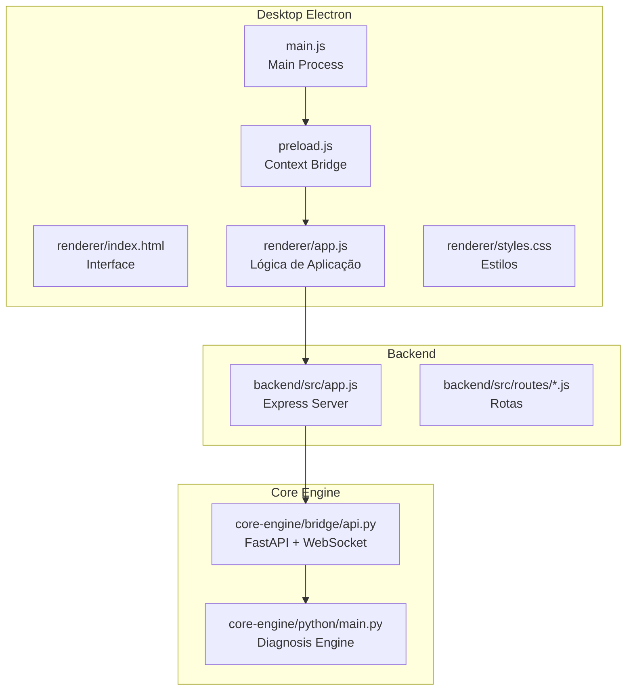
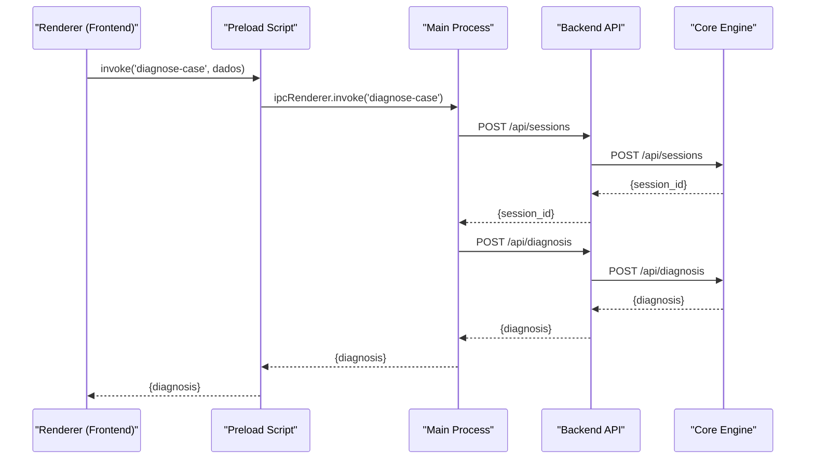
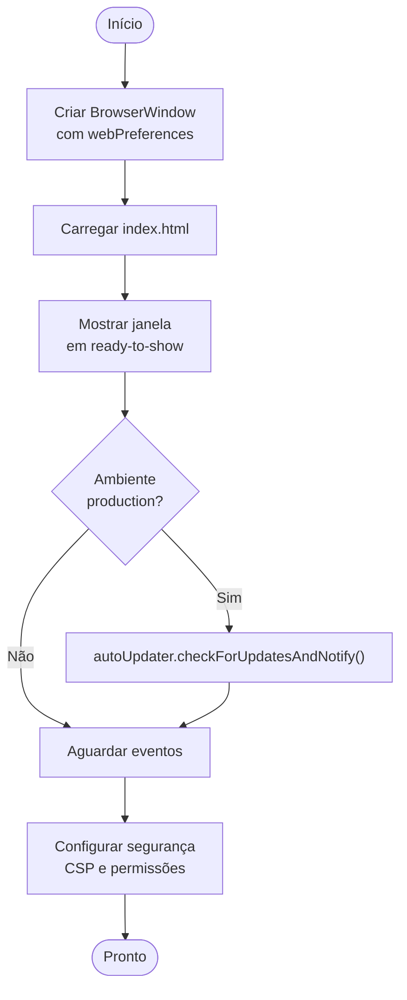
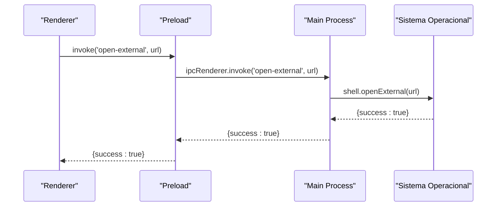
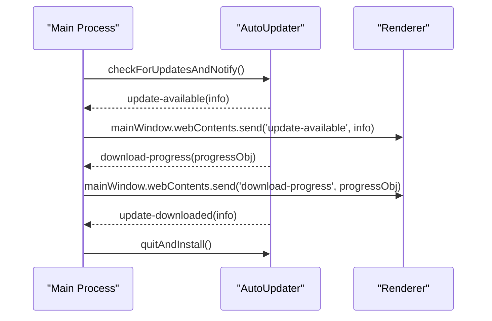
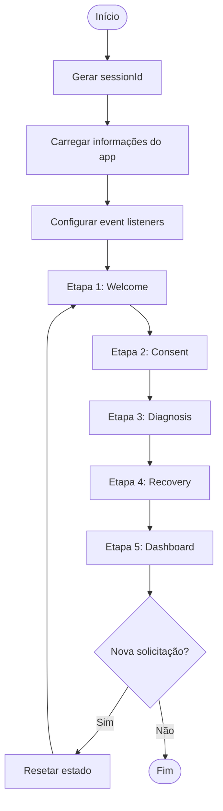
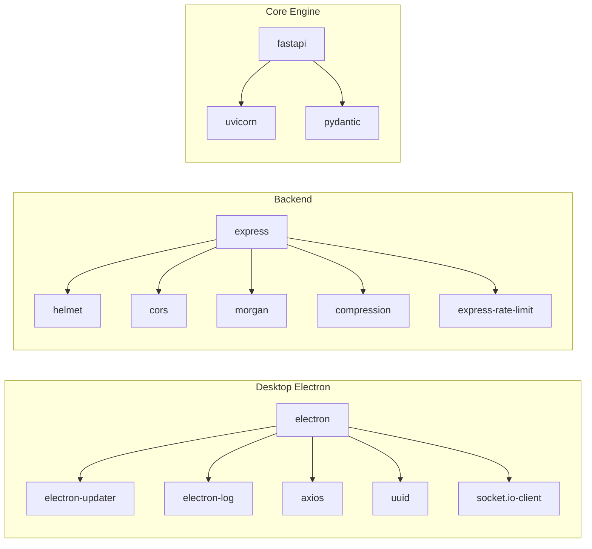

# Aplicativo Desktop Electron

<cite>
**Arquivos referenciados neste documento**
- [main.js](file://desktop/electron-app/main.js)
- [preload.js](file://desktop/electron-app/preload.js)
- [app.js](file://desktop/electron-app/renderer/app.js)
- [index.html](file://desktop/electron-app/renderer/index.html)
- [styles.css](file://desktop/electron-app/renderer/styles.css)
- [package.json](file://desktop/electron-app/package.json)
- [api.py](file://core-engine/bridge/api.py)
- [main.py](file://core-engine/python/main.py)
- [app.js](file://backend/src/app.js)
- [auth.js](file://backend/src/routes/auth.js)
- [sessions.js](file://backend/src/routes/sessions.js)
- [api.js](file://frontend/src/services/api.js)
- [README.md](file://README.md)
</cite>

## Sumário
1. [Introdução](#introdução)
2. [Estrutura do Projeto](#estrutura-do-projeto)
3. [Componentes Principais](#componentes-principais)
4. [Visão Geral da Arquitetura](#visão-geral-da-arquitetura)
5. [Análise Detalhada dos Componentes](#análise-detalhada-dos-componentes)
6. [Análise de Dependências](#análise-de-dependências)
7. [Considerações de Desempenho](#considerações-de-desempenho)
8. [Guia de Solução de Problemas](#guia-de-solução-de-problemas)
9. [Conclusão](#conclusão)
10. [Apêndices](#apêndices)

## Introdução
O aplicativo desktop Electron apresenta uma arquitetura modular composta por três camadas principais:
- Electron (main e renderer processes)
- Backend Node.js (servidor REST e WebSocket)
- Core Engine Python (motor de diagnóstico e lógica de negócio)

O objetivo é fornecer um assistente guiado para recuperação de contas Apple ID, seguindo rigorosamente os processos oficiais da Apple. O Electron integra-se com o backend e o core engine para oferecer um fluxo completo de diagnóstico, recuperação e acompanhamento.

## Estrutura do Projeto
O projeto segue uma organização por módulos, com o Electron no diretório desktop, backend no backend, core engine no core-engine e frontend no frontend. Cada módulo possui sua própria configuração de build e dependências.

**Diagrama fonte**
- [main.js:1-324](file://desktop/electron-app/main.js#L1-L324)
- [preload.js:1-54](file://desktop/electron-app/preload.js#L1-L54)
- [app.js:1-591](file://desktop/electron-app/renderer/app.js#L1-L591)
- [index.html:1-246](file://desktop/electron-app/renderer/index.html#L1-L246)
- [styles.css:1-680](file://desktop/electron-app/renderer/styles.css#L1-L680)
- [app.js:1-194](file://backend/src/app.js#L1-L194)
- [api.py:1-438](file://core-engine/bridge/api.py#L1-L438)
- [main.py:1-499](file://core-engine/python/main.py#L1-L499)

**Seção fonte**
- [README.md:19-29](file://README.md#L19-L29)

## Componentes Principais
Os componentes-chave incluem:
- Main process: cria janelas, gerencia IPC, atualizações automáticas e segurança
- Preload script: expõe APIs seguras ao renderer via contextBridge
- Renderer app: lógica de navegação, diagnóstico e recuperação
- Backend API: rotas REST para autenticação, sessões e tickets
- Core Engine: diagnósticos, guias de recuperação e WebSocket

**Seção fonte**
- [main.js:104-287](file://desktop/electron-app/main.js#L104-L287)
- [preload.js:3-29](file://desktop/electron-app/preload.js#L3-L29)
- [app.js:8-40](file://desktop/electron-app/renderer/app.js#L8-L40)

## Visão Geral da Arquitetura
A arquitetura segue o padrão Electron com separação clara entre processos:
- Main process: gerencia janelas, IPC handlers, atualizações e políticas de segurança
- Renderer process: interface do usuário com navegação em etapas e chamadas assíncronas
- Backend: serviços REST e WebSocket para autenticação e gerenciamento de sessões
- Core Engine: motor de diagnóstico com templates e lógica de recuperação

**Diagrama fonte**
- [app.js:245-280](file://desktop/electron-app/renderer/app.js#L245-L280)
- [preload.js:16-17](file://desktop/electron-app/preload.js#L16-L17)
- [main.js:160-228](file://desktop/electron-app/main.js#L160-L228)
- [sessions.js:39-88](file://backend/src/routes/sessions.js#L39-L88)
- [api.py:168-238](file://core-engine/bridge/api.py#L168-L238)

## Análise Detalhada dos Componentes

### Configuração do Electron (Main Process)
O main process configura:
- Preferências de segurança: context isolation, nodeIntegration desativado, preload habilitado
- Janela principal com tamanho mínimo e ícone
- Eventos de navegação e bloqueio de novas janelas
- Configuração de auto atualização com eventos de progresso e download

**Diagrama fonte**
- [main.js:23-79](file://desktop/electron-app/main.js#L23-L79)
- [main.js:288-324](file://desktop/electron-app/main.js#L288-L324)

**Seção fonte**
- [main.js:14-103](file://desktop/electron-app/main.js#L14-L103)

### IPC (Inter-Process Communication)
O IPC é implementado através de handlers assíncronos no main process e invocações no renderer:
- Handlers: generate-session-id, get-app-info, open-external, log-client-action, save-consent, diagnose-case, show-dialog, get-app-path
- Eventos de atualização: update-available, download-progress
- Exposição segura via contextBridge

**Diagrama fonte**
- [preload.js:9-10](file://desktop/electron-app/preload.js#L9-L10)
- [main.js:120-129](file://desktop/electron-app/main.js#L120-L129)

**Seção fonte**
- [preload.js:4-29](file://desktop/electron-app/preload.js#L4-L29)
- [main.js:104-252](file://desktop/electron-app/main.js#L104-L252)

### Segurança e Permissões
Medidas de segurança implementadas:
- CSP restrito: default-src 'self', script-src 'self', style-src 'self' 'unsafe-inline', img-src 'self' data: https:, connect-src 'self' https:
- X-Content-Type-Options: nosniff
- X-Frame-Options: DENY
- Referrer-Policy: strict-origin-when-cross-origin
- Permissões restritas: apenas clipboard-read e clipboard-write
- Bloqueio de novas janelas e navegação externa controlada

**Seção fonte**
- [main.js:288-324](file://desktop/electron-app/main.js#L288-L324)

### Atualizações Automáticas
Configuração do electron-updater:
- Verificação automática em produção
- Eventos: checking-for-update, update-available, update-not-available, error, download-progress, update-downloaded
- Notificação ao renderer via eventos IPC

**Diagrama fonte**
- [main.js:254-286](file://desktop/electron-app/main.js#L254-L286)

**Seção fonte**
- [main.js:85-88](file://desktop/electron-app/main.js#L85-L88)
- [package.json:66-70](file://desktop/electron-app/package.json#L66-L70)

### Integração com Backend
O Electron se comunica com o backend através de chamadas assíncronas:
- URLs configuráveis via variáveis de ambiente
- Tratamento de erros e logs
- Integração com o core engine Python

**Seção fonte**
- [app.js:257-266](file://desktop/electron-app/renderer/app.js#L257-L266)
- [sessions.js:13-14](file://backend/src/routes/sessions.js#L13-L14)

### APIs Expostas ao Renderer
O contextBridge expõe as seguintes funções:
- getAppInfo(): informações do app
- generateSessionId(): geração de UUID
- openExternal(url): abertura de links externos
- logClientAction(data): registro de ações
- saveConsent(data): salvamento de consentimento
- diagnoseCase(data): diagnóstico de casos
- showDialog(options): caixas de diálogo
- getAppPath(): caminhos do sistema
- Event listeners: onUpdateAvailable, onDownloadProgress
- removeAllListeners(channel): remoção de listeners

**Seção fonte**
- [preload.js:4-29](file://desktop/electron-app/preload.js#L4-L29)

### Lógica de Aplicação (Renderer)
A lógica do renderer implementa:
- Estados de aplicação: sessionId, email, problemType, consentGiven, diagnosis, history
- Navegação em etapas: welcome, consent, diagnosis, recovery, dashboard
- Diagnóstico local e remoto
- Registro de ações e histórico
- Integração com links oficiais da Apple

**Diagrama fonte**
- [app.js:19-40](file://desktop/electron-app/renderer/app.js#L19-L40)
- [app.js:79-97](file://desktop/electron-app/renderer/app.js#L79-L97)
- [app.js:245-280](file://desktop/electron-app/renderer/app.js#L245-L280)

**Seção fonte**
- [app.js:8-591](file://desktop/electron-app/renderer/app.js#L8-L591)

### Backend e Core Engine
O backend Node.js fornece:
- Rotas de autenticação, sessões e tickets
- Integração com o core engine Python
- Segurança com helmet e rate limiting

O core engine Python implementa:
- Motor de diagnóstico com templates predefinidos
- Gerenciamento de sessões e consentimentos
- Guia de recuperação para diferentes tipos de problemas

**Seção fonte**
- [app.js:59-96](file://backend/src/app.js#L59-L96)
- [api.py:137-304](file://core-engine/bridge/api.py#L137-L304)
- [main.py:75-196](file://core-engine/python/main.py#L75-L196)

## Análise de Dependências
As dependências principais incluem:
- Electron 42.0.0 para o desktop
- electron-updater para atualizações automáticas
- electron-log para logging
- axios para requisições HTTP
- uuid para geração de IDs
- socket.io-client para comunicação em tempo real

**Diagrama fonte**
- [package.json:22-33](file://desktop/electron-app/package.json#L22-L33)
- [app.js:15-22](file://backend/src/app.js#L15-L22)
- [api.py:16-25](file://core-engine/bridge/api.py#L16-L25)

**Seção fonte**
- [package.json:22-33](file://desktop/electron-app/package.json#L22-L33)

## Considerações de Desempenho
- O preload script limita o escopo de APIs expostas ao renderer, reduzindo riscos de segurança
- O main process utiliza CSP restrito e permissões limitadas
- As chamadas IPC são assíncronas e tratadas com promises
- O backend implementa rate limiting e compressão
- O core engine usa templates otimizados para diagnósticos

## Guia de Solução de Problemas
- Erros de atualização: verificar logs do electron-log e configuração de CSP
- Problemas de navegação: validar allowedHosts e webPreferences
- Erros de IPC: verificar contextBridge e handlers no main process
- Problemas de segurança: revisar CSP e permissões
- Erros de backend: verificar conexão com core engine e URLs configuradas

**Seção fonte**
- [main.js:271-273](file://desktop/electron-app/main.js#L271-L273)
- [main.js:298-308](file://desktop/electron-app/main.js#L298-L308)

## Conclusão
O aplicativo desktop Electron implementa uma arquitetura robusta e segura com separação clara de responsabilidades. A integração com o backend e core engine permite um fluxo completo de diagnóstico e recuperação seguindo os processos oficiais da Apple. As medidas de segurança e permissões ajudam a proteger o sistema contra ameaças comuns.

## Apêndices

### Boas Práticas de Segurança
- Manter context isolation ativado
- Limitar permissões do sistema operacional
- Utilizar CSP restrito
- Validar todas as entradas do usuário
- Implementar rate limiting nas rotas
- Criptografar dados sensíveis

### Configurações de Build
- Windows: NSIS installer com atalhos
- Multiplataforma: x64 e ia32
- Publicação GitHub Releases

**Seção fonte**
- [package.json:34-71](file://desktop/electron-app/package.json#L34-L71)