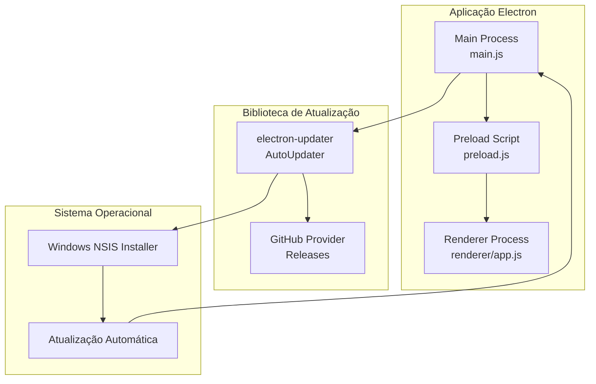
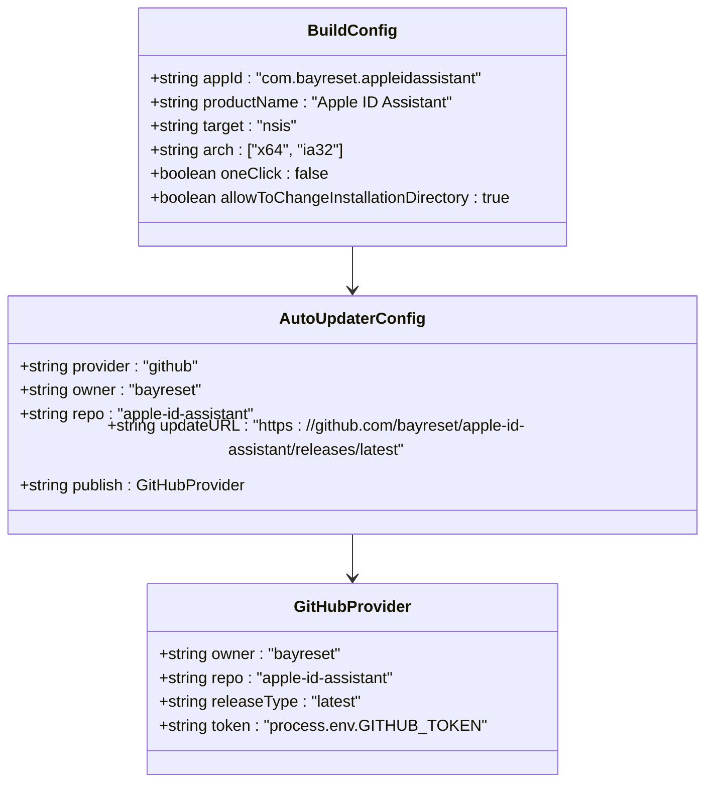
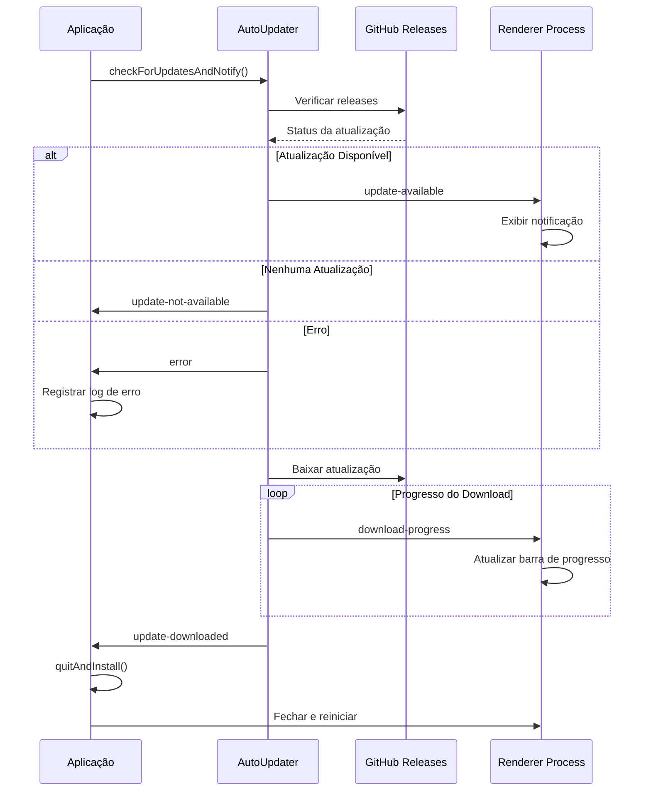
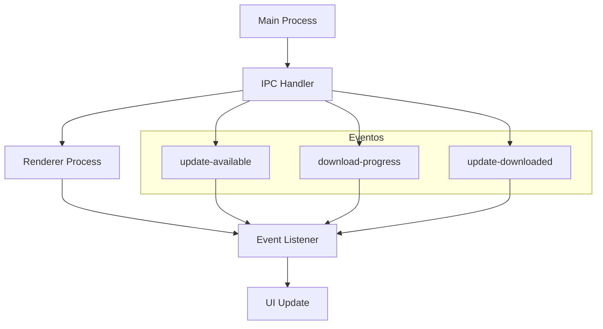
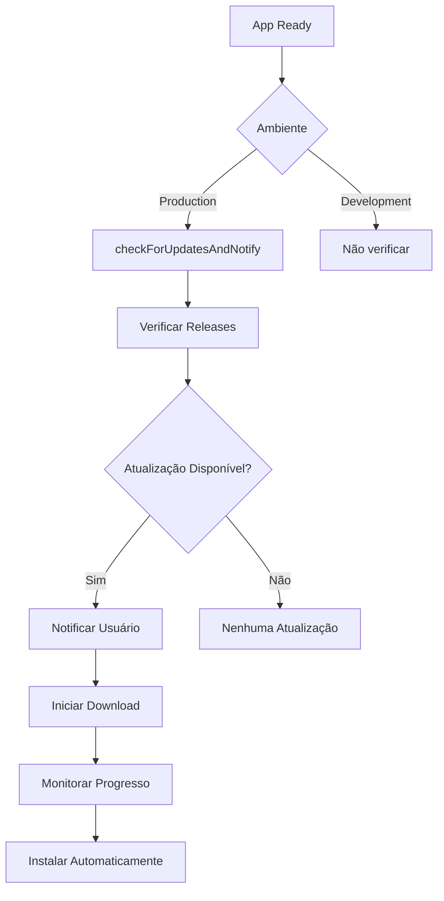
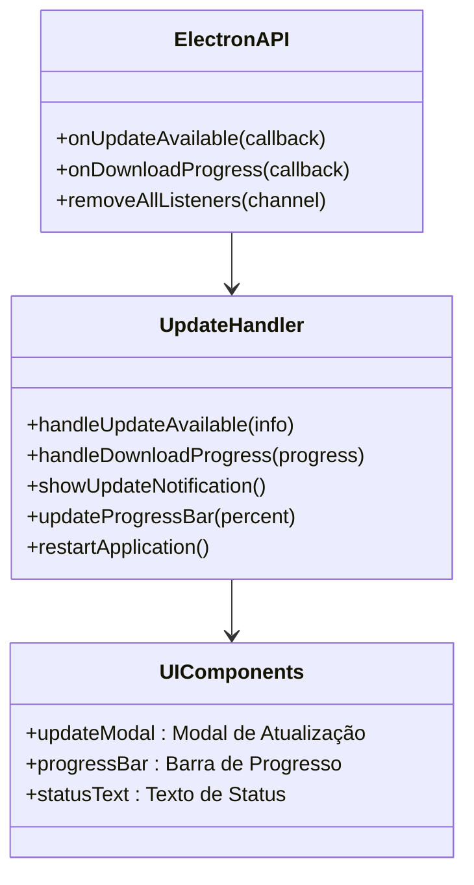
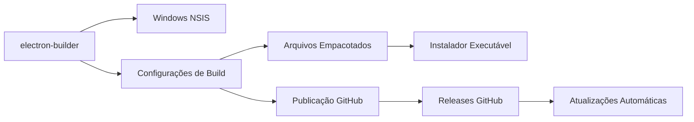
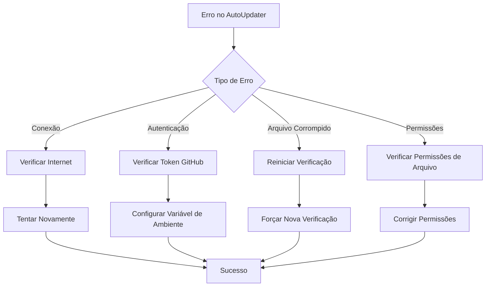
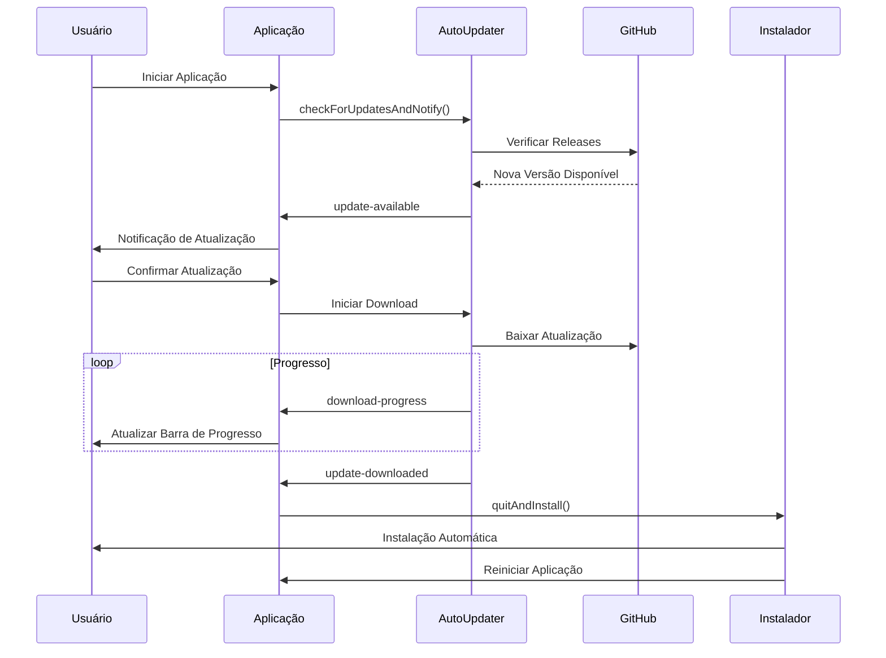
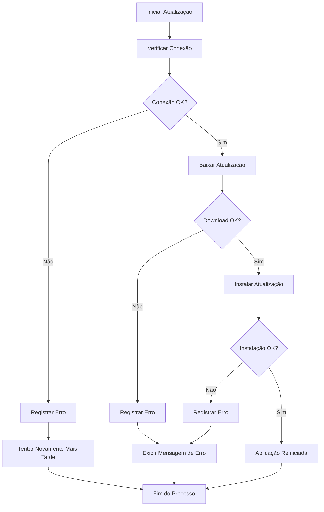

# Atualizações Automáticas

<cite>
**Arquivos Referenciados neste Documento**
- [package.json](file://desktop/electron-app/package.json)
- [main.js](file://desktop/electron-app/main.js)
- [preload.js](file://desktop/electron-app/preload.js)
- [app.js](file://desktop/electron-app/renderer/app.js)
- [README.md](file://README.md)
</cite>

## Sumário
- **Objetivo**: Documentar o sistema de atualizações automáticas baseado em electron-updater
- **Escopo**: Implementação completa, eventos, notificação ao renderer, tratamento de erros e configurações de build
- **Plataformas**: Windows (NSIS), com possibilidade de extensão para outras plataformas

## Introdução

O sistema de atualizações automáticas do Apple ID Assistant utiliza a biblioteca electron-updater para fornecer atualizações transparentes e seguras para os usuários finais. O sistema foi projetado para funcionar de forma totalmente automática em produção, com notificação proativa ao usuário durante todo o processo de atualização.

## Arquitetura do Sistema de Atualizações

**Fontes**: 
- [main.js:254-286](file://desktop/electron-app/main.js#L254-L286)
- [package.json:34-71](file://desktop/electron-app/package.json#L34-L71)

## Componentes Principais

### 1. Configuração do electron-updater

O electron-updater é configurado através do arquivo de build do electron-builder:

**Fontes**: 
- [package.json:66-70](file://desktop/electron-app/package.json#L66-L70)
- [package.json:34-65](file://desktop/electron-app/package.json#L34-L65)

### 2. Eventos do AutoUpdater

O sistema implementa os seguintes eventos principais:

**Fontes**: 
- [main.js:256-286](file://desktop/electron-app/main.js#L256-L286)
- [preload.js:23-25](file://desktop/electron-app/preload.js#L23-L25)

### 3. Comunicação IPC

**Fontes**: 
- [main.js:256-286](file://desktop/electron-app/main.js#L256-L286)
- [preload.js:23-25](file://desktop/electron-app/preload.js#L23-L25)

## Implementação Detalhada

### 1. Inicialização do Sistema

O sistema é inicializado no processo principal com verificação automática em produção:

**Fontes**: 
- [main.js:82-89](file://desktop/electron-app/main.js#L82-L89)
- [main.js:256-286](file://desktop/electron-app/main.js#L256-L286)

### 2. Eventos de Atualização

#### Evento: checking-for-update
- **Descrição**: Início da verificação de atualizações
- **Comportamento**: Registra no log apenas
- **Uso**: Indica início do processo de verificação

#### Evento: update-available
- **Descrição**: Atualização encontrada
- **Comportamento**: Envia evento para renderer e registra no log
- **Dados**: Informações da atualização (versão, tamanho, etc.)

#### Evento: update-not-available
- **Descrição**: Nenhuma atualização disponível
- **Comportamento**: Registra no log
- **Uso**: Finaliza processo sem ações

#### Evento: error
- **Descrição**: Erro durante o processo de atualização
- **Comportamento**: Registra erro no log
- **Tratamento**: Nenhum tratamento automático

#### Evento: download-progress
- **Descrição**: Progresso do download
- **Comportamento**: Envia progresso para renderer e registra no log
- **Dados**: Porcentagem, velocidade, tamanho total

#### Evento: update-downloaded
- **Descrição**: Download concluído
- **Comportamento**: Chama quitAndInstall() para reiniciar automaticamente
- **Resultado**: Aplicação fecha e instala a nova versão

**Fontes**: 
- [main.js:256-286](file://desktop/electron-app/main.js#L256-L286)

### 3. Notificação ao Renderer

O renderer recebe notificações através de handlers IPC:

**Fontes**: 
- [preload.js:23-29](file://desktop/electron-app/preload.js#L23-L29)
- [app.js:571-585](file://desktop/electron-app/renderer/app.js#L571-L585)

## Configurações de Build

### 1. Configurações do electron-builder

O projeto utiliza o electron-builder para empacotar e publicar atualizações:

**Fontes**: 
- [package.json:34-71](file://desktop/electron-app/package.json#L34-L71)

### 2. Configurações de Publicação

- **Provider**: GitHub
- **Owner**: bayreset
- **Repository**: apple-id-assistant
- **Release Type**: Latest
- **Token**: Process.env.GITHUB_TOKEN (variável de ambiente)

### 3. Configurações de Build para Windows

- **Target**: NSIS (Nullsoft Scriptable Install System)
- **Arquiteturas**: x64 e ia32
- **Instalação**: Interativa (oneClick: false)
- **Atalhos**: Desktop e Menu Iniciar
- **Diretório de Instalação**: Personalizável

## Tratamento de Erros

### 1. Erros Comuns

### 2. Logs de Erro

Todos os erros são registrados no log do electron-log com níveis apropriados:

- **Nível de Log**: info (padrão)
- **Arquivo de Log**: logs automáticos do electron-log
- **Informações Registradas**: Timestamp, tipo de erro, contexto

**Fontes**: 
- [main.js:271-273](file://desktop/electron-app/main.js#L271-L273)

## Considerações para Produção

### 1. Ambiente de Produção

- **Verificação Automática**: Ativada apenas em produção
- **Variável de Ambiente**: NODE_ENV = production
- **Comportamento**: Verificação imediata após inicialização

### 2. Segurança

- **Verificação de Assinatura**: As atualizações são assinadas pelo GitHub
- **HTTPS**: Todos os downloads ocorrem via HTTPS
- **Integridade**: Verificação de integridade dos pacotes

### 3. Desempenho

- **Download Paralelo**: O electron-updater otimiza o download
- **Progresso em Tempo Real**: Feedback imediato ao usuário
- **Memória**: Baixo consumo durante o processo

## Fluxo Completo de Atualização

### 1. Fluxo de Atualização Automática

### 2. Fluxo de Erro

## Melhores Práticas

### 1. Configuração de Ambiente

- **Variáveis de Ambiente**: Configurar GITHUB_TOKEN para releases privadas
- **Testes**: Realizar testes em ambiente de staging antes de produção
- **Backup**: Manter backup da versão anterior durante atualização

### 2. Monitoramento

- **Logs**: Monitorar logs de atualização regularmente
- **Feedback**: Coletar feedback dos usuários sobre atualizações
- **Relatórios**: Manter registros de falhas e sucesso

### 3. Manutenção

- **Versões**: Manter compatibilidade com versões anteriores
- **Depuração**: Testar atualizações em diferentes cenários
- **Documentação**: Atualizar documentação conforme mudanças

## Conclusão

O sistema de atualizações automáticas do Apple ID Assistant oferece uma solução robusta e segura para manter a aplicação sempre atualizada. Com a implementação completa do electron-updater, notificação proativa ao usuário e tratamento adequado de erros, o sistema proporciona uma experiência de atualização transparente e confiável.

As configurações de build para Windows (NSIS) e a integração com o GitHub Releases garantem um processo de atualização automatizado e confiável, enquanto os eventos e callbacks permitem uma experiência personalizada para o usuário final.