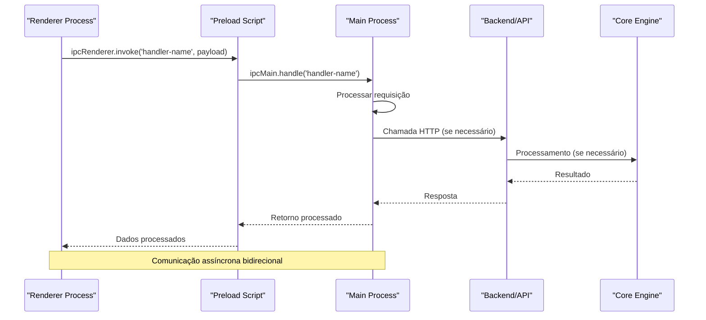
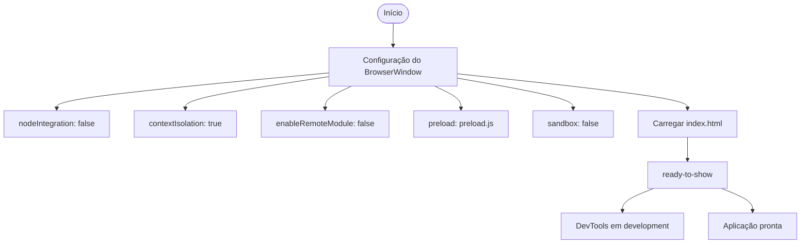
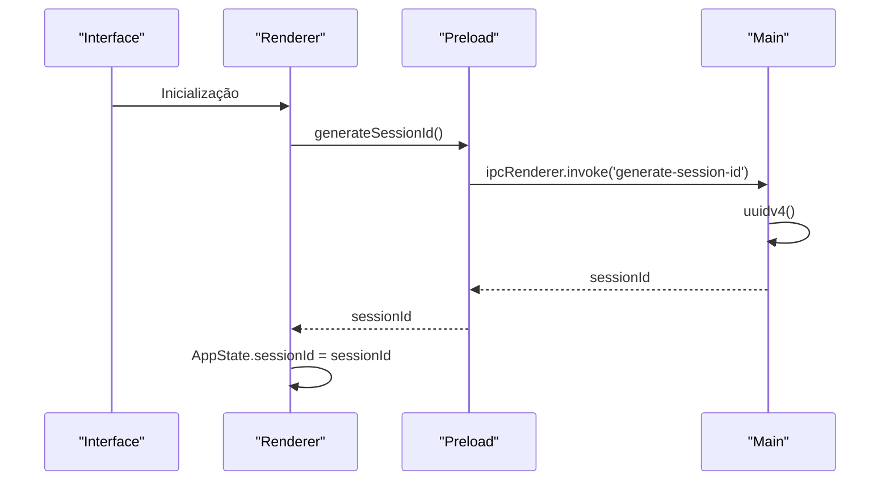
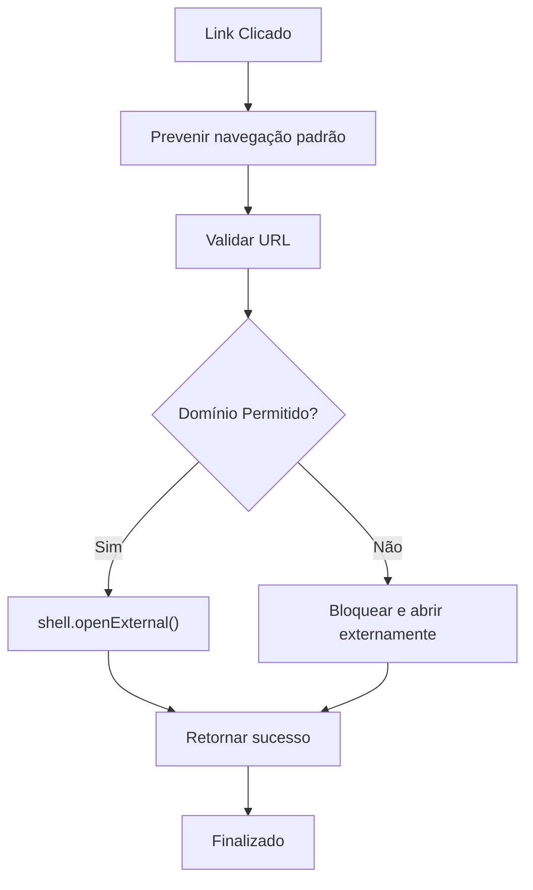
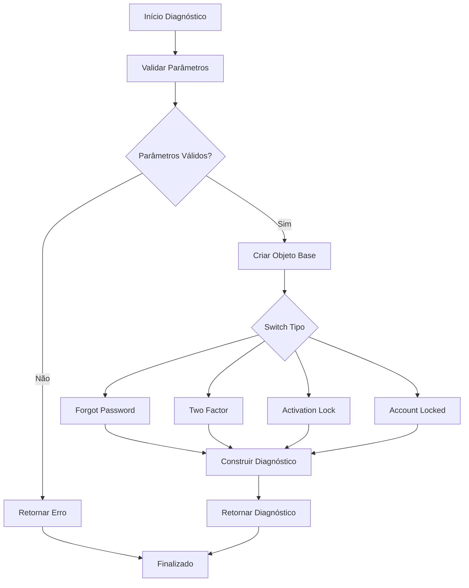
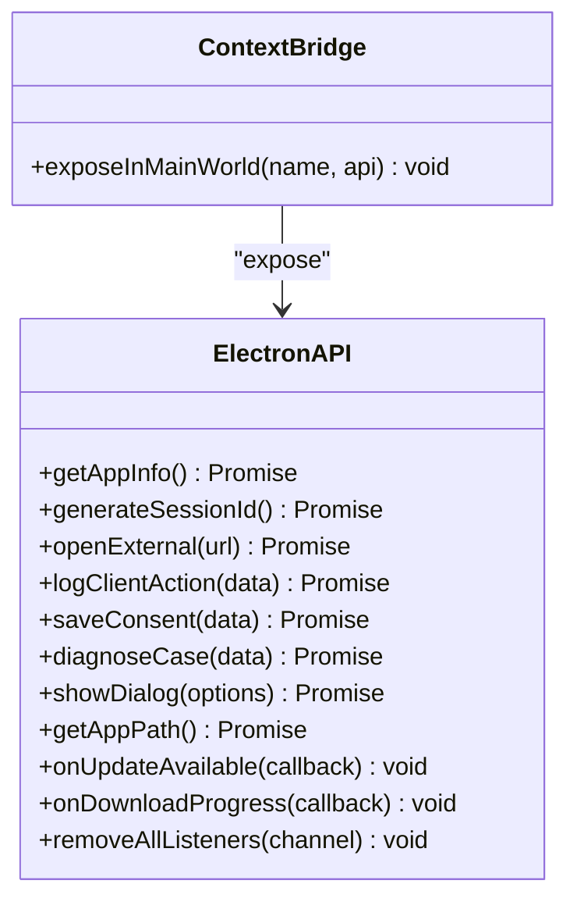
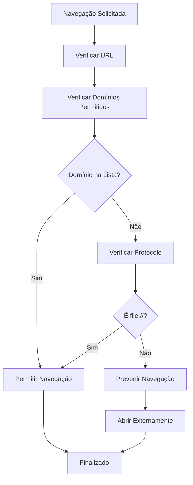
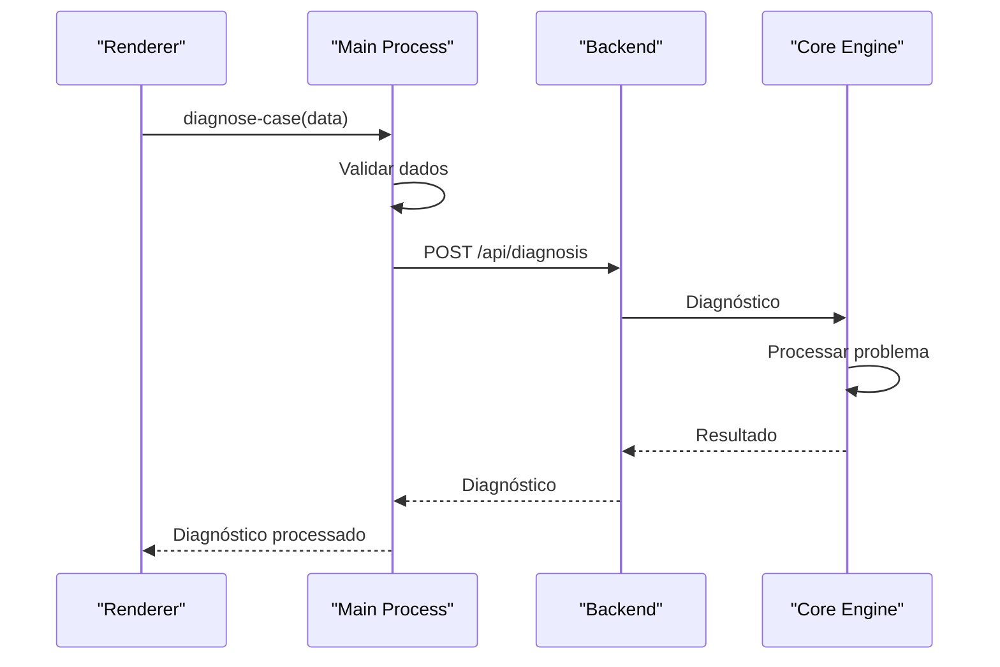
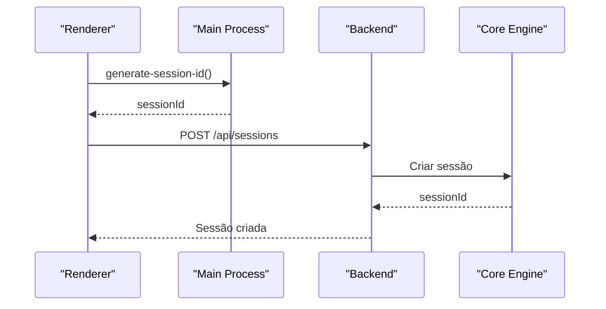

# Comunicação IPC

<cite>
**Arquivos Referenciados neste Documento**
- [main.js](file://desktop/electron-app/main.js)
- [preload.js](file://desktop/electron-app/preload.js)
- [app.js](file://desktop/electron-app/renderer/app.js)
- [index.html](file://desktop/electron-app/renderer/index.html)
- [sessions.js](file://backend/src/routes/sessions.js)
- [diagnosis.js](file://backend/src/routes/diagnosis.js)
- [api.py](file://core-engine/bridge/api.py)
</cite>

## Sumário
- Introdução à comunicação IPC no Electron
- Padrão de comunicação entre main e renderer processes
- Handlers IPC implementados
- Segurança do IPC e boas práticas
- Preload script e APIs seguras
- Exemplos de chamadas IPC
- Integração com backend e core engine

## Introdução
A comunicação inter-processo (IPC) no Electron é fundamental para a interação entre o processo principal (main) e os processos de renderização (renderer). Esta documentação detalha todos os handlers IPC implementados, padrões de comunicação, segurança e boas práticas.

## Padrão de Comunicação IPC

### Arquitetura de Comunicação



**Diagrama fontes**
- [main.js:104-243](file://desktop/electron-app/main.js#L104-L243)
- [preload.js:4-29](file://desktop/electron-app/preload.js#L4-L29)

### Configuração Inicial

O Electron é configurado com segurança desde o início:



**Diagrama fontes**
- [main.js:23-59](file://desktop/electron-app/main.js#L23-L59)

**Seção fontes**
- [main.js:23-59](file://desktop/electron-app/main.js#L23-L59)

## Handlers IPC Implementados

### 1. Geração de IDs de Sessão

**Handler Principal:**
- Nome: `generate-session-id`
- Tipo: `ipcMain.handle`
- Retorno: UUID v4

**Implementação do Handler:**
```javascript
ipcMain.handle('generate-session-id', () => {
  return uuidv4();
});
```

**Uso no Renderer:**
```javascript
const sessionId = await window.electronAPI.generateSessionId();
```

**Fluxo de Geração:**



**Diagrama fontes**
- [main.js:107-109](file://desktop/electron-app/main.js#L107-L109)
- [preload.js:7](file://desktop/electron-app/preload.js#L7)
- [app.js:24-28](file://desktop/electron-app/renderer/app.js#L24-L28)

### 2. Informações do Aplicativo

**Handler Principal:**
- Nome: `get-app-info`
- Tipo: `ipcMain.handle`
- Retorno: Objeto com nome, versão e ambiente

**Implementação do Handler:**
```javascript
ipcMain.handle('get-app-info', () => {
  return {
    name: APP_CONFIG.name,
    version: APP_CONFIG.version,
    environment: APP_CONFIG.environment
  };
});
```

**Uso no Renderer:**
```javascript
const appInfo = await window.electronAPI.getAppInfo();
document.getElementById('version').textContent = `v${appInfo.version}`;
```

**Seção fontes**
- [main.js:112-118](file://desktop/electron-app/main.js#L112-L118)
- [preload.js:6](file://desktop/electron-app/preload.js#L6)
- [app.js:52-62](file://desktop/electron-app/renderer/app.js#L52-L62)

### 3. Abertura de Links Externos

**Handler Principal:**
- Nome: `open-external`
- Tipo: `ipcMain.handle`
- Parâmetros: URL
- Retorno: Objeto com sucesso/erro

**Implementação do Handler:**
```javascript
ipcMain.handle('open-external', async (event, url) => {
  try {
    await shell.openExternal(url);
    return { success: true };
  } catch (error) {
    log.error('Erro ao abrir link externo:', error);
    return { success: false, error: error.message };
  }
});
```

**Uso no Renderer:**
```javascript
await window.electronAPI.openExternal(url);
```

**Fluxo de Validação:**



**Diagrama fontes**
- [main.js:121-129](file://desktop/electron-app/main.js#L121-L129)
- [app.js:205-215](file://desktop/electron-app/renderer/app.js#L205-L215)

**Seção fontes**
- [main.js:60-78](file://desktop/electron-app/main.js#L60-L78)
- [main.js:121-129](file://desktop/electron-app/main.js#L121-L129)
- [app.js:205-215](file://desktop/electron-app/renderer/app.js#L205-L215)

### 4. Diagnóstico de Casos

**Handler Principal:**
- Nome: `diagnose-case`
- Tipo: `ipcMain.handle`
- Parâmetros: Objeto com tipo de problema e condições

**Implementação do Handler:**
```javascript
ipcMain.handle('diagnose-case', (event, data) => {
  const { problemType, hasDeviceInfo, hasProofOfPurchase } = data;
  
  let diagnosis = {
    type: problemType,
    severity: 'unknown',
    recoverable: false,
    requiresAppleSupport: false,
    estimatedTime: 'unknown',
    steps: []
  };
  
  // Switch cases para diferentes tipos de problemas
  switch (problemType) {
    case 'forgot-password':
      // Lógica específica
      break;
    case 'two-factor':
      // Lógica específica
      break;
    // ... outros casos
  }
  
  return diagnosis;
});
```

**Uso no Renderer:**
```javascript
const diagnosis = await window.electronAPI.diagnoseCase({
  problemType: AppState.problemType,
  hasDeviceInfo: false,
  hasProofOfPurchase: false
});
```

**Fluxo de Diagnóstico:**



**Diagrama fontes**
- [main.js:161-228](file://desktop/electron-app/main.js#L161-L228)
- [app.js:258-280](file://desktop/electron-app/renderer/app.js#L258-L280)

**Seção fontes**
- [main.js:161-228](file://desktop/electron-app/main.js#L161-L228)
- [app.js:245-280](file://desktop/electron-app/renderer/app.js#L245-L280)

### 5. Salvamento de Consentimento

**Handler Principal:**
- Nome: `save-consent`
- Tipo: `ipcMain.handle`
- Parâmetros: Dados de consentimento

**Implementação do Handler:**
```javascript
ipcMain.handle('save-consent', (event, data) => {
  const consentData = {
    sessionId: data.sessionId,
    email: data.email,
    consentGiven: data.consentGiven,
    timestamp: new Date().toISOString(),
    ip: 'local',
    userAgent: data.userAgent
  };
  
  log.info('User Consent:', consentData);
  return { success: true, consentId: uuidv4() };
});
```

**Uso no Renderer:**
```javascript
const consentData = {
  sessionId: AppState.sessionId,
  email: AppState.email,
  consentGiven: true,
  userAgent: navigator.userAgent
};

await window.electronAPI.saveConsent(consentData);
```

**Seção fontes**
- [main.js:146-158](file://desktop/electron-app/main.js#L146-L158)
- [app.js:158-170](file://desktop/electron-app/renderer/app.js#L158-L170)

### 6. Registros de Ações do Cliente

**Handler Principal:**
- Nome: `log-client-action`
- Tipo: `ipcMain.handle`
- Parâmetros: Dados de ação

**Implementação do Handler:**
```javascript
ipcMain.handle('log-client-action', (event, data) => {
  const logEntry = {
    timestamp: new Date().toISOString(),
    sessionId: data.sessionId,
    action: data.action,
    details: data.details,
    ip: 'local'
  };
  
  log.info('Client Action:', logEntry);
  return { success: true };
});
```

**Seção fontes**
- [main.js:132-143](file://desktop/electron-app/main.js#L132-L143)
- [app.js:556-569](file://desktop/electron-app/renderer/app.js#L556-L569)

### 7. Diálogos

**Handler Principal:**
- Nome: `show-dialog`
- Tipo: `ipcMain.handle`
- Parâmetros: Opções de diálogo

**Implementação do Handler:**
```javascript
ipcMain.handle('show-dialog', async (event, options) => {
  const result = await dialog.showMessageBox(mainWindow, {
    type: options.type || 'info',
    title: options.title || APP_CONFIG.name,
    message: options.message,
    detail: options.detail || '',
    buttons: options.buttons || ['OK'],
    defaultId: options.defaultId || 0,
    cancelId: options.cancelId || 0
  });
  
  return result;
});
```

**Uso no Renderer:**
```javascript
await window.electronAPI.showDialog({
  type: 'warning',
  title: 'Alerta',
  message: 'Tem certeza?',
  buttons: ['Sim', 'Não']
});
```

**Seção fontes**
- [main.js:231-243](file://desktop/electron-app/main.js#L231-L243)
- [app.js:575-585](file://desktop/electron-app/renderer/app.js#L575-L585)

### 8. Caminhos de Armazenamento

**Handler Principal:**
- Nome: `get-app-path`
- Tipo: `ipcMain.handle`
- Retorno: Caminhos do sistema

**Implementação do Handler:**
```javascript
ipcMain.handle('get-app-path', () => {
  return {
    userData: app.getPath('userData'),
    logs: app.getPath('logs'),
    temp: app.getPath('temp')
  };
});
```

**Seção fontes**
- [main.js:246-252](file://desktop/electron-app/main.js#L246-L252)
- [preload.js:21](file://desktop/electron-app/preload.js#L21)

## Preload Script e APIs Seguras

### Exposição de APIs

O preload script utiliza `contextBridge` para expor apenas as APIs necessárias:



**Diagrama fontes**
- [preload.js:4-29](file://desktop/electron-app/preload.js#L4-L29)

### Constantes Expostas

```javascript
contextBridge.exposeInMainWorld('APP_CONSTANTS', {
  APPLE_URLS: {
    IFORGOT: 'https://iforgot.apple.com',
    SUPPORT: 'https://support.apple.com',
    ICLOUD: 'https://www.icloud.com',
    FIND_MY: 'https://www.icloud.com/find'
  },
  PROBLEM_TYPES: {
    FORGOT_PASSWORD: 'forgot-password',
    TWO_FACTOR: 'two-factor',
    ACTIVATION_LOCK: 'activation-lock',
    ACCOUNT_LOCKED: 'account-locked',
    DEVICE_USED: 'device-used'
  },
  SEVERITY_LEVELS: {
    LOW: 'low',
    MEDIUM: 'medium',
    HIGH: 'high'
  }
});
```

**Seção fontes**
- [preload.js:32-51](file://desktop/electron-app/preload.js#L32-L51)

## Segurança do IPC

### Permissões de Navegação

O Electron implementa restrições rigorosas para prevenir navegação indesejada:



**Diagrama fontes**
- [main.js:60-78](file://desktop/electron-app/main.js#L60-L78)

### Controles de Permissão

```javascript
// Permissões permitidas
session.defaultSession.setPermissionRequestHandler((webContents, permission, callback) => {
  const allowedPermissions = ['clipboard-read', 'clipboard-write'];
  
  if (allowedPermissions.includes(permission)) {
    callback(true);
  } else {
    log.warn(`Permissão negada: ${permission}`);
    callback(false);
  }
});
```

**Seção fontes**
- [main.js:299-308](file://desktop/electron-app/main.js#L299-L308)

### Headers de Segurança

```javascript
session.defaultSession.webRequest.onHeadersReceived((details, callback) => {
  callback({
    responseHeaders: {
      ...details.responseHeaders,
      'Content-Security-Policy': [
        "default-src 'self'; script-src 'self'; style-src 'self' 'unsafe-inline'; img-src 'self' data: https:; connect-src 'self' https:;"
      ],
      'X-Content-Type-Options': ['nosniff'],
      'X-Frame-Options': ['DENY'],
      'Referrer-Policy': ['strict-origin-when-cross-origin']
    }
  });
});
```

**Seção fontes**
- [main.js:311-323](file://desktop/electron-app/main.js#L311-L323)

## Boas Práticas de Comunicação IPC

### 1. Validação de Dados

Todos os handlers devem validar os dados recebidos:

```javascript
// Exemplo de validação no handler
ipcMain.handle('diagnose-case', (event, data) => {
  // Validar parâmetros
  if (!data || !data.problemType) {
    throw new Error('Dados inválidos');
  }
  
  // Validar tipos
  const validTypes = ['forgot-password', 'two-factor', 'activation-lock', 'account-locked'];
  if (!validTypes.includes(data.problemType)) {
    throw new Error('Tipo de problema inválido');
  }
  
  // Processar e retornar
  return diagnosis;
});
```

### 2. Tratamento de Erros

Implementar tratamento de erros consistente:

```javascript
ipcMain.handle('open-external', async (event, url) => {
  try {
    await shell.openExternal(url);
    return { success: true };
  } catch (error) {
    log.error('Erro ao abrir link externo:', error);
    return { success: false, error: error.message };
  }
});
```

### 3. Logs e Auditoria

Manter registros completos de todas as operações:

```javascript
log.info('User Consent:', consentData);
log.info('Client Action:', logEntry);
```

## Exemplos de Código

### Como o Renderer chama os Handlers

**Exemplo 1: Geração de ID de Sessão**
```javascript
// No renderer process
const sessionId = await window.electronAPI.generateSessionId();
AppState.sessionId = sessionId;
```

**Exemplo 2: Diagnóstico de Caso**
```javascript
// No renderer process
const diagnosis = await window.electronAPI.diagnoseCase({
  problemType: AppState.problemType,
  hasDeviceInfo: false,
  hasProofOfPurchase: false
});
```

**Exemplo 3: Abertura de Link Externo**
```javascript
// No renderer process
document.querySelectorAll('.link-list a').forEach(link => {
  link.addEventListener('click', async (e) => {
    e.preventDefault();
    const url = link.dataset.url;
    if (url && window.electronAPI) {
      await window.electronAPI.openExternal(url);
    }
  });
});
```

**Exemplo 4: Salvamento de Consentimento**
```javascript
// No renderer process
document.getElementById('btn-confirm-consent').addEventListener('click', async () => {
  const consentData = {
    sessionId: AppState.sessionId,
    email: AppState.email,
    consentGiven: true,
    userAgent: navigator.userAgent
  };

  if (window.electronAPI) {
    await window.electronAPI.saveConsent(consentData);
  }
});
```

**Exemplo 5: Diálogos**
```javascript
// No renderer process
function showAlert(message, type = 'info') {
  if (window.electronAPI) {
    window.electronAPI.showDialog({
      type: type === 'warning' ? 'warning' : 'info',
      title: 'Apple ID Assistant',
      message: message,
      buttons: ['OK']
    });
  }
}
```

### Como o Main Process responde

**Exemplo 1: Handler de Diagnóstico**
```javascript
// No main process
ipcMain.handle('diagnose-case', (event, data) => {
  const { problemType, hasDeviceInfo, hasProofOfPurchase } = data;
  
  let diagnosis = {
    type: problemType,
    severity: 'unknown',
    recoverable: false,
    requiresAppleSupport: false,
    estimatedTime: 'unknown',
    steps: []
  };
  
  switch (problemType) {
    case 'forgot-password':
      diagnosis.severity = 'low';
      diagnosis.recoverable = true;
      diagnosis.requiresAppleSupport = false;
      diagnosis.estimatedTime = '15-30 minutos';
      diagnosis.steps = [
        'Acessar iforgot.apple.com',
        'Verificar identidade',
        'Redefinir senha'
      ];
      break;
    // ... outros casos
  }
  
  return diagnosis;
});
```

**Exemplo 2: Handler de Consentimento**
```javascript
// No main process
ipcMain.handle('save-consent', (event, data) => {
  const consentData = {
    sessionId: data.sessionId,
    email: data.email,
    consentGiven: data.consentGiven,
    timestamp: new Date().toISOString(),
    ip: 'local',
    userAgent: data.userAgent
  };
  
  log.info('User Consent:', consentData);
  return { success: true, consentId: uuidv4() };
});
```

## Integração com Backend e Core Engine

### Fluxo de Diagnóstico Completo



**Diagrama fontes**
- [main.js:161-228](file://desktop/electron-app/main.js#L161-L228)
- [diagnosis.js:15-69](file://backend/src/routes/diagnosis.js#L15-L69)
- [api.py:251-283](file://core-engine/bridge/api.py#L251-L283)

### Fluxo de Sessão



**Diagrama fontes**
- [main.js:107-109](file://desktop/electron-app/main.js#L107-L109)
- [sessions.js:39-88](file://backend/src/routes/sessions.js#L39-L88)
- [api.py:213-231](file://core-engine/bridge/api.py#L213-L231)

## Conclusão

A comunicação IPC no Electron foi implementada com foco em segurança e eficiência. Os handlers IPC fornecem uma interface limpa e segura entre o renderer e o main process, enquanto o preload script garante que apenas APIs específicas sejam expostas ao renderer. As boas práticas de validação de dados, tratamento de erros e auditoria estão integradas em todos os handlers, proporcionando uma experiência robusta e segura para os usuários.

A arquitetura permite fácil extensão e manutenção, mantendo a separação clara de responsabilidades entre os diferentes componentes do sistema.