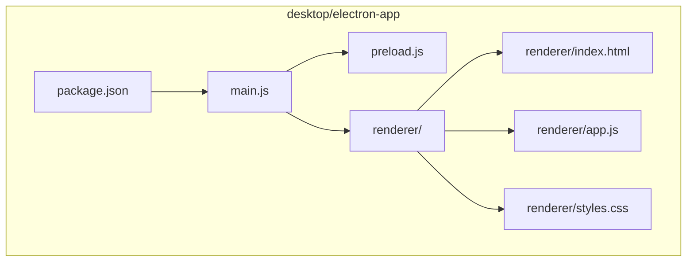
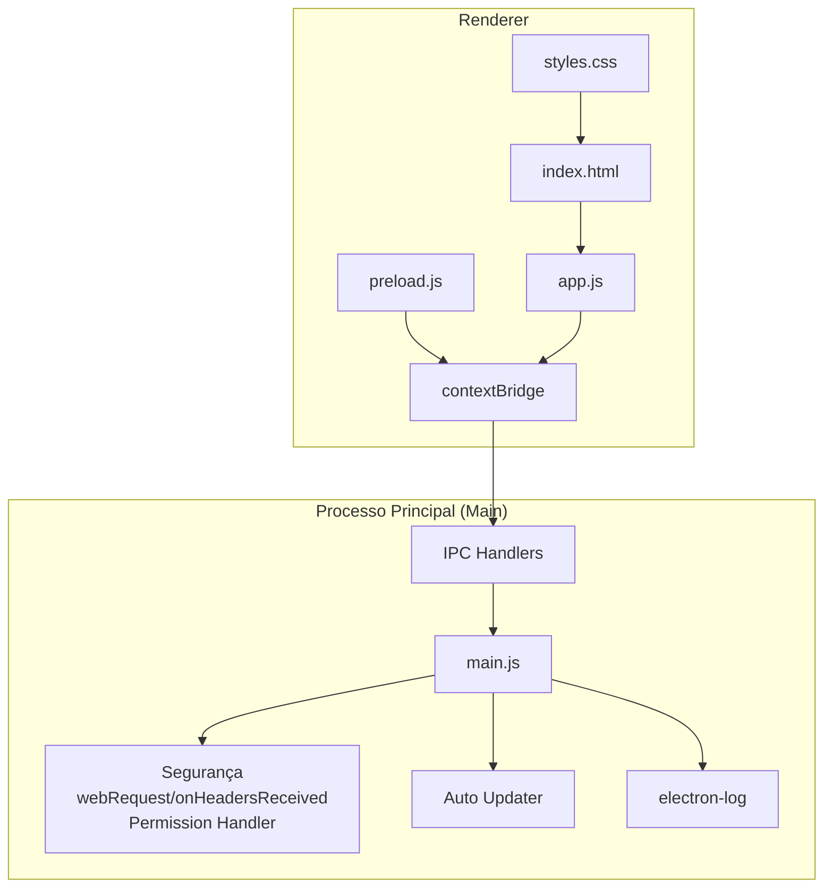
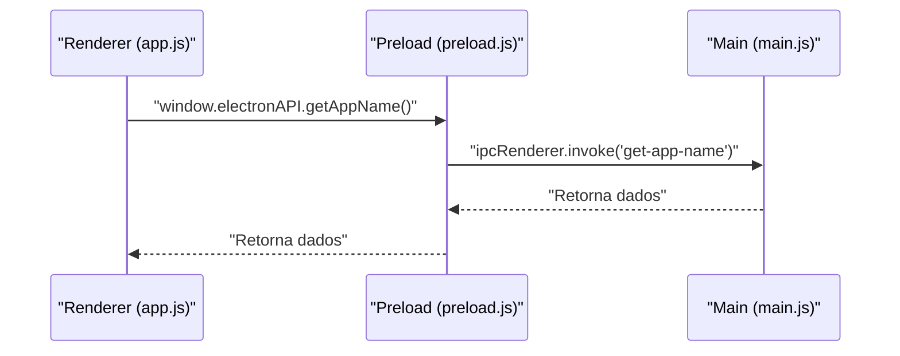
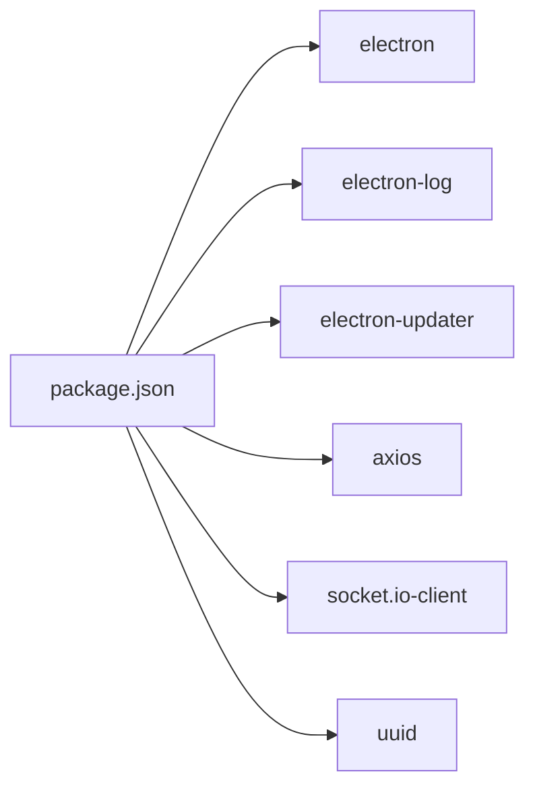

# Configuração do Electron

<cite>
**Arquivos Referenciados neste Documento**
- [main.js](file://desktop/electron-app/main.js)
- [preload.js](file://desktop/electron-app/preload.js)
- [package.json](file://desktop/electron-app/package.json)
- [index.html](file://desktop/electron-app/renderer/index.html)
- [app.js](file://desktop/electron-app/renderer/app.js)
- [styles.css](file://desktop/electron-app/renderer/styles.css)
- [README.md](file://README.md)
</cite>

## Sumário
1. [Introdução](#introdução)
2. [Estrutura do Projeto](#estrutura-do-projeto)
3. [Componentes Principais](#componentes-principais)
4. [Visão Geral da Arquitetura](#visão-geral-da-arquitetura)
5. [Análise Detalhada dos Componentes](#análise-detalhada-dos-componentes)
6. [Análise de Dependências](#análise-de-dependências)
7. [Considerações de Desempenho](#considerações-de-desempenho)
8. [Guia de Solução de Problemas](#guia-de-solução-de-problemas)
9. [Conclusão](#conclusão)
10. [Apêndice](#apêndice)

## Introdução
Esta documentação detalha a configuração do Electron para o projeto Apple ID Assistant, abordando a criação da janela principal, preferências de segurança, configurações de ambiente, variáveis de ambiente, arquitetura de processos main/renderer, webPreferences, opções de janela, além de exemplos para ambientes de desenvolvimento e produção e considerações para Windows, macOS e Linux. Também inclui o uso do electron-log para logging e configurações de build.

## Estrutura do Projeto
O módulo desktop utiliza Electron com uma estrutura de pastas modular:
- desktop/electron-app: Contém o código principal do Electron (main.js), preload.js, e o renderer (HTML, CSS e JS).
- desktop/electron-app/renderer: Código do frontend executado no renderer process.
- desktop/electron-app/assets: Recursos como ícones.
- desktop/electron-app/package.json: Scripts de build e configurações do electron-builder.

**Diagrama fonte**
- [main.js:1-324](file://desktop/electron-app/main.js#L1-L324)
- [preload.js:1-54](file://desktop/electron-app/preload.js#L1-L54)
- [package.json:1-73](file://desktop/electron-app/package.json#L1-L73)

**Seção fonte**
- [README.md:19-29](file://README.md#L19-L29)

## Componentes Principais
- main.js: Ponto de entrada do Electron, cria a janela principal, define webPreferences, manipula eventos de segurança, IPC handlers e atualizações automáticas.
- preload.js: Script de pré-carregamento que expõe APIs seguras ao renderer via contextBridge.
- package.json: Scripts de build, dependências e configurações do electron-builder.
- renderer/index.html: Markup principal da interface.
- renderer/app.js: Lógica de frontend e navegação.
- renderer/styles.css: Estilos da interface.

**Seção fonte**
- [main.js:1-324](file://desktop/electron-app/main.js#L1-L324)
- [preload.js:1-54](file://desktop/electron-app/preload.js#L1-L54)
- [package.json:1-73](file://desktop/electron-app/package.json#L1-L73)
- [index.html:1-246](file://desktop/electron-app/renderer/index.html#L1-L246)
- [app.js:1-591](file://desktop/electron-app/renderer/app.js#L1-L591)
- [styles.css:1-680](file://desktop/electron-app/renderer/styles.css#L1-L680)

## Visão Geral da Arquitetura
A aplicação segue a arquitetura típica Electron com dois processos:
- Processo Principal (main): Responsável pela criação da janela, gerenciamento de eventos, IPC, segurança e atualizações.
- Renderer (renderer): Executa o frontend (HTML/CSS/JS) e comunica-se com o main via IPC.

**Diagrama fonte**
- [main.js:1-324](file://desktop/electron-app/main.js#L1-L324)
- [preload.js:1-54](file://desktop/electron-app/preload.js#L1-L54)
- [index.html:1-246](file://desktop/electron-app/renderer/index.html#L1-L246)
- [app.js:1-591](file://desktop/electron-app/renderer/app.js#L1-L591)

## Análise Detalhada dos Componentes

### Criação da Janela Principal
- Tamanho e restrições: largura, altura, mínimos definidos.
- Título e ícone configurados.
- webPreferences:
  - nodeIntegration: desativado
  - contextIsolation: ativado
  - enableRemoteModule: desativado
  - preload: caminho para preload.js
  - sandbox: desativado
- Comportamento inicial: show: false, exibição após ready-to-show.
- Navegação externa: interceptação de will-navigate e redirecionamento seguro.
- Estilo da barra de título: titleBarStyle: default.

**Seção fonte**
- [main.js:23-79](file://desktop/electron-app/main.js#L23-L79)

### Preferências de Segurança
- Prevenção de novas janelas: app.on('web-contents-created') com contents.on('new-window').
- Permissões: session.defaultSession.setPermissionRequestHandler permite apenas clipboard-read e clipboard-write.
- Headers de segurança: session.defaultSession.webRequest.onHeadersReceived aplica Content-Security-Policy, X-Content-Type-Options, X-Frame-Options, Referrer-Policy.

**Seção fonte**
- [main.js:290-323](file://desktop/electron-app/main.js#L290-L323)

### Configurações de Ambiente e Variáveis de Ambiente
- APP_CONFIG:
  - name, version, environment (NODE_ENV), apiUrl (API_URL), socketUrl (SOCKET_URL).
- Ambiente de desenvolvimento: DevTools aberto automaticamente em development.
- Ambiente de produção: Verificação automática de atualizações com electron-updater.

**Seção fonte**
- [main.js:14-20](file://desktop/electron-app/main.js#L14-L20)
- [main.js:50-52](file://desktop/electron-app/main.js#L50-L52)
- [main.js:86-88](file://desktop/electron-app/main.js#L86-L88)

### Arquitetura de Processos Main/Renderer e webPreferences
- O preload.js expõe APIs ao renderer através de contextBridge, limitando o acesso ao mínimo necessário.
- O main.js define webPreferences rigorosas para segurança.

**Diagrama fonte**
- [preload.js:4-29](file://desktop/electron-app/preload.js#L4-L29)
- [main.js:112-118](file://desktop/electron-app/main.js#L112-L118)

**Seção fonte**
- [preload.js:1-54](file://desktop/electron-app/preload.js#L1-L54)
- [main.js:31-37](file://desktop/electron-app/main.js#L31-L37)

### IPC Handlers
Handlers implementados:
- generate-session-id: gera UUID para sessão.
- get-app-info: retorna nome, versão e ambiente.
- open-external: abre URLs externas via shell.
- log-client-action: registra ações do usuário com electron-log.
- save-consent: salva consentimento com dados do usuário.
- diagnose-case: diagnóstico baseado no tipo de problema.
- show-dialog: exibe caixas de diálogo.
- get-app-path: retorna caminhos do sistema (userData, logs, temp).

**Seção fonte**
- [main.js:106-252](file://desktop/electron-app/main.js#L106-L252)

### Automação de Atualizações
- autoUpdater:
  - Eventos: checking-for-update, update-available, update-not-available, error, download-progress, update-downloaded.
  - Em update-downloaded: quitAndInstall().
  - Envio de eventos ao renderer via mainWindow.webContents.send.

**Seção fonte**
- [main.js:254-286](file://desktop/electron-app/main.js#L254-L286)

### Electron-Log para Logging
- Configuração: log.transports.file.level = 'info'.
- Uso:
  - Logs de atualizações.
  - Registros de ações do cliente.
  - Registros de consentimento.
  - Logs de erros ao abrir links externos.

**Seção fonte**
- [main.js:6-8](file://desktop/electron-app/main.js#L6-L8)
- [main.js:121-143](file://desktop/electron-app/main.js#L121-L143)
- [main.js:145-158](file://desktop/electron-app/main.js#L145-L158)
- [main.js:256-285](file://desktop/electron-app/main.js#L256-L285)

### Configurações de Build
- electron-builder:
  - appId, productName.
  - Diretórios: output aponta para ../dist.
  - Arquivos incluídos: main.js, preload.js, renderer/**, assets/**, node_modules/**.
  - Windows:
    - Target: nsis, arquiteturas x64 e ia32.
    - Ícone: assets/icon.ico.
    - NSIS: instalação interativa, atalhos, diretório personalizado.
  - Publicação: GitHub (provider: github, owner, repo).

**Seção fonte**
- [package.json:34-71](file://desktop/electron-app/package.json#L34-L71)

### Exemplos de Configurações para Ambientes

#### Desenvolvimento
- Variáveis de ambiente:
  - NODE_ENV=development
  - API_URL=http://localhost:3000 (exemplo)
  - SOCKET_URL=ws://localhost:3000 (exemplo)
- Comportamentos:
  - DevTools aberto automaticamente.
  - Atualizações desativadas.
  - Logs em nível info.

**Seção fonte**
- [main.js:17-20](file://desktop/electron-app/main.js#L17-L20)
- [main.js:50-52](file://desktop/electron-app/main.js#L50-L52)
- [main.js:86-88](file://desktop/electron-app/main.js#L86-L88)
- [main.js:8-8](file://desktop/electron-app/main.js#L8-L8)

#### Produção
- Variáveis de ambiente:
  - NODE_ENV=production
  - API_URL=https://api.bayreset.com
  - SOCKET_URL=wss://api.bayreset.com
- Comportamentos:
  - Verificação automática de atualizações.
  - Logs em nível info.
  - CSP mais restritivo.

**Seção fonte**
- [main.js:17-20](file://desktop/electron-app/main.js#L17-L20)
- [main.js:86-88](file://desktop/electron-app/main.js#L86-L88)
- [main.js:311-323](file://desktop/electron-app/main.js#L311-L323)

### Considerações para Plataformas

#### Windows
- Configurações de build:
  - nsis como target.
  - Arquiteturas x64 e ia32.
  - Ícone de aplicativo.
  - Opções do NSIS: instalação interativa, pergunta de diretório, atalhos na área de trabalho e menu iniciar.
- Segurança:
  - CSP e headers de segurança configurados no session.defaultSession.
  - Permissões restritas.

**Seção fonte**
- [package.json:47-65](file://desktop/electron-app/package.json#L47-L65)
- [main.js:311-323](file://desktop/electron-app/main.js#L311-L323)
- [main.js:298-308](file://desktop/electron-app/main.js#L298-L308)

#### macOS
- Recomendações:
  - Configurar titleBarStyle: default para manter consistência visual.
  - Garantir que os recursos (ícones) estejam disponíveis em formato adequado.
  - Testar permissões de clipboard e navegação externa.
- Segurança:
  - Manter CSP e headers de segurança ativos.

**Seção fonte**
- [main.js:39-39](file://desktop/electron-app/main.js#L39-L39)
- [main.js:311-323](file://desktop/electron-app/main.js#L311-L323)
- [main.js:298-308](file://desktop/electron-app/main.js#L298-L308)

#### Linux
- Recomendações:
  - Verificar compatibilidade com sandbox: false (não recomendado em produção).
  - Testar permissões e CSP em ambientes variados.
- Segurança:
  - Manter contextIsolation:true e nodeIntegration:false.

**Seção fonte**
- [main.js:36-36](file://desktop/electron-app/main.js#L36-L36)
- [main.js:311-323](file://desktop/electron-app/main.js#L311-L323)
- [main.js:298-308](file://desktop/electron-app/main.js#L298-L308)

## Análise de Dependências
- Dependências principais:
  - electron: runtime do Electron.
  - electron-log: logging.
  - electron-updater: atualizações automáticas.
  - axios, socket.io-client, uuid: funcionalidades auxiliares.
- Scripts:
  - start: executa o Electron.
  - build: gera pacotes com electron-builder.
  - build:win: gera pacote para Windows.
  - dev: executa com --dev.
  - test: Jest.

**Diagrama fonte**
- [package.json:22-33](file://desktop/electron-app/package.json#L22-L33)

**Seção fonte**
- [package.json:1-73](file://desktop/electron-app/package.json#L1-L73)

## Considerações de Desempenho
- webPreferences:
  - nodeIntegration: false evita acesso direto ao Node no renderer.
  - contextIsolation: true isola o contexto do renderer.
  - enableRemoteModule: false reduz riscos de segurança.
  - preload: script leve e otimizado.
  - sandbox: false (não recomendado em produção).
- IPC:
  - Uso de invoke/ handle para comunicação assíncrona eficiente.
- Logging:
  - electron-log configurado para info, evitando overhead excessivo em produção.

[Sem fonte, pois esta seção fornece orientações gerais]

## Guia de Solução de Problemas

### Erros de Segurança
- Se o renderer não conseguir acessar APIs:
  - Verifique se preload.js expôs corretamente as funções via contextBridge.
  - Confirme que webPreferences estão corretas (nodeIntegration=false, contextIsolation=true).
- Se URLs externas forem bloqueadas:
  - Revise a lista de hosts permitidos em will-navigate e shell.openExternal.

**Seção fonte**
- [preload.js:4-29](file://desktop/electron-app/preload.js#L4-L29)
- [main.js:31-37](file://desktop/electron-app/main.js#L31-L37)
- [main.js:60-78](file://desktop/electron-app/main.js#L60-L78)

### Erros de Atualização Automática
- Se as atualizações não aparecem:
  - Confirme NODE_ENV=production.
  - Verifique configurações de publicação (GitHub) e URLs de API.
- Se o download falhar:
  - Verifique logs do electron-log e eventos do autoUpdater.

**Seção fonte**
- [main.js:86-88](file://desktop/electron-app/main.js#L86-L88)
- [main.js:256-286](file://desktop/electron-app/main.js#L256-L286)
- [package.json:66-70](file://desktop/electron-app/package.json#L66-L70)

### Problemas de Navegação Externa
- Se links forem abertos em outro lugar:
  - Confirme que shell.openExternal seja chamado após will-navigate.
  - Valide a lista de allowedHosts.

**Seção fonte**
- [main.js:60-78](file://desktop/electron-app/main.js#L60-L78)

## Conclusão
A configuração do Electron no projeto adota boas práticas de segurança com webPreferences rigorosas, IPC bem definido e logging centralizado. As opções de build e configurações de ambiente permitem ambientes de desenvolvimento e produção diferenciados, com foco em segurança e usabilidade. Para produção, recomenda-se reavaliar o uso de sandbox: false e garantir CSP e headers de segurança adequados em todas as plataformas.

[Sem fonte, pois esta seção resume sem análise específica de arquivos]

## Apêndice

### Exemplo de Configuração de Variáveis de Ambiente
- Desenvolvimento:
  - NODE_ENV=development
  - API_URL=http://localhost:3000
  - SOCKET_URL=ws://localhost:3000
- Produção:
  - NODE_ENV=production
  - API_URL=https://api.bayreset.com
  - SOCKET_URL=wss://api.bayreset.com

**Seção fonte**
- [main.js:17-20](file://desktop/electron-app/main.js#L17-L20)

### Estrutura de Logs
- Local: logs do Electron (logs directory).
- Nível: info.
- Exemplos de registros: atualizações, ações do cliente, consentimento, erros.

**Seção fonte**
- [main.js:6-8](file://desktop/electron-app/main.js#L6-L8)
- [main.js:131-143](file://desktop/electron-app/main.js#L131-L143)
- [main.js:145-158](file://desktop/electron-app/main.js#L145-L158)
- [main.js:256-285](file://desktop/electron-app/main.js#L256-L285)