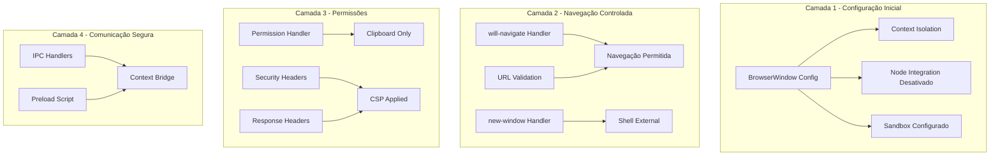
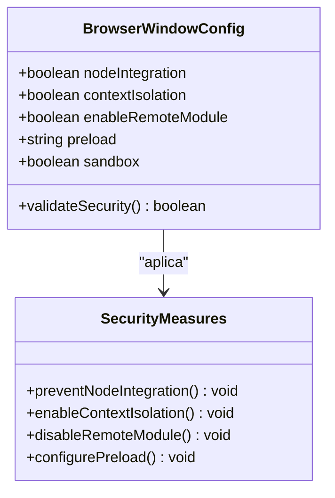
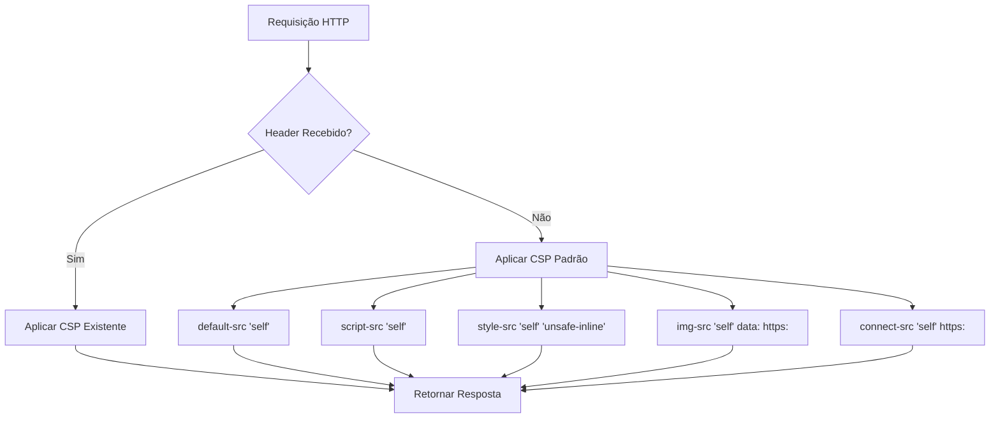
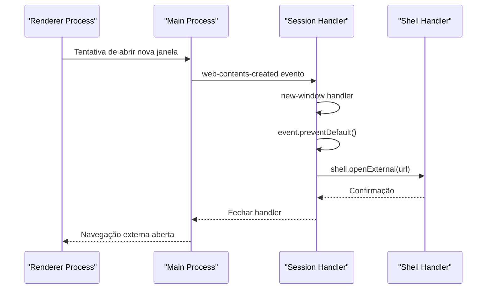
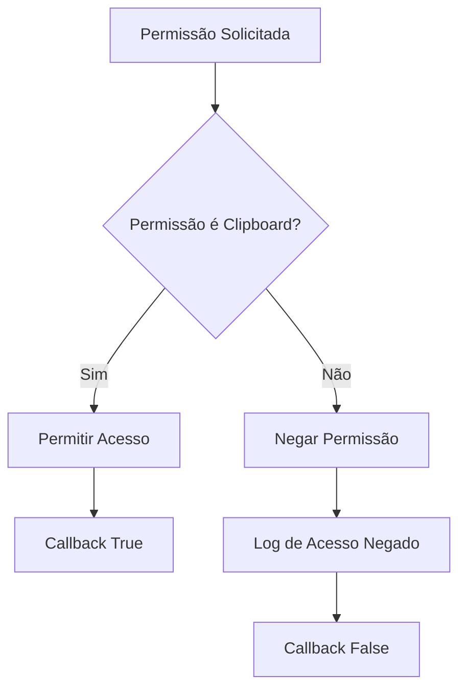
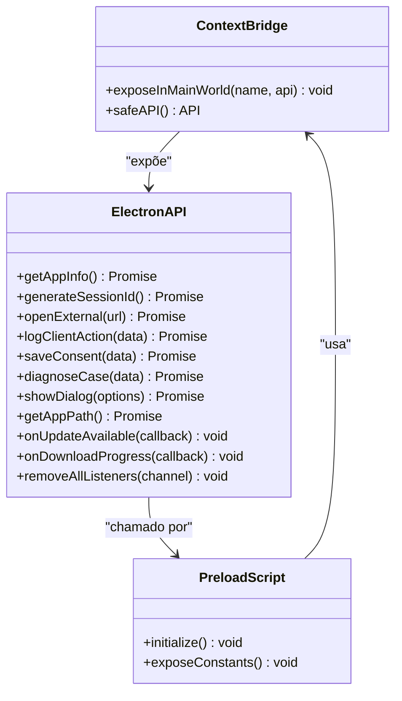
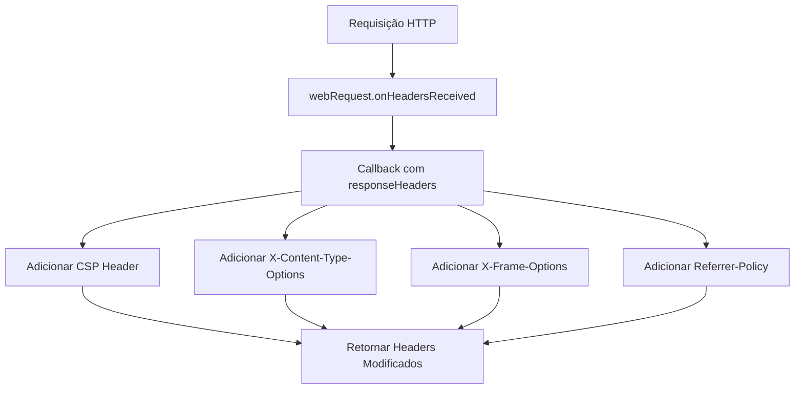
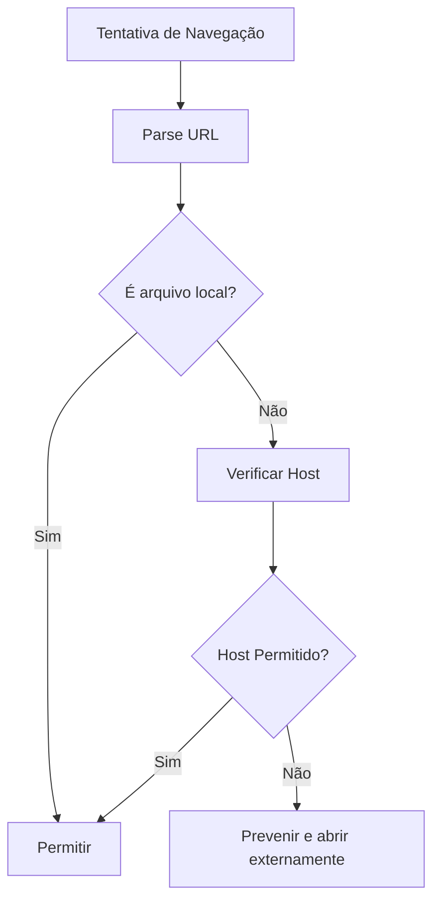
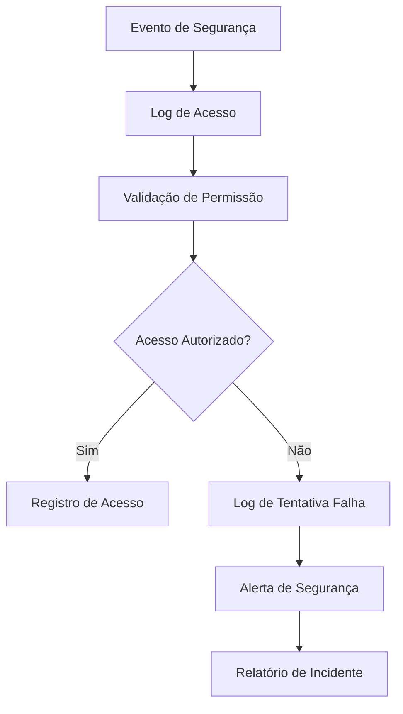

# Segurança e Permissões

<cite>
**Arquivos Referenciados neste Documento**
- [main.js](file://desktop/electron-app/main.js)
- [preload.js](file://desktop/electron-app/preload.js)
- [app.js](file://desktop/electron-app/renderer/app.js)
- [index.html](file://desktop/electron-app/renderer/index.html)
- [package.json](file://desktop/electron-app/package.json)
</cite>

## Sumário
- **Propósito**: Documentação abrangente sobre segurança e permissões no Electron, incluindo CSP, prevenção de novas janelas, gerenciamento de permissões de usuário e headers de segurança
- **Escopo**: Aplicação Electron de assistente de recuperação Apple ID
- **Nível**: Técnico avançado com explicações acessíveis

## Introdução

Esta documentação detalha as medidas de segurança implementadas na aplicação Electron, abordando políticas de Content Security Policy (CSP), prevenção de navegação não autorizada, gerenciamento de permissões de usuário e headers de segurança. O objetivo é fornecer um guia completo para entender e aprimorar as práticas de segurança no ambiente Electron.

## Arquitetura de Segurança

A aplicação implementa uma abordagem de segurança em camadas, utilizando as seguintes técnicas principais:



**Diagrama Fontes**
- [main.js:24-40](file://desktop/electron-app/main.js#L24-L40)
- [main.js:60-78](file://desktop/electron-app/main.js#L60-L78)
- [main.js:290-323](file://desktop/electron-app/main.js#L290-L323)

## Configuração de Segurança Inicial

### Context Isolation e Proteção de Contexto

A configuração inicial do BrowserWindow implementa as melhores práticas de segurança:



**Diagrama Fontes**
- [main.js:31-37](file://desktop/electron-app/main.js#L31-L37)

**Seção Fontes**
- [main.js:24-40](file://desktop/electron-app/main.js#L24-L40)

### Validação de URLs e Navegação Controlada

O sistema implementa uma lista de permissões para navegação:

| Domínio | Descrição | Justificativa |
|---------|-----------|---------------|
| `iforgot.apple.com` | Recuperação de senha oficial | Necessário para funcionalidade principal |
| `apple.com` | Site oficial da Apple | Acesso a informações gerais |
| `icloud.com` | Serviços iCloud | Recursos relacionados ao iCloud |
| `support.apple.com` | Suporte técnico oficial | Acesso a documentação técnica |

**Seção Fontes**
- [main.js:62-78](file://desktop/electron-app/main.js#L62-L78)

## Content Security Policy (CSP)

### Política de Segurança Aplicada

A aplicação implementa uma CSP rigorosa através de dois mecanismos:



**Diagrama Fontes**
- [main.js:311-323](file://desktop/electron-app/main.js#L311-L323)

### Headers de Segurança Adicionais

Além da CSP, a aplicação define headers importantes:

| Header | Valor | Propósito |
|--------|-------|----------|
| `X-Content-Type-Options` | `nosniff` | Impede detecção de MIME |
| `X-Frame-Options` | `DENY` | Previne clickjacking |
| `Referrer-Policy` | `strict-origin-when-cross-origin` | Controla envio de referrer |

**Seção Fontes**
- [main.js:318-321](file://desktop/electron-app/main.js#L318-L321)

## Prevenção de Novas Janelas

### Implementação de Controle de Janelas

O sistema previne a criação de novas janelas através de múltiplos mecanismos:



**Diagrama Fontes**
- [main.js:291-296](file://desktop/electron-app/main.js#L291-L296)

**Seção Fontes**
- [main.js:290-296](file://desktop/electron-app/main.js#L290-L296)

## Gerenciamento de Permissões de Usuário

### Controle de Permissões

A aplicação limita permissões específicas do usuário:



**Diagrama Fontes**
- [main.js:299-308](file://desktop/electron-app/main.js#L299-L308)

### Permissões Específicas

| Permissão | Status | Justificativa |
|-----------|--------|---------------|
| `clipboard-read` | Permitida | Necessária para funcionalidades de recuperação |
| `clipboard-write` | Permitida | Necessária para copiar instruções |
| Outras permissões | Negadas | Manutenção de segurança máxima |

**Seção Fontes**
- [main.js:299-308](file://desktop/electron-app/main.js#L299-L308)

## Comunicação Segura entre Processos

### Context Bridge e IPC

A comunicação entre processos é controlada através de um contexto seguro:



**Diagrama Fontes**
- [preload.js:4-29](file://desktop/electron-app/preload.js#L4-L29)

### Constantes de Segurança

O preload expõe constantes úteis para navegação:

| Grupo | Constante | URL |
|-------|-----------|-----|
| `APPLE_URLS` | `IFORGOT` | `https://iforgot.apple.com` |
| `APPLE_URLS` | `SUPPORT` | `https://support.apple.com` |
| `APPLE_URLS` | `ICLOUD` | `https://www.icloud.com` |
| `APPLE_URLS` | `FIND_MY` | `https://www.icloud.com/find` |

**Seção Fontes**
- [preload.js:32-51](file://desktop/electron-app/preload.js#L32-L51)

## Headers de Segurança

### Implementação de Headers HTTP

A aplicação define headers de segurança através do session handler:



**Diagrama Fontes**
- [main.js:311-323](file://desktop/electron-app/main.js#L311-L323)

### Validação de Navegação

O sistema implementa validação de URLs antes de permitir navegação:



**Diagrama Fontes**
- [main.js:69-78](file://desktop/electron-app/main.js#L69-L78)

**Seção Fontes**
- [main.js:60-78](file://desktop/electron-app/main.js#L60-L78)

## Boas Práticas de Segurança Recomendadas

### Para Produção

1. **Atualização Contínua**
   - Implementar verificação automática de atualizações
   - Manter Electron e dependências atualizadas

2. **Configurações Avançadas**
   ```javascript
   // Recomendação adicional
   webPreferences: {
     nodeIntegration: false,
     contextIsolation: true,
     enableRemoteModule: false,
     sandbox: true,
     preload: path.join(__dirname, 'preload.js'),
     webSecurity: true,
     allowRunningInsecureContent: false
   }
   ```

3. **Monitoramento de Erros**
   - Implementar logging abrangente
   - Monitorar tentativas de acesso não autorizado

### Para Desenvolvimento

1. **Desenvolvimento Seguro**
   - Manter `nodeIntegration: false` em produção
   - Usar `contextIsolation: true` sempre
   - Desativar `devTools` em produção

2. **Testes de Segurança**
   - Testar todas as rotas de navegação
   - Validar headers de segurança
   - Verificar permissões de usuário

## Considerações para Diferentes Sistemas Operacionais

### Windows

- **Instalação**: NSIS installer com opções personalizáveis
- **Permissões**: Verificar permissões de usuário
- **Atualizações**: Auto-updater configurado para GitHub

### macOS

- **Sandbox**: Considerar implementação de sandbox adicional
- **Notarization**: Aplicar notarization para distribuição
- **Gatekeeper**: Garantir compatibilidade com Gatekeeper

### Linux

- **Dependências**: Verificar dependências de sistema
- **Permissões**: Configurar permissões de arquivo adequadas
- **Atualizações**: Implementar mecanismo de atualização específico

**Seção Fontes**
- [package.json:47-71](file://desktop/electron-app/package.json#L47-L71)

## Recomendações de Melhoria

### Melhorias Sugeridas

1. **CSP Mais Restrita**
   - Remover `'unsafe-inline'` de style-src
   - Implementar hashes de CSS
   - Adicionar CSP header no HTML

2. **Validação Adicional**
   - Implementar whitelist mais restrita
   - Adicionar logging detalhado de tentativas de navegação
   - Implementar rate limiting para requisições

3. **Segurança de Comunicação**
   - Implementar HTTPS obrigatório
   - Adicionar validação de certificados
   - Considerar implementação de Subresource Integrity

### Monitoramento e Logging



## Conclusão

A aplicação implementa um conjunto robusto de medidas de segurança que abordam os principais riscos em aplicações Electron. As políticas de CSP, controle de navegação, gerenciamento de permissões e headers de segurança trabalham em conjunto para criar uma camada de proteção eficaz.

Para ambientes de produção, recomenda-se a implementação das melhorias sugeridas, especialmente na restrição da CSP e no fortalecimento do monitoramento de segurança. A abordagem de segurança em camadas utilizada aqui fornece uma base sólida para desenvolvimento de aplicações Electron seguras e confiáveis.