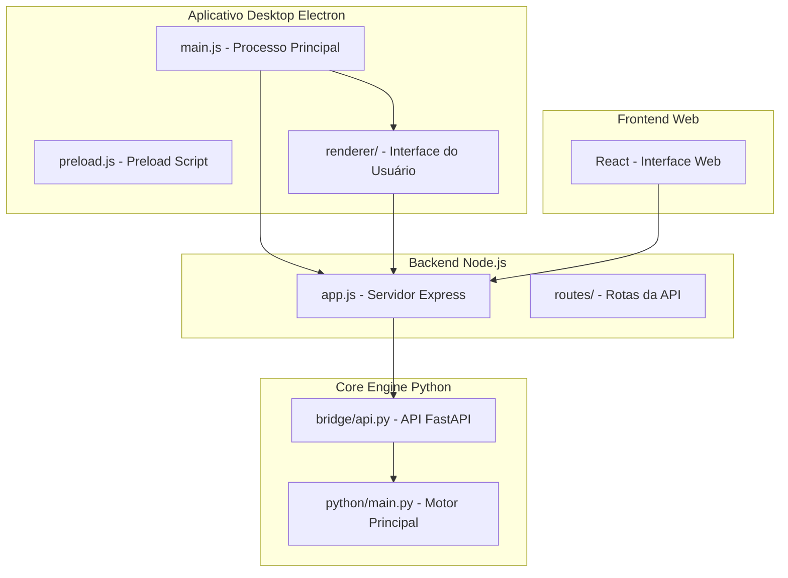
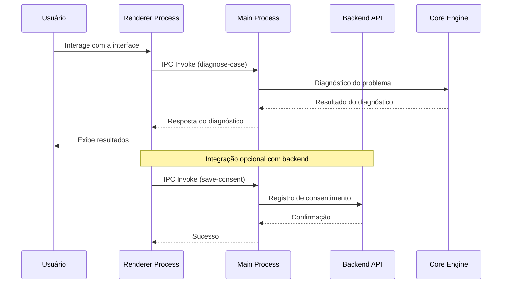
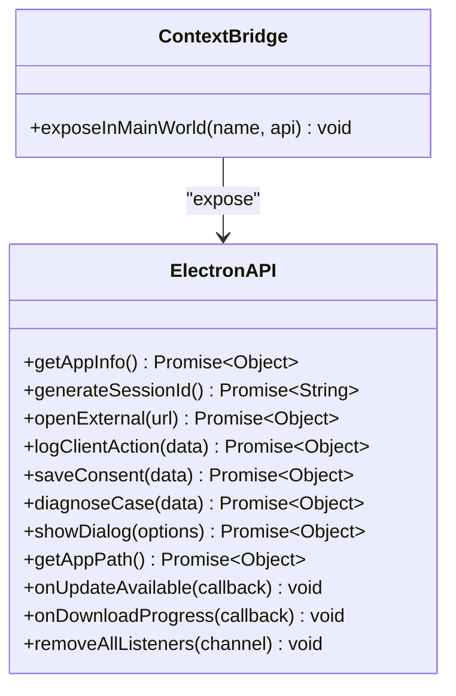
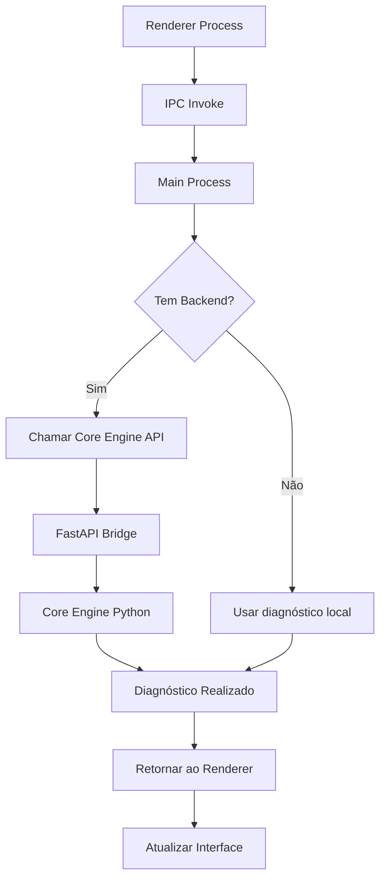
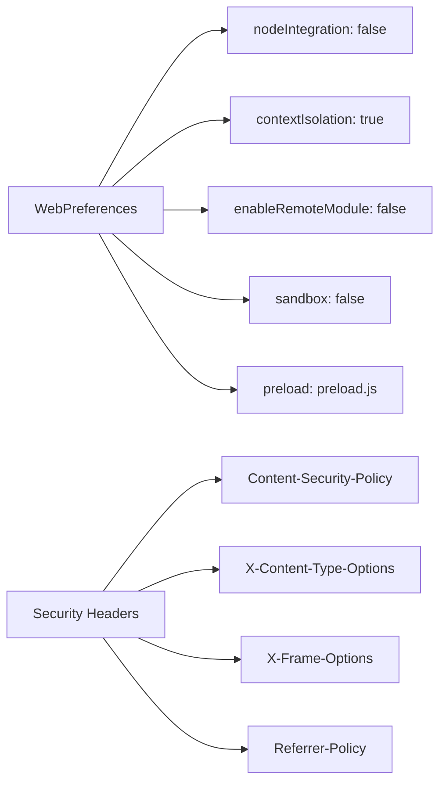
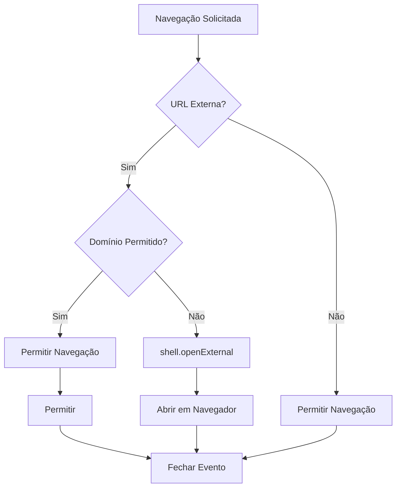
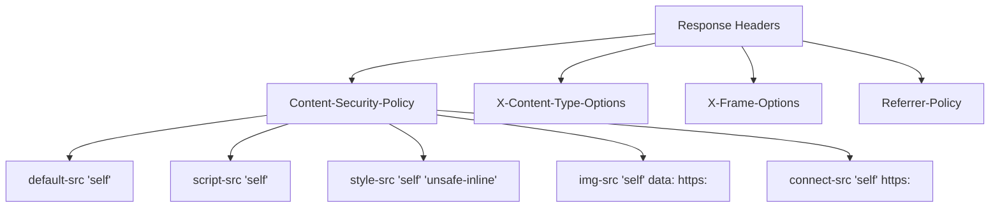
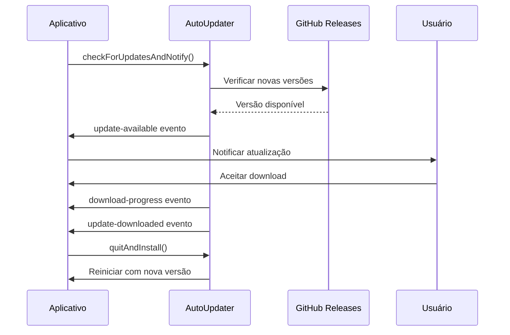
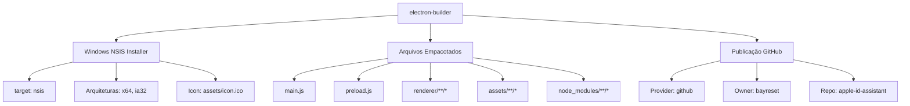

# Aplicativo Desktop Electron

<cite>
**Arquivos Referenciados Neste Documento**
- [main.js](file://desktop/electron-app/main.js)
- [preload.js](file://desktop/electron-app/preload.js)
- [app.js](file://desktop/electron-app/renderer/app.js)
- [index.html](file://desktop/electron-app/renderer/index.html)
- [package.json](file://desktop/electron-app/package.json)
- [README.md](file://README.md)
- [api.py](file://core-engine/bridge/api.py)
- [main.py](file://core-engine/python/main.py)
- [app.js](file://backend/src/app.js)
- [auth.js](file://backend/src/routes/auth.js)
- [api.js](file://frontend/src/services/api.js)
</cite>

## Sumário
1. [Introdução](#introdução)
2. [Estrutura do Projeto](#estrutura-do-projeto)
3. [Arquitetura de Processos](#arquitetura-de-processos)
4. [IPC (Comunicação Entre Processos)](#ipc-comunicação-entre-processos)
5. [Integração com o Backend](#integração-com-o-backend)
6. [Configuração do Electron](#configuração-do-electron)
7. [Segurança e Permissões](#segurança-e-permissões)
8. [Atualizações Automáticas](#atualizações-automáticas)
9. [Empacotamento e Build](#empacotamento-e-build)
10. [Exemplos de Implementação](#exemplos-de-implementação)
11. [Como Estender o Aplicativo](#como-estender-o-aplicativo)
12. [Conclusão](#conclusão)

## Introdução

O Bay-RSET Tool é um sistema profissional de suporte guiado para recuperação de acesso a contas Apple ID, composto por três componentes principais: um aplicativo desktop Electron, um backend Node.js e um motor Python (Core Engine). O aplicativo desktop fornece uma interface gráfica intuitiva para os usuários, permitindo o diagnóstico de problemas de contas Apple ID e orientações para recuperação.

O sistema segue rigorosamente os processos oficiais da Apple, evitando qualquer tipo de bypass ou desbloqueio ilegal. Todas as recuperações são orientadas através de fluxos guiados que levam os usuários pelos procedimentos oficiais.

## Estrutura do Projeto

O projeto segue uma arquitetura modular com três camadas principais:



**Fontes da Seção**
- [README.md:19-29](file://README.md#L19-L29)

## Arquitetura de Processos

O aplicativo desktop Electron implementa uma arquitetura de dois processos principais:

### Processo Principal (Main Process)
Responsável por:
- Criar e gerenciar janelas do aplicativo
- Configurar eventos de sistema
- Gerenciar atualizações automáticas
- Controlar permissões de segurança
- Manipular IPC handlers

### Processo Renderer (Renderer Process)
Responsável por:
- Interface gráfica do usuário
- Lógica de negócio do fluxo de recuperação
- Interações com o usuário
- Chamadas às APIs expostas pelo main process



**Fontes da Seção**
- [main.js:23-79](file://desktop/electron-app/main.js#L23-L79)
- [app.js:19-40](file://desktop/electron-app/renderer/app.js#L19-L40)

## IPC (Comunicação Entre Processos)

O Electron utiliza IPC (Inter-Process Communication) para comunicação segura entre os processos. O sistema implementa um mecanismo de contexto seguro através do `contextBridge`.

### Exposição de APIs ao Renderer

O preload script expõe uma API segura chamada `electronAPI`:



**Fontes da Seção**
- [preload.js:4-29](file://desktop/electron-app/preload.js#L4-L29)

### IPC Handlers no Main Process

O main process implementa handlers para todas as operações:

| Handler | Descrição | Parâmetros | Retorno |
|---------|-----------|------------|---------|
| `generate-session-id` | Gera ID de sessão único | Nenhum | UUID String |
| `get-app-info` | Retorna informações do app | Nenhum | Objeto com nome, versão, ambiente |
| `open-external` | Abre URLs externos | URL String | Objeto com sucesso/erro |
| `log-client-action` | Registra ações do usuário | Dados do log | Objeto com sucesso |
| `save-consent` | Salva consentimento do usuário | Dados de consentimento | Objeto com sucesso e ID |
| `diagnose-case` | Realiza diagnóstico de problema | Dados do diagnóstico | Objeto com diagnóstico |
| `show-dialog` | Exibe caixas de diálogo | Opções de diálogo | Resultado da caixa |
| `get-app-path` | Retorna caminhos do sistema | Nenhum | Objeto com caminhos |

**Fontes da Seção**
- [main.js:106-252](file://desktop/electron-app/main.js#L106-L252)

## Integração com o Backend

Embora o aplicativo desktop tenha um motor de diagnóstico local, ele também pode integrar-se com o backend para funcionalidades avançadas:

### Fluxo de Integração



**Fontes da Seção**
- [app.js:258-280](file://desktop/electron-app/renderer/app.js#L258-L280)
- [api.py:251-283](file://core-engine/bridge/api.py#L251-L283)

### APIs Disponíveis

O Core Engine expõe uma API REST completa:

| Endpoint | Método | Descrição |
|----------|--------|-----------|
| `/api/sessions` | POST | Cria nova sessão |
| `/api/sessions/{session_id}` | GET | Obtém status da sessão |
| `/api/diagnosis` | POST | Realiza diagnóstico |
| `/api/consent` | POST | Registra consentimento |
| `/api/guides/{problem_type}` | GET | Retorna guia de recuperação |
| `/api/stats` | GET | Retorna estatísticas |
| `/api/devices/check` | POST | Verifica status do dispositivo |
| `/api/devices/reset-eligibility` | POST | Verifica elegibilidade de reset |
| `/api/service-report` | POST | Gera relatório de serviço |

**Fontes da Seção**
- [api.py:184-349](file://core-engine/bridge/api.py#L184-L349)

## Configuração do Electron

O Electron é configurado com foco em segurança e performance:

### Configurações de Segurança



**Fontes da Seção**
- [main.js:31-40](file://desktop/electron-app/main.js#L31-L40)
- [main.js:310-323](file://desktop/electron-app/main.js#L310-L323)

### Preferências da Janela Principal

| Configuração | Valor | Descrição |
|-------------|-------|-----------|
| `width` | 1200px | Largura inicial |
| `height` | 800px | Altura inicial |
| `minWidth` | 900px | Largura mínima |
| `minHeight` | 600px | Altura mínima |
| `titleBarStyle` | 'default' | Estilo da barra de título |
| `show` | false | Oculta até estar pronta |
| `icon` | assets/icon.png | Ícone do aplicativo |

**Fontes da Seção**
- [main.js:24-40](file://desktop/electron-app/main.js#L24-L40)

## Segurança e Permissões

O aplicativo implementa múltiplas camadas de segurança:

### Controles de Navegação



**Fontes da Seção**
- [main.js:60-78](file://desktop/electron-app/main.js#L60-L78)

### Permissões de Segurança

As permissões permitidas são restritas:

| Permissão | Descrição | Justificativa |
|-----------|-----------|---------------|
| `clipboard-read` | Leitura da área de transferência | Para copiar links de suporte |
| `clipboard-write` | Escrita na área de transferência | Para colar URLs |

**Fontes da Seção**
- [main.js:299-308](file://desktop/electron-app/main.js#L299-L308)

### Headers de Segurança



**Fontes da Seção**
- [main.js:311-322](file://desktop/electron-app/main.js#L311-L322)

## Atualizações Automáticas

O aplicativo implementa um sistema de atualização automática robusto:

### Configuração do Auto-Updater



**Fontes da Seção**
- [main.js:254-286](file://desktop/electron-app/main.js#L254-L286)

### Eventos do Auto-Updater

| Evento | Descrição | Ação |
|--------|-----------|------|
| `checking-for-update` | Verificando atualizações | Log de verificação |
| `update-available` | Atualização disponível | Enviar notificação ao renderer |
| `update-not-available` | Nenhuma atualização | Log de informação |
| `error` | Erro no updater | Log de erro |
| `download-progress` | Progresso do download | Enviar progresso ao renderer |
| `update-downloaded` | Atualização baixada | Reiniciar aplicativo |

**Fontes da Seção**
- [main.js:256-285](file://desktop/electron-app/main.js#L256-L285)

## Empacotamento e Build

O projeto utiliza electron-builder para empacotamento:

### Configuração de Build



**Fontes da Seção**
- [package.json:34-71](file://desktop/electron-app/package.json#L34-L71)

### Scripts de Build

| Script | Descrição |
|--------|-----------|
| `npm run build` | Build padrão para todas as plataformas |
| `npm run build:win` | Build apenas para Windows |
| `npm start` | Iniciar aplicativo em modo desenvolvimento |
| `npm run dev` | Iniciar com modo de desenvolvimento |

**Fontes da Seção**
- [package.json:6-12](file://desktop/electron-app/package.json#L6-L12)

## Exemplos de Implementação

### Exemplo 1: Diagnóstico de Problema

```javascript
// No renderer process
async function performDiagnosis() {
    const diagnosis = await window.electronAPI.diagnoseCase({
        problemType: AppState.problemType,
        hasDeviceInfo: false,
        hasProofOfPurchase: false
    });
    
    // Atualizar interface com resultados
    updateDiagnosisUI(diagnosis);
}
```

**Fontes da Seção**
- [app.js:245-280](file://desktop/electron-app/renderer/app.js#L245-L280)

### Exemplo 2: Registro de Consentimento

```javascript
// No renderer process
async function confirmConsent() {
    const consentData = {
        sessionId: AppState.sessionId,
        email: AppState.email,
        consentGiven: true,
        userAgent: navigator.userAgent
    };
    
    const result = await window.electronAPI.saveConsent(consentData);
    AppState.consentGiven = true;
}
```

**Fontes da Seção**
- [app.js:149-170](file://desktop/electron-app/renderer/app.js#L149-L170)

### Exemplo 3: Abertura de Links Externos

```javascript
// No renderer process
document.querySelectorAll('.link-list a').forEach(link => {
    link.addEventListener('click', async (e) => {
        e.preventDefault();
        const url = link.dataset.url;
        await window.electronAPI.openExternal(url);
    });
});
```

**Fontes da Seção**
- [app.js:205-215](file://desktop/electron-app/renderer/app.js#L205-L215)

## Como Estender o Aplicativo

### Adicionando Novas APIs IPC

Para adicionar uma nova função ao renderer process:

1. **Definir handler no main process:**
```javascript
// Em main.js
ipcMain.handle('nova-funcao', async (event, dados) => {
    // Implementação da função
    return resultado;
});
```

2. **Expor API no preload:**
```javascript
// Em preload.js
contextBridge.exposeInMainWorld('electronAPI', {
    // ... outras funções
    novaFuncao: (dados) => ipcRenderer.invoke('nova-funcao', dados)
});
```

3. **Utilizar no renderer:**
```javascript
// No renderer
const resultado = await window.electronAPI.novaFuncao(dados);
```

### Adicionando Novos Eventos de Atualização

Para adicionar novos eventos de atualização:

```javascript
// No main process
autoUpdater.on('novo-evento', (info) => {
    if (mainWindow) {
        mainWindow.webContents.send('novo-evento', info);
    }
});

// No renderer
window.electronAPI.onNovoEvento((event, info) => {
    // Tratar evento
});
```

### Extensão do Core Engine

Para adicionar novas funcionalidades ao Core Engine:

1. **Adicionar endpoint no FastAPI:**
```python
@app.post("/api/nova-funcionalidade")
async def nova_funcionalidade(request: NovaRequisicao):
    # Implementação
    return ResultadoModel(**dados)
```

2. **Adicionar método no Core Engine:**
```python
def nova_funcionalidade(self, dados):
    # Processamento
    return resultado
```

**Fontes da Seção**
- [api.py:184-349](file://core-engine/bridge/api.py#L184-L349)
- [main.py:263-354](file://core-engine/python/main.py#L263-L354)

## Conclusão

O Bay-RSET Tool apresenta uma implementação sólida do aplicativo desktop Electron com arquitetura bem estruturada e foco em segurança. O sistema oferece:

- **Arquitetura de dois processos** com comunicação segura via IPC
- **Sistema de atualizações automáticas** integrado
- **Camadas múltiplas de segurança** incluindo CSP e permissões restritas
- **Extensibilidade** através de handlers IPC e endpoints FastAPI
- **Integração completa** com backend e Core Engine

A implementação segue boas práticas de desenvolvimento Electron, com configurações de segurança adequadas e um fluxo de atualização automática eficiente. O código está organizado de forma modular, facilitando manutenção e expansão futura.