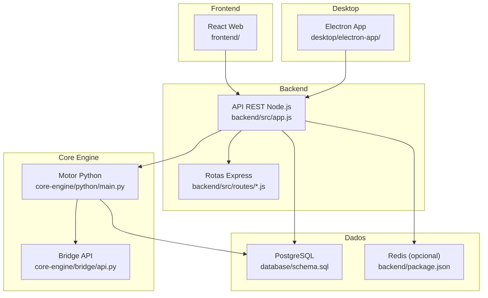
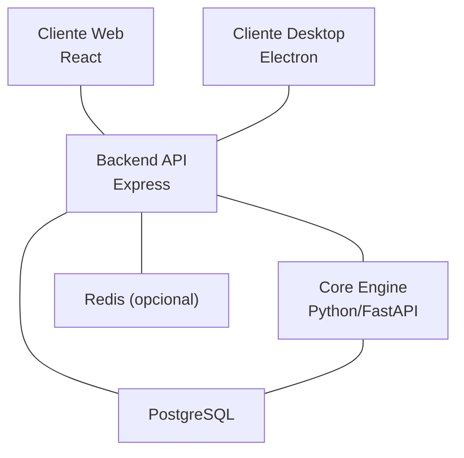
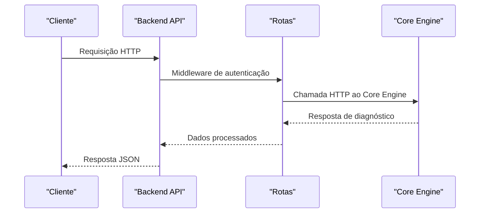
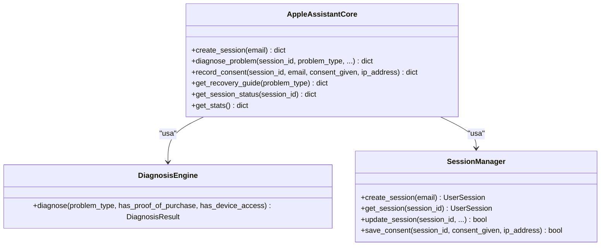
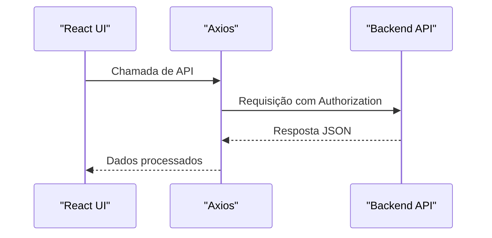
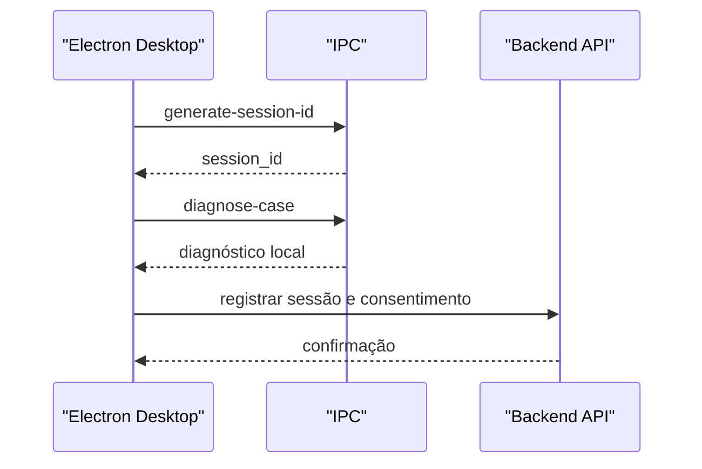
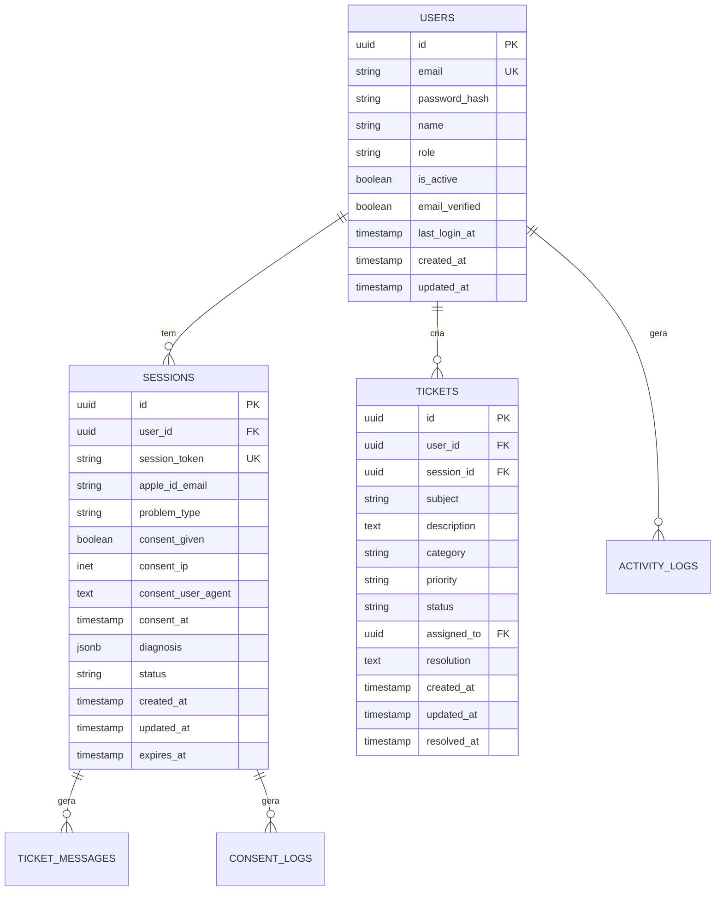
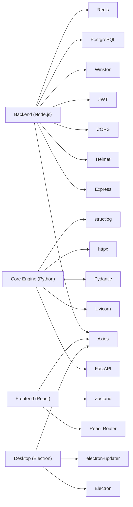

# Arquitetura do Sistema

<cite>
**Arquivo referenciados neste documento**
- [README.md](file://README.md)
- [backend/src/app.js](file://backend/src/app.js)
- [backend/src/routes/auth.js](file://backend/src/routes/auth.js)
- [backend/src/routes/diagnosis.js](file://backend/src/routes/diagnosis.js)
- [backend/src/routes/sessions.js](file://backend/src/routes/sessions.js)
- [backend/package.json](file://backend/package.json)
- [core-engine/python/main.py](file://core-engine/python/main.py)
- [core-engine/python/requirements.txt](file://core-engine/python/requirements.txt)
- [core-engine/bridge/api.py](file://core-engine/bridge/api.py)
- [database/schema.sql](file://database/schema.sql)
- [database/migrations/001_initial_schema.sql](file://database/migrations/001_initial_schema.sql)
- [frontend/package.json](file://frontend/package.json)
- [frontend/public/index.html](file://frontend/public/index.html)
- [frontend/src/services/api.js](file://frontend/src/services/api.js)
- [desktop/electron-app/package.json](file://desktop/electron-app/package.json)
- [desktop/electron-app/main.js](file://desktop/electron-app/main.js)
- [desktop/electron-app/renderer/index.html](file://desktop/electron-app/renderer/index.html)
</cite>

## Sumário
1. [Introdução](#introdução)
2. [Estrutura do Projeto](#estrutura-do-projeto)
3. [Componentes Principais](#componentes-principais)
4. [Visão Geral da Arquitetura](#visão-geral-da-arquitetura)
5. [Análise Detalhada dos Componentes](#análise-detalhada-dos-componentes)
6. [Análise de Dependências](#análise-de-dependências)
7. [Considerações de Desempenho](#considerações-de-desempenho)
8. [Guia de Solução de Problemas](#guia-de-solução-de-problemas)
9. [Conclusão](#conclusão)
10. [Apêndice](#apêndice)

## Introdução
O Bay-RSET Tool é um assistente profissional de recuperação e suporte Apple ID, composto por três interfaces distintas: uma aplicação desktop Electron, um frontend web React e um backend Node.js, além de um motor central escrito em Python. O sistema foi projetado para seguir rigorosamente os processos oficiais da Apple, oferecendo fluxos guiados de recuperação de senha, verificação em duas etapas, bloqueio de ativação e acompanhamento de solicitações. Ele também inclui um sistema completo de tickets de suporte e um painel administrativo.

O objetivo deste documento é apresentar a arquitetura de alto nível, padrões adotados, limites do sistema, interações entre componentes, fluxos de dados e padrões de integração, além de decisões técnicas, trade-offs, restrições, requisitos de infraestrutura, escalabilidade e topologia de implantação. Também abordaremos preocupações transversais como segurança, monitoramento e recuperação de desastres.

**Fontes da seção**
- [README.md:1-108](file://README.md#L1-L108)

## Estrutura do Projeto
O projeto segue uma arquitetura de microsserviços com camadas bem definidas:
- Desktop (Electron): Aplicativo desktop com interface gráfica e funcionalidades locais.
- Frontend (React): Interface web responsiva com navegação e integração com o backend.
- Backend (Node.js/Express): API REST com autenticação, roteamento e integração com o Core Engine.
- Core Engine (Python/FastAPI): Motor de diagnóstico e lógica de negócio central.
- Banco de dados (PostgreSQL): Armazenamento persistente de usuários, sessões, tickets e logs.
- Redis (opcional): Pode ser utilizado para cache e mensagens (configuração presente nos pacotes).

**Fontes da seção**
- [README.md:19-29](file://README.md#L19-L29)
- [backend/src/app.js:15-32](file://backend/src/app.js#L15-L32)
- [core-engine/python/main.py:1-40](file://core-engine/python/main.py#L1-L40)
- [database/schema.sql:1-20](file://database/schema.sql#L1-L20)
- [backend/package.json:23-46](file://backend/package.json#L23-L46)

## Componentes Principais
- Backend API (Node.js/Express)
  - Responsável por autenticação, gestão de sessões, integração com o Core Engine, tickets de suporte e logs.
  - Utiliza middlewares de segurança (Helmet, CORS, rate limiting), compressão, logging e tratamento de erros.
  - Expõe rotas sob /api/v1 com prefixos específicos para cada domínio funcional.

- Core Engine (Python/FastAPI)
  - Motor de diagnóstico e lógica de negócio central.
  - Implementa classes para diagnóstico, gerenciamento de sessões, e geração de guias de recuperação.
  - Fornece endpoints REST para criação de sessões, diagnóstico, registro de consentimento e estatísticas.

- Frontend Web (React)
  - Interface responsiva com navegação, formulários e integração com a API via Axios.
  - Utiliza interceptores para adicionar tokens JWT e tratar erros de autenticação.

- Desktop (Electron)
  - Aplicativo desktop com navegação protegida, IPC para funções locais, atualizações automáticas e logging.
  - Implementa fluxos guiados de diagnóstico e recuperação com base em lógica local e interações com o backend.

- Banco de dados (PostgreSQL)
  - Esquema completo com tabelas para usuários, sessões, tickets, mensagens, logs de atividade e consentimento.
  - Índices e triggers para performance e auditoria.

**Fontes da seção**
- [backend/src/app.js:15-54](file://backend/src/app.js#L15-L54)
- [core-engine/python/main.py:246-450](file://core-engine/python/main.py#L246-L450)
- [frontend/src/services/api.js:1-90](file://frontend/src/services/api.js#L1-L90)
- [desktop/electron-app/main.js:1-324](file://desktop/electron-app/main.js#L1-L324)
- [database/schema.sql:8-156](file://database/schema.sql#L8-L156)

## Visão Geral da Arquitetura
A arquitetura segue um modelo de microsserviços com camadas:
- Camada de apresentação: Frontend Web e Desktop.
- Camada de controle: Backend API com rotas e middleware.
- Camada de negócio: Core Engine com lógica de diagnóstico e sessões.
- Camada de dados: PostgreSQL com migrações e índices otimizados.

**Fontes da seção**
- [backend/src/app.js:98-134](file://backend/src/app.js#L98-L134)
- [core-engine/python/main.py:246-310](file://core-engine/python/main.py#L246-L310)
- [database/schema.sql:144-178](file://database/schema.sql#L144-L178)

## Análise Detalhada dos Componentes

### Backend API (Node.js/Express)
- Segurança
  - Helmet com CSP configurado para limitar conexões ao Core Engine.
  - CORS com origens permitidas configuráveis.
  - Rate limiting global e específico para autenticação.
  - JWT para autenticação e autorização.
- Logging
  - Winston com arquivos de erro e log combinado, além de saída para console.
- Roteamento
  - Rotas agrupadas por domínio: /auth, /sessions, /diagnosis, /tickets, /users, /admin.
  - Documentação básica da API no endpoint raiz.
- Tratamento de erros
  - 404 para endpoints não encontrados.
  - Handler global com logging e resposta diferenciada em produção.

**Fontes da seção**
- [backend/src/app.js:59-96](file://backend/src/app.js#L59-L96)
- [backend/src/app.js:100-134](file://backend/src/app.js#L100-L134)
- [backend/src/app.js:136-162](file://backend/src/app.js#L136-L162)
- [backend/src/routes/diagnosis.js:42-68](file://backend/src/routes/diagnosis.js#L42-L68)

### Core Engine (Python/FastAPI)
- Classes principais
  - DiagnosisEngine: diagnósticos baseados em tipos de problema e contexto.
  - SessionManager: criação, atualização e persistência de sessões.
  - AppleAssistantCore: orquestração de fluxos e geração de guias de recuperação.
- Fluxos
  - Criação de sessão → diagnóstico → registro de consentimento → acompanhamento.
- Estatísticas
  - Métricas de sessões, diagnósticos e distribuição de problemas.

**Fontes da seção**
- [core-engine/python/main.py:75-196](file://core-engine/python/main.py#L75-L196)
- [core-engine/python/main.py:198-244](file://core-engine/python/main.py#L198-L244)
- [core-engine/python/main.py:246-450](file://core-engine/python/main.py#L246-L450)

### Frontend Web (React)
- Integração com a API
  - Instância Axios com base URL configurável, interceptores para token e tratamento de erros.
  - Módulos de serviço para autenticação, sessões, diagnósticos e tickets.
- Navegação
  - Componentes de rota protegida e administração.
- Proxy
  - Configuração de proxy para desenvolvimento apontando para o backend.

**Fontes da seção**
- [frontend/src/services/api.js:1-90](file://frontend/src/services/api.js#L1-L90)
- [frontend/package.json:57](file://frontend/package.json#L57)

### Desktop (Electron)
- Segurança
  - Navegação restrita a domínios permitidos.
  - Permissões restritas e cabeçalhos de segurança configurados.
- IPC
  - Handlers para geração de sessão, diagnóstico local, salvamento de consentimento e logs.
- Atualizações
  - Auto updater com notificação e progresso.

**Fontes da seção**
- [desktop/electron-app/main.js:106-158](file://desktop/electron-app/main.js#L106-L158)
- [desktop/electron-app/main.js:254-286](file://desktop/electron-app/main.js#L254-L286)
- [desktop/electron-app/renderer/index.html:6-7](file://desktop/electron-app/renderer/index.html#L6-L7)

### Banco de Dados (PostgreSQL)
- Tabelas
  - users, sessions, tickets, ticket_messages, activity_logs, consent_logs, system_settings, api_keys.
- Índices
  - Índices para performance em campos de busca e auditoria.
- Triggers
  - Função update_updated_at aplicada a várias tabelas.
- Migrações
  - Arquivo de migração inicial para estruturação do banco.

**Fontes da seção**
- [database/schema.sql:8-156](file://database/schema.sql#L8-L156)
- [database/migrations/001_initial_schema.sql](file://database/migrations/001_initial_schema.sql)

## Análise de Dependências
- Backend
  - Express, Helmet, CORS, rate limiting, bcrypt, JWT, Winston, Morgan, Axios, PostgreSQL (pg), Redis (ioredis), Socket.IO, Joi, Nodemailer, Multer, Sharp, Stripe, UUID, Socket.IO.
- Core Engine
  - FastAPI, Uvicorn, Pydantic, httpx, structlog, pytest, uuid, python-dateutil.
- Desktop
  - Electron, axios, electron-log, electron-updater, socket.io-client, uuid.
- Frontend
  - React, axios, react-router-dom, tailwindcss, socket.io-client, zustand, @tanstack/react-query.

**Fontes da seção**
- [backend/package.json:23-46](file://backend/package.json#L23-L46)
- [core-engine/python/requirements.txt:1-27](file://core-engine/python/requirements.txt#L1-L27)
- [desktop/electron-app/package.json:22-33](file://desktop/electron-app/package.json#L22-L33)
- [frontend/package.json:5-25](file://frontend/package.json#L5-L25)

## Considerações de Desempenho
- Compressão e logging
  - Compressão gzip ativada no backend para reduzir largura de banda.
  - Logging estruturado com Winston para facilitar análise de desempenho.
- Cache e Redis
  - Redis presente nas dependências do backend; pode ser utilizado para cache de sessões e mensagens.
- Conexões HTTP
  - Backend faz chamadas HTTP para o Core Engine; recomenda-se timeouts e retries configuráveis.
- Banco de dados
  - Índices estratégicos e triggers de atualização ajudam na performance de consultas e auditoria.

[Esta seção fornece orientações gerais sem análise específica de arquivos]

## Guia de Solução de Problemas
- Erros de autenticação
  - Verifique tokens JWT e middleware de autenticação no backend.
  - No frontend, interceptores tratam automaticamente erros 401 redirecionando para login.
- Diagnóstico falho
  - Confirme a URL do Core Engine no backend e respostas do motor Python.
  - Verifique logs do Core Engine e do backend para exceções.
- Conexões externas (Electron)
  - Navegação restrita a domínios permitidos; links externos abertos com shell.openExternal.
- Logs
  - Backend: arquivos de log de erro e combined.
  - Core Engine: stdout e arquivo core_engine.log.
  - Desktop: electron-log com transporte de arquivo.

**Fontes da seção**
- [backend/src/app.js:147-162](file://backend/src/app.js#L147-L162)
- [frontend/src/services/api.js:29-40](file://frontend/src/services/api.js#L29-L40)
- [desktop/electron-app/main.js:60-78](file://desktop/electron-app/main.js#L60-L78)
- [core-engine/python/main.py:22-32](file://core-engine/python/main.py#L22-L32)

## Conclusão
O Bay-RSET Tool adota uma arquitetura modular com microsserviços e camadas bem definidas. O backend fornece uma API robusta com segurança e logging, o Core Engine encapsula a lógica de diagnóstico e sessões, o frontend e desktop oferecem interfaces de usuário responsivas e seguras, e o PostgreSQL garante persistência com performance otimizada. As decisões técnicas priorizam conformidade legal, rastreabilidade e escalabilidade, com espaço para implementações adicionais como cache Redis e monitoramento avançado.

[Esta seção resume sem análise de arquivos]

## Apêndice

### Decisões Técnicas e Trade-offs
- Backend
  - JWT para autenticação stateless; trade-off entre simplicidade e necessidade de blacklist em produção.
  - Helmet e CSP para mitigação de XSS e clickjacking.
  - Rate limiting para proteção contra ataques de força bruta.
- Core Engine
  - Python com FastAPI para fácil desenvolvimento de APIs assíncronas e validação automática.
  - Estrutura de classes modular facilita manutenção e testes.
- Frontend
  - React com Zustand para gerenciamento de estado leve.
  - Proxy de desenvolvimento simplifica integração durante o ciclo de desenvolvimento.
- Desktop
  - Electron com IPC para funções locais e atualizações automáticas.
  - Restrição de navegação e permissões para segurança.

**Fontes da seção**
- [backend/src/app.js:59-96](file://backend/src/app.js#L59-L96)
- [core-engine/python/main.py:246-310](file://core-engine/python/main.py#L246-L310)
- [frontend/package.json:5-25](file://frontend/package.json#L5-L25)
- [desktop/electron-app/main.js:288-323](file://desktop/electron-app/main.js#L288-L323)

### Requisitos de Infraestrutura
- Backend
  - Node.js 18+, PostgreSQL 14+, Redis (opcional).
- Core Engine
  - Python 3.8+, FastAPI, Uvicorn.
- Desktop
  - Electron, dependências listadas no package.json.
- Frontend
  - npm/yarn para instalação de dependências.

**Fontes da seção**
- [README.md:33-55](file://README.md#L33-L55)
- [core-engine/python/requirements.txt:1-27](file://core-engine/python/requirements.txt#L1-L27)
- [desktop/electron-app/package.json:22-33](file://desktop/electron-app/package.json#L22-L33)
- [frontend/package.json:52-56](file://frontend/package.json#L52-L56)

### Escalabilidade e Topologia de Implantação
- Escalabilidade
  - Backend: horizontal scaling com balanceador de carga e múltiplas instâncias.
  - Core Engine: escalar instâncias e expor via FastAPI/Uvicorn.
  - Banco de dados: replicação e particionamento conforme demanda.
  - Redis: cluster para cache e mensagens.
- Topologia
  - Frontend e Desktop acessam o backend via rede.
  - Backend comunica-se com o Core Engine e o banco de dados.
  - Logs centralizados com Winston e structlog.

[Esta seção fornece orientações gerais sem análise específica de arquivos]

### Segurança, Monitoramento e Recuperação de Desastres
- Segurança
  - JWT, Helmet, CSP, CORS, rate limiting, bcrypt para senhas.
  - Electron com navegação restrita e permissões mínimas.
- Monitoramento
  - Winston e structlog para logs estruturados.
  - Health checks no backend e métricas do Core Engine.
- Recuperação de Desastres
  - Backups regulares do PostgreSQL e arquivos de log.
  - Persistência de sessões e consentimentos para auditoria.

**Fontes da seção**
- [backend/src/app.js:59-96](file://backend/src/app.js#L59-L96)
- [core-engine/python/main.py:22-32](file://core-engine/python/main.py#L22-L32)
- [desktop/electron-app/main.js:288-323](file://desktop/electron-app/main.js#L288-L323)