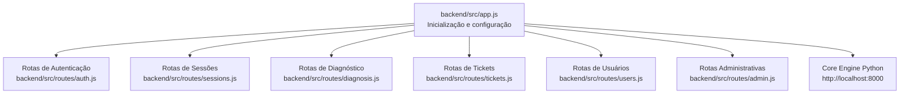
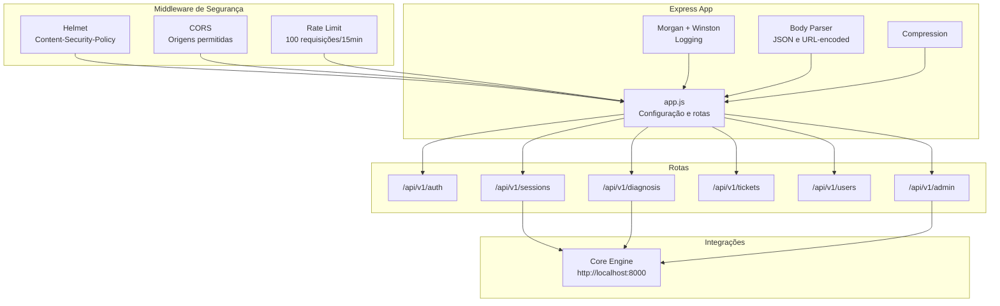
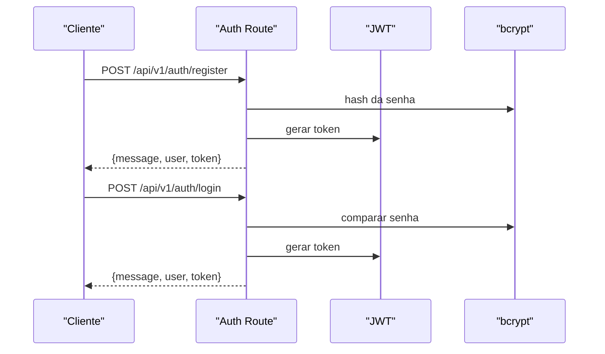
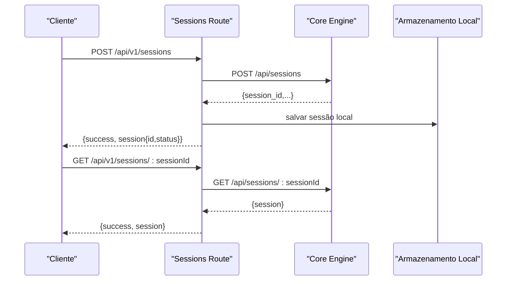
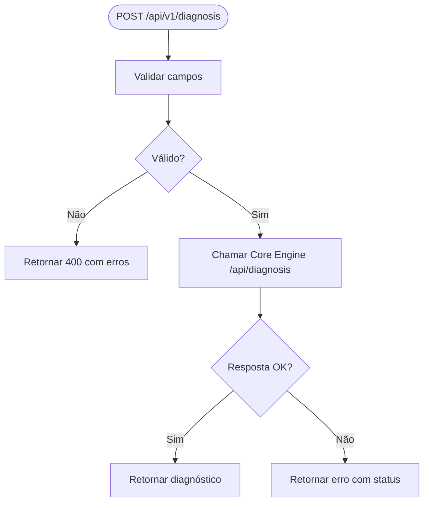
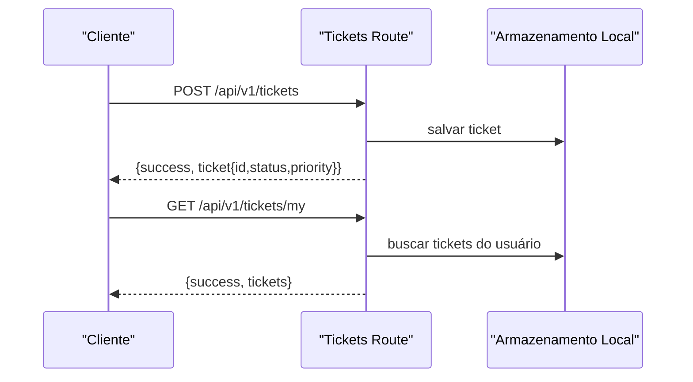
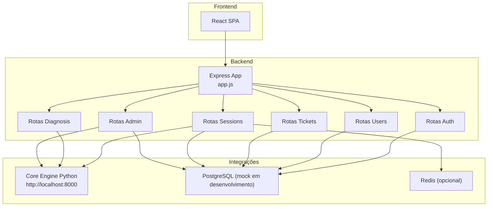
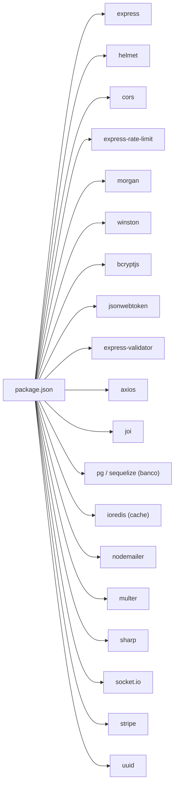

# Backend API (Node.js)

<cite>
**Arquivos referenciados neste documento**
- [app.js](file://backend/src/app.js)
- [package.json](file://backend/package.json)
- [auth.js](file://backend/src/routes/auth.js)
- [sessions.js](file://backend/src/routes/sessions.js)
- [diagnosis.js](file://backend/src/routes/diagnosis.js)
- [tickets.js](file://backend/src/routes/tickets.js)
- [users.js](file://backend/src/routes/users.js)
- [admin.js](file://backend/src/routes/admin.js)
- [README.md](file://README.md)
</cite>

## Sumário
1. [Introdução](#introdução)
2. [Estrutura do Projeto](#estrutura-do-projeto)
3. [Componentes Principais](#componentes-principais)
4. [Visão Geral da Arquitetura](#visão-geral-da-arquitetura)
5. [Análise Detalhada dos Componentes](#análise-detalhada-dos-componentes)
6. [Análise de Dependências](#análise-de-dependências)
7. [Considerações de Desempenho](#considerações-de-desempenho)
8. [Guia de Solução de Problemas](#guia-de-solução-de-problemas)
9. [Conclusão](#conclusão)
10. [Apêndice](#apêndice)

## Introdução
Esta documentação apresenta a API Backend Node.js do Bay-RSET Tool, um assistente guiado para recuperação de contas Apple ID. O backend é uma aplicação Express que fornece endpoints REST para autenticação, criação e acompanhamento de sessões de recuperação, diagnósticos, tickets de suporte e funcionalidades administrativas. Ele se integra com o Core Engine Python (motor de lógica de negócio) e oferece segurança robusta com JWT, Helmet, CORS e rate limiting.

## Estrutura do Projeto
O backend segue uma organização modular com base em camadas:
- Camada de inicialização e configuração: [app.js](file://backend/src/app.js)
- Rotas REST: pasta [backend/src/routes/](file://backend/src/routes/)
- Pacotes e dependências: [package.json](file://backend/package.json)

**Diagrama fonte**
- [app.js](file://backend/src/app.js)
- [auth.js](file://backend/src/routes/auth.js)
- [sessions.js](file://backend/src/routes/sessions.js)
- [diagnosis.js](file://backend/src/routes/diagnosis.js)
- [tickets.js](file://backend/src/routes/tickets.js)
- [users.js](file://backend/src/routes/users.js)
- [admin.js](file://backend/src/routes/admin.js)

**Seção fonte**
- [app.js](file://backend/src/app.js)
- [package.json](file://backend/package.json)

## Componentes Principais
- Servidor Express configurado com middlewares de segurança, logging, compressão e rate limiting.
- Rotas agrupadas por domínios de negócio: autenticação, sessões, diagnóstico, tickets, usuários e administração.
- Integração com Core Engine via requisições HTTP para operações críticas.
- Validação de dados com express-validator e Joi (instalado).
- Persistência mockada com Mapas (para desenvolvimento); em produção, substituir por banco de dados e Redis.

**Seção fonte**
- [app.js](file://backend/src/app.js)
- [auth.js](file://backend/src/routes/auth.js)
- [sessions.js](file://backend/src/routes/sessions.js)
- [diagnosis.js](file://backend/src/routes/diagnosis.js)
- [tickets.js](file://backend/src/routes/tickets.js)
- [users.js](file://backend/src/routes/users.js)
- [admin.js](file://backend/src/routes/admin.js)

## Visão Geral da Arquitetura
A API é composta por um servidor Express com middlewares de segurança e logging, roteamento modular e integração externa com o Core Engine Python. As rotas são protegidas por JWT e algumas possuem validações específicas.

**Diagrama fonte**
- [app.js](file://backend/src/app.js)
- [sessions.js](file://backend/src/routes/sessions.js)
- [diagnosis.js](file://backend/src/routes/diagnosis.js)
- [admin.js](file://backend/src/routes/admin.js)

## Análise Detalhada dos Componentes

### Configuração e Inicialização (app.js)
- Variáveis de ambiente: PORT, NODE_ENV, JWT_SECRET, CORE_ENGINE_URL, DATABASE_URL, REDIS_URL.
- Middlewares:
  - Helmet com CSP restritivo e conexão permitida ao Core Engine.
  - CORS com origens configuráveis.
  - Rate limiting global.
  - Body parsing com limites maiores.
  - Compression.
  - Morgan integrado ao Winston.
- Rotas registradas sob /api/v1:
  - /api/v1/auth, /api/v1/sessions, /api/v1/diagnosis, /api/v1/tickets, /api/v1/users, /api/v1/admin.
- Ponto de saúde (/health) e documentação básica (/api/v1).
- Tratamento de erros 404 e handler global com logging.

**Seção fonte**
- [app.js](file://backend/src/app.js)

### Autenticação (auth.js)
- Endpoints:
  - POST /api/v1/auth/register: Registra novo usuário com validação de email, senha e nome. Gera hash de senha e JWT.
  - POST /api/v1/auth/login: Valida credenciais, verifica status ativo e gera JWT.
  - GET /api/v1/auth/profile: Retorna perfil do usuário autenticado.
  - POST /api/v1/auth/logout: Placeholder de logout.
  - POST /api/v1/auth/refresh: Renova token JWT.
- Validação: express-validator para campos obrigatórios e formatação.
- Segurança: JWT com secret configurável, middleware authenticate.
- Limite de tentativas: rate limiter específico para login.

**Diagrama fonte**
- [auth.js](file://backend/src/routes/auth.js)

**Seção fonte**
- [auth.js](file://backend/src/routes/auth.js)

### Sessões (sessions.js)
- Propósito: criar, consultar e atualizar sessões de recuperação, integrando-se ao Core Engine.
- Endpoints:
  - POST /api/v1/sessions: Cria sessão no Core Engine e armazena localmente.
  - GET /api/v1/sessions/:sessionId: Consulta sessão no Core Engine.
  - PATCH /api/v1/sessions/:sessionId: Atualiza campos permitidos (somente usuários autenticados).
  - POST /api/v1/sessions/:sessionId/consent: Registra consentimento no Core Engine e atualiza local.
  - GET /api/v1/sessions: Lista todas as sessões (apenas admin).
  - GET /api/v1/sessions/stats/overview: Busca estatísticas do Core Engine.
- Validação: UUID para sessionId, enumeração de tipos de problema.
- Integração: requisições HTTP ao Core Engine.

**Diagrama fonte**
- [sessions.js](file://backend/src/routes/sessions.js)

**Seção fonte**
- [sessions.js](file://backend/src/routes/sessions.js)

### Diagnóstico (diagnosis.js)
- Endpoints:
  - POST /api/v1/diagnosis: Envia dados para o Core Engine e retorna diagnóstico.
  - GET /api/v1/diagnosis/guide/:problemType: Busca guia de recuperação.
  - POST /api/v1/diagnosis/validate: Valida tipo de problema e sugestões.
- Validação: enumeração de tipos de problema, campos obrigatórios.
- Integração: Core Engine.

**Diagrama fonte**
- [diagnosis.js](file://backend/src/routes/diagnosis.js)

**Seção fonte**
- [diagnosis.js](file://backend/src/routes/diagnosis.js)

### Tickets (tickets.js)
- Sistema completo de tickets de suporte com mensagens, status e prioridades.
- Endpoints:
  - POST /api/v1/tickets: Cria ticket com assunto, descrição, categoria e prioridade.
  - GET /api/v1/tickets/my: Lista tickets do usuário logado.
  - GET /api/v1/tickets/:ticketId: Detalhe do ticket com permissões.
  - POST /api/v1/tickets/:ticketId/messages: Adiciona mensagem ao ticket.
  - PATCH /api/v1/tickets/:ticketId/status: Atualiza status (apenas admin/suporte).
  - GET /api/v1/tickets: Lista todos os tickets com filtros (apenas admin/suporte).
  - GET /api/v1/tickets/stats/overview: Estatísticas de tickets.
- Validação: express-validator com enums de status, prioridades e categorias.
- Controle de acesso baseado em papel (admin, support, user).

**Diagrama fonte**
- [tickets.js](file://backend/src/routes/tickets.js)

**Seção fonte**
- [tickets.js](file://backend/src/routes/tickets.js)

### Usuários (users.js)
- Endpoints:
  - GET /api/v1/users/profile: Perfil do usuário logado.
  - PATCH /api/v1/users/profile: Atualiza nome e email.
  - POST /api/v1/users/change-password: Altera senha com verificação da senha atual.
  - GET /api/v1/users/activity: Histórico de atividades (mock).
  - GET /api/v1/users/sessions: Sessões ativas (mock).
  - DELETE /api/v1/users/sessions/:sessionId: Encerra sessão (mock).
- Validação: express-validator.
- Segurança: middleware authenticate.

**Seção fonte**
- [users.js](file://backend/src/routes/users.js)

### Administração (admin.js)
- Endpoints restritos a administradores:
  - GET /api/v1/admin/dashboard: Busca estatísticas do Core Engine e status do sistema.
  - GET /api/v1/admin/users: Paginação de usuários (mock).
  - PATCH /api/v1/admin/users/:userId/role: Atualiza papel do usuário.
  - PATCH /api/v1/admin/users/:userId/status: Ativa/desativa usuário.
  - GET /api/v1/admin/logs: Filtros de logs (mock).
  - GET /api/v1/admin/settings: Configurações do sistema.
  - PATCH /api/v1/admin/settings: Atualiza configurações.
  - GET /api/v1/admin/metrics: Métricas do sistema e do Core Engine.
  - POST /api/v1/admin/backup: Inicia backup.
  - POST /api/v1/admin/restore: Inicia restauração.
- Validação: express-validator.
- Segurança: requireAdmin (verifica papel admin).

**Seção fonte**
- [admin.js](file://backend/src/routes/admin.js)

## Visão Geral da Arquitetura

**Diagrama fonte**
- [app.js](file://backend/src/app.js)
- [auth.js](file://backend/src/routes/auth.js)
- [sessions.js](file://backend/src/routes/sessions.js)
- [diagnosis.js](file://backend/src/routes/diagnosis.js)
- [tickets.js](file://backend/src/routes/tickets.js)
- [users.js](file://backend/src/routes/users.js)
- [admin.js](file://backend/src/routes/admin.js)

## Análise de Dependências

**Diagrama fonte**
- [package.json](file://backend/package.json)

**Seção fonte**
- [package.json](file://backend/package.json)

## Considerações de Desempenho
- Compressão ativada para reduzir tamanho de respostas.
- Rate limiting global e específico para login para mitigar ataques.
- Uso de requisições HTTP para operações assíncronas com o Core Engine.
- Em produção, considerar:
  - Persistência com banco de dados e Redis.
  - Pool de conexões e índices otimizados.
  - Caching estratégico para consultas frequentes.
  - Monitoramento de métricas e logs centralizados.

## Guia de Solução de Problemas
- Erros 404: Endpoint inexistente. Verifique a rota e método HTTP.
- Erros 401/403: Falha na autenticação ou permissões insuficientes. Confirme o token Bearer e papel do usuário.
- Erros 400: Validação falhou. Revise os campos obrigatórios e formatos.
- Erros 500: Erro interno. Verifique logs do servidor e integrações com o Core Engine.
- Rate limit: Excedeu o limite de requisições. Aguarde o período de espera.

**Seção fonte**
- [app.js](file://backend/src/app.js)

## Conclusão
A API Backend do Bay-RSET Tool oferece uma arquitetura modular, com segurança sólida e integração com o Core Engine Python. As rotas cobrem todo o fluxo de recuperação de contas Apple ID, desde a autenticação até o acompanhamento de tickets. Para produção, recomenda-se substituir os armazenamentos mockados por persistência real e adotar práticas de segurança e monitoramento avançadas.

## Apêndice

### Endpoints REST Disponíveis

- Base: http://localhost:3000/api/v1
- Observações:
  - Todos os endpoints protegidos exigem Authorization: Bearer <token>.
  - Respostas incluem campo success:true nos casos bem-sucedidos, exceto quando especificado.

#### Autenticação
- POST /auth/register
  - Corpo: { email, password, name }
  - Resposta: { message, user{id,email,name,role}, token }
- POST /auth/login
  - Corpo: { email, password }
  - Resposta: { message, user{id,email,name,role}, token }
- GET /auth/profile
  - Resposta: { id, email, name, role, createdAt }
- POST /auth/logout
  - Resposta: { message }
- POST /auth/refresh
  - Resposta: { token }

**Seção fonte**
- [auth.js](file://backend/src/routes/auth.js)

#### Sessões
- POST /sessions
  - Corpo: { email, problemType }
  - Resposta: { success, session{id,status,createdAt} }
- GET /sessions/:sessionId
  - Parâmetro: sessionId (UUID)
  - Resposta: { success, session }
- PATCH /sessions/:sessionId
  - Parâmetro: sessionId (UUID)
  - Corpo: { email, problemType, status, notes }
  - Resposta: { success, session }
- POST /sessions/:sessionId/consent
  - Parâmetro: sessionId (UUID)
  - Corpo: { consentGiven: boolean, userAgent? }
  - Resposta: { success, consent }
- GET /sessions
  - Resposta: { success, count, sessions }
- GET /sessions/stats/overview
  - Resposta: { success, stats }

**Seção fonte**
- [sessions.js](file://backend/src/routes/sessions.js)

#### Diagnóstico
- POST /diagnosis
  - Corpo: { sessionId (UUID), problemType, hasProofOfPurchase?, hasDeviceAccess? }
  - Resposta: { success, diagnosis, timestamp }
- GET /diagnosis/guide/:problemType
  - Parâmetro: problemType ∈ {forgot-password, two-factor, activation-lock, account-locked, device-used}
  - Resposta: { success, guide }
- POST /diagnosis/validate
  - Corpo: { problemType, email? }
  - Resposta: { valid, problemType, email, availableTypes, suggestions }

**Seção fonte**
- [diagnosis.js](file://backend/src/routes/diagnosis.js)

#### Tickets
- POST /tickets
  - Corpo: { subject (5-200), description (≥10), category ∈ {password, icloud, device, account, other}, priority?, sessionId? }
  - Resposta: { success, ticket{id,status,priority,createdAt} }
- GET /tickets/my
  - Resposta: { success, count, tickets }
- GET /tickets/:ticketId
  - Parâmetro: ticketId (UUID)
  - Resposta: { success, ticket }
- POST /tickets/:ticketId/messages
  - Parâmetro: ticketId (UUID)
  - Corpo: { content (≥1) }
  - Resposta: { success, message }
- PATCH /tickets/:ticketId/status
  - Parâmetro: ticketId (UUID)
  - Corpo: { status ∈ {open,in_progress,waiting_user,resolved,closed}, resolution? }
  - Resposta: { success, ticket{id,status,updatedAt} }
- GET /tickets
  - Query: status?, priority?, category?
  - Resposta: { success, count, tickets }
- GET /tickets/stats/overview
  - Resposta: { success, stats }

**Seção fonte**
- [tickets.js](file://backend/src/routes/tickets.js)

#### Usuários
- GET /users/profile
  - Resposta: { success, user }
- PATCH /users/profile
  - Corpo: { name?, email? }
  - Resposta: { success, user }
- POST /users/change-password
  - Corpo: { currentPassword, newPassword (≥8) }
  - Resposta: { success, message }
- GET /users/activity
  - Resposta: { success, activities }
- GET /users/sessions
  - Resposta: { success, sessions }
- DELETE /users/sessions/:sessionId
  - Parâmetro: sessionId
  - Resposta: { success, message }

**Seção fonte**
- [users.js](file://backend/src/routes/users.js)

#### Administração
- GET /admin/dashboard
  - Resposta: { success, dashboard{coreStats,systemStatus} }
- GET /admin/users
  - Query: page?, limit?
  - Resposta: { success, users, pagination }
- PATCH /admin/users/:userId/role
  - Parâmetro: userId
  - Corpo: { role ∈ {user,support,admin} }
  - Resposta: { success, message }
- PATCH /admin/users/:userId/status
  - Parâmetro: userId
  - Corpo: { active: boolean }
  - Resposta: { success, message }
- GET /admin/logs
  - Query: level?, startDate?, endDate?, limit?
  - Resposta: { success, logs, filters }
- GET /admin/settings
  - Resposta: { success, settings }
- PATCH /admin/settings
  - Corpo: { maintenance?, registrationOpen? }
  - Resposta: { success, message, updated }
- GET /admin/metrics
  - Resposta: { success, metrics }
- POST /admin/backup
  - Resposta: { success, message, backupId, estimatedTime }
- POST /admin/restore
  - Corpo: { backupId }
  - Resposta: { success, message, backupId, warning }

**Seção fonte**
- [admin.js](file://backend/src/routes/admin.js)

### Exemplos Práticos de Chamadas

- Registrar usuário
  - Método: POST
  - URL: http://localhost:3000/api/v1/auth/register
  - Headers: Content-Type: application/json
  - Corpo: { "email": "...", "password": "...", "name": "..." }
  - Resposta: { "message", "user", "token" }

- Fazer login
  - Método: POST
  - URL: http://localhost:3000/api/v1/auth/login
  - Headers: Content-Type: application/json
  - Corpo: { "email": "...", "password": "..." }
  - Resposta: { "message", "user", "token" }

- Criar sessão
  - Método: POST
  - URL: http://localhost:3000/api/v1/sessions
  - Headers: Authorization: Bearer <token>, Content-Type: application/json
  - Corpo: { "email": "...", "problemType": "two-factor" }
  - Resposta: { "success", "session" }

- Enviar diagnóstico
  - Método: POST
  - URL: http://localhost:3000/api/v1/diagnosis
  - Headers: Authorization: Bearer <token>, Content-Type: application/json
  - Corpo: { "sessionId": "<uuid>", "problemType": "two-factor", "hasDeviceAccess": true }
  - Resposta: { "success", "diagnosis", "timestamp" }

- Criar ticket
  - Método: POST
  - URL: http://localhost:3000/api/v1/tickets
  - Headers: Authorization: Bearer <token>, Content-Type: application/json
  - Corpo: { "subject": "Problema de acesso", "description": "Detalhes...", "category": "icloud" }
  - Resposta: { "success", "ticket" }

- Acessar dashboard (admin)
  - Método: GET
  - URL: http://localhost:3000/api/v1/admin/dashboard
  - Headers: Authorization: Bearer <token>
  - Resposta: { "success", "dashboard" }

### Configuração de Ambiente
- Arquivo: .env (crie a partir de .env.example)
- Variáveis:
  - PORT=3000
  - NODE_ENV=development
  - JWT_SECRET=sua-chave-secreta-aqui
  - CORE_ENGINE_URL=http://localhost:8000
  - DATABASE_URL=...
  - REDIS_URL=...
  - ALLOWED_ORIGINS=http://localhost:3000

**Seção fonte**
- [app.js](file://backend/src/app.js)
- [README.md](file://README.md)

### Segurança
- JWT: Geração e verificação com secret configurável.
- Helmet: Headers de segurança e CSP restritivo.
- CORS: Origens permitidas configuráveis.
- Rate Limit: Proteção contra excesso de requisições.
- Validação: express-validator e Joi.
- Logging: Morgan + Winston.

**Seção fonte**
- [app.js](file://backend/src/app.js)
- [auth.js](file://backend/src/routes/auth.js)
- [sessions.js](file://backend/src/routes/sessions.js)
- [diagnosis.js](file://backend/src/routes/diagnosis.js)
- [tickets.js](file://backend/src/routes/tickets.js)
- [users.js](file://backend/src/routes/users.js)
- [admin.js](file://backend/src/routes/admin.js)

### Integrações
- Core Engine Python: Endpoints /api/sessions, /api/diagnosis, /api/guides, /api/stats.
- Banco de dados: PostgreSQL/Sequelize (configuração instalada).
- Redis: IoRedis (configuração instalada).
- Nodemailer, Stripe, Socket.IO, Multer, Sharp, UUID, Axios, Winston, Morgan, Helmet, CORS, Rate Limit, JWT, Bcrypt.

**Seção fonte**
- [sessions.js](file://backend/src/routes/sessions.js)
- [diagnosis.js](file://backend/src/routes/diagnosis.js)
- [admin.js](file://backend/src/routes/admin.js)
- [package.json](file://backend/package.json)