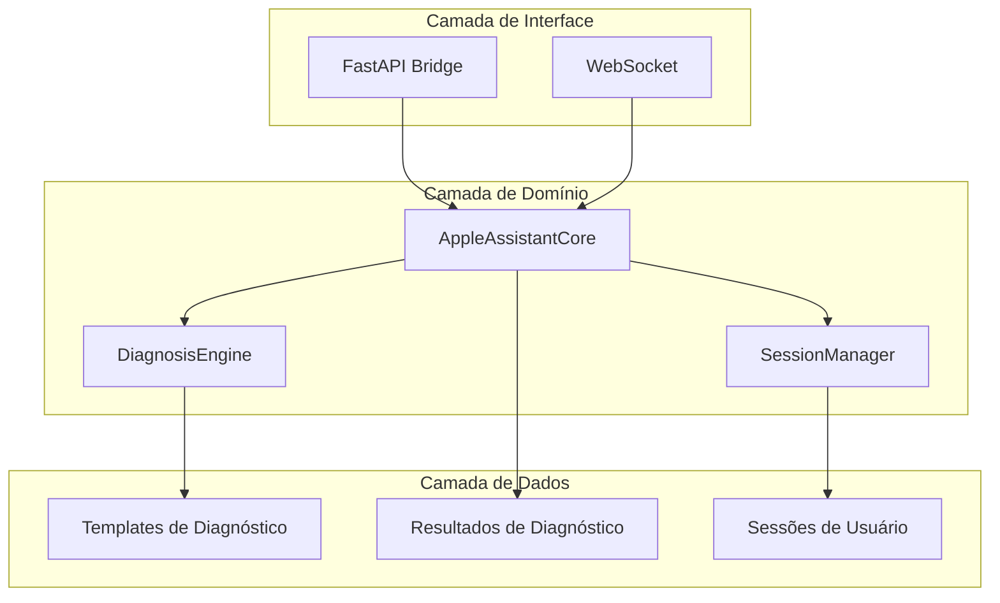
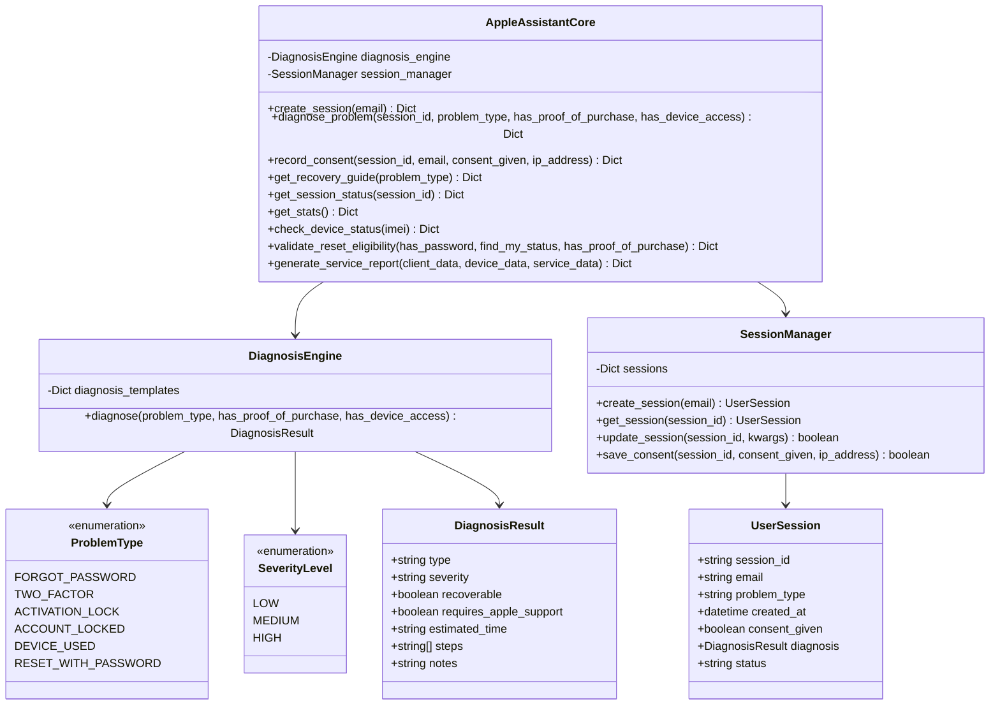
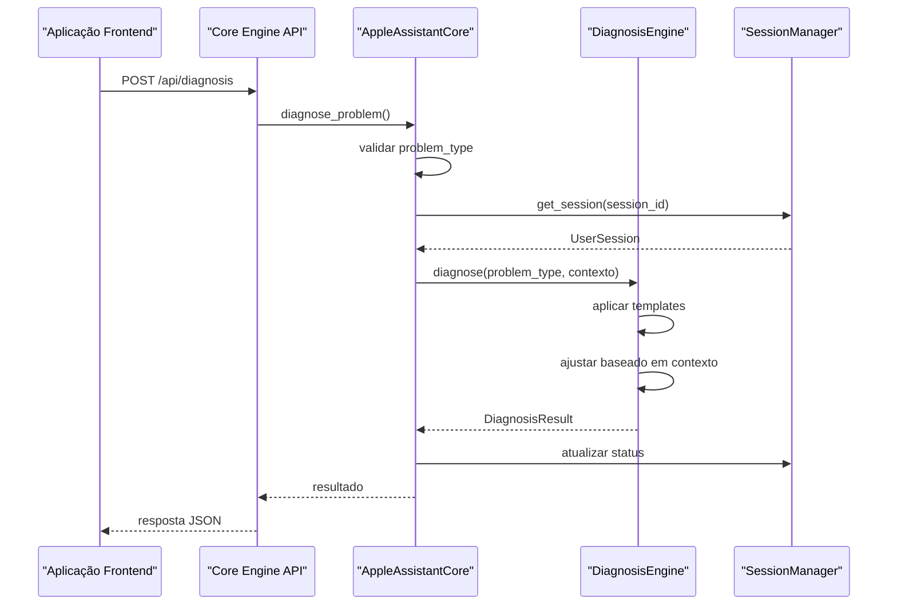
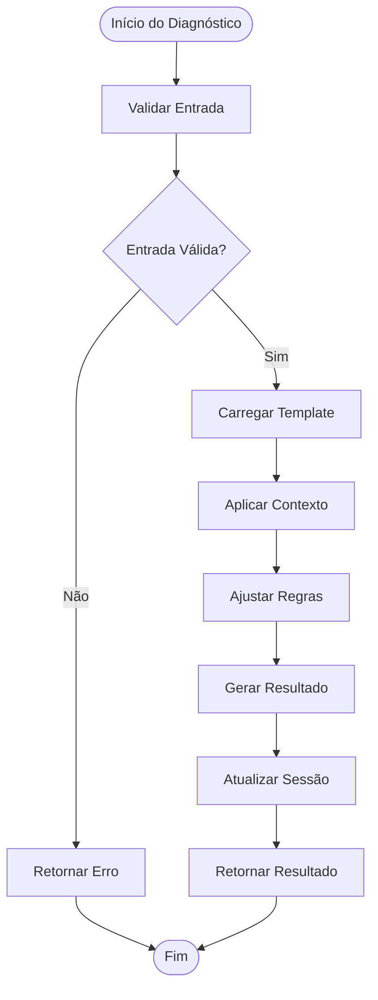

# Core Engine (Python)

<cite>
**Arquivos Referenciados Neste Documento**
- [main.py](file://core-engine/python/main.py)
- [api.py](file://core-engine/bridge/api.py)
- [requirements.txt](file://core-engine/python/requirements.txt)
- [README.md](file://README.md)
- [app.js](file://backend/src/app.js)
- [diagnosis.js](file://backend/src/routes/diagnosis.js)
</cite>

## Sumário
- [Introdução](#introdução)
- [Estrutura do Projeto](#estrutura-do-projeto)
- [Componentes Principais](#componentes-principais)
- [Arquitetura Geral](#arquitetura-geral)
- [Detalhamento dos Componentes](#detalhamento-dos-componentes)
- [Fluxos de Diagnóstico](#fluxos-de-diagnóstico)
- [Interface REST](#interface-rest)
- [Exemplos Práticos](#exemplos-práticos)
- [Extensibilidade](#extensibilidade)
- [Considerações de Desempenho](#considerações-de-desempenho)
- [Guia de Resolução de Problemas](#guia-de-resolução-de-problemas)
- [Conclusão](#conclusão)

## Introdução

O Core Engine Python do Bay-RSET Tool é o componente central do sistema de assistência inteligente para recuperação de contas Apple ID. Este motor de diagnóstico automatizado fornece fluxos guiados de recuperação baseados em regras de negócio rigorosas, seguindo exatamente os processos oficiais da Apple.

O sistema oferece suporte a diversos tipos de problemas comuns de contas Apple ID, incluindo recuperação de senha, verificação em duas etapas, bloqueio de ativação e contas bloqueadas. Cada diagnóstico gera um plano de recuperação personalizado com etapas específicas, níveis de severidade e tempo estimado de conclusão.

## Estrutura do Projeto

O Core Engine segue uma arquitetura modular com três camadas principais:



**Fontes**
- [main.py:1-701](file://core-engine/python/main.py#L1-L701)
- [api.py:1-563](file://core-engine/bridge/api.py#L1-L563)

## Componentes Principais

### Tipos de Problemas Suportados

O sistema oferece diagnósticos para os seguintes tipos de problemas:

| Tipo | Descrição | Severidade | Recuperável |
|------|-----------|------------|-------------|
| `forgot-password` | Senha esquecida | Baixa | Sim |
| `two-factor` | Verificação em 2 etapas | Média | Sim |
| `activation-lock` | Bloqueio de ativação (iCloud) | Alta | Depende do contexto |
| `account-locked` | Conta inacessível | Média | Sim |
| `device-used` | Dispositivo usado comprado | Alta | Geralmente não |
| `reset-with-password` | Reset profissional com senha iCloud | Baixa | Sim |

**Fontes**
- [main.py:35-43](file://core-engine/python/main.py#L35-L43)
- [main.py:79-167](file://core-engine/python/main.py#L79-L167)

### Níveis de Severidade

Os diagnósticos são classificados em três níveis de severidade:

- **Baixa**: Problemas simples e rápidos de resolver
- **Média**: Problemas que requerem mais tempo e atenção
- **Alta**: Problemas críticos que podem afetar o uso do dispositivo

**Fontes**
- [main.py:45-50](file://core-engine/python/main.py#L45-L50)

### Resultados de Diagnóstico

Cada diagnóstico retorna um objeto estruturado com:

- **Tipo de problema**: Descrição clara do problema
- **Severidade**: Nível de criticidade
- **Recuperável**: Indicador de sucesso esperado
- **Tempo estimado**: Duração aproximada do processo
- **Passos**: Lista de etapas específicas
- **Observações**: Informações adicionais importantes

**Fontes**
- [main.py:52-62](file://core-engine/python/main.py#L52-L62)

## Arquitetura Geral

O Core Engine implementa um padrão de design baseado em classes com responsabilidades bem definidas:



**Fontes**
- [main.py:35-74](file://core-engine/python/main.py#L35-L74)
- [main.py:76-261](file://core-engine/python/main.py#L76-L261)
- [main.py:263-652](file://core-engine/python/main.py#L263-L652)

## Detalhamento dos Componentes

### DiagnosisEngine

O motor de diagnóstico é a peça central do sistema, responsável por:

- Armazenar templates de diagnóstico para cada tipo de problema
- Aplicar regras de negócio específicas
- Gerar resultados personalizados com base nas condições fornecidas
- Ajustar recomendações com base em contexto adicional

**Fontes**
- [main.py:76-213](file://core-engine/python/main.py#L76-L213)

### SessionManager

Gerencia todo o ciclo de vida das sessões de usuário:

- Criação de novas sessões com IDs únicos
- Rastreamento de status e dados do usuário
- Registro de consentimentos e informações de IP
- Persistência temporária de informações de diagnóstico

**Fontes**
- [main.py:215-261](file://core-engine/python/main.py#L215-L261)

### AppleAssistantCore

A classe principal que coordena todas as operações:

- Interface unificada para todas as funcionalidades
- Validação de entrada e tratamento de erros
- Geração de relatórios e estatísticas
- Integração com sistemas externos

**Fontes**
- [main.py:263-652](file://core-engine/python/main.py#L263-L652)

## Fluxos de Diagnóstico

### Fluxo Básico de Diagnóstico



**Fontes**
- [main.py:281-327](file://core-engine/python/main.py#L281-L327)
- [api.py:251-283](file://core-engine/bridge/api.py#L251-L283)

### Fluxo de Recuperação Guiada



**Fontes**
- [main.py:169-213](file://core-engine/python/main.py#L169-L213)

## Interface REST

O Core Engine expõe uma API REST completa através do FastAPI:

### Endpoints Disponíveis

| Método | Endpoint | Descrição |
|--------|----------|-----------|
| GET | `/` | Informações básicas da API |
| GET | `/health` | Verificação de saúde do serviço |
| POST | `/api/sessions` | Criação de nova sessão |
| GET | `/api/sessions/{session_id}` | Status de sessão específica |
| POST | `/api/diagnosis` | Realizar diagnóstico |
| POST | `/api/consent` | Registrar consentimento |
| GET | `/api/guides/{problem_type}` | Obter guia de recuperação |
| GET | `/api/stats` | Estatísticas do sistema |
| POST | `/api/devices/check` | Verificação de dispositivo |
| POST | `/api/devices/reset-eligibility` | Verificar elegibilidade para reset |
| POST | `/api/service-report` | Gerar relatório de serviço |

**Fontes**
- [api.py:184-429](file://core-engine/bridge/api.py#L184-L429)

### Modelos de Dados

#### Requisições

| Modelo | Campos | Descrição |
|--------|--------|-----------|
| CreateSessionRequest | `email` (opcional) | Dados do Apple ID |
| DiagnosisRequest | `session_id`, `problem_type`, `has_proof_of_purchase`, `has_device_access` | Dados do diagnóstico |
| ConsentRequest | `session_id`, `email`, `consent_given`, `user_agent` | Consentimento do usuário |
| DeviceCheckRequest | `imei` | Dados do dispositivo |

#### Respostas

| Modelo | Campos | Descrição |
|--------|--------|-----------|
| CreateSessionResponse | `session_id`, `created_at`, `status` | Nova sessão criada |
| DiagnosisResponse | `session_id`, `diagnosis`, `timestamp` | Resultado do diagnóstico |
| ConsentResponse | `session_id`, `consent_id`, `timestamp`, `recorded` | Consentimento registrado |
| DeviceCheckResponse | `valid`, `imei`, `tac`, `carrier`, `checksum_valid`, `format_valid` | Status do dispositivo |

**Fontes**
- [api.py:36-144](file://core-engine/bridge/api.py#L36-L144)

## Exemplos Práticos

### Exemplo 1: Diagnóstico de Senha Esquecida

**Requisição:**
```json
{
  "session_id": "f47ac10b-58cc-4372-a567-0e02b2c3d479",
  "problem_type": "forgot-password",
  "has_proof_of_purchase": false,
  "has_device_access": true
}
```

**Resposta:**
```json
{
  "session_id": "f47ac10b-58cc-4372-a567-0e02b2c3d479",
  "diagnosis": {
    "type": "Senha Esquecida",
    "severity": "low",
    "recoverable": true,
    "requires_apple_support": false,
    "estimated_time": "15-30 minutos",
    "steps": [
      "Acessar iforgot.apple.com",
      "Verificar identidade via e-mail ou telefone",
      "Redefinir senha com nova senha segura",
      "Atualizar senha em todos os dispositivos"
    ],
    "notes": "Processo simples e rápido se tiver acesso ao e-mail ou telefone cadastrado"
  },
  "timestamp": "2024-01-15T10:30:00Z"
}
```

### Exemplo 2: Diagnóstico de Bloqueio de Ativação

**Requisição:**
```json
{
  "session_id": "f47ac10b-58cc-4372-a567-0e02b2c3d479",
  "problem_type": "activation-lock",
  "has_proof_of_purchase": true,
  "has_device_access": false
}
```

**Resposta:**
```json
{
  "session_id": "f47ac10b-58cc-4372-a567-0e02b2c3d479",
  "diagnosis": {
    "type": "Bloqueio de Ativação (iCloud)",
    "severity": "high",
    "recoverable": true,
    "requires_apple_support": true,
    "estimated_time": "3-7 dias úteis",
    "steps": [
      "Verificar posse do comprovante de compra original",
      "Preparar documentação (nota fiscal, IMEI)",
      "Solicitar remoção do bloqueio via Apple",
      "Aguardar análise e decisão da Apple"
    ],
    "notes": "CRÍTICO: Sem comprovante de compra, a Apple NÃO remove o bloqueio"
  },
  "timestamp": "2024-01-15T10:30:00Z"
}
```

## Extensibilidade

### Adicionando Novos Tipos de Problemas

Para expandir o sistema com novos tipos de problemas, siga estas etapas:

1. **Adicionar novo tipo à enumeração:**
   ```python
   class ProblemType(Enum):
       # ... outros tipos existentes
       NEW_PROBLEM_TYPE = "new-problem-type"
   ```

2. **Adicionar template ao DiagnosisEngine:**
   ```python
   self.diagnosis_templates[ProblemType.NEW_PROBLEM_TYPE] = {
       "type": "Novo Problema",
       "severity": SeverityLevel.LOW,
       "recoverable": True,
       "requires_apple_support": False,
       "estimated_time": "5-10 minutos",
       "steps": [
           "Etapa 1",
           "Etapa 2",
           "Etapa 3"
       ],
       "notes": "Informações importantes"
   }
   ```

3. **Atualizar validações se necessário:**
   - Atualizar rotas de backend para aceitar o novo tipo
   - Adicionar validações específicas se necessário

### Adicionando Novas Regras de Negócio

Para implementar regras mais complexas:

1. **Modificar o método diagnose:**
   ```python
   def diagnose(self, problem_type, has_proof_of_purchase=False, has_device_access=False):
       # ... lógica existente
       
       # Nova regra personalizada
       if problem_type == ProblemType.NEW_PROBLEM_TYPE:
           if has_specific_condition:
               # Regra especial
               pass
       
       # ... restante do método
   ```

2. **Adicionar métodos auxiliares:**
   ```python
   def _apply_new_business_rule(self, context):
       # Implementar regra específica
       pass
   ```

**Fontes**
- [main.py:79-167](file://core-engine/python/main.py#L79-L167)
- [main.py:169-213](file://core-engine/python/main.py#L169-L213)

## Considerações de Desempenho

### Otimizações Implementadas

- **Uso de dataclasses**: Para otimizar o armazenamento e acesso a dados
- **Logging eficiente**: Com separação de logs em arquivo e console
- **Validação de entrada**: Com Pydantic para garantir integridade dos dados
- **Tratamento assíncrono**: Para operações que podem ser paralelizadas

### Melhorias Potenciais

- **Cache de resultados**: Para diagnósticos repetidos
- **Pool de conexões**: Para operações externas
- **Monitoramento de desempenho**: Métricas de tempo de resposta
- **Rate limiting**: Para proteção contra sobrecarga

## Guia de Resolução de Problemas

### Erros Comuns

| Erro | Causa Provável | Solução |
|------|----------------|---------|
| `Tipo de problema inválido` | problem_type incorreto | Verificar lista de tipos válidos |
| `Sessão não encontrada` | session_id inválido | Criar nova sessão antes do diagnóstico |
| `Core Engine não inicializado` | API não iniciada | Verificar status do serviço |
| `IMEI inválido` | Formato incorreto | Verificar se tem 15 dígitos |

### Diagnóstico de Problemas

1. **Verificar status do serviço:**
   ```
   curl http://localhost:8000/health
   ```

2. **Testar endpoint raiz:**
   ```
   curl http://localhost:8000/
   ```

3. **Validar dados de entrada:**
   - Verificar se session_id é um UUID válido
   - Confirmar que problem_type está na lista permitida
   - Validar formatos de dados (IMEI, e-mail)

**Fontes**
- [api.py:203-211](file://core-engine/bridge/api.py#L203-L211)
- [main.py:297-303](file://core-engine/python/main.py#L297-L303)

## Conclusão

O Core Engine Python do Bay-RSET Tool representa uma solução robusta e escalável para assistência inteligente de recuperação de contas Apple ID. Sua arquitetura baseada em classes, templates de diagnóstico e regras de negócio bem definidas permite:

- **Precisão**: Diagnósticos baseados em processos oficiais da Apple
- **Escalabilidade**: Facilidade de adicionar novos tipos de problemas
- **Manutenibilidade**: Código organizado e bem documentado
- **Segurança**: Validação rigorosa de dados e consentimento do usuário

A implementação segue rigorosamente os processos oficiais da Apple, garantindo que todas as recuperações sejam legais e seguras, evitando qualquer forma de bypass ou desbloqueio ilegal.

O sistema está pronto para ser expandido com novos tipos de problemas e funcionalidades, mantendo a mesma qualidade de código e conformidade com as melhores práticas de desenvolvimento.