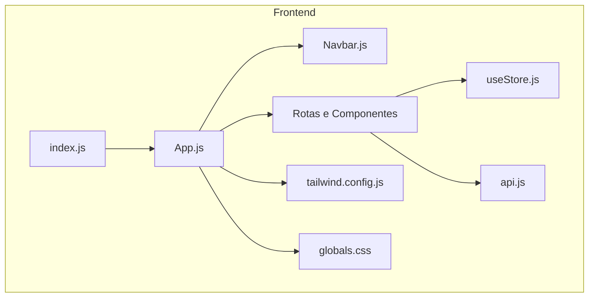
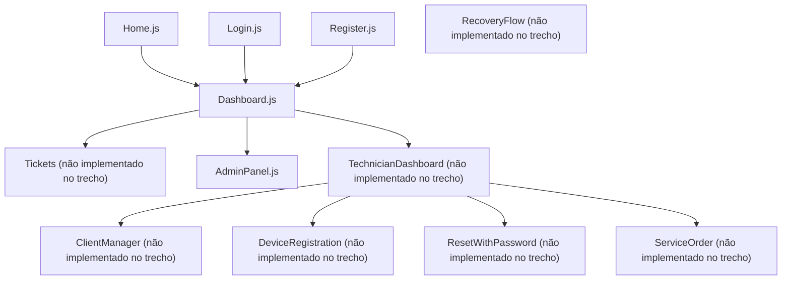
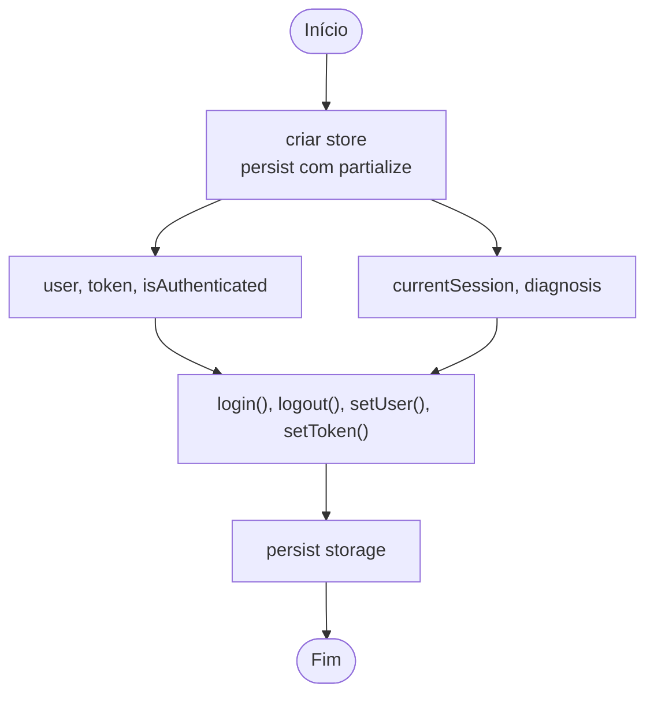
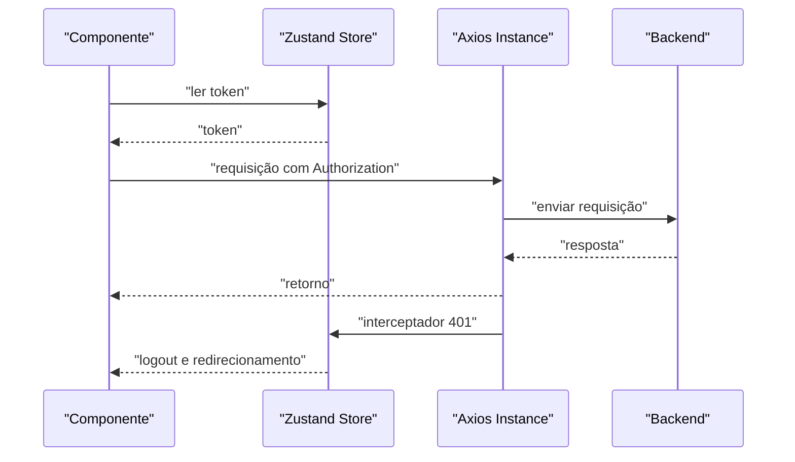
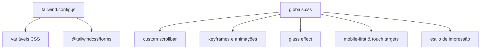
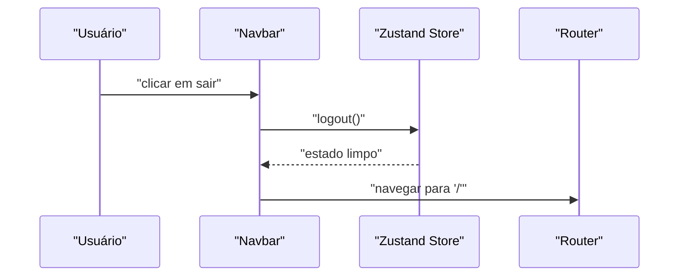
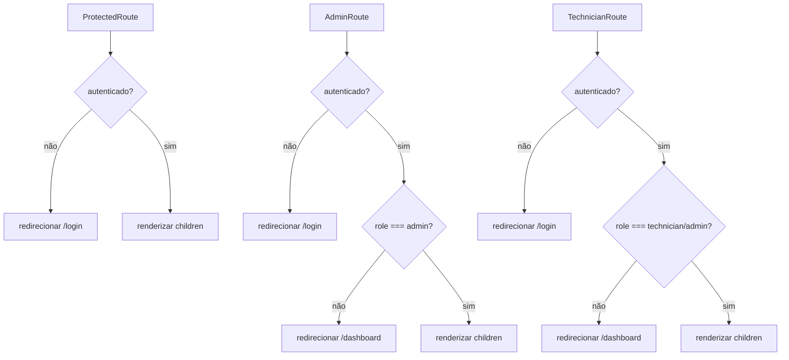
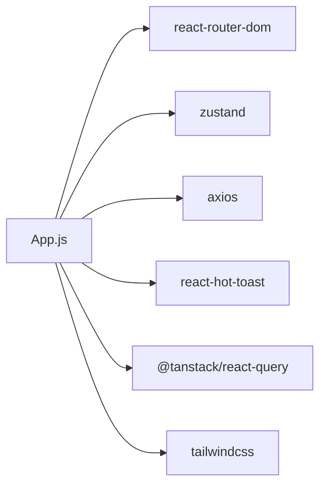

# Frontend React

<cite>
**Arquivo referenciados neste documento**
- [App.js](file://frontend/src/App.js)
- [index.js](file://frontend/src/index.js)
- [useStore.js](file://frontend/src/store/useStore.js)
- [api.js](file://frontend/src/services/api.js)
- [tailwind.config.js](file://frontend/tailwind.config.js)
- [globals.css](file://frontend/src/styles/globals.css)
- [Navbar.js](file://frontend/src/components/Navbar.js)
- [ProtectedRoute.js](file://frontend/src/components/ProtectedRoute.js)
- [AdminRoute.js](file://frontend/src/components/AdminRoute.js)
- [TechnicianRoute.js](file://frontend/src/components/TechnicianRoute.js)
- [Home.js](file://frontend/src/pages/Home.js)
- [Dashboard.js](file://frontend/src/pages/Dashboard.js)
- [AdminPanel.js](file://frontend/src/pages/AdminPanel.js)
- [Login.js](file://frontend/src/pages/Login.js)
- [Register.js](file://frontend/src/pages/Register.js)
</cite>

## Índice
1. [Introdução](#introdução)
2. [Estrutura do Projeto](#estrutura-do-projeto)
3. [Componentes Principais](#componentes-principais)
4. [Arquitetura Geral](#arquitetura-geral)
5. [Análise Detalhada dos Componentes](#análise-detalhada-dos-componentes)
6. [Análise de Dependências](#análise-de-dependências)
7. [Considerações de Desempenho](#considerações-de-desempenho)
8. [Guia de Solução de Problemas](#guia-de-solução-de-problemas)
9. [Conclusão](#conclusão)
10. [Apêndices](#apêndices)

## Introdução
Este documento apresenta a documentação técnica do frontend React do Bay-RSET Tool. Ele descreve a arquitetura de componentes, padrões de design, fluxo de navegação, gerenciamento de estado com Zustand, integração com a API backend, implementação de rotas protegidas e administrativas, além de orientações para estender a interface com base no design system TailwindCSS e práticas de responsividade.

## Estrutura do Projeto
O frontend é uma aplicação React configurada com:
- Roteamento com React Router DOM
- Gerenciamento de estado com Zustand (persistido no armazenamento local)
- Integração com API via Axios com interceptadores para autenticação e tratamento de erros
- Design system baseado em TailwindCSS com variáveis CSS e plugins personalizados
- Notificações com React Hot Toast

**Diagrama fonte**
- [index.js:1-12](file://frontend/src/index.js#L1-L12)
- [App.js:1-128](file://frontend/src/App.js#L1-L128)
- [Navbar.js:1-202](file://frontend/src/components/Navbar.js#L1-L202)
- [useStore.js:1-53](file://frontend/src/store/useStore.js#L1-L53)
- [api.js:1-130](file://frontend/src/services/api.js#L1-L130)
- [tailwind.config.js:1-72](file://frontend/tailwind.config.js#L1-L72)
- [globals.css:1-333](file://frontend/src/styles/globals.css#L1-L333)

**Seção fonte**
- [index.js:1-12](file://frontend/src/index.js#L1-L12)
- [App.js:1-128](file://frontend/src/App.js#L1-L128)

## Componentes Principais
- Navbar: Barra de navegação responsiva com links condicionais baseados no papel do usuário e botão de saída.
- Rotas Protegidas:
  - ProtectedRoute: Restringe acesso às rotas protegidas somente para usuários autenticados.
  - AdminRoute: Restringe acesso às rotas administrativas somente para usuários com papel “admin”.
  - TechnicianRoute: Restringe acesso às rotas técnicas somente para usuários com papel “technician” ou “admin”.

**Seção fonte**
- [Navbar.js:1-202](file://frontend/src/components/Navbar.js#L1-L202)
- [ProtectedRoute.js:1-16](file://frontend/src/components/ProtectedRoute.js#L1-L16)
- [AdminRoute.js:1-20](file://frontend/src/components/AdminRoute.js#L1-L20)
- [TechnicianRoute.js:1-21](file://frontend/src/components/TechnicianRoute.js#L1-L21)

## Arquitetura Geral
A aplicação segue um modelo de roteamento declarativo com três camadas de proteção:
- Páginas públicas: Home, Login, Registro
- Páginas protegidas: Dashboard, Recuperação, Tickets
- Páginas administrativas: Painel Administrativo
- Páginas técnicas: Dashboard técnico, Gestor de Clientes, Cadastro de Dispositivos, Reset com Senha, Ordens de Serviço

**Diagrama fonte**
- [App.js:42-125](file://frontend/src/App.js#L42-L125)

**Seção fonte**
- [App.js:42-125](file://frontend/src/App.js#L42-L125)

## Análise Detalhada dos Componentes

### Estado Global com Zustand
O estado global é gerenciado com Zustand e persistido localmente. As principais propriedades incluem:
- Autenticação: usuário, token, autenticado
- Sessão: sessão atual, diagnóstico
- Ações: login, logout, definição de usuário/token, sessão e diagnóstico
- Computado: isAdmin

**Diagrama fonte**
- [useStore.js:4-52](file://frontend/src/store/useStore.js#L4-L52)

**Seção fonte**
- [useStore.js:1-53](file://frontend/src/store/useStore.js#L1-L53)

### Integração com API
O módulo de serviço cria uma instância Axios com:
- Base URL configurável via variável de ambiente
- Interceptador de requisições adiciona Authorization header quando o token estiver presente
- Interceptador de respostas trata erros 401 encerrando sessão e redirecionando para login

Os módulos de API agrupam chamadas por domínios:
- Autenticação: login, registro, logout, perfil, refresh
- Sessões: criar, obter, atualizar, consentimento, listar, estatísticas
- Diagnósticos: realizar, guia, validar
- Tickets: criar, listar, obter, adicionar mensagem, estatísticas
- Administração: dashboard, usuários, atualizar papel/status, logs, configurações, métricas
- Técnico: dashboard, estatísticas, fluxo de reset, guia de reset
- Clientes: listar, criar, obter, atualizar
- Dispositivos: listar, criar, obter, verificar
- Ordens de Serviço: listar, criar, obter, atualizar, completar
- Relatórios: obter por ordem, obter por cliente, gerar

**Diagrama fonte**
- [api.js:15-40](file://frontend/src/services/api.js#L15-L40)

**Seção fonte**
- [api.js:1-130](file://frontend/src/services/api.js#L1-L130)

### Design System e Responsividade
O design utiliza TailwindCSS com:
- Variáveis CSS para cores, bordas e tipografia
- Plugins: forms
- Estilos globais para scrollbars, animações, efeitos vitrificados, foco de inputs
- Recursos específicos para mobile-first, safe areas, alinhamento com as diretrizes de toque da Apple, tabelas responsivas, modais e impressão

**Diagrama fonte**
- [tailwind.config.js:1-72](file://frontend/tailwind.config.js#L1-L72)
- [globals.css:1-333](file://frontend/src/styles/globals.css#L1-L333)

**Seção fonte**
- [tailwind.config.js:1-72](file://frontend/tailwind.config.js#L1-L72)
- [globals.css:1-333](file://frontend/src/styles/globals.css#L1-L333)

### Páginas e Navegação

#### Home
- Seção hero com call-to-action
- Aviso importante
- Características e fluxo explicativo
- Indicadores de confiança

**Seção fonte**
- [Home.js:1-137](file://frontend/src/pages/Home.js#L1-L137)

#### Dashboard
- Estatísticas resumidas
- Ações rápidas
- Atividade recente
- Seção de ajuda

**Seção fonte**
- [Dashboard.js:1-212](file://frontend/src/pages/Dashboard.js#L1-L212)

#### AdminPanel
- Abas: Visão Geral, Usuários, Sessões, Configurações
- Status do sistema
- Métricas de sessões e diagnósticos
- Distribuição de problemas
- Tabela de usuários (mock)
- Configurações do sistema

**Seção fonte**
- [AdminPanel.js:1-324](file://frontend/src/pages/AdminPanel.js#L1-L324)

#### Login
- Formulário de login com validações
- Exibição de senha
- Feedback com toast
- Redirecionamento após sucesso

**Seção fonte**
- [Login.js:1-122](file://frontend/src/pages/Login.js#L1-L122)

#### Registro
- Formulário de registro com força da senha
- Termos de uso
- Validações antes de enviar
- Feedback com toast

**Seção fonte**
- [Register.js:1-213](file://frontend/src/pages/Register.js#L1-L213)

### Componentes Reutilizáveis

#### Navbar
- Navegação condicional baseada em autenticação e papel
- Menu mobile com ícones
- Logout com limpeza de estado

**Diagrama fonte**
- [Navbar.js:11-14](file://frontend/src/components/Navbar.js#L11-L14)

**Seção fonte**
- [Navbar.js:1-202](file://frontend/src/components/Navbar.js#L1-L202)

#### Rotas Protegidas
- ProtectedRoute: redireciona para login se não autenticado
- AdminRoute: redireciona para dashboard se não for admin
- TechnicianRoute: permite apenas técnico/admin

**Diagrama fonte**
- [ProtectedRoute.js:5-13](file://frontend/src/components/ProtectedRoute.js#L5-L13)
- [AdminRoute.js:5-17](file://frontend/src/components/AdminRoute.js#L5-L17)
- [TechnicianRoute.js:5-18](file://frontend/src/components/TechnicianRoute.js#L5-L18)

**Seção fonte**
- [ProtectedRoute.js:1-16](file://frontend/src/components/ProtectedRoute.js#L1-L16)
- [AdminRoute.js:1-20](file://frontend/src/components/AdminRoute.js#L1-L20)
- [TechnicianRoute.js:1-21](file://frontend/src/components/TechnicianRoute.js#L1-L21)

## Análise de Dependências
- React Router DOM: roteamento declarativo e navegação
- Zustand: gerenciamento de estado leve e persistido
- Axios: comunicação HTTP com interceptadores
- React Hot Toast: notificações
- @tanstack/react-query: cache e invalidação de dados (configuração default)
- TailwindCSS: design system e estilização

**Diagrama fonte**
- [App.js:2-4](file://frontend/src/App.js#L2-L4)
- [useStore.js:1-2](file://frontend/src/store/useStore.js#L1-L2)
- [api.js:1-2](file://frontend/src/services/api.js#L1-L2)

**Seção fonte**
- [App.js:1-128](file://frontend/src/App.js#L1-L128)

## Considerações de Desempenho
- Cache de consultas com tempo “stale” e número limitado de tentativas configurados no QueryClient.
- Persistência de estado com Zustand reduz requisições desnecessárias após login.
- Interceptadores de erro evitam requisições inválidas e tratam automaticamente tokens expirados.
- Recomendações:
  - Utilizar QueryClient devem ser configurados conforme necessidade de cada recurso.
  - Limitar o escopo de atualizações de estado com Zustand e evitar estados desnecessários.
  - Adicionar loading states e skeletons para melhor experiência em redes lentas.

[Sem fonte pois esta seção fornece orientações gerais]

## Guia de Solução de Problemas
- Erro 401 não tratado: O interceptador de respostas encerra sessão e redireciona para login. Verifique se o token está sendo enviado corretamente.
- Erros de validação de formulário: Confirme que os campos obrigatórios estão preenchidos e que as validações estão sendo disparadas antes do submit.
- Navegação bloqueada: Verifique as permissões do usuário e o funcionamento das rotas protegidas.

**Seção fonte**
- [api.js:29-40](file://frontend/src/services/api.js#L29-L40)
- [Login.js:19-35](file://frontend/src/pages/Login.js#L19-L35)
- [Register.js:22-53](file://frontend/src/pages/Register.js#L22-L53)

## Conclusão
O frontend do Bay-RSET Tool foi projetado com uma arquitetura modular, utilizando Zustand para gerenciamento de estado, Axios com interceptadores para integração com backend, e TailwindCSS para um design responsivo e consistente. As rotas protegidas garantem acesso seguro às funcionalidades, enquanto o design system permite fácil extensão e manutenção da interface.

[Sem fonte pois esta seção resume sem analisar arquivos específicos]

## Apêndices

### Exemplos de Uso de Componentes
- Para adicionar uma nova página protegida:
  - Crie o componente da página
  - Importe no App.js
  - Envolva com ProtectedRoute, AdminRoute ou TechnicianRoute conforme necessário
  - Adicione o link no Navbar se for público

- Para consumir a API:
  - Importe o módulo de API correspondente
  - Utilize funções assíncronas e trate erros com toast
  - Atualize o estado com Zustand quando necessário

- Para estender o design:
  - Utilize classes do TailwindCSS
  - Defina novas variáveis CSS em globals.css
  - Mantenha a consistência com o design system

**Seção fonte**
- [App.js:49-107](file://frontend/src/App.js#L49-L107)
- [Navbar.js:32-73](file://frontend/src/components/Navbar.js#L32-L73)
- [api.js:43-130](file://frontend/src/services/api.js#L43-L130)
- [globals.css:5-333](file://frontend/src/styles/globals.css#L5-L333)