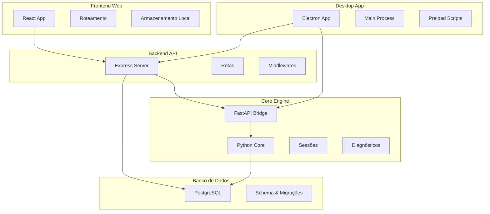
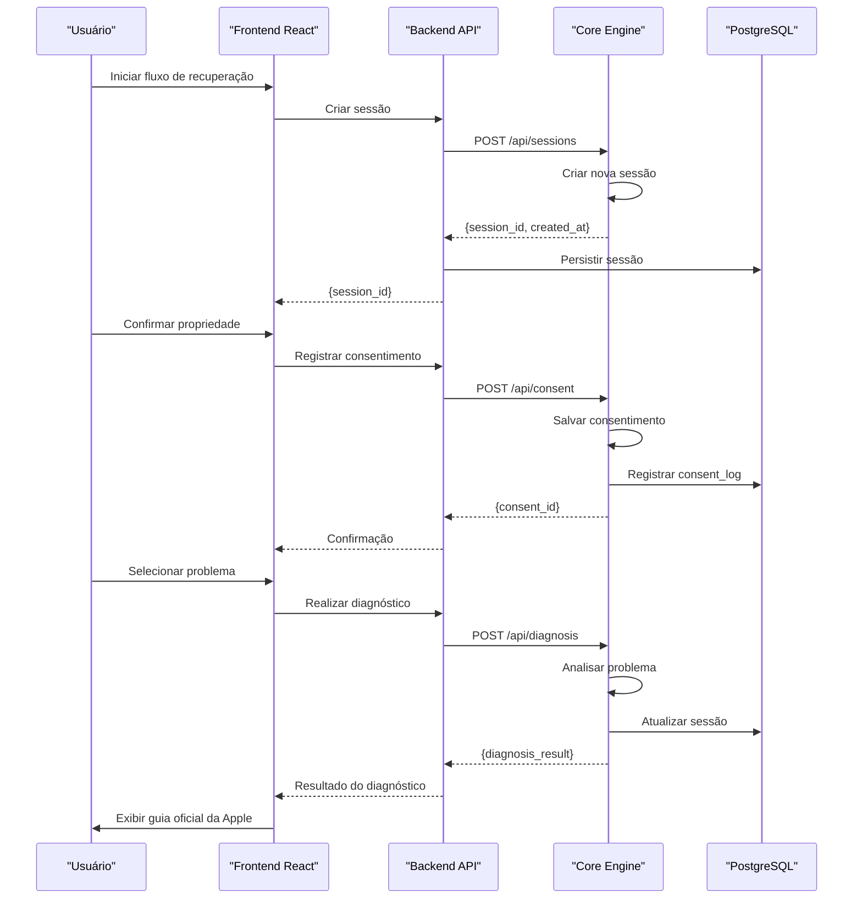
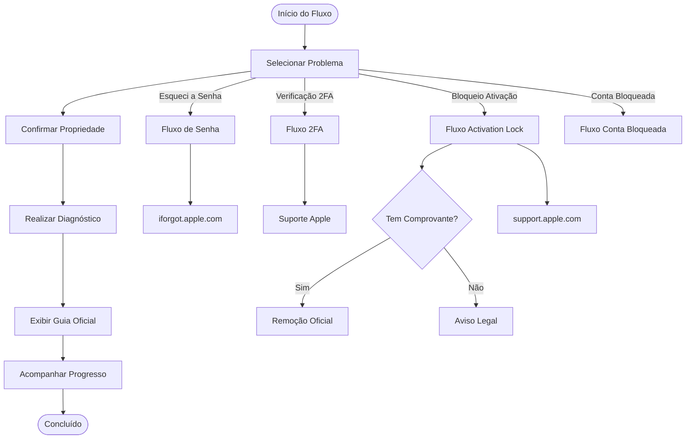
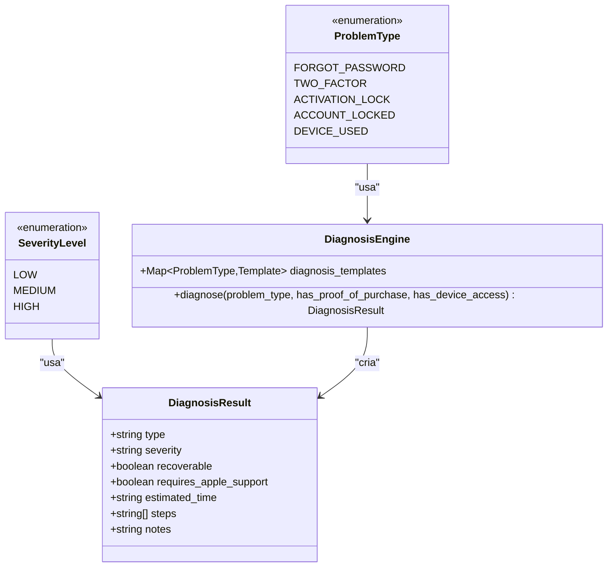
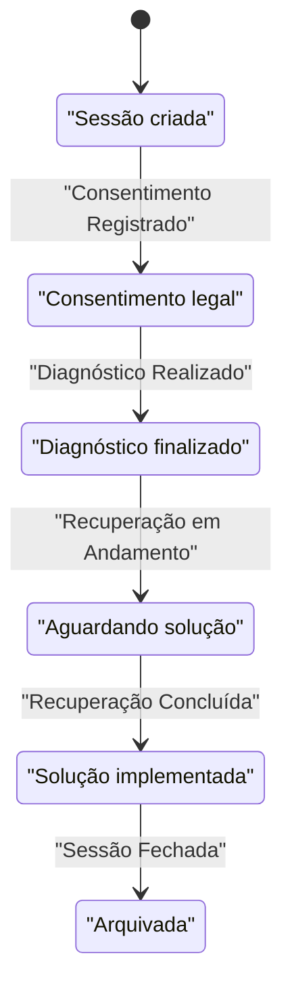
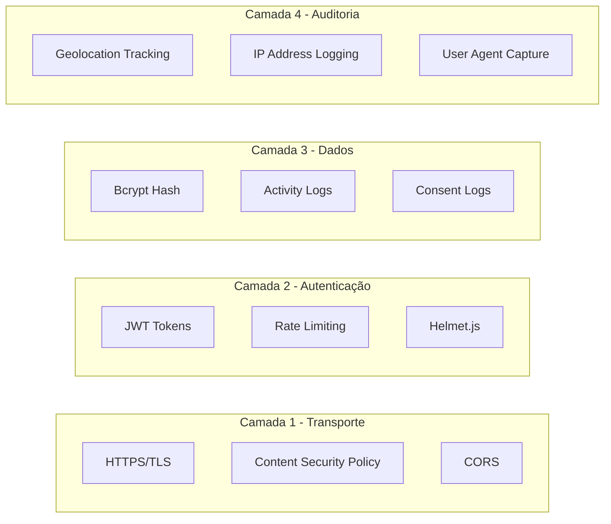
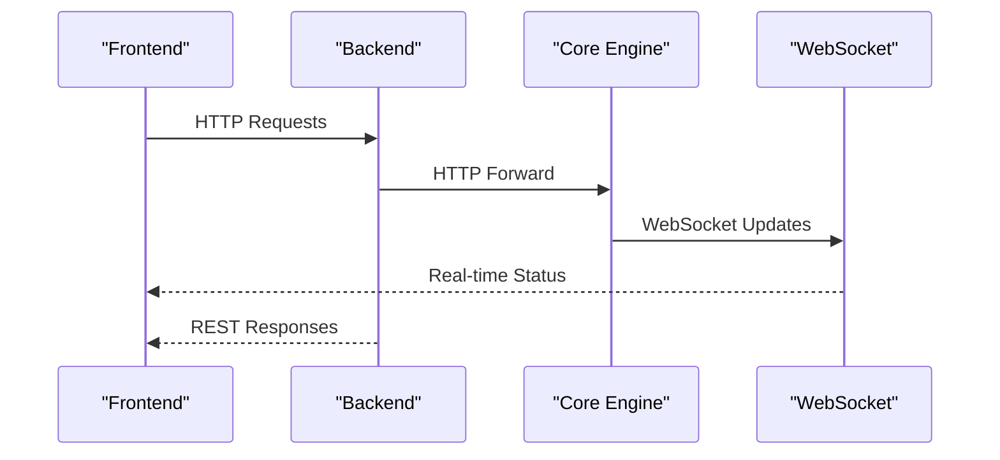

# Visão Geral do Sistema

<cite>
**Arquivos referenciados neste documento**
- [README.md](file://README.md)
- [backend/src/app.js](file://backend/src/app.js)
- [backend/package.json](file://backend/package.json)
- [backend/src/routes/sessions.js](file://backend/src/routes/sessions.js)
- [backend/src/routes/diagnosis.js](file://backend/src/routes/diagnosis.js)
- [core-engine/python/main.py](file://core-engine/python/main.py)
- [core-engine/bridge/api.py](file://core-engine/bridge/api.py)
- [database/schema.sql](file://database/schema.sql)
- [frontend/src/App.js](file://frontend/src/App.js)
- [frontend/src/pages/RecoveryFlow.js](file://frontend/src/pages/RecoveryFlow.js)
- [frontend/src/services/api.js](file://frontend/src/services/api.js)
- [frontend/src/store/useStore.js](file://frontend/src/store/useStore.js)
- [desktop/electron-app/main.js](file://desktop/electron-app/main.js)
- [desktop/electron-app/package.json](file://desktop/electron-app/package.json)
</cite>

## Sumário
1. [Introdução](#introdução)
2. [Estrutura do Projeto](#estrutura-do-projeto)
3. [Componentes Principais](#componentes-principais)
4. [Visão Geral da Arquitetura](#visão-geral-da-arquitetura)
5. [Análise Detalhada dos Componentes](#análise-detalhada-dos-componentes)
6. [Análise de Dependências](#análise-de-dependências)
7. [Considerações de Desempenho](#considerações-de-desempenho)
8. [Guia de Solução de Problemas](#guia-de-solução-de-problemas)
9. [Conclusão](#conclusão)

## Introdução
O Bay-RSET Tool é um sistema profissional de suporte guiado para recuperação de acesso a contas Apple ID, seguindo rigorosamente os processos oficiais da Apple. O sistema oferece fluxos de recuperação de senha, verificação em duas etapas, bloqueio de ativação e acompanhamento completo de solicitações, tudo dentro de uma abordagem legal e orientada ao cumprimento de políticas de segurança.

O objetivo principal é:
- Facilitar assistentes técnicos e usuários finais no processo de recuperação de contas Apple ID
- Garantir conformidade com os procedimentos oficiais da Apple
- Fornecer um fluxo guiado, seguro e rastreável
- Manter registros de consentimento e auditoria para fins de compliance

Casos de uso:
- Assistente técnico ajudando um cliente com Apple ID bloqueado
- Usuário final recuperando acesso a sua conta após esquecer a senha
- Profissional de suporte gerenciando múltiplos casos com tickets e acompanhamento

Benefícios:
- Processos oficiais e legalmente aceitos
- Rastreamento completo de sessões e consentimentos
- Interface intuitiva para usuários e painel administrativo para assistentes
- Segurança robusta com criptografia, rate limiting e JWT

**Fontes da seção**
- [README.md:11-18](file://README.md#L11-L18)
- [README.md:73-80](file://README.md#L73-L80)

## Estrutura do Projeto
O projeto segue uma arquitetura de microsserviços com três camadas principais:



**Fontes da seção**
- [README.md:19-29](file://README.md#L19-L29)
- [backend/src/app.js:15-32](file://backend/src/app.js#L15-L32)
- [core-engine/bridge/api.py:120-125](file://core-engine/bridge/api.py#L120-L125)
- [desktop/electron-app/main.js:22-43](file://desktop/electron-app/main.js#L22-L43)

## Componentes Principais
O sistema é composto pelos seguintes componentes principais:

### Backend API (Node.js + Express)
- Servidor principal com middleware de segurança
- Rotas para autenticação, sessões, diagnósticos e tickets
- Integração com o Core Engine via HTTP
- Logs centralizados e tratamento de erros

### Core Engine (Python + FastAPI)
- Motor de diagnóstico com templates para diferentes tipos de problemas
- Gerenciamento de sessões de usuário
- Validação de consentimento e rastreamento legal
- APIs REST e WebSocket para comunicação em tempo real

### Frontend Web (React)
- Interface responsiva com roteamento protegido
- Fluxo guiado de recuperação com quatro etapas
- Armazenamento local com persistência
- Integração com serviços REST

### Desktop App (Electron)
- Aplicação desktop com recursos offline
- Controles de navegação segura para sites oficiais
- Registro de ações do usuário para auditoria
- Atualização automática

### Banco de Dados (PostgreSQL)
- Esquema otimizado para sessões, tickets e logs
- Índices para performance
- Triggers para atualização automática de timestamps

**Fontes da seção**
- [backend/src/app.js:56-97](file://backend/src/app.js#L56-L97)
- [core-engine/python/main.py:246-450](file://core-engine/python/main.py#L246-L450)
- [frontend/src/App.js:34-90](file://frontend/src/App.js#L34-L90)
- [desktop/electron-app/main.js:104-158](file://desktop/electron-app/main.js#L104-L158)
- [database/schema.sql:8-156](file://database/schema.sql#L8-L156)

## Visão Geral da Arquitetura
O sistema segue um modelo de arquitetura de microsserviços com comunicação assíncrona e fluxo de dados padronizado:



**Fontes da seção**
- [frontend/src/pages/RecoveryFlow.js:39-106](file://frontend/src/pages/RecoveryFlow.js#L39-L106)
- [backend/src/routes/sessions.js:55-87](file://backend/src/routes/sessions.js#L55-L87)
- [core-engine/bridge/api.py:168-237](file://core-engine/bridge/api.py#L168-L237)

## Análise Detalhada dos Componentes

### Fluxo de Recuperação de Contas Apple ID
O sistema implementa um fluxo guiado de quatro etapas:



**Fontes da seção**
- [README.md:75-79](file://README.md#L75-L79)
- [frontend/src/pages/RecoveryFlow.js:179-356](file://frontend/src/pages/RecoveryFlow.js#L179-L356)
- [core-engine/python/main.py:338-413](file://core-engine/python/main.py#L338-L413)

### Componente de Diagnóstico
O motor de diagnóstico implementa um sistema de templates para diferentes tipos de problemas:



**Fontes da seção**
- [core-engine/python/main.py:35-61](file://core-engine/python/main.py#L35-L61)
- [core-engine/python/main.py:75-195](file://core-engine/python/main.py#L75-L195)

### Gerenciamento de Sessões
O sistema mantém um controle completo de sessões de usuário com rastreamento de estados:



**Fontes da seção**
- [core-engine/python/main.py:198-244](file://core-engine/python/main.py#L198-L244)
- [database/schema.sql:22-51](file://database/schema.sql#L22-L51)

### Segurança e Compliance
O sistema implementa múltiplas camadas de segurança:



**Fontes da seção**
- [backend/src/app.js:59-96](file://backend/src/app.js#L59-L96)
- [core-engine/bridge/api.py:240-273](file://core-engine/bridge/api.py#L240-L273)
- [database/schema.sql:94-119](file://database/schema.sql#L94-L119)

## Análise de Dependências

### Dependências Técnicas
O sistema utiliza tecnologias modernas e bem estabelecidas:

```mermaid
graph TB
subgraph "Backend"
NodeJS[Node.js 18+]
Express[Express]
Postgres[PostgreSQL]
Redis[Redis (opcional)]
end
subgraph "Core Engine"
Python[Python 3.8+]
FastAPI[FastAPI]
Uvicorn[Uvicorn]
end
subgraph "Frontend"
React[React 18]
Tailwind[TailwindCSS]
Zustand[Zustand]
end
subgraph "Desktop"
Electron[Electron]
SocketIO[Socket.IO]
end
```

**Fontes da seção**
- [README.md:33-39](file://README.md#L33-L39)
- [backend/package.json:23-47](file://backend/package.json#L23-L47)
- [desktop/electron-app/package.json:27-33](file://desktop/electron-app/package.json#L27-L33)

### Comunicação entre Componentes
A comunicação segue padrões REST e WebSocket:



**Fontes da seção**
- [core-engine/bridge/api.py:336-400](file://core-engine/bridge/api.py#L336-L400)
- [frontend/src/services/api.js:15-40](file://frontend/src/services/api.js#L15-L40)

## Considerações de Desempenho
O sistema foi projetado com foco em escalabilidade e eficiência:

- **Cache de Sessões**: Utilização de Redis opcional para cache de sessões ativas
- **Indexação Otimitizada**: Índices estratégicos para consultas frequentes
- **Streaming de Logs**: Winston para logs estruturados e escaláveis
- **Compression**: gzip para redução de tráfego de rede
- **Rate Limiting**: Proteção contra abusos e ataques DDoS

## Guia de Solução de Problemas

### Problemas Comuns e Soluções

**Diagnóstico não retorna resultados**
- Verifique se o Core Engine está em execução
- Confirme a URL do Core Engine nas variáveis de ambiente
- Verifique firewall e permissões de rede

**Erros de autenticação**
- Revise o JWT_SECRET configurado
- Verifique expiração de tokens
- Confirme o formato do token Bearer

**Conexão WebSocket falha**
- Verifique se o servidor WebSocket está ativo
- Confirme as permissões de conexão
- Verifique bloqueadores de proxy

**Problemas de banco de dados**
- Confirme conexão PostgreSQL
- Verifique permissões de usuário
- Revise migrações pendentes

**Fontes da seção**
- [backend/src/app.js:147-162](file://backend/src/app.js#L147-L162)
- [core-engine/bridge/api.py:404-414](file://core-engine/bridge/api.py#L404-L414)

## Conclusão
O Bay-RSET Tool representa uma solução completa e legal para recuperação de contas Apple ID, combinando:
- Processos oficiais e seguros da Apple
- Interface intuitiva para usuários finais
- Ferramentas avançadas para assistentes técnicos
- Arquitetura escalável e segura
- Conformidade total com regulamentações de privacidade

A implementação segue as melhores práticas de desenvolvimento moderno, com ênfase em segurança, rastreabilidade e experiência do usuário. O sistema é ideal tanto para assistentes técnicos quanto para uso individual, proporcionando uma solução confiável e eficiente para problemas de acesso a contas Apple ID.