# Autenticação e Segurança

<cite>
**Arquivos referenciados neste documento**
- [backend/src/app.js](file://backend/src/app.js)
- [backend/src/routes/auth.js](file://backend/src/routes/auth.js)
- [backend/src/routes/sessions.js](file://backend/src/routes/sessions.js)
- [backend/src/routes/admin.js](file://backend/src/routes/admin.js)
- [backend/package.json](file://backend/package.json)
- [frontend/src/services/api.js](file://frontend/src/services/api.js)
- [frontend/src/store/useStore.js](file://frontend/src/store/useStore.js)
- [frontend/src/components/ProtectedRoute.js](file://frontend/src/components/ProtectedRoute.js)
- [frontend/src/components/AdminRoute.js](file://frontend/src/components/AdminRoute.js)
- [frontend/src/pages/Login.js](file://frontend/src/pages/Login.js)
- [frontend/src/pages/Register.js](file://frontend/src/pages/Register.js)
- [core-engine/python/requirements.txt](file://core-engine/python/requirements.txt)
</cite>

## Sumário
- Introdução
- Estrutura do Projeto
- Componentes-Chave
- Visão Geral da Arquitetura
- Análise Detalhada de Componentes
- Análise de Dependências
- Considerações de Desempenho
- Guia de Solução de Problemas
- Conclusão
- Apêndices

## Introdução
Este documento apresenta uma documentação abrangente sobre o sistema de autenticação e segurança do projeto. Ele cobre JWT e gerenciamento de tokens, validação de credenciais, middleware de autenticação, rate limiting, proteções de segurança, fluxos de login/logout, renovação de token, proteção contra ataques comuns, configurações de segurança, políticas de senhas, conformidade regulatória, além da integração com sistemas de autorização e auditoria de acesso.

## Estrutura do Projeto
O sistema é composto por três camadas principais:
- Backend (Node.js): fornece APIs REST com autenticação JWT, rate limiting, segurança HTTP e logging.
- Frontend (React): implementa fluxos de login, registro e navegação protegida com persistência de estado.
- Core Engine (Python): fornece serviços de recuperação de contas e integração com o backend.

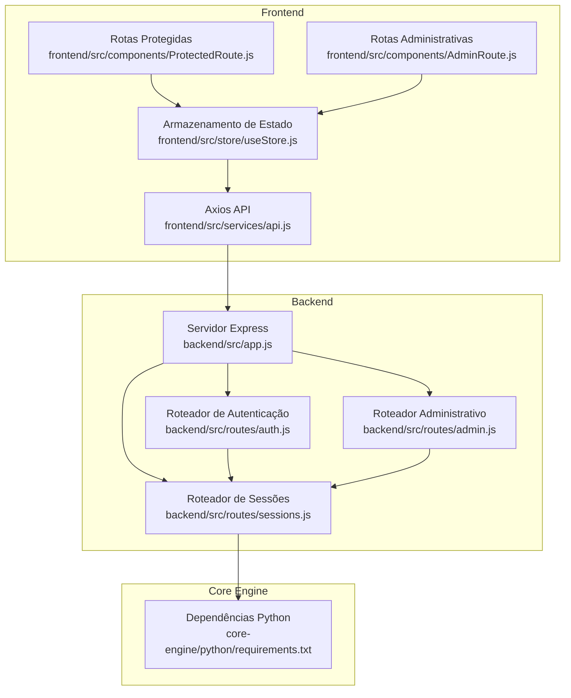

**Fontes do diagrama**
- [backend/src/app.js:111-116](file://backend/src/app.js#L111-L116)
- [backend/src/routes/auth.js:1-183](file://backend/src/routes/auth.js#L1-L183)
- [backend/src/routes/sessions.js:1-249](file://backend/src/routes/sessions.js#L1-L249)
- [backend/src/routes/admin.js:1-235](file://backend/src/routes/admin.js#L1-L235)
- [frontend/src/services/api.js:1-90](file://frontend/src/services/api.js#L1-L90)
- [frontend/src/store/useStore.js:1-53](file://frontend/src/store/useStore.js#L1-L53)
- [frontend/src/components/ProtectedRoute.js:1-16](file://frontend/src/components/ProtectedRoute.js#L1-L16)
- [frontend/src/components/AdminRoute.js:1-20](file://frontend/src/components/AdminRoute.js#L1-L20)
- [core-engine/python/requirements.txt:1-27](file://core-engine/python/requirements.txt#L1-L27)

**Seções fonte**
- [backend/src/app.js:111-116](file://backend/src/app.js#L111-L116)
- [backend/src/routes/auth.js:1-183](file://backend/src/routes/auth.js#L1-L183)
- [backend/src/routes/sessions.js:1-249](file://backend/src/routes/sessions.js#L1-L249)
- [backend/src/routes/admin.js:1-235](file://backend/src/routes/admin.js#L1-L235)
- [frontend/src/services/api.js:1-90](file://frontend/src/services/api.js#L1-L90)
- [frontend/src/store/useStore.js:1-53](file://frontend/src/store/useStore.js#L1-L53)
- [frontend/src/components/ProtectedRoute.js:1-16](file://frontend/src/components/ProtectedRoute.js#L1-L16)
- [frontend/src/components/AdminRoute.js:1-20](file://frontend/src/components/AdminRoute.js#L1-L20)
- [core-engine/python/requirements.txt:1-27](file://core-engine/python/requirements.txt#L1-L27)

## Componentes-Chave
- JWT e gerenciamento de tokens: geração, verificação e renovação de tokens com expiração configurável.
- Validação de credenciais: validação de e-mail e senha com regras de força de senha.
- Middleware de autenticação: verificação de token Bearer nas rotas protegidas.
- Rate limiting: limitação de requisições globais e específicas para autenticação.
- Proteções de segurança: Helmet, CORS, Content-Security-Policy, compressão e logging.
- Fluxos de login/logout: criação de token após credenciais válidas e perfil do usuário.
- Renovação de token: endpoint para renovar tokens expirados.
- Autorização e auditoria: rotas administrativas com verificação de papel e logs mockados.

**Seções fonte**
- [backend/src/routes/auth.js:25-42](file://backend/src/routes/auth.js#L25-L42)
- [backend/src/routes/auth.js:78-95](file://backend/src/routes/auth.js#L78-L95)
- [backend/src/routes/auth.js:97-143](file://backend/src/routes/auth.js#L97-L143)
- [backend/src/routes/auth.js:161-180](file://backend/src/routes/auth.js#L161-L180)
- [backend/src/app.js:59-96](file://backend/src/app.js#L59-L96)
- [backend/src/app.js:136-162](file://backend/src/app.js#L136-L162)

## Visão Geral da Arquitetura
O backend aplica middleware de segurança global e define rotas para autenticação, sessões e administração. O frontend consome as APIs com interceptores que injetam o token Bearer e tratam erros 401. O Core Engine fornece funcionalidades de recuperação de contas e é integrado via chamadas HTTP.

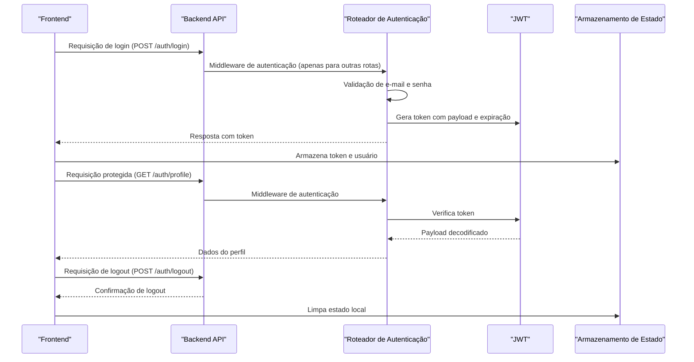

**Fontes do diagrama**
- [backend/src/routes/auth.js:97-143](file://backend/src/routes/auth.js#L97-L143)
- [backend/src/routes/auth.js:145-164](file://backend/src/routes/auth.js#L145-L164)
- [frontend/src/services/api.js:15-40](file://frontend/src/services/api.js#L15-L40)
- [frontend/src/store/useStore.js:20-32](file://frontend/src/store/useStore.js#L20-L32)

## Análise Detalhada de Componentes

### Autenticação e JWT
- Validação de credenciais: e-mail e senha são validados antes de qualquer operação.
- Hash de senhas: senhas são armazenadas com hash seguro.
- Geração de token: payload inclui identificador de usuário, e-mail e função com expiração de 24 horas.
- Middleware de autenticação: verifica cabeçalho Authorization Bearer e decodifica o JWT.
- Renovação de token: endpoint protegido gera novo token com base no usuário atual.

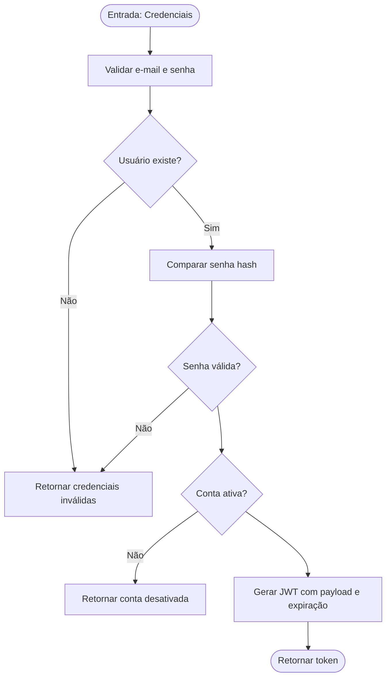

**Fontes do fluxo**
- [backend/src/routes/auth.js:97-143](file://backend/src/routes/auth.js#L97-L143)
- [backend/src/routes/auth.js:78-95](file://backend/src/routes/auth.js#L78-L95)

**Seções fonte**
- [backend/src/routes/auth.js:44-95](file://backend/src/routes/auth.js#L44-L95)
- [backend/src/routes/auth.js:97-143](file://backend/src/routes/auth.js#L97-L143)
- [backend/src/routes/auth.js:161-180](file://backend/src/routes/auth.js#L161-L180)

### Middleware de Autenticação
- Verificação do cabeçalho Authorization: exige Bearer token.
- Decodificação e validação do JWT: usa chave secreta configurável.
- Proteção de rotas: todas as rotas protegidas devem passar pelo middleware.

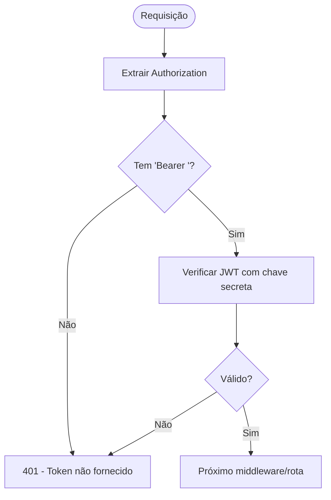

**Fontes do fluxo**
- [backend/src/routes/auth.js:25-42](file://backend/src/routes/auth.js#L25-L42)
- [backend/src/routes/sessions.js:19-37](file://backend/src/routes/sessions.js#L19-L37)
- [backend/src/routes/admin.js:14-37](file://backend/src/routes/admin.js#L14-L37)

**Seções fonte**
- [backend/src/routes/auth.js:25-42](file://backend/src/routes/auth.js#L25-L42)
- [backend/src/routes/sessions.js:19-37](file://backend/src/routes/sessions.js#L19-L37)
- [backend/src/routes/admin.js:14-37](file://backend/src/routes/admin.js#L14-L37)

### Rate Limiting
- Limite global: 100 requisições a cada 15 minutos por IP.
- Limite específico para autenticação: 5 tentativas a cada 15 minutos, pulando requisições bem-sucedidas.
- Configuração de headers: compatíveis com padrões modernos.

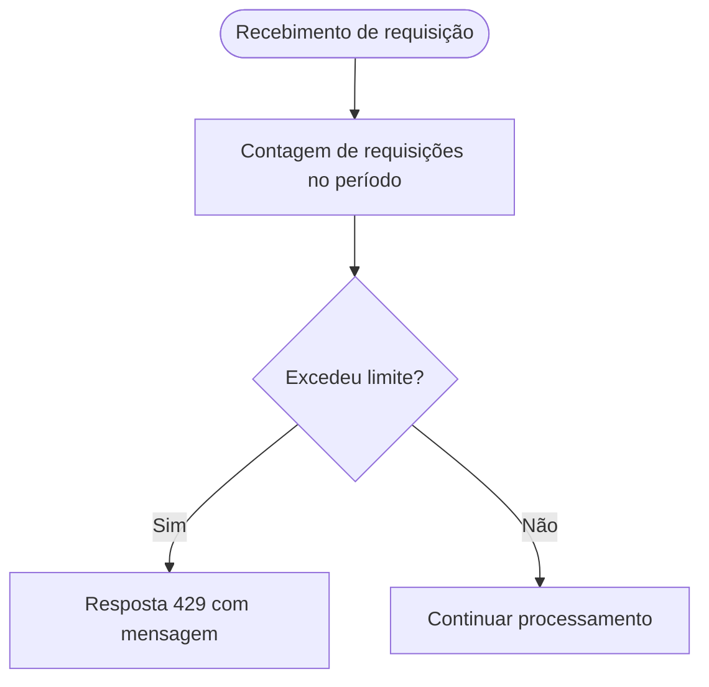

**Fontes do fluxo**
- [backend/src/app.js:78-88](file://backend/src/app.js#L78-L88)
- [backend/src/routes/auth.js:14-20](file://backend/src/routes/auth.js#L14-L20)

**Seções fonte**
- [backend/src/app.js:78-88](file://backend/src/app.js#L78-L88)
- [backend/src/routes/auth.js:14-20](file://backend/src/routes/auth.js#L14-L20)

### Frontend: Integração e Navegação Protegida
- Interceptadores Axios: adicionam Authorization Bearer automaticamente e tratam erros 401.
- Armazenamento de estado: persistência de token e usuário com Zustand.
- Rotas protegidas: verificação de autenticação antes de renderizar conteúdo.
- Rotas administrativas: verificação de papel admin.

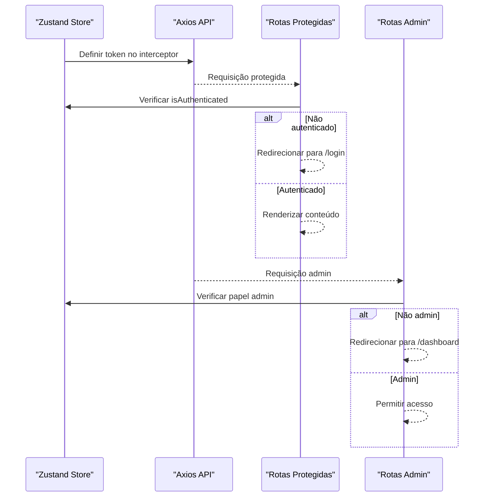

**Fontes do diagrama**
- [frontend/src/services/api.js:15-40](file://frontend/src/services/api.js#L15-L40)
- [frontend/src/store/useStore.js:16-32](file://frontend/src/store/useStore.js#L16-L32)
- [frontend/src/components/ProtectedRoute.js:5-13](file://frontend/src/components/ProtectedRoute.js#L5-L13)
- [frontend/src/components/AdminRoute.js:5-16](file://frontend/src/components/AdminRoute.js#L5-L16)

**Seções fonte**
- [frontend/src/services/api.js:15-40](file://frontend/src/services/api.js#L15-L40)
- [frontend/src/store/useStore.js:16-32](file://frontend/src/store/useStore.js#L16-L32)
- [frontend/src/components/ProtectedRoute.js:5-13](file://frontend/src/components/ProtectedRoute.js#L5-L13)
- [frontend/src/components/AdminRoute.js:5-16](file://frontend/src/components/AdminRoute.js#L5-L16)

### Fluxos de Login e Logout
- Login: validação de credenciais, verificação de conta ativa e geração de token.
- Logout: confirmação local e limpeza de estado.
- Registro: validação de dados, hash de senha e geração de token.

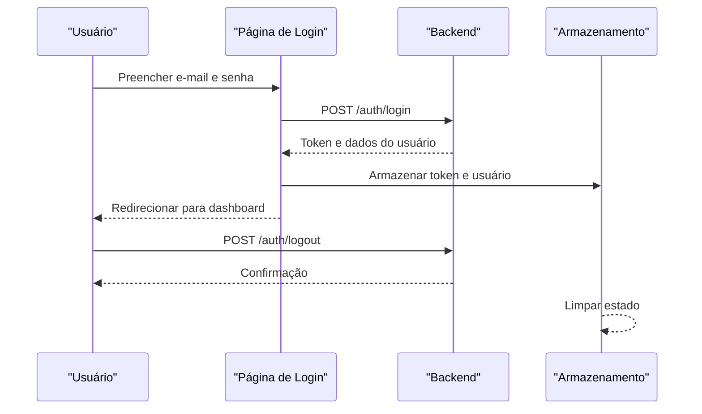

**Fontes do diagrama**
- [frontend/src/pages/Login.js:19-35](file://frontend/src/pages/Login.js#L19-L35)
- [backend/src/routes/auth.js:97-143](file://backend/src/routes/auth.js#L97-L143)
- [backend/src/routes/auth.js:161-164](file://backend/src/routes/auth.js#L161-L164)
- [frontend/src/store/useStore.js:20-32](file://frontend/src/store/useStore.js#L20-L32)

**Seções fonte**
- [frontend/src/pages/Login.js:19-35](file://frontend/src/pages/Login.js#L19-L35)
- [backend/src/routes/auth.js:97-143](file://backend/src/routes/auth.js#L97-L143)
- [backend/src/routes/auth.js:161-164](file://backend/src/routes/auth.js#L161-L164)
- [frontend/src/store/useStore.js:20-32](file://frontend/src/store/useStore.js#L20-L32)

### Renovação de Token
- Endpoint protegido: requer token válido.
- Gera novo token com mesma expiração.
- Recomenda-se evitar longos períodos de validade e implementar blacklist em produção.

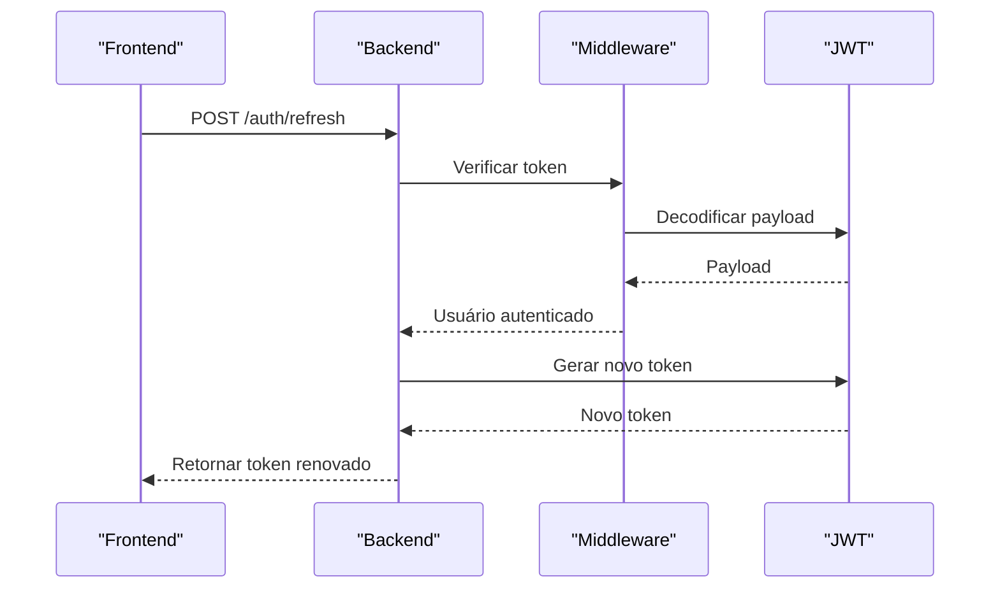

**Fontes do diagrama**
- [backend/src/routes/auth.js:166-180](file://backend/src/routes/auth.js#L166-L180)

**Seções fonte**
- [backend/src/routes/auth.js:166-180](file://backend/src/routes/auth.js#L166-L180)

### Proteções de Segurança
- Helmet: configurações CSP, X-Frame-Options, X-Content-Type-Options, etc.
- CORS: origens permitidas e credenciais.
- Content Security Policy: restrições de scripts, imagens e conexões.
- Compressão: gzip para reduzir tamanho de respostas.
- Logging: Morgan integrado com Winston para auditoria.

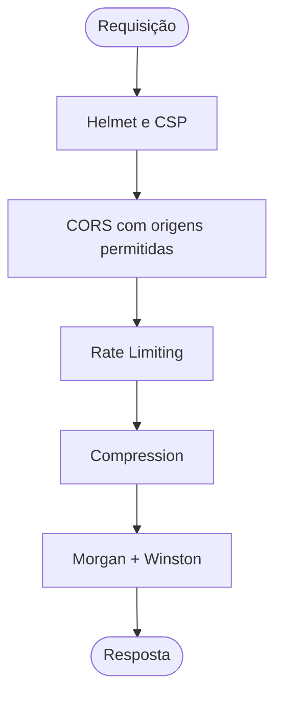

**Fontes do fluxo**
- [backend/src/app.js:59-96](file://backend/src/app.js#L59-L96)

**Seções fonte**
- [backend/src/app.js:59-96](file://backend/src/app.js#L59-L96)

### Autorização e Auditoria
- Roteiros administrativos: acesso restrito a usuários com papel admin.
- Logs mockados: estrutura pronta para integração com sistemas de log centralizado.
- Métricas e configurações: endpoints administrativos para monitoramento.

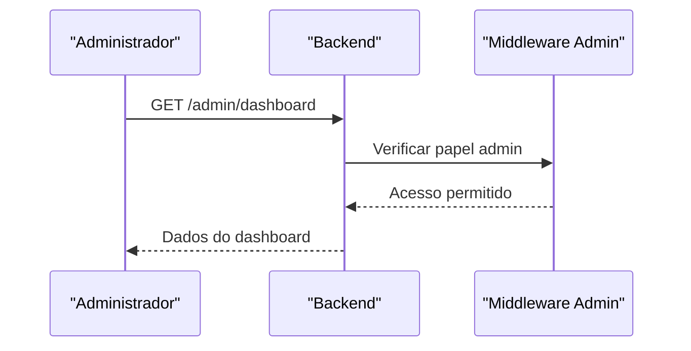

**Fontes do diagrama**
- [backend/src/routes/admin.js:39-64](file://backend/src/routes/admin.js#L39-L64)

**Seções fonte**
- [backend/src/routes/admin.js:14-37](file://backend/src/routes/admin.js#L14-L37)
- [backend/src/routes/admin.js:39-64](file://backend/src/routes/admin.js#L39-L64)

## Análise de Dependências
- Backend dependências: Express, Helmet, CORS, Rate Limit, Morgan, Winston, bcrypt, JWT, Joi, Sequelize/Mongoose, Redis, Socket.IO, Stripe, UUID, Nodemailer, PG, Sharp, Axios, UUID, Winston.
- Frontend dependências: React, React Router, Axios, Zusta, TailwindCSS, Lucide, Toast, Query, Socket.IO Client.
- Core Engine: FastAPI, Uvicorn, Pydantic, HTTPX, Structlog, UUID, pytest.

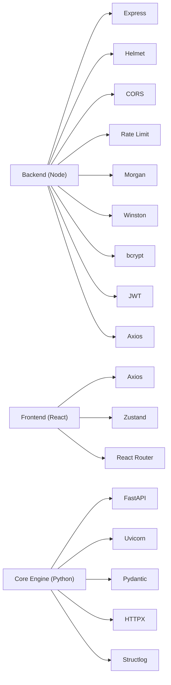

**Fontes do diagrama**
- [backend/package.json:23-46](file://backend/package.json#L23-L46)
- [frontend/package.json:5-24](file://frontend/package.json#L5-L24)
- [core-engine/python/requirements.txt:4-22](file://core-engine/python/requirements.txt#L4-L22)

**Seções fonte**
- [backend/package.json:23-46](file://backend/package.json#L23-L46)
- [frontend/package.json:5-24](file://frontend/package.json#L5-L24)
- [core-engine/python/requirements.txt:4-22](file://core-engine/python/requirements.txt#L4-L22)

## Considerações de Desempenho
- Rate limiting: evita sobrecarga e ataques de força bruta.
- Compressão: reduz largura de banda e latência.
- Logging eficiente: separa logs de erro e info, com streams para arquivos e console.
- Persistência de estado: uso de persistência leve no frontend para evitar sobrecarga.

[Sem fontes, pois esta seção fornece orientações gerais]

## Guia de Solução de Problemas
- Erros 401: verifique se o cabeçalho Authorization Bearer está presente e se o token não expirou.
- Erros 403: confirme se o usuário possui papel admin para rotas administrativas.
- Erros 429: aguarde o período de espera ou aumente os limites conforme necessário.
- Erros de validação: revise os campos obrigatórios e formatos esperados.
- Logs: utilize os logs combinados e de erro para diagnóstico em produção.

**Seções fonte**
- [backend/src/app.js:136-162](file://backend/src/app.js#L136-L162)
- [backend/src/routes/auth.js:25-42](file://backend/src/routes/auth.js#L25-L42)
- [backend/src/routes/admin.js:24-36](file://backend/src/routes/admin.js#L24-L36)

## Conclusão
O sistema implementa um conjunto sólido de práticas de segurança, incluindo autenticação com JWT, validação de credenciais, rate limiting, CSP e CORS. A arquitetura permite fácil integração com sistemas de autorização e auditoria, com fluxos de login/logout e renovação de token. Para produção, recomenda-se implementar blacklist de tokens, armazenamento seguro de senhas, políticas de senhas rigorosas e conformidade com regulamentações de proteção de dados.

[Sem fontes, pois esta seção resume sem análise específica de arquivos]

## Apêndices

### Configurações de Segurança
- Variáveis de ambiente: JWT_SECRET, CORE_ENGINE_URL, DATABASE_URL, REDIS_URL, ALLOWED_ORIGINS.
- Helmet: Content-Security-Policy com conexões permitidas ao Core Engine.
- CORS: origens permitidas e credenciais habilitadas.
- Rate limiting: globais e específicos para autenticação.

**Seções fonte**
- [backend/src/app.js:24-32](file://backend/src/app.js#L24-L32)
- [backend/src/app.js:60-70](file://backend/src/app.js#L60-L70)
- [backend/src/app.js:72-76](file://backend/src/app.js#L72-L76)
- [backend/src/app.js:78-88](file://backend/src/app.js#L78-L88)

### Políticas de Senhas
- Mínimo de 8 caracteres.
- Recomenda-se incluir letras maiúsculas, números e caracteres especiais.
- Frontend exibe força da senha e validação de confirmação.

**Seções fonte**
- [backend/src/routes/auth.js:46-48](file://backend/src/routes/auth.js#L46-L48)
- [frontend/src/pages/Register.js:55-64](file://frontend/src/pages/Register.js#L55-L64)
- [frontend/src/pages/Register.js:107-118](file://frontend/src/pages/Register.js#L107-L118)

### Conformidade Regulatória
- Proteção de dados: armazenamento seguro de senhas com hash e uso de HTTPS.
- Auditoria: logs estruturados com timestamps e rastreamento de erros.
- Consentimento: fluxo de consentimento integrado com o Core Engine.

**Seções fonte**
- [backend/src/routes/sessions.js:161-207](file://backend/src/routes/sessions.js#L161-L207)
- [backend/src/app.js:34-54](file://backend/src/app.js#L34-L54)