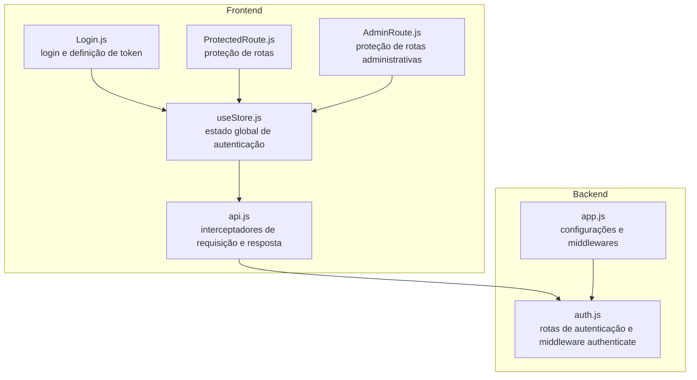
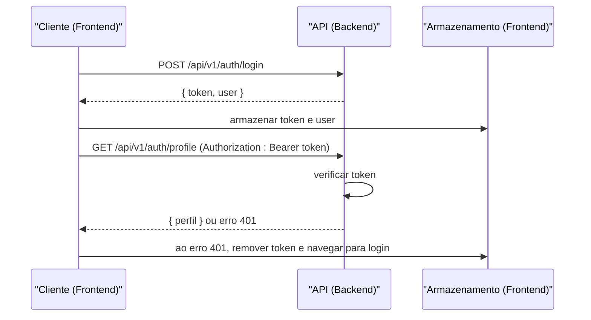
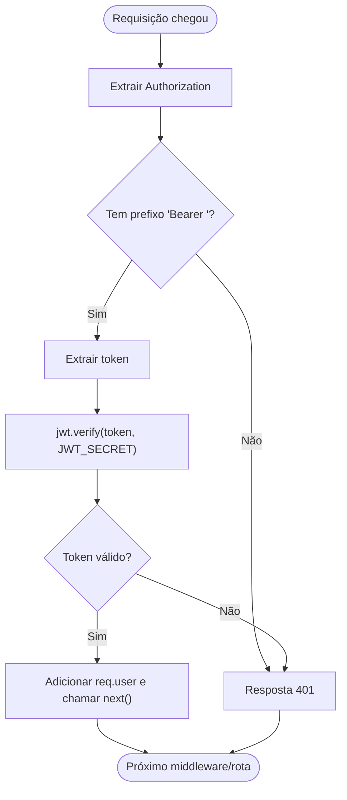
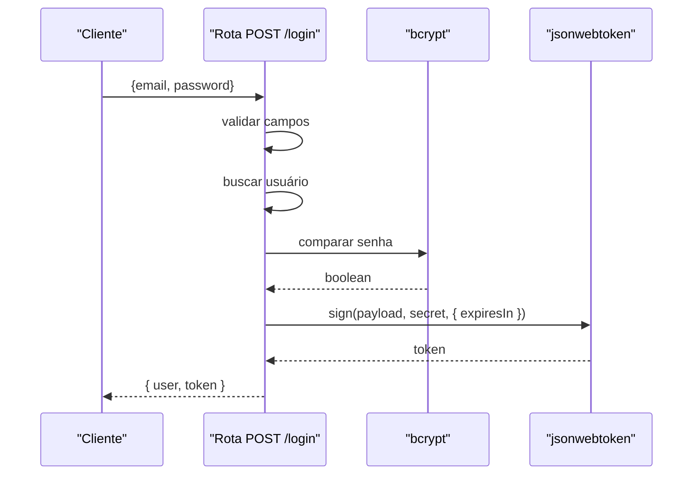
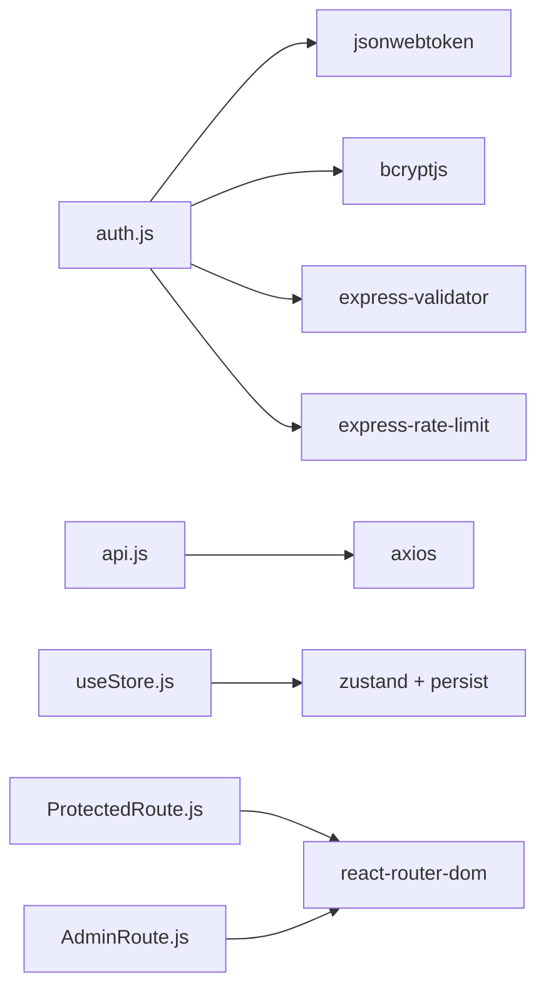

# JWT e Gerenciamento de Tokens

<cite>
**Arquivos Referenciados Neste Documento**
- [auth.js](file://backend/src/routes/auth.js)
- [app.js](file://backend/src/app.js)
- [api.js](file://frontend/src/services/api.js)
- [useStore.js](file://frontend/src/store/useStore.js)
- [Login.js](file://frontend/src/pages/Login.js)
- [ProtectedRoute.js](file://frontend/src/components/ProtectedRoute.js)
- [AdminRoute.js](file://frontend/src/components/AdminRoute.js)
</cite>

## Sumário
- Apresentação
- Estrutura do Projeto
- Componentes Principais
- Visão Geral da Arquitetura
- Análise Detalhada dos Componentes
- Análise de Dependências
- Considerações de Desempenho
- Guia de Solução de Problemas
- Conclusão

## Apresentação
Este documento apresenta uma documentação abrangente do sistema de autenticação baseado em JWT (JSON Web Token) utilizado no backend e frontend do projeto. Ele explica como os tokens são gerados, verificados, expirados e renovados, além de como são armazenados e validados. Também descreve o middleware de autenticação que protege as rotas e oferece recomendações de segurança e melhores práticas para o armazenamento de tokens.

## Estrutura do Projeto
O sistema de autenticação envolve três camadas principais:
- Backend (Express): fornece as rotas de autenticação, gera e valida tokens JWT, e protege rotas com um middleware de autenticação.
- Frontend (React): gerencia o ciclo de vida do token, adicionando-o automaticamente nas requisições e tratando a expiração.
- Armazenamento de estado (Zustand): mantém o token e o estado de autenticação no frontend.

**Diagrama Fontes**
- [api.js:1-90](file://frontend/src/services/api.js#L1-L90)
- [useStore.js:1-53](file://frontend/src/store/useStore.js#L1-L53)
- [Login.js:1-122](file://frontend/src/pages/Login.js#L1-L122)
- [ProtectedRoute.js:1-16](file://frontend/src/components/ProtectedRoute.js#L1-L16)
- [AdminRoute.js:1-20](file://frontend/src/components/AdminRoute.js#L1-L20)
- [app.js:1-194](file://backend/src/app.js#L1-L194)
- [auth.js:1-183](file://backend/src/routes/auth.js#L1-L183)

**Seção Fontes**
- [app.js:111-116](file://backend/src/app.js#L111-L116)
- [auth.js:25-42](file://backend/src/routes/auth.js#L25-L42)

## Componentes Principais
- Middleware de autenticação (backend): verifica a presença e a validade do token nos cabeçalhos das requisições.
- Rotas de autenticação (backend): registro, login, perfil, logout e renovação de token.
- Interceptadores de requisição/resposta (frontend): adicionam o token automaticamente e tratam a expiração.
- Armazenamento de estado (frontend): mantém o token e o estado de autenticação.

**Seção Fontes**
- [auth.js:25-42](file://backend/src/routes/auth.js#L25-L42)
- [auth.js:44-95](file://backend/src/routes/auth.js#L44-L95)
- [auth.js:97-143](file://backend/src/routes/auth.js#L97-L143)
- [auth.js:145-180](file://backend/src/routes/auth.js#L145-L180)
- [api.js:15-40](file://frontend/src/services/api.js#L15-L40)
- [useStore.js:16-32](file://frontend/src/store/useStore.js#L16-L32)

## Visão Geral da Arquitetura
O fluxo de autenticação segue estas etapas:
1. O cliente faz login ou registro no backend.
2. O backend gera um JWT assinado com uma chave secreta configurada via variáveis de ambiente.
3. O frontend recebe o token e o armazena no estado global.
4. Para cada requisição protegida, o frontend insere o token no cabeçalho Authorization.
5. O backend verifica o token e permite ou nega o acesso.
6. Em caso de erro 401, o frontend remove o token e redireciona para a tela de login.

**Diagrama Fontes**
- [auth.js:97-143](file://backend/src/routes/auth.js#L97-L143)
- [auth.js:145-159](file://backend/src/routes/auth.js#L145-L159)
- [auth.js:25-42](file://backend/src/routes/auth.js#L25-L42)
- [api.js:15-40](file://frontend/src/services/api.js#L15-L40)
- [useStore.js:20-32](file://frontend/src/store/useStore.js#L20-L32)

## Análise Detalhada dos Componentes

### Middleware de Autenticação (Backend)
O middleware authenticate:
- Lê o cabeçalho Authorization.
- Confere se contém o prefixo Bearer.
- Verifica o token com a chave secreta configurada.
- Em caso de sucesso, adiciona o payload decodificado ao objeto req e chama next().
- Em caso de falha, retorna erro 401.

**Diagrama Fontes**
- [auth.js:25-42](file://backend/src/routes/auth.js#L25-L42)

**Seção Fontes**
- [auth.js:25-42](file://backend/src/routes/auth.js#L25-L42)

### Rota de Login (Backend)
- Valida campos com express-validator.
- Busca o usuário no “banco” (Map).
- Compara a senha com bcrypt.
- Verifica se a conta está ativa.
- Gera um JWT com expiração configurada (ex: 24 horas).
- Retorna token e dados do usuário.

**Diagrama Fontes**
- [auth.js:97-143](file://backend/src/routes/auth.js#L97-L143)

**Seção Fontes**
- [auth.js:97-143](file://backend/src/routes/auth.js#L97-L143)

### Rota de Registro (Backend)
- Valida campos com express-validator.
- Verifica se o e-mail já existe.
- Gera hash da senha com bcrypt.
- Cria o usuário no “banco”.
- Gera um JWT com expiração configurada.
- Retorna token e dados do usuário.

**Seção Fontes**
- [auth.js:44-95](file://backend/src/routes/auth.js#L44-L95)

### Rota de Perfil (Backend)
- Protegida pelo middleware authenticate.
- Recupera o usuário com base no e-mail decodificado no token.
- Retorna os dados do perfil.

**Seção Fontes**
- [auth.js:145-159](file://backend/src/routes/auth.js#L145-L159)

### Rota de Logout (Backend)
- Protegida pelo middleware authenticate.
- Atualmente apenas confirma o logout local (não revoga o token).
- Em produção, sugerimos manter o token em uma blacklist.

**Seção Fontes**
- [auth.js:161-164](file://backend/src/routes/auth.js#L161-L164)

### Rota de Renovação de Token (Backend)
- Protegida pelo middleware authenticate.
- Gera um novo token com a mesma carga útil e expiração configurada.
- Retorna o novo token.

**Seção Fontes**
- [auth.js:166-180](file://backend/src/routes/auth.js#L166-L180)

### Interceptadores de Requisição e Resposta (Frontend)
- Adiciona automaticamente o token no cabeçalho Authorization para todas as requisições.
- Ao receber erro 401, remove o token e redireciona para a tela de login.

**Seção Fontes**
- [api.js:15-40](file://frontend/src/services/api.js#L15-L40)

### Armazenamento de Estado (Frontend)
- Armazena user, token e isAuthenticated no estado global.
- Define funções para login e logout.
- Persiste parte do estado no armazenamento local do navegador.

**Seção Fontes**
- [useStore.js:16-32](file://frontend/src/store/useStore.js#L16-L32)
- [useStore.js:43-51](file://frontend/src/store/useStore.js#L43-L51)

### Páginas de Login e Registro (Frontend)
- Realizam chamadas à API de autenticação.
- Ao sucesso, atualizam o estado com user e token e redirecionam para o dashboard.

**Seção Fontes**
- [Login.js:19-35](file://frontend/src/pages/Login.js#L19-L35)
- [Register.js:22-53](file://frontend/src/pages/Register.js#L22-L53)

### Rotas Protegidas (Frontend)
- ProtectedRoute: impede acesso se não estiver autenticado.
- AdminRoute: impede acesso se não for admin.

**Seção Fontes**
- [ProtectedRoute.js:5-13](file://frontend/src/components/ProtectedRoute.js#L5-L13)
- [AdminRoute.js:5-17](file://frontend/src/components/AdminRoute.js#L5-L17)

## Análise de Dependências
- Backend depende de:
  - jsonwebtoken para geração e verificação de tokens.
  - bcryptjs para comparação de senhas.
  - express-validator para validação de campos.
  - express-rate-limit para limitação de tentativas de login.
- Frontend depende de:
  - axios para requisições HTTP.
  - Zustand para gerenciamento de estado.
  - react-router-dom para navegação condicional.

**Diagrama Fontes**
- [auth.js:7-11](file://backend/src/routes/auth.js#L7-L11)
- [api.js:1-2](file://frontend/src/services/api.js#L1-L2)
- [useStore.js:1-2](file://frontend/src/store/useStore.js#L1-L2)
- [ProtectedRoute.js:1-3](file://frontend/src/components/ProtectedRoute.js#L1-L3)
- [AdminRoute.js:1-3](file://frontend/src/components/AdminRoute.js#L1-L3)

**Seção Fontes**
- [auth.js:7-11](file://backend/src/routes/auth.js#L7-L11)
- [api.js:1-2](file://frontend/src/services/api.js#L1-L2)
- [useStore.js:1-2](file://frontend/src/store/useStore.js#L1-L2)

## Considerações de Desempenho
- O middleware authenticate realiza uma verificação síncrona de token. Em aplicações de alta vazão, considere:
  - Cache de validade curta para evitar chamadas repetidas ao verificar tokens.
  - Uso de chaves públicas/privadas com algoritmos eficientes (ex: ES256) se necessário.
  - Limitação de requisições com rate limits configurados no backend e frontend.

## Guia de Solução de Problemas
- Erro 401 ao acessar rotas protegidas:
  - Verifique se o token foi enviado no cabeçalho Authorization com o prefixo Bearer.
  - Confirme que a chave JWT_SECRET esteja correta e disponível no backend.
  - Verifique se o token não expirou.
- Erro 403 ao fazer login:
  - O usuário pode estar inativo. Ative a conta no backend.
- Frontend redireciona para login após erro 401:
  - O interceptor está funcionando corretamente. O token foi removido e o usuário foi redirecionado.

**Seção Fontes**
- [auth.js:25-42](file://backend/src/routes/auth.js#L25-L42)
- [auth.js:115-124](file://backend/src/routes/auth.js#L115-L124)
- [api.js:29-40](file://frontend/src/services/api.js#L29-L40)

## Conclusão
O sistema implementa um fluxo de autenticação seguro com JWT, onde o backend gera tokens com expiração configurável e os protege com um middleware de verificação. O frontend adiciona automaticamente o token às requisições e trata a expiração com um interceptor. Para produção, recomenda-se:
- Armazenar o token em httpOnly cookies para mitigar ataques XSS.
- Manter tokens em blacklist no backend para permitir revogação imediata.
- Usar HTTPS em todos os ambientes.
- Rotacionar a chave JWT_SECRET periodicamente.
- Implementar políticas de força de senha e redefinição de senha com tokens temporários.