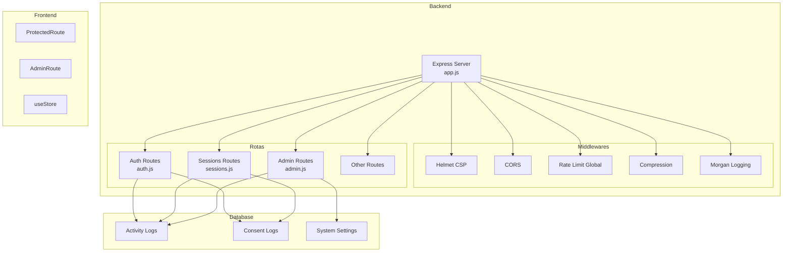
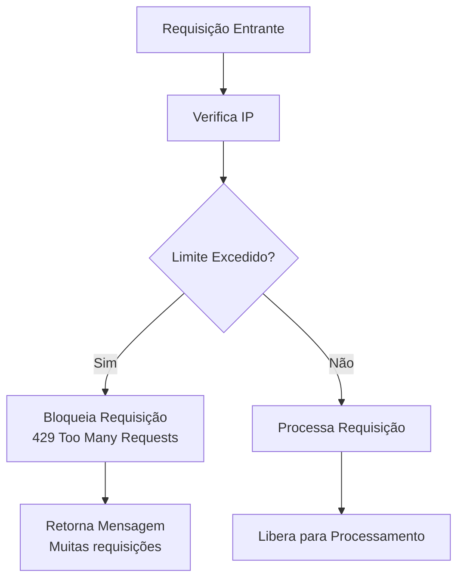
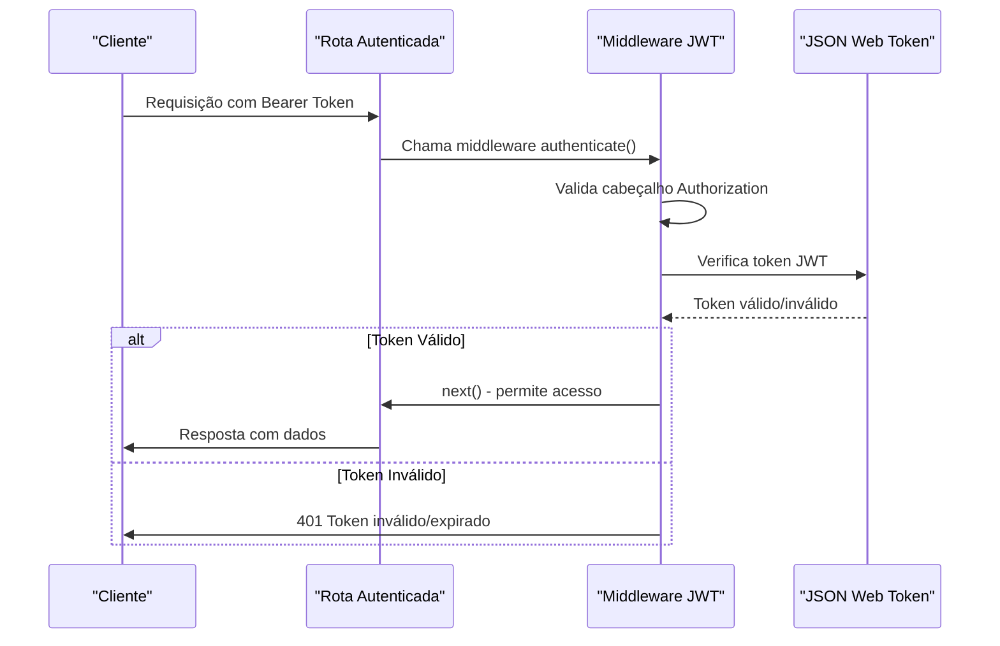
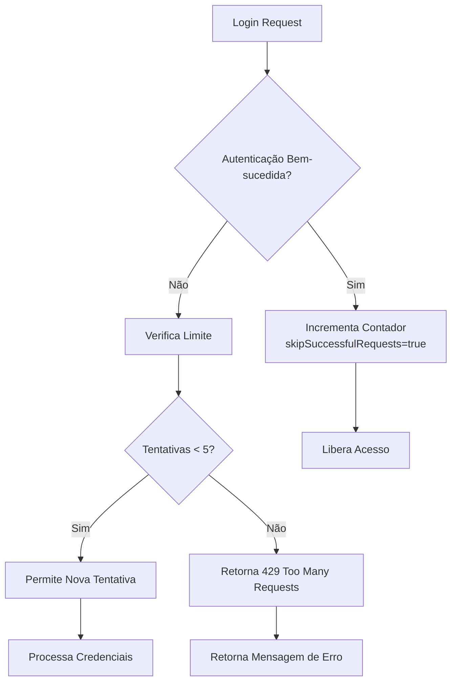
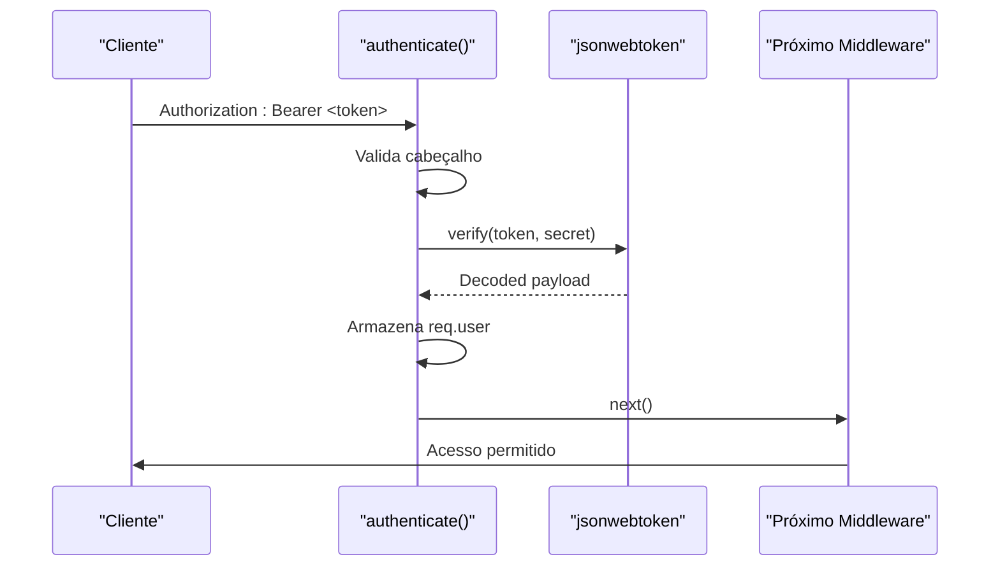
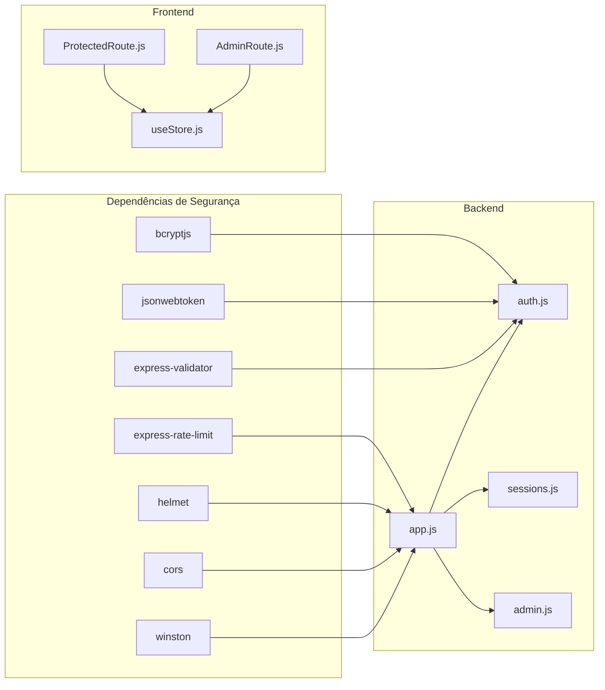

# Proteções de Segurança e Rate Limiting

<cite>
**Arquivos referenciados neste documento**
- [app.js](file://backend/src/app.js)
- [auth.js](file://backend/src/routes/auth.js)
- [sessions.js](file://backend/src/routes/sessions.js)
- [admin.js](file://backend/src/routes/admin.js)
- [ProtectedRoute.js](file://frontend/src/components/ProtectedRoute.js)
- [AdminRoute.js](file://frontend/src/components/AdminRoute.js)
- [useStore.js](file://frontend/src/store/useStore.js)
- [schema.sql](file://database/schema.sql)
- [package.json](file://backend/package.json)
</cite>

## Sumário
1. [Introdução](#introdução)
2. [Estrutura do Projeto](#estrutura-do-projeto)
3. [Componentes de Segurança](#componentes-de-segurança)
4. [Visão Geral da Arquitetura de Segurança](#visão-geral-da-arquitetura-de-segurança)
5. [Análise Detalhada dos Componentes](#análise-detalhada-dos-componentes)
6. [Análise de Dependências](#análise-de-dependências)
7. [Considerações de Desempenho](#considerações-de-desempenho)
8. [Guia de Solução de Problemas](#guia-de-solução-de-problemas)
9. [Conclusão](#conclusão)

## Introdução
Este documento apresenta uma análise abrangente das proteções de segurança implementadas no backend da aplicação Apple ID Assistant, com foco especial em:
- Rate limiting específico para autenticação
- Middleware de autenticação JWT
- Proteções contra ataques comuns
- Implementação do authLimiter e limites de tentativas
- Mensagens de erro seguras
- Configurações de segurança adicionais
- Políticas de senhas
- Práticas recomendadas para proteger endpoints críticos
- Integração com middlewares de segurança e auditoria de acesso

## Estrutura do Projeto
A estrutura do projeto foi organizada seguindo princípios de separação de camadas e responsabilidades bem definidas:



**Fontes do diagrama**
- [app.js:59-96](file://backend/src/app.js#L59-L96)
- [auth.js:14-20](file://backend/src/routes/auth.js#L14-L20)
- [schema.sql:94-129](file://database/schema.sql#L94-L129)

**Fontes da seção**
- [app.js:111-121](file://backend/src/app.js#L111-L121)
- [package.json:23-46](file://backend/package.json#L23-L46)

## Componentes de Segurança

### Rate Limiting Global
O sistema implementa um rate limiting global para proteger todos os endpoints contra excesso de requisições:



**Fontes do fluxo**
- [app.js:78-88](file://backend/src/app.js#L78-L88)

### Rate Limiting Específico para Autenticação
O authLimiter é configurado com parâmetros específicos para proteger as rotas de login:

**Configuração do authLimiter:**
- Janela de tempo: 15 minutos
- Limite máximo: 5 tentativas
- Parâmetros avançados: `skipSuccessfulRequests: true`

**Fontes do componente**
- [auth.js:14-20](file://backend/src/routes/auth.js#L14-L20)

### Middleware de Autenticação JWT
Implementação robusta do middleware de autenticação com verificação de tokens:



**Fontes da sequência**
- [auth.js:25-42](file://backend/src/routes/auth.js#L25-L42)
- [sessions.js:19-37](file://backend/src/routes/sessions.js#L19-L37)
- [admin.js:14-37](file://backend/src/routes/admin.js#L14-L37)

### Proteções Contra Ataques Comuns
Implementações específicas para prevenir diversos tipos de ataques:

**Proteções implementadas:**
- **Ataques de força bruta**: authLimiter com limite de 5 tentativas
- **Ataques de injeção**: validações rigorosas com express-validator
- **Ataques CSRF**: Helmet CSP configurado
- **Ataques de DDoS**: rate limiting global de 100 requisições/15min
- **Ataques de XSS**: Content Security Policy otimizada

**Fontes das proteções**
- [auth.js:98-143](file://backend/src/routes/auth.js#L98-L143)
- [app.js:60-70](file://backend/src/app.js#L60-L70)

## Visão Geral da Arquitetura de Segurança

```mermaid
graph TB
subgraph "Camada de Segurança"
A[Helmet CSP]
B[CORS Seguro]
C[Rate Limit Global]
D[Rate Limit Auth]
E[JWT Authentication]
F[Input Validation]
end
subgraph "Endpoints Críticos"
G[/api/v1/auth/login]
H[/api/v1/admin/*]
I[/api/v1/sessions/*]
end
subgraph "Auditoria"
J[Activity Logs]
K[Consent Logs]
L[System Settings]
end
A --> G
A --> H
A --> I
C --> G
C --> H
C --> I
D --> G
E --> H
E --> I
F --> G
F --> H
F --> I
G --> J
H --> J
I --> J
G --> K
I --> K
H --> L
```

**Fontes do diagrama**
- [app.js:59-96](file://backend/src/app.js#L59-L96)
- [auth.js:14-20](file://backend/src/routes/auth.js#L14-L20)
- [schema.sql:94-129](file://database/schema.sql#L94-L129)

## Análise Detalhada dos Componentes

### Implementação do authLimiter

#### Configuração e Funcionamento
O authLimiter é configurado com parâmetros específicos para proteção otimizada:

**Parâmetros principais:**
- `windowMs: 15 * 60 * 1000` - Janela de 15 minutos
- `max: 5` - Máximo de 5 tentativas
- `skipSuccessfulRequests: true` - Não conta requisições bem-sucedidas
- `message: { error: 'Muitas tentativas de login. Tente novamente mais tarde.' }` - Mensagem segura

#### Fluxo de Funcionamento do authLimiter



**Fontes do fluxo**
- [auth.js:14-20](file://backend/src/routes/auth.js#L14-L20)
- [auth.js:98-143](file://backend/src/routes/auth.js#L98-L143)

### Middleware de Autenticação JWT

#### Implementação Detalhada
O middleware de autenticação JWT implementa verificação completa de tokens:

**Etapas de verificação:**
1. **Validação do cabeçalho**: Verifica presença e formato Bearer
2. **Extração do token**: Remove prefixo "Bearer "
3. **Verificação JWT**: Utiliza `jwt.verify()` com secret key
4. **Armazenamento do usuário**: Adiciona informações no req.user
5. **Próximo middleware**: Chama `next()` para continuar processamento

#### Sequência de Autenticação



**Fontes da sequência**
- [auth.js:25-42](file://backend/src/routes/auth.js#L25-L42)

### Proteções contra Ataques Comuns

#### 1. Proteção contra Força Bruta
- **authLimiter**: 5 tentativas em 15 minutos
- **skipSuccessfulRequests**: Evita contagem de acessos bem-sucedidos
- **Mensagens genéricas**: Não revelam se email ou senha estão incorretos

#### 2. Proteção contra Injeção de Dados
- **express-validator**: Validações rigorosas nos endpoints
- **Tipagem estrita**: Verificação de tipos nos parâmetros
- **Sanitização**: Normalização de emails e strings

#### 3. Proteção contra CSRF
- **Helmet CSP**: Content Security Policy configurado
- **CORS seguro**: Origens permitidas especificadas
- **Headers de segurança**: X-Frame-Options, X-Content-Type-Options

**Fontes das proteções**
- [auth.js:44-95](file://backend/src/routes/auth.js#L44-L95)
- [auth.js:98-143](file://backend/src/routes/auth.js#L98-L143)
- [app.js:60-76](file://backend/src/app.js#L60-L76)

### Mensagens de Erro Seguras

#### Abordagem de Tratamento de Erros
O sistema implementa mensagens de erro seguras para evitar vazamento de informações:

**Erros de autenticação:**
- Mesmo erro para credenciais inválidas (email/senha)
- Evita divulgação de quais dados estão incorretos
- Mensagem genérica: "Credenciais inválidas"

**Erros de sistema:**
- Em produção: "Erro interno do servidor"
- Em desenvolvimento: Detalhes completos do erro
- Logs completos no servidor

**Fontes das mensagens**
- [auth.js:111-119](file://backend/src/routes/auth.js#L111-L119)
- [app.js:158-172](file://backend/src/app.js#L158-L172)

### Configurações de Segurança Adicionais

#### Middlewares de Segurança
O servidor utiliza diversos middlewares para proteção:

**Helmet CSP Configuração:**
- `defaultSrc: ["'self'"]` - Permitir apenas conteúdo próprio
- `styleSrc: ["'self'", "'unsafe-inline'"]` - Estilos próprios e inline
- `scriptSrc: ["'self'"]` - Scripts apenas do próprio domínio
- `imgSrc: ["'self'", "data:", "https:"]` - Imagens locais e base64
- `connectSrc: ["'self'", config.coreEngineUrl]` - Conexões ao Core Engine

**CORS Configuração:**
- Origens permitidas via variáveis de ambiente
- Habilita credenciais
- Controle granular de acesso

**Fontes das configurações**
- [app.js:60-76](file://backend/src/app.js#L60-L76)
- [app.js:78-88](file://backend/src/app.js#L78-L88)

### Políticas de Senhas

#### Validações Implementadas
O sistema inclui políticas de validação de senhas:

**Regras de validação:**
- Mínimo de 8 caracteres
- Validação pelo backend antes do hash
- Uso de bcrypt com custo 10 para hashing

**Melhorias sugeridas:**
- Adicionar requisitos específicos (letras maiúsculas, números, caracteres especiais)
- Implementar histórico de senhas
- Configurar políticas de expiração

**Fontes das políticas**
- [auth.js:46-48](file://backend/src/routes/auth.js#L46-L48)
- [auth.js:62-63](file://backend/src/routes/auth.js#L62-L63)

### Práticas Recomendadas para Proteger Endpoints Críticos

#### Endpoints Admin
- **requireAdmin middleware**: Verificação de papel de administrador
- **Acesso restrito**: Apenas usuários com role=admin
- **Logs detalhados**: Auditoria completa de ações administrativas

#### Endpoints de Sessão
- **Autenticação obrigatória**: Todos os endpoints requerem JWT
- **Validações rigorosas**: UUIDs e tipos verificados
- **Controle de acesso**: Somente usuários autenticados

**Fontes das práticas**
- [admin.js:14-37](file://backend/src/routes/admin.js#L14-L37)
- [sessions.js:19-37](file://backend/src/routes/sessions.js#L19-L37)

### Integração com Middlewares de Segurança e Auditoria

#### Auditoria de Acesso
O sistema mantém registros detalhados de atividades:

**Tabelas de auditoria:**
- **activity_logs**: Registros de todas as atividades
- **consent_logs**: Registros de consentimentos
- **system_settings**: Configurações do sistema

**Campos importantes:**
- `ip_address`: Endereço IP do cliente
- `user_agent`: Informações do navegador
- `details`: Detalhes da operação
- `created_at`: Timestamp da operação

**Fontes da auditoria**
- [schema.sql:94-129](file://database/schema.sql#L94-L129)

#### Frontend Integration
Os componentes do frontend implementam proteções adicionais:

**ProtectedRoute:**
- Redirecionamento automático para login
- Verificação de estado de autenticação
- Proteção de rotas sensíveis

**AdminRoute:**
- Verificação adicional de papel de administrador
- Controle de acesso baseado em permissões
- Redirecionamento para dashboard

**Fontes do frontend**
- [ProtectedRoute.js:5-13](file://frontend/src/components/ProtectedRoute.js#L5-L13)
- [AdminRoute.js:5-17](file://frontend/src/components/AdminRoute.js#L5-L17)
- [useStore.js:38-41](file://frontend/src/store/useStore.js#L38-L41)

## Análise de Dependências



**Fontes do diagrama**
- [package.json:23-46](file://backend/package.json#L23-L46)
- [app.js:15-22](file://backend/src/app.js#L15-L22)

### Dependências de Segurança

**Dependências principais:**
- **express-rate-limit**: Rate limiting eficiente
- **helmet**: Headers de segurança HTTP
- **bcryptjs**: Hashing seguro de senhas
- **jsonwebtoken**: Verificação de tokens JWT
- **express-validator**: Validação de entrada
- **winston**: Logging estruturado

**Fontes das dependências**
- [package.json:23-46](file://backend/package.json#L23-L46)

## Considerações de Desempenho

### Otimizações Implementadas
- **Compression**: Redução do tamanho das respostas
- **Body parsing limit**: Limitação de tamanho de requisições
- **Rate limiting eficiente**: Proteção sem impacto significativo
- **Logging otimizado**: Streams personalizados

### Recomendações de Melhoria
- **Redis para rate limiting**: Para escalabilidade horizontal
- **Caching de tokens**: Para reduzir verificações JWT
- **Monitoramento de performance**: Métricas de latência
- **CDN para assets**: Melhorar tempo de resposta

## Guia de Solução de Problemas

### Problemas Comuns e Soluções

#### 1. Erro 429 - Too Many Requests
**Causas:**
- Excesso de tentativas de login
- Rate limit global ativo

**Soluções:**
- Aguardar 15 minutos para novas tentativas
- Verificar se o authLimiter está funcionando corretamente
- Verificar logs de erro

#### 2. Erro 401 - Token Inválido
**Causas:**
- Token expirado
- Secret key incorreta
- Formato de token inválido

**Soluções:**
- Solicitar novo token via refresh
- Verificar configuração do JWT_SECRET
- Validar formato do cabeçalho Authorization

#### 3. Erro 403 - Acesso Negado
**Causas:**
- Usuário não é administrador
- Falta de permissão para endpoint

**Soluções:**
- Verificar papel do usuário (role)
- Solicitar acesso a um administrador
- Verificar regras de permissão

**Fontes dos problemas**
- [auth.js:30-41](file://backend/src/routes/auth.js#L30-L41)
- [admin.js:28-30](file://backend/src/routes/admin.js#L28-L30)
- [app.js:158-172](file://backend/src/app.js#L158-L172)

### Monitoramento e Diagnóstico

#### Logs de Segurança
- **Nível de log**: info para produção
- **Formato**: JSON estruturado
- **Campos**: timestamp, service, error, stack
- **Destinos**: arquivo, console, combined.log

**Fontes do monitoramento**
- [app.js:35-54](file://backend/src/app.js#L35-L54)

## Conclusão

A implementação de segurança do Apple ID Assistant demonstra uma abordagem abrangente e bem estruturada para proteger a aplicação contra ameaças comuns. Os principais pontos fortes incluem:

### Pontos Fortes da Implementação
- **Rate limiting eficazes**: Configurações otimizadas para diferentes cenários
- **Autenticação robusta**: JWT com validações completas
- **Proteções contra ataques**: Implementações específicas para cada tipo de ataque
- **Auditoria completa**: Registros detalhados de todas as atividades
- **Mensagens de erro seguras**: Evita vazamento de informações sensíveis

### Recomendações para Melhorias
- **Implementar Redis para rate limiting**: Para escala horizontal
- **Adicionar políticas avançadas de senhas**: Requisitos específicos de complexidade
- **Melhorar logging de segurança**: Detalhamento adicional de eventos
- **Implementar circuit breakers**: Para proteção contra falhas em cascata
- **Adicionar monitoramento de anomalias**: Detecção de padrões suspeitos

### Conclusão Final
A arquitetura de segurança implementada fornece uma base sólida para proteger a aplicação, com configurações que equilibram eficácia e experiência do usuário. As implementações específicas do authLimiter e do middleware JWT demonstram compreensão profunda dos riscos de segurança e soluções adequadas para mitigá-los.