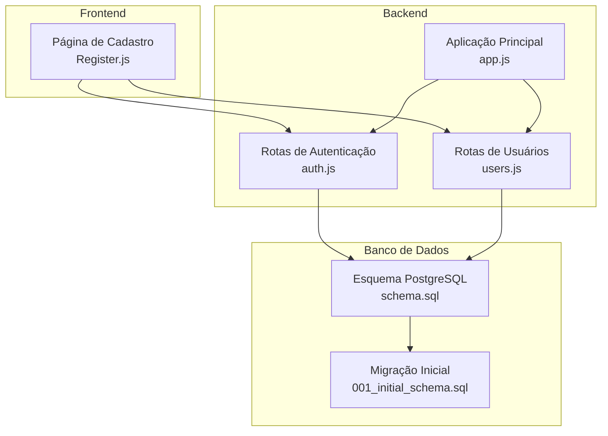
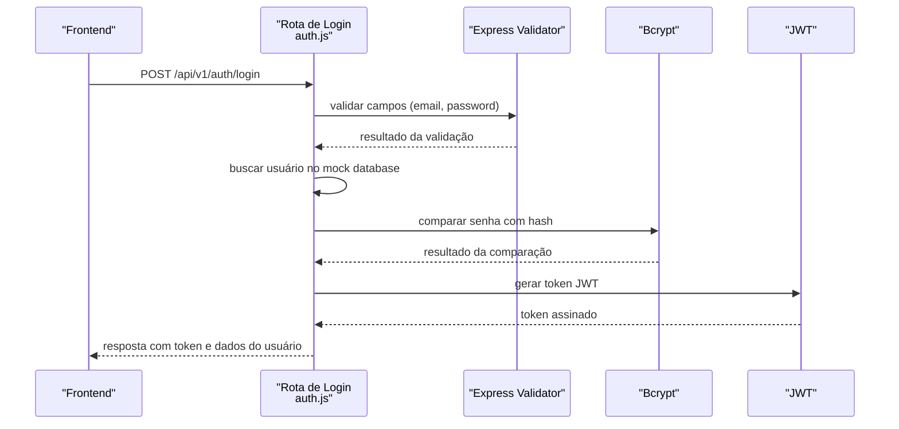
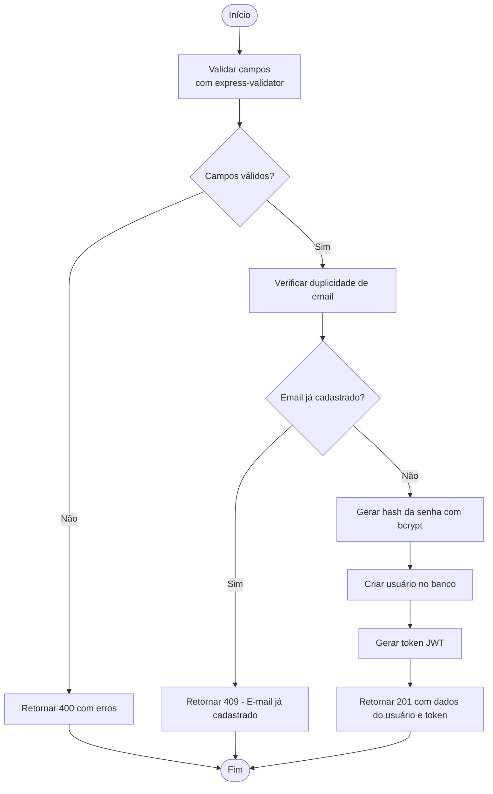

# Validação de Credenciais e Senhas

<cite>
**Arquivos Referenciados neste Documento**
- [auth.js](file://backend/src/routes/auth.js)
- [users.js](file://backend/src/routes/users.js)
- [app.js](file://backend/src/app.js)
- [schema.sql](file://database/schema.sql)
- [001_initial_schema.sql](file://database/migrations/001_initial_schema.sql)
- [package.json](file://backend/package.json)
- [Register.js](file://frontend/src/pages/Register.js)
</cite>

## Sumário
1. [Introdução](#introdução)
2. [Estrutura do Projeto](#estrutura-do-projeto)
3. [Componentes Principais](#componentes-principais)
4. [Visão Geral da Arquitetura](#visão-geral-da-arquitetura)
5. [Análise Detalhada dos Componentes](#análise-detalhada-dos-componentes)
6. [Análise de Dependências](#análise-de-dependências)
7. [Considerações de Desempenho](#considerações-de-desempenho)
8. [Guia de Solução de Problemas](#guia-de-solução-de-problemas)
9. [Conclusão](#conclusão)

## Introdução
Este documento apresenta uma análise abrangente do sistema de validação de credenciais e senhas do projeto. Ele explora o uso do bcrypt para hash de senhas, validações de formulário com express-validator, fluxos de autenticação, políticas de força de senhas, tratamento de erros de credenciais e demonstra como substituir o mock database por um banco de dados real. O conteúdo foi elaborado para ser acessível mesmo a leitores com conhecimento técnico limitado.

## Estrutura do Projeto
O sistema é composto por três camadas principais:
- Backend (servidor Express): contém as rotas de autenticação, middleware de autenticação e configurações de segurança.
- Frontend (React): interface de usuário com validações de formulário e feedback visual.
- Banco de dados (PostgreSQL): esquema e migrações que definem a estrutura de dados persistente.

**Diagrama Fonte**
- [auth.js:1-183](file://backend/src/routes/auth.js#L1-L183)
- [users.js:1-168](file://backend/src/routes/users.js#L1-L168)
- [app.js:110-122](file://backend/src/app.js#L110-L122)
- [schema.sql:1-194](file://database/schema.sql#L1-L194)
- [001_initial_schema.sql:1-57](file://database/migrations/001_initial_schema.sql#L1-L57)

**Fontes da Seção**
- [auth.js:1-183](file://backend/src/routes/auth.js#L1-L183)
- [users.js:1-168](file://backend/src/routes/users.js#L1-L168)
- [app.js:110-122](file://backend/src/app.js#L110-L122)
- [schema.sql:1-194](file://database/schema.sql#L1-L194)
- [001_initial_schema.sql:1-57](file://database/migrations/001_initial_schema.sql#L1-L57)

## Componentes Principais
- Validação de formulário com express-validator: utilizada nas rotas de registro, login e alteração de senha para garantir integridade dos dados.
- Hash de senhas com bcrypt: aplicado durante o registro e ao alterar a senha.
- Middleware de autenticação JWT: protege rotas sensíveis e extrai informações do usuário a partir do token.
- Mock database: armazenamento temporário em memória (Map) para prototipagem.
- Esquema de banco de dados PostgreSQL: estrutura persistente com tabelas de usuários, sessões, tickets e logs.

**Fontes da Seção**
- [auth.js:45-95](file://backend/src/routes/auth.js#L45-L95)
- [users.js:90-124](file://backend/src/routes/users.js#L90-L124)
- [auth.js:25-42](file://backend/src/routes/auth.js#L25-L42)
- [users.js:12-30](file://backend/src/routes/users.js#L12-L30)
- [schema.sql:8-20](file://database/schema.sql#L8-L20)

## Visão Geral da Arquitetura
O fluxo de autenticação segue estas etapas:
1. O frontend envia credenciais para a rota de login.
2. O backend valida os campos com express-validator.
3. O backend busca o usuário no mock database.
4. O bcrypt compara a senha informada com o hash armazenado.
5. Se válido, o backend gera um JWT e retorna ao cliente.

**Diagrama Fonte**
- [auth.js:97-143](file://backend/src/routes/auth.js#L97-L143)
- [auth.js:45-53](file://backend/src/routes/auth.js#L45-L53)
- [auth.js:115-119](file://backend/src/routes/auth.js#L115-L119)
- [auth.js:127-131](file://backend/src/routes/auth.js#L127-L131)

**Fontes da Seção**
- [auth.js:97-143](file://backend/src/routes/auth.js#L97-L143)
- [auth.js:45-53](file://backend/src/routes/auth.js#L45-L53)
- [auth.js:115-119](file://backend/src/routes/auth.js#L115-L119)
- [auth.js:127-131](file://backend/src/routes/auth.js#L127-L131)

## Análise Detalhada dos Componentes

### Validação de Formulário com express-validator
- Regras de validação:
  - Email: formato válido e normalizado.
  - Senha: tamanho mínimo de 8 caracteres.
  - Nome: tamanho mínimo de 2 caracteres.
- Retorno de erros: quando há falha, o backend responde com status 400 e um array de erros.

Exemplos de validações:
- Registro: [auth.js:45-49](file://backend/src/routes/auth.js#L45-L49)
- Login: [auth.js:98-101](file://backend/src/routes/auth.js#L98-L101)
- Alteração de senha: [users.js:91-94](file://backend/src/routes/users.js#L91-L94)

Mensagens de erro específicas:
- Senha deve ter no mínimo 8 caracteres: [auth.js:47](file://backend/src/routes/auth.js#L47)
- E-mail já cadastrado: [auth.js:59](file://backend/src/routes/auth.js#L59)
- Credenciais inválidas: [auth.js:112](file://backend/src/routes/auth.js#L112)
- Senha atual incorreta: [users.js:110](file://backend/src/routes/users.js#L110)

**Fontes da Seção**
- [auth.js:45-49](file://backend/src/routes/auth.js#L45-L49)
- [auth.js:98-101](file://backend/src/routes/auth.js#L98-L101)
- [users.js:91-94](file://backend/src/routes/users.js#L91-L94)
- [auth.js:47](file://backend/src/routes/auth.js#L47)
- [auth.js:59](file://backend/src/routes/auth.js#L59)
- [auth.js:112](file://backend/src/routes/auth.js#L112)
- [users.js:110](file://backend/src/routes/users.js#L110)

### Hash de Senhas com bcrypt
- Durante o registro: a senha é transformada em hash antes de ser armazenada.
- Ao alterar senha: o backend compara a senha atual e, se válida, atualiza o hash.

Fluxos:
- Registro: [auth.js:62-74](file://backend/src/routes/auth.js#L62-L74)
- Alteração de senha: [users.js:107-118](file://backend/src/routes/users.js#L107-L118)

Comparação de senhas:
- Login: [auth.js:115-119](file://backend/src/routes/auth.js#L115-L119)
- Alteração de senha: [users.js:107-109](file://backend/src/routes/users.js#L107-L109)

**Fontes da Seção**
- [auth.js:62-74](file://backend/src/routes/auth.js#L62-L74)
- [users.js:107-118](file://backend/src/routes/users.js#L107-L118)
- [auth.js:115-119](file://backend/src/routes/auth.js#L115-L119)
- [users.js:107-109](file://backend/src/routes/users.js#L107-L109)

### Middleware de Autenticação JWT
- Verifica a presença e o formato do cabeçalho Authorization.
- Decodifica o token JWT e injeta informações do usuário na requisição.
- Respostas de erro: token ausente, inválido ou expirado.

Fluxos:
- Middleware de autenticação: [auth.js:25-42](file://backend/src/routes/auth.js#L25-L42)
- Middleware de usuários: [users.js:12-30](file://backend/src/routes/users.js#L12-L30)

**Fontes da Seção**
- [auth.js:25-42](file://backend/src/routes/auth.js#L25-L42)
- [users.js:12-30](file://backend/src/routes/users.js#L12-L30)

### Mock Database e Substituição por Banco de Dados Real
- Mock atual: armazenamento em memória (Map) usado para prototipagem.
- Substituição planejada: utilizar o esquema PostgreSQL disponível no repositório.

Mock database:
- Definição: [auth.js:23](file://backend/src/routes/auth.js#L23)
- Uso em rotas: [auth.js:57-76](file://backend/src/routes/auth.js#L57-L76), [auth.js:109-113](file://backend/src/routes/auth.js#L109-L113)

Esquema PostgreSQL:
- Tabela de usuários: [schema.sql:8-20](file://database/schema.sql#L8-L20)
- Migração inicial: [001_initial_schema.sql:7-17](file://database/migrations/001_initial_schema.sql#L7-L17)

Substituição recomendada:
- Conectar ao PostgreSQL usando um driver compatível (ex: pg, sequelize).
- Migrar o mock database para consultas SQL no esquema definido.
- Garantir que os campos de senha sejam armazenados como hashes e recuperados apenas para comparação.

**Fontes da Seção**
- [auth.js:23](file://backend/src/routes/auth.js#L23)
- [auth.js:57-76](file://backend/src/routes/auth.js#L57-L76)
- [auth.js:109-113](file://backend/src/routes/auth.js#L109-L113)
- [schema.sql:8-20](file://database/schema.sql#L8-L20)
- [001_initial_schema.sql:7-17](file://database/migrations/001_initial_schema.sql#L7-L17)

### Fluxos de Autenticação
- Registro:
  - Validação de campos.
  - Verificação de duplicidade de email.
  - Hash da senha e criação do usuário.
  - Geração de token JWT.

- Login:
  - Validação de campos.
  - Busca do usuário e verificação de ativação.
  - Comparação de senha via bcrypt.
  - Geração de token JWT.

- Perfil e logout:
  - Middleware de autenticação para acesso às rotas protegidas.
  - Logout: confirmação de encerramento da sessão.

**Diagrama Fonte**
- [auth.js:45-95](file://backend/src/routes/auth.js#L45-L95)
- [auth.js:62-74](file://backend/src/routes/auth.js#L62-L74)
- [auth.js:79-83](file://backend/src/routes/auth.js#L79-L83)

**Fontes da Seção**
- [auth.js:45-95](file://backend/src/routes/auth.js#L45-L95)
- [auth.js:62-74](file://backend/src/routes/auth.js#L62-L74)
- [auth.js:79-83](file://backend/src/routes/auth.js#L79-L83)

### Políticas de Força de Senha
- Tamanho mínimo: 8 caracteres.
- Feedback visual no frontend: indicador de força da senha com cores e texto descritivo.
- Confirmação de senha: validação de correspondência entre os campos.

Exemplos:
- Backend: [auth.js:47](file://backend/src/routes/auth.js#L47), [users.js:93](file://backend/src/routes/users.js#L93)
- Frontend: [Register.js:106-168](file://frontend/src/pages/Register.js#L106-L168)

**Fontes da Seção**
- [auth.js:47](file://backend/src/routes/auth.js#L47)
- [users.js:93](file://backend/src/routes/users.js#L93)
- [Register.js:106-168](file://frontend/src/pages/Register.js#L106-L168)

### Tratamento de Erros de Credenciais
- Credenciais inválidas: retorno com status 401.
- Conta desativada: retorno com status 403.
- Token inválido/expirado: retorno com status 401.
- Erros de validação: retorno com status 400 e array de erros.

Exemplos:
- Login: [auth.js:112](file://backend/src/routes/auth.js#L112), [auth.js:122](file://backend/src/routes/auth.js#L122)
- Senha atual incorreta: [users.js:110](file://backend/src/routes/users.js#L110)
- Token inválido: [auth.js:40](file://backend/src/routes/auth.js#L40)

**Fontes da Seção**
- [auth.js:112](file://backend/src/routes/auth.js#L112)
- [auth.js:122](file://backend/src/routes/auth.js#L122)
- [users.js:110](file://backend/src/routes/users.js#L110)
- [auth.js:40](file://backend/src/routes/auth.js#L40)

## Análise de Dependências
As dependências relevantes para o sistema de validação de credenciais são:
- bcryptjs: hash e comparação de senhas.
- express-validator: validações de formulário.
- jsonwebtoken: geração e verificação de tokens JWT.
- bcryptjs: [package.json:25](file://backend/package.json#L25)
- express-validator: [package.json:31](file://backend/package.json#L31)
- jsonwebtoken: [package.json:35](file://backend/package.json#L35)

**Fontes da Seção**
- [package.json:25](file://backend/package.json#L25)
- [package.json:31](file://backend/package.json#L31)
- [package.json:35](file://backend/package.json#L35)

## Considerações de Desempenho
- O bcrypt é computacionalmente pesado; recomenda-se ajustar o custo conforme a capacidade do servidor.
- O mock database em memória pode ser substituído por um banco de dados com índices otimizados (ex: índice no campo email).
- Para alta concorrência, considere adicionar cache para tokens JWT e limitadores de taxa configuráveis.

## Guia de Solução de Problemas
- Erro 400 ao registrar: verifique as regras de validação (email, senha, nome).
- Erro 409 ao registrar: email já cadastrado; utilize outro endereço.
- Erro 401 ao fazer login: credenciais inválidas; confirme email e senha.
- Erro 403 ao fazer login: conta desativada; entre em contato com o suporte.
- Erro 401 com token: token inválido ou expirado; gere um novo token.
- Erro 400 ao alterar senha: senha atual incorreta; confirme a senha atual correta.

**Fontes da Seção**
- [auth.js:59](file://backend/src/routes/auth.js#L59)
- [auth.js:112](file://backend/src/routes/auth.js#L112)
- [auth.js:122](file://backend/src/routes/auth.js#L122)
- [users.js:110](file://backend/src/routes/users.js#L110)
- [auth.js:40](file://backend/src/routes/auth.js#L40)

## Conclusão
O sistema implementa um fluxo robusto de validação de credenciais e senhas, com boas práticas de segurança como o uso de bcrypt e JWT. As validações no backend e no frontend garantem qualidade dos dados e experiência do usuário. A substituição do mock database pelo esquema PostgreSQL planejado permite uma transição segura e escalável para produção.