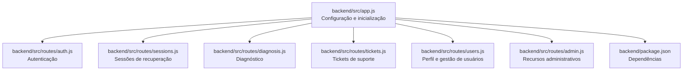
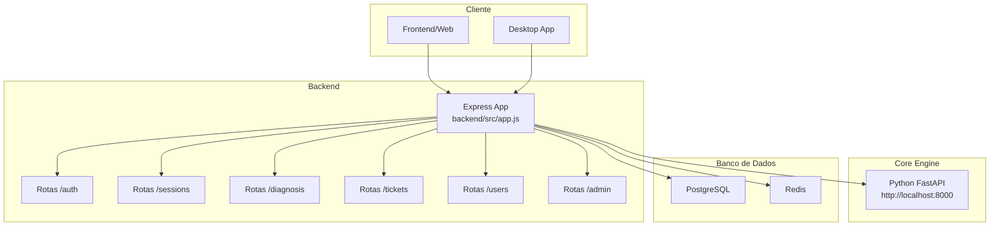
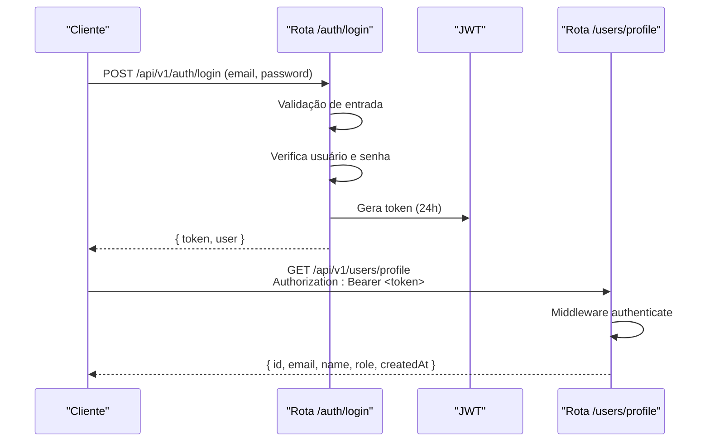
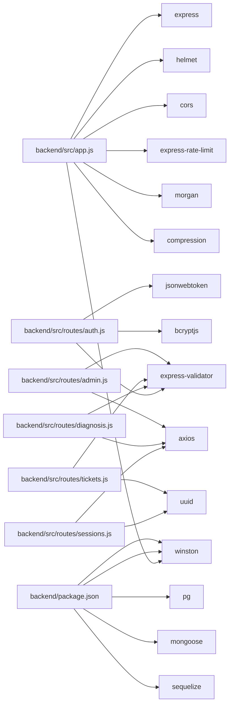

# Backend API (Node.js)

<cite>
**Arquivos referenciados neste documento**
- [app.js](file://backend/src/app.js)
- [auth.js](file://backend/src/routes/auth.js)
- [users.js](file://backend/src/routes/users.js)
- [sessions.js](file://backend/src/routes/sessions.js)
- [diagnosis.js](file://backend/src/routes/diagnosis.js)
- [tickets.js](file://backend/src/routes/tickets.js)
- [admin.js](file://backend/src/routes/admin.js)
- [package.json](file://backend/package.json)
- [README.md](file://README.md)
</cite>

## Índice
1. [Introdução](#introdução)
2. [Estrutura do Projeto](#estrutura-do-projeto)
3. [Componentes Principais](#componentes-principais)
4. [Visão Geral da Arquitetura](#visão-geral-da-arquitetura)
5. [Análise Detalhada dos Componentes](#análise-detalhada-dos-componentes)
6. [Análise de Dependências](#análise-de-dependências)
7. [Considerações de Desempenho](#considerações-de-desempenho)
8. [Guia de Resolução de Problemas](#guia-de-resolução-de-problemas)
9. [Conclusão](#conclusão)
10. [Apêndices](#apêndices)

## Introdução
Esta documentação apresenta a API REST do backend Node.js do projeto Apple ID Assistant. O sistema oferece funcionalidades de autenticação, gestão de sessões de recuperação, diagnóstico assistido, tickets de suporte e recursos administrativos. A API foi construída com Express, inclui middlewares de segurança (Helmet, rate limiting, CORS), logging com Winston e Morgan, e integração com o Core Engine Python. A documentação especifica configuração e inicialização, middleware de segurança, rotas e controladores, autenticação e autorização, schemas de requisição/retorno, status codes, exemplos de chamadas, tratamento de erros e considerações de segurança. Também aborda integrações com o core engine e o banco de dados, além de orientações para desenvolvedores.

## Estrutura do Projeto
O backend é composto por:
- Arquivo principal de inicialização e configuração da aplicação
- Módulos de roteamento separados por funcionalidade
- Pacotes de dependência declarados no package.json

**Diagrama fonte**
- [app.js](file://backend/src/app.js)
- [auth.js](file://backend/src/routes/auth.js)
- [sessions.js](file://backend/src/routes/sessions.js)
- [diagnosis.js](file://backend/src/routes/diagnosis.js)
- [tickets.js](file://backend/src/routes/tickets.js)
- [users.js](file://backend/src/routes/users.js)
- [admin.js](file://backend/src/routes/admin.js)
- [package.json](file://backend/package.json)

**Seção fonte**
- [app.js](file://backend/src/app.js)
- [package.json](file://backend/package.json)

## Componentes Principais
- Configuração e inicialização: carrega variáveis de ambiente, define middlewares de segurança, logging, compressão, rate limiting, e registra as rotas da API.
- Middlewares de segurança: Helmet com CSP configurado para conexão com o Core Engine, CORS com origens permitidas, rate limiting global e específico para autenticação.
- Rotas: agrupadas por funcionalidade, com validação de entrada via express-validator e Joi (nas dependências), e uso de JWT para autenticação.
- Integração com Core Engine: chamadas HTTP para endpoints do motor Python (ex: diagnóstico, sessões, estatísticas).
- Banco de dados: dependências incluem Sequelize, pg e mongoose, mas as rotas atuais usam armazenamento temporário (Map) para simular dados.

**Seção fonte**
- [app.js](file://backend/src/app.js)
- [package.json](file://backend/package.json)

## Visão Geral da Arquitetura
A API é um servidor Express com:
- Middlewares de segurança e logging
- Rotas prefixadas com /api/v1
- Integração externa com o Core Engine Python
- Tratamento centralizado de erros e respostas

**Diagrama fonte**
- [app.js](file://backend/src/app.js)
- [auth.js](file://backend/src/routes/auth.js)
- [sessions.js](file://backend/src/routes/sessions.js)
- [diagnosis.js](file://backend/src/routes/diagnosis.js)
- [tickets.js](file://backend/src/routes/tickets.js)
- [users.js](file://backend/src/routes/users.js)
- [admin.js](file://backend/src/routes/admin.js)

## Análise Detalhada dos Componentes

### Configuração e Inicialização
- Variáveis de ambiente: PORT, NODE_ENV, JWT_SECRET, CORE_ENGINE_URL, DATABASE_URL, REDIS_URL.
- Middlewares:
  - Helmet com Content-Security-Policy direcionada ao Core Engine.
  - CORS com origens permitidas via ALLOWED_ORIGINS.
  - Rate limiting global (100 requisições/15min/IP).
  - Body parsing JSON e URL-encoded com limites.
  - Compression.
  - Morgan com logger Winston.
- Rotas registradas sob /api/v1:
  - /auth, /sessions, /diagnosis, /tickets, /users, /admin.
- Ponto de saúde (/health) retorna informações do ambiente.
- Tratamento de erros:
  - 404 para endpoints não encontrados.
  - Handler global com logging e resposta diferenciada entre produção e desenvolvimento.

**Seção fonte**
- [app.js](file://backend/src/app.js)

### Autenticação e Autorização
- JWT:
  - Geração de tokens com expiração de 24h.
  - Middleware authenticate verifica cabeçalho Authorization Bearer e decodifica o token.
  - Validação de token com JWT_SECRET.
- Níveis de acesso:
  - Rota /admin exige role=admin.
  - Tickets e sessões possuem permissões específicas baseadas em role (admin, support) e propriedade do recurso.
- Senha:
  - Hash com bcrypt nos endpoints de cadastro e alteração de senha.
- Logout:
  - Endpoint /auth/logout atualmente retorna sucesso; recomenda-se blacklist em produção.

**Diagrama fonte**
- [auth.js](file://backend/src/routes/auth.js)
- [users.js](file://backend/src/routes/users.js)

**Seção fonte**
- [auth.js](file://backend/src/routes/auth.js)
- [users.js](file://backend/src/routes/users.js)
- [admin.js](file://backend/src/routes/admin.js)
- [tickets.js](file://backend/src/routes/tickets.js)
- [sessions.js](file://backend/src/routes/sessions.js)

### Roteamento e Controladores

#### Rota /api/v1/auth
- Métodos HTTP:
  - POST /api/v1/auth/register
  - POST /api/v1/auth/login
  - GET /api/v1/auth/profile
  - POST /api/v1/auth/logout
  - POST /api/v1/auth/refresh
- Validação de entrada:
  - express-validator para email, senha, nome, credenciais.
- Status codes:
  - 201 Created (registro)
  - 200 OK (login, perfil, refresh)
  - 400 Bad Request (erros de validação)
  - 401 Unauthorized (credenciais inválidas, token inválido)
  - 403 Forbidden (conta desativada)
  - 409 Conflict (email já cadastrado)
  - 500 Internal Server Error (erros internos)
- Exemplos de chamadas:
  - Registro: POST com email, password, name.
  - Login: POST com email, password.
  - Perfil: GET com Authorization Bearer.
  - Refresh: POST com Authorization Bearer.
- Considerações de segurança:
  - Senha criptografada com bcrypt.
  - Rate limiting específico para login.

**Seção fonte**
- [auth.js](file://backend/src/routes/auth.js)

#### Rota /api/v1/users
- Métodos HTTP:
  - GET /api/v1/users/profile
  - PATCH /api/v1/users/profile
  - POST /api/v1/users/change-password
  - GET /api/v1/users/activity
  - GET /api/v1/users/sessions
  - DELETE /api/v1/users/sessions/:sessionId
- Validação de entrada:
  - express-validator para campos opcionais e obrigatórios.
- Status codes:
  - 200 OK (sucesso)
  - 400 Bad Request (erros de validação)
  - 401 Unauthorized (token inválido)
  - 404 Not Found (usuário não encontrado)
  - 500 Internal Server Error
- Exemplos de chamadas:
  - Atualizar perfil: PATCH com name e/ou email.
  - Alterar senha: POST com currentPassword e newPassword.
  - Listar sessões: GET com Authorization Bearer.

**Seção fonte**
- [users.js](file://backend/src/routes/users.js)

#### Rota /api/v1/sessions
- Métodos HTTP:
  - POST /api/v1/sessions/
  - GET /api/v1/sessions/:sessionId
  - PATCH /api/v1/sessions/:sessionId
  - POST /api/v1/sessions/:sessionId/consent
  - GET /api/v1/sessions/ (admin)
  - GET /api/v1/sessions/stats/overview
- Validação de entrada:
  - express-validator para UUIDs, tipos de problema, status, consentimento.
- Status codes:
  - 201 Created (criação de sessão)
  - 200 OK (busca, atualização, consentimento)
  - 400 Bad Request (erros de validação)
  - 401 Unauthorized (token inválido)
  - 403 Forbidden (acesso restrito)
  - 404 Not Found (sessão não encontrada)
  - 500 Internal Server Error
- Integração com Core Engine:
  - Chamadas POST/GET para /api/sessions e /api/consent.
- Exemplos de chamadas:
  - Criar sessão: POST com email e problemType.
  - Registrar consentimento: POST com consentGiven e userAgent.

**Seção fonte**
- [sessions.js](file://backend/src/routes/sessions.js)

#### Rota /api/v1/diagnosis
- Métodos HTTP:
  - POST /api/v1/diagnosis/
  - GET /api/v1/diagnosis/guide/:problemType
  - POST /api/v1/diagnosis/validate
- Validação de entrada:
  - express-validator para sessionId, problemType, flags de contexto.
- Status codes:
  - 200 OK (diagnóstico, guia)
  - 400 Bad Request (erros de validação)
  - 500 Internal Server Error
- Integração com Core Engine:
  - Chamadas POST para /api/diagnosis e GET para /api/guides/:problemType.
- Exemplos de chamadas:
  - Diagnóstico: POST com sessionId, problemType e flags.
  - Guia: GET /guide/:problemType.

**Seção fonte**
- [diagnosis.js](file://backend/src/routes/diagnosis.js)

#### Rota /api/v1/tickets
- Métodos HTTP:
  - POST /api/v1/tickets/
  - GET /api/v1/tickets/my
  - GET /api/v1/tickets/:ticketId
  - POST /api/v1/tickets/:ticketId/messages
  - PATCH /api/v1/tickets/:ticketId/status
  - GET /api/v1/tickets/
  - GET /api/v1/tickets/stats/overview
- Validação de entrada:
  - express-validator para assunto, descrição, categoria, prioridade, sessionId, conteúdo da mensagem, status.
- Status codes:
  - 201 Created (criação de ticket)
  - 200 OK (listagens, atualizações)
  - 400 Bad Request (erros de validação)
  - 401 Unauthorized (token inválido)
  - 403 Forbidden (acesso negado)
  - 404 Not Found (ticket não encontrado)
  - 500 Internal Server Error
- Exemplos de chamadas:
  - Criar ticket: POST com subject, description, category, priority, sessionId.
  - Adicionar mensagem: POST com content.
  - Atualizar status: PATCH com status e/ou resolution (somente admin/support).

**Seção fonte**
- [tickets.js](file://backend/src/routes/tickets.js)

#### Rota /api/v1/admin
- Métodos HTTP:
  - GET /api/v1/admin/dashboard
  - GET /api/v1/admin/users
  - PATCH /api/v1/admin/users/:userId/role
  - PATCH /api/v1/admin/users/:userId/status
  - GET /api/v1/admin/logs
  - GET /api/v1/admin/settings
  - PATCH /api/v1/admin/settings
  - GET /api/v1/admin/metrics
  - POST /api/v1/admin/backup
  - POST /api/v1/admin/restore
- Validação de entrada:
  - express-validator para parâmetros, query e body.
- Status codes:
  - 200 OK (sucesso)
  - 400 Bad Request (erros de validação)
  - 401 Unauthorized (token inválido)
  - 403 Forbidden (acesso restrito a admin)
  - 500 Internal Server Error
- Integração com Core Engine:
  - Chamadas GET para /api/stats.
- Exemplos de chamadas:
  - Dashboard: GET com token admin.
  - Logs: GET com filtros (level, startDate, endDate, limit).

**Seção fonte**
- [admin.js](file://backend/src/routes/admin.js)

### Exemplos de Chamadas Reais
- Autenticação:
  - Registro: POST /api/v1/auth/register com { email, password, name }.
  - Login: POST /api/v1/auth/login com { email, password }.
  - Perfil: GET /api/v1/users/profile com Authorization: Bearer <token>.
- Diagnóstico:
  - Diagnóstico: POST /api/v1/diagnosis/ com { sessionId, problemType, hasProofOfPurchase, hasDeviceAccess }.
  - Guia: GET /api/v1/diagnosis/guide/:problemType.
- Sessões:
  - Criar sessão: POST /api/v1/sessions/ com { email, problemType }.
  - Registrar consentimento: POST /api/v1/sessions/:sessionId/consent com { consentGiven, userAgent }.
- Tickets:
  - Criar ticket: POST /api/v1/tickets/ com { subject, description, category, priority, sessionId }.
  - Adicionar mensagem: POST /api/v1/tickets/:ticketId/messages com { content }.
  - Atualizar status: PATCH /api/v1/tickets/:ticketId/status com { status, resolution } (admin/support).
- Administrativo:
  - Dashboard: GET /api/v1/admin/dashboard com Authorization: Bearer <token> (admin).
  - Logs: GET /api/v1/admin/logs com query params.

**Seção fonte**
- [auth.js](file://backend/src/routes/auth.js)
- [users.js](file://backend/src/routes/users.js)
- [diagnosis.js](file://backend/src/routes/diagnosis.js)
- [sessions.js](file://backend/src/routes/sessions.js)
- [tickets.js](file://backend/src/routes/tickets.js)
- [admin.js](file://backend/src/routes/admin.js)

### Tratamento de Erros
- 404 Not Found: endpoint inexistente.
- 401 Unauthorized: token ausente ou inválido.
- 403 Forbidden: acesso negado (nível de permissão insuficiente).
- 400 Bad Request: erros de validação de entrada.
- 404 Not Found: recursos não encontrados (usuário, ticket, sessão).
- 409 Conflict: conflito lógico (ex: email já cadastrado).
- 500 Internal Server Error: erros internos, com logging detalhado.
- Em produção, respostas de erro não revelam stack traces.

**Seção fonte**
- [app.js](file://backend/src/app.js)
- [auth.js](file://backend/src/routes/auth.js)
- [users.js](file://backend/src/routes/users.js)
- [sessions.js](file://backend/src/routes/sessions.js)
- [diagnosis.js](file://backend/src/routes/diagnosis.js)
- [tickets.js](file://backend/src/routes/tickets.js)
- [admin.js](file://backend/src/routes/admin.js)

### Considerações de Segurança
- JWT:
  - Secret configurável via JWT_SECRET.
  - Tokens com expiração de 24h.
  - Middleware de autenticação obrigatório nas rotas protegidas.
- Helmet:
  - CSP com connectSrc apontando para CORE_ENGINE_URL.
- Rate Limiting:
  - Global (100 requisições/15min/IP).
  - Específico para login (5 tentativas/15min/IP, pula requisições bem-sucedidas).
- CORS:
  - Origens permitidas via ALLOWED_ORIGINS.
- Senha:
  - Hash com bcrypt.
- Logout:
  - Recomenda-se implementar blacklist de tokens em produção.
- Logs:
  - Winston com arquivos e console, incluindo stack traces em modo de erro.

**Seção fonte**
- [app.js](file://backend/src/app.js)
- [auth.js](file://backend/src/routes/auth.js)
- [users.js](file://backend/src/routes/users.js)
- [sessions.js](file://backend/src/routes/sessions.js)
- [admin.js](file://backend/src/routes/admin.js)

### Integrações com o Core Engine e Banco de Dados
- Core Engine:
  - Chamadas HTTP para endpoints como /api/sessions, /api/consent, /api/diagnosis, /api/guides/:problemType, /api/stats.
  - URL configurável via CORE_ENGINE_URL.
- Banco de Dados:
  - Dependências incluem pg (PostgreSQL) e mongoose (MongoDB), e ORM Sequelize.
  - As rotas atuais usam Map para simular dados; recomenda-se substituir por modelos reais e conexões persistentes.

**Seção fonte**
- [sessions.js](file://backend/src/routes/sessions.js)
- [diagnosis.js](file://backend/src/routes/diagnosis.js)
- [admin.js](file://backend/src/routes/admin.js)
- [package.json](file://backend/package.json)

### Padrões de Implementação e Boas Práticas
- Validação de entrada:
  - Utilizar express-validator para todos os endpoints com parâmetros ou corpo.
- Autenticação:
  - Sempre verificar Authorization Bearer e validar token.
  - Separar middlewares de autenticação e autorização.
- Respostas padronizadas:
  - Camadas de sucesso com { success: true } e dados.
  - Erros com { error } e códigos HTTP apropriados.
- Logs:
  - Registrar requisições completas com Morgan e detalhes de erro com Winston.
- Segurança:
  - Manter JWT_SECRET seguro e trocá-lo em produção.
  - Evitar expor stack traces em produção.
- Performance:
  - Habilitar compression.
  - Limitar tamanho de uploads e payloads.
- Testes:
  - Scripts Jest disponíveis; sugerimos adicionar testes unitários e de integração.

**Seção fonte**
- [app.js](file://backend/src/app.js)
- [auth.js](file://backend/src/routes/auth.js)
- [users.js](file://backend/src/routes/users.js)
- [sessions.js](file://backend/src/routes/sessions.js)
- [diagnosis.js](file://backend/src/routes/diagnosis.js)
- [tickets.js](file://backend/src/routes/tickets.js)
- [admin.js](file://backend/src/routes/admin.js)
- [package.json](file://backend/package.json)

## Análise de Dependências
As dependências principais incluem:
- Express, helmet, cors, express-rate-limit, morgan, compression
- Validação: express-validator, joi
- Autenticação: jsonwebtoken, bcryptjs
- Comunicação HTTP: axios
- Banco de dados: pg, mongoose, sequelize
- Logs: winston
- Outras: uuid, multer, nodemailer, socket.io, stripe, sharp, ioredis

**Diagrama fonte**
- [app.js](file://backend/src/app.js)
- [auth.js](file://backend/src/routes/auth.js)
- [sessions.js](file://backend/src/routes/sessions.js)
- [diagnosis.js](file://backend/src/routes/diagnosis.js)
- [tickets.js](file://backend/src/routes/tickets.js)
- [admin.js](file://backend/src/routes/admin.js)
- [package.json](file://backend/package.json)

**Seção fonte**
- [package.json](file://backend/package.json)

## Considerações de Desempenho
- Compression habilitada para reduzir tamanho das respostas.
- Rate limiting evita sobrecarga e ataques de força bruta.
- Body parsers com limites configurados.
- Recomendações:
  - Implementar cache para consultas frequentes.
  - Usar pool de conexões para banco de dados.
  - Monitorar métricas de desempenho (CPU, memória, tempo de resposta).

[Sem seção fonte, pois esta seção fornece orientações gerais]

## Guia de Resolução de Problemas
- Erros 401:
  - Verifique o cabeçalho Authorization: Bearer <token>.
  - Confirme que o token não expirou e que JWT_SECRET está correto.
- Erros 403:
  - Confirme o role do usuário (admin/support) para rotas restritas.
- Erros 404:
  - Verifique se o ID (UUID) está correto e se o recurso existe.
- Erros 400:
  - Revise os campos obrigatórios e formatos esperados.
- Erros 500:
  - Verifique logs de erro e stack traces (modo desenvolvimento).
- CORS:
  - Certifique-se de que ALLOWED_ORIGINS inclui a origem do cliente.

**Seção fonte**
- [app.js](file://backend/src/app.js)
- [auth.js](file://backend/src/routes/auth.js)
- [users.js](file://backend/src/routes/users.js)
- [sessions.js](file://backend/src/routes/sessions.js)
- [diagnosis.js](file://backend/src/routes/diagnosis.js)
- [tickets.js](file://backend/src/routes/tickets.js)
- [admin.js](file://backend/src/routes/admin.js)

## Conclusão
A API REST do backend foi projetada com foco em segurança, modularidade e escalabilidade. Os middlewares de segurança, validações rigorosas, tratamento de erros padronizado e integração com o Core Engine proporcionam uma base sólida. Recomenda-se substituir o armazenamento temporário por persistência real, implementar blacklist de tokens, e expandir testes e documentação de endpoints.

[Sem seção fonte, pois esta seção resume sem análise específica de arquivos]

## Apêndices
- Informações gerais do projeto e instalação:
  - O README descreve a arquitetura e passos para instalar e executar backend, Core Engine, frontend e desktop app.
  - Destaca-se a importância de seguir processos oficiais da Apple e práticas de segurança.

**Seção fonte**
- [README.md](file://README.md)