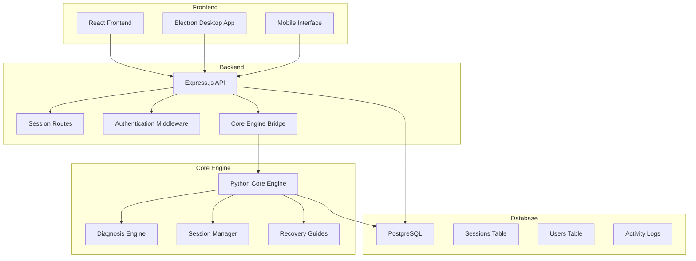
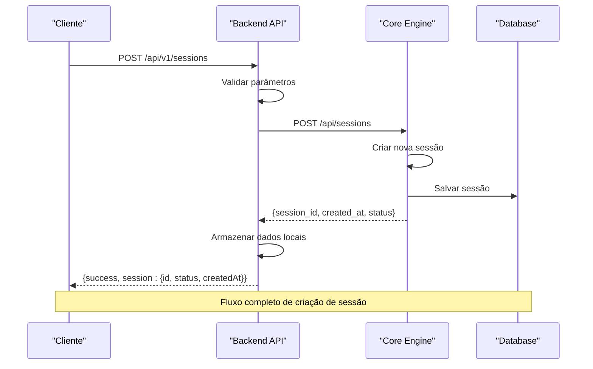
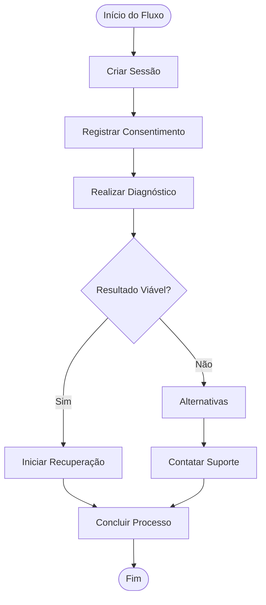
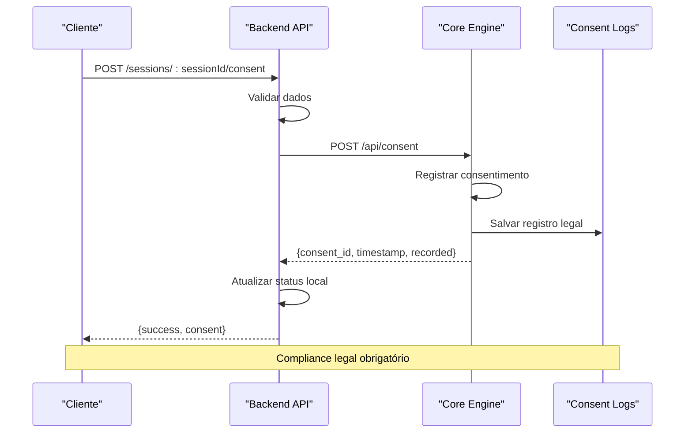
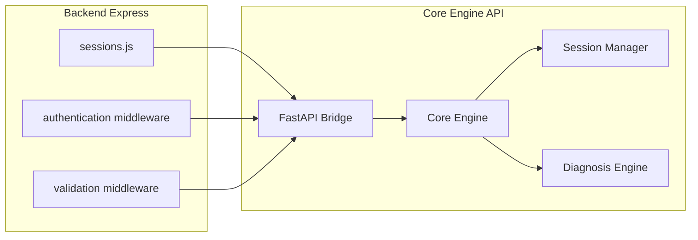
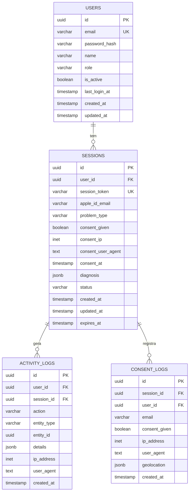
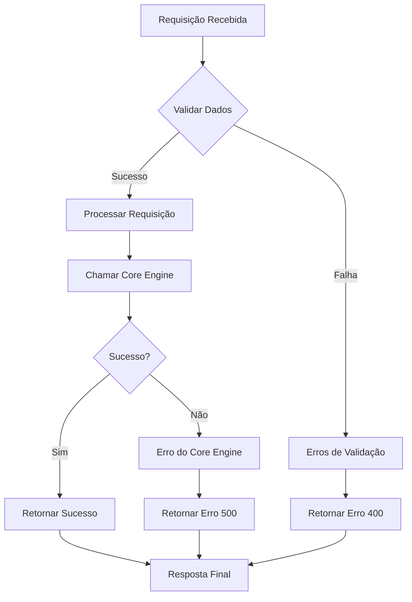

# Gestão de Sessões

<cite>
**Arquivos Referenciados Neste Documento**
- [sessions.js](file://backend/src/routes/sessions.js)
- [app.js](file://backend/src/app.js)
- [main.py](file://core-engine/python/main.py)
- [api.py](file://core-engine/bridge/api.py)
- [schema.sql](file://database/schema.sql)
- [001_initial_schema.sql](file://database/migrations/001_initial_schema.sql)
- [RecoveryFlow.js](file://frontend/src/pages/RecoveryFlow.js)
- [api.js](file://frontend/src/services/api.js)
- [app.js](file://desktop/electron-app/renderer/app.js)
</cite>

## Sumário
1. [Introdução](#introdução)
2. [Arquitetura Geral](#arquitetura-geral)
3. [Endpoints de Sessões](#endpoints-de-sessões)
4. [Fluxo Completo de Criação de Sessão](#fluxo-completo-de-criação-de-sessão)
5. [Armazenamento de Consentimento](#armazenamento-de-consentimento)
6. [Integração com Core Engine](#integração-com-core-engine)
7. [Persistência de Dados](#persistência-de-dados)
8. [Exemplos de Requisições e Respostas](#exemplos-de-requisições-e-respostas)
9. [Validações e Tratamento de Erros](#validações-e-tratamento-de-erros)
10. [Considerações de Segurança](#considerações-de-segurança)
11. [Conclusão](#conclusão)

## Introdução

O sistema de Gestão de Sessões é uma componente crítico do Apple ID Assistant, responsável por gerenciar todo o ciclo de vida das sessões de recuperação de contas Apple ID. O sistema permite que usuários iniciem fluxos de recuperação, forneçam consentimento legal, realizem diagnósticos e acompanhem o progresso do processo de forma estruturada e segura.

O sistema foi projetado com base em uma arquitetura de microserviços, onde o backend Express.js atua como gateway para o Core Engine Python, que contém toda a lógica de negócio e diagnósticos especializados.

## Arquitetura Geral



**Fontes dos Diagramas**
- [app.js:110-121](file://backend/src/app.js#L110-L121)
- [sessions.js:13-14](file://backend/src/routes/sessions.js#L13-L14)
- [api.py:165-170](file://core-engine/bridge/api.py#L165-L170)

## Endpoints de Sessões

### Endpoints Principais

| Método | Endpoint | Descrição | Autenticação |
|--------|----------|-----------|--------------|
| POST | `/api/v1/sessions` | Criar nova sessão de recuperação | Nenhum |
| GET | `/api/v1/sessions/:sessionId` | Obter detalhes da sessão | Nenhum |
| PATCH | `/api/v1/sessions/:sessionId` | Atualizar dados da sessão | JWT |
| POST | `/api/v1/sessions/:sessionId/consent` | Registrar consentimento | Nenhum |
| GET | `/api/v1/sessions` | Listar todas as sessões (admin) | JWT Admin |
| GET | `/api/v1/sessions/stats/overview` | Estatísticas do sistema | JWT Admin |

### Parâmetros e Validações

#### Criação de Sessão
- `email`: Email opcional do Apple ID (validação de formato)
- `problemType`: Tipo de problema (valores válidos: forgot-password, two-factor, activation-lock, account-locked, device-used)

#### Atualização de Sessão
- `email`: Email opcional (validação de formato)
- `problemType`: Tipo de problema (string)
- `status`: Status da sessão (string)
- `notes`: Observações (string)

#### Consentimento
- `consentGiven`: Booleano obrigatório
- `userAgent`: String opcional
- `email`: Email opcional

**Fontes**
- [sessions.js:40-49](file://backend/src/routes/sessions.js#L40-L49)
- [sessions.js:123-128](file://backend/src/routes/sessions.js#L123-L128)
- [sessions.js:162-166](file://backend/src/routes/sessions.js#L162-L166)

## Fluxo Completo de Criação de Sessão

### Passo a Passo Detalhado



**Fontes**
- [sessions.js:39-88](file://backend/src/routes/sessions.js#L39-L88)
- [api.py:213-231](file://core-engine/bridge/api.py#L213-L231)

### Fluxo de Diagnóstico



**Fontes**
- [RecoveryFlow.js:39-106](file://frontend/src/pages/RecoveryFlow.js#L39-L106)
- [main.py:281-327](file://core-engine/python/main.py#L281-L327)

## Armazenamento de Consentimento

### Estrutura de Consentimento

O sistema registra consentimentos de forma legalmente válida, incluindo:

- **IP do usuário**: Rastreamento de localização
- **User Agent**: Informações do navegador
- **Timestamp**: Data e hora exata do registro
- **Email**: Dados do usuário (opcional)
- **Status**: Indicador de consentimento

### Fluxo de Registro



**Fontes**
- [sessions.js:161-207](file://backend/src/routes/sessions.js#L161-L207)
- [api.py:285-318](file://core-engine/bridge/api.py#L285-L318)
- [schema.sql:108-119](file://database/schema.sql#L108-L119)

## Integração com Core Engine

### Comunicação HTTP

O backend Express.js se comunica com o Core Engine Python através de requisições HTTP:



**Fontes**
- [sessions.js:13-14](file://backend/src/routes/sessions.js#L13-L14)
- [api.py:165-170](file://core-engine/bridge/api.py#L165-L170)

### Tipos de Problemas Suportados

| Tipo | Descrição | Severidade |
|------|-----------|------------|
| `forgot-password` | Senha esquecida | Baixa |
| `two-factor` | Verificação em 2 etapas | Média |
| `activation-lock` | Bloqueio de ativação | Alta |
| `account-locked` | Conta inacessível | Média |
| `device-used` | Dispositivo usado | Alta |

**Fontes**
- [main.py:35-42](file://core-engine/python/main.py#L35-L42)
- [sessions.js:42-48](file://backend/src/routes/sessions.js#L42-L48)

## Persistência de Dados

### Esquema de Banco de Dados



**Fontes**
- [schema.sql:8-51](file://database/schema.sql#L8-L51)
- [schema.sql:94-119](file://database/schema.sql#L94-L119)

### Migrações Iniciais

O sistema utiliza migrações para manter a consistência do esquema:

- **Migration 001**: Criação do esquema base com tabelas principais
- **Triggers**: Atualização automática de timestamps
- **Índices**: Otimização de consultas frequentes

**Fontes**
- [001_initial_schema.sql:19-31](file://database/migrations/001_initial_schema.sql#L19-L31)

## Exemplos de Requisições e Respostas

### Criação de Sessão

**Requisição:**
```javascript
POST /api/v1/sessions
{
  "email": "usuario@apple.com",
  "problemType": "forgot-password"
}
```

**Resposta:**
```javascript
HTTP/1.1 201 Created
{
  "success": true,
  "session": {
    "id": "550e8400-e29b-41d4-a716-446655440000",
    "status": "created",
    "createdAt": "2024-01-15T10:30:00Z"
  }
}
```

### Registrar Consentimento

**Requisição:**
```javascript
POST /api/v1/sessions/:sessionId/consent
{
  "email": "usuario@apple.com",
  "consentGiven": true,
  "userAgent": "Mozilla/5.0..."
}
```

**Resposta:**
```javascript
{
  "success": true,
  "consent": {
    "session_id": "550e8400-e29b-41d4-a716-446655440000",
    "consent_id": "6ba7b810-9dad-11d1-80b4-00c04fd430c8",
    "timestamp": "2024-01-15T10:35:00Z",
    "recorded": true
  }
}
```

### Obter Status da Sessão

**Requisição:**
```javascript
GET /api/v1/sessions/:sessionId
```

**Resposta:**
```javascript
{
  "success": true,
  "session": {
    "session_id": "550e8400-e29b-41d4-a716-446655440000",
    "email": "usuario@apple.com",
    "problem_type": "forgot-password",
    "consent_given": true,
    "status": "consent_given",
    "created_at": "2024-01-15T10:30:00Z",
    "diagnosis": null
  }
}
```

## Validações e Tratamento de Erros

### Validações Implementadas

| Campo | Tipo | Validação | Mensagem de Erro |
|-------|------|-----------|------------------|
| `sessionId` | UUID | Formato UUID válido | ID inválido |
| `email` | String | Formato de email | Email inválido |
| `problemType` | Enum | Valores permitidos | Tipo de problema inválido |
| `consentGiven` | Boolean | Booleano obrigatório | Consentimento requerido |
| `status` | String | Validação de status | Status inválido |

### Tratamento de Erros



**Fontes**
- [sessions.js:50-53](file://backend/src/routes/sessions.js#L50-L53)
- [sessions.js:129-132](file://backend/src/routes/sessions.js#L129-L132)

### Códigos de Status HTTP

- **200**: Sucesso na operação
- **201**: Criação bem-sucedida
- **400**: Erro de validação ou dados inválidos
- **401**: Token de autenticação inválido
- **403**: Acesso negado (permissões insuficientes)
- **404**: Recurso não encontrado
- **500**: Erro interno do servidor

## Considerações de Segurança

### Autenticação JWT

O sistema implementa autenticação JWT para endpoints administrativos:

- **Token**: Bearer token no cabeçalho Authorization
- **Validade**: Configurável via variáveis de ambiente
- **Claims**: Informações do usuário (role, email, id)

### Proteções Implementadas

- **Rate Limiting**: Limitação de requisições por IP
- **CORS**: Configuração segura de origens permitidas
- **Helmet**: Headers de segurança HTTP
- **Compression**: Compressão de respostas
- **Logging**: Auditoria completa de todas as operações

### Compliance Legal

- **Consentimento**: Registro completo de consentimentos
- **Logs**: Histórico de todas as ações
- **IP Tracking**: Rastreamento de localização
- **Timestamps**: Precisão temporal de todas as operações

**Fontes**
- [app.js:59-96](file://backend/src/app.js#L59-L96)
- [sessions.js:19-37](file://backend/src/routes/sessions.js#L19-L37)

## Conclusão

O sistema de Gestão de Sessões do Apple ID Assistant oferece uma solução completa e robusta para o gerenciamento de fluxos de recuperação de contas Apple ID. Com sua arquitetura modular, validações rigorosas e persistência legalmente adequada, o sistema atende às necessidades de um ambiente profissional de suporte técnico.

As principais características incluem:

- **Fluxo completo de recuperação**: Desde a criação de sessão até a conclusão do processo
- **Integração com Core Engine**: Lógica de diagnóstico avançada e guias oficiais
- **Persistência legal**: Registro completo de consentimentos e atividades
- **Segurança robusta**: Validações, autenticação e proteções implementadas
- **Escalabilidade**: Arquitetura de microserviços facilita expansão

O sistema está pronto para ser implantado em ambientes profissionais, oferecendo uma experiência segura e eficiente tanto para técnicos quanto para usuários finais.