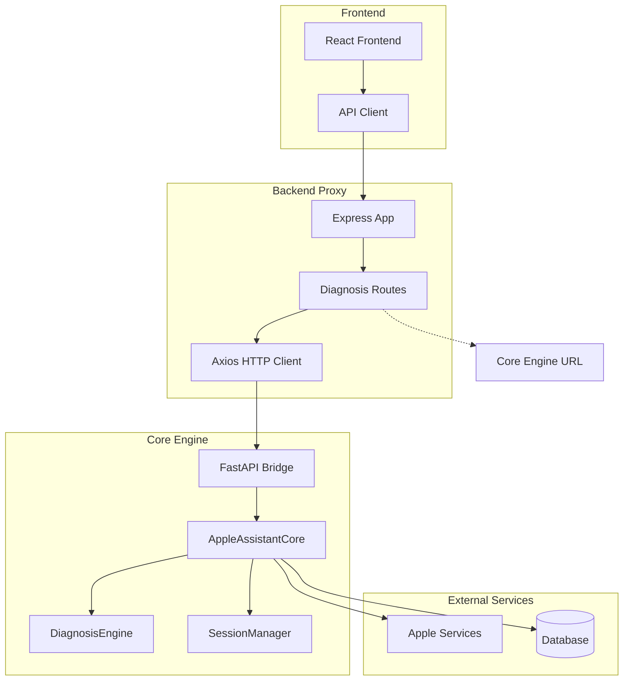
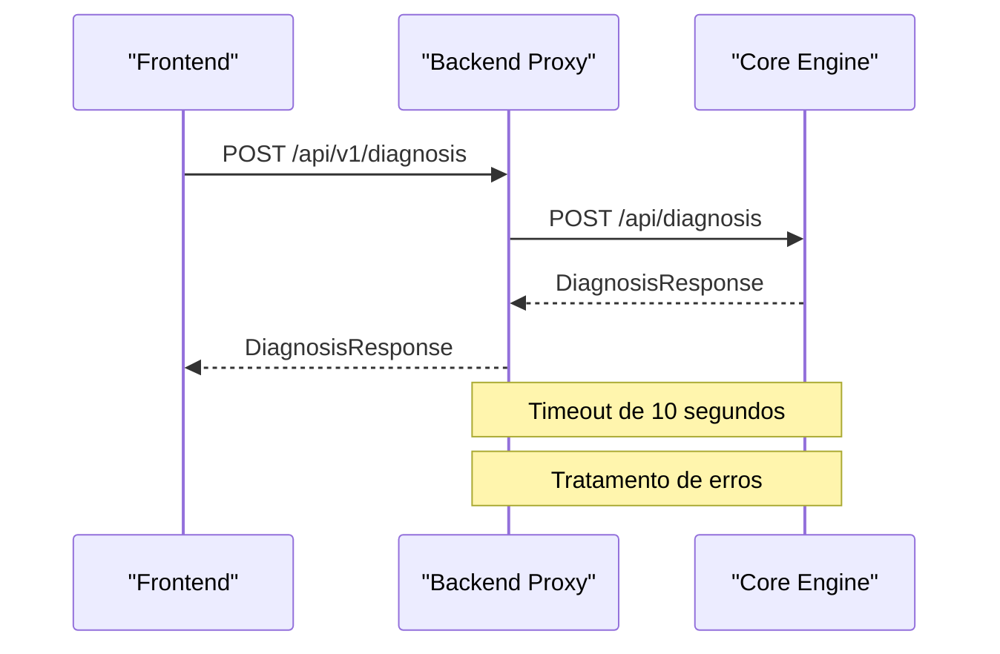
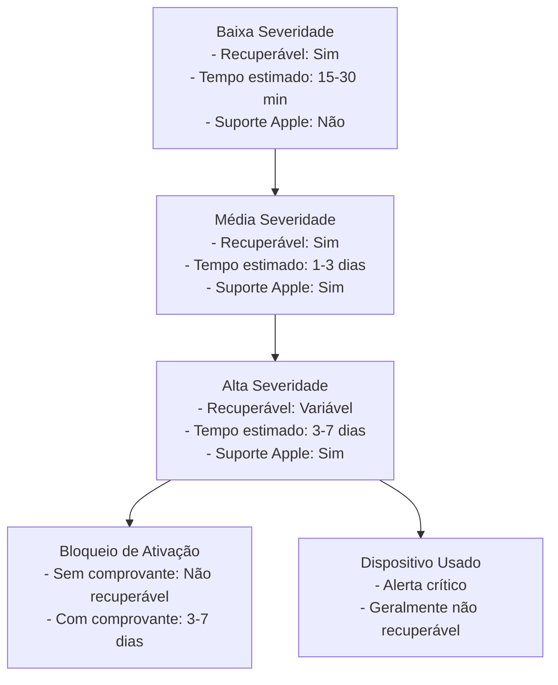
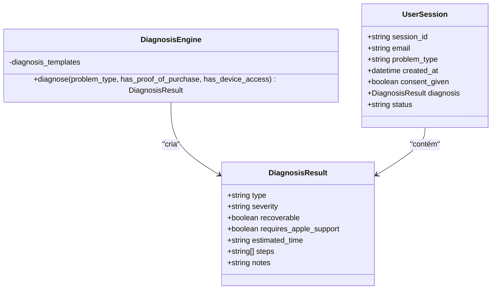
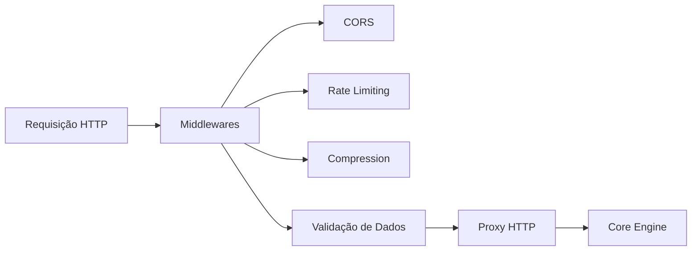
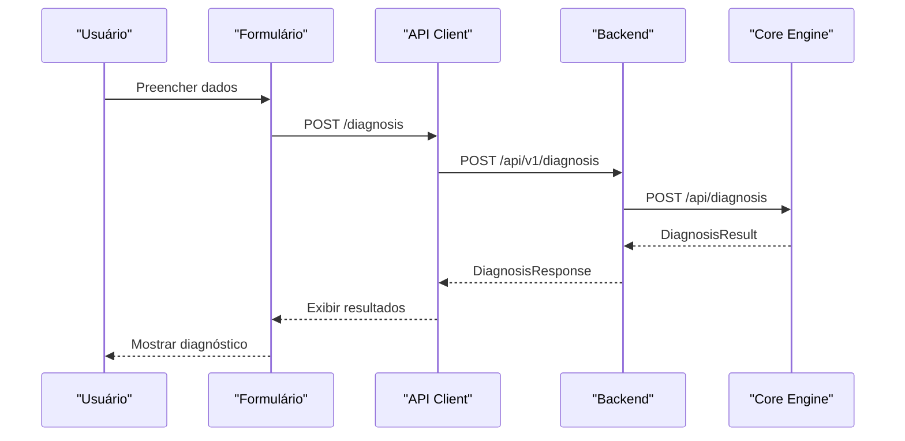

# Integração com Diagnóstico

<cite>
**Arquivos Referenciados nesta Documentação**
- [backend/src/app.js](file://backend/src/app.js)
- [backend/src/routes/diagnosis.js](file://backend/src/routes/diagnosis.js)
- [core-engine/bridge/api.py](file://core-engine/bridge/api.py)
- [core-engine/python/main.py](file://core-engine/python/main.py)
- [frontend/src/services/api.js](file://frontend/src/services/api.js)
- [frontend/src/pages/RecoveryFlow.js](file://frontend/src/pages/RecoveryFlow.js)
- [backend/package.json](file://backend/package.json)
- [core-engine/python/requirements.txt](file://core-engine/python/requirements.txt)
</cite>

## Sumário
- [Introdução](#introdução)
- [Arquitetura Geral](#arquitetura-geral)
- [Endpoints de Diagnóstico](#endpoints-de-diagnóstico)
- [Comunicação HTTP](#comunicação-http)
- [Tratamento de Respostas e Erros](#tratamento-de-respostas-e-erros)
- [Tipos de Diagnóstico e Severidade](#tipos-de-diagnóstico-e-severidade)
- [Formato dos Resultados](#formato-dos-resultados)
- [Proxy Backend](#proxy-backend)
- [Timeouts, Retries e Fallbacks](#timeouts-retries-e-fallbacks)
- [Exemplos de Integração](#exemplos-de-integração)
- [Estratégias de Tratamento de Falhas](#estratégias-de-tratamento-de-falhas)
- [Considerações de Segurança](#considerações-de-segurança)
- [Conclusão](#conclusão)

## Introdução

O sistema de diagnóstico do Apple ID Assistant implementa uma arquitetura de três camadas que permite a análise automatizada de problemas comuns relacionados a contas Apple ID. O backend atua como proxy entre o frontend e o Core Engine Python, fornecendo uma interface unificada para operações de diagnóstico, validação de problemas e obtenção de guias de recuperação.

A integração permite que usuários e técnicos realizem diagnósticos completos de problemas como senhas esquecidas, verificação em duas etapas, bloqueio de ativação, contas bloqueadas e dispositivos usados, com resultados padronizados e formatados para consumo pelo frontend.

## Arquitetura Geral



**Diagrama Fontes**
- [backend/src/app.js:176-184](file://backend/src/app.js#L176-L184)
- [backend/src/routes/diagnosis.js:12](file://backend/src/routes/diagnosis.js#L12)
- [core-engine/bridge/api.py:165-170](file://core-engine/bridge/api.py#L165-L170)

## Endpoints de Diagnóstico

### Endpoints Existentes

O backend expõe três endpoints principais para operações de diagnóstico:

#### 1. Realizar Diagnóstico
- **Método:** POST `/api/v1/diagnosis`
- **Descrição:** Realiza diagnóstico completo de problemas de Apple ID
- **Campos obrigatórios:**
  - `sessionId`: UUID da sessão de usuário
  - `problemType`: Tipo de problema (ver seção abaixo)

#### 2. Obter Guia de Recuperação
- **Método:** GET `/api/v1/diagnosis/guide/:problemType`
- **Descrição:** Retorna guia de recuperação específico para um tipo de problema
- **Parâmetros:** `problemType` (obrigatório)

#### 3. Validar Tipo de Problema
- **Método:** POST `/api/v1/diagnosis/validate`
- **Descrição:** Valida se um tipo de problema é válido
- **Campos:** `problemType` (obrigatório), `email` (opcional)

**Seção Fontes**
- [backend/src/routes/diagnosis.js:15-106](file://backend/src/routes/diagnosis.js#L15-L106)

## Comunicação HTTP

### Backend como Proxy

O backend atua como proxy HTTP entre o frontend e o Core Engine, implementando as seguintes características:

#### Configuração do Proxy
- **URL Base:** `http://localhost:8000` (configurável via `CORE_ENGINE_URL`)
- **Timeout:** 10 segundos (configurável)
- **Headers:** Preservados e propagados
- **Autenticação:** Transparente (não adiciona headers de autenticação)

#### Comunicação Bidirecional


**Diagrama Fontes**
- [backend/src/routes/diagnosis.js:42-68](file://backend/src/routes/diagnosis.js#L42-L68)
- [frontend/src/services/api.js:12](file://frontend/src/services/api.js#L12)

**Seção Fontes**
- [backend/src/routes/diagnosis.js:42-68](file://backend/src/routes/diagnosis.js#L42-L68)
- [frontend/src/services/api.js:12](file://frontend/src/services/api.js#L12)

## Tratamento de Respostas e Erros

### Formato das Respostas

#### Sucesso
```javascript
{
  "success": true,
  "diagnosis": {
    "type": "string",
    "severity": "low|medium|high",
    "recoverable": boolean,
    "requires_apple_support": boolean,
    "estimated_time": "string",
    "steps": ["string"],
    "notes": "string"
  },
  "timestamp": "datetime"
}
```

#### Erro
```javascript
{
  "success": false,
  "error": "mensagem de erro",
  "details": "detalhes técnicos"
}
```

### Tratamento de Erros

#### Backend
- **Validação de Entrada:** Utiliza `express-validator` para validar campos
- **Tratamento de Erros HTTP:** Captura e retorna status codes apropriados
- **Logging:** Registra erros em arquivo de log

#### Core Engine
- **Tipos de Erro:** Validação de parâmetros, sessão inválida, problemas desconhecidos
- **Respostas Padronizadas:** Todos os endpoints retornam formatos consistentes

**Seção Fontes**
- [backend/src/routes/diagnosis.js:27-68](file://backend/src/routes/diagnosis.js#L27-L68)
- [core-engine/bridge/api.py:251-282](file://core-engine/bridge/api.py#L251-L282)

## Tipos de Diagnóstico e Severidade

### Tipos de Problemas Suportados

O sistema suporta cinco tipos principais de diagnóstico:

| Tipo | Descrição | Severidade |
|------|-----------|------------|
| `forgot-password` | Senha esquecida | Baixa |
| `two-factor` | Verificação em 2 etapas | Média |
| `activation-lock` | Bloqueio de ativação | Alta |
| `account-locked` | Conta inacessível | Média |
| `device-used` | Dispositivo usado comprado | Alta |

### Níveis de Severidade



**Diagrama Fontes**
- [core-engine/python/main.py:35-42](file://core-engine/python/main.py#L35-L42)
- [core-engine/python/main.py:45-50](file://core-engine/python/main.py#L45-L50)

**Seção Fontes**
- [core-engine/python/main.py:35-42](file://core-engine/python/main.py#L35-L42)
- [core-engine/python/main.py:45-50](file://core-engine/python/main.py#L45-L50)

## Formato dos Resultados

### Estrutura do Diagnóstico

Cada diagnóstico retorna uma estrutura padronizada:



**Diagrama Fontes**
- [core-engine/python/main.py:52-62](file://core-engine/python/main.py#L52-L62)
- [core-engine/python/main.py:64-74](file://core-engine/python/main.py#L64-L74)

### Passos Recomendados

Cada diagnóstico inclui uma sequência de passos específicos:

#### Senha Esquecida
1. Acessar iforgot.apple.com
2. Verificar identidade via e-mail ou telefone
3. Redefinir senha com nova senha segura
4. Atualizar senha em todos os dispositivos

#### Bloqueio de Ativação
1. Verificar posse do comprovante de compra original
2. Preparar documentação (nota fiscal, IMEI)
3. Solicitar remoção do bloqueio via Apple
4. Aguardar análise e decisão da Apple

**Seção Fontes**
- [core-engine/python/main.py:80-212](file://core-engine/python/main.py#L80-L212)

## Proxy Backend

### Implementação do Proxy

O backend implementa um proxy HTTP transparente que:

#### Características
- **Preservação de Headers:** Todos os headers HTTP são mantidos
- **Timeout Configurável:** 10 segundos padrão
- **Tratamento de Erros:** Converte erros do Core Engine para formato consistente
- **Logging:** Registra todas as requisições e respostas

#### Middleware de Segurança


**Diagrama Fontes**
- [backend/src/app.js:59-96](file://backend/src/app.js#L59-L96)

**Seção Fontes**
- [backend/src/app.js:59-96](file://backend/src/app.js#L59-L96)
- [backend/src/routes/diagnosis.js:42-68](file://backend/src/routes/diagnosis.js#L42-L68)

## Timeouts, Retries e Fallbacks

### Configurações Atuais

#### Frontend
- **Timeout:** 10 segundos
- **Retries:** Não implementado
- **Fallbacks:** Não implementado

#### Backend
- **Timeout:** 10 segundos (configurável)
- **Retries:** Não implementado
- **Fallbacks:** Não implementado

### Recomendações de Melhoria

#### Implementação de Retry
```javascript
// Exemplo de implementação de retry
const retryAxios = async (url, options, retries = 3) => {
  for (let i = 0; i < retries; i++) {
    try {
      return await axios.post(url, options);
    } catch (error) {
      if (i === retries - 1) throw error;
      await new Promise(resolve => setTimeout(resolve, 1000 * Math.pow(2, i)));
    }
  }
};
```

#### Timeout Personalizado
```javascript
// Configuração de timeout personalizado
const diagnosisApi = {
  perform: async (data) => {
    const response = await axios.post('/diagnosis', data, {
      timeout: 30000 // 30 segundos
    });
    return response.data;
  }
};
```

**Seção Fontes**
- [frontend/src/services/api.js:12](file://frontend/src/services/api.js#L12)
- [backend/src/routes/diagnosis.js:42-68](file://backend/src/routes/diagnosis.js#L42-L68)

## Exemplos de Integração

### Frontend - Fluxo de Diagnóstico



**Diagrama Fontes**
- [frontend/src/pages/RecoveryFlow.js:88-106](file://frontend/src/pages/RecoveryFlow.js#L88-L106)
- [frontend/src/services/api.js:62-66](file://frontend/src/services/api.js#L62-L66)

### Backend - Implementação do Proxy

```javascript
// Exemplo de chamada ao Core Engine
try {
  const response = await axios.post(`${CORE_ENGINE_URL}/api/diagnosis`, {
    session_id: sessionId,
    problem_type: problemType,
    has_proof_of_purchase: hasProofOfPurchase,
    has_device_access: hasDeviceAccess
  });
  
  res.json({
    success: true,
    diagnosis: response.data.diagnosis,
    timestamp: response.data.timestamp
  });
} catch (error) {
  const status = error.response?.status || 500;
  const message = error.response?.data?.error || 'Erro ao realizar diagnóstico';
  
  res.status(status).json({
    success: false,
    error: message,
    details: error.message
  });
}
```

**Diagrama Fontes**
- [backend/src/routes/diagnosis.js:42-68](file://backend/src/routes/diagnosis.js#L42-L68)

**Seção Fontes**
- [frontend/src/pages/RecoveryFlow.js:88-106](file://frontend/src/pages/RecoveryFlow.js#L88-L106)
- [backend/src/routes/diagnosis.js:42-68](file://backend/src/routes/diagnosis.js#L42-L68)

## Estratégias de Tratamento de Falhas

### Erros Comuns e Soluções

#### Erros de Validação
- **Causa:** Dados inválidos ou ausentes
- **Solução:** Validar dados no frontend e backend
- **Resposta:** HTTP 400 com lista de erros

#### Erros de Conexão
- **Causa:** Core Engine offline ou timeout
- **Solução:** Implementar retry com backoff exponencial
- **Resposta:** HTTP 503 com mensagem de serviço indisponível

#### Erros de Autenticação
- **Causa:** Token inválido ou expirado
- **Solução:** Redirecionar para login automático
- **Resposta:** HTTP 401 com logout automático

### Implementação de Resiliência

#### Backoff Exponencial
```javascript
const exponentialBackoff = async (fn, maxRetries = 3) => {
  let lastError;
  
  for (let i = 0; i < maxRetries; i++) {
    try {
      return await fn();
    } catch (error) {
      lastError = error;
      if (i < maxRetries - 1) {
        await new Promise(resolve => 
          setTimeout(resolve, Math.pow(2, i) * 1000)
        );
      }
    }
  }
  
  throw lastError;
};
```

#### Circuit Breaker
```javascript
class CircuitBreaker {
  constructor(options = {}) {
    this.failureThreshold = options.failureThreshold || 5;
    this.resetTimeout = options.resetTimeout || 60000;
    this.failureCount = 0;
    this.state = 'CLOSED';
    this.lastFailureTime = null;
  }
  
  async call(fn) {
    if (this.state === 'OPEN') {
      if (Date.now() - this.lastFailureTime > this.resetTimeout) {
        this.state = 'HALF_OPEN';
      } else {
        throw new Error('Serviço temporariamente indisponível');
      }
    }
    
    try {
      const result = await fn();
      this.failureCount = 0;
      this.state = 'CLOSED';
      return result;
    } catch (error) {
      this.failureCount++;
      this.lastFailureTime = Date.now();
      
      if (this.failureCount >= this.failureThreshold) {
        this.state = 'OPEN';
      }
      
      throw error;
    }
  }
}
```

**Seção Fontes**
- [backend/src/routes/diagnosis.js:57-68](file://backend/src/routes/diagnosis.js#L57-L68)
- [frontend/src/services/api.js:30-40](file://frontend/src/services/api.js#L30-L40)

## Considerações de Segurança

### Middlewares de Segurança Implementados

#### Helmet
- **Content Security Policy:** Restringe origens de scripts e estilos
- **HTTP Header Security:** Configurações de segurança padrão

#### CORS
- **Origens Permitidas:** Configurável via variável de ambiente
- **Credentials:** Permitido para autenticação

#### Rate Limiting
- **Limite:** 100 requisições por 15 minutos por IP
- **Proteção:** Proteção contra ataques de força bruta

### Recomendações Adicionais

#### HTTPS
- Implementar HTTPS em produção
- Configurar certificados SSL válidos

#### Token de Acesso
- Adicionar autenticação JWT
- Implementar refresh tokens

#### Logging Seguro
- Evitar logar dados sensíveis
- Criptografar logs de erro

**Seção Fontes**
- [backend/src/app.js:59-96](file://backend/src/app.js#L59-L96)

## Conclusão

A integração com o Core Engine de diagnóstico implementa uma arquitetura robusta e escalável que permite:

- **Padronização:** Todos os diagnósticos seguem o mesmo formato e estrutura
- **Escalabilidade:** Backend proxy facilita a adição de novos recursos
- **Segurança:** Middlewares de segurança protegem a aplicação
- **Resiliência:** Estruturas de tratamento de erros e timeouts
- **Manutenibilidade:** Código modular e bem documentado

A implementação atual fornece uma base sólida para diagnósticos de problemas comuns de Apple ID, com potencial para expansão e melhoria contínua. As recomendações apresentadas podem ser implementadas incrementalmente para aumentar a robustez e experiência do usuário.