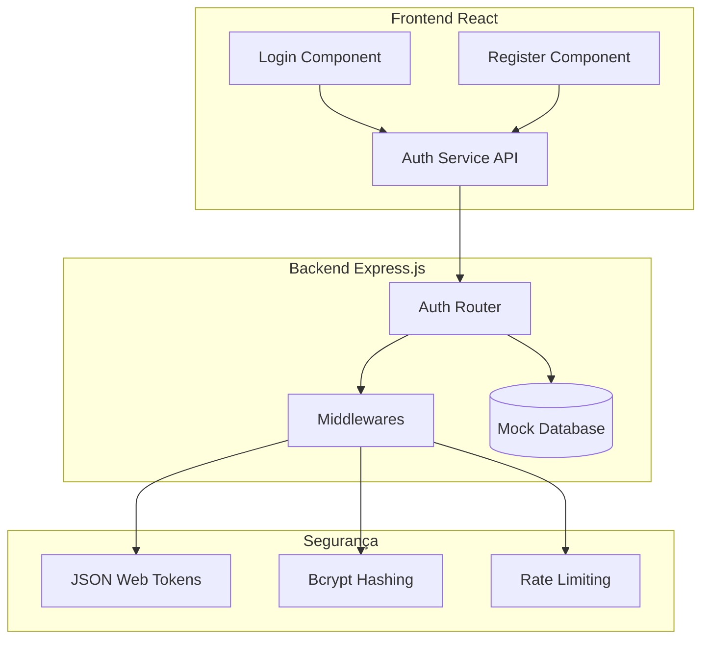
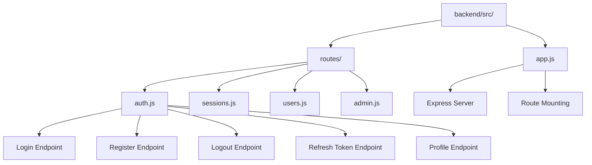
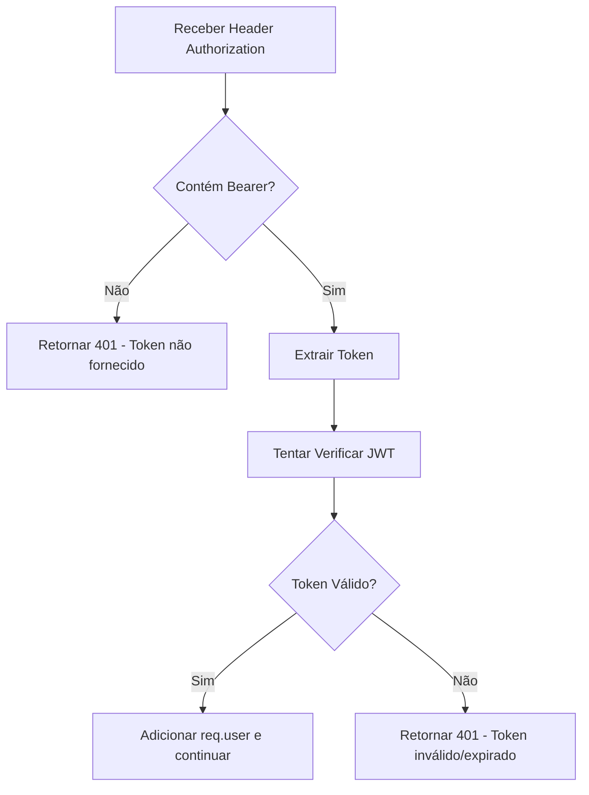
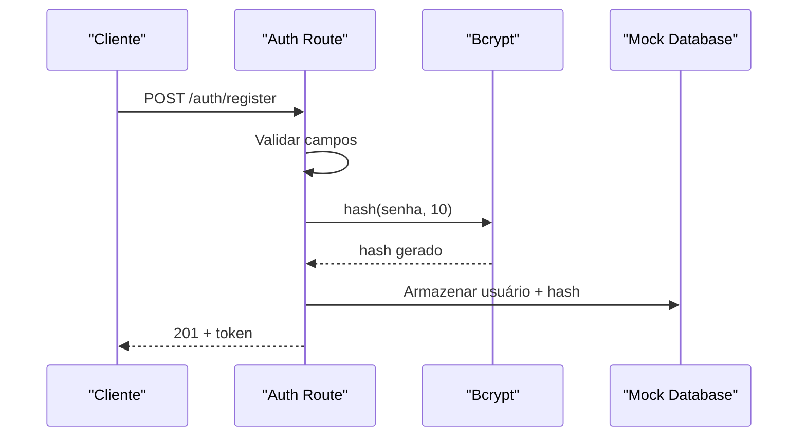
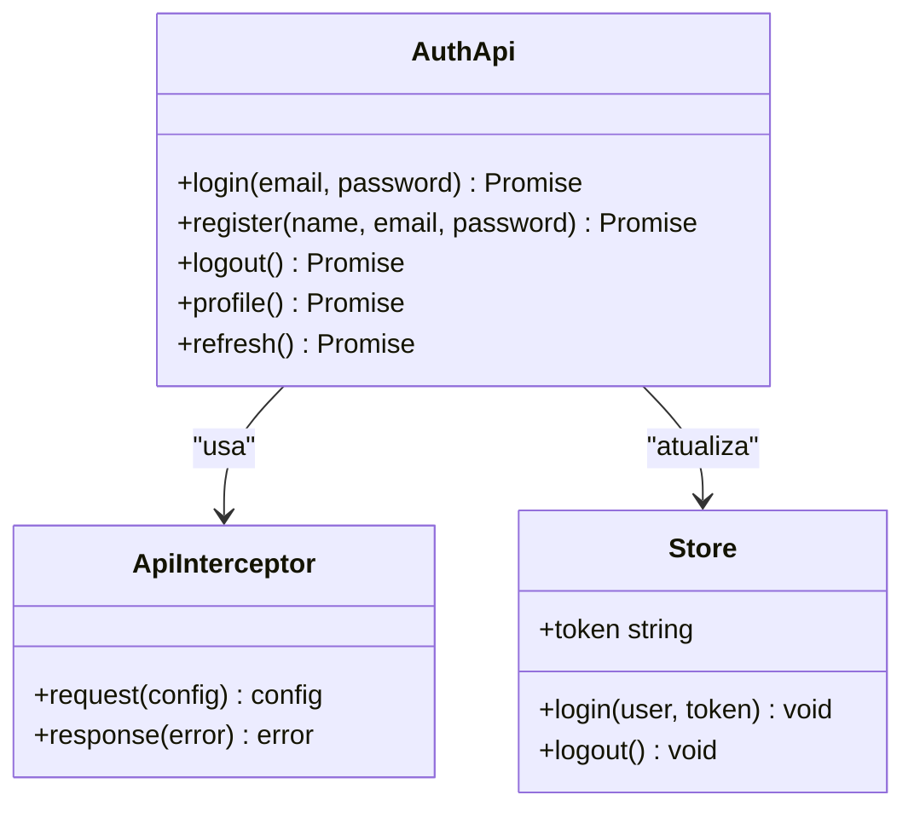

# Rotas de Autenticação

<cite>
**Arquivos Referenciados Neste Documento**
- [auth.js](file://backend/src/routes/auth.js)
- [app.js](file://backend/src/app.js)
- [api.js](file://frontend/src/services/api.js)
- [Login.js](file://frontend/src/pages/Login.js)
- [Register.js](file://frontend/src/pages/Register.js)
- [package.json](file://backend/package.json)
</cite>

## Sumário
- [Introdução](#introdução)
- [Visão Geral do Sistema](#visão-geral-do-sistema)
- [Estrutura de Arquivos](#estrutura-de-arquivos)
- [Endpoints de Autenticação](#endpoints-de-autenticação)
- [Middleware de Autenticação](#middleware-de-autenticação)
- [Segurança e Validações](#segurança-e-validações)
- [Integração Frontend](#integração-frontend)
- [Considerações de Segurança](#considerações-de-segurança)
- [Exemplos Práticos](#exemplos-práticos)
- [Troubleshooting](#troubleshooting)

## Introdução
Este documento fornece documentação completa das rotas de autenticação do sistema Apple ID Assistant. O projeto implementa um backend em Node.js com Express.js que fornece endpoints para gerenciamento de usuários, login, registro, logout, renovação de tokens e verificação de perfil. O frontend React se integra com esses endpoints através de uma interface de serviço padronizada.

## Visão Geral do Sistema
O sistema de autenticação é composto por três camadas principais:



**Diagrama Fontes**
- [auth.js:1-183](file://backend/src/routes/auth.js#L1-L183)
- [app.js:111-116](file://backend/src/app.js#L111-L116)

## Estrutura de Arquivos
O sistema de autenticação é estruturado da seguinte forma:



**Diagrama Fontes**
- [auth.js:1-183](file://backend/src/routes/auth.js#L1-L183)
- [app.js:111-116](file://backend/src/app.js#L111-L116)

**Seção Fontes**
- [auth.js:1-183](file://backend/src/routes/auth.js#L1-L183)
- [app.js:111-116](file://backend/src/app.js#L111-L116)

## Endpoints de Autenticação

### Login (`/api/v1/auth/login`)
**Método HTTP:** POST

**Descrição:** Realiza autenticação de usuários existentes no sistema.

**Solicitação:**
```javascript
{
  "email": "string",
  "password": "string"
}
```

**Resposta bem-sucedida:**
```javascript
{
  "message": "string",
  "user": {
    "id": "string",
    "email": "string",
    "name": "string",
    "role": "string"
  },
  "token": "string"
}
```

**Status Codes:**
- 200: Login realizado com sucesso
- 400: Requisição inválida (campos obrigatórios faltando)
- 401: Credenciais inválidas
- 403: Conta desativada
- 429: Muitas tentativas de login (rate limiting)

**Seção Fontes**
- [auth.js:98-143](file://backend/src/routes/auth.js#L98-L143)

### Registro (`/api/v1/auth/register`)
**Método HTTP:** POST

**Descrição:** Cria um novo usuário no sistema.

**Solicitação:**
```javascript
{
  "name": "string",
  "email": "string",
  "password": "string"
}
```

**Resposta bem-sucedida:**
```javascript
{
  "message": "string",
  "user": {
    "id": "string",
    "email": "string",
    "name": "string",
    "role": "string"
  },
  "token": "string"
}
```

**Status Codes:**
- 201: Usuário registrado com sucesso
- 400: Requisição inválida (campos inválidos)
- 409: E-mail já cadastrado

**Seção Fontes**
- [auth.js:44-95](file://backend/src/routes/auth.js#L44-L95)

### Logout (`/api/v1/auth/logout`)
**Método HTTP:** POST

**Descrição:** Realiza logout do usuário (token ainda não revogado em produção).

**Resposta:**
```javascript
{
  "message": "string"
}
```

**Status Codes:**
- 200: Logout realizado com sucesso
- 401: Token inválido ou expirado

**Seção Fontes**
- [auth.js:161-164](file://backend/src/routes/auth.js#L161-L164)

### Renovação de Token (`/api/v1/auth/refresh`)
**Método HTTP:** POST

**Descrição:** Renova o token JWT expirado.

**Resposta:**
```javascript
{
  "token": "string"
}
```

**Status Codes:**
- 200: Novo token gerado
- 401: Token inválido
- 404: Usuário não encontrado

**Seção Fontes**
- [auth.js:166-180](file://backend/src/routes/auth.js#L166-L180)

### Verificação de Usuário (`/api/v1/auth/profile`)
**Método HTTP:** GET

**Descrição:** Retorna as informações do usuário autenticado.

**Resposta:**
```javascript
{
  "id": "string",
  "email": "string",
  "name": "string",
  "role": "string",
  "createdAt": "string"
}
```

**Status Codes:**
- 200: Informações retornadas com sucesso
- 401: Token inválido ou expirado
- 404: Usuário não encontrado

**Seção Fontes**
- [auth.js:145-159](file://backend/src/routes/auth.js#L145-L159)

## Middleware de Autenticação

### Autenticação JWT
O middleware de autenticação implementa verificação de tokens JWT:



**Diagrama Fontes**
- [auth.js:25-42](file://backend/src/routes/auth.js#L25-L42)

### Rate Limiting
O sistema implementa dois níveis de rate limiting:

1. **Rate Limiting Geral:** 100 requisições por 15 minutos
2. **Rate Limiting Específico para Auth:** 5 tentativas por 15 minutos

**Seção Fontes**
- [auth.js:14-20](file://backend/src/routes/auth.js#L14-L20)
- [app.js:78-88](file://backend/src/app.js#L78-L88)

## Segurança e Validações

### Validações de Entrada
Cada endpoint implementa validações específicas:

**Login:**
- Email válido e normalizado
- Senha obrigatória

**Registro:**
- Email válido e normalizado
- Senha com mínimo de 8 caracteres
- Nome com mínimo de 2 caracteres

**Alteração de Senha:**
- Senha atual obrigatória
- Nova senha com mínimo de 8 caracteres

### Hash de Senhas
O sistema utiliza bcryptjs para hash de senhas:



**Diagrama Fontes**
- [auth.js:62-76](file://backend/src/routes/auth.js#L62-L76)

### Tokens JWT
- Expiração: 24 horas
- Payload contém: userId, email, role
- Secret: variável de ambiente JWT_SECRET

**Seção Fontes**
- [auth.js:78-83](file://backend/src/routes/auth.js#L78-L83)
- [auth.js:126-131](file://backend/src/routes/auth.js#L126-L131)
- [auth.js:173-177](file://backend/src/routes/auth.js#L173-L177)

## Integração Frontend

### Serviço de Autenticação
O frontend implementa um serviço padronizado para todas as operações de autenticação:



**Diagrama Fontes**
- [api.js:43-49](file://frontend/src/services/api.js#L43-L49)
- [api.js:15-27](file://frontend/src/services/api.js#L15-L27)

### Componentes React
Os componentes de login e registro implementam validações locais antes de enviar para o backend:

**Login Component:**
- Validação de email e senha
- Feedback visual de carregamento
- Tratamento de erros

**Register Component:**
- Validação de confirmação de senha
- Indicador de força da senha
- Aceitação de termos

**Seção Fontes**
- [Login.js:19-35](file://frontend/src/pages/Login.js#L19-L35)
- [Register.js:22-53](file://frontend/src/pages/Register.js#L22-L53)

## Considerações de Segurança

### Proteções Implementadas
1. **Rate Limiting:** Prevenção de ataques de força bruta
2. **Validações de Input:** Sanitização e validação rigorosa
3. **Hash de Senhas:** Utilização de bcrypt com custo 10
4. **CORS Configurado:** Restrição de origens permitidas
5. **Helmet:** Configurações de segurança HTTP

### Recomendações para Produção
1. **Revogação de Tokens:** Implementar blacklist de tokens
2. **HTTPS:** Forçar conexões seguras
3. **Secret Keys:** Gerar chaves JWT aleatórias
4. **Logging:** Implementar logging detalhado
5. **Database Real:** Substituir mock por banco de dados real

## Exemplos Práticos

### Exemplo de Login
```javascript
// Frontend
const response = await authApi.login('usuario@example.com', 'senha123');

// Backend response
{
  "message": "Login realizado com sucesso",
  "user": {
    "id": "123456789",
    "email": "usuario@example.com",
    "name": "João Silva",
    "role": "user"
  },
  "token": "eyJhbGciOiJIUzI1NiIsInR5cCI6IkpXVCJ9..."
}
```

### Exemplo de Registro
```javascript
// Frontend
const response = await authApi.register('Maria Santos', 'maria@example.com', 'senha123');

// Backend response
{
  "message": "Usuário registrado com sucesso",
  "user": {
    "id": "987654321",
    "email": "maria@example.com",
    "name": "Maria Santos",
    "role": "user"
  },
  "token": "eyJhbGciOiJIUzI1NiIsInR5cCI6IkpXVCJ9..."
}
```

### Exemplo de Logout
```javascript
// Frontend
await authApi.logout();

// Backend response
{
  "message": "Logout realizado com sucesso"
}
```

## Troubleshooting

### Erros Comuns e Soluções

**400 Bad Request:**
- Verifique se todos os campos obrigatórios estão preenchidos
- Confirme que o formato do email é válido
- Certifique-se de que a senha atende aos requisitos mínimos

**401 Unauthorized:**
- Verifique se o token está sendo enviado corretamente
- Confirme que o token não expirou
- Verifique se o JWT_SECRET está configurado corretamente

**403 Forbidden:**
- Verifique se a conta do usuário está ativa
- Confirme se o usuário tem permissões adequadas

**409 Conflict:**
- Verifique se o email já está cadastrado
- Tente outro endereço de email

**429 Too Many Requests:**
- Aguarde o período de espera
- Reduza a frequência de tentativas
- Verifique se o rate limiting está funcionando corretamente

### Diagnóstico de Problemas

**Verificação de Conexão:**
1. Teste o endpoint `/health` para verificar se o servidor está online
2. Verifique se as rotas estão corretamente montadas
3. Confirme se as dependências estão instaladas

**Depuração de Token:**
1. Verifique o formato do token (Bearer + espaço + token)
2. Confirme se o JWT_SECRET está configurado
3. Teste a decodificação do token

**Seção Fontes**
- [app.js:100-108](file://backend/src/app.js#L100-L108)
- [auth.js:25-42](file://backend/src/routes/auth.js#L25-L42)