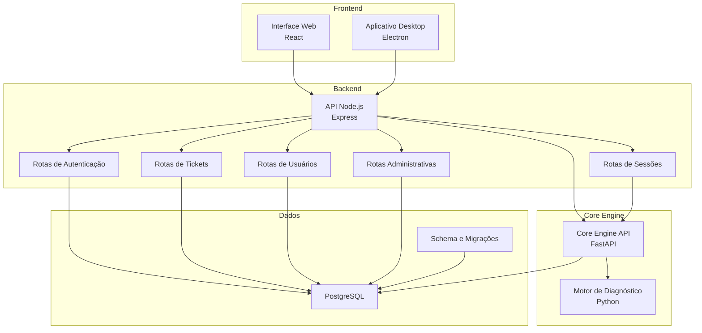
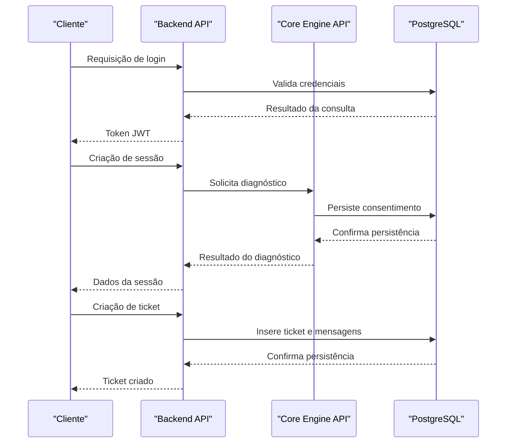
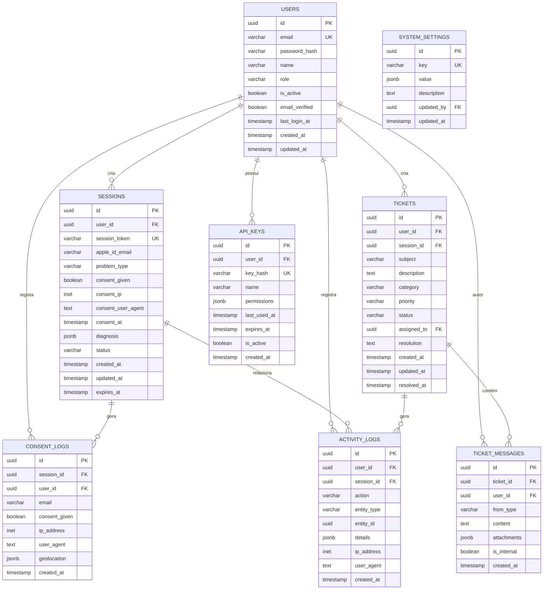
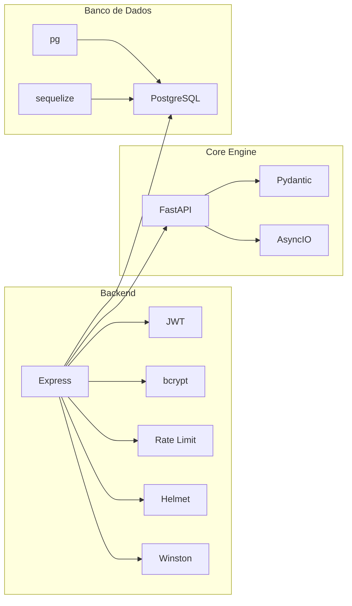
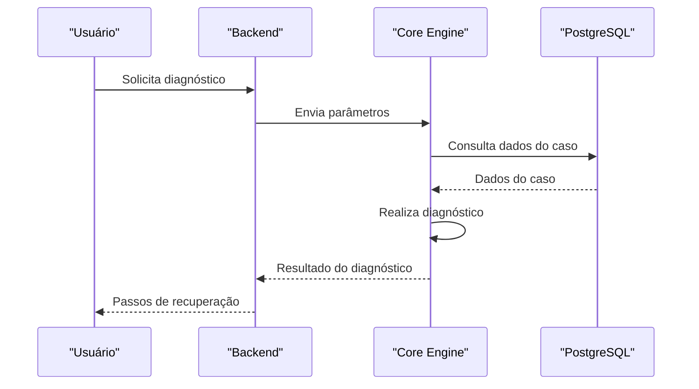
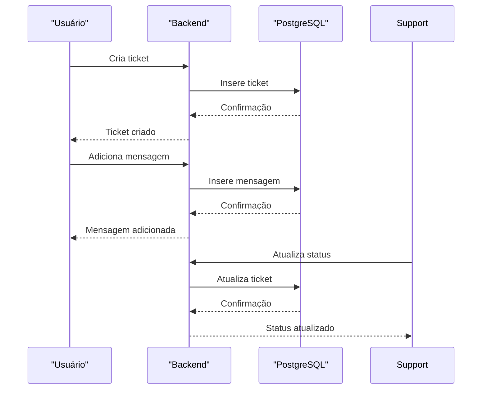

# Banco de Dados PostgreSQL

<cite>
**Arquivos referenciados neste documento**
- [schema.sql](file://database/schema.sql)
- [001_initial_schema.sql](file://database/migrations/001_initial_schema.sql)
- [README.md](file://README.md)
- [app.js](file://backend/src/app.js)
- [auth.js](file://backend/src/routes/auth.js)
- [sessions.js](file://backend/src/routes/sessions.js)
- [tickets.js](file://backend/src/routes/tickets.js)
- [users.js](file://backend/src/routes/users.js)
- [admin.js](file://backend/src/routes/admin.js)
- [package.json](file://backend/package.json)
- [main.py](file://core-engine/python/main.py)
- [api.py](file://core-engine/bridge/api.py)
</cite>

## Sumário
1. [Introdução](#introdução)
2. [Estrutura do Projeto](#estrutura-do-projeto)
3. [Componentes Principais](#componentes-principais)
4. [Visão Geral da Arquitetura](#visão-geral-da-arquitetura)
5. [Análise Detalhada dos Componentes](#análise-detalhada-dos-componentes)
6. [Análise de Dependências](#análise-de-dependências)
7. [Considerações de Desempenho](#considerações-de-desempenho)
8. [Guia de Solução de Problemas](#guia-de-solução-de-problemas)
9. [Conclusão](#conclusão)
10. [Apêndices](#apêndices)

## Introdução
Este documento apresenta uma documentação abrangente do modelo de dados PostgreSQL utilizado no projeto Apple ID Assistant. Ele detalha relacionamentos de entidades, definições de campos e tipos de dados, chaves primárias/estrangeiras, índices e restrições. Também aborda regras de validação de dados e regras de negócio, incluindo diagramas de schema e dados de exemplo. Além disso, são discutidos padrões de acesso a dados, estratégias de cache e considerações de performance, migrações de banco de dados, políticas de ciclo de vida de dados e regras de retenção, bem como segurança de dados, privacidade e controle de acesso.

## Estrutura do Projeto
O projeto segue uma arquitetura de microsserviços com:
- Backend Node.js (Express) expõe a API principal
- Core Engine Python (FastAPI) com motor de diagnóstico e lógica de negócio
- Banco de dados PostgreSQL com schema e migrações
- Frontend React e aplicativo desktop Electron

**Diagrama fonte**
- [app.js:110-116](file://backend/src/app.js#L110-L116)
- [auth.js:1-183](file://backend/src/routes/auth.js#L1-L183)
- [sessions.js:1-249](file://backend/src/routes/sessions.js#L1-L249)
- [tickets.js:1-331](file://backend/src/routes/tickets.js#L1-L331)
- [users.js:1-168](file://backend/src/routes/users.js#L1-L168)
- [admin.js:1-235](file://backend/src/routes/admin.js#L1-L235)
- [api.py:139-304](file://core-engine/bridge/api.py#L139-L304)
- [schema.sql:1-194](file://database/schema.sql#L1-L194)

**Seção fonte**
- [README.md:19-29](file://README.md#L19-L29)
- [app.js:110-116](file://backend/src/app.js#L110-L116)

## Componentes Principais
O modelo de dados é composto pelas seguintes entidades principais:

- **users**: Armazena informações de usuários e administradores
- **sessions**: Registra sessões de recuperação com consentimento e diagnóstico
- **tickets**: Sistema completo de tickets de suporte
- **ticket_messages**: Histórico de mensagens associadas a tickets
- **activity_logs**: Registro de auditoria de ações do usuário
- **consent_logs**: Rastreamento legal de consentimento
- **system_settings**: Configurações do sistema
- **api_keys**: Chaves de acesso para integrações externas

**Seção fonte**
- [schema.sql:8-142](file://database/schema.sql#L8-L142)

## Visão Geral da Arquitetura
O fluxo de dados entre os componentes é ilustrado abaixo:

**Diagrama fonte**
- [auth.js:97-143](file://backend/src/routes/auth.js#L97-L143)
- [sessions.js:39-88](file://backend/src/routes/sessions.js#L39-L88)
- [tickets.js:52-101](file://backend/src/routes/tickets.js#L52-L101)
- [api.py:168-238](file://core-engine/bridge/api.py#L168-L238)

## Análise Detalhada dos Componentes

### Modelo de Dados - Entidades e Relacionamentos

**Diagrama fonte**
- [schema.sql:8-142](file://database/schema.sql#L8-L142)

### Definições de Campos e Tipos de Dados

#### Tabela users
- id: UUID (chave primária, geração automática)
- email: VARCHAR(255) - único e obrigatório
- password_hash: VARCHAR(255) - obrigatório
- name: VARCHAR(255) - obrigatório
- role: VARCHAR(50) - CHECK com valores válidos
- is_active: BOOLEAN - padrão true
- email_verified: BOOLEAN - padrão false
- last_login_at: TIMESTAMP
- created_at/updated_at: TIMESTAMP - padrão CURRENT_TIMESTAMP

#### Tabela sessions
- id: UUID (chave primária)
- user_id: UUID (referência a users.id, ON DELETE SET NULL)
- session_token: VARCHAR(255) - único e obrigatório
- apple_id_email: VARCHAR(255)
- problem_type: CHECK com lista de valores válidos
- consent_given: BOOLEAN - padrão false
- consent_ip: INET
- consent_user_agent: TEXT
- consent_at: TIMESTAMP
- diagnosis: JSONB
- status: CHECK com valores válidos
- created_at/updated_at: TIMESTAMP
- expires_at: TIMESTAMP - padrão CURRENT_TIMESTAMP + 24 horas

#### Tabela tickets
- id: UUID (chave primária)
- user_id: UUID (obrigatório, referência a users.id, ON DELETE CASCADE)
- session_id: UUID (referência a sessions.id, ON DELETE SET NULL)
- subject: VARCHAR(255) - obrigatório
- description: TEXT - obrigatório
- category: CHECK com valores válidos
- priority: CHECK com valores válidos
- status: CHECK com valores válidos
- assigned_to: UUID (referência a users.id, ON DELETE SET NULL)
- resolution: TEXT
- created_at/updated_at/resolved_at: TIMESTAMP

#### Tabela ticket_messages
- id: UUID (chave primária)
- ticket_id: UUID (obrigatório, referência a tickets.id, ON DELETE CASCADE)
- user_id: UUID (referência a users.id, ON DELETE SET NULL)
- from_type: CHECK com valores válidos
- content: TEXT - obrigatório
- attachments: JSONB
- is_internal: BOOLEAN - padrão false
- created_at: TIMESTAMP

#### Tabela activity_logs
- id: UUID (chave primária)
- user_id: UUID (referência a users.id, ON DELETE SET NULL)
- session_id: UUID (referência a sessions.id, ON DELETE SET NULL)
- action: VARCHAR(100) - obrigatório
- entity_type: VARCHAR(50)
- entity_id: UUID
- details: JSONB
- ip_address: INET
- user_agent: TEXT
- created_at: TIMESTAMP

#### Tabela consent_logs
- id: UUID (chave primária)
- session_id: UUID (obrigatório, referência a sessions.id, ON DELETE CASCADE)
- user_id: UUID (referência a users.id, ON DELETE SET NULL)
- email: VARCHAR(255)
- consent_given: BOOLEAN - obrigatório
- ip_address: INET - obrigatório
- user_agent: TEXT
- geolocation: JSONB
- created_at: TIMESTAMP

#### Tabela system_settings
- id: UUID (chave primária)
- key: VARCHAR(100) - único e obrigatório
- value: JSONB - obrigatório
- description: TEXT
- updated_by: UUID (referência a users.id, ON DELETE SET NULL)
- updated_at: TIMESTAMP

#### Tabela api_keys
- id: UUID (chave primária)
- user_id: UUID (obrigatório, referência a users.id, ON DELETE CASCADE)
- key_hash: VARCHAR(255) - único e obrigatório
- name: VARCHAR(255)
- permissions: JSONB - padrão []
- last_used_at: TIMESTAMP
- expires_at: TIMESTAMP
- is_active: BOOLEAN - padrão true
- created_at: TIMESTAMP

**Seção fonte**
- [schema.sql:8-142](file://database/schema.sql#L8-L142)

### Índices e Restrições
Índices criados para otimizar consultas:
- idx_users_email, idx_users_role
- idx_sessions_user_id, idx_sessions_token, idx_sessions_status
- idx_tickets_user_id, idx_tickets_status, idx_tickets_assigned_to
- idx_ticket_messages_ticket_id
- idx_activity_logs_user_id, idx_activity_logs_created_at
- idx_consent_logs_session_id

Restrições CHECK:
- users.role: ('user', 'support', 'admin')
- sessions.problem_type: valores específicos
- sessions.status: valores específicos
- tickets.category: ('password', 'icloud', 'device', 'account', 'other')
- tickets.priority: ('low', 'medium', 'high', 'urgent')
- tickets.status: valores específicos
- ticket_messages.from_type: ('user', 'support', 'system')

Trigger para atualização automática de updated_at:
- update_users_updated_at
- update_sessions_updated_at
- update_tickets_updated_at
- update_system_settings_updated_at

**Seção fonte**
- [schema.sql:144-178](file://database/schema.sql#L144-L178)

### Regras de Validação de Dados e Regras de Negócio
- Validação de entrada nas rotas do backend:
  - Email: formato válido e normalizado
  - Senha: mínimo 8 caracteres
  - Nome: mínimo 2 caracteres
  - Status e prioridade: valores dentro de listas predefinidas
- Controle de acesso:
  - Rotas protegidas por JWT
  - Apenas administradores podem acessar configurações e logs
  - Tickets: acesso restrito ao criador, suporte e administradores
- Fluxo de sessões:
  - Criação de sessão com chamada ao Core Engine
  - Registro de consentimento com captura de IP e agente do usuário
  - Diagnóstico automático baseado no tipo de problema
- Ciclo de vida de tickets:
  - Status iniciais: open
  - Transições permitidas: in_progress, waiting_user, resolved, closed
  - Resolução registrada com timestamps

**Seção fonte**
- [auth.js:44-95](file://backend/src/routes/auth.js#L44-L95)
- [sessions.js:39-88](file://backend/src/routes/sessions.js#L39-L88)
- [tickets.js:52-101](file://backend/src/routes/tickets.js#L52-L101)
- [admin.js:145-173](file://backend/src/routes/admin.js#L145-L173)

### Exemplos de Dados
Exemplos de inserção de dados para cada tabela:

- Inserção de usuário:
  - id: uuid gerado automaticamente
  - email: 'usuario@exemplo.com'
  - password_hash: hash da senha
  - name: 'Nome do Usuário'
  - role: 'user' | 'support' | 'admin'

- Inserção de sessão:
  - user_id: uuid do usuário
  - session_token: 'token_unico'
  - problem_type: um dos valores válidos
  - status: 'created' | 'consent_given' | 'diagnosed' | 'in_recovery' | 'completed' | 'closed'

- Inserção de ticket:
  - user_id: uuid do usuário
  - subject: 'Assunto do ticket'
  - description: 'Descrição detalhada'
  - category: 'password' | 'icloud' | 'device' | 'account' | 'other'
  - priority: 'low' | 'medium' | 'high' | 'urgent'
  - status: 'open' | 'in_progress' | 'waiting_user' | 'resolved' | 'closed'

- Inserção de mensagem de ticket:
  - ticket_id: uuid do ticket
  - user_id: uuid do usuário (opcional)
  - from_type: 'user' | 'support' | 'system'
  - content: 'Texto da mensagem'

- Inserção de log de atividade:
  - user_id: uuid do usuário (opcional)
  - session_id: uuid da sessão (opcional)
  - action: 'login' | 'ticket_created' | 'ticket_updated' | 'consent_given'
  - details: jsonb com informações adicionais

**Seção fonte**
- [schema.sql:180-186](file://database/schema.sql#L180-L186)

### Padrões de Acesso a Dados e Estratégias de Cache
- Acesso ao Core Engine:
  - O backend faz chamadas HTTP para o Core Engine (Python/FastAPI)
  - URLs configuráveis via variáveis de ambiente
- Cache:
  - Redis mencionado como opcional (backend/package.json)
  - Sugestão de uso para sessões e tokens
- Conexão com PostgreSQL:
  - Utiliza bibliotecas Node.js (pg, sequelize) mencionadas no package.json
  - Configuração via DATABASE_URL

**Seção fonte**
- [package.json:23-46](file://backend/package.json#L23-L46)
- [app.js:25-32](file://backend/src/app.js#L25-L32)

### Migrações de Banco de Dados
- Migração inicial (001_initial_schema.sql):
  - Criação das tabelas users e sessions
  - Trigger para atualização automática de updated_at
  - Índices para performance
  - Validação de campos com CHECK
- Schema atual (schema.sql):
  - Adiciona todas as demais tabelas
  - Índices adicionais
  - Triggers para updated_at
  - Valores padrão para campos
  - Comentários nas tabelas

**Seção fonte**
- [001_initial_schema.sql:1-57](file://database/migrations/001_initial_schema.sql#L1-L57)
- [schema.sql:1-194](file://database/schema.sql#L1-L194)

### Políticas de Ciclo de Vida de Dados e Retenção
- Sessões:
  - Expiração automática após 24 horas (expires_at)
  - Status transiciona automaticamente durante o fluxo
- Tickets:
  - Status histórico com timestamps
  - Resolução registrada com resolved_at
- Logs:
  - created_at para auditoria
  - Índices para consultas por período
- Configurações do sistema:
  - system_settings com updated_at
  - updated_by para rastreamento

**Seção fonte**
- [schema.sql:50](file://database/schema.sql#L50)
- [schema.sql:79](file://database/schema.sql#L79)
- [schema.sql:128](file://database/schema.sql#L128)

### Segurança de Dados, Privacidade e Controle de Acesso
- Criptografia:
  - Hash de senhas com bcrypt
  - Tokens JWT para autenticação
- Consentimento legal:
  - Tabela consent_logs registra IP, agente do usuário e geolocalização
  - Formulário de consentimento obrigatório antes do diagnóstico
- Controle de acesso:
  - Middleware de autenticação em todas as rotas
  - Papéis de usuário: user, support, admin
  - Acesso restrito a rotas administrativas
- Proteção de dados:
  - Rate limiting nas rotas
  - Helmet.js para headers de segurança
  - CORS configurado com origens específicas

**Seção fonte**
- [auth.js:25-42](file://backend/src/routes/auth.js#L25-L42)
- [sessions.js:161-207](file://backend/src/routes/sessions.js#L161-L207)
- [admin.js:14-37](file://backend/src/routes/admin.js#L14-L37)
- [app.js:59-88](file://backend/src/app.js#L59-L88)

## Análise de Dependências
As dependências entre componentes são mostradas abaixo:

**Diagrama fonte**
- [package.json:23-46](file://backend/package.json#L23-L46)
- [api.py:16-26](file://core-engine/bridge/api.py#L16-L26)

**Seção fonte**
- [package.json:23-46](file://backend/package.json#L23-L46)

## Considerações de Desempenho
- Índices estratégicos:
  - Índices em campos de busca frequentes (email, status, timestamps)
  - Índices para foreign keys (user_id, session_id, ticket_id)
- Triggers:
  - updated_at automatizados evitam inconsistências
- Cache:
  - Redis opcional para sessões e tokens
  - Sugestão de cache para dados de configuração do sistema
- Escalabilidade:
  - Core Engine separado permite escalar independentemente
  - Banco de dados com índices otimizados

## Guia de Solução de Problemas
- Erros de autenticação:
  - Verificar token JWT e expiração
  - Validar credenciais no banco de dados
- Erros de sessão:
  - Verificar status da sessão e tempo de expiração
  - Confirmar registro de consentimento
- Erros de ticket:
  - Verificar permissões de acesso
  - Validar transições de status
- Erros de banco de dados:
  - Verificar conexão com PostgreSQL
  - Validar índices e triggers

**Seção fonte**
- [auth.js:25-42](file://backend/src/routes/auth.js#L25-L42)
- [sessions.js:90-120](file://backend/src/routes/sessions.js#L90-L120)
- [tickets.js:125-150](file://backend/src/routes/tickets.js#L125-L150)

## Conclusão
O modelo de dados PostgreSQL do Apple ID Assistant foi projetado para suportar um fluxo completo de recuperação de contas Apple, com ênfase em conformidade legal, rastreamento de consentimento e auditoria. As entidades estão bem relacionadas, com índices estratégicos e triggers automáticos. O backend e o Core Engine trabalham em conjunto para fornecer uma experiência robusta e segura, com controles de acesso rigorosos e políticas de retenção de dados claras.

## Apêndices

### Diagrama de Sequência - Fluxo de Diagnóstico

**Diagrama fonte**
- [sessions.js:39-88](file://backend/src/routes/sessions.js#L39-L88)
- [api.py:206-238](file://core-engine/bridge/api.py#L206-L238)

### Diagrama de Sequência - Fluxo de Ticket

**Diagrama fonte**
- [tickets.js:52-101](file://backend/src/routes/tickets.js#L52-L101)
- [tickets.js:152-197](file://backend/src/routes/tickets.js#L152-L197)
- [tickets.js:199-250](file://backend/src/routes/tickets.js#L199-L250)