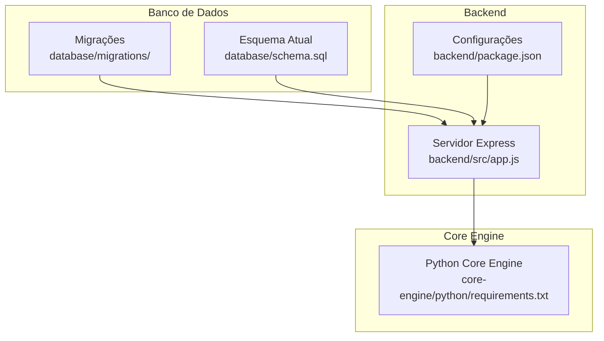
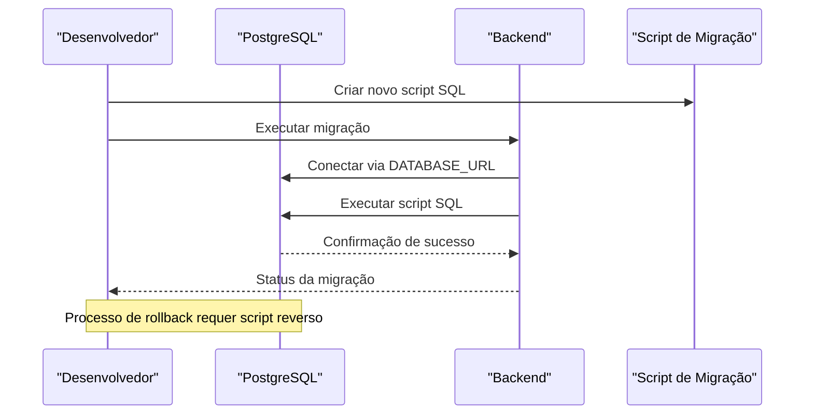
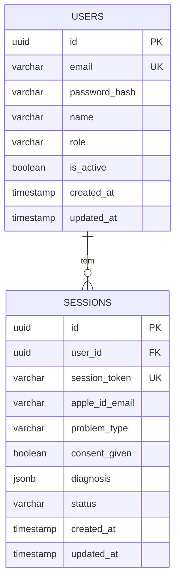
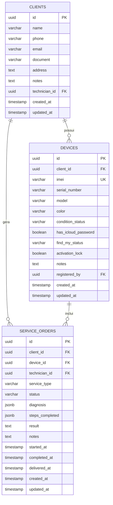
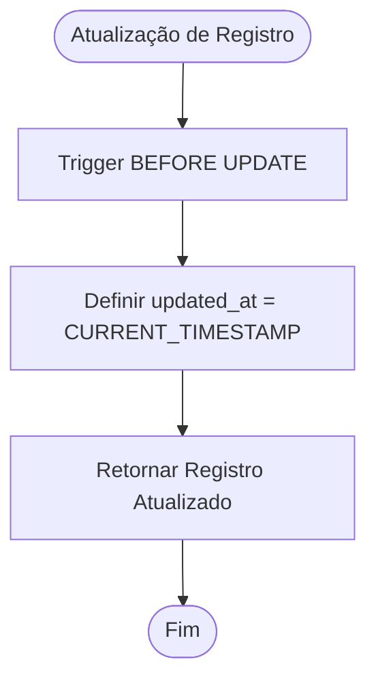
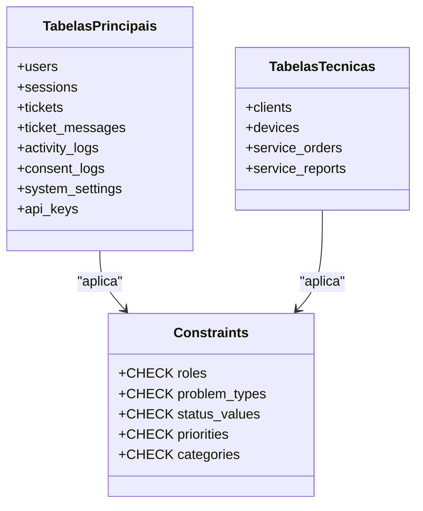
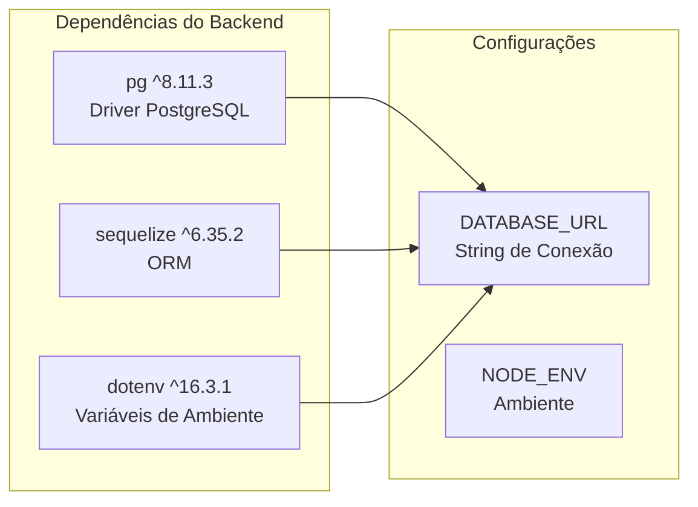
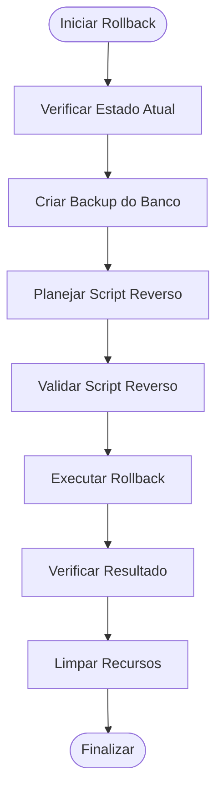

# Migrações de Banco de Dados

<cite>
**Arquivos referenciados neste documento**
- [001_initial_schema.sql](file://database/migrations/001_initial_schema.sql)
- [002_technician_schema.sql](file://database/migrations/002_technician_schema.sql)
- [schema.sql](file://database/schema.sql)
- [app.js](file://backend/src/app.js)
- [package.json](file://backend/package.json)
- [requirements.txt](file://core-engine/python/requirements.txt)
</cite>

## Sumário
1. [Introdução](#introdução)
2. [Estrutura do Projeto](#estrutura-do-projeto)
3. [Componentes Principais](#componentes-principais)
4. [Visão Geral da Arquitetura](#visão-geral-da-arquitetura)
5. [Análise Detalhada dos Componentes](#análise-detalhada-dos-componentes)
6. [Análise de Dependências](#análise-de-dependências)
7. [Considerações de Desempenho](#considerações-de-desempenho)
8. [Guia de Solução de Problemas](#guia-de-solução-de-problemas)
9. [Conclusão](#conclusão)

## Introdução
Este documento apresenta o sistema de migrações do banco de dados do projeto Apple ID Assistant. O sistema utiliza SQL puro para versionamento de esquema e migrações incrementais, com scripts SQL que definem e atualizam o esquema do banco de dados PostgreSQL. O objetivo é fornecer um guia completo para criar, aplicar, reverter e gerenciar migrações de forma segura e evolutiva.

## Estrutura do Projeto
O sistema de migrações está localizado no diretório database/migrations e inclui scripts SQL que representam diferentes versões do esquema do banco de dados. O projeto também contém um arquivo schema.sql que define o esquema completo atual.

**Diagrama fonte**
- [app.js:25-32](file://backend/src/app.js#L25-L32)
- [package.json:23-46](file://backend/package.json#L23-L46)
- [requirements.txt:1-27](file://core-engine/python/requirements.txt#L1-L27)

**Seção fonte**
- [app.js:25-32](file://backend/src/app.js#L25-L32)
- [package.json:23-46](file://backend/package.json#L23-L46)

## Componentes Principais
O sistema de migrações é composto pelos seguintes elementos principais:

### Scripts de Migração
- **001_initial_schema.sql**: Migração inicial que cria a estrutura básica do sistema
- **002_technician_schema.sql**: Migração que adiciona suporte ao modo técnico profissional

### Esquema Atual
- **schema.sql**: Define o esquema completo atual com todas as tabelas, índices e constraints

### Configurações do Backend
- **app.js**: Contém as configurações de conexão com o banco de dados
- **package.json**: Lista as dependências do banco de dados (pg, sequelize)

**Seção fonte**
- [001_initial_schema.sql:1-57](file://database/migrations/001_initial_schema.sql#L1-L57)
- [002_technician_schema.sql:1-135](file://database/migrations/002_technician_schema.sql#L1-L135)
- [schema.sql:1-194](file://database/schema.sql#L1-L194)
- [app.js:25-32](file://backend/src/app.js#L25-L32)
- [package.json:23-46](file://backend/package.json#L23-L46)

## Visão Geral da Arquitetura
O sistema de migrações segue uma abordagem de versionamento incremental onde cada novo script representa uma nova versão do esquema. O backend se conecta ao banco de dados usando a URL de conexão configurada.

**Diagrama fonte**
- [app.js:30](file://backend/src/app.js#L30)
- [001_initial_schema.sql:5-56](file://database/migrations/001_initial_schema.sql#L5-L56)

## Análise Detalhada dos Componentes

### Migração Inicial (001_initial_schema.sql)
Esta migração estabelece a base do sistema com as tabelas principais:

**Diagrama fonte**
- [001_initial_schema.sql:8-31](file://database/migrations/001_initial_schema.sql#L8-L31)

**Seção fonte**
- [001_initial_schema.sql:1-57](file://database/migrations/001_initial_schema.sql#L1-L57)

### Migração Técnica (002_technician_schema.sql)
Esta migração adiciona suporte ao modo técnico profissional com novas entidades:

**Diagrama fonte**
- [002_technician_schema.sql:8-96](file://database/migrations/002_technician_schema.sql#L8-L96)

**Seção fonte**
- [002_technician_schema.sql:1-135](file://database/migrations/002_technician_schema.sql#L1-L135)

### Trigger de Atualização Automática
Ambas as migrações incluem um mecanismo de atualização automática para campos updated_at:

**Diagrama fonte**
- [001_initial_schema.sql:33-49](file://database/migrations/001_initial_schema.sql#L33-L49)
- [002_technician_schema.sql:103-122](file://database/migrations/002_technician_schema.sql#L103-L122)

**Seção fonte**
- [001_initial_schema.sql:33-49](file://database/migrations/001_initial_schema.sql#L33-L49)
- [002_technician_schema.sql:103-122](file://database/migrations/002_technician_schema.sql#L103-L122)

### Esquema Completo Atual
O arquivo schema.sql define o esquema completo com todas as tabelas e constraints:

**Diagrama fonte**
- [schema.sql:8-142](file://database/schema.sql#L8-L142)

**Seção fonte**
- [schema.sql:1-194](file://database/schema.sql#L1-L194)

## Análise de Dependências
O sistema possui dependências específicas para operações de banco de dados:

**Diagrama fonte**
- [package.json:40](file://backend/package.json#L40)
- [package.json:41](file://backend/package.json#L41)
- [package.json:22](file://backend/package.json#L22)
- [app.js:30](file://backend/src/app.js#L30)

**Seção fonte**
- [package.json:23-46](file://backend/package.json#L23-L46)
- [app.js:25-32](file://backend/src/app.js#L25-L32)

## Considerações de Desempenho
O sistema foi projetado com otimizações de desempenho incluindo:

- **Índices estratégicos**: Índices criados para campos de busca frequentes
- **Constraints de validação**: CHECK constraints para garantir integridade dos dados
- **Triggers automáticos**: Atualização automática de timestamps sem sobrecarga adicional
- **UUID como chave primária**: Melhor distribuição e escalabilidade

## Guia de Solução de Problemas

### Aplicando Migrações
Para aplicar migrações no ambiente de desenvolvimento:

1. **Verifique a conexão com o banco de dados**
   - Configure a variável DATABASE_URL no arquivo .env
   - Verifique se o PostgreSQL está em execução

2. **Execute o script de migração**
   - Utilize o cliente psql para executar o script SQL
   - Certifique-se de ter permissões necessárias

3. **Valide a aplicação**
   - Verifique se as tabelas foram criadas corretamente
   - Confirme a existência dos índices e triggers

### Rollback de Migrações
Para reverter alterações, siga estas etapas:

**Diagrama fonte**
- [001_initial_schema.sql:5-56](file://database/migrations/001_initial_schema.sql#L5-L56)
- [002_technician_schema.sql:6-134](file://database/migrations/002_technician_schema.sql#L6-L134)

### Tratamento de Dados Durante Atualizações
Ao atualizar o esquema com dados existentes:

1. **Preserve dados críticos**
   - Realize backup antes de qualquer mudança
   - Teste em ambiente de staging primeiro

2. **Mantenha compatibilidade**
   - Adicione colunas como NOT NULL apenas quando seguro
   - Use valores padrão para novos campos

3. **Validação de dados**
   - Utilize constraints CHECK para validar dados
   - Implemente triggers para processos automáticos

### Boas Práticas para Manutenção Evolutiva

#### Nomenclatura de Migrações
- Use numeração sequencial: 001_, 002_, 003_
- Descreva claramente o propósito em comentários
- Mantenha scripts idempotentes

#### Estratégias de Atualização
- **Migrações Incrementais**: Sempre adicione novas funcionalidades
- **Backward Compatibility**: Mantenha suporte a versões anteriores
- **Rollback Plan**: Planeje sempre como reverter mudanças

#### Gerenciamento de Versões
- **Versionamento Semântico**: Use padrões de versionamento claro
- **Documentação**: Documente todas as mudanças significativas
- **Testes**: Valide migrações em ambientes de teste

**Seção fonte**
- [001_initial_schema.sql:1-57](file://database/migrations/001_initial_schema.sql#L1-L57)
- [002_technician_schema.sql:1-135](file://database/migrations/002_technician_schema.sql#L1-L135)

## Conclusão
O sistema de migrações do Apple ID Assistant oferece uma abordagem sólida e evolutiva para versionamento de esquemas de banco de dados. Com scripts SQL bem estruturados, constraints de validação e triggers automáticos, o sistema permite atualizações incrementais seguras e controladas. As práticas recomendadas incluem manutenção contínua, backups regulares e testes rigorosos para garantir a integridade e disponibilidade do sistema.