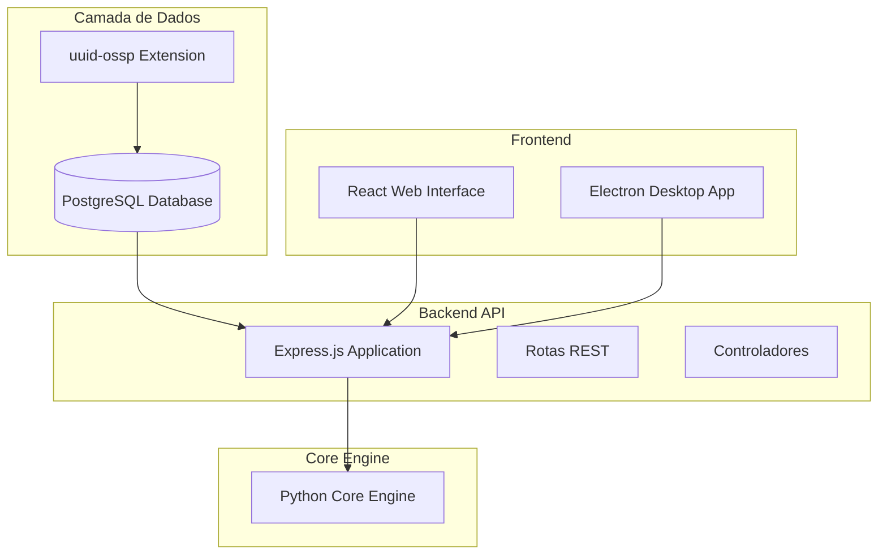
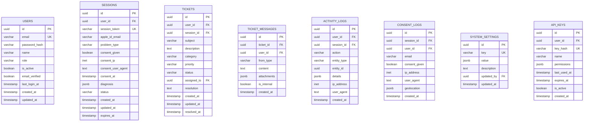
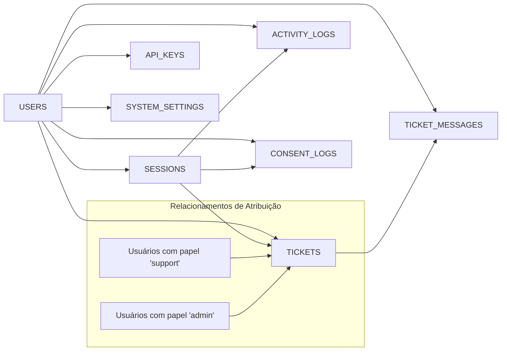
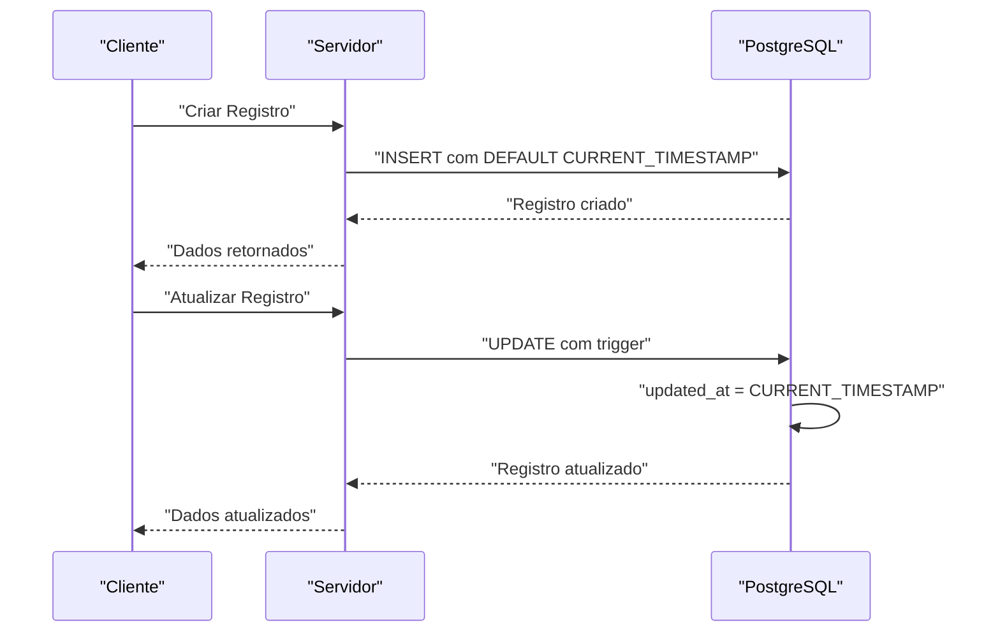
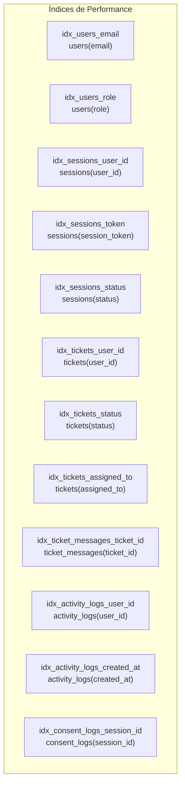
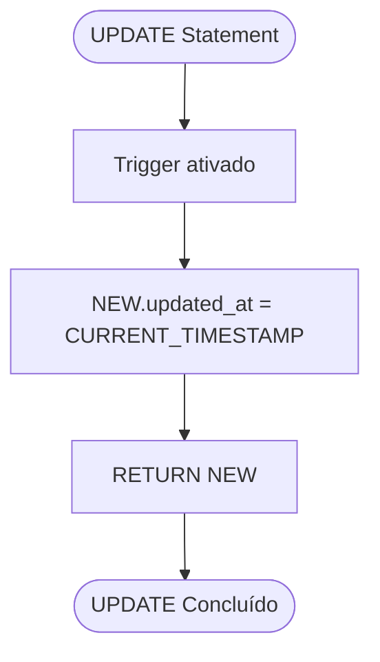
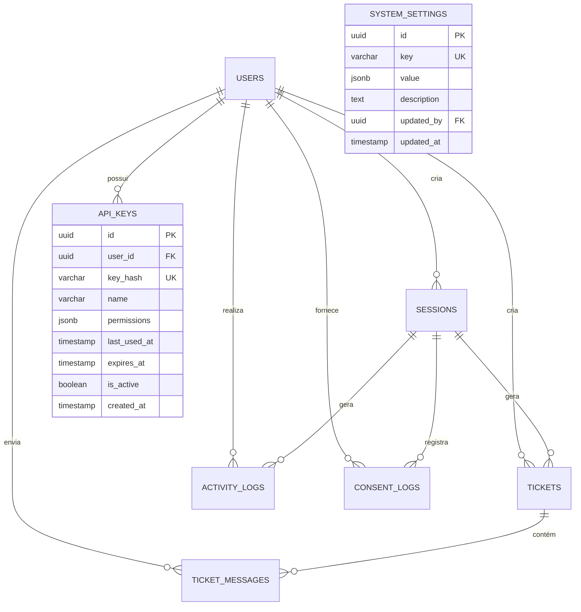
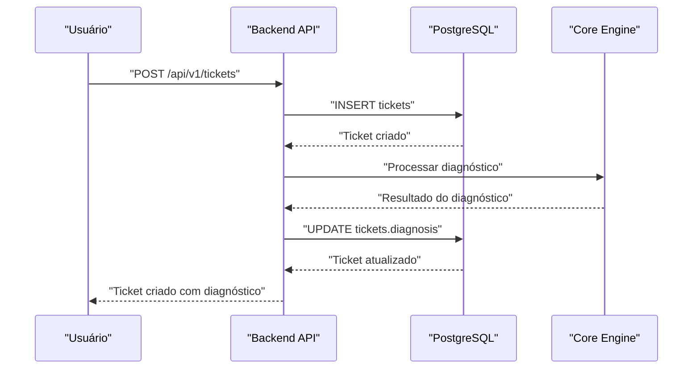

# Schema Completo do Banco de Dados

<cite>
**Arquivos Referenciados Neste Documento**
- [schema.sql](file://database/schema.sql)
- [001_initial_schema.sql](file://database/migrations/001_initial_schema.sql)
- [README.md](file://README.md)
- [app.js](file://backend/src/app.js)
- [package.json](file://backend/package.json)
</cite>

## Sumário
- [Introdução](#introdução)
- [Estrutura Geral do Projeto](#estrutura-geral-do-projeto)
- [Extensões e Configurações Iniciais](#extensões-e-configurações-iniciais)
- [Modelo de Dados Completo](#modelo-de-dados-completo)
- [Relacionamentos e Chaves Estrangeiras](#relacionamentos-e-chaves-estrangeiras)
- [Tipos de Dados e Restrições](#tipos-de-dados-e-restrições)
- [Padrão de Timestamps](#padrão-de-timestamps)
- [Índices e Performance](#índices-e-performance)
- [Triggers de Atualização Automática](#triggers-de-atualização-automática)
- [Configurações Iniciais do Sistema](#configurações-iniciais-do-sistema)
- [Exemplos de Dados de Exemplo](#exemplos-de-dados-de-exemplo)
- [Diagramas de Relacionamento](#diagramas-de-relacionamento)
- [Considerações de Segurança](#considerações-de-segurança)
- [Conclusão](#conclusão)

## Introdução

O Bay-RSET Tool é um sistema profissional de suporte guiado para recuperação de acesso a contas Apple ID, seguindo rigorosamente os processos oficiais da Apple. O schema PostgreSQL foi projetado para suportar um fluxo completo de recuperação de contas, incluindo autenticação de usuários, gerenciamento de sessões de recuperação, sistema de tickets de suporte, logs de atividade e auditoria legal.

O sistema utiliza UUID como identificadores principais, garantindo unicidade global e facilitando integrações distribuídas. Além disso, implementa um padrão consistente de timestamps para rastreamento de atualizações e manutenção de histórico.

## Estrutura Geral do Projeto



**Diagrama Fontes**
- [schema.sql:1-6](file://database/schema.sql#L1-L6)
- [app.js:15-32](file://backend/src/app.js#L15-L32)

**Seção Fontes**
- [README.md:19-29](file://README.md#L19-L29)
- [schema.sql:1-6](file://database/schema.sql#L1-L6)

## Extensões e Configurações Iniciais

### Extensão UUID

O schema requer a extensão `uuid-ossp` para geração automática de UUIDs:

```sql
CREATE EXTENSION IF NOT EXISTS "uuid-ossp";
```

Esta extensão permite o uso das funções:
- `uuid_generate_v4()` - Gera UUIDs aleatórios
- `gen_random_uuid()` - Função alternativa disponível nas migrações

**Seção Fontes**
- [schema.sql:5-6](file://database/schema.sql#L5-L6)
- [001_initial_schema.sql:8](file://database/migrations/001_initial_schema.sql#L8)

### Configurações Iniciais do Sistema

O schema inclui configurações padrão para o funcionamento do sistema:

| Configuração | Valor Padrão | Descrição |
|-------------|--------------|-----------|
| `maintenance_mode` | false | Modo de manutenção do sistema |
| `registration_enabled` | true | Permitir novos registros de usuários |
| `max_sessions_per_user` | 5 | Máximo de sessões ativas por usuário |
| `core_engine_url` | "http://localhost:8000" | URL da API do Core Engine |
| `api_version` | "1.0.0" | Versão atual da API |
| `session_timeout_hours` | 24 | Tempo de expiração das sessões |

**Seção Fontes**
- [schema.sql:179-186](file://database/schema.sql#L179-L186)

## Modelo de Dados Completo

O schema define 7 tabelas principais, cada uma com um papel específico no fluxo de recuperação de contas Apple ID:



**Diagrama Fontes**
- [schema.sql:8-142](file://database/schema.sql#L8-L142)

**Seção Fontes**
- [schema.sql:8-142](file://database/schema.sql#L8-L142)

## Relacionamentos e Chaves Estrangeiras

### Relacionamentos de Tabelas



**Diagrama Fontes**
- [schema.sql:25](file://database/schema.sql#L25)
- [schema.sql:56](file://database/schema.sql#L56)
- [schema.sql:85](file://database/schema.sql#L85)
- [schema.sql:98](file://database/schema.sql#L98)
- [schema.sql:111](file://database/schema.sql#L111)

### Chaves Estrangeiras Detalhadas

| Tabela | Campo | Referência | Ação ON DELETE |
|--------|-------|------------|----------------|
| sessions | user_id | users.id | SET NULL |
| tickets | user_id | users.id | CASCADE |
| tickets | session_id | sessions.id | SET NULL |
| tickets | assigned_to | users.id | SET NULL |
| ticket_messages | ticket_id | tickets.id | CASCADE |
| ticket_messages | user_id | users.id | SET NULL |
| activity_logs | user_id | users.id | SET NULL |
| activity_logs | session_id | sessions.id | SET NULL |
| consent_logs | session_id | sessions.id | CASCADE |
| consent_logs | user_id | users.id | SET NULL |
| system_settings | updated_by | users.id | SET NULL |
| api_keys | user_id | users.id | CASCADE |

**Seção Fontes**
- [schema.sql:25](file://database/schema.sql#L25)
- [schema.sql:56](file://database/schema.sql#L56)
- [schema.sql:75](file://database/schema.sql#L75)
- [schema.sql:85](file://database/schema.sql#L85)
- [schema.sql:98](file://database/schema.sql#L98)
- [schema.sql:111](file://database/schema.sql#L111)
- [schema.sql:134](file://database/schema.sql#L134)
- [schema.sql:127](file://database/schema.sql#L127)

## Tipos de Dados e Restrições

### Tipos de Dados Principais

| Tipo PostgreSQL | Uso Principal | Descrição |
|----------------|---------------|-----------|
| UUID | Identificadores principais | Universally Unique Identifier |
| VARCHAR(n) | Textos limitados | Strings com tamanho máximo |
| TEXT | Textos longos | Descrições e conteúdo livre |
| BOOLEAN | Valores lógicos | Estados e flags |
| TIMESTAMP | Datas e horas | Timestamps de criação/atualização |
| INET | Endereços IP | Registros de IP de origem |
| JSONB | Dados estruturados | Configurações, diagnósticos e logs |

### Restrições de Verificação

#### Campos ENUM com CHECK Constraints

**Users Table - Role Validation:**
```sql
role VARCHAR(50) DEFAULT 'user' CHECK (role IN ('user', 'support', 'admin'))
```

**Sessions Table - Problem Type Validation:**
```sql
problem_type VARCHAR(100) CHECK (problem_type IN (
    'forgot-password',
    'two-factor',
    'activation-lock',
    'account-locked',
    'device-used'
))
```

**Sessions Table - Status Validation:**
```sql
status VARCHAR(50) DEFAULT 'created' CHECK (status IN (
    'created',
    'consent_given',
    'diagnosed',
    'in_recovery',
    'completed',
    'closed'
))
```

**Tickets Table - Category Validation:**
```sql
category VARCHAR(50) NOT NULL CHECK (category IN (
    'password',
    'icloud',
    'device',
    'account',
    'other'
))
```

**Tickets Table - Priority Validation:**
```sql
priority VARCHAR(50) DEFAULT 'medium' CHECK (priority IN ('low', 'medium', 'high', 'urgent'))
```

**Tickets Table - Status Validation:**
```sql
status VARCHAR(50) DEFAULT 'open' CHECK (status IN (
    'open',
    'in_progress',
    'waiting_user',
    'resolved',
    'closed'
))
```

**Ticket Messages Table - From Type Validation:**
```sql
from_type VARCHAR(50) NOT NULL CHECK (from_type IN ('user', 'support', 'system'))
```

**Seção Fontes**
- [schema.sql:14](file://database/schema.sql#L14)
- [schema.sql:28-47](file://database/schema.sql#L28-L47)
- [schema.sql:60-74](file://database/schema.sql#L60-L74)
- [schema.sql:87](file://database/schema.sql#L87)

## Padrão de Timestamps

### Timestamps Consistentes

Todos os modelos seguem um padrão unificado de timestamps:



**Diagrama Fontes**
- [schema.sql:18-19](file://database/schema.sql#L18-L19)
- [schema.sql:48-50](file://database/schema.sql#L48-L50)
- [schema.sql:77-79](file://database/schema.sql#L77-L79)
- [schema.sql:128](file://database/schema.sql#L128)

### Triggers de Atualização Automática

O schema implementa triggers para manter os timestamps de atualização:

```sql
CREATE OR REPLACE FUNCTION update_updated_at_column()
RETURNS TRIGGER AS $$
BEGIN
    NEW.updated_at = CURRENT_TIMESTAMP;
    RETURN NEW;
END;
$$ language 'plpgsql';

CREATE TRIGGER update_users_updated_at BEFORE UPDATE ON users
    FOR EACH ROW EXECUTE FUNCTION update_updated_at_column();

CREATE TRIGGER update_sessions_updated_at BEFORE UPDATE ON sessions
    FOR EACH ROW EXECUTE FUNCTION update_updated_at_column();

CREATE TRIGGER update_tickets_updated_at BEFORE UPDATE ON tickets
    FOR EACH ROW EXECUTE FUNCTION update_updated_at_column();

CREATE TRIGGER update_system_settings_updated_at BEFORE UPDATE ON system_settings
    FOR EACH ROW EXECUTE FUNCTION update_updated_at_column();
```

**Seção Fontes**
- [schema.sql:158-177](file://database/schema.sql#L158-L177)

## Índices e Performance

### Índices Estratégicos



**Diagrama Fontes**
- [schema.sql:144-156](file://database/schema.sql#L144-L156)

### Benefícios dos Índices

| Índice | Benefício | Queries Mais Comuns |
|--------|-----------|-------------------|
| idx_users_email | Busca por email | Login, autenticação |
| idx_users_role | Filtragem por papel | Controle de acesso |
| idx_sessions_user_id | Relacionamento com usuários | Histórico de sessões |
| idx_sessions_token | Busca única de sessão | Acesso seguro |
| idx_sessions_status | Filtragem por status | Dashboard de sessões |
| idx_tickets_user_id | Histórico de tickets | Painel de usuário |
| idx_tickets_status | Análise de desempenho | Relatórios |
| idx_tickets_assigned_to | Atribuição de tickets | Sistema de suporte |
| idx_ticket_messages_ticket_id | Histórico de mensagens | Detalhamento de tickets |
| idx_activity_logs_user_id | Auditoria de usuário | Logs de atividade |
| idx_activity_logs_created_at | Timeline de atividades | Relatórios |

**Seção Fontes**
- [schema.sql:144-156](file://database/schema.sql#L144-L156)

## Triggers de Atualização Automática

### Implementação do Padrão

O trigger `update_updated_at_column()` é aplicado a todas as tabelas principais:



**Diagrama Fontes**
- [schema.sql:159-165](file://database/schema.sql#L159-L165)

### Tabelas com Trigger Ativo

- **users**: Rastrear alterações de perfil e status
- **sessions**: Monitorar atualizações de status e diagnóstico
- **tickets**: Controlar evolução de tickets e resoluções
- **system_settings**: Registrar mudanças de configuração

**Seção Fontes**
- [schema.sql:167-177](file://database/schema.sql#L167-L177)

## Configurações Iniciais do Sistema

### Valores Padrão

O schema popula automaticamente as configurações iniciais:

```sql
INSERT INTO system_settings (key, value, description) VALUES
('maintenance_mode', 'false', 'When true, system is in maintenance mode'),
('registration_enabled', 'true', 'Allow new user registrations'),
('max_sessions_per_user', '5', 'Maximum active sessions per user'),
('core_engine_url', '"http://localhost:8000"', 'Core Engine API URL'),
('api_version', '"1.0.0"', 'Current API version'),
('session_timeout_hours', '24', 'Session expiration time in hours');
```

### Comentários de Tabela

```sql
COMMENT ON TABLE users IS 'System users and administrators';
COMMENT ON TABLE sessions IS 'User recovery sessions';
COMMENT ON TABLE tickets IS 'Support tickets';
COMMENT ON TABLE activity_logs IS 'Audit trail for all user actions';
COMMENT ON TABLE consent_logs IS 'Legal consent tracking for compliance';
```

**Seção Fontes**
- [schema.sql:180-194](file://database/schema.sql#L180-L194)

## Exemplos de Dados de Exemplo

### Exemplo de Usuário

```json
{
  "id": "uuid-gerado-automaticamente",
  "email": "usuario@exemplo.com",
  "password_hash": "$2b$10$hash-da-senha",
  "name": "Nome do Usuário",
  "role": "user",
  "is_active": true,
  "email_verified": false,
  "last_login_at": "2024-01-15T10:30:00Z",
  "created_at": "2024-01-15T10:30:00Z",
  "updated_at": "2024-01-15T10:30:00Z"
}
```

### Exemplo de Sessão

```json
{
  "id": "uuid-gerado-automaticamente",
  "user_id": "uuid-do-usuario",
  "session_token": "token-unico",
  "apple_id_email": "meuappleid@apple.com",
  "problem_type": "forgot-password",
  "consent_given": true,
  "consent_ip": "192.168.1.100",
  "consent_user_agent": "Mozilla/5.0...",
  "consent_at": "2024-01-15T10:35:00Z",
  "diagnosis": {
    "problema": "senha-esquecida",
    "solucao": "fluxo-padrao",
    "tempo-estimado": "15-minutos"
  },
  "status": "consent_given",
  "expires_at": "2024-01-16T10:35:00Z",
  "created_at": "2024-01-15T10:35:00Z",
  "updated_at": "2024-01-15T10:35:00Z"
}
```

### Exemplo de Ticket

```json
{
  "id": "uuid-gerado-automaticamente",
  "user_id": "uuid-do-usuario",
  "session_id": "uuid-da-sessao",
  "subject": "Problema com senha esquecida",
  "description": "Usuário esqueceu sua senha e precisa de ajuda para recuperar",
  "category": "password",
  "priority": "medium",
  "status": "open",
  "assigned_to": null,
  "resolution": null,
  "created_at": "2024-01-15T10:40:00Z",
  "updated_at": "2024-01-15T10:40:00Z"
}
```

## Diagramas de Relacionamento

### Diagrama ER Completo



**Diagrama Fontes**
- [schema.sql:8-142](file://database/schema.sql#L8-L142)

### Sequência de Criação de Ticket



**Diagrama Fontes**
- [schema.sql:54-80](file://database/schema.sql#L54-L80)

## Considerações de Segurança

### Medidas de Segurança Implementadas

1. **Criptografia de Senhas**: Hash de senhas utilizando bcrypt
2. **UUIDs como Identificadores**: Evita ataques de sequenciamento
3. **Logs de Consentimento**: Registro completo para compliance legal
4. **Rate Limiting**: Proteção contra ataques de força bruta
5. **Auditoria Completa**: Todos os acessos e alterações registrados

### Campos de Segurança Específicos

- **password_hash**: Armazena senhas criptografadas
- **key_hash**: Armazena hashes de chaves API
- **consent_ip**: Registra endereço IP de consentimento
- **user_agent**: Rastreia dispositivos e navegadores
- **geolocation**: Informações geográficas de consentimento

**Seção Fontes**
- [schema.sql:12](file://database/schema.sql#L12)
- [schema.sql:135](file://database/schema.sql#L135)
- [schema.sql:36](file://database/schema.sql#L36)
- [schema.sql:115](file://database/schema.sql#L115)

## Conclusão

O schema PostgreSQL do Bay-RSET Tool representa um modelo de dados robusto e bem estruturado para sistemas de suporte técnico especializados. As principais características que tornam este schema eficiente incluem:

- **Padrão de Identificadores**: UUIDs garantem unicidade global e facilitam integrações
- **Modelo de Dados Coerente**: Todos os modelos seguem o mesmo padrão de timestamps
- **Controles de Acesso**: Validações de ENUM e chaves estrangeiras rígidas
- **Auditoria Completa**: Logs detalhados para compliance e análise
- **Performance Otimizada**: Índices estratégicos para consultas comuns
- **Segurança Forte**: Medidas de proteção adequadas para sistemas críticos

O schema está preparado para escalar e pode ser facilmente integrado com o backend Node.js e o Core Engine Python mencionados no projeto. A estrutura modular permite fácil manutenção e expansão funcional.