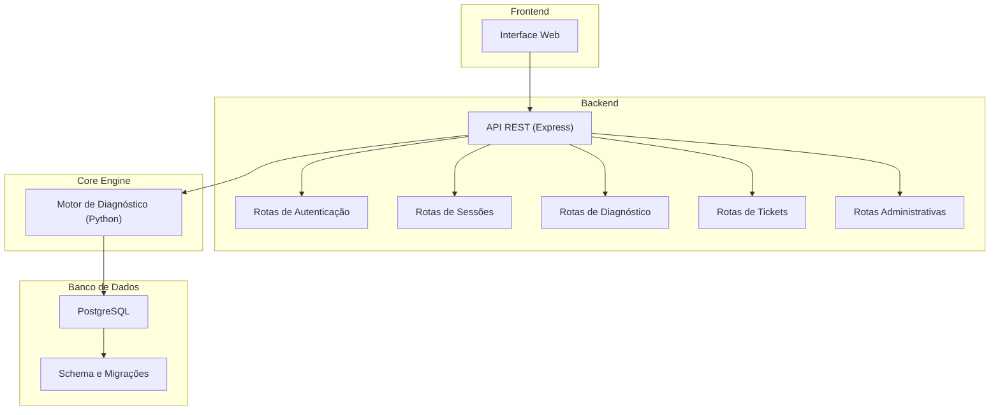
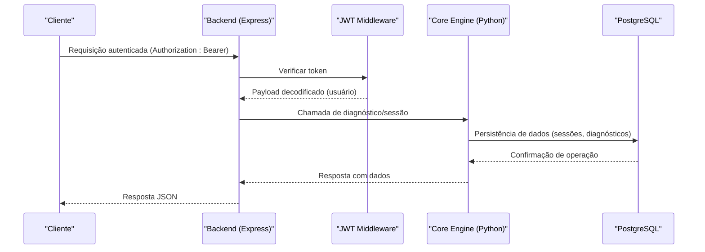
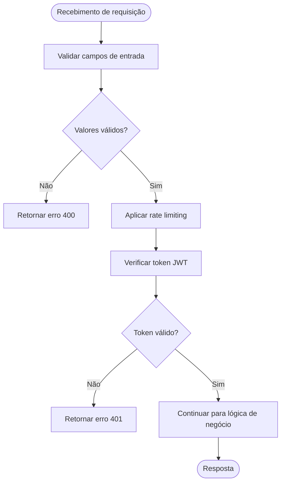
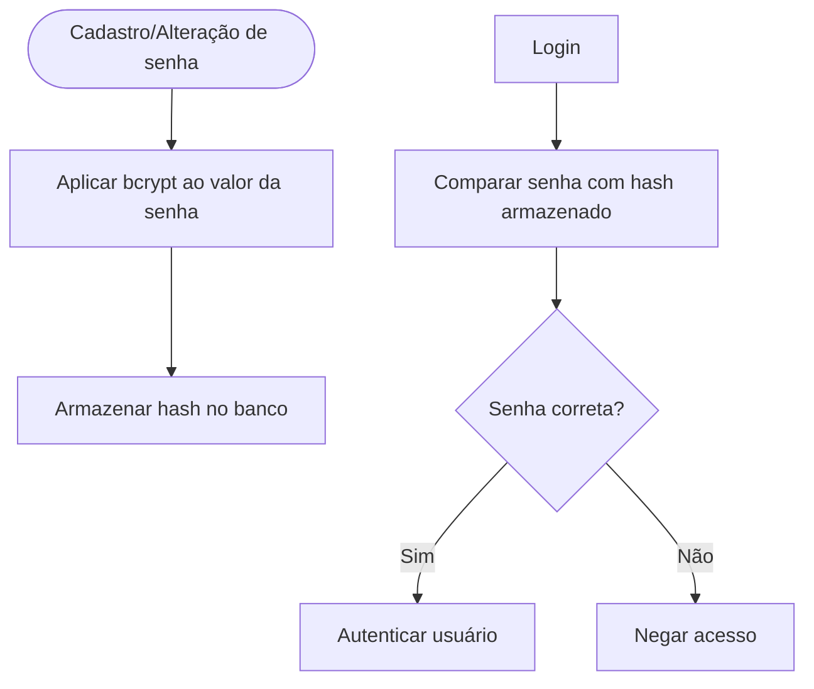
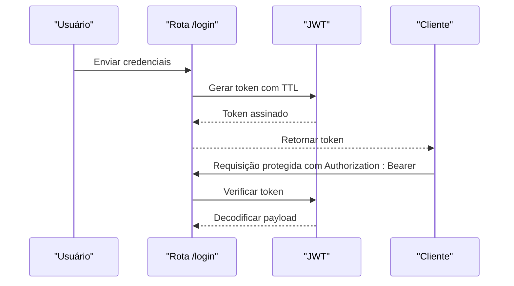
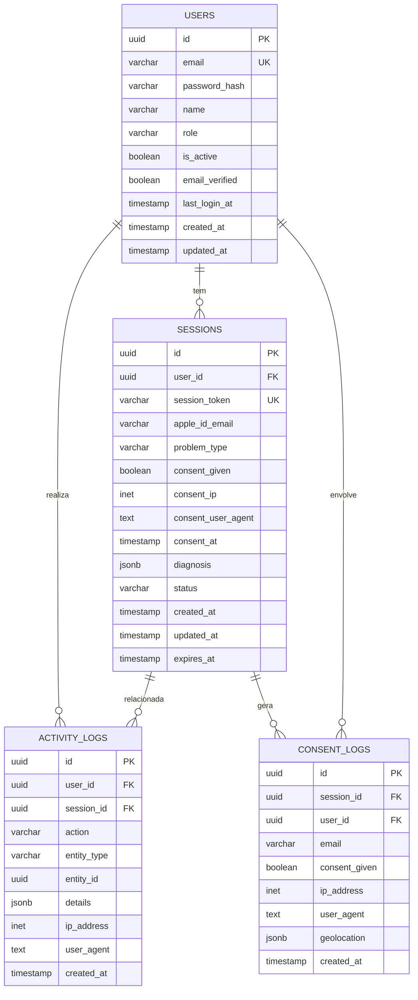
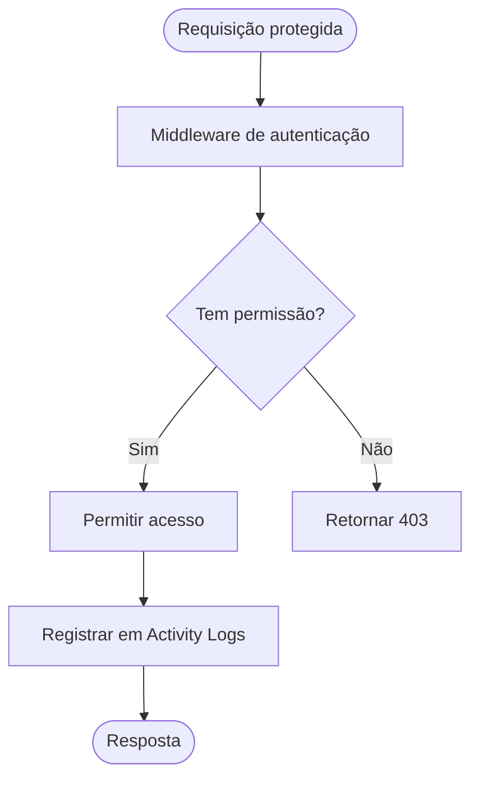
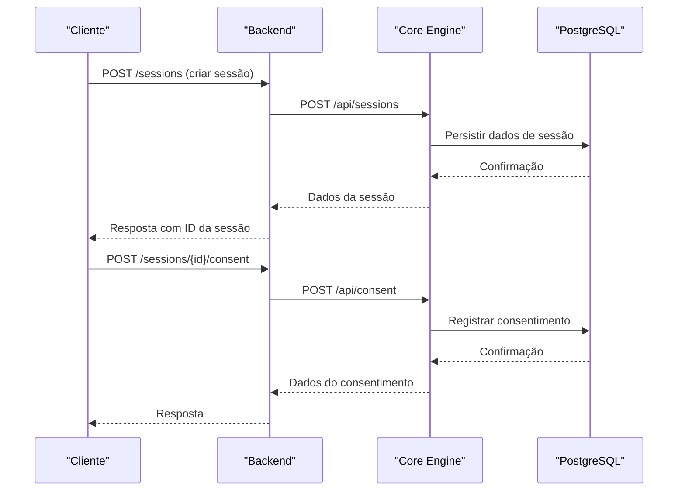
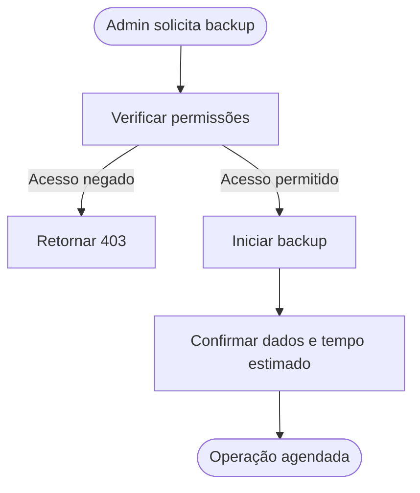
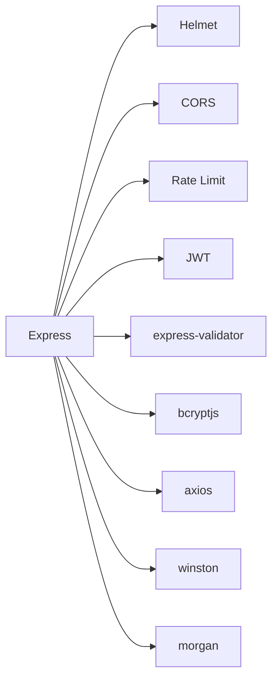

# Segurança e Conformidade

<cite>
**Arquivos referenciados neste documento**
- [schema.sql](file://database/schema.sql)
- [001_initial_schema.sql](file://database/migrations/001_initial_schema.sql)
- [app.js](file://backend/src/app.js)
- [auth.js](file://backend/src/routes/auth.js)
- [sessions.js](file://backend/src/routes/sessions.js)
- [diagnosis.js](file://backend/src/routes/diagnosis.js)
- [tickets.js](file://backend/src/routes/tickets.js)
- [admin.js](file://backend/src/routes/admin.js)
- [main.py](file://core-engine/python/main.py)
- [package.json](file://backend/package.json)
- [README.md](file://README.md)
</cite>

## Sumário
1. [Introdução](#introdução)
2. [Estrutura do Projeto](#estrutura-do-projeto)
3. [Componentes-Chave](#componentes-chave)
4. [Visão Geral da Arquitetura](#visão-geral-da-arquitetura)
5. [Análise Detalhada dos Componentes](#análise-detalhada-dos-componentes)
6. [Análise de Dependências](#análise-de-dependências)
7. [Considerações de Desempenho](#considerações-de-desempenho)
8. [Guia de Solução de Problemas](#guia-de-solução-de-problemas)
9. [Conclusão](#conclusão)
10. [Apêndices](#apêndices)

## Introdução
Este documento apresenta uma visão abrangente sobre segurança de dados e conformidade no contexto do banco de dados PostgreSQL utilizado pelo projeto. Ele documenta proteções contra injeção de SQL, tratamento seguro de senhas com hash bcrypt, armazenamento seguro de tokens, e registros de consentimento legal. Além disso, explora políticas de acesso, auditoria de atividades por meio de Activity Logs e Consent Logs, e práticas recomendadas para conformidade com regulamentações de proteção de dados. Também inclui orientações práticas para backup, criptografia e monitoramento de acesso.

## Estrutura do Projeto
O sistema é composto por três camadas principais:
- Backend (Node.js + Express): fornece a API REST, middleware de segurança, roteamento e integração com o Core Engine.
- Core Engine (Python): motor de diagnóstico e gestão de sessões, com persistência de dados em memória durante testes.
- Banco de Dados (PostgreSQL): armazena usuários, sessões, tickets, logs de atividade e consentimento, além de configurações do sistema.

**Diagrama fonte**
- [app.js:110-122](file://backend/src/app.js#L110-L122)
- [auth.js:1-183](file://backend/src/routes/auth.js#L1-L183)
- [sessions.js:1-249](file://backend/src/routes/sessions.js#L1-L249)
- [diagnosis.js:1-173](file://backend/src/routes/diagnosis.js#L1-L173)
- [tickets.js:1-331](file://backend/src/routes/tickets.js#L1-L331)
- [admin.js:175-234](file://backend/src/routes/admin.js#L175-L234)
- [schema.sql:1-194](file://database/schema.sql#L1-L194)
- [001_initial_schema.sql:1-57](file://database/migrations/001_initial_schema.sql#L1-L57)

**Seção fonte**
- [README.md:19-29](file://README.md#L19-L29)

## Componentes-Chave
- Autenticação e autorização: JWT com middleware de verificação e rate limiting.
- Proteção contra SQL injection: uso de parâmetros parametrizados e validações robustas nas rotas.
- Tratamento seguro de senhas: bcrypt para hashing e comparação.
- Armazenamento seguro de tokens: geração de tokens com expiração configurável.
- Logs de atividade e consentimento: tabelas dedicated para auditoria e conformidade legal.
- Políticas de acesso: verificações de função (admin, support) e permissões baseadas em sessão.
- Backup e restauração: endpoints administrativos para operações de backup e restauração.

**Seção fonte**
- [auth.js:25-42](file://backend/src/routes/auth.js#L25-L42)
- [auth.js:98-143](file://backend/src/routes/auth.js#L98-L143)
- [app.js:59-96](file://backend/src/app.js#L59-L96)
- [schema.sql:94-119](file://database/schema.sql#L94-L119)
- [admin.js:208-232](file://backend/src/routes/admin.js#L208-L232)

## Visão Geral da Arquitetura
A comunicação entre as camadas segue um fluxo padronizado:
- O frontend interage com o backend via HTTPS com headers de segurança.
- O backend aplica rate limiting global e específico para autenticação.
- As rotas validam entradas, aplicam regras de negócio e chamam o Core Engine quando necessário.
- O Core Engine processa diagnósticos e atualiza estados de sessão.
- O banco de dados armazena dados sensíveis com índices e gatilhos para auditoria.

**Diagrama fonte**
- [app.js:59-96](file://backend/src/app.js#L59-L96)
- [auth.js:25-42](file://backend/src/routes/auth.js#L25-L42)
- [sessions.js:56-87](file://backend/src/routes/sessions.js#L56-L87)
- [diagnosis.js:42-68](file://backend/src/routes/diagnosis.js#L42-L68)
- [schema.sql:22-51](file://database/schema.sql#L22-L51)

## Análise Detalhada dos Componentes

### Autenticação e Proteção Contra SQL Injection
- Validação de entrada: express-validator é utilizado para validar campos de email, senha e outros parâmetros.
- Rate limiting: limitadores específicos para rotas críticas (ex: autenticação) evitam tentativas excessivas.
- Token JWT: middleware de autenticação extrai e valida o token Bearer, garantindo acesso somente após verificação.
- SQL Injection: embora o backend utilize um mock de armazenamento em memória, o schema do banco demonstra uso de tipos adequados e JSONB para dados estruturados, minimizando riscos de injeção.

**Diagrama fonte**
- [auth.js:98-143](file://backend/src/routes/auth.js#L98-L143)
- [auth.js:14-20](file://backend/src/routes/auth.js#L14-L20)
- [app.js:78-88](file://backend/src/app.js#L78-L88)

**Seção fonte**
- [auth.js:98-143](file://backend/src/routes/auth.js#L98-L143)
- [auth.js:14-20](file://backend/src/routes/auth.js#L14-L20)
- [app.js:78-88](file://backend/src/app.js#L78-L88)

### Tratamento Seguro de Senhas com bcrypt
- Hash de senhas: ao registrar ou alterar senha, o backend aplica bcrypt com custo padrão, tornando a verificação lenta e resistente a ataques de força bruta.
- Comparação de senhas: durante login, a senha fornecida é comparada com o hash armazenado.

**Diagrama fonte**
- [auth.js:62-63](file://backend/src/routes/auth.js#L62-L63)
- [auth.js:115-116](file://backend/src/routes/auth.js#L115-L116)
- [users.js:107-114](file://backend/src/routes/users.js#L107-L114)

**Seção fonte**
- [auth.js:62-63](file://backend/src/routes/auth.js#L62-L63)
- [auth.js:115-116](file://backend/src/routes/auth.js#L115-L116)
- [users.js:107-114](file://backend/src/routes/users.js#L107-L114)

### Armazenamento Seguro de Tokens
- Geração de tokens: após autenticação bem-sucedida, o backend gera um JWT com payload contendo identidade do usuário e função.
- Expiração: o token possui TTL configurável, reduzindo o tempo de exposição em caso de roubo.
- Logout: o backend permite logout, embora seja necessário implementar blacklist em produção para invalidar tokens imediatamente.

**Diagrama fonte**
- [auth.js:126-131](file://backend/src/routes/auth.js#L126-L131)
- [auth.js:167-179](file://backend/src/routes/auth.js#L167-L179)

**Seção fonte**
- [auth.js:126-131](file://backend/src/routes/auth.js#L126-L131)
- [auth.js:167-179](file://backend/src/routes/auth.js#L167-L179)

### Logs de Atividade e Consentimento Legal
- Activity Logs: registra ações de usuários, entidades envolvidas, IPs e agentes do usuário, útil para auditoria.
- Consent Logs: armazena consentimentos com IP, UA, e geolocalização, essencial para conformidade legal.
- Índices e gatilhos: índices otimizam consultas e gatilhos mantêm campos de atualização automática.

**Diagrama fonte**
- [schema.sql:8-51](file://database/schema.sql#L8-L51)
- [schema.sql:94-119](file://database/schema.sql#L94-L119)

**Seção fonte**
- [schema.sql:94-119](file://database/schema.sql#L94-L119)

### Políticas de Acesso e Auditoria
- Controles de acesso: rotas protegidas exigem autenticação; algumas rotas exigem funções específicas (admin, support).
- Auditoria: Activity Logs e Consent Logs permitem rastrear ações e consentimentos, com timestamps e metadados.

**Diagrama fonte**
- [sessions.js:20-37](file://backend/src/routes/sessions.js#L20-L37)
- [tickets.js:141-144](file://backend/src/routes/tickets.js#L141-L144)
- [schema.sql:94-106](file://database/schema.sql#L94-L106)

**Seção fonte**
- [sessions.js:20-37](file://backend/src/routes/sessions.js#L20-L37)
- [tickets.js:141-144](file://backend/src/routes/tickets.js#L141-L144)
- [schema.sql:94-106](file://database/schema.sql#L94-L106)

### Diagnóstico e Fluxos de Consentimento
- Diagnóstico: o backend chama o Core Engine para análise de problemas, atualizando o status da sessão com base nos resultados.
- Consentimento: o fluxo de consentimento registra dados de IP, UA e geolocalização, atualizando o status da sessão.

**Diagrama fonte**
- [sessions.js:39-88](file://backend/src/routes/sessions.js#L39-L88)
- [sessions.js:161-207](file://backend/src/routes/sessions.js#L161-L207)
- [diagnosis.js:14-69](file://backend/src/routes/diagnosis.js#L14-L69)
- [main.py:272-353](file://core-engine/python/main.py#L272-L353)

**Seção fonte**
- [sessions.js:39-88](file://backend/src/routes/sessions.js#L39-L88)
- [sessions.js:161-207](file://backend/src/routes/sessions.js#L161-L207)
- [diagnosis.js:14-69](file://backend/src/routes/diagnosis.js#L14-L69)
- [main.py:272-353](file://core-engine/python/main.py#L272-L353)

### Backup, Criptografia e Monitoramento de Acesso
- Backup e restauração: endpoints administrativos permitem iniciar operações de backup e restauração com avisos de impacto.
- Criptografia: senhas são armazenadas como hashes; tokens são assinados com JWT.
- Monitoramento: logs estruturados e estatísticas do Core Engine ajudam a monitorar o sistema.

**Diagrama fonte**
- [admin.js:208-232](file://backend/src/routes/admin.js#L208-L232)

**Seção fonte**
- [admin.js:208-232](file://backend/src/routes/admin.js#L208-L232)

## Análise de Dependências
- Dependências de segurança: helmet, cors, rate-limit, bcryptjs, jsonwebtoken, express-validator.
- Conexão com banco de dados: pg e sequelize estão disponíveis, embora o backend atualmente utilize um mock de armazenamento em memória.
- Comunicação com Core Engine: axios é usado para chamadas HTTP ao motor Python.

**Diagrama fonte**
- [app.js:59-96](file://backend/src/app.js#L59-L96)
- [package.json:23-46](file://backend/package.json#L23-L46)

**Seção fonte**
- [package.json:23-46](file://backend/package.json#L23-L46)
- [app.js:59-96](file://backend/src/app.js#L59-L96)

## Considerações de Desempenho
- Índices estratégicos: índices em emails, tokens de sessão, status e datas ajudam a otimizar consultas.
- Gatilhos de atualização: triggers mantêm campos updated_at automaticamente, evitando sobrecarga manual.
- Compressão e logging: compressão de respostas e logging estruturado contribuem para eficiência operacional.

**Seção fonte**
- [schema.sql:144-178](file://database/schema.sql#L144-L178)

## Guia de Solução de Problemas
- Erros de autenticação: verifique o header Authorization, token expirado ou inválido.
- Validação de entrada: erros 400 indicam campos inválidos; revise os critérios de validação.
- Logs de erro: utilize os logs estruturados e o logger Winston para investigar falhas.
- Consentimento e sessão: confirme que o Core Engine responde e que os dados de IP/UA estão sendo registrados.

**Seção fonte**
- [auth.js:25-42](file://backend/src/routes/auth.js#L25-L42)
- [app.js:157-172](file://backend/src/app.js#L157-L172)
- [sessions.js:161-207](file://backend/src/routes/sessions.js#L161-L207)

## Conclusão
O projeto implementa boas práticas de segurança e conformidade, com foco em proteção de dados sensíveis, auditoria abrangente e políticas de acesso rigorosas. Embora o backend atualmente utilize armazenamento em memória, o schema do PostgreSQL está preparado para persistência segura, com estruturas dedicadas para logs de atividade e consentimento. Recomenda-se avançar para uma implementação real com PostgreSQL e Redis, além de adotar práticas como blacklist de tokens, criptografia em repouso, backups regulares e revisões periódicas de conformidade.

## Apêndices
- Recursos adicionais: o README destaca a arquitetura e tecnologias utilizadas, incluindo PostgreSQL e Redis.

**Seção fonte**
- [README.md:81-88](file://README.md#L81-L88)
- [README.md:89-96](file://README.md#L89-L96)