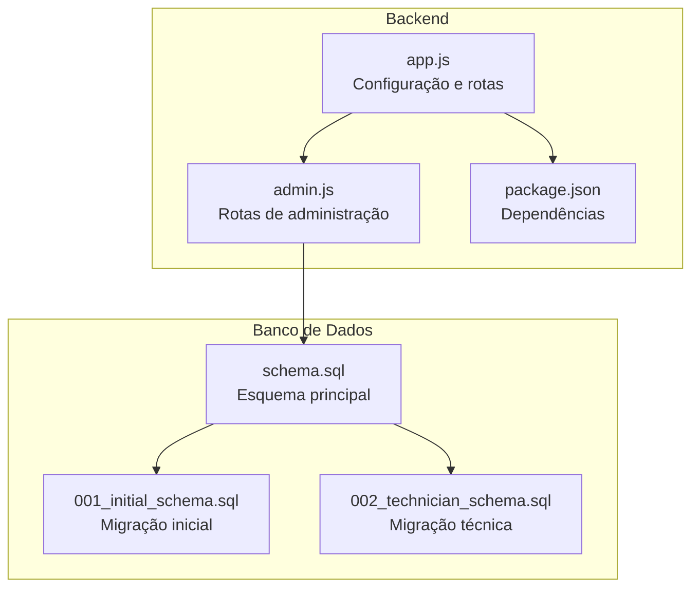
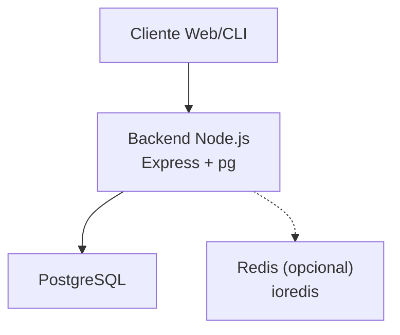
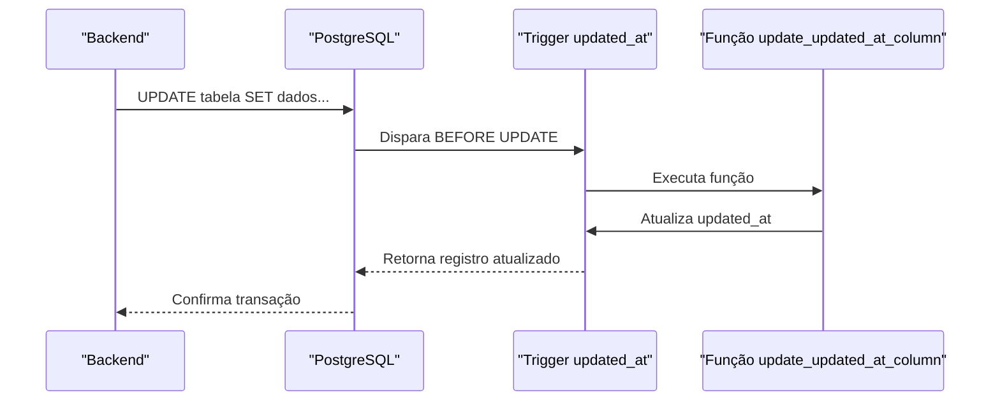
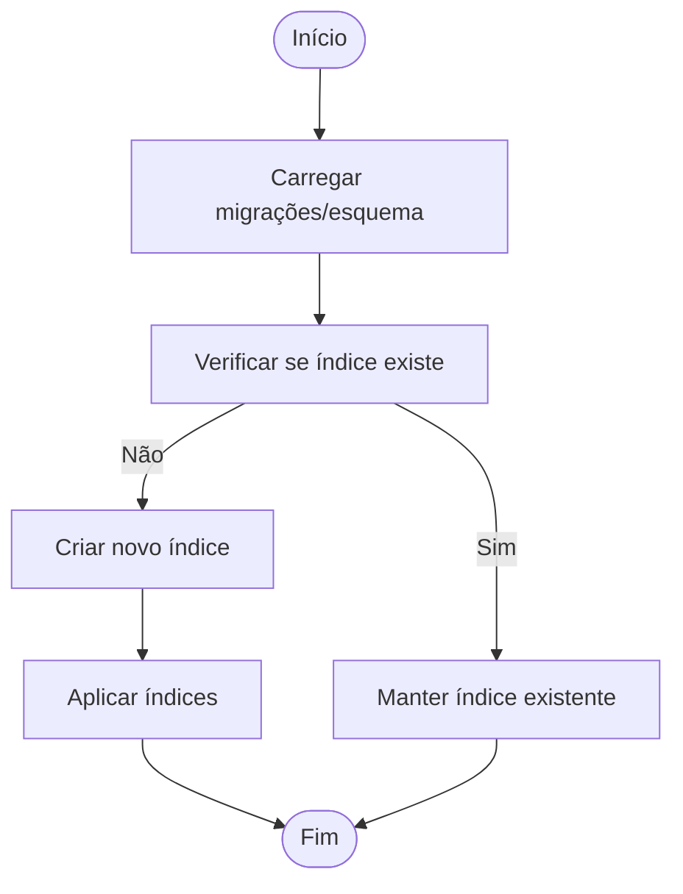
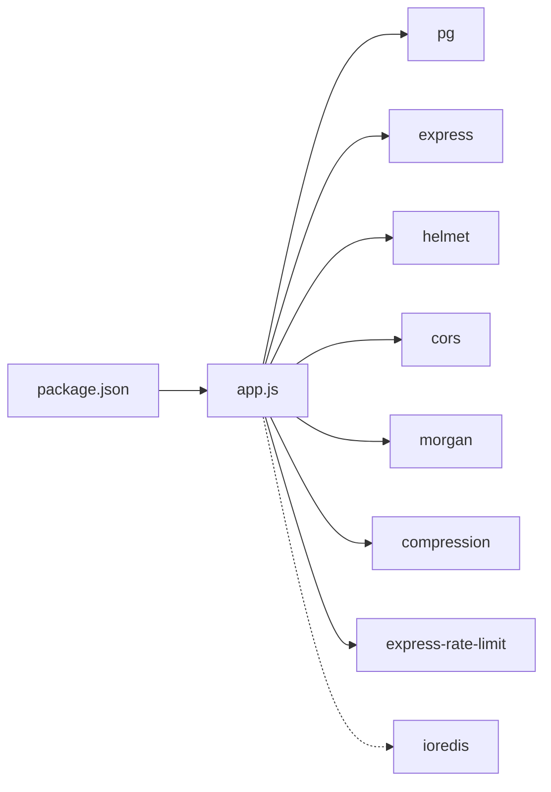

# Índices e Performance

<cite>
**Arquivos referenciados neste documento**
- [schema.sql](file://database/schema.sql)
- [001_initial_schema.sql](file://database/migrations/001_initial_schema.sql)
- [002_technician_schema.sql](file://database/migrations/002_technician_schema.sql)
- [app.js](file://backend/src/app.js)
- [package.json](file://backend/package.json)
- [admin.js](file://backend/src/routes/admin.js)
</cite>

## Sumário
1. [Introdução](#introdução)
2. [Estrutura do Projeto](#estrutura-do-projeto)
3. [Componentes-Chave](#componentes-chave)
4. [Visão Geral da Arquitetura](#visão-geral-da-arquitetura)
5. [Análise Detalhada dos Componentes](#análise-detalhada-dos-componentes)
6. [Análise de Dependências](#análise-de-dependências)
7. [Considerações de Desempenho](#considerações-de-desempenho)
8. [Guia de Solução de Problemas](#guia-de-solução-de-problemas)
9. [Conclusão](#conclusão)
10. [Apêndices](#apêndices)

## Introdução
Este documento apresenta uma documentação abrangente sobre otimização de desempenho do banco de dados PostgreSQL utilizado pelo Bay-RSET Tool. Ele detalha os índices criados, estratégias de indexação para consultas comuns, impacto no desempenho, triggers de atualização automática (updated_at), funções PL/pgSQL e otimizações específicas para o ambiente do projeto. Também inclui orientações para análise de query plans, monitoramento de performance e estratégias de cache, além de benchmarks e recomendações para ambientes de produção.

## Estrutura do Projeto
O projeto é composto por um backend em Node.js com integração ao PostgreSQL via pg, e um conjunto de migrações e esquema SQL que definem as tabelas e índices. O backend expõe rotas REST e faz uso de pacotes como express, helmet, cors, morgan, rate-limit, compression, ioredis e pg. As principais fontes de dados são os arquivos de migração e o esquema principal.

**Diagrama fonte**
- [app.js:1-204](file://backend/src/app.js#L1-L204)
- [package.json:1-59](file://backend/package.json#L1-L59)
- [schema.sql:1-194](file://database/schema.sql#L1-L194)
- [001_initial_schema.sql:1-57](file://database/migrations/001_initial_schema.sql#L1-L57)
- [002_technician_schema.sql:1-135](file://database/migrations/002_technician_schema.sql#L1-L135)

**Seção fonte**
- [app.js:1-204](file://backend/src/app.js#L1-L204)
- [package.json:1-59](file://backend/package.json#L1-L59)

## Componentes-Chave
- Esquema e índices: Definição das tabelas e índices em [schema.sql:144-157](file://database/schema.sql#L144-L157).
- Migrações: Criação inicial e extensão para modo técnico em [001_initial_schema.sql:1-57](file://database/migrations/001_initial_schema.sql#L1-L57) e [002_technician_schema.sql:1-135](file://database/migrations/002_technician_schema.sql#L1-L135).
- Triggers updated_at: Função e gatilhos em [schema.sql:158-178](file://database/schema.sql#L158-L178).
- Backend: Configurações e dependências em [app.js:24-32](file://backend/src/app.js#L24-L32) e [package.json:23-46](file://backend/package.json#L23-L46).
- Rota de configurações: Validação e resposta em [admin.js:144-173](file://backend/src/routes/admin.js#L144-L173).

**Seção fonte**
- [schema.sql:144-178](file://database/schema.sql#L144-L178)
- [001_initial_schema.sql:33-56](file://database/migrations/001_initial_schema.sql#L33-L56)
- [002_technician_schema.sql:103-132](file://database/migrations/002_technician_schema.sql#L103-L132)
- [app.js:24-32](file://backend/src/app.js#L24-L32)
- [package.json:23-46](file://backend/package.json#L23-L46)
- [admin.js:144-173](file://backend/src/routes/admin.js#L144-L173)

## Visão Geral da Arquitetura
A arquitetura do sistema conecta o backend Node.js ao PostgreSQL. O backend expõe endpoints REST e utiliza o driver pg para operações de banco de dados. As migrações e o esquema principal definem as estruturas de dados e os índices. Os triggers PL/pgSQL garantem a atualização automática do campo updated_at em várias tabelas.

**Diagrama fonte**
- [app.js:15-54](file://backend/src/app.js#L15-L54)
- [package.json:40](file://backend/package.json#L40)
- [schema.sql:158-178](file://database/schema.sql#L158-L178)

## Análise Detalhada dos Componentes

### Índices e Estratégias de Indexação
Os índices foram criados com base em padrões de consulta comuns no sistema. Eles visam acelerar buscas, filtros e junções nas principais entidades.

- Índices principais:
  - users: idx_users_email, idx_users_role
  - sessions: idx_sessions_user_id, idx_sessions_token, idx_sessions_status
  - tickets: idx_tickets_user_id, idx_tickets_status, idx_tickets_assigned_to
  - ticket_messages: idx_ticket_messages_ticket_id
  - activity_logs: idx_activity_logs_user_id, idx_activity_logs_created_at
  - consent_logs: idx_consent_logs_session_id
  - clients, devices, service_orders, service_reports: índices adicionais no modo técnico

Estratégias de indexação comuns:
- Índices em campos de busca: idx_users_email, idx_sessions_token, idx_devices_imei
- Índices em campos de filtro: idx_sessions_status, idx_tickets_status, idx_service_orders_status
- Índices em chaves estrangeiras: idx_sessions_user_id, idx_tickets_user_id, idx_ticket_messages_ticket_id, idx_clients_technician, idx_devices_client, idx_service_orders_client, idx_service_orders_technician
- Índices em campos de auditoria: idx_activity_logs_created_at

Impacto no desempenho:
- Melhora significativa em consultas de login, autenticação e histórico de atividade.
- Reduz custo de ordenação e filtragem em relatórios de tickets e logs.
- Facilita junções eficientes entre tabelas de suporte e sessões.

**Seção fonte**
- [schema.sql:144-157](file://database/schema.sql#L144-L157)
- [002_technician_schema.sql:124-132](file://database/migrations/002_technician_schema.sql#L124-L132)

### Triggers de Atualização Automática (updated_at)
Função PL/pgSQL:
- update_updated_at_column: atualiza automaticamente o campo updated_at com o horário atual antes de qualquer atualização.

Gatilhos:
- users: update_users_updated_at
- sessions: update_sessions_updated_at
- tickets: update_tickets_updated_at
- system_settings: update_system_settings_updated_at
- clients, devices, service_orders: gatilhos adicionados na migração técnica

Benefícios:
- Garante rastreabilidade de alterações sem código duplicado.
- Facilita auditoria e ordenação por data de modificação.

**Seção fonte**
- [schema.sql:158-178](file://database/schema.sql#L158-L178)
- [001_initial_schema.sql:33-50](file://database/migrations/001_initial_schema.sql#L33-L50)
- [002_technician_schema.sql:103-123](file://database/migrations/002_technician_schema.sql#L103-L123)

### Funções PL/pgSQL
A função update_updated_at_column é reutilizada em múltiplos gatilhos para padronizar a atualização do campo updated_at. Isso evita duplicidade de código e mantém consistência.

**Seção fonte**
- [schema.sql:158-165](file://database/schema.sql#L158-L165)
- [001_initial_schema.sql:34-40](file://database/migrations/001_initial_schema.sql#L34-L40)
- [002_technician_schema.sql:104-110](file://database/migrations/002_technician_schema.sql#L104-L110)

### Otimizações Específicas para o Bay-RSET Tool
- Migração técnica: Adiciona tabelas de clientes, dispositivos e ordens de serviço, com índices específicos para consultas técnicas.
- Validação de dados: CHECK constraints em campos como role, status e categorias ajudam a manter integridade e facilitar consultas condicionais.
- JSONB: Campos como diagnosis, details e geolocation permitem armazenamento flexível de dados estruturados, úteis para diagnósticos e logs.

**Seção fonte**
- [002_technician_schema.sql:8-98](file://database/migrations/002_technician_schema.sql#L8-L98)
- [schema.sql:12-19](file://database/schema.sql#L12-L19)
- [schema.sql:39-40](file://database/schema.sql#L39-L40)
- [schema.sql:117-118](file://database/schema.sql#L117-L118)

### Sequência de Atualização do updated_at

**Diagrama fonte**
- [schema.sql:158-178](file://database/schema.sql#L158-L178)
- [001_initial_schema.sql:33-50](file://database/migrations/001_initial_schema.sql#L33-L50)
- [002_technician_schema.sql:103-123](file://database/migrations/002_technician_schema.sql#L103-L123)

### Fluxo de Criação de Índices

**Diagrama fonte**
- [001_initial_schema.sql:51-56](file://database/migrations/001_initial_schema.sql#L51-L56)
- [002_technician_schema.sql:124-132](file://database/migrations/002_technician_schema.sql#L124-L132)
- [schema.sql:144-157](file://database/schema.sql#L144-L157)

## Análise de Dependências
- Dependências do backend:
  - pg: Driver PostgreSQL para Node.js.
  - express, helmet, cors, morgan, compression, express-rate-limit: Segurança, logging e performance do servidor.
  - ioredis: Integração opcional com Redis para cache e mensagens.
  - sequelize: ORM (não utilizado diretamente para consultas SQL, mas presente nas dependências).

**Diagrama fonte**
- [package.json:23-46](file://backend/package.json#L23-L46)
- [app.js:15-54](file://backend/src/app.js#L15-L54)

**Seção fonte**
- [package.json:23-46](file://backend/package.json#L23-L46)
- [app.js:15-54](file://backend/src/app.js#L15-L54)

## Considerações de Desempenho

### Análise de Query Plans
- Use EXPLAIN e EXPLAIN ANALYZE para identificar gargalos em consultas comuns.
- Verifique o uso de índices nos planos de execução.
- Avalie o custo de scans sequenciais versus buscas indexadas.

### Monitoramento de Performance
- Logs HTTP com morgan para métricas de tráfego e erros.
- Configurações de rate-limit para proteção contra sobrecarga.
- Uso de Redis (ioredis) para cache de dados frequentemente acessados (recomendação).

### Estratégias de Cache
- Cache de configurações do sistema (system_settings) em Redis para evitar consultas repetidas.
- Cache de sessões ativas e tickets recentes.
- Evite cache de dados sensíveis sem criptografia e controle de acesso adequado.

### Benchmarks e Recomendações
- Benchmarks:
  - Teste de carga com diferentes tamanhos de dados (milhares de registros) e varie o número de índices.
  - Compare tempos de consulta com e sem índices em campos de busca e filtros.
- Recomendações:
  - Mantenha índices de texto completo (GIN) para campos JSONB quando necessário.
  - Reavalie índices raramente utilizados.
  - Utilize parâmetros de configuração do PostgreSQL (work_mem, shared_buffers) conforme o hardware disponível.
  - Monitore o tempo de resposta e utilize ferramentas de profiling.

[Sem fontes, pois esta seção fornece orientações gerais]

## Guia de Solução de Problemas
- Erros de integridade referencial:
  - Verifique constraints CHECK e chaves estrangeiras após migrações.
- Desempenho ruim em consultas:
  - Confirme o uso de índices esperados e reavalie planos de execução.
- Atualizações desatualizadas:
  - Verifique se os triggers updated_at estão ativos nas tabelas afetadas.

**Seção fonte**
- [schema.sql:12-19](file://database/schema.sql#L12-L19)
- [schema.sql:39-40](file://database/schema.sql#L39-L40)
- [schema.sql:158-178](file://database/schema.sql#L158-L178)

## Conclusão
O Bay-RSET Tool implementa um conjunto sólido de índices e gatilhos PL/pgSQL para otimizar consultas e manter rastreabilidade. As migrações técnicas expandiram o esquema com tabelas e índices específicos para o modo técnico. Para ambientes de produção, recomenda-se monitorar continuamente o desempenho, validar planos de execução e adotar estratégias de cache com Redis, sempre alinhadas às necessidades de segurança e escalabilidade do sistema.

[Sem fontes, pois esta seção resume sem análise específica de arquivos]

## Apêndices

### Tabelas e Índices Relevantes
- users: idx_users_email, idx_users_role
- sessions: idx_sessions_user_id, idx_sessions_token, idx_sessions_status
- tickets: idx_tickets_user_id, idx_tickets_status, idx_tickets_assigned_to
- ticket_messages: idx_ticket_messages_ticket_id
- activity_logs: idx_activity_logs_user_id, idx_activity_logs_created_at
- consent_logs: idx_consent_logs_session_id
- clients: idx_clients_technician, idx_clients_name
- devices: idx_devices_client, idx_devices_imei
- service_orders: idx_service_orders_client, idx_service_orders_technician, idx_service_orders_status
- service_reports: idx_service_reports_order

**Seção fonte**
- [schema.sql:144-157](file://database/schema.sql#L144-L157)
- [002_technician_schema.sql:124-132](file://database/migrations/002_technician_schema.sql#L124-L132)