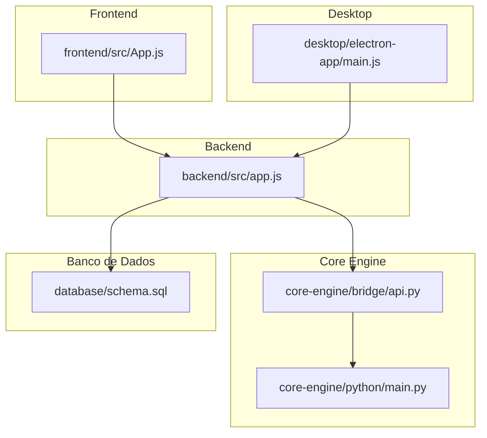
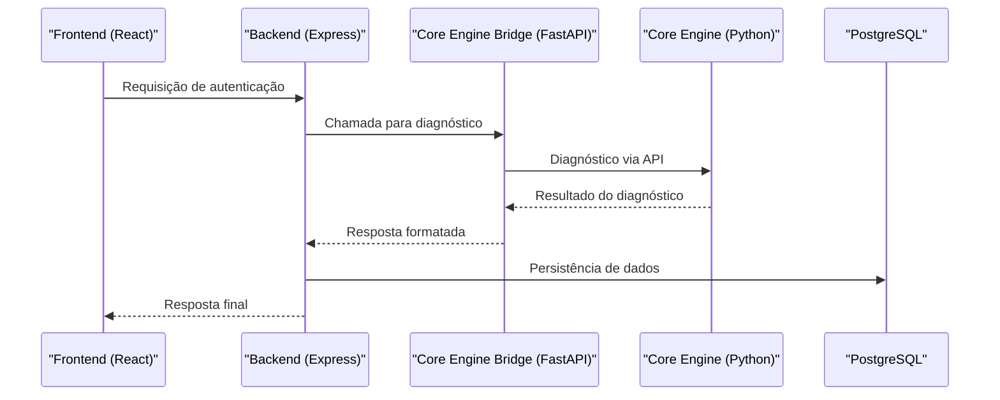
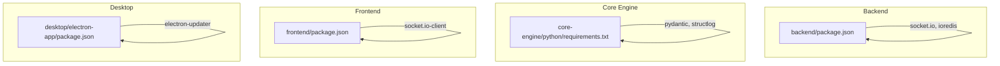

# Ambientes de Desenvolvimento

<cite>
**Arquivos Referenciados neste Documento**
- [README.md](file://README.md)
- [backend/package.json](file://backend/package.json)
- [backend/src/app.js](file://backend/src/app.js)
- [frontend/package.json](file://frontend/package.json)
- [frontend/tailwind.config.js](file://frontend/tailwind.config.js)
- [desktop/electron-app/package.json](file://desktop/electron-app/package.json)
- [desktop/electron-app/main.js](file://desktop/electron-app/main.js)
- [core-engine/python/requirements.txt](file://core-engine/python/requirements.txt)
- [core-engine/python/main.py](file://core-engine/python/main.py)
- [core-engine/bridge/api.py](file://core-engine/bridge/api.py)
- [database/schema.sql](file://database/schema.sql)
- [database/migrations/001_initial_schema.sql](file://database/migrations/001_initial_schema.sql)
</cite>

## Sumário
- Introdução
- Estrutura do Projeto
- Componentes Principais
- Visão Geral da Arquitetura
- Análise Detalhada dos Componentes
- Análise de Dependências
- Considerações de Desempenho
- Guia de Solução de Problemas
- Conclusão

## Introdução
Este documento apresenta um guia completo para configurar ambientes de desenvolvimento do Bay-RSET Tool, um assistente de suporte guiado para recuperação de contas Apple ID. O projeto segue uma arquitetura modular com backend Node.js, frontend React, motor Python (Core Engine), bridge FastAPI, aplicativo desktop Electron e banco de dados PostgreSQL. O objetivo é facilitar a instalação, configuração e inicialização de todos os módulos, bem como fornecer orientações sobre variáveis de ambiente, serviços auxiliares, scripts de build e hot reload.

## Estrutura do Projeto
O projeto é composto pelos seguintes módulos:
- backend: API REST Node.js com Express, rotas e middleware de segurança
- frontend: interface React com TailwindCSS e Zustand
- core-engine: motor Python com FastAPI e Uvicorn, incluindo bridge
- desktop: aplicativo Electron com preload e IPC
- database: schema e migrações PostgreSQL

**Diagrama fonte**
- [backend/src/app.js:166-174](file://backend/src/app.js#L166-L174)
- [core-engine/bridge/api.py:119-125](file://core-engine/bridge/api.py#L119-L125)
- [core-engine/python/main.py:246-253](file://core-engine/python/main.py#L246-L253)
- [frontend/src/App.js:1-200](file://frontend/src/App.js#L1-L200)
- [desktop/electron-app/main.js:22-53](file://desktop/electron-app/main.js#L22-L53)
- [database/schema.sql:1-20](file://database/schema.sql#L1-L20)

**Seção fonte**
- [README.md:19-29](file://README.md#L19-L29)

## Componentes Principais

### Backend (Node.js + Express)
- Scripts de inicialização: dev e start
- Variáveis de ambiente: PORT, NODE_ENV, JWT_SECRET, CORE_ENGINE_URL, DATABASE_URL, REDIS_URL, ALLOWED_ORIGINS
- Segurança: Helmet, rate limiting, CORS, compressão e logging
- Rotas: /api/v1/auth, /api/v1/sessions, /api/v1/diagnosis, /api/v1/tickets, /api/v1/users, /api/v1/admin
- Logs: Winston com arquivos e console

Principais pontos de configuração:
- Porta e ambiente: config.port e config.nodeEnv
- URLs de serviço: config.coreEngineUrl e config.databaseUrl
- CORS: origins configuráveis via variáveis de ambiente
- Logs: transporte para arquivo e console

**Seção fonte**
- [backend/src/app.js:24-32](file://backend/src/app.js#L24-L32)
- [backend/src/app.js:59-96](file://backend/src/app.js#L59-L96)
- [backend/src/app.js:110-116](file://backend/src/app.js#L110-L116)
- [backend/src/app.js:166-174](file://backend/src/app.js#L166-L174)
- [backend/package.json:6-12](file://backend/package.json#L6-L12)

### Core Engine (Python + FastAPI)
- Dependências: FastAPI, Uvicorn, Pydantic, httpx, structlog, pytest
- API REST: /api/sessions, /api/diagnosis, /api/consent, /api/guides, /api/stats
- WebSocket: /ws/{client_id}
- Motor de diagnóstico: tipos de problema, severidade, fluxos de recuperação
- Gerenciamento de sessões: criação, atualização e status
- Logs: stdout e arquivo

Principais pontos de configuração:
- Porta: 8000 (padrão)
- Reload: ativado para desenvolvimento
- Documentação: /docs
- Health check: /health

**Seção fonte**
- [core-engine/bridge/api.py:119-125](file://core-engine/bridge/api.py#L119-L125)
- [core-engine/bridge/api.py:139-155](file://core-engine/bridge/api.py#L139-L155)
- [core-engine/bridge/api.py:168-183](file://core-engine/bridge/api.py#L168-L183)
- [core-engine/bridge/api.py:206-238](file://core-engine/bridge/api.py#L206-L238)
- [core-engine/bridge/api.py:240-273](file://core-engine/bridge/api.py#L240-L273)
- [core-engine/bridge/api.py:275-293](file://core-engine/bridge/api.py#L275-L293)
- [core-engine/bridge/api.py:296-303](file://core-engine/bridge/api.py#L296-L303)
- [core-engine/bridge/api.py:336-400](file://core-engine/bridge/api.py#L336-L400)
- [core-engine/python/requirements.txt:1-27](file://core-engine/python/requirements.txt#L1-L27)
- [core-engine/python/main.py:246-253](file://core-engine/python/main.py#L246-L253)

### Frontend (React + TailwindCSS)
- Scripts de inicialização: start, build, test
- Proxy: http://localhost:3001
- Dependências: React, TailwindCSS, Zustand, Socket.IO Client
- Configuração: tailwind.config.js com temas e plugins

Principais pontos de configuração:
- Hot reload: react-scripts start
- Build: react-scripts build
- Proxy para backend: proxy configurado em package.json
- Tailwind: configuração de cores, animações e plugins

**Seção fonte**
- [frontend/package.json:26-32](file://frontend/package.json#L26-L32)
- [frontend/package.json:57](file://frontend/package.json#L57)
- [frontend/tailwind.config.js:1-72](file://frontend/tailwind.config.js#L1-L72)

### Desktop (Electron)
- Scripts de inicialização: start, dev, build
- Configuração de janela: tamanho mínimo, preload, sandbox
- Segurança: CSP, permissões, bloqueio de navegação externa
- IPC: geração de sessão, diagnóstico, logs, atualizações automáticas

Principais pontos de configuração:
- Ambiente: NODE_ENV
- URLs: API_URL e SOCKET_URL
- DevTools: aberto em modo development
- Atualizações: electron-updater com GitHub

**Seção fonte**
- [desktop/electron-app/package.json:6-11](file://desktop/electron-app/package.json#L6-L11)
- [desktop/electron-app/main.js:14-20](file://desktop/electron-app/main.js#L14-L20)
- [desktop/electron-app/main.js:22-53](file://desktop/electron-app/main.js#L22-L53)
- [desktop/electron-app/main.js:288-323](file://desktop/electron-app/main.js#L288-L323)

### Banco de Dados (PostgreSQL)
- Extensão UUID: uuid-ossp
- Tabelas: users, sessions, tickets, ticket_messages, activity_logs, consent_logs, system_settings, api_keys
- Índices: performance em campos de busca
- Gatilhos: atualização automática de updated_at
- Migrações: 001_initial_schema.sql

Principais pontos de configuração:
- Tipos de dados: UUID, JSONB, INET
- Constraints: CHECK para valores válidos
- Índices: performance em buscas
- Valores iniciais: system_settings

**Seção fonte**
- [database/schema.sql:5-6](file://database/schema.sql#L5-L6)
- [database/schema.sql:8-51](file://database/schema.sql#L8-L51)
- [database/schema.sql:53-106](file://database/schema.sql#L53-L106)
- [database/schema.sql:121-142](file://database/schema.sql#L121-L142)
- [database/schema.sql:144-178](file://database/schema.sql#L144-L178)
- [database/migrations/001_initial_schema.sql:7-31](file://database/migrations/001_initial_schema.sql#L7-L31)
- [database/migrations/001_initial_schema.sql:33-49](file://database/migrations/001_initial_schema.sql#L33-L49)

## Visão Geral da Arquitetura

**Diagrama fonte**
- [backend/src/app.js:110-116](file://backend/src/app.js#L110-L116)
- [core-engine/bridge/api.py:206-238](file://core-engine/bridge/api.py#L206-L238)
- [core-engine/python/main.py:264-309](file://core-engine/python/main.py#L264-L309)
- [database/schema.sql:22-51](file://database/schema.sql#L22-L51)

## Análise Detalhada dos Componentes

### Backend: Configurações e Variáveis de Ambiente
- Variáveis obrigatórias:
  - DATABASE_URL: string de conexão PostgreSQL
  - JWT_SECRET: chave para assinatura de tokens
- Variáveis opcionais:
  - PORT: porta do servidor (padrão 3000)
  - NODE_ENV: ambiente (development/production)
  - CORE_ENGINE_URL: URL do Core Engine (padrão http://localhost:8000)
  - REDIS_URL: URL do Redis (para cache e sessões)
  - ALLOWED_ORIGINS: lista de origens permitidas separadas por vírgula
- Scripts:
  - npm run dev: nodemon para hot reload
  - npm start: node para produção

**Seção fonte**
- [backend/src/app.js:24-32](file://backend/src/app.js#L24-L32)
- [backend/src/app.js:72-76](file://backend/src/app.js#L72-L76)
- [backend/package.json:6-12](file://backend/package.json#L6-L12)

### Core Engine: API REST e WebSocket
- Endpoints REST:
  - GET /: informações da API
  - GET /health: verificação de saúde
  - POST /api/sessions: criação de sessão
  - GET /api/sessions/{session_id}: status da sessão
  - POST /api/diagnosis: diagnóstico de problema
  - POST /api/consent: registro de consentimento
  - GET /api/guides/{problem_type}: guia de recuperação
  - GET /api/stats: estatísticas do sistema
- WebSocket:
  - /ws/{client_id}: mensagens create_session, diagnose, get_status, ping
- Configuração:
  - Host: 0.0.0.0
  - Porta: 8000
  - Reload: ativado
  - Documentação: /docs

**Seção fonte**
- [core-engine/bridge/api.py:139-155](file://core-engine/bridge/api.py#L139-L155)
- [core-engine/bridge/api.py:158-165](file://core-engine/bridge/api.py#L158-L165)
- [core-engine/bridge/api.py:168-183](file://core-engine/bridge/api.py#L168-L183)
- [core-engine/bridge/api.py:188-203](file://core-engine/bridge/api.py#L188-L203)
- [core-engine/bridge/api.py:206-238](file://core-engine/bridge/api.py#L206-L238)
- [core-engine/bridge/api.py:240-273](file://core-engine/bridge/api.py#L240-L273)
- [core-engine/bridge/api.py:275-293](file://core-engine/bridge/api.py#L275-L293)
- [core-engine/bridge/api.py:296-303](file://core-engine/bridge/api.py#L296-L303)
- [core-engine/bridge/api.py:336-400](file://core-engine/bridge/api.py#L336-L400)
- [core-engine/bridge/api.py:419-437](file://core-engine/bridge/api.py#L419-L437)

### Frontend: Configurações de Build e Hot Reload
- Scripts:
  - npm start: hot reload com react-scripts
  - npm run build: build de produção
  - npm test: testes
- Proxy:
  - http://localhost:3001 apontando para backend
- Dependências:
  - React, TailwindCSS, Zustand, Socket.IO Client
  - ESLint e Prettier para qualidade

**Seção fonte**
- [frontend/package.json:26-32](file://frontend/package.json#L26-L32)
- [frontend/package.json:57](file://frontend/package.json#L57)
- [frontend/tailwind.config.js:1-72](file://frontend/tailwind.config.js#L1-L72)

### Desktop: Segurança e IPC
- Segurança:
  - Content-Security-Policy restrito
  - Permissões de clipboard apenas
  - Bloqueio de navegação externa não autorizada
- IPC:
  - geração de session_id
  - diagnóstico de caso
  - salvamento de consentimento
  - logs de ações do cliente
  - atualizações automáticas

**Seção fonte**
- [desktop/electron-app/main.js:288-323](file://desktop/electron-app/main.js#L288-L323)
- [desktop/electron-app/main.js:106-158](file://desktop/electron-app/main.js#L106-L158)
- [desktop/electron-app/main.js:254-286](file://desktop/electron-app/main.js#L254-L286)

### Banco de Dados: Schema e Migrações
- Extensão UUID: uuid-ossp
- Tabelas:
  - users: autenticação e papéis
  - sessions: sessões de recuperação
  - tickets e ticket_messages: suporte
  - activity_logs e consent_logs: auditoria e conformidade
  - system_settings e api_keys: configurações e chaves
- Índices e gatilhos: performance e atualização automática
- Migrações: estrutura inicial e triggers

**Seção fonte**
- [database/schema.sql:5-6](file://database/schema.sql#L5-L6)
- [database/schema.sql:8-51](file://database/schema.sql#L8-L51)
- [database/schema.sql:53-106](file://database/schema.sql#L53-L106)
- [database/schema.sql:121-142](file://database/schema.sql#L121-L142)
- [database/schema.sql:144-178](file://database/schema.sql#L144-L178)
- [database/migrations/001_initial_schema.sql:7-31](file://database/migrations/001_initial_schema.sql#L7-L31)
- [database/migrations/001_initial_schema.sql:33-49](file://database/migrations/001_initial_schema.sql#L33-L49)

## Análise de Dependências

**Diagrama fonte**
- [backend/package.json:23-46](file://backend/package.json#L23-L46)
- [core-engine/python/requirements.txt:4-26](file://core-engine/python/requirements.txt#L4-L26)
- [frontend/package.json:5-24](file://frontend/package.json#L5-L24)
- [desktop/electron-app/package.json:27-33](file://desktop/electron-app/package.json#L27-L33)

**Seção fonte**
- [backend/package.json:23-53](file://backend/package.json#L23-L53)
- [core-engine/python/requirements.txt:1-27](file://core-engine/python/requirements.txt#L1-L27)
- [frontend/package.json:5-56](file://frontend/package.json#L5-L56)
- [desktop/electron-app/package.json:27-71](file://desktop/electron-app/package.json#L27-L71)

## Considerações de Desempenho
- Backend:
  - Compression ativada para reduzir tamanho de resposta
  - Rate limiting para proteção contra excesso de requisições
  - Morgan para logging HTTP
- Core Engine:
  - Uvicorn com reload em desenvolvimento
  - Pydantic para validação eficiente
  - Structlog para logs estruturados
- Frontend:
  - React Scripts para build otimizado
  - TailwindCSS para estilos eficientes
- Desktop:
  - Preload com isolamento de contexto
  - CSP restrito para segurança

## Guia de Solução de Problemas

### Erros Comuns e Soluções
- Erro de conexão ao banco de dados:
  - Verifique DATABASE_URL e credenciais
  - Confirme que PostgreSQL está em execução
- Erro de CORS:
  - Configure ALLOWED_ORIGINS corretamente
  - Verifique origens permitidas no backend
- Erro de autenticação:
  - Verifique JWT_SECRET
  - Confirme tokens válidos
- Erro de proxy no frontend:
  - Verifique proxy apontando para backend correto
- Erro de permissões no Electron:
  - Revise CSP e permissões de permissão
  - Confirme permissões de clipboard

**Seção fonte**
- [backend/src/app.js:72-76](file://backend/src/app.js#L72-L76)
- [backend/src/app.js:148-162](file://backend/src/app.js#L148-L162)
- [frontend/package.json:57](file://frontend/package.json#L57)
- [desktop/electron-app/main.js:288-323](file://desktop/electron-app/main.js#L288-L323)

## Conclusão
O Bay-RSET Tool oferece uma arquitetura sólida e modular para desenvolvimento de aplicações de suporte guiado. Com as configurações descritas, é possível montar um ambiente completo com backend, frontend, core engine, desktop e banco de dados. Recomenda-se seguir as etapas de instalação e configuração para cada módulo, garantindo que as variáveis de ambiente estejam corretas e que os serviços auxiliares estejam disponíveis. O uso de hot reload e scripts de build facilita o desenvolvimento contínuo e a manutenção do sistema.