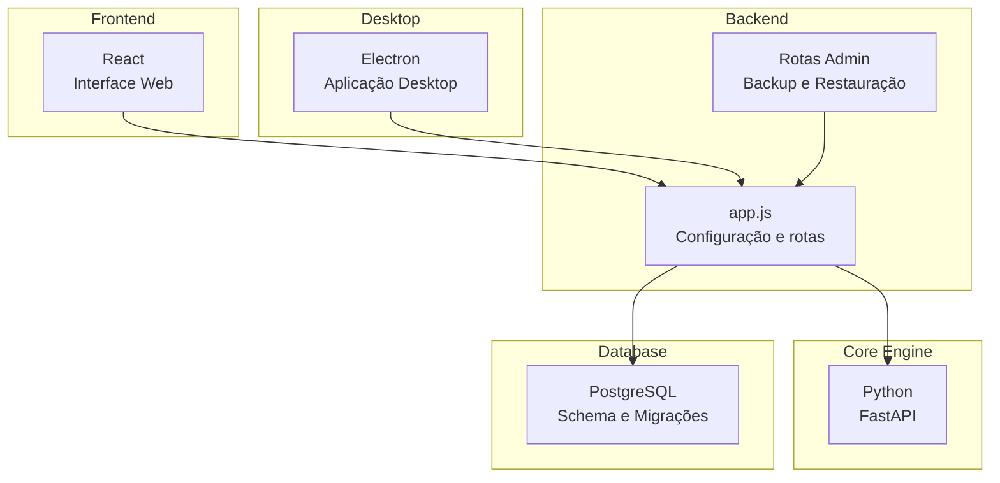
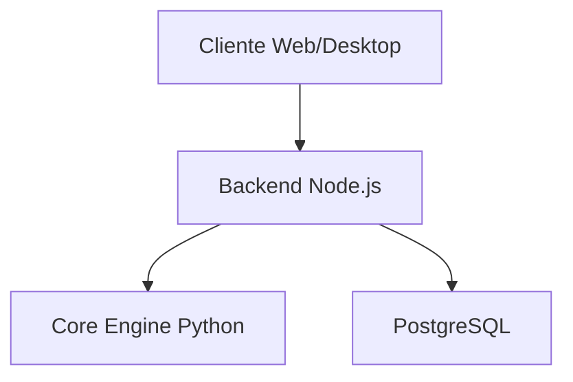
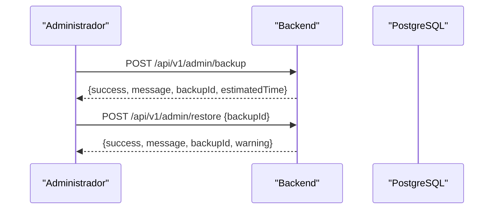
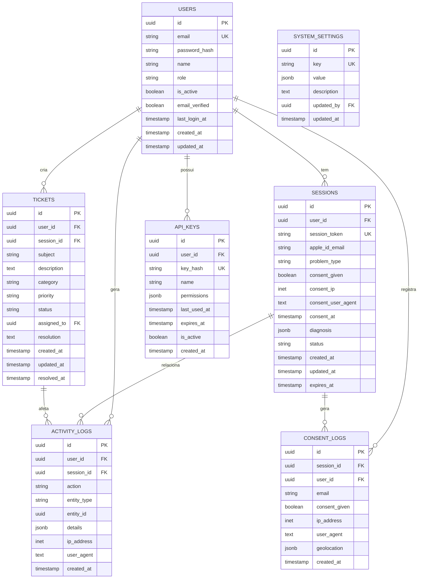
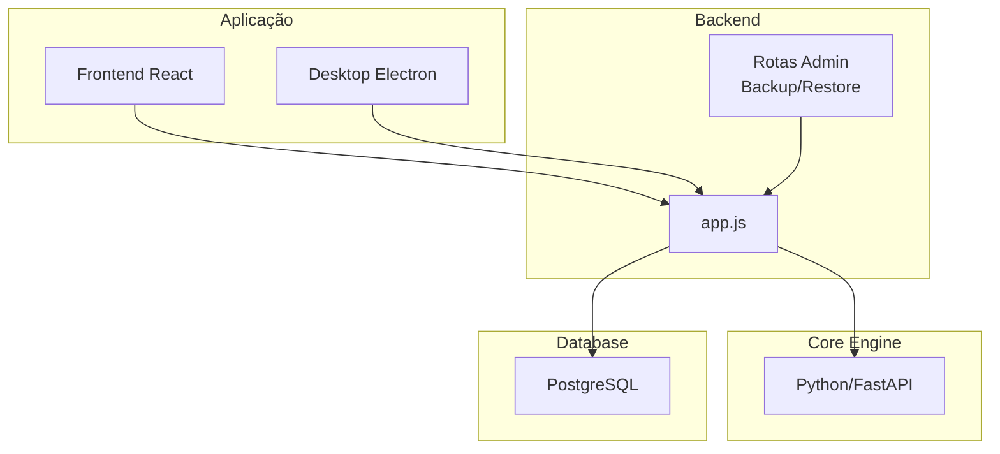
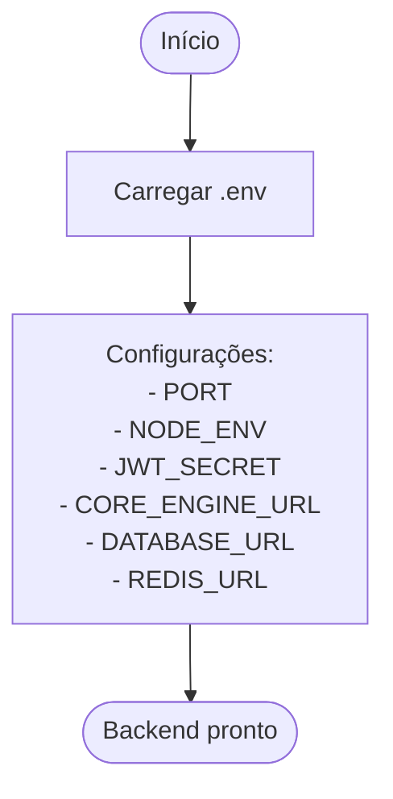
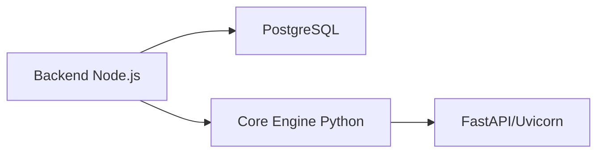

# Backup e Recuperação

<cite>
**Arquivos referenciados neste documento**
- [README.md](file://README.md)
- [schema.sql](file://database/schema.sql)
- [001_initial_schema.sql](file://database/migrations/001_initial_schema.sql)
- [002_technician_schema.sql](file://database/migrations/002_technician_schema.sql)
- [app.js](file://backend/src/app.js)
- [admin.js](file://backend/src/routes/admin.js)
- [package.json](file://backend/package.json)
- [requirements.txt](file://core-engine/python/requirements.txt)
</cite>

## Sumário
1. [Introdução](#introdução)
2. [Estrutura do Projeto](#estrutura-do-projeto)
3. [Componentes-Chave](#componentes-chave)
4. [Visão Geral da Arquitetura](#visão-geral-da-arquitetura)
5. [Análise Detalhada dos Componentes](#análise-detalhada-dos-componentes)
6. [Análise de Dependências](#análise-de-dependências)
7. [Considerações de Desempenho](#considerações-de-desempenho)
8. [Guia de Solução de Problemas](#guia-de-solução-de-problemas)
9. [Conclusão](#conclusão)
10. [Apêndices](#apêndices)

## Introdução
Este documento apresenta uma estratégia abrangente de backup e recuperação para o Bay-RSET Tool, com foco em proteção de dados críticos, disponibilidade e conformidade. Ele documenta:
- Estratégias de backup para o banco de dados PostgreSQL, arquivos de aplicação e configurações
- Procedimentos de backup automático, agendamento e validação de integridade
- Processos de restauração em caso de falha, testes de recuperação e planejamento de continuidade de negócio
- Políticas de retenção, armazenamento seguro e backup off-site
- Backup de dados sensíveis e conformidade regulatória

O projeto é composto por três camadas principais: backend (Node.js), motor central (Python/FastAPI) e frontend/desktop (React/Electron). O backend se conecta ao PostgreSQL e expõe rotas de administração que incluem endpoints para backup e restauração.

**Fontes da seção**
- [README.md:19-29](file://README.md#L19-L29)
- [README.md:35-38](file://README.md#L35-L38)

## Estrutura do Projeto
O projeto segue uma arquitetura de microsserviços com:
- Backend Node.js: API REST com rotas de administração, segurança e logs
- Core Engine Python: motor de processamento externo ao backend
- Frontend React: interface web
- Desktop Electron: aplicação desktop
- Database: PostgreSQL com schema e migrações

**Fontes da seção**
- [README.md:22-28](file://README.md#L22-L28)
- [app.js:15-32](file://backend/src/app.js#L15-L32)
- [package.json:23-46](file://backend/package.json#L23-L46)
- [requirements.txt:4-27](file://core-engine/python/requirements.txt#L4-L27)

## Componentes-Chave
- Backend (Node.js): carrega variáveis de ambiente, configura middlewares de segurança, logging e rotas. As rotas de administração incluem endpoints para backup e restauração.
- Core Engine (Python): serviço externo consumido pelo backend, com FastAPI e Uvicorn.
- Banco de Dados (PostgreSQL): schema e migrações definem a estrutura de dados, incluindo tabelas de usuários, sessões, tickets, logs e configurações.
- Frontend e Desktop: interfaces do usuário que interagem com o backend.

**Fontes da seção**
- [app.js:24-32](file://backend/src/app.js#L24-L32)
- [admin.js:207-232](file://backend/src/routes/admin.js#L207-L232)
- [schema.sql:8-194](file://database/schema.sql#L8-L194)
- [001_initial_schema.sql:7-56](file://database/migrations/001_initial_schema.sql#L7-L56)
- [002_technician_schema.sql:8-135](file://database/migrations/002_technician_schema.sql#L8-L135)

## Visão Geral da Arquitetura
A arquitetura envolve o backend consumindo o Core Engine e acessando o PostgreSQL. O backend também expõe endpoints de administração para backup e restauração.

**Fontes da seção**
- [app.js:100-122](file://backend/src/app.js#L100-L122)
- [schema.sql:180-186](file://database/schema.sql#L180-L186)

## Análise Detalhada dos Componentes

### Backup e Restauração (Backend)
O backend inclui rotas de administração para backup e restauração. Embora os endpoints retornem respostas informativas, a implementação real de backup e restauração deve ser desenvolvida com base nas práticas recomendadas para PostgreSQL e arquivos de aplicação.

**Fontes da seção**
- [admin.js:207-232](file://backend/src/routes/admin.js#L207-L232)

### Banco de Dados PostgreSQL
O schema define as principais entidades e índices, além de gatilhos para atualização automática de campos de data/hora. As migrações adicionam funcionalidades técnicas e estruturas de dados específicas.

**Fontes da seção**
- [schema.sql:8-194](file://database/schema.sql#L8-L194)
- [001_initial_schema.sql:7-56](file://database/migrations/001_initial_schema.sql#L7-L56)
- [002_technician_schema.sql:8-135](file://database/migrations/002_technician_schema.sql#L8-L135)

### Configurações e Variáveis de Ambiente
O backend carrega variáveis de ambiente para configurações de porta, ambiente, JWT, URL do Core Engine, URL do banco de dados e Redis. Essas variáveis são fundamentais para backups programados e integração com serviços externos.

**Fontes da seção**
- [app.js:24-32](file://backend/src/app.js#L24-L32)

## Visão Geral da Arquitetura

**Fontes da seção**
- [app.js:100-122](file://backend/src/app.js#L100-L122)
- [schema.sql:180-186](file://database/schema.sql#L180-L186)

## Análise Detalhada dos Componentes

### Backup e Restauração (Backend)
- Backup: endpoint POST /api/v1/admin/backup retorna informações de início de processo e estimativa de tempo.
- Restauração: endpoint POST /api/v1/admin/restore requer um identificador de backup e exibe aviso de substituição de dados.

**Fontes da seção**
- [admin.js:207-232](file://backend/src/routes/admin.js#L207-L232)

### Banco de Dados PostgreSQL
- Tabelas principais: users, sessions, tickets, activity_logs, consent_logs, system_settings, api_keys.
- Índices e gatilhos otimizam consultas e rastreamento de atualizações.
- Migrações: inicial e técnico (clientes, dispositivos, ordens de serviço).

**Fontes da seção**
- [schema.sql:8-194](file://database/schema.sql#L8-L194)
- [001_initial_schema.sql:7-56](file://database/migrations/001_initial_schema.sql#L7-L56)
- [002_technician_schema.sql:8-135](file://database/migrations/002_technician_schema.sql#L8-L135)

### Configurações e Variáveis de Ambiente
- Carregamento de variáveis de ambiente para configurações críticas.
- URLs de banco de dados e Core Engine são configuráveis.

**Fontes da seção**
- [app.js:24-32](file://backend/src/app.js#L24-L32)

## Visão Geral da Arquitetura

**Fontes da seção**
- [app.js:100-122](file://backend/src/app.js#L100-L122)
- [schema.sql:180-186](file://database/schema.sql#L180-L186)

## Análise Detalhada dos Componentes

### Backup e Restauração (Backend)
- Backup: endpoint POST /api/v1/admin/backup retorna informações de início de processo e estimativa de tempo.
- Restauração: endpoint POST /api/v1/admin/restore requer um identificador de backup e exibe aviso de substituição de dados.

**Fontes da seção**
- [admin.js:207-232](file://backend/src/routes/admin.js#L207-L232)

### Banco de Dados PostgreSQL
- Tabelas principais: users, sessions, tickets, activity_logs, consent_logs, system_settings, api_keys.
- Índices e gatilhos otimizam consultas e rastreamento de atualizações.
- Migrações: inicial e técnico (clientes, dispositivos, ordens de serviço).

**Fontes da seção**
- [schema.sql:8-194](file://database/schema.sql#L8-L194)
- [001_initial_schema.sql:7-56](file://database/migrations/001_initial_schema.sql#L7-L56)
- [002_technician_schema.sql:8-135](file://database/migrations/002_technician_schema.sql#L8-L135)

### Configurações e Variáveis de Ambiente
- Carregamento de variáveis de ambiente para configurações críticas.
- URLs de banco de dados e Core Engine são configuráveis.

**Fontes da seção**
- [app.js:24-32](file://backend/src/app.js#L24-L32)

## Análise de Dependências
- Backend depende do PostgreSQL (via pg) e do Core Engine (via HTTP).
- Core Engine depende de FastAPI e Uvicorn.
- Ambas as partes utilizam variáveis de ambiente para configurações.

**Fontes da seção**
- [package.json:40-46](file://backend/package.json#L40-L46)
- [requirements.txt:8-9](file://core-engine/python/requirements.txt#L8-L9)

## Considerações de Desempenho
- Índices otimizam consultas em tabelas de alta atividade (ex: tickets, logs).
- Gatilhos mantêm campos de data/hora atualizados automaticamente.
- Recomenda-se otimizar consultas e índices conforme crescimento de dados.

**Fontes da seção**
- [schema.sql:144-178](file://database/schema.sql#L144-L178)

## Guia de Solução de Problemas
- Logs do backend: configurados com Winston, gravando em arquivos e console.
- Tratamento de erros global: respostas padronizadas e log de erros.
- Verificação de ambiente: certifique-se de que DATABASE_URL e CORE_ENGINE_URL estejam corretos.

**Fontes da seção**
- [app.js:35-54](file://backend/src/app.js#L35-L54)
- [app.js:158-172](file://backend/src/app.js#L158-L172)

## Conclusão
Esta documentação fornece um guia prático para backup e recuperação do Bay-RSET Tool, destacando as áreas críticas do backend, banco de dados e configurações. Para garantir a conformidade e a continuidade de negócios, recomenda-se:
- Implementar backups automáticos do PostgreSQL e arquivos de aplicação
- Estabelecer políticas de retenção e armazenamento off-site
- Realizar testes periódicos de recuperação
- Garantir a criptografia de dados sensíveis e rastreamento legal

## Apêndices

### Recursos Adicionais
- Documentação técnica do projeto e pré-requisitos.

**Fontes da seção**
- [README.md:31-71](file://README.md#L31-L71)