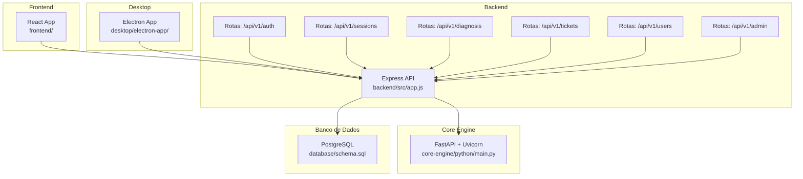
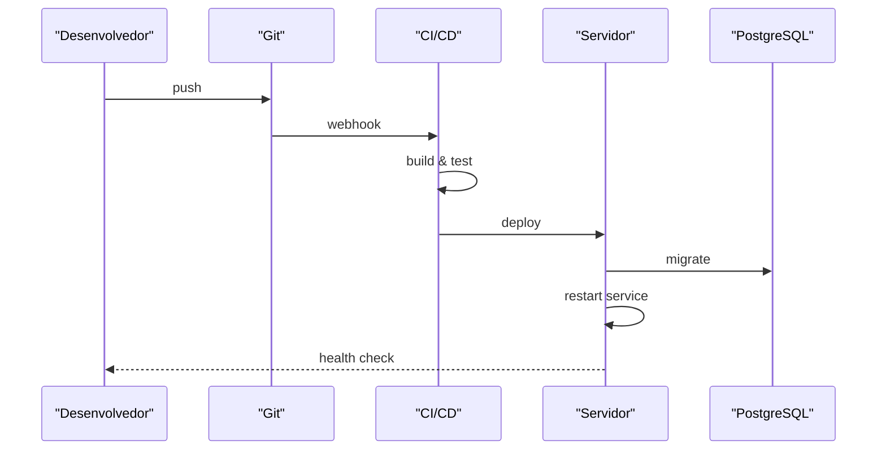
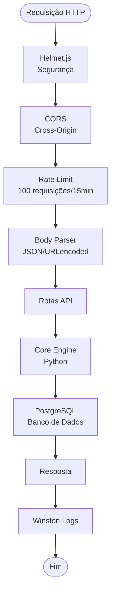

# Configuração e Deploy

<cite>
**Arquivos Referenciados Neste Documento**
- [README.md](file://README.md)
- [backend/package.json](file://backend/package.json)
- [backend/src/app.js](file://backend/src/app.js)
- [frontend/package.json](file://frontend/package.json)
- [desktop/electron-app/package.json](file://desktop/electron-app/package.json)
- [core-engine/python/requirements.txt](file://core-engine/python/requirements.txt)
- [database/schema.sql](file://database/schema.sql)
- [database/migrations/001_initial_schema.sql](file://database/migrations/001_initial_schema.sql)
</cite>

## Sumário
1. [Introdução](#introdução)
2. [Estrutura do Projeto](#estrutura-do-projeto)
3. [Dependências de Sistema e Requisitos](#dependências-de-sistema-e-requisitos)
4. [Ambientes de Desenvolvimento](#ambientes-de-desenvolvimento)
5. [Ambientes de Produção](#ambientes-de-produção)
6. [Variáveis de Ambiente](#variáveis-de-ambiente)
7. [Configurações de Banco de Dados](#configurações-de-banco-de-dados)
8. [Deploy em Produção](#deploy-em-produção)
9. [Pipeline CI/CD](#pipeline-cicd)
10. [Monitoramento e Logs](#monitoramento-e-logs)
11. [Backup, Restauração e Recuperação de Desastres](#backup-restauração-e-recuperação-de-desastres)
12. [Considerações de Escalabilidade](#considerações-de-escalabilidade)
13. [Conclusão](#conclusão)

## Introdução
O Bay-RSET Tool é um assistente inteligente de recuperação e suporte para contas Apple ID, composto por três camadas principais: backend (Node.js/Express), motor central (Python/FastAPI) e interface web (React). O sistema oferece fluxos guiados para recuperação de senhas, verificação em duas etapas, bloqueio de ativação e acompanhamento de chamados, com foco em conformidade legal e segurança.

## Estrutura do Projeto
O projeto segue uma arquitetura modular com componentes independentes que podem ser desenvolvidos e implantados separadamente.

**Diagrama fonte**
- [backend/src/app.js:111-116](file://backend/src/app.js#L111-L116)
- [database/schema.sql:8-142](file://database/schema.sql#L8-L142)

**Seção fonte**
- [README.md:19-29](file://README.md#L19-L29)

## Dependências de Sistema e Requisitos
- Node.js 18+ (backend)
- Python 3.8+ (core engine)
- PostgreSQL 14+ (banco de dados)
- Redis (opcional, para cache e sessões)
- Navegador moderno (frontend)
- Electron 42+ (desktop app)

**Seção fonte**
- [README.md:33-39](file://README.md#L33-L39)

## Ambientes de Desenvolvimento
### Backend (Node.js/Express)
- Instalação: npm install
- Execução: npm run dev
- Scripts disponíveis: start, dev, test, lint, seed
- Proxy configurado para o backend local

### Core Engine (Python/FastAPI)
- Instalação: pip install -r requirements.txt
- Execução: python main.py
- Ambiente recomendado: virtualenv

### Frontend (React)
- Instalação: npm install
- Execução: npm start
- Proxy automático aponta para http://localhost:3001

### Desktop App (Electron)
- Instalação: npm install
- Execução: npm start
- Build: npm run build (gera instaladores)

**Seção fonte**
- [README.md:40-71](file://README.md#L40-L71)
- [backend/package.json:6-12](file://backend/package.json#L6-L12)
- [frontend/package.json:26-32](file://frontend/package.json#L26-L32)
- [desktop/electron-app/package.json:6-11](file://desktop/electron-app/package.json#L6-L11)

## Ambientes de Produção
### Backend
- Porta padrão: 3000
- Variáveis de ambiente obrigatórias: DATABASE_URL
- Recomenda-se usar REDIS_URL para cache
- JWT_SECRET deve ser alterado em produção

### Core Engine
- Porta padrão: 8000
- Exposição via reverse proxy (nginx/apache)
- Logs estruturados com structlog

### Frontend
- Build: npm run build
- Servido via nginx/apache
- Configurações de proxy para backend

### Desktop App
- Build cross-platform com electron-builder
- Publicação via GitHub Releases

**Seção fonte**
- [backend/src/app.js:24-32](file://backend/src/app.js#L24-L32)
- [core-engine/python/requirements.txt:1-27](file://core-engine/python/requirements.txt#L1-L27)
- [frontend/package.json:57](file://frontend/package.json#L57)
- [desktop/electron-app/package.json:34-71](file://desktop/electron-app/package.json#L34-L71)

## Variáveis de Ambiente
### Backend
- PORT: porta do servidor (padrão: 3000)
- NODE_ENV: ambiente (development/production)
- JWT_SECRET: chave secreta para tokens
- CORE_ENGINE_URL: URL do core engine
- DATABASE_URL: string de conexão PostgreSQL
- REDIS_URL: string de conexão Redis (opcional)
- ALLOWED_ORIGINS: domínios permitidos (CSV)

### Core Engine
- Configurações carregadas via arquivo de configuração
- Logs estruturados com níveis de severidade

### Frontend
- Proxy automático configurado
- Variáveis de ambiente do React (ex: REACT_APP_API_URL)

**Seção fonte**
- [backend/src/app.js:24-32](file://backend/src/app.js#L24-L32)

## Configurações de Banco de Dados
### Esquema Inicial
O banco de dados utiliza UUID como chave primária e possui as seguintes entidades principais:
- users: usuários e administradores
- sessions: sessões de recuperação
- tickets: chamados de suporte
- activity_logs: auditoria de ações
- consent_logs: rastreamento legal de consentimento

### Características
- Extensão UUID habilitada
- Índices otimizados para consultas
- Triggers para atualização automática de timestamps
- Validações CHECK para campos enum
- JSONB para dados flexíveis

### Migrações
- Migração inicial cria tabelas básicas
- Triggers e índices são aplicados
- Garante compatibilidade com versões futuras

**Seção fonte**
- [database/schema.sql:1-194](file://database/schema.sql#L1-L194)
- [database/migrations/001_initial_schema.sql:1-57](file://database/migrations/001_initial_schema.sql#L1-L57)

## Deploy em Produção
### Backend

**Diagrama fonte**
- [backend/src/app.js:166-174](file://backend/src/app.js#L166-L174)

### Core Engine
- Executar com uvicorn em modo produção
- Configurar reverse proxy
- Monitorar logs estruturados

### Frontend
- Build de produção
- Servir via nginx com cache estático
- Configurar CORS e proxy reverso

### Desktop App
- Build cross-platform
- Geração de instaladores NSIS
- Atualizações automáticas via GitHub Releases

**Seção fonte**
- [README.md:49-55](file://README.md#L49-L55)
- [desktop/electron-app/package.json:8-10](file://desktop/electron-app/package.json#L8-L10)

## Pipeline CI/CD
### Etapas Recomendadas
1. **Build Backend**: npm ci && npm run build
2. **Testes**: npm run test
3. **Build Frontend**: npm run build
4. **Deploy**: rsync/SCP para servidor
5. **Migrações**: executar scripts SQL
6. **Restart**: PM2/systemd restart

### Ferramentas Sugeridas
- GitHub Actions/Azure Pipelines
- Docker para containerização
- PM2 para gerenciamento de processos
- Nginx como reverse proxy

## Monitoramento e Logs
### Backend
- Winston para logs estruturados
- Morgan para logging HTTP
- Health check endpoint (/health)
- Rate limiting integrado
- Helmet.js para segurança de headers

### Core Engine
- Structlog para logs estruturados
- Níveis de severidade configuráveis
- Métricas de performance

### Frontend
- React Query para gerenciamento de estado
- Socket.IO para comunicação em tempo real
- Toast notifications para feedback

**Diagrama fonte**
- [backend/src/app.js:59-96](file://backend/src/app.js#L59-L96)

**Seção fonte**
- [backend/src/app.js:34-54](file://backend/src/app.js#L34-L54)

## Backup, Restauração e Recuperação de Desastres
### Backup do Banco de Dados
- Utilizar pg_dump para backups completos
- Configurar rotina de backup diário
- Armazenar em local seguro (S3/GCS)

### Recuperação de Desastres
- Testar restores periódicos
- Manter múltiplas cópias de segurança
- Documentar procedimentos de recuperação

### Procedimentos
1. Parar serviços
2. Fazer backup do banco de dados
3. Fazer backup do sistema de arquivos
4. Restaurar banco de dados
5. Restaurar arquivos
6. Reiniciar serviços
7. Verificar integridade

## Considerações de Escalabilidade
### Backend
- Horizontal scaling com load balancer
- Redis para cache e sessões
- Database connection pooling
- Rate limiting configurável

### Core Engine
- Microserviços separados
- Containerização com Docker
- Kubernetes para orquestração

### Frontend
- CDN para assets estáticos
- Service workers para offline
- Lazy loading de componentes

### Banco de Dados
- Índices otimizados
- Particionamento de tabelas grandes
- Replicação read-only para leitura

## Conclusão
O Bay-RSET Tool oferece uma arquitetura sólida e escalável para assistência Apple ID. Com os ambientes de desenvolvimento configurados corretamente, variáveis de ambiente adequadas e práticas de monitoramento e backup implementadas, o sistema pode ser implantado com confiança em produção. A separação entre frontend, backend e core engine permite manutenção independente e atualizações contínuas sem interrupções.