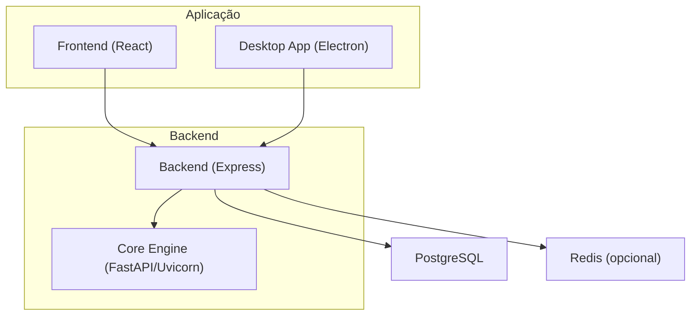
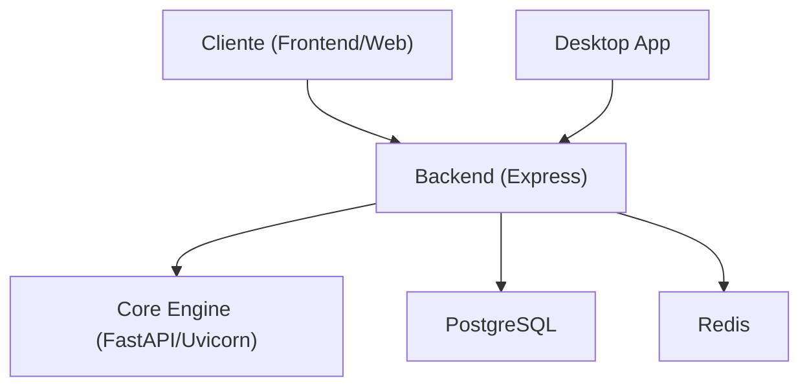
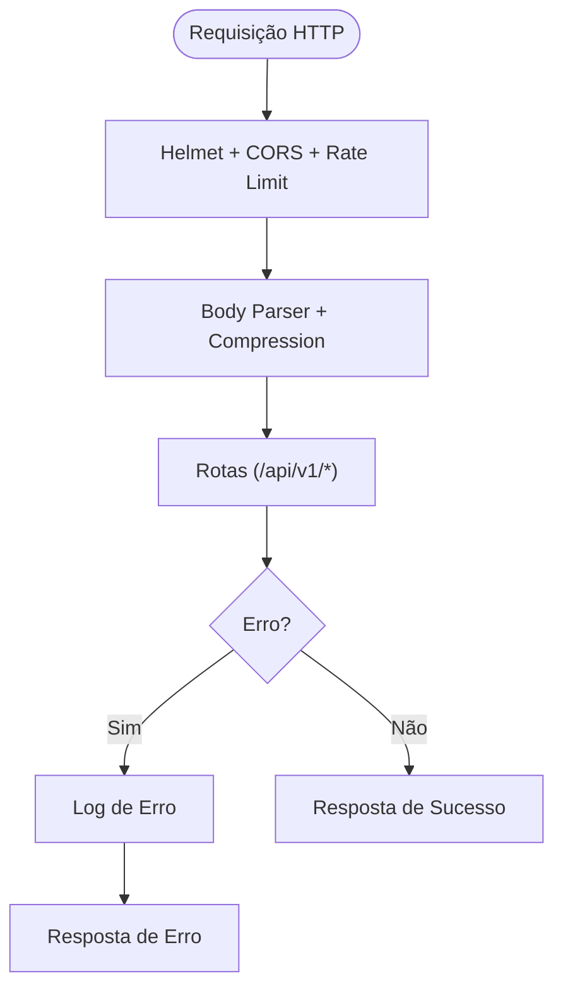
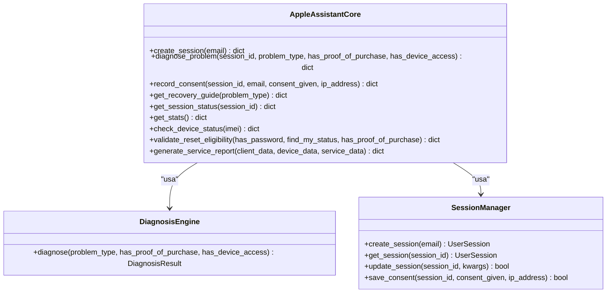
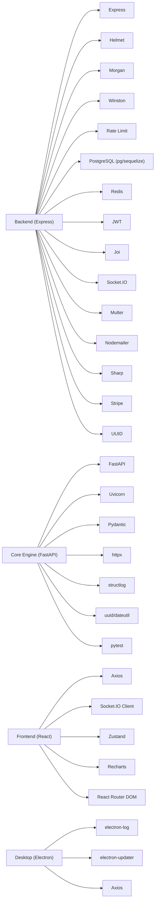
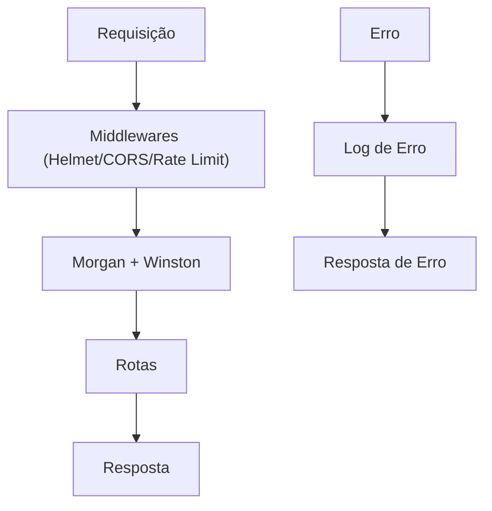

# Deploy em Produção

<cite>
**Arquivos Referenciados Neste Documento**
- [README.md](file://README.md)
- [backend/src/app.js](file://backend/src/app.js)
- [backend/package.json](file://backend/package.json)
- [frontend/package.json](file://frontend/package.json)
- [desktop/electron-app/package.json](file://desktop/electron-app/package.json)
- [core-engine/python/main.py](file://core-engine/python/main.py)
- [core-engine/python/requirements.txt](file://core-engine/python/requirements.txt)
- [database/schema.sql](file://database/schema.sql)
- [database/migrations/001_initial_schema.sql](file://database/migrations/001_initial_schema.sql)
</cite>

## Sumário
1. [Introdução](#introdução)
2. [Estrutura do Projeto](#estrutura-do-projeto)
3. [Componentes-Chave](#componentes-chave)
4. [Visão Geral da Arquitetura](#visão-geral-da-arquitetura)
5. [Análise Detalhada dos Componentes](#análise-detalhada-dos-componentes)
6. [Análise de Dependências](#análise-de-dependências)
7. [Considerações de Desempenho](#considerações-de-desempenho)
8. [Guia de Implantação e Build](#guia-de-implantação-e-build)
9. [Scripts de Deploy Automático](#scripts-de-deploy-automático)
10. [Configurações de Container Docker](#configurações-de-container-docker)
11. [Orquestração com Kubernetes](#orquestração-com-kubernetes)
12. [Procedimentos de Atualização e Rollback](#procedimentos-de-atualização-e-rollback)
13. [Gestão de Logs em Produção](#gestão-de-logs-em-produção)
14. [Conclusão](#conclusão)

## Introdução
Este documento apresenta um guia abrangente para o deploy em produção do Bay-RSET Tool, com foco em configurações de produção, servidores recomendados, balanceadores de carga, arquitetura de implantação, processos de build, otimizações de desempenho, configurações de segurança, scripts de deploy automático, configurações de container Docker e orquestração com Kubernetes. Além disso, inclui procedimentos de atualização sem downtime, rollback estratégico e gerenciamento de logs em produção.

## Estrutura do Projeto
O projeto é composto por quatro componentes principais:
- Backend (Node.js): API REST com autenticação, rotas de sessões, diagnósticos, tickets e administração.
- Core Engine (Python): Motor de diagnóstico e lógica de negócio central.
- Frontend (React): Interface web para usuários e técnicos.
- Desktop App (Electron): Aplicativo desktop para instalação local.

**Diagrama fonte**
- [backend/src/app.js:15-122](file://backend/src/app.js#L15-L122)
- [core-engine/python/main.py:263-354](file://core-engine/python/main.py#L263-L354)
- [README.md:19-29](file://README.md#L19-L29)

**Seção fonte**
- [README.md:19-29](file://README.md#L19-L29)

## Componentes-Chave
- Backend (Express): Fornece endpoints REST, middleware de segurança, rate limiting, logging e roteamento modular.
- Core Engine (FastAPI/Uvicorn): Motor de diagnóstico, gerenciamento de sessões e geração de relatórios.
- Frontend (React): Interface de usuário com navegação, formulários e integração com WebSocket.
- Desktop App (Electron): Aplicativo desktop com build cross-platform e atualizações automáticas.
- Banco de dados: PostgreSQL com schema e migrações iniciais.
- Redis: Opcional, para cache e sessões.

**Seção fonte**
- [backend/src/app.js:24-32](file://backend/src/app.js#L24-L32)
- [core-engine/python/main.py:263-354](file://core-engine/python/main.py#L263-L354)
- [frontend/package.json:1-59](file://frontend/package.json#L1-L59)
- [desktop/electron-app/package.json:1-73](file://desktop/electron-app/package.json#L1-L73)
- [database/schema.sql](file://database/schema.sql)
- [database/migrations/001_initial_schema.sql](file://database/migrations/001_initial_schema.sql)

## Visão Geral da Arquitetura
A aplicação segue uma arquitetura de microsserviços com comunicação assíncrona e endpoints REST. O backend expõe uma API REST com autenticação JWT e proteção via Helmet. O Core Engine é um serviço Python com FastAPI e Uvicorn, consumido pelo backend. O frontend e desktop se conectam ao backend, enquanto o Core Engine pode ser exposto como um serviço separado.

**Diagrama fonte**
- [backend/src/app.js:111-121](file://backend/src/app.js#L111-L121)
- [core-engine/python/main.py:263-354](file://core-engine/python/main.py#L263-L354)

## Análise Detalhada dos Componentes

### Backend (Express)
- Configurações de ambiente: porta, JWT, URLs do Core Engine, banco de dados e Redis.
- Segurança: Helmet com CSP, CORS configurável, rate limiting, compressão e logging com Morgan e Winston.
- Rotas: autenticação, sessões, diagnósticos, tickets, usuários, administração e relatórios.
- Tratamento de erros: 404 e handler global com log de erros.
- Encerramento graceful: SIGTERM/SIGINT.

**Diagrama fonte**
- [backend/src/app.js:59-96](file://backend/src/app.js#L59-L96)
- [backend/src/app.js:148-172](file://backend/src/app.js#L148-L172)

**Seção fonte**
- [backend/src/app.js:24-32](file://backend/src/app.js#L24-L32)
- [backend/src/app.js:59-96](file://backend/src/app.js#L59-L96)
- [backend/src/app.js:111-121](file://backend/src/app.js#L111-L121)
- [backend/src/app.js:148-172](file://backend/src/app.js#L148-L172)

### Core Engine (FastAPI/Uvicorn)
- Classes principais: DiagnosisEngine, SessionManager, AppleAssistantCore.
- Tipos de problema: senha esquecida, verificação em duas etapas, bloqueio de ativação, conta bloqueada, dispositivo usado e reset com senha.
- Gerenciamento de sessões: criação, atualização e registro de consentimento.
- Diagnóstico: baseado em templates com severidade, tempo estimado e passos.
- Relatórios: estruturação de relatórios de serviço com dados de cliente, dispositivo e serviço.

**Diagrama fonte**
- [core-engine/python/main.py:76-213](file://core-engine/python/main.py#L76-L213)
- [core-engine/python/main.py:215-261](file://core-engine/python/main.py#L215-L261)
- [core-engine/python/main.py:263-460](file://core-engine/python/main.py#L263-L460)

**Seção fonte**
- [core-engine/python/main.py:76-213](file://core-engine/python/main.py#L76-L213)
- [core-engine/python/main.py:215-261](file://core-engine/python/main.py#L215-L261)
- [core-engine/python/main.py:263-460](file://core-engine/python/main.py#L263-L460)

### Frontend (React)
- Scripts de build e desenvolvimento.
- Proxy configurado para apontar para o backend local durante desenvolvimento.
- Integração com Socket.IO e Axios.

**Seção fonte**
- [frontend/package.json:26-57](file://frontend/package.json#L26-L57)

### Desktop App (Electron)
- Build cross-platform com electron-builder.
- Publicação configurada para GitHub.
- Dependências para atualizações automáticas e logs.

**Seção fonte**
- [desktop/electron-app/package.json:34-71](file://desktop/electron-app/package.json#L34-L71)

## Análise de Dependências
- Backend depende de Express, Helmet, Morgan, Winston, Rate Limit, Redis, PostgreSQL (via pg/sequelize), JWT, Joi, Socket.IO, Multer, Nodemailer, Sharp, Stripe, UUID.
- Core Engine depende de FastAPI, Uvicorn, Pydantic, httpx, structlog, uuid, dateutil, pytest.
- Frontend depende de React, TailwindCSS, Axios, Socket.IO Client, Zusta, Recharts, React Router DOM.
- Desktop App depende de Electron, electron-updater, electron-log, socket.io-client.

**Diagrama fonte**
- [backend/package.json:23-46](file://backend/package.json#L23-L46)
- [core-engine/python/requirements.txt:4-26](file://core-engine/python/requirements.txt#L4-L26)
- [frontend/package.json:5-24](file://frontend/package.json#L5-L24)
- [desktop/electron-app/package.json:27-33](file://desktop/electron-app/package.json#L27-L33)

**Seção fonte**
- [backend/package.json:23-46](file://backend/package.json#L23-L46)
- [core-engine/python/requirements.txt:4-26](file://core-engine/python/requirements.txt#L4-L26)
- [frontend/package.json:5-24](file://frontend/package.json#L5-L24)
- [desktop/electron-app/package.json:27-33](file://desktop/electron-app/package.json#L27-L33)

## Considerações de Desempenho
- Compressão: Habilitada via compression.
- Rate limiting: Proteção contra excesso de requisições.
- Logging eficiente: Winston com arquivos e console.
- Conexões de banco de dados: Utilizar pool de conexões e conexões persistentes.
- Cache: Redis opcional para sessões e dados frequentemente acessados.
- CDN e assets estáticos: Para o frontend, otimizar imagens e minificação.
- Monitoramento: Adicionar métricas de CPU, memória e latência.

[Sem fonte específica, pois esta seção oferece orientações gerais]

## Guia de Implantação e Build
- Backend:
  - Instalar dependências com npm.
  - Configurar variáveis de ambiente (PORT, NODE_ENV, JWT_SECRET, DATABASE_URL, REDIS_URL, CORE_ENGINE_URL, ALLOWED_ORIGINS).
  - Build de produção com npm start.
- Core Engine:
  - Instalar dependências com pip.
  - Executar com Uvicorn em produção.
- Frontend:
  - Build com react-scripts build.
- Desktop App:
  - Build com electron-builder (cross-platform).

**Seção fonte**
- [README.md:31-71](file://README.md#L31-L71)
- [backend/src/app.js:24-32](file://backend/src/app.js#L24-L32)
- [core-engine/python/requirements.txt:4-26](file://core-engine/python/requirements.txt#L4-L26)
- [frontend/package.json:26-32](file://frontend/package.json#L26-L32)
- [desktop/electron-app/package.json:6-11](file://desktop/electron-app/package.json#L6-L11)

## Scripts de Deploy Automático
- Backend:
  - npm run start para iniciar em produção.
  - npm run seed para popular dados iniciais (se disponível).
- Core Engine:
  - uvicorn --host 0.0.0.0 --port 8000 main:app (ajuste conforme configuração).
- Frontend:
  - react-scripts build para gerar build de produção.
- Desktop App:
  - electron-builder para builds de Windows/Linux/macOS.

**Seção fonte**
- [backend/package.json:6-12](file://backend/package.json#L6-L12)
- [core-engine/python/main.py:654-700](file://core-engine/python/main.py#L654-L700)
- [frontend/package.json:26-32](file://frontend/package.json#L26-L32)
- [desktop/electron-app/package.json:8-11](file://desktop/electron-app/package.json#L8-L11)

## Configurações de Container Docker
- Backend:
  - Imagem base Node LTS.
  - Expor porta 3000.
  - Comandos: npm ci, npm run build (se necessário), npm run start.
  - Variáveis de ambiente: PORT, NODE_ENV, JWT_SECRET, DATABASE_URL, REDIS_URL, CORE_ENGINE_URL, ALLOWED_ORIGINS.
- Core Engine:
  - Imagem base Python 3.8+.
  - Expor porta 8000.
  - Comandos: pip install -r requirements.txt, uvicorn --host 0.0.0.0 --port 8000 main:app.
  - Variáveis de ambiente: (se houver).
- Frontend:
  - Imagem base nginx:alpine.
  - Copiar build do frontend para /usr/share/nginx/html.
  - Expor porta 80.
- Desktop App:
  - Não recomendado para container; manter como pacote instalável.

**Seção fonte**
- [backend/src/app.js:24-32](file://backend/src/app.js#L24-L32)
- [core-engine/python/requirements.txt:1-27](file://core-engine/python/requirements.txt#L1-L27)
- [frontend/package.json:26-32](file://frontend/package.json#L26-L32)

## Orquestração com Kubernetes
- Backend:
  - Deployment com replicas.
  - Service ClusterIP/LoadBalancer.
  - ConfigMap para variáveis de ambiente.
  - Secret para JWT_SECRET, DATABASE_URL, REDIS_URL.
- Core Engine:
  - Deployment com replicas.
  - Service ClusterIP.
  - ConfigMap/Secret conforme necessário.
- Frontend:
  - Deployment com nginx.
  - Service LoadBalancer.
- Storage:
  - PersistentVolumeClaim para logs (se necessário).
- Ingress:
  - Configurar Ingress com TLS e redirecionamentos.

[Sem fonte específica, pois esta seção apresenta recomendações gerais]

## Procedimentos de Atualização e Rollback
- Atualização sem downtime:
  - Rolling updates com replicas no Kubernetes.
  - Health checks (/health) antes de encerrar pods.
  - Zero-downtime com múltiplas instâncias.
- Rollback estratégico:
  - Manter histórico de versões com tags.
  - Reverter para imagem anterior rapidamente.
  - Reverter migrações de banco de dados se necessário.
- Pipeline:
  - Build → Testes → Deploy → Health Checks → Release.

**Seção fonte**
- [backend/src/app.js:100-108](file://backend/src/app.js#L100-L108)
- [backend/src/app.js:186-201](file://backend/src/app.js#L186-L201)

## Gestão de Logs em Produção
- Backend:
  - Winston com arquivos de erro e log combinado, além de console colorido.
  - Morgan integrado ao logger Winston.
- Core Engine:
  - Logging com StreamHandler e arquivo core_engine.log.
- Frontend:
  - Logs no navegador e em arquivos de build (se configurado).
- Desktop App:
  - electron-log para logs locais.

**Diagrama fonte**
- [backend/src/app.js:34-54](file://backend/src/app.js#L34-L54)
- [backend/src/app.js:95-96](file://backend/src/app.js#L95-L96)
- [backend/src/app.js:157-172](file://backend/src/app.js#L157-L172)

**Seção fonte**
- [backend/src/app.js:34-54](file://backend/src/app.js#L34-L54)
- [backend/src/app.js:95-96](file://backend/src/app.js#L95-L96)
- [backend/src/app.js:157-172](file://backend/src/app.js#L157-L172)
- [core-engine/python/main.py:22-32](file://core-engine/python/main.py#L22-L32)

## Conclusão
O Bay-RSET Tool pode ser implantado em produção com uma arquitetura robusta e escalável. O backend fornece uma API segura e eficiente, o Core Engine centraliza a lógica de diagnóstico, o frontend oferece uma experiência rica e o desktop permite instalação local. Recomenda-se utilizar Docker e Kubernetes para containerização e orquestração, adotar práticas de segurança com Helmet e JWT, e implementar logs estruturados com Winston e structlog. Para atualizações sem downtime, utilize rolling updates e health checks, e mantenha um plano de rollback estratégico.