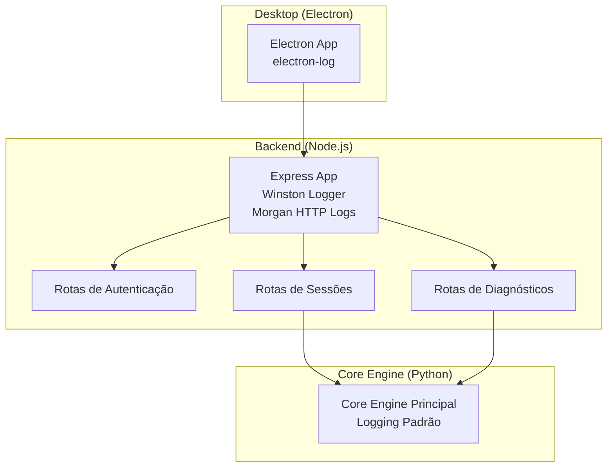
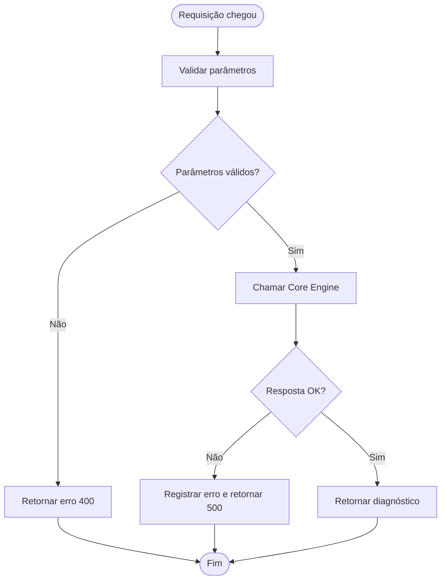
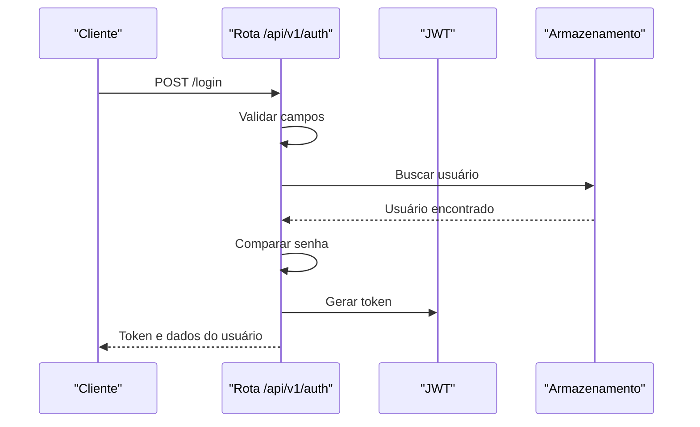
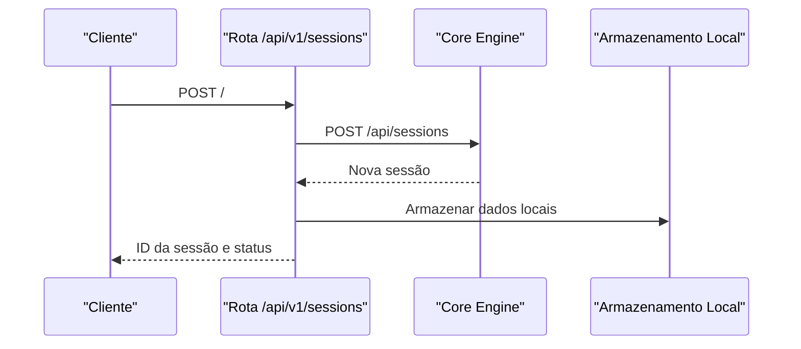

# Monitoramento e Logging

<cite>
**Arquivos referenciados neste documento**
- [backend/package.json](file://backend/package.json)
- [backend/src/app.js](file://backend/src/app.js)
- [backend/src/routes/auth.js](file://backend/src/routes/auth.js)
- [backend/src/routes/sessions.js](file://backend/src/routes/sessions.js)
- [backend/src/routes/diagnosis.js](file://backend/src/routes/diagnosis.js)
- [core-engine/python/main.py](file://core-engine/python/main.py)
- [desktop/electron-app/package.json](file://desktop/electron-app/package.json)
- [frontend/package.json](file://frontend/package.json)
</cite>

## Sumário
- Introdução
- Estrutura do projeto
- Componentes de monitoramento e logging
- Métricas críticas e alertas
- Health checks e monitoramento de performance
- Integrações com sistemas externos
- Dashboards e análise de logs
- Troubleshooting baseado em logs e métricas
- Conclusão

## Introdução
Este documento apresenta uma visão abrangente do sistema de monitoramento e logging do Bay-RSET Tool. Ele documenta as soluções de observabilidade implementadas no backend Node.js com Winston, nos componentes Python do Core Engine, e no Electron Desktop, incluindo logs estruturados, níveis de severidade, health checks, métricas críticas, e orientações para integração com ferramentas externas como Prometheus, Grafana e Sentry. Também oferece procedimentos práticos de troubleshooting baseados em logs e métricas.

## Estrutura do projeto
O projeto é composto por três camadas principais:
- Backend (Node.js): API REST com logging estruturado, rate limiting, CORS, Helmet e rotas de autenticação, sessões e diagnósticos.
- Core Engine (Python): Motor de diagnóstico, gerenciamento de sessões e geração de relatórios, com logging padrão.
- Desktop (Electron): Aplicativo desktop com logging via electron-log e integração com sockets.

**Diagrama fonte**
- [backend/src/app.js:15-204](file://backend/src/app.js#L15-L204)
- [backend/src/routes/auth.js:1-183](file://backend/src/routes/auth.js#L1-L183)
- [backend/src/routes/sessions.js:1-249](file://backend/src/routes/sessions.js#L1-L249)
- [backend/src/routes/diagnosis.js:1-173](file://backend/src/routes/diagnosis.js#L1-L173)
- [core-engine/python/main.py:22-32](file://core-engine/python/main.py#L22-L32)
- [desktop/electron-app/package.json:27-33](file://desktop/electron-app/package.json#L27-L33)

**Seção fonte**
- [backend/src/app.js:15-204](file://backend/src/app.js#L15-L204)
- [core-engine/python/main.py:22-32](file://core-engine/python/main.py#L22-L32)
- [desktop/electron-app/package.json:27-33](file://desktop/electron-app/package.json#L27-L33)

## Componentes de monitoramento e logging

### Backend (Node.js)
- Logger estruturado com Winston:
  - Níveis: info, error.
  - Formato JSON com timestamp e stack de erros.
  - Destinos: arquivo error.log (apenas erros), combined.log (todos), console colorido.
- Logging HTTP:
  - Morgan integrado ao logger Winston, gravando todas as requisições no formato “combined”.
- Segurança e proteção:
  - Helmet com CSP configurado.
  - CORS com origens permitidas via variáveis de ambiente.
  - Rate limiting global e específico para autenticação.
- Tratamento de erros:
  - Handler global que registra erros com stack e informações da requisição.
  - Resposta diferenciada entre produção e desenvolvimento.
- Health check:
  - Endpoint GET /health com status, timestamp, versão e ambiente.

**Seção fonte**
- [backend/src/app.js:34-54](file://backend/src/app.js#L34-L54)
- [backend/src/app.js:95-96](file://backend/src/app.js#L95-L96)
- [backend/src/app.js:100-108](file://backend/src/app.js#L100-L108)
- [backend/src/app.js:157-172](file://backend/src/app.js#L157-L172)
- [backend/src/app.js:176-184](file://backend/src/app.js#L176-L184)

### Core Engine (Python)
- Logging padrão:
  - Nível INFO, formato com timestamp, nome do logger, nível e mensagem.
  - Saída para stdout e arquivo core_engine.log.
- Níveis de severidade:
  - Enumerados em SeverityLevel: low, medium, high.
- Diagnósticos e sessões:
  - Registros detalhados de criação de sessões, diagnósticos e atualizações.
- Métricas de sistema:
  - Estatísticas de sessões, consentimentos e diagnósticos disponíveis via endpoint no backend.

**Seção fonte**
- [core-engine/python/main.py:22-32](file://core-engine/python/main.py#L22-L32)
- [core-engine/python/main.py:45-50](file://core-engine/python/main.py#L45-L50)
- [core-engine/python/main.py:215-261](file://core-engine/python/main.py#L215-L261)
- [core-engine/python/main.py:448-458](file://core-engine/python/main.py#L448-L458)

### Desktop (Electron)
- Dependências:
  - electron-log para logging no processo principal e renderer.
- Integração:
  - Socket.IO client para comunicação em tempo real com o backend.

**Seção fonte**
- [desktop/electron-app/package.json:27-33](file://desktop/electron-app/package.json#L27-L33)

## Métricas críticas e alertas

### Métricas disponíveis no backend
- Health check:
  - Endpoint GET /health retorna status, timestamp, versão e ambiente.
- Estatísticas do Core Engine:
  - Endpoint GET /api/v1/sessions/stats/overview delega ao Core Engine.
  - Métricas coletadas: total de sessões, sessões ativas, consentimentos e diagnósticos completos, distribuição de tipos de problema.

**Seção fonte**
- [backend/src/app.js:100-108](file://backend/src/app.js#L100-L108)
- [backend/src/routes/sessions.js:230-246](file://backend/src/routes/sessions.js#L230-L246)
- [core-engine/python/main.py:448-458](file://core-engine/python/main.py#L448-L458)

### Alertas configuráveis
- Rate limiting:
  - Limite global de 100 requisições por 15 minutos.
  - Limite específico para login (5 tentativas em 15 minutos, pulando requisições bem-sucedidas).
- CORS e CSP:
  - Origens e endpoints conectados configurados para segurança.

**Seção fonte**
- [backend/src/app.js:78-88](file://backend/src/app.js#L78-L88)
- [backend/src/routes/auth.js:14-20](file://backend/src/routes/auth.js#L14-L20)
- [backend/src/app.js:60-70](file://backend/src/app.js#L60-L70)

## Health checks e monitoramento de performance

### Health check
- Endpoint GET /health:
  - Resposta contém status, timestamp, versão e ambiente.
- Recomendações:
  - Expor o endpoint em load balancers e orquestradores.
  - Configurar probes de liveness/readiness com polling periódico.

**Seção fonte**
- [backend/src/app.js:100-108](file://backend/src/app.js#L100-L108)

### Performance
- Middleware de compressão ativado.
- Limitação de tamanho de corpo das requisições.
- Logging HTTP estruturado para auditoria e análise de latência.

**Seção fonte**
- [backend/src/app.js:90-96](file://backend/src/app.js#L90-L96)
- [backend/src/app.js:91-93](file://backend/src/app.js#L91-L93)

## Integrações com sistemas externos

### Prometheus e Grafana
- O backend atualmente não exporta métricas Prometheus nativamente. Para integração:
  - Adicionar um exporter de métricas (ex: node_exporter + Prometheus, ou exporter personalizado).
  - Coletar métricas de saúde, latência, taxas de erro e uso de CPU/memória.
  - Criar dashboards no Grafana com painéis de saúde, taxas de erro, diagnósticos por tipo e distribuição de problemas.

### Sentry
- O backend não possui integração com Sentry. Para rastreamento de erros:
  - Integrar SDK do Sentry no Express.
  - Registrar contexto de requisição e capturar exceções não tratadas.
  - Configurar tags de ambiente, service e endpoint.

### Electron Desktop
- electron-log pode ser configurado para exportar logs para sistemas externos (ex: log shipping).
- Para monitoramento de falhas no desktop, considerar integração com Sentry no processo renderer.

**Seção fonte**
- [backend/package.json:23-46](file://backend/package.json#L23-L46)
- [desktop/electron-app/package.json:27-33](file://desktop/electron-app/package.json#L27-L33)

## Dashboards e análise de logs

### Logs estruturados
- Backend:
  - Arquivos: logs/error.log e logs/combined.log.
  - Console colorido para desenvolvimento.
- Core Engine:
  - Arquivo core_engine.log com registros de diagnósticos e sessões.

### Análise de logs
- Ferramentas sugeridas:
  - ELK Stack (Elasticsearch, Logstash, Kibana) ou Graylog.
- Abordagem:
  - Parser de logs no formato JSON (backend) e no formato padrão (Core Engine).
  - Filtros por service, level, endpoint, erro e IP.

### Dashboards
- No Grafana:
  - Painel de saúde (/health).
  - Taxa de erros por rota.
  - Distribuição de diagnósticos por tipo.
  - Tempo médio de diagnóstico (medir latência nas chamadas ao Core Engine).

**Seção fonte**
- [backend/src/app.js:34-54](file://backend/src/app.js#L34-L54)
- [core-engine/python/main.py:22-30](file://core-engine/python/main.py#L22-L30)

## Troubleshooting baseado em logs e métricas

### Etapas iniciais
- Verificar health check:
  - Acessar /health e confirmar status “healthy”.
- Analisar logs:
  - Backend: revisar logs/error.log e logs/combined.log.
  - Core Engine: revisar core_engine.log.
- Verificar CORS e CSP:
  - Confirmar origens permitidas e endpoints conectados.

### Cenários comuns
- Erros 401/403 em rotas protegidas:
  - Verificar tokens JWT e middleware de autenticação.
- Falhas na criação de sessões:
  - Revisar logs do Core Engine e respostas do endpoint /api/sessions.
- Diagnósticos com erro:
  - Verificar payload e respostas do endpoint /api/v1/diagnosis.

### Fluxo de diagnóstico de problemas

**Diagrama fonte**
- [backend/src/routes/diagnosis.js:14-69](file://backend/src/routes/diagnosis.js#L14-L69)

### Sequência de autenticação

**Diagrama fonte**
- [backend/src/routes/auth.js:97-143](file://backend/src/routes/auth.js#L97-L143)

### Sequência de criação de sessão

**Diagrama fonte**
- [backend/src/routes/sessions.js:39-88](file://backend/src/routes/sessions.js#L39-L88)

## Conclusão
O Bay-RSET Tool possui uma base sólida de logging estruturado tanto no backend quanto no Core Engine, além de um health check básico e proteções de segurança. Para uma observabilidade avançada, recomenda-se integrar Prometheus/Grafana para métricas e Sentry para rastreamento de erros, expandindo os logs com campos adicionais e dashboards customizados. O troubleshooting pode ser acelerado com análise de logs estruturados e acompanhamento de métricas de saúde e performance.