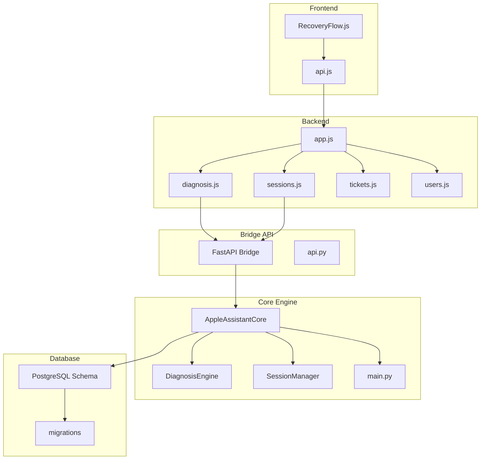
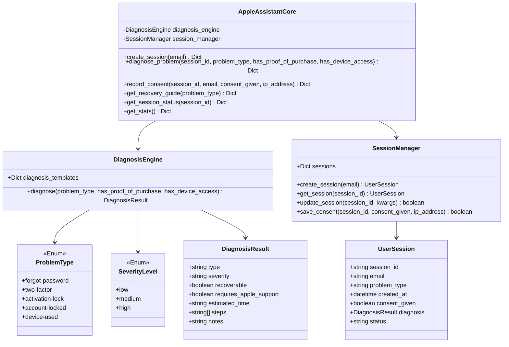
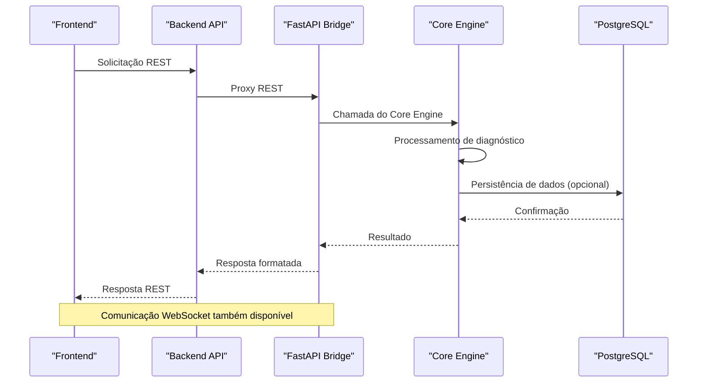
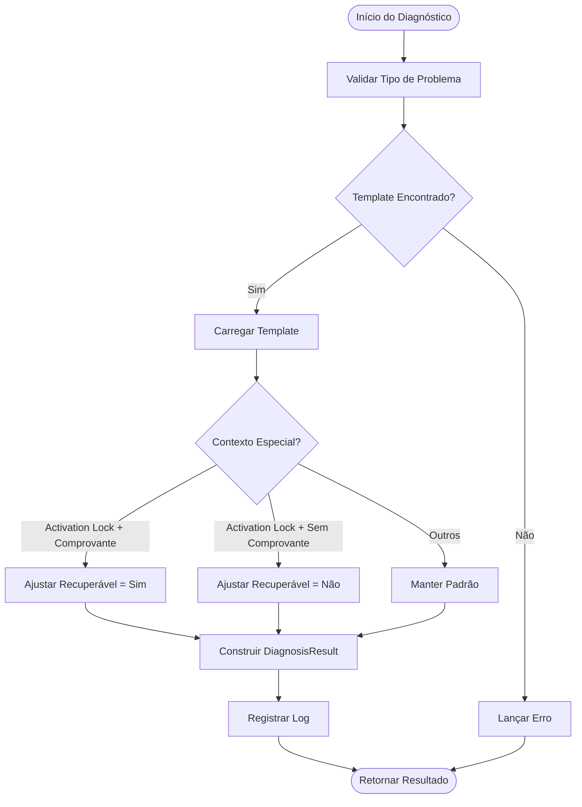
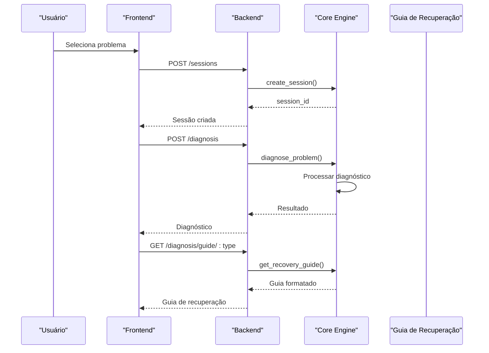
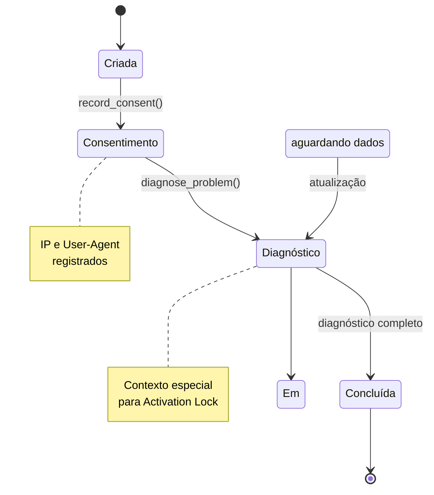
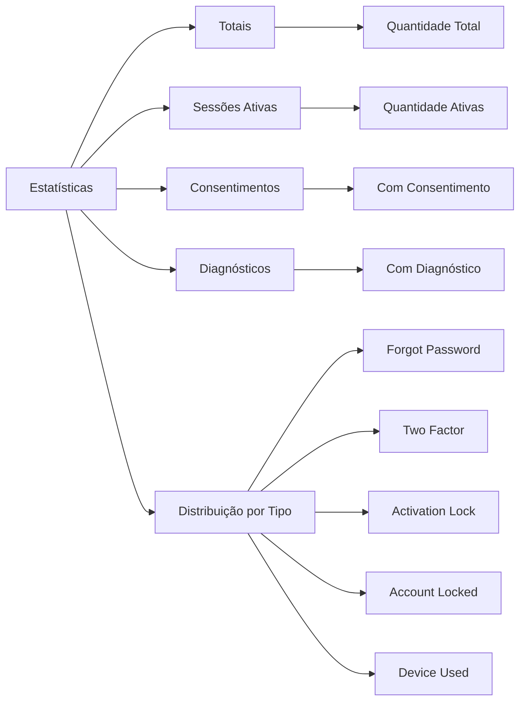
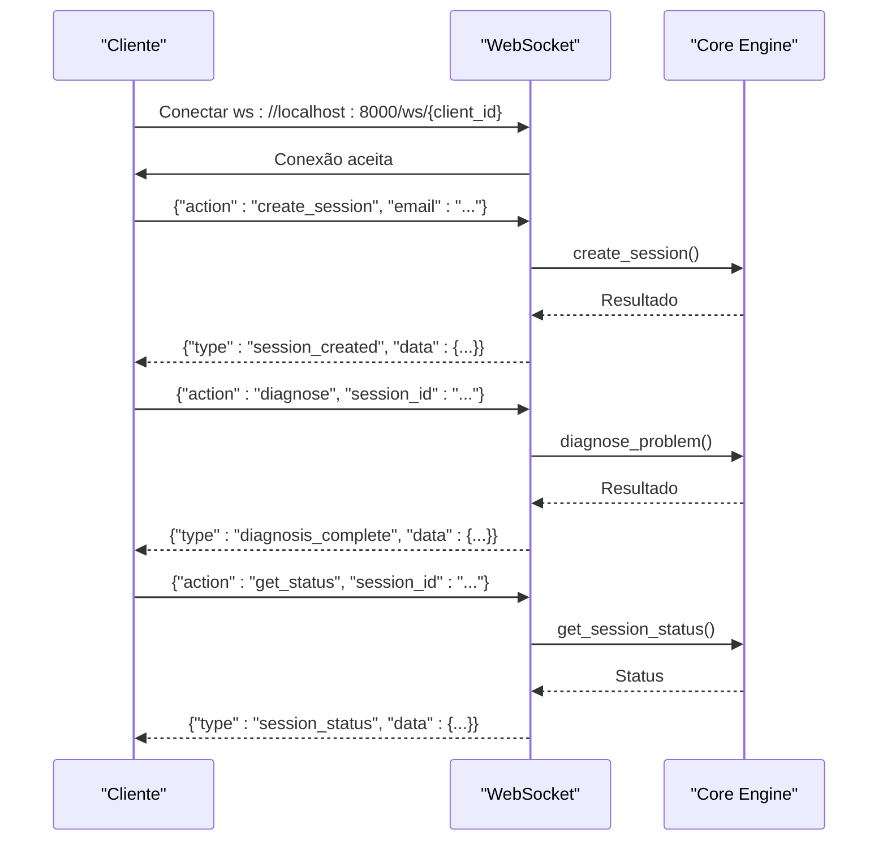

# Motor de Diagnóstico Python

<cite>
**Arquivos Referenciados neste Documento**
- [main.py](file://core-engine/python/main.py)
- [api.py](file://core-engine/bridge/api.py)
- [requirements.txt](file://core-engine/python/requirements.txt)
- [app.js](file://backend/src/app.js)
- [diagnosis.js](file://backend/src/routes/diagnosis.js)
- [sessions.js](file://backend/src/routes/sessions.js)
- [tickets.js](file://backend/src/routes/tickets.js)
- [users.js](file://backend/src/routes/users.js)
- [schema.sql](file://database/schema.sql)
- [001_initial_schema.sql](file://database/migrations/001_initial_schema.sql)
- [RecoveryFlow.js](file://frontend/src/pages/RecoveryFlow.js)
- [api.js](file://frontend/src/services/api.js)
- [README.md](file://README.md)
</cite>

## Sumário
- [Introdução](#introdução)
- [Estrutura do Projeto](#estrutura-do-projeto)
- [Componentes Principais](#componentes-principais)
- [Visão Geral da Arquitetura](#visão-geral-da-arquitetura)
- [Análise Detalhada dos Componentes](#análise-detalhada-dos-componentes)
- [Fluxos de Diagnóstico e Recuperação Guiada](#fluxos-de-diagnóstico-e-recuperação-guiada)
- [Gerenciamento de Sessões](#gerenciamento-de-sessões)
- [Estatísticas do Sistema](#estatísticas-do-sistema)
- [Integração com a API REST](#integração-com-a-api-rest)
- [Exemplos de Casos de Uso](#exemplos-de-casos-de-uso)
- [Regras de Negócio](#regras-de-negócio)
- [Extensibilidade e Personalização](#extensibilidade-e-personalização)
- [Considerações de Desempenho](#considerações-de-desempenho)
- [Guia de Solução de Problemas](#guia-de-solução-de-problemas)
- [Conclusão](#conclusão)

## Introdução
O motor de diagnóstico Python é o cérebro do sistema de assistência de recuperação Apple ID. Ele fornece:
- Tipos de problemas e severidade padronizados
- Algoritmos de diagnóstico baseados em templates
- Fluxos de recuperação guiada
- Gerenciamento de sessões de usuário
- Estatísticas do sistema
- Integração com a API REST e WebSocket

O sistema segue rigorosamente os processos oficiais da Apple, evitando bypass ou desbloqueio ilegal.

**Seção fonte**
- [README.md:1-108](file://README.md#L1-L108)

## Estrutura do Projeto
O projeto segue uma arquitetura modular com três camadas principais:



**Diagrama fonte**
- [main.py:246-450](file://core-engine/python/main.py#L246-L450)
- [api.py:105-135](file://core-engine/bridge/api.py#L105-L135)
- [app.js:98-134](file://backend/src/app.js#L98-L134)

**Seção fonte**
- [README.md:19-29](file://README.md#L19-L29)

## Componentes Principais
O motor de diagnóstico é composto pelas seguintes classes principais:



**Diagrama fonte**
- [main.py:35-450](file://core-engine/python/main.py#L35-L450)

**Seção fonte**
- [main.py:35-450](file://core-engine/python/main.py#L35-L450)

## Visão Geral da Arquitetura
A arquitetura segue o padrão de microserviços com comunicação assíncrona:



**Diagrama fonte**
- [api.py:137-304](file://core-engine/bridge/api.py#L137-L304)
- [main.py:246-450](file://core-engine/python/main.py#L246-L450)

## Análise Detalhada dos Componentes

### Engine de Diagnóstico
O DiagnosisEngine é responsável por:
- Armazenar templates de diagnóstico para diferentes tipos de problemas
- Aplicar lógica de negócios baseada em contexto
- Gerar resultados padronizados



**Diagrama fonte**
- [main.py:152-195](file://core-engine/python/main.py#L152-L195)

**Seção fonte**
- [main.py:75-195](file://core-engine/python/main.py#L75-L195)

### Gerenciador de Sessões
O SessionManager gerencia o ciclo de vida das sessões:
- Criação de sessões com IDs únicos
- Atualização de dados em tempo real
- Registro de consentimento com IP e timestamp

**Seção fonte**
- [main.py:198-244](file://core-engine/python/main.py#L198-L244)

### Core Engine Principal
O AppleAssistantCore coordena todas as operações:
- Criação e gerenciamento de sessões
- Execução de diagnósticos
- Registro de consentimento
- Geração de guias de recuperação
- Coleta de estatísticas

**Seção fonte**
- [main.py:246-450](file://core-engine/python/main.py#L246-L450)

## Fluxos de Diagnóstico e Recuperação Guiada

### Fluxo de Diagnóstico Completo


**Diagrama fonte**
- [RecoveryFlow.js:39-106](file://frontend/src/pages/RecoveryFlow.js#L39-L106)
- [api.py:168-293](file://core-engine/bridge/api.py#L168-L293)

### Tipos de Problemas e Severidade
O sistema suporta cinco tipos de problemas com severidade padronizada:

| Tipo | Severidade | Recuperável | Suporte Apple | Exemplo de Tempo |
|------|------------|-------------|---------------|------------------|
| forgot-password | Baixa | Sim | Não | 15-30 minutos |
| two-factor | Média | Sim | Sim | 1-3 dias |
| activation-lock | Alta | Depende | Sim | 3-7 dias (comprovante) |
| account-locked | Média | Sim | Sim | 24-48 horas |
| device-used | Alta | Normalmente não | Sim | Variável |

**Seção fonte**
- [main.py:35-150](file://core-engine/python/main.py#L35-L150)

## Gerenciamento de Sessões
O sistema implementa um gerenciamento completo de sessões:



**Diagrama fonte**
- [main.py:415-429](file://core-engine/python/main.py#L415-L429)

**Seção fonte**
- [main.py:198-244](file://core-engine/python/main.py#L198-L244)

## Estatísticas do Sistema
O sistema coleta métricas importantes:



**Diagrama fonte**
- [main.py:431-449](file://core-engine/python/main.py#L431-L449)

**Seção fonte**
- [main.py:431-449](file://core-engine/python/main.py#L431-L449)

## Integração com a API REST

### Endpoints REST Disponíveis
O sistema expõe os seguintes endpoints:

| Método | Endpoint | Descrição | Payload |
|--------|----------|-----------|---------|
| GET | / | Informações da API | - |
| GET | /health | Verificação de saúde | - |
| POST | /api/sessions | Criar sessão | email (opcional) |
| GET | /api/sessions/{session_id} | Status da sessão | - |
| POST | /api/diagnosis | Realizar diagnóstico | session_id, problem_type, context |
| POST | /api/consent | Registrar consentimento | session_id, email, consent_given |
| GET | /api/guides/{problem_type} | Obter guia de recuperação | - |
| GET | /api/stats | Estatísticas do sistema | - |

**Seção fonte**
- [api.py:137-304](file://core-engine/bridge/api.py#L137-L304)

### Comunicação WebSocket
Além da API REST, o sistema oferece comunicação em tempo real via WebSocket:



**Diagrama fonte**
- [api.py:336-400](file://core-engine/bridge/api.py#L336-L400)

**Seção fonte**
- [api.py:306-400](file://core-engine/bridge/api.py#L306-L400)

## Exemplos de Casos de Uso

### Caso de Uso 1: Recuperação de Senha
```mermaid
flowchart TD
User[Usuário] --> Select[Seleciona "Esqueci a Senha"]
Select --> Consent[Registra Consentimento]
Consent --> Diagnose[Realiza Diagnóstico]
Diagnose --> Result[Mostra Resultado]
Result --> Guide[Acessa Guia de Recuperação]
Guide --> Complete[Recuperação Concluída]
style User fill:#e1f5fe
style Complete fill:#c8e6c9
```

### Caso de Uso 2: Bloqueio de Ativação
```mermaid
flowchart TD
User[Usuário] --> Select[Seleciona "Bloqueio de Ativação"]
Select --> HasProof{"Tem Comprovante?"}
HasProof --> |Sim| Diagnose1[Diagnóstico Recuperável]
HasProof --> |Não| Diagnose2[Diagnóstico Não Recuperável]
Diagnose1 --> Guide1[Guia de Recuperação]
Diagnose2 --> Guide2[Guia de Alternativas]
Guide1 --> Support[Contata Suporte]
Guide2 --> Support
Support --> Complete[Processo Concluído]
style HasProof fill:#fff3e0
style Complete fill:#c8e6c9
```

**Diagrama fonte**
- [main.py:152-195](file://core-engine/python/main.py#L152-L195)

**Seção fonte**
- [RecoveryFlow.js:176-381](file://frontend/src/pages/RecoveryFlow.js#L176-L381)

## Regras de Negócio
O sistema implementa as seguintes regras de negócio:

### Regras de Diagnóstico
1. **Activation Lock**: Apenas recuperável se houver comprovante de compra
2. **Dois Fatores**: Processo mais longo mas recuperável
3. **Conta Bloqueada**: Geralmente temporária
4. **Dispositivo Usado**: Altamente restritivo, normalmente não recuperável

### Regras de Consentimento
1. **Propriedade Legítima**: O usuário deve confirmar ser o proprietário
2. **Registro de IP**: Todos os consentimentos registram o IP do cliente
3. **Timestamp**: Data e hora do consentimento são armazenadas
4. **Compliance**: Registro obrigatório para conformidade legal

### Regras de Sessão
1. **Tempo Limite**: Sessões expiram após 24 horas
2. **Status**: Estados válidos incluem created, consent_given, diagnosed, completed
3. **Persistência**: Dados são mantidos durante o ciclo de vida da sessão

**Seção fonte**
- [schema.sql:22-51](file://database/schema.sql#L22-L51)
- [main.py:152-195](file://core-engine/python/main.py#L152-L195)

## Extensibilidade e Personalização

### Adicionando Novos Tipos de Problema
Para adicionar um novo tipo de problema:

1. **Definir Enumeração**:
```python
class ProblemType(Enum):
    # ... outros tipos
    NEW_PROBLEM = "new-problem"
```

2. **Adicionar Template**:
```python
self.diagnosis_templates[ProblemType.NEW_PROBLEM] = {
    "type": "Novo Problema",
    "severity": SeverityLevel.LOW,
    "recoverable": True,
    "requires_apple_support": False,
    "estimated_time": "tempo estimado",
    "steps": ["passo 1", "passo 2"],
    "notes": "observações"
}
```

3. **Atualizar Frontend**:
```javascript
// Adicionar opção no frontend
{ id: 'new-problem', icon: <Icon />, label: 'Novo Problema' }
```

### Personalizando Fluxos de Recuperação
O sistema permite personalização através de:

1. **Templates de Diagnóstico**: Alterando o dicionário de templates
2. **Guia de Recuperação**: Modificando o método `get_recovery_guide`
3. **Validações**: Atualizando regras de negócio no `diagnose_problem`

**Seção fonte**
- [main.py:75-150](file://core-engine/python/main.py#L75-L150)
- [main.py:338-413](file://core-engine/python/main.py#L338-L413)

## Considerações de Desempenho
O motor de diagnóstico foi projetado com as seguintes considerações de desempenho:

### Complexidade Algorítmica
- **Diagnóstico**: O(1) - Acesso direto ao template
- **Busca de Sessão**: O(1) - Dicionário hash
- **Atualização de Sessão**: O(k) - k = número de campos atualizados
- **Estatísticas**: O(n) - n = número de sessões

### Otimizações Implementadas
1. **Cache em Memória**: Dados de sessão armazenados em dicionário
2. **Processamento Assíncrono**: Uso de asyncio para operações I/O
3. **Logging Eficiente**: Configuração otimizada de logging
4. **Validação de Dados**: Pydantic para validação rápida

### Escalabilidade
- **Horizontal Scaling**: Componentes stateless permitem múltiplas instâncias
- **Load Balancing**: Distribuição de carga entre instâncias
- **Caching**: Redis para persistência de sessões (configuração futura)

**Seção fonte**
- [requirements.txt:1-27](file://core-engine/python/requirements.txt#L1-L27)

## Guia de Solução de Problemas

### Erros Comuns e Soluções

#### Erro: "Tipo de problema inválido"
**Causa**: Valor inválido para problem_type
**Solução**: Verificar lista de tipos válidos
```python
# Valores válidos
valid_types = [
    'forgot-password',
    'two-factor', 
    'activation-lock',
    'account-locked',
    'device-used'
]
```

#### Erro: "Sessão não encontrada"
**Causa**: session_id inválido ou expirado
**Solução**: Criar nova sessão antes de realizar diagnóstico

#### Erro: "Core Engine não inicializado"
**Causa**: Bridge API não iniciada corretamente
**Solução**: Verificar logs do servidor FastAPI

### Monitoramento e Debugging
O sistema fornece:

1. **Logs Detalhados**: Nível INFO para operações principais
2. **Health Check**: Endpoint /health para verificação de integridade
3. **Estatísticas**: Métricas de uso e desempenho
4. **Tratamento de Erros**: Respostas padronizadas com códigos HTTP apropriados

**Seção fonte**
- [api.py:404-414](file://core-engine/bridge/api.py#L404-L414)

## Conclusão
O motor de diagnóstico Python é uma solução robusta e escalável para assistência de recuperação Apple ID. Seus principais pontos fortes incluem:

- **Arquitetura Modular**: Componentes bem definidos e facilmente extensíveis
- **Padronização**: Tipos de problemas e severidade uniformes
- **Conformidade Legal**: Registro completo de consentimentos
- **Desempenho**: Processamento eficiente com cache em memória
- **Integração**: Facilidade de integração com frontend e backend

O sistema segue rigorosamente os processos oficiais da Apple, garantindo que todas as recuperações sejam feitas de forma legítima e segura.