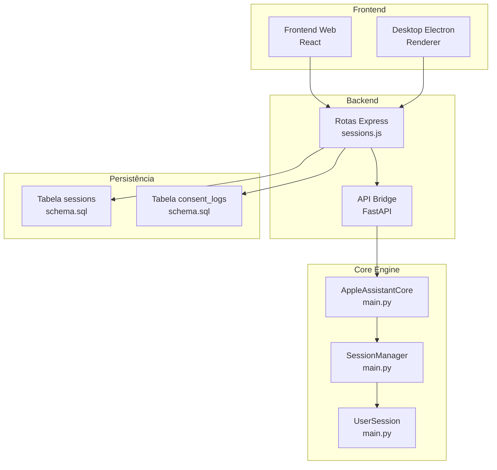
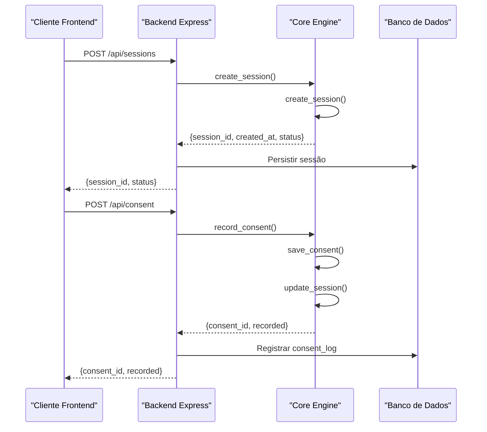
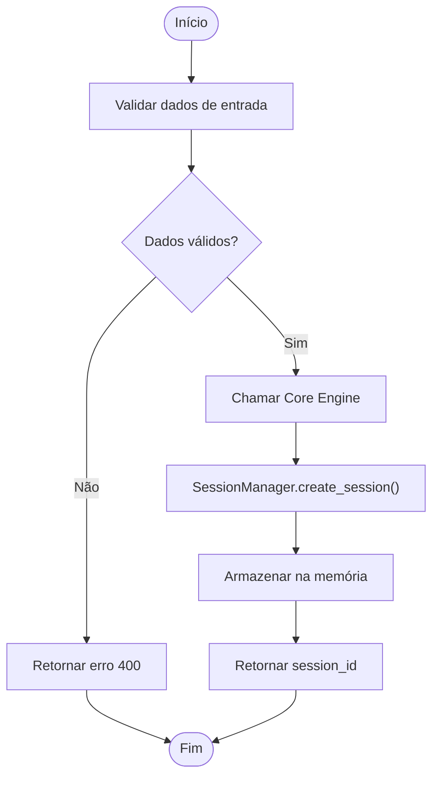
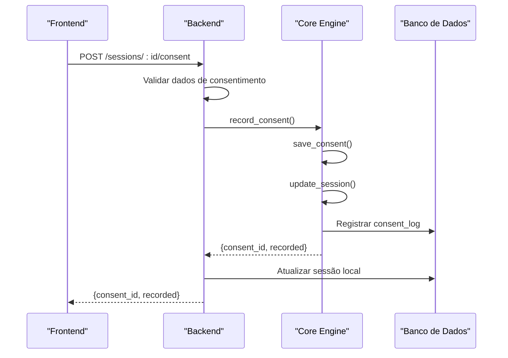
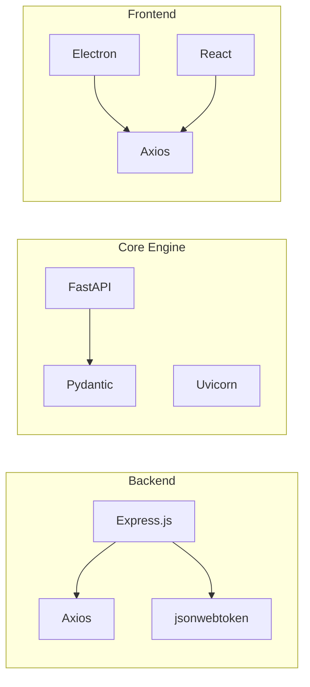

# Gerenciamento de Sessões

<cite>
**Arquivos Referenciados Neste Documento**
- [main.py](file://core-engine/python/main.py)
- [api.py](file://core-engine/bridge/api.py)
- [sessions.js](file://backend/src/routes/sessions.js)
- [schema.sql](file://database/schema.sql)
- [001_initial_schema.sql](file://database/migrations/001_initial_schema.sql)
- [api.js](file://frontend/src/services/api.js)
- [app.js](file://desktop/electron-app/renderer/app.js)
</cite>

## Sumário
1. [Introdução](#introdução)
2. [Estrutura do Projeto](#estrutura-do-projeto)
3. [Componentes Principais](#componentes-principais)
4. [Visão Geral da Arquitetura](#visão-geral-da-arquitetura)
5. [Análise Detalhada dos Componentes](#análise-detalhada-dos-componentes)
6. [Análise de Dependências](#análise-de-dependências)
7. [Considerações de Desempenho](#considerações-de-desempenho)
8. [Guia de Solução de Problemas](#guia-de-solução-de-problemas)
9. [Conclusão](#conclusão)

## Introdução
Este documento apresenta o sistema de gerenciamento de sessões do Core Engine, responsável por controlar o ciclo de vida das sessões de recuperação de contas Apple ID. O sistema permite criar sessões, registrar consentimentos legais, atualizar dados e manter o estado das sessões durante todo o processo de diagnóstico e recuperação.

## Estrutura do Projeto
O sistema de sessões é composto por três camadas principais:
- Backend (Node.js): Roteamento e integração com o Core Engine
- Core Engine (Python): Lógica de negócio e gerenciamento de sessões
- Frontend (React/Electron): Interface de usuário e interação com o backend



**Diagrama fonte**
- [sessions.js:1-249](file://backend/src/routes/sessions.js#L1-L249)
- [api.py:1-563](file://core-engine/bridge/api.py#L1-L563)
- [main.py:64-261](file://core-engine/python/main.py#L64-L261)
- [schema.sql:22-51](file://database/schema.sql#L22-L51)

**Seção fonte**
- [sessions.js:1-249](file://backend/src/routes/sessions.js#L1-L249)
- [api.py:1-563](file://core-engine/bridge/api.py#L1-L563)
- [main.py:64-261](file://core-engine/python/main.py#L64-L261)
- [schema.sql:22-51](file://database/schema.sql#L22-L51)

## Componentes Principais

### Classe UserSession
A classe UserSession representa uma única sessão de usuário no Core Engine, contendo todas as informações necessárias para o processo de recuperação.

**Propriedades da UserSession:**
- `session_id`: Identificador único da sessão (UUID)
- `email`: E-mail associado ao Apple ID (opcional)
- `problem_type`: Tipo de problema (forgot-password, two-factor, etc.)
- `created_at`: Timestamp de criação da sessão
- `consent_given`: Indicador de consentimento legal registrado
- `diagnosis`: Resultado do diagnóstico (opcional)
- `status`: Estado atual da sessão ("started")

**Estados da Sessão:**
1. **started**: Sessão criada, aguardando dados iniciais
2. **consent_given**: Consentimento legal registrado
3. **diagnosed**: Diagnóstico realizado
4. **in_recovery**: Em processo de recuperação
5. **completed**: Recuperação concluída
6. **closed**: Sessão encerrada

**Seção fonte**
- [main.py:64-74](file://core-engine/python/main.py#L64-L74)

### Classe SessionManager
O SessionManager é o componente responsável pelo gerenciamento completo de sessões, oferecendo métodos para criação, atualização e persistência de dados.

**Métodos do SessionManager:**

#### create_session(email: Optional[str] = None) -> UserSession
Cria uma nova sessão com os seguintes parâmetros:
- `email`: E-mail opcional do usuário
- Retorna: Instância de UserSession criada

#### get_session(session_id: str) -> Optional[UserSession]
Recupera uma sessão existente pelo ID:
- `session_id`: Identificador da sessão
- Retorna: UserSession ou None se não encontrada

#### update_session(session_id: str, **kwargs) -> bool
Atualiza dados de uma sessão existente:
- `session_id`: Identificador da sessão
- `kwargs`: Parâmetros a serem atualizados (email, problem_type, status, etc.)
- Retorna: True se atualizado com sucesso

#### save_consent(session_id: str, consent_given: bool, ip_address: str = "unknown") -> bool
Registra o consentimento legal do usuário:
- `session_id`: Identificador da sessão
- `consent_given`: Booleano indicando se o consentimento foi dado
- `ip_address`: Endereço IP do cliente (padrão: "unknown")
- Retorna: True se registrado com sucesso

**Seção fonte**
- [main.py:215-261](file://core-engine/python/main.py#L215-L261)

## Visão Geral da Arquitetura



**Diagrama fonte**
- [api.py:213-318](file://core-engine/bridge/api.py#L213-L318)
- [main.py:272-354](file://core-engine/python/main.py#L272-L354)
- [sessions.js:56-87](file://backend/src/routes/sessions.js#L56-L87)

## Análise Detalhada dos Componentes

### Fluxo de Criação de Sessão



**Diagrama fonte**
- [sessions.js:39-88](file://backend/src/routes/sessions.js#L39-L88)
- [main.py:222-233](file://core-engine/python/main.py#L222-L233)

### Fluxo de Registro de Consentimento



**Diagrama fonte**
- [sessions.js:161-207](file://backend/src/routes/sessions.js#L161-L207)
- [main.py:328-354](file://core-engine/python/main.py#L328-L354)
- [schema.sql:108-119](file://database/schema.sql#L108-L119)

### Exemplos Práticos

#### Exemplo 1: Criação de Sessão
```javascript
// Frontend (React)
const createSession = async (email, problemType) => {
  const response = await api.post('/sessions', {
    email: email,
    problemType: problemType
  });
  return response.data.session.id;
};

// Frontend (Electron)
const electronAPI.saveConsent = async (consentData) => {
  const response = await api.post(`/sessions/${sessionId}/consent`, consentData);
  return response.data.consent;
};
```

#### Exemplo 2: Atualização de Dados da Sessão
```javascript
// Backend PATCH /sessions/:id
const updateSession = async (sessionId, updates) => {
  const response = await api.patch(`/sessions/${sessionId}`, updates);
  return response.data.session;
};
```

#### Exemplo 3: Registro de Consentimento
```javascript
// Frontend
const registerConsent = async (sessionId, email, consentGiven) => {
  const response = await api.post(`/sessions/${sessionId}/consent`, {
    email: email,
    consentGiven: consentGiven,
    userAgent: navigator.userAgent
  });
  return response.data.consent;
};
```

**Seção fonte**
- [api.js:52-59](file://frontend/src/services/api.js#L52-L59)
- [app.js:148-170](file://desktop/electron-app/renderer/app.js#L148-L170)

## Análise de Dependências



**Diagrama fonte**
- [backend/package.json:23-46](file://backend/package.json#L23-L46)
- [core-engine/bridge/requirements.txt:4-22](file://core-engine/python/requirements.txt#L4-L22)

**Seção fonte**
- [backend/package.json:1-59](file://backend/package.json#L1-L59)
- [core-engine/python/requirements.txt:1-27](file://core-engine/python/requirements.txt#L1-L27)

## Considerações de Desempenho

### Persistência de Dados
O sistema atualmente utiliza:
- **Memória (Map)**: Para armazenamento temporário de sessões no backend (mock)
- **Banco de Dados PostgreSQL**: Para persistência real de sessões e logs
- **Redis**: Disponível como dependência para cache e sessões escaláveis

### Validação de Sessões
- **Tempo de Expiração**: 24 horas (configurável no schema)
- **Índices**: Criação de índices para otimizar consultas
- **Triggers**: Atualização automática do campo updated_at

### Melhorias Recomendadas
1. Substituir o mock de sessões por Redis/PostgreSQL
2. Implementar TTL para expiração automática
3. Adicionar paginação para listagem de sessões
4. Implementar cache para consultas frequentes

## Guia de Solução de Problemas

### Erros Comuns e Soluções

#### Erro 404 - Sessão Não Encontrada
**Causas possíveis:**
- ID de sessão inválido ou expirado
- Sessão já encerrada
- Erro de comunicação com o Core Engine

**Soluções:**
```javascript
// Verificar se a sessão existe antes de operar
const getSessionStatus = async (sessionId) => {
  try {
    const response = await api.get(`/sessions/${sessionId}`);
    return response.data.session;
  } catch (error) {
    if (error.response?.status === 404) {
      throw new Error('Sessão inválida ou expirada');
    }
    throw error;
  }
};
```

#### Erro 400 - Dados Inválidos
**Causas:**
- Formato de UUID inválido
- Tipos de problema não reconhecidos
- Validações do express-validator falharam

**Soluções:**
```javascript
// Validação de entrada no backend
router.post('/', [
  body('email').optional().isEmail(),
  body('problemType').optional().isIn([
    'forgot-password', 'two-factor', 'activation-lock'
  ])
], async (req, res) => {
  const errors = validationResult(req);
  if (!errors.isEmpty()) {
    return res.status(400).json({ errors: errors.array() });
  }
});
```

#### Erro 500 - Falha Interna
**Causas:**
- Falha na comunicação com o Core Engine
- Erro de conexão com o banco de dados
- Exceções não tratadas

**Soluções:**
```javascript
// Tratamento de erros global
@exception_handler(Exception)
async def global_exception_handler(request: Request, exc: Exception) {
  logger.error(f"Erro não tratado: {exc}", exc_info=True);
  return JSONResponse(
    status_code=500,
    content: {
      "error": "Erro interno do servidor",
      "detail": str(exc) if app.debug else "Contate o suporte técnico"
    }
  );
}
```

**Seção fonte**
- [sessions.js:90-120](file://backend/src/routes/sessions.js#L90-L120)
- [api.py:529-540](file://core-engine/bridge/api.py#L529-L540)

## Conclusão
O sistema de gerenciamento de sessões do Core Engine oferece uma arquitetura robusta e escalável para o gerenciamento de fluxos de recuperação de contas Apple ID. Com a separação clara entre backend, Core Engine e frontend, o sistema permite fácil manutenção e expansão. As implementações atuais fornecem uma base sólida para persistência de dados, validação de sessões e integração com o backend, podendo ser facilmente expandidas para atender às necessidades de produção.

As principais vantagens do sistema incluem:
- **Separation of concerns**: Claro delineamento entre camadas
- **Extensibilidade**: Facilidade para adicionar novos recursos
- **Segurança**: Validação de dados e tratamento de erros adequado
- **Monitoramento**: Logs detalhados e métricas de desempenho

Para produção, recomenda-se substituir o armazenamento em memória pelo PostgreSQL e implementar mecanismos adicionais de segurança e monitoramento.