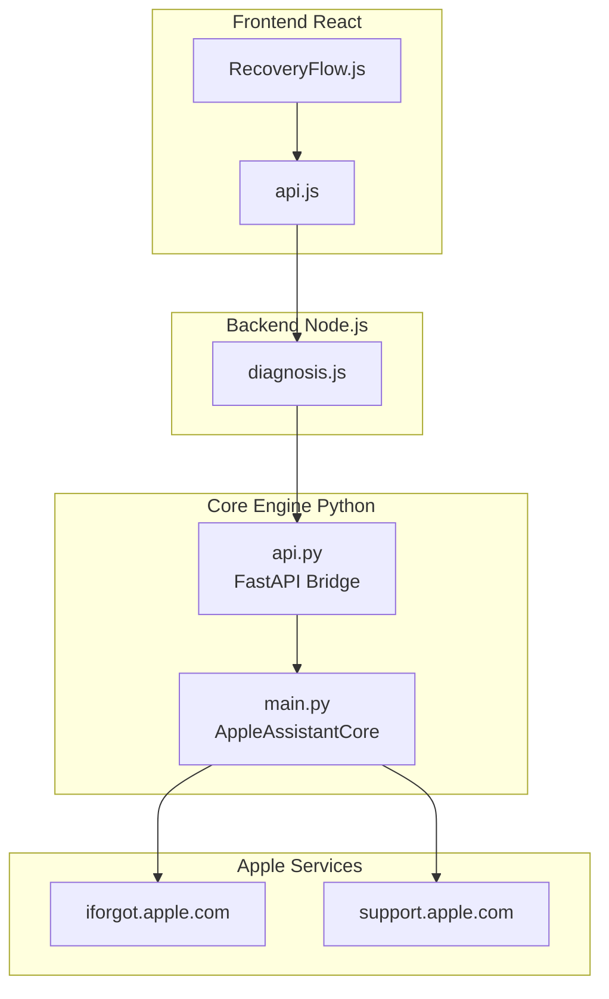
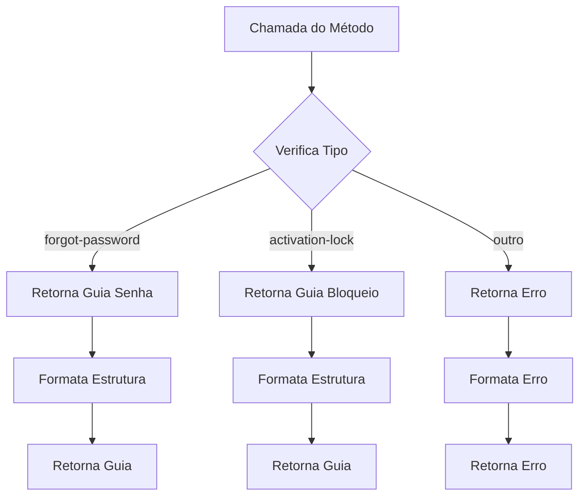
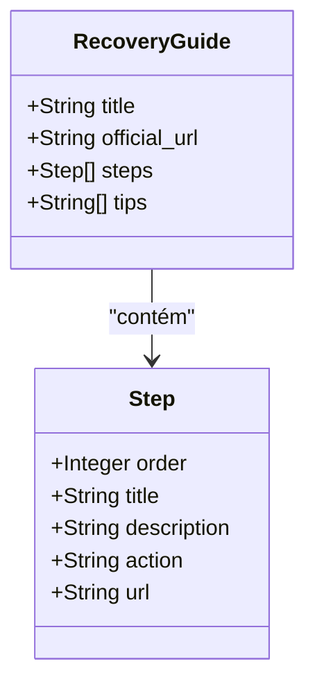
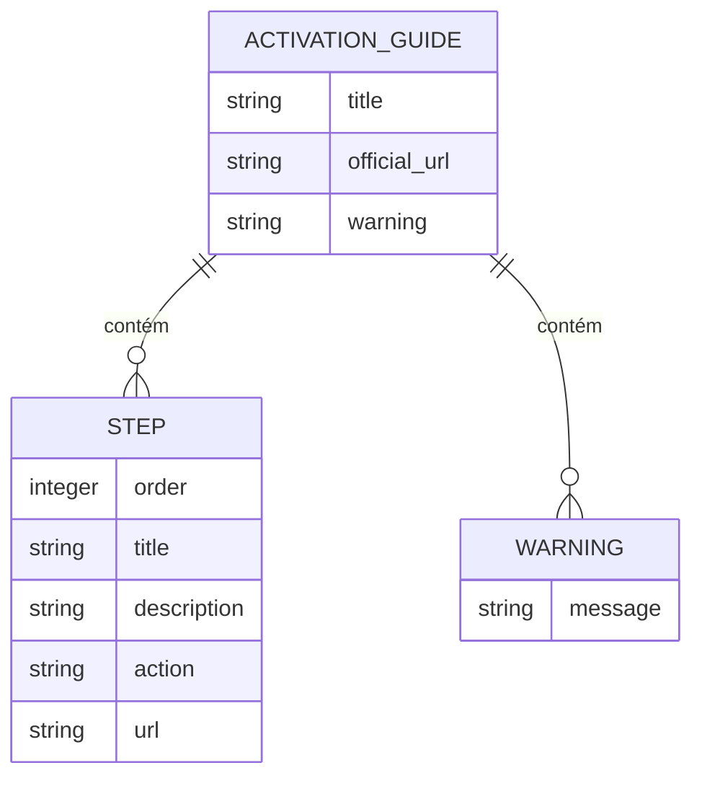
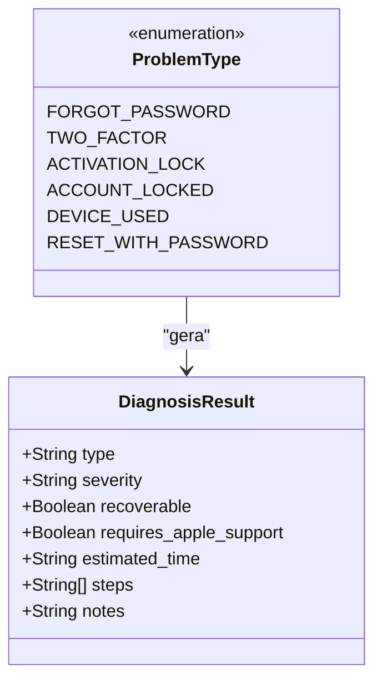
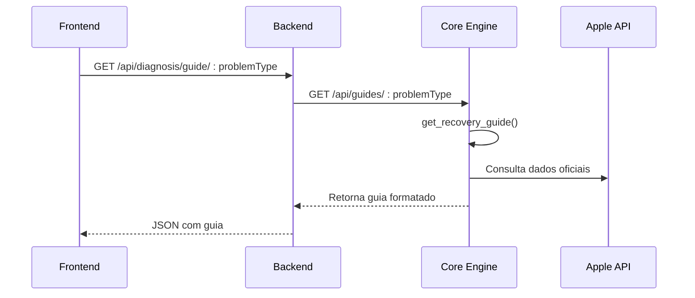
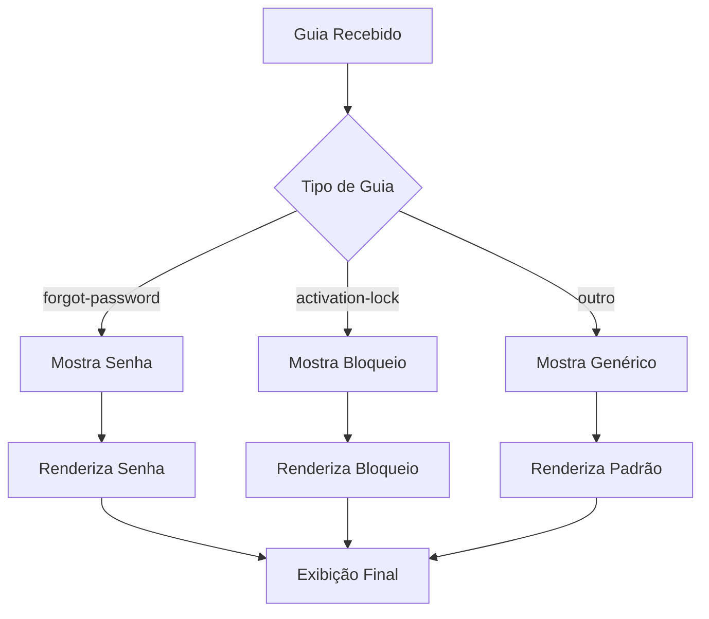

# Guias de Recuperação

<cite>
**Arquivos Referenciados neste Documento**
- [main.py](file://core-engine/python/main.py)
- [api.py](file://core-engine/bridge/api.py)
- [diagnosis.js](file://backend/src/routes/diagnosis.js)
- [RecoveryFlow.js](file://frontend/src/pages/RecoveryFlow.js)
- [api.js](file://frontend/src/services/api.js)
- [README.md](file://README.md)
</cite>

## Sumário
- [Introdução](#introdução)
- [Arquitetura Geral](#arquitetura-geral)
- [Método get_recovery_guide()](#método-get_recovery_guide)
- [Guias Disponíveis](#guias-disponíveis)
- [Estrutura de Dados](#estrutura-de-dados)
- [Fluxo de Integração](#fluxo-de-integração)
- [Exemplos de Uso](#exemplos-de-uso)
- [Desenvolvimento de Novos Guias](#desenvolvimento-de-novos-guias)
- [Personalização e Extensões](#personalização-e-extensões)
- [Considerações de Segurança](#considerações-de-segurança)
- [Conclusão](#conclusão)

## Introdução

O sistema de **Guias de Recuperação** é um componente crítico do Core Engine que fornece fluxos guiados e informações oficiais para resolução de problemas com contas Apple ID. Este módulo integra-se perfeitamente com toda a arquitetura do sistema, oferecendo soluções legítimas e seguindo rigorosamente os processos oficiais da Apple.

O sistema oferece dois guias principais:
- **Recuperação de Senha** (`forgot-password`)
- **Bloqueio de Ativação** (`activation-lock`)

## Arquitetura Geral



**Fontes**
- [RecoveryFlow.js:1-517](file://frontend/src/pages/RecoveryFlow.js#L1-L517)
- [api.py:1-563](file://core-engine/bridge/api.py#L1-L563)
- [main.py:1-701](file://core-engine/python/main.py#L1-L701)

## Método get_recovery_guide()

O método `get_recovery_guide()` é o coração do sistema de guias de recuperação. Ele faz parte da classe `AppleAssistantCore` e retorna estruturas de dados padronizadas para diferentes tipos de problemas.

### Implementação Principal



**Fontes**
- [main.py:355-431](file://core-engine/python/main.py#L355-L431)

### Estrutura de Retorno

O método retorna um objeto com a seguinte estrutura:

| Campo | Tipo | Descrição |
|-------|------|-----------|
| `title` | String | Título do guia |
| `official_url` | String | URL oficial da Apple |
| `steps` | Array | Passos detalhados |
| `tips` | Array | Dicas importantes |
| `warnings` | Array | Avisos de segurança |

## Guias Disponíveis

### 1. Recuperação de Senha (`forgot-password`)

#### Objetivo
Prover um fluxo guiado para redefinição de senha esquecida através do site oficial da Apple.

#### Recursos Oficiais
- **Site Principal**: [iforgot.apple.com](https://iforgot.apple.com)
- **Processo Oficial**: Verificação de identidade via e-mail ou SMS

#### Estrutura de Dados



**Fontes**
- [main.py:357-390](file://core-engine/python/main.py#L357-L390)

#### Passos Detalhados

1. **Acessar Site Oficial**
   - Acesso ao site iforgot.apple.com
   - Verificação de segurança HTTPS

2. **Identificação do Apple ID**
   - Digitação correta do e-mail cadastrado
   - Verificação de formatação

3. **Verificação de Identidade**
   - Escolha entre e-mail ou SMS
   - Recebimento e digitação do código

4. **Redefinição de Senha**
   - Criação de nova senha forte
   - Validação de critérios de segurança

#### Dicas Importantes

- **Segurança**: Nunca compartilhe sua senha com ninguém
- **Gerenciamento**: Use um gerenciador de senhas confiável
- **Autenticação**: Ative verificação em duas etapas após recuperação
- **Diversidade**: Use senhas únicas para cada serviço

#### Avisos de Segurança

- **Proteção**: Senha deve conter pelo menos 8 caracteres
- **Complexidade**: Incluir maiúsculas, números e símbolos
- **Privacidade**: Evite senhas óbvias ou baseadas em informações pessoais

### 2. Bloqueio de Ativação (`activation-lock`)

#### Objetivo
Fornecer orientações específicas para casos de Activation Lock, destacando soluções legítimas.

#### Recursos Oficiais
- **Suporte Apple**: [support.apple.com](https://support.apple.com)
- **Processo Legal**: Verificação de posse através de documentos

#### Estrutura de Dados



**Fontes**
- [main.py:391-424](file://core-engine/python/main.py#L391-L424)

#### Opções de Recuperação

##### Opção 1: Com Comprovante de Compra
**Requisitos**: Nota fiscal original, IMEI, número de série

**Processo**:
1. Preparar documentação
2. Acessar suporte Apple
3. Abrir chamado de remoção
4. Aguardar análise (3-7 dias úteis)

##### Opção 2: Sem Comprovante de Compra
**Status**: Dispositivo permanece bloqueado permanentemente

**Alternativas**:
- Entrar em contato com o vendedor imediatamente
- Verificar status do IMEI em listas de roubo
- Considerar ações legais se for golpe

#### Avisos Críticos

- **Métodos Ilegais**: Não existe bypass legítimo
- **Golpes**: Serviços que prometem desbloqueio são fraudulentos
- **Perda Permanente**: Sem comprovante, dispositivo permanece bloqueado

**Fontes**
- [RecoveryFlow.js:442-505](file://frontend/src/pages/RecoveryFlow.js#L442-L505)

## Estrutura de Dados

### Tipos de Problemas Suportados



**Fontes**
- [main.py:35-42](file://core-engine/python/main.py#L35-L42)
- [main.py:52-62](file://core-engine/python/main.py#L52-L62)

### Estrutura de Guia Padronizada

| Elemento | Obrigatório | Descrição |
|----------|-------------|-----------|
| `title` | Sim | Título descritivo do guia |
| `official_url` | Sim | Link para recurso oficial |
| `steps` | Sim | Array de passos estruturados |
| `tips` | Opcional | Dicas de segurança |
| `warnings` | Opcional | Avisos importantes |

## Fluxo de Integração

### Backend Integration Flow



**Fontes**
- [diagnosis.js:71-106](file://backend/src/routes/diagnosis.js#L71-L106)
- [api.py:320-338](file://core-engine/bridge/api.py#L320-L338)

### Frontend Presentation Flow



**Fontes**
- [RecoveryFlow.js:384-514](file://frontend/src/pages/RecoveryFlow.js#L384-L514)

## Exemplos de Uso

### Backend Implementation Example

```javascript
// Exemplo de chamada ao backend
const response = await axios.get('/api/diagnosis/guide/forgot-password');
const guide = response.data.guide;

console.log(guide.title); // "Recuperação de Senha"
console.log(guide.steps.length); // 4 passos
```

### Frontend Integration Example

```javascript
// Exemplo de renderização no frontend
function renderGuide(problemType) {
  switch(problemType) {
    case 'forgot-password':
      return <PasswordRecoveryGuide />;
    case 'activation-lock':
      return <ActivationLockGuide />;
    default:
      return <DefaultGuide />;
  }
}
```

### API Response Structure

```json
{
  "success": true,
  "guide": {
    "title": "Recuperação de Senha",
    "official_url": "https://iforgot.apple.com",
    "steps": [
      {
        "order": 1,
        "title": "Acessar site oficial",
        "description": "Visite iforgot.apple.com em um navegador seguro",
        "action": "external_link",
        "url": "https://iforgot.apple.com"
      }
    ],
    "tips": [
      "Nunca compartilhe sua senha",
      "Use autenticador de senhas"
    ]
  }
}
```

**Fontes**
- [api.js:320-338](file://core-engine/bridge/api.py#L320-L338)
- [diagnosis.js:92-97](file://backend/src/routes/diagnosis.js#L92-L97)

## Desenvolvimento de Novos Guias

### Passos para Adicionar um Novo Guia

1. **Atualizar o Core Engine**
   ```python
   # Em main.py, dentro do método get_recovery_guide()
   guides = {
       "novo-problema": {
           "title": "Título do Novo Guia",
           "official_url": "https://site-oficial.com",
           "steps": [
               {
                   "order": 1,
                   "title": "Primeiro Passo",
                   "description": "Descrição detalhada"
               }
           ]
       }
   }
   ```

2. **Atualizar Validações**
   ```javascript
   // Em diagnosis.js, na rota GET /guide/:problemType
   const validTypes = [
       'forgot-password',
       'activation-lock',
       'novo-problema' // Adicionar aqui
   ];
   ```

3. **Atualizar Frontend**
   ```javascript
   // Em RecoveryFlow.js, na função RecoveryGuide()
   if (problemType === 'novo-problema') {
       return <NovoGuia />;
   }
   ```

### Requisitos para Novos Guias

- **Legitimidade**: Baseado em processos oficiais da Apple
- **Precisão**: Informações atualizadas e verificadas
- **Segurança**: Não promover métodos ilegais
- **Clareza**: Passos simples e diretos

## Personalização e Extensões

### Personalização de Conteúdo

O sistema permite personalização através de:

1. **Substituição de URLs oficiais**
2. **Adição de dicas específicas**
3. **Modificação de avisos de segurança**
4. **Customização de cores e ícones**

### Extensões Possíveis

- **Tradução multilíngue**
- **Integração com sistemas de suporte**
- **Notificações automáticas**
- **Relatórios de acompanhamento**

## Considerações de Segurança

### Práticas Recomendadas

1. **Verificação de Identidade**
   - Confirmação de propriedade legítima
   - Registro de IP e timestamp
   - Consentimento explícito

2. **Proteção de Dados**
   - Criptografia de informações sensíveis
   - Limitação de acesso a dados
   - Logs de auditoria

3. **Conformidade Legal**
   - Seguimento rigoroso dos processos oficiais
   - Proibição de bypass ilegal
   - Documentação de procedimentos

### Avisos Importantes

- **Métodos Ilegais**: Qualquer tentativa de bypass é proibida
- **Golpes**: Alertar sobre serviços fraudulentos
- **Responsabilidade**: Garantir que usuários entendam os riscos

## Conclusão

O sistema de Guias de Recuperação representa uma solução completa e segura para resolução de problemas com contas Apple ID. Combinando processos oficiais da Apple com uma interface intuitiva, o sistema garante:

- **Segurança**: Baseado em métodos legítimos
- **Eficiência**: Fluxos guiados otimizados
- **Conformidade**: Rigoroso seguimento às políticas da Apple
- **Transparência**: Todos os processos são claramente explicados

A implementação do método `get_recovery_guide()` e sua integração com toda a arquitetura do sistema demonstra uma abordagem sólida para fornecer suporte técnico especializado de forma ética e eficaz.

---

**Fontes Adicionais**
- [README.md:1-108](file://README.md#L1-L108)
- [api.js:320-338](file://core-engine/bridge/api.py#L320-L338)
- [diagnosis.js:71-106](file://backend/src/routes/diagnosis.js#L71-L106)