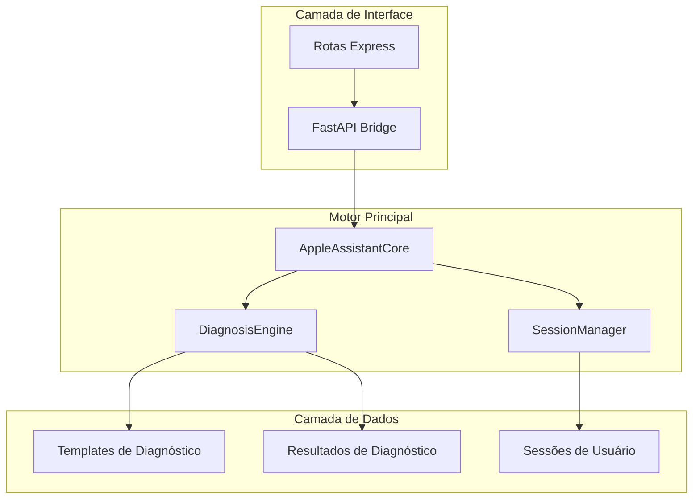
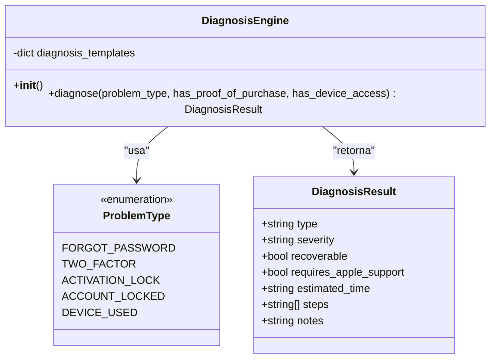
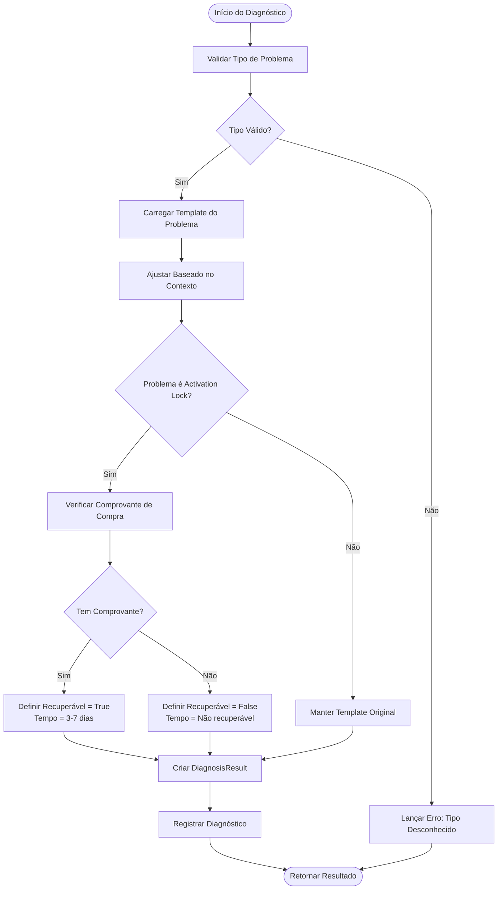
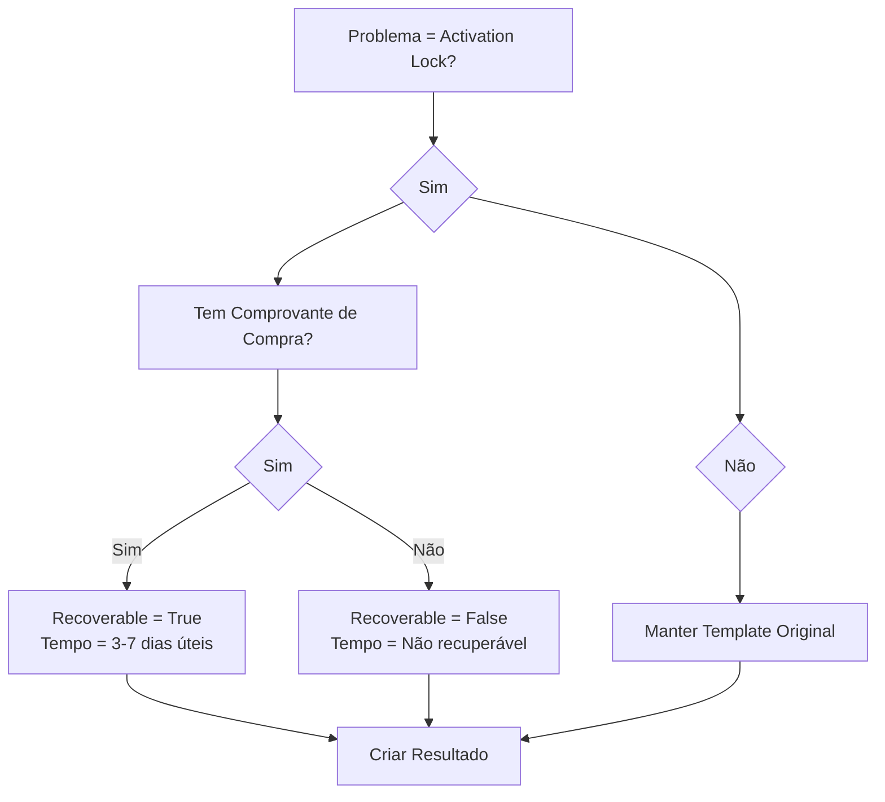
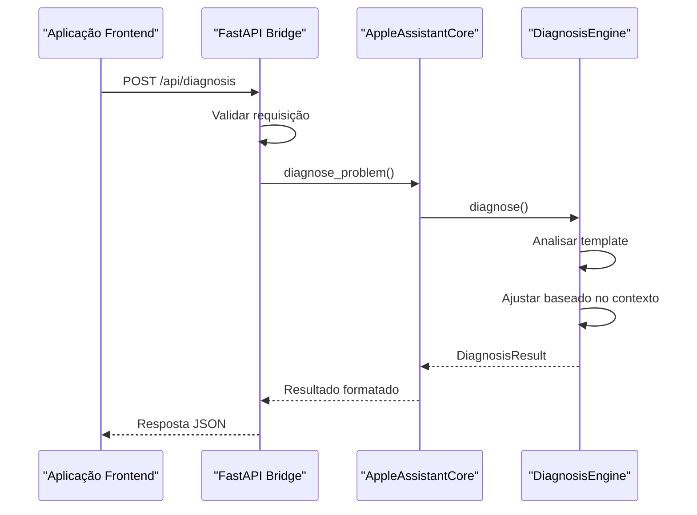
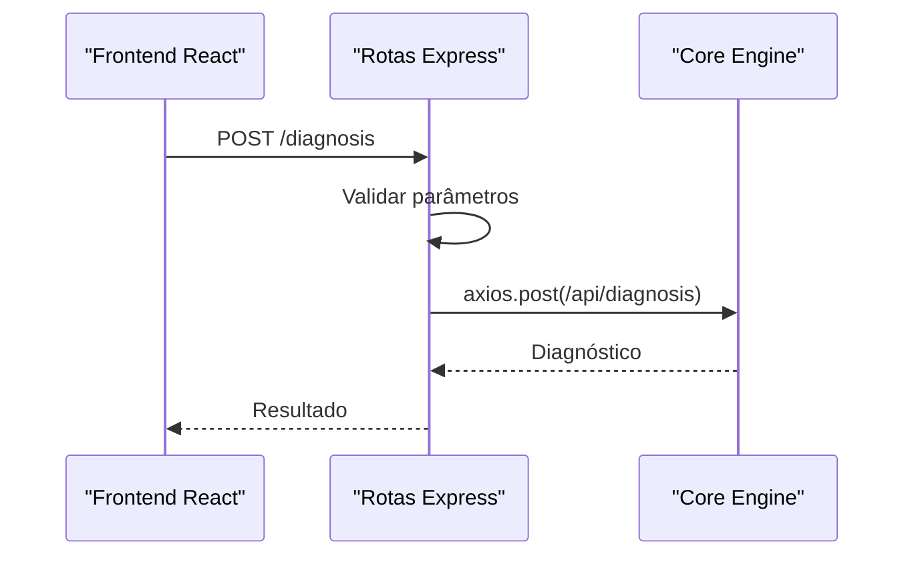

# Motor de Diagnóstico

<cite>
**Arquivos Referenciados neste Documento**
- [main.py](file://core-engine/python/main.py)
- [api.py](file://core-engine/bridge/api.py)
- [diagnosis.js](file://backend/src/routes/diagnosis.js)
- [requirements.txt](file://core-engine/python/requirements.txt)
- [README.md](file://README.md)
</cite>

## Sumário
- Introdução ao motor de diagnóstico
- Arquitetura do Core Engine
- Classe DiagnosisEngine e seus métodos
- Fluxo de diagnóstico completo
- Tipos de problemas e templates
- Exemplos práticos de diagnóstico
- Extensão do motor para novos tipos de diagnóstico
- Considerações de desempenho e segurança

## Introdução

O motor de diagnóstico do Core Engine é o componente central do sistema de assistência de recuperação Apple ID. Ele fornece uma lógica de análise automatizada para identificar problemas comuns de contas Apple e fornecer soluções baseadas em processos oficiais da Apple. O motor opera como um cérebro de decisão que interpreta o tipo de problema e contexto fornecido para gerar recomendações específicas.

## Arquitetura do Core Engine

O Core Engine segue uma arquitetura modular com três camadas principais:



**Diagrama Fontes**
- [api.py:105-125](file://core-engine/bridge/api.py#L105-L125)
- [main.py:246-253](file://core-engine/python/main.py#L246-L253)

**Seção Fontes**
- [api.py:105-125](file://core-engine/bridge/api.py#L105-L125)
- [main.py:246-253](file://core-engine/python/main.py#L246-L253)

## Classe DiagnosisEngine

A classe `DiagnosisEngine` é o coração do motor de diagnóstico, responsável por analisar problemas e gerar resultados personalizados.

### Estrutura da Classe



**Diagrama Fontes**
- [main.py:75-195](file://core-engine/python/main.py#L75-L195)
- [main.py:35-49](file://core-engine/python/main.py#L35-L49)
- [main.py:51-61](file://core-engine/python/main.py#L51-L61)

### Métodos Principais

#### Método `__init__()`
O construtor inicializa os templates de diagnóstico para cada tipo de problema suportado. Cada template define características específicas como severidade, tempo estimado e passos recomendados.

#### Método `diagnose()`
O método principal que realiza a análise completa do problema:

**Parâmetros:**
- `problem_type`: Enumeração do tipo de problema (obrigatório)
- `has_proof_of_purchase`: Indicador de comprovante de compra (padrão: False)
- `has_device_access`: Indicador de acesso ao dispositivo (padrão: False)

**Retorno:** Objeto `DiagnosisResult` contendo toda a análise

**Seção Fontes**
- [main.py:152-195](file://core-engine/python/main.py#L152-L195)

## Fluxo de Diagnóstico

O fluxo de diagnóstico segue um processo lógico e estruturado:



**Diagrama Fontes**
- [main.py:166-195](file://core-engine/python/main.py#L166-L195)

### Lógica Condiconal Específica

O motor implementa uma lógica condicional especial para o problema de **Activation Lock**:



**Diagrama Fontes**
- [main.py:176-182](file://core-engine/python/main.py#L176-L182)

**Seção Fontes**
- [main.py:176-182](file://core-engine/python/main.py#L176-L182)

## Tipos de Problemas e Templates

O motor suporta cinco tipos principais de problemas, cada um com suas características específicas:

### 1. Senha Esquecida (`forgot-password`)
- **Severidade:** Baixa
- **Recuperável:** Sim
- **Suporte Apple:** Não
- **Tempo Estimado:** 15-30 minutos
- **Passos:** Acesso ao site oficial, verificação de identidade, redefinição de senha

### 2. Verificação em 2 Etapas (`two-factor`)
- **Severidade:** Média
- **Recuperável:** Sim
- **Suporte Apple:** Sim
- **Tempo Estimado:** 1-3 dias
- **Passos:** Verificação de dispositivos confiáveis, recuperação via telefone

### 3. Bloqueio de Ativação (`activation-lock`)
- **Severidade:** Alta
- **Recuperável:** Depende do comprovante
- **Suporte Apple:** Sim
- **Tempo Estimado:** 3-7 dias (com comprovante) / Não recuperável (sem comprovante)
- **Passos:** Verificação de comprovante, preparação de documentação

### 4. Conta Bloqueada (`account-locked`)
- **Severidade:** Média
- **Recuperável:** Sim
- **Suporte Apple:** Sim
- **Tempo Estimado:** 24-48 horas
- **Passos:** Verificação do motivo, seguir instruções de recuperação

### 5. Dispositivo Usado (`device-used`)
- **Severidade:** Alta
- **Recuperável:** Geralmente não
- **Suporte Apple:** Sim
- **Tempo Estimado:** Variável / Não garantido
- **Passos:** Verificação de Activation Lock, contato com vendedor

**Seção Fontes**
- [main.py:79-150](file://core-engine/python/main.py#L79-L150)

## Exemplos Práticos de Diagnóstico

### Exemplo 1: Senha Esquecida com Acesso ao Email
**Parâmetros:**
- `problem_type`: "forgot-password"
- `has_proof_of_purchase`: False
- `has_device_access`: True

**Resultado Esperado:**
- Recuperável: True
- Tempo Estimado: 15-30 minutos
- Passos: Acesso ao site oficial, verificação de identidade, redefinição de senha

### Exemplo 2: Activation Lock com Comprovante
**Parâmetros:**
- `problem_type`: "activation-lock"
- `has_proof_of_purchase`: True
- `has_device_access`: True

**Resultado Esperado:**
- Recuperável: True
- Tempo Estimado: 3-7 dias úteis
- Passos: Verificação de comprovante, preparação de documentação

### Exemplo 3: Activation Lock sem Comprovante
**Parâmetros:**
- `problem_type`: "activation-lock"
- `has_proof_of_purchase`: False
- `has_device_access`: False

**Resultado Esperado:**
- Recuperável: False
- Tempo Estimado: Não recuperável sem comprovante
- Notas: Alerta crítico sobre impossibilidade de remoção

### Exemplo 4: Verificação em 2 Etapas
**Parâmetros:**
- `problem_type`: "two-factor"
- `has_proof_of_purchase`: False
- `has_device_access`: False

**Resultado Esperado:**
- Recuperável: True
- Tempo Estimado: 1-3 dias
- Passos: Verificação de dispositivos confiáveis, recuperação via telefone

**Seção Fontes**
- [main.py:176-182](file://core-engine/python/main.py#L176-L182)

## Integração com a API

O motor de diagnóstico é exposto através de dois pontos de entrada principais:

### API REST (FastAPI)


**Diagrama Fontes**
- [api.py:206-237](file://core-engine/bridge/api.py#L206-L237)
- [main.py:264-309](file://core-engine/python/main.py#L264-L309)

### API REST (Express.js)


**Diagrama Fontes**
- [diagnosis.js:15-69](file://backend/src/routes/diagnosis.js#L15-L69)

**Seção Fontes**
- [api.py:206-237](file://core-engine/bridge/api.py#L206-L237)
- [diagnosis.js:15-69](file://backend/src/routes/diagnosis.js#L15-L69)

## Extensão do Motor

### Adicionando Novos Tipos de Diagnóstico

Para adicionar um novo tipo de diagnóstico, siga estas etapas:

1. **Atualizar enumeração de problemas:**
   ```python
   class ProblemType(Enum):
       # ... outros tipos existentes
       NOVO_PROBLEMA = "novo-problema"
   ```

2. **Adicionar template no DiagnosisEngine:**
   ```python
   self.diagnosis_templates[ProblemType.NOVO_PROBLEMA] = {
       "type": "Novo Problema",
       "severity": SeverityLevel.MEDIUM,
       "recoverable": True,
       "requires_apple_support": False,
       "estimated_time": "Tempo estimado",
       "steps": ["Passo 1", "Passo 2", "Passo 3"],
       "notes": "Observações importantes"
   }
   ```

3. **Atualizar validações nas rotas:**
   - Backend Express: Adicionar novo tipo na lista de validações
   - Frontend React: Atualizar sugestões e validações

### Melhorias de Desempenho

- **Cache de resultados:** Implementar cache para diagnósticos repetidos
- **Paralelismo:** Processar múltiplos diagnósticos simultaneamente
- **Indexação:** Criar índices para templates mais acessados

### Considerações de Segurança

- **Validação de entrada:** Todos os parâmetros são validados antes do processamento
- **Logging seguro:** Registros incluem informações mínimas para manutenção
- **Rate limiting:** Implementar limites para prevenir abusos

**Seção Fontes**
- [main.py:35-49](file://core-engine/python/main.py#L35-L49)
- [main.py:79-150](file://core-engine/python/main.py#L79-L150)

## Considerações Finais

O motor de diagnóstico do Core Engine representa uma solução robusta e escalável para análise de problemas de contas Apple ID. Sua arquitetura modular permite fácil manutenção e expansão, enquanto sua lógica condicional garante resultados precisos baseados em contextos específicos.

A implementação segue rigorosamente os processos oficiais da Apple, garantindo que todas as recomendações sejam legítimas e seguras para os usuários.