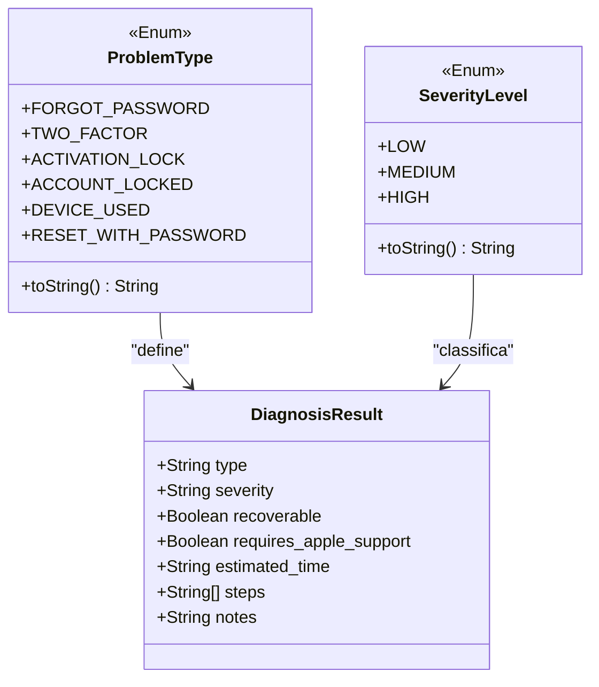
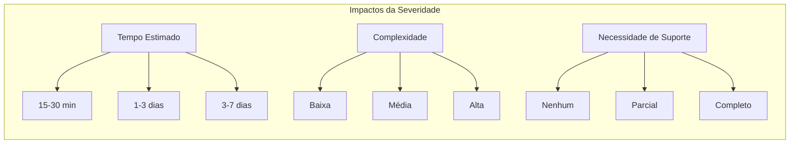

# Tipos de Problemas e Severidade

<cite>
**Arquivos Referenciados neste Documento**
- [main.py](file://core-engine/python/main.py)
- [api.py](file://core-engine/bridge/api.py)
- [diagnosis.js](file://backend/src/routes/diagnosis.js)
- [RecoveryFlow.js](file://frontend/src/pages/RecoveryFlow.js)
- [index.html](file://desktop/electron-app/renderer/index.html)
</cite>

## Sumário
- [Introdução](#introdução)
- [Arquitetura de Enumerações](#arquitetura-de-enumerações)
- [Tipos de Problemas (ProblemType)](#tipos-de-problemas-problemtype)
- [Níveis de Severidade (SeverityLevel)](#níveis-de-severidade-severitylevel)
- [Detalhamento Completo de Cada Tipo](#detalhamento-completo-de-cada-tipo)
- [Fluxo de Recuperação por Severidade](#fluxo-de-recuperação-por-severidade)
- [Impacto no Processo de Recuperação](#impacto-no-processo-de-recuperação)
- [Exemplos Práticos de Aplicação](#exemplos-práticos-de-aplicação)
- [Conclusão](#conclusão)

## Introdução

O sistema de assistência para recuperação de contas Apple ID implementa um sistema de enumerações para categorizar problemas e determinar níveis de severidade. Essas enumerações são fundamentais para o fluxo de recuperação, pois influenciam diretamente o tempo estimado de conclusão, a necessidade de suporte oficial da Apple e o nível de complexidade do processo.

O sistema suporta dois tipos principais de enumerações:

1. **ProblemType**: Enumeração que define os tipos de problemas suportados
2. **SeverityLevel**: Enumeração que classifica a severidade dos problemas em três níveis

## Arquitetura de Enumerações



**Fontes**: 
- [main.py:35-49](file://core-engine/python/main.py#L35-L49)
- [main.py:52-61](file://core-engine/python/main.py#L52-L61)

## Tipos de Problemas (ProblemType)

A enumeração ProblemType define seis tipos de problemas distintos, cada um com características específicas e diferentes implicações para o processo de recuperação:

### Valores Disponíveis

| Valor | Descrição | Código Interno |
|-------|-----------|----------------|
| `forgot-password` | Esqueci a Senha | `FORGOT_PASSWORD` |
| `two-factor` | Verificação em 2 Etapas | `TWO_FACTOR` |
| `activation-lock` | Bloqueio de Ativação (iCloud) | `ACTIVATION_LOCK` |
| `account-locked` | Conta Inacessível | `ACCOUNT_LOCKED` |
| `device-used` | Dispositivo Usado Comprado | `DEVICE_USED` |
| `reset-with-password` | Reset Profissional com Senha iCloud | `RESET_WITH_PASSWORD` |

**Fontes**: 
- [main.py:35-42](file://core-engine/python/main.py#L35-L42)
- [diagnosis.js:17-22](file://backend/src/routes/diagnosis.js#L17-L22)

## Níveis de Severidade (SeverityLevel)

A enumeração SeverityLevel classifica os problemas em três níveis de severidade, influenciando diretamente o fluxo de recuperação:

### Valores Disponíveis

| Valor | Nível | Características |
|-------|-------|-----------------|
| `low` | Baixa | Processos rápidos e simples, geralmente resolvidos diretamente pelo usuário |
| `medium` | Média | Processos moderadamente complexos, podem exigir algum tempo e suporte |
| `high` | Alta | Processos críticos e complexos, frequentemente exigem intervenção especializada |

**Fontes**: 
- [main.py:45-49](file://core-engine/python/main.py#L45-L49)
- [RecoveryFlow.js:129-144](file://frontend/src/pages/RecoveryFlow.js#L129-L144)

## Detalhamento Completo de Cada Tipo

### 1. Esqueci a Senha (`forgot-password`)

**Descrição Detalhada:**
Processo de recuperação de senha esquecida através do site oficial da Apple. É o tipo de problema mais comum e relativamente simples de resolver.

**Cenários Típicos:**
- Usuário esqueceu sua senha pessoal
- Acesso perdido a contas secundárias
- Necessidade de redefinir senha após troca de dispositivo

**Severidade Associada:** Baixa (LOW)

**Impacto no Processo de Recuperação:**
- Tempo estimado: 15-30 minutos
- Recuperável: Sim
- Necessita de suporte Apple: Não
- Complexidade: Baixa

**Fluxo de Recuperação:**
1. Acessar site oficial da Apple
2. Verificação de identidade via e-mail ou SMS
3. Redefinição de senha com nova senha segura
4. Atualização de senha em todos os dispositivos

**Fontes**: 
- [main.py:81-94](file://core-engine/python/main.py#L81-L94)
- [diagnosis.js:142-146](file://backend/src/routes/diagnosis.js#L142-L146)

### 2. Verificação em 2 Etapas (`two-factor`)

**Descrição Detalhada:**
Problemas relacionados à verificação em duas etapas, incluindo perda de acesso aos dispositivos de verificação ou dificuldades para receber códigos de autenticação.

**Cenários Típicos:**
- Perda do celular com aplicativo de autenticação
- Falha no recebimento de SMS de verificação
- Dispositivos confiáveis desativados ou removidos
- Problemas com chaves de recuperação

**Severidade Associada:** Média (MEDIUM)

**Impacto no Processo de Recuperação:**
- Tempo estimado: 1-3 dias
- Recuperável: Sim
- Necessita de suporte Apple: Sim
- Complexidade: Média

**Fluxo de Recuperação:**
1. Verificar dispositivos confiáveis cadastrados
2. Tentar recuperação via número de telefone
3. Contatar suporte Apple se necessário
4. Aguardar verificação de identidade

**Fontes**: 
- [main.py:95-108](file://core-engine/python/main.py#L95-L108)
- [diagnosis.js:147-151](file://backend/src/routes/diagnosis.js#L147-L151)

### 3. Bloqueio de Ativação (`activation-lock`)

**Descrição Detalhada:**
Problema crítico relacionado ao bloqueio de ativação do iCloud, que impede o uso de dispositivos Apple comprados usados ou que perderam a conta associada.

**Cenários Típicos:**
- Compra de dispositivo Apple usado sem comprovante
- Dispositivo pertence a outra pessoa
- Perda do dispositivo com iCloud ativo
- Dispositivo com histórico de roubo

**Severidade Associada:** Alta (HIGH)

**Impacto no Processo de Recuperação:**
- Tempo estimado: 3-7 dias (com comprovante) / Não recuperável (sem comprovante)
- Recuperável: Depende do contexto
- Necessita de suporte Apple: Sim
- Complexidade: Alta

**Fluxo de Recuperação:**
1. Verificar posse do comprovante de compra original
2. Preparar documentação (nota fiscal, IMEI)
3. Solicitar remoção do bloqueio via Apple
4. Aguardar análise e decisão da Apple

**Fontes**: 
- [main.py:109-122](file://core-engine/python/main.py#L109-L122)
- [diagnosis.js:152-156](file://backend/src/routes/diagnosis.js#L152-L156)

### 4. Conta Inacessível (`account-locked`)

**Descrição Detalhada:**
Situação em que a conta Apple ID encontra-se temporariamente bloqueada, geralmente por motivos de segurança ou tentativas excessivas de acesso.

**Cenários Típicos:**
- Bloqueio por tentativas de login excessivas
- Avisos de segurança por atividade suspeita
- Problemas com credenciais expiradas
- Suspensão temporária por violação de termos

**Severidade Associada:** Média (MEDIUM)

**Impacto no Processo de Recuperação:**
- Tempo estimado: 24-48 horas
- Recuperável: Sim
- Necessita de suporte Apple: Sim
- Complexidade: Média

**Fluxo de Recuperação:**
1. Verificar motivo do bloqueio (e-mail da Apple)
2. Seguir instruções de recuperação enviadas
3. Verificar identidade conforme solicitado
4. Aguardar liberação da conta

**Fontes**: 
- [main.py:123-136](file://core-engine/python/main.py#L123-L136)
- [diagnosis.js:157-161](file://backend/src/routes/diagnosis.js#L157-L161)

### 5. Dispositivo Usado Comprado (`device-used`)

**Descrição Detalhada:**
Problemas específicos de dispositivos Apple usados que ainda estão associados à conta do vendedor, impedindo seu uso legítimo.

**Cenários Típicos:**
- Compra de iPhone ou iPad usado sem remoção da conta
- Dispositivo com Activation Lock ativo
- Vendedor não removeu o dispositivo do iCloud
- Problemas com dispositivos de terceiros

**Severidade Associada:** Alta (HIGH)

**Impacto no Processo de Recuperação:**
- Tempo estimado: Variável / Não garantido
- Recuperável: Geralmente não
- Necessita de suporte Apple: Sim
- Complexidade: Alta

**Fluxo de Recuperação:**
1. Verificar se dispositivo tem Activation Lock ativo
2. Entrar em contato IMEDIATAMENTE com o vendedor
3. Solicitar remoção do dispositivo da conta do vendedor
4. Se sem sucesso: verificar opções legais

**Fontes**: 
- [main.py:137-150](file://core-engine/python/main.py#L137-L150)
- [diagnosis.js:162-166](file://backend/src/routes/diagnosis.js#L162-L166)

### 6. Reset Profissional com Senha iCloud (`reset-with-password`)

**Descrição Detalhada:**
Processo legal e completo de reset de dispositivo Apple usando a senha do iCloud, permitindo a remoção completa da conta do dispositivo.

**Cenários Típicos:**
- Venda de dispositivo Apple
- Troca de dispositivo
- Perda do dispositivo e necessidade de reset
- Preparação para transferência de dados

**Severidade Associada:** Baixa (LOW)

**Impacto no Processo de Recuperação:**
- Tempo estimado: 5-10 minutos
- Recuperável: Sim
- Necessita de suporte Apple: Não
- Complexidade: Baixa

**Fluxo de Recuperação:**
1. Acessar Ajustes > [nome] > Sair (Sign Out)
2. Digitar a senha do iCloud para desativar Buscar iPhone
3. Aguardar a remoção da conta do dispositivo
4. Acessar Ajustes > Geral > Transferir ou Redefinir
5. Tocar em Apagar Conteúdo e Ajustes
6. Confirmar e aguardar o iPhone reiniciar

**Fontes**: 
- [main.py:151-166](file://core-engine/python/main.py#L151-L166)

## Fluxo de Recuperação por Severidade

```mermaid
flowchart TD
Start([Início do Processo]) --> Severity{"Nível de Severidade"}
Severity --> |Baixa (LOW)| LowFlow["Fluxo Rápido<br/>15-30 minutos<br/>Sem suporte Apple"]
Severity --> |Média (MEDIUM)| MediumFlow["Fluxo Moderado<br/>1-3 dias<br/>Com suporte Apple"]
Severity --> |Alta (HIGH)| HighFlow["Fluxo Complexo<br/>3-7 dias<br/>Necessita de análise"]
LowFlow --> ForgotPassword["Esqueci a Senha<br/>Processo direto"]
LowFlow --> ResetWithPassword["Reset com Senha<br/>Processo legal"]
MediumFlow --> TwoFactor["Verificação em 2 Etapas<br/>Autenticação adicional"]
MediumFlow --> AccountLocked["Conta Inacessível<br/>Bloqueio temporário"]
HighFlow --> ActivationLock["Bloqueio de Ativação<br/>Comprovante necessário"]
HighFlow --> DeviceUsed["Dispositivo Usado<br/>Vendedor responsável"]
ForgotPassword --> End([Conclusão])
ResetWithPassword --> End
TwoFactor --> End
AccountLocked --> End
ActivationLock --> End
DeviceUsed --> End
```

**Fontes**: 
- [main.py:81-166](file://core-engine/python/main.py#L81-L166)
- [RecoveryFlow.js:129-144](file://frontend/src/pages/RecoveryFlow.js#L129-L144)

## Impacto no Processo de Recuperação

### Influência da Severidade

| Nível de Severidade | Tempo Estimado | Complexidade | Requisitos Adicionais | Impacto no Usuário |
|-------------------|----------------|--------------|----------------------|-------------------|
| **Baixa (LOW)** | 15-30 minutos | Baixa | Nenhum | Mínimo impacto |
| **Média (MEDIUM)** | 1-3 dias | Média | Suporte Apple | Impacto moderado |
| **Alta (HIGH)** | 3-7 dias | Alta | Análise completa | Impacto significativo |

### Impacto nas Etapas do Processo



**Fontes**: 
- [main.py:81-166](file://core-engine/python/main.py#L81-L166)
- [RecoveryFlow.js:286-331](file://frontend/src/pages/RecoveryFlow.js#L286-L331)

## Exemplos Práticos de Aplicação

### Exemplo 1: Recuperação de Senha Rápida
**Cenário:** Maria esqueceu sua senha do Apple ID mas tem acesso ao e-mail cadastrado.

**Aplicação da Enumeração:**
- `problemType`: `forgot-password`
- `severity`: `low`

**Resultado Esperado:**
- Processo rápido de 15-30 minutos
- Sem necessidade de contato com suporte Apple
- Recuperação direta pelo site oficial

### Exemplo 2: Bloqueio de Ativação Crítico
**Cenário:** João comprou um iPhone usado sem comprovante de compra e o dispositivo está bloqueado.

**Aplicação da Enumeração:**
- `problemType`: `activation-lock`
- `severity`: `high`

**Resultado Esperado:**
- Processo complexo de 3-7 dias
- Necessidade de comprovante de compra
- Possível não recuperação sem documentação

### Exemplo 3: Verificação em 2 Etapas
**Cenário:** Ana perdeu seu celular com o aplicativo de autenticação e não recebe SMS de verificação.

**Aplicação da Enumeração:**
- `problemType`: `two-factor`
- `severity`: `medium`

**Resultado Esperado:**
- Processo de 1-3 dias
- Necessidade de contato com suporte Apple
- Verificação adicional de identidade

**Fontes**: 
- [diagnosis.js:140-170](file://backend/src/routes/diagnosis.js#L140-L170)
- [RecoveryFlow.js:194-217](file://frontend/src/pages/RecoveryFlow.js#L194-L217)

## Conclusão

O sistema implementa um modelo robusto de enumerações para classificação de problemas e severidade, proporcionando:

1. **Padronização:** Todos os tipos de problemas são categorizados de forma consistente
2. **Escalabilidade:** Nova enumerações podem ser adicionadas sem impactar o sistema existente
3. **Clareza:** Níveis de severidade ajudam usuários e técnicos a entenderem o impacto do problema
4. **Eficiência:** Fluxos de recuperação otimizados com base na severidade

A combinação de `ProblemType` e `SeverityLevel` permite uma experiência de usuário mais eficiente, com expectativas realistas sobre tempo de recuperação e complexidade do processo. O sistema também facilita a integração com o suporte Apple e outras ferramentas de recuperação, mantendo um padrão claro de comunicação entre todas as partes envolvidas.