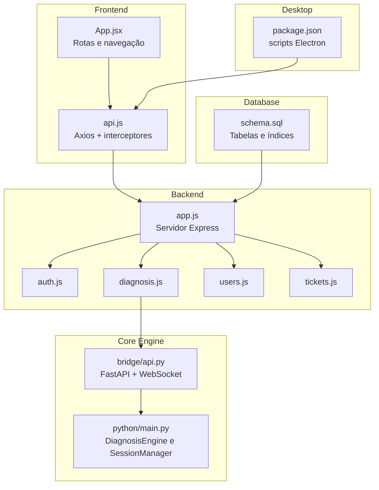
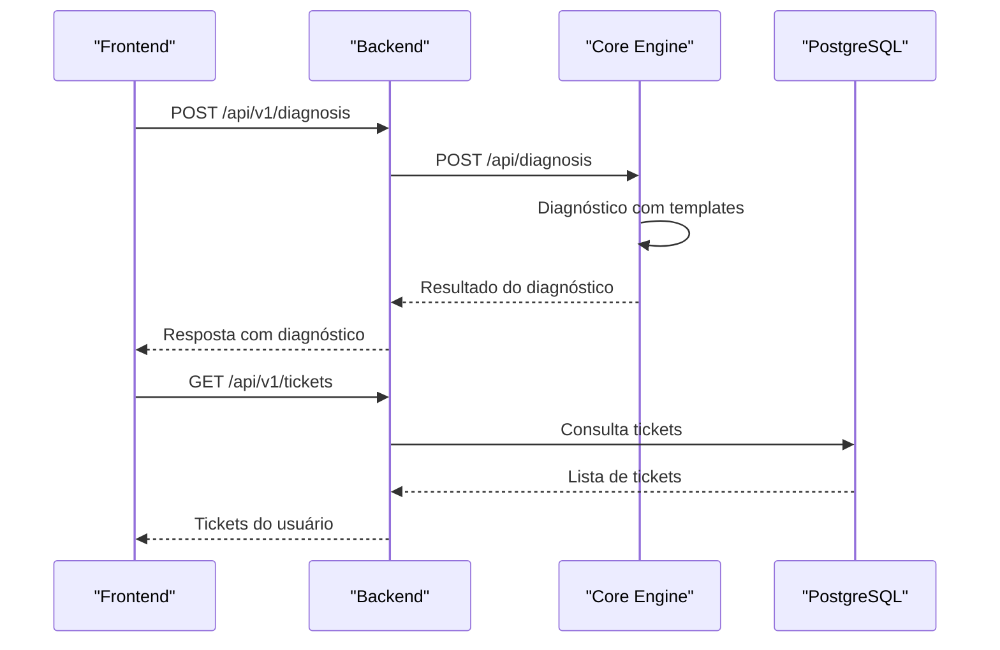
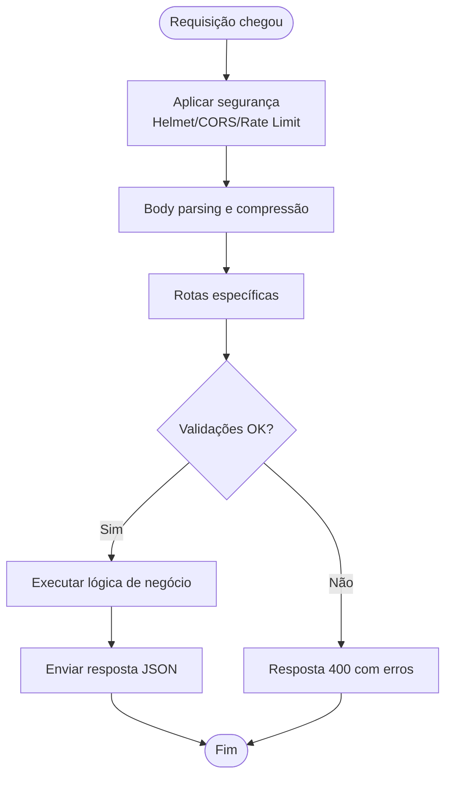
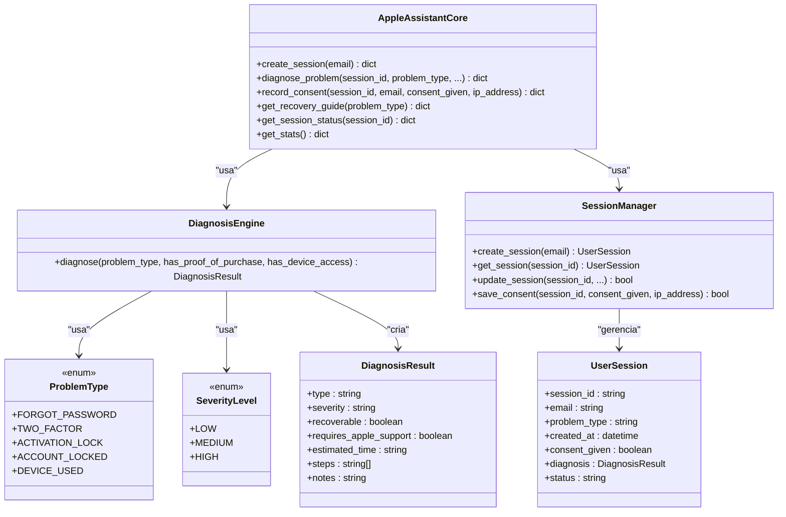
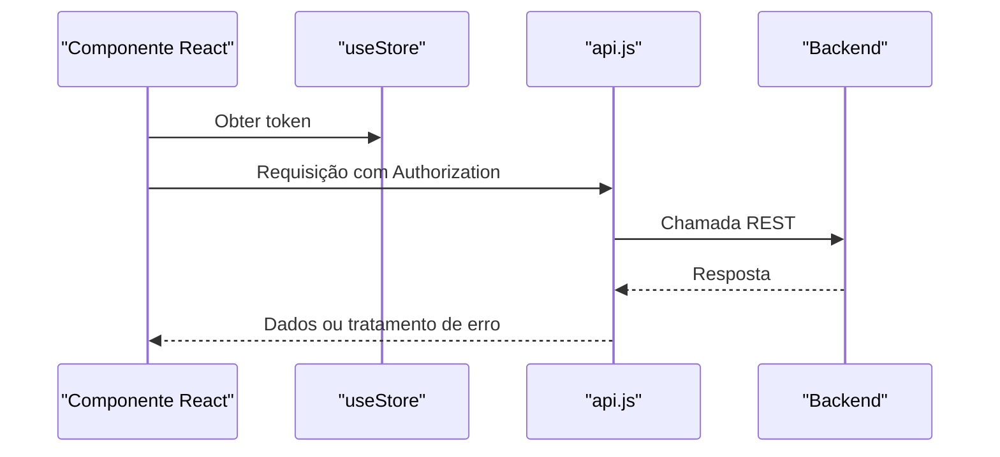
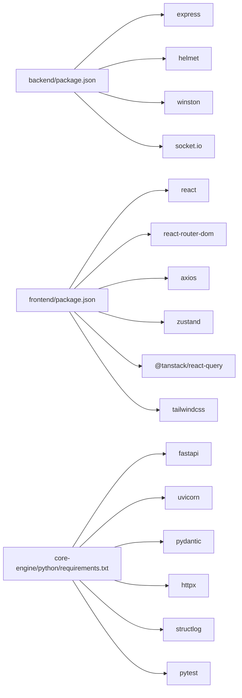
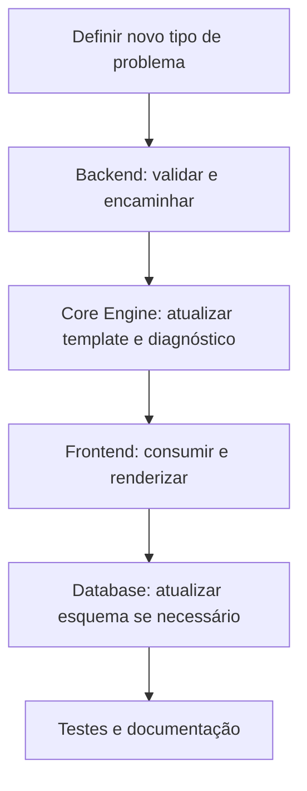

# Desenvolvimento e Contribuição

<cite>
**Arquivos Referenciados Neste Documento**
- [README.md](file://README.md)
- [backend/package.json](file://backend/package.json)
- [backend/src/app.js](file://backend/src/app.js)
- [backend/src/routes/diagnosis.js](file://backend/src/routes/diagnosis.js)
- [backend/src/routes/auth.js](file://backend/src/routes/auth.js)
- [backend/src/routes/users.js](file://backend/src/routes/users.js)
- [backend/src/routes/tickets.js](file://backend/src/routes/tickets.js)
- [frontend/package.json](file://frontend/package.json)
- [frontend/src/App.js](file://frontend/src/App.js)
- [frontend/src/services/api.js](file://frontend/src/services/api.js)
- [core-engine/python/main.py](file://core-engine/python/main.py)
- [core-engine/bridge/api.py](file://core-engine/bridge/api.py)
- [core-engine/python/requirements.txt](file://core-engine/python/requirements.txt)
- [database/schema.sql](file://database/schema.sql)
- [desktop/electron-app/package.json](file://desktop/electron-app/package.json)
</cite>

## Sumário
1. [Introdução](#introdução)
2. [Estrutura do Projeto](#estrutura-do-projeto)
3. [Componentes-Chave](#componentes-chave)
4. [Visão Geral da Arquitetura](#visão-geral-da-arquitetura)
5. [Análise Detalhada dos Componentes](#análise-detalhada-dos-componentes)
6. [Análise de Dependências](#análise-de-dependências)
7. [Considerações de Desempenho](#considerações-de-desempenho)
8. [Guia de Solução de Problemas](#guia-de-solução-de-problemas)
9. [Conclusão](#conclusão)
10. [Apêndices](#apêndices)

## Introdução
Este documento destina-se a desenvolvedores e contribuidores do projeto Apple ID Assistant. Ele apresenta padrões de desenvolvimento, convenções de commit, fluxo de contribuição, configuração do ambiente, execução de testes, submissão de mudanças, diretrizes para novos recursos, regras de qualidade de código, processos de revisão, além de orientações para adicionar novos fluxos de diagnóstico e manter compatibilidade entre os módulos backend, frontend, core engine e desktop.

## Estrutura do Projeto
O projeto segue uma arquitetura modular com quatro camadas principais:
- Backend (Node.js/Express): API REST com rotas de autenticação, diagnóstico, sessões, tickets e administração.
- Core Engine (Python/FastAPI): Motor de diagnóstico e guias de recuperação, exposto via API REST e WebSocket.
- Frontend (React): Interface web com navegação protegida, roteamento e integração com a API.
- Desktop (Electron): Aplicativo desktop com proxy para a API e integração com o frontend.
- Database: Esquema PostgreSQL com tabelas para usuários, sessões, tickets, logs e configurações.

**Diagrama fonte**
- [frontend/src/App.js:1-93](file://frontend/src/App.js#L1-L93)
- [frontend/src/services/api.js:1-90](file://frontend/src/services/api.js#L1-L90)
- [backend/src/app.js:1-194](file://backend/src/app.js#L1-L194)
- [backend/src/routes/auth.js:1-183](file://backend/src/routes/auth.js#L1-L183)
- [backend/src/routes/diagnosis.js:1-173](file://backend/src/routes/diagnosis.js#L1-L173)
- [backend/src/routes/users.js:1-168](file://backend/src/routes/users.js#L1-L168)
- [backend/src/routes/tickets.js:1-331](file://backend/src/routes/tickets.js#L1-L331)
- [core-engine/bridge/api.py:1-438](file://core-engine/bridge/api.py#L1-L438)
- [core-engine/python/main.py:1-499](file://core-engine/python/main.py#L1-L499)
- [database/schema.sql:1-194](file://database/schema.sql#L1-L194)
- [desktop/electron-app/package.json:1-73](file://desktop/electron-app/package.json#L1-L73)

**Seção fonte**
- [README.md:19-29](file://README.md#L19-L29)

## Componentes-Chave
- Backend
  - Configuração de segurança (Helmet, CORS, rate limiting).
  - Rotas de autenticação, diagnóstico, sessões, tickets e usuários.
  - Logs com Winston e tratamento de erros global.
- Core Engine
  - Motor de diagnóstico com templates de problemas.
  - Gerenciador de sessões e registro de consentimento.
  - API REST (FastAPI) e WebSocket para comunicação em tempo real.
- Frontend
  - Roteamento protegido, interceptores de token e requests.
  - Integração com as APIs de autenticação, diagnóstico e tickets.
- Desktop
  - Scripts para desenvolvimento e build com Electron Builder.
- Database
  - Esquema completo com restrições de domínio, índices e triggers.

**Seção fonte**
- [backend/src/app.js:15-194](file://backend/src/app.js#L15-L194)
- [backend/src/routes/diagnosis.js:1-173](file://backend/src/routes/diagnosis.js#L1-L173)
- [backend/src/routes/auth.js:1-183](file://backend/src/routes/auth.js#L1-L183)
- [backend/src/routes/users.js:1-168](file://backend/src/routes/users.js#L1-L168)
- [backend/src/routes/tickets.js:1-331](file://backend/src/routes/tickets.js#L1-L331)
- [core-engine/bridge/api.py:1-438](file://core-engine/bridge/api.py#L1-L438)
- [core-engine/python/main.py:1-499](file://core-engine/python/main.py#L1-L499)
- [frontend/src/App.js:1-93](file://frontend/src/App.js#L1-L93)
- [frontend/src/services/api.js:1-90](file://frontend/src/services/api.js#L1-L90)
- [database/schema.sql:1-194](file://database/schema.sql#L1-L194)
- [desktop/electron-app/package.json:1-73](file://desktop/electron-app/package.json#L1-L73)

## Visão Geral da Arquitetura
O fluxo básico de diagnóstico envolve o frontend solicitando um diagnóstico ao backend, que encaminha a requisição ao Core Engine. O Core Engine retorna o diagnóstico com recomendações e etapas, que são exibidas ao usuário. O fluxo de tickets permite ao usuário abrir chamados e acompanhar o atendimento.

**Diagrama fonte**
- [backend/src/routes/diagnosis.js:14-69](file://backend/src/routes/diagnosis.js#L14-L69)
- [core-engine/bridge/api.py:206-238](file://core-engine/bridge/api.py#L206-L238)
- [frontend/src/services/api.js:61-75](file://frontend/src/services/api.js#L61-L75)
- [database/schema.sql:53-80](file://database/schema.sql#L53-L80)

## Análise Detalhada dos Componentes

### Backend (Express)
- Segurança: Helmet com CSP restrito, CORS configurável, rate limiting global e específico para autenticação.
- Logs: Morgan integrado ao Winston com arquivos e console.
- Rotas: Agrupadas por funcionalidade (auth, sessions, diagnosis, tickets, users, admin).
- Tratamento de erros: 404 explícito e handler global com logs e resposta diferenciada por ambiente.

**Diagrama fonte**
- [backend/src/app.js:59-96](file://backend/src/app.js#L59-L96)
- [backend/src/routes/auth.js:44-95](file://backend/src/routes/auth.js#L44-L95)

**Seção fonte**
- [backend/src/app.js:15-194](file://backend/src/app.js#L15-L194)
- [backend/src/routes/auth.js:1-183](file://backend/src/routes/auth.js#L1-L183)

### Core Engine (FastAPI + Python)
- Classes principais: DiagnosisEngine, SessionManager, AppleAssistantCore.
- Tipos de problema e severidade definidos com enums e dataclasses.
- API REST com endpoints para sessões, diagnóstico, consentimento, guias e estatísticas.
- WebSocket para comunicação em tempo real com gerenciador de conexões.

**Diagrama fonte**
- [core-engine/python/main.py:35-450](file://core-engine/python/main.py#L35-L450)

**Seção fonte**
- [core-engine/python/main.py:1-499](file://core-engine/python/main.py#L1-L499)
- [core-engine/bridge/api.py:1-438](file://core-engine/bridge/api.py#L1-L438)

### Frontend (React)
- Roteamento com React Router DOM e componentes de rota protegida.
- QueryClient com configurações de staleTime e retry.
- Interceptadores de requisição e resposta para adicionar token e tratar 401.
- Serviços de API agrupados (auth, sessions, diagnosis, tickets, admin).

**Diagrama fonte**
- [frontend/src/App.js:34-90](file://frontend/src/App.js#L34-L90)
- [frontend/src/services/api.js:15-40](file://frontend/src/services/api.js#L15-L40)

**Seção fonte**
- [frontend/src/App.js:1-93](file://frontend/src/App.js#L1-L93)
- [frontend/src/services/api.js:1-90](file://frontend/src/services/api.js#L1-L90)

### Desktop (Electron)
- Scripts para desenvolvimento e build com Electron Builder.
- Configuração de build para Windows com NSIS e publicação GitHub.

**Seção fonte**
- [desktop/electron-app/package.json:1-73](file://desktop/electron-app/package.json#L1-L73)

## Análise de Dependências
- Backend
  - Express, helmet, cors, rate-limit, morgan, winston, bcrypt, joi, jsonwebtoken, mongoose, pg, sequelize, socket.io, dotenv, axios, multer, nodemailer, stripe, uuid, sharp, ioredis, express-validator.
- Frontend
  - React, react-router-dom, axios, tailwindcss, zustand, react-query, socket.io-client, eslint, prettier.
- Core Engine
  - fastapi, uvicorn, pydantic, httpx, structlog, pytest, asyncio, uuid, python-dateutil.

**Diagrama fonte**
- [backend/package.json:23-46](file://backend/package.json#L23-L46)
- [frontend/package.json:5-24](file://frontend/package.json#L5-L24)
- [core-engine/python/requirements.txt:4-26](file://core-engine/python/requirements.txt#L4-L26)

**Seção fonte**
- [backend/package.json:1-59](file://backend/package.json#L1-L59)
- [frontend/package.json:1-59](file://frontend/package.json#L1-L59)
- [core-engine/python/requirements.txt:1-27](file://core-engine/python/requirements.txt#L1-L27)

## Considerações de Desempenho
- Backend
  - Compression ativada para reduzir tamanho de respostas.
  - Rate limiting para mitigar ataques e sobrecarga.
  - Winston com múltiplos transportes para monitoramento eficiente.
- Core Engine
  - Uso de FastAPI/Uvicorn para alta performance assíncrona.
  - WebSocket para comunicação em tempo real com gerenciamento centralizado de conexões.
- Frontend
  - React Query com staleTime e retry configurados para otimizar cache e tentativas.
- Database
  - Índices estratégicos para buscas em usuários, sessões, tickets e logs.
  - Triggers para atualização automática de campos updated_at.

[Sem fonte, pois esta seção fornece orientações gerais]

## Guia de Solução de Problemas
- Erros de autenticação
  - Verifique tokens ausentes ou inválidos nos headers.
  - Confirme a configuração de JWT_SECRET no backend.
- Diagnóstico falhando
  - Valide o tipo de problema e parâmetros passados ao Core Engine.
  - Verifique se o Core Engine está online e acessível via CORE_ENGINE_URL.
- Tickets e sessões
  - Confirme permissões de acesso (usuário, suporte, admin).
  - Verifique status e prioridades válidas nas requisições.
- Logs
  - Backend: consulte logs de erro e combined.
  - Core Engine: verifique core_engine.log e logs no console.

**Seção fonte**
- [backend/src/routes/auth.js:25-42](file://backend/src/routes/auth.js#L25-L42)
- [backend/src/routes/diagnosis.js:42-68](file://backend/src/routes/diagnosis.js#L42-L68)
- [backend/src/routes/tickets.js:199-250](file://backend/src/routes/tickets.js#L199-L250)
- [backend/src/app.js:147-162](file://backend/src/app.js#L147-L162)
- [core-engine/bridge/api.py:404-414](file://core-engine/bridge/api.py#L404-L414)

## Conclusão
O projeto adota uma arquitetura modular e bem definida, com camadas claras de backend, core engine, frontend e desktop. As práticas de segurança, logs, validações e tratamento de erros foram implementadas de forma consistente. Para manutenção e expansão, siga as convenções descritas neste documento e mantenha compatibilidade entre as camadas.

[Sem fonte, pois esta seção resume sem análise de arquivos específicos]

## Apêndices

### Configuração do Ambiente
- Pré-requisitos
  - Node.js 18+, Python 3.8+, PostgreSQL 14+, Redis (opcional).
- Backend
  - Instale dependências, copie .env.example para .env e inicie em modo desenvolvimento.
- Core Engine
  - Instale dependências do Python e execute o script principal.
- Frontend
  - Instale dependências e inicie o servidor de desenvolvimento.
- Desktop
  - Instale dependências e inicie o Electron em modo desenvolvimento.

**Seção fonte**
- [README.md:33-71](file://README.md#L33-L71)
- [backend/package.json:6-12](file://backend/package.json#L6-L12)
- [core-engine/python/requirements.txt:1-27](file://core-engine/python/requirements.txt#L1-L27)
- [frontend/package.json:26-32](file://frontend/package.json#L26-L32)
- [desktop/electron-app/package.json:6-11](file://desktop/electron-app/package.json#L6-L11)

### Rodando Testes
- Backend
  - Scripts disponíveis: test e test:watch.
- Frontend
  - Script disponível: test.
- Core Engine
  - Scripts disponíveis: pytest e pytest-asyncio.

**Seção fonte**
- [backend/package.json:9-12](file://backend/package.json#L9-L12)
- [frontend/package.json](file://frontend/package.json#L29)
- [core-engine/python/requirements.txt:24-27](file://core-engine/python/requirements.txt#L24-L27)

### Padrões de Código e Qualidade
- Backend
  - ESLint configurado para análise de código.
- Frontend
  - ESLint e Prettier configurados com extensões recomendadas.
- Core Engine
  - PyTest para testes unitários e de integração assíncrona.

**Seção fonte**
- [backend/package.json:48-52](file://backend/package.json#L48-L52)
- [frontend/package.json:34-38](file://frontend/package.json#L34-L38)
- [core-engine/python/requirements.txt:24-27](file://core-engine/python/requirements.txt#L24-L27)

### Fluxo de Contribuição
- Crie um fork do repositório.
- Desenvolva em uma branch separada com commits descritivos.
- Submeta um Pull Request com descrição clara das mudanças.
- Mantenha compatibilidade com as versões mínimas de Node.js e Python.

[Sem fonte, pois esta seção apresenta procedimentos gerais]

### Adicionando Novos Fluxos de Diagnóstico
- Backend
  - Adicione validações e lógica de rota em diagnosis.js.
  - Garanta que o tipo de problema seja aceito pelo Core Engine.
- Core Engine
  - Estenda o enum ProblemType e o dicionário de templates.
  - Atualize o método diagnose para ajustar resultados com base em contexto.
- Frontend
  - Adicione chamadas de API e componentes para exibir novos guias.
- Database
  - Se necessário, atualize o esquema e migrações.

**Diagrama fonte**
- [backend/src/routes/diagnosis.js:14-69](file://backend/src/routes/diagnosis.js#L14-L69)
- [core-engine/python/main.py:75-196](file://core-engine/python/main.py#L75-L196)
- [core-engine/bridge/api.py:206-238](file://core-engine/bridge/api.py#L206-L238)
- [database/schema.sql:22-51](file://database/schema.sql#L22-L51)

**Seção fonte**
- [backend/src/routes/diagnosis.js:1-173](file://backend/src/routes/diagnosis.js#L1-L173)
- [core-engine/python/main.py:35-196](file://core-engine/python/main.py#L35-L196)
- [core-engine/bridge/api.py:46-89](file://core-engine/bridge/api.py#L46-L89)
- [database/schema.sql:1-194](file://database/schema.sql#L1-L194)

### Manutenção de Compatibilidade
- Backend
  - Mantenha versões mínimas declaradas no package.json.
  - Evite breaking changes nas rotas; utilize versionamento de API.
- Core Engine
  - Preservar contratos de entrada/saída do FastAPI.
  - Manter enums e estruturas de dados estáveis.
- Frontend
  - Atualizar dependências com atenção a breaking changes.
  - Manter compatibilidade com as APIs expostas pelo backend.
- Desktop
  - Atualizar Electron Builder e configurações de build conforme necessário.

**Seção fonte**
- [backend/package.json:54-57](file://backend/package.json#L54-L57)
- [core-engine/bridge/api.py:120-125](file://core-engine/bridge/api.py#L120-L125)
- [frontend/package.json:40-51](file://frontend/package.json#L40-L51)
- [desktop/electron-app/package.json:22-71](file://desktop/electron-app/package.json#L22-L71)