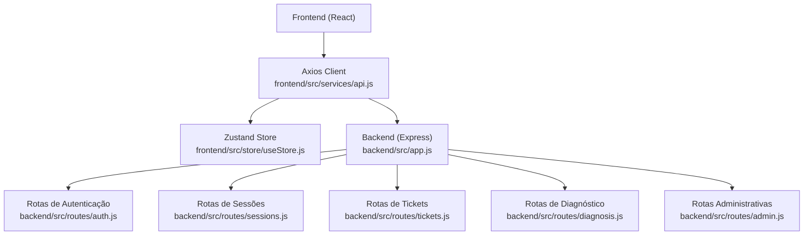
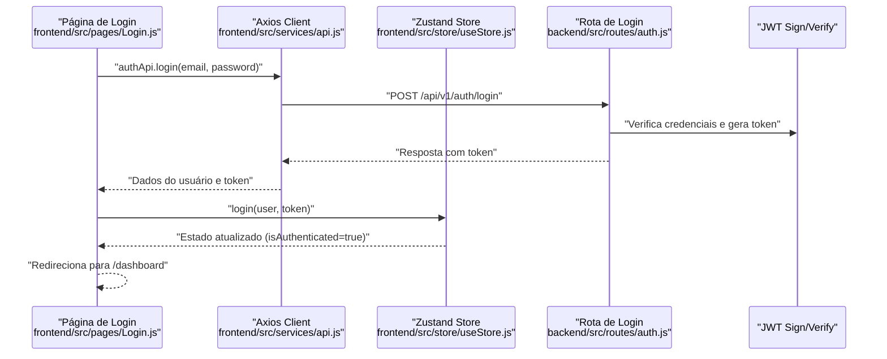
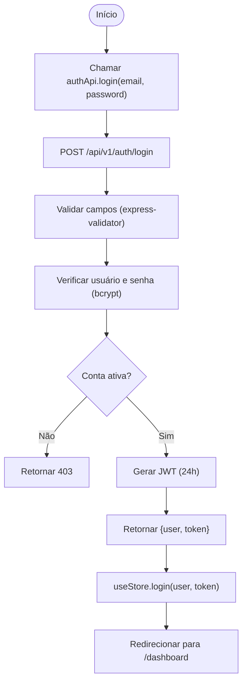
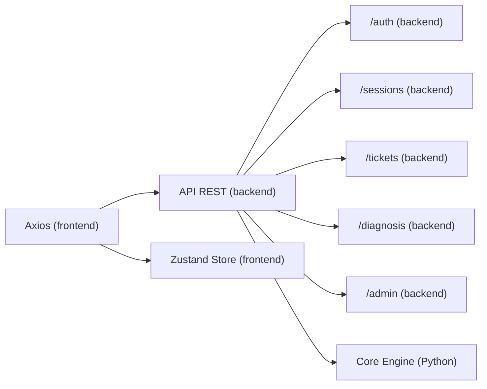

# Integração com a API REST do Backend

<cite>
**Arquivos referenciados neste documento**
- [api.js](file://frontend/src/services/api.js)
- [useStore.js](file://frontend/src/store/useStore.js)
- [auth.js](file://backend/src/routes/auth.js)
- [sessions.js](file://backend/src/routes/sessions.js)
- [tickets.js](file://backend/src/routes/tickets.js)
- [admin.js](file://backend/src/routes/admin.js)
- [diagnosis.js](file://backend/src/routes/diagnosis.js)
- [app.js](file://backend/src/app.js)
- [Login.js](file://frontend/src/pages/Login.js)
- [ProtectedRoute.js](file://frontend/src/components/ProtectedRoute.js)
- [AdminRoute.js](file://frontend/src/components/AdminRoute.js)
- [package.json (frontend)](file://frontend/package.json)
- [package.json (backend)](file://backend/package.json)
- [README.md](file://README.md)
</cite>

## Sumário
- Introdução
- Estrutura do Projeto
- Componentes-Chave
- Visão Geral da Arquitetura
- Análise Detalhada dos Componentes
- Análise de Dependências
- Considerações de Desempenho
- Guia de Solução de Problemas
- Conclusão

## Introdução
Este documento apresenta uma documentação técnica detalhada sobre a integração com a API REST do backend, abordando o cliente HTTP, configurações de autenticação, tratamento de erros, e como os componentes front-end fazem requisições aos endpoints. Também explica o fluxo de autenticação via JWT, gestão de tokens, e estratégias para lidar com diferentes códigos de resposta, falhas de rede e timeouts.

## Estrutura do Projeto
O projeto segue uma arquitetura de três camadas:
- Frontend (React): Contém o cliente HTTP, stores de estado e páginas de interface.
- Backend (Express): Fornece os endpoints REST, middleware de segurança e validação.
- Core Engine (Python): Fornece funcionalidades avançadas integradas via chamadas HTTP.

**Diagrama fonte**
- [api.js:1-130](file://frontend/src/services/api.js#L1-L130)
- [useStore.js:1-53](file://frontend/src/store/useStore.js#L1-L53)
- [app.js:1-204](file://backend/src/app.js#L1-L204)
- [auth.js:1-183](file://backend/src/routes/auth.js#L1-L183)
- [sessions.js:1-249](file://backend/src/routes/sessions.js#L1-L249)
- [tickets.js:1-331](file://backend/src/routes/tickets.js#L1-L331)
- [diagnosis.js:1-173](file://backend/src/routes/diagnosis.js#L1-L173)
- [admin.js:1-235](file://backend/src/routes/admin.js#L1-L235)

**Seção fonte**
- [README.md:19-29](file://README.md#L19-L29)

## Componentes-Chave
- Cliente HTTP Axios: Cria instância base com timeout, headers e interceptores de requisição e resposta.
- Store de Estado (Zustand): Armazena usuário, token e flags de autenticação, com persistência.
- Rotas do Backend: Implementam autenticação JWT, validações e integração com o Core Engine.
- Páginas e Componentes de Roteamento: Protegem rotas e executam chamadas à API.

**Seção fonte**
- [api.js:1-130](file://frontend/src/services/api.js#L1-L130)
- [useStore.js:1-53](file://frontend/src/store/useStore.js#L1-L53)
- [auth.js:1-183](file://backend/src/routes/auth.js#L1-L183)
- [app.js:1-204](file://backend/src/app.js#L1-L204)

## Visão Geral da Arquitetura
O frontend utiliza um interceptor de requisição para incluir o token JWT no cabeçalho Authorization. Um interceptor de resposta trata automaticamente erros 401, deslogando o usuário e redirecionando para a página de login. O backend aplica validações com express-validator, autenticação JWT e rate limiting. Alguns endpoints delegam operações ao Core Engine via chamadas HTTP.

**Diagrama fonte**
- [Login.js:19-35](file://frontend/src/pages/Login.js#L19-L35)
- [api.js:43-49](file://frontend/src/services/api.js#L43-L49)
- [useStore.js:20-32](file://frontend/src/store/useStore.js#L20-L32)
- [auth.js:97-143](file://backend/src/routes/auth.js#L97-L143)

**Seção fonte**
- [api.js:15-40](file://frontend/src/services/api.js#L15-L40)
- [auth.js:25-42](file://backend/src/routes/auth.js#L25-L42)

## Análise Detalhada dos Componentes

### Cliente HTTP e Configurações
- Base URL e Timeout: Define a URL base da API e timeout de 10 segundos.
- Headers: Define Content-Type como application/json.
- Interceptadores:
  - Requisição: Adiciona Authorization: Bearer <token> se presente no store.
  - Resposta: Em caso de erro 401, chama logout e redireciona para /login.

Exemplos de chamadas à API (paths):
- [login](file://frontend/src/services/api.js#L44)
- [register](file://frontend/src/services/api.js#L45)
- [profile](file://frontend/src/services/api.js#L47)
- [refresh](file://frontend/src/services/api.js#L48)
- [create session](file://frontend/src/services/api.js#L53)
- [list tickets](file://frontend/src/services/api.js#L71)
- [generate report](file://frontend/src/services/api.js#L126)

**Seção fonte**
- [api.js:4-13](file://frontend/src/services/api.js#L4-L13)
- [api.js:15-40](file://frontend/src/services/api.js#L15-L40)

### Autenticação JWT
- Frontend:
  - Persistência do token no Zustand.
  - Interceptor insere Authorization header automaticamente.
  - Interceptador de resposta 401 desloga e redireciona.
- Backend:
  - Validação de credenciais com bcrypt.
  - Geração de token JWT com expiração de 24 horas.
  - Middleware authenticate verifica token e permite acesso protegido.
  - Rotas de perfil e refresh disponíveis apenas para usuários autenticados.

Fluxo de login:

**Diagrama fonte**
- [Login.js:19-35](file://frontend/src/pages/Login.js#L19-L35)
- [auth.js:97-143](file://backend/src/routes/auth.js#L97-L143)
- [useStore.js:20-32](file://frontend/src/store/useStore.js#L20-L32)

**Seção fonte**
- [auth.js:25-42](file://backend/src/routes/auth.js#L25-L42)
- [auth.js:78-94](file://backend/src/routes/auth.js#L78-L94)

### Tratamento de Erros
- Frontend:
  - Interceptador de resposta 401: logout e redirecionamento para /login.
  - Páginas capturam erros e exibem mensagens amigáveis.
- Backend:
  - Validações com express-validator retornam 400 com array de erros.
  - 401/403 para problemas de autenticação/permissões.
  - 404 para recursos não encontrados.
  - Handler global de erro com logging e resposta padronizada.

Padrões de resposta:
- Erro de validação: { errors: [...] }.
- Erro genérico: { error: "mensagem" } (em produção sem stack).

**Seção fonte**
- [api.js:29-40](file://frontend/src/services/api.js#L29-L40)
- [auth.js:49-53](file://backend/src/routes/auth.js#L49-L53)
- [app.js:148-172](file://backend/src/app.js#L148-L172)

### Roteamento e Proteção de Rotas
- Rotas protegidas: Verificam isAuthenticated antes de renderizar.
- Rotas administrativas: Verificam role === 'admin'.

Exemplos:
- [ProtectedRoute:5-13](file://frontend/src/components/ProtectedRoute.js#L5-L13)
- [AdminRoute:5-17](file://frontend/src/components/AdminRoute.js#L5-L17)

**Seção fonte**
- [ProtectedRoute.js:1-16](file://frontend/src/components/ProtectedRoute.js#L1-L16)
- [AdminRoute.js:1-20](file://frontend/src/components/AdminRoute.js#L1-L20)

### Exemplos de Chamadas à API
- Autenticação:
  - [authApi.login](file://frontend/src/services/api.js#L44)
  - [authApi.register](file://frontend/src/services/api.js#L45)
  - [authApi.refresh](file://frontend/src/services/api.js#L48)
- Sessões:
  - [sessionsApi.create](file://frontend/src/services/api.js#L53)
  - [sessionsApi.list](file://frontend/src/services/api.js#L58)
- Tickets:
  - [ticketsApi.create](file://frontend/src/services/api.js#L70)
  - [ticketsApi.addMessage](file://frontend/src/services/api.js#L73)
- Diagnóstico:
  - [diagnosisApi.perform](file://frontend/src/services/api.js#L63)
  - [diagnosisApi.getGuide](file://frontend/src/services/api.js#L64)
- Relatórios:
  - [reportsApi.generate](file://frontend/src/services/api.js#L126)

**Seção fonte**
- [api.js:42-128](file://frontend/src/services/api.js#L42-L128)

## Análise de Dependências
- Frontend depende do Axios para requisições HTTP e do Zustand para gerenciamento de estado.
- Backend depende de express, helmet, cors, morgan, express-validator, bcryptjs, jsonwebtoken e outras dependências.
- Rotas do backend podem fazer chamadas ao Core Engine (axios) para certas operações.

**Diagrama fonte**
- [api.js:1-130](file://frontend/src/services/api.js#L1-L130)
- [auth.js:1-183](file://backend/src/routes/auth.js#L1-L183)
- [sessions.js:1-249](file://backend/src/routes/sessions.js#L1-L249)
- [tickets.js:1-331](file://backend/src/routes/tickets.js#L1-L331)
- [diagnosis.js:1-173](file://backend/src/routes/diagnosis.js#L1-L173)
- [admin.js:1-235](file://backend/src/routes/admin.js#L1-L235)

**Seção fonte**
- [package.json (frontend):5-25](file://frontend/package.json#L5-L25)
- [package.json (backend):23-47](file://backend/package.json#L23-L47)

## Considerações de Desempenho
- Timeout configurado: O cliente define um timeout de 10 segundos, útil para evitar bloqueios prolongados.
- Rate limiting: O backend aplica limites de requisições, especialmente para rotas de autenticação.
- Compressão e segurança: O backend usa compressão e headers de segurança (CORS, Helmet).
- Validação de entrada: express-validator evita processamento desnecessário com dados inválidos.

[Sem fonte específica, pois esta seção oferece orientações gerais]

## Guia de Solução de Problemas

### Erros 401 Não Autorizado
- Causas comuns:
  - Token ausente ou inválido.
  - Token expirado.
- Comportamento esperado:
  - Interceptador do frontend desloga automaticamente e redireciona para /login.
- Ações recomendadas:
  - Verificar se o token está armazenado corretamente no Zustand.
  - Implementar refresh token quando disponível.
  - Garantir que o header Authorization seja adicionado automaticamente.

**Seção fonte**
- [api.js:29-40](file://frontend/src/services/api.js#L29-L40)
- [auth.js:25-42](file://backend/src/routes/auth.js#L25-L42)

### Erros 403 Acesso Negado
- Causas comuns:
  - Tentativa de acesso a rotas administrativas sem permissão.
- Ações recomendadas:
  - Verificar role do usuário no Zustand.
  - Utilizar AdminRoute para proteger rotas administrativas.

**Seção fonte**
- [admin.js:14-37](file://backend/src/routes/admin.js#L14-L37)
- [AdminRoute.js:5-17](file://frontend/src/components/AdminRoute.js#L5-L17)

### Erros 404 Recurso Não Encontrado
- Causas comuns:
  - ID inválido ou inexistente.
- Ações recomendadas:
  - Validar IDs antes de chamar endpoints.
  - Tratar mensagens de erro e mostrar feedback ao usuário.

**Seção fonte**
- [sessions.js:90-120](file://backend/src/routes/sessions.js#L90-L120)
- [tickets.js:125-150](file://backend/src/routes/tickets.js#L125-L150)

### Falhas de Rede e Timeouts
- Causas comuns:
  - Conexão instável, backend offline, proxy ou firewall bloqueando.
- Ações recomendadas:
  - Verificar status do backend e Core Engine.
  - Ajustar timeout do cliente se necessário.
  - Implementar retry com backoff exponencial.
  - Mostrar mensagens amigáveis e permitir tentativas novamente.

**Seção fonte**
- [api.js](file://frontend/src/services/api.js#L12)
- [app.js:100-108](file://backend/src/app.js#L100-L108)

### Validações de Entrada
- Causas comuns:
  - Campos obrigatórios faltando ou fora do formato esperado.
- Ações recomendadas:
  - Usar os mesmos schemas de validação no frontend para feedback imediato.
  - Tratar respostas 400 e exibir erros específicos ao usuário.

**Seção fonte**
- [auth.js:45-53](file://backend/src/routes/auth.js#L45-L53)
- [sessions.js:40-53](file://backend/src/routes/sessions.js#L40-L53)

## Conclusão
A integração com a API REST foi projetada com foco em segurança e usabilidade. O frontend utiliza um cliente HTTP configurado com interceptadores para autenticação automática e tratamento de erros. O backend aplica validações rigorosas, rate limiting e autenticação JWT. Para manutenção e expansão, recomenda-se:
- Implementar refresh token.
- Adicionar retry com backoff para falhas de rede.
- Garantir que todas as rotas tenham validações e tratamento de erros consistentes.
- Monitorar logs e métricas do backend e do Core Engine.

[Sem fonte específica, pois esta seção resume sem análise de arquivos específicos]