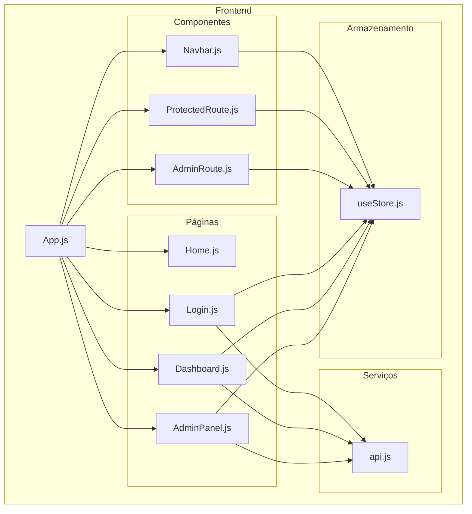
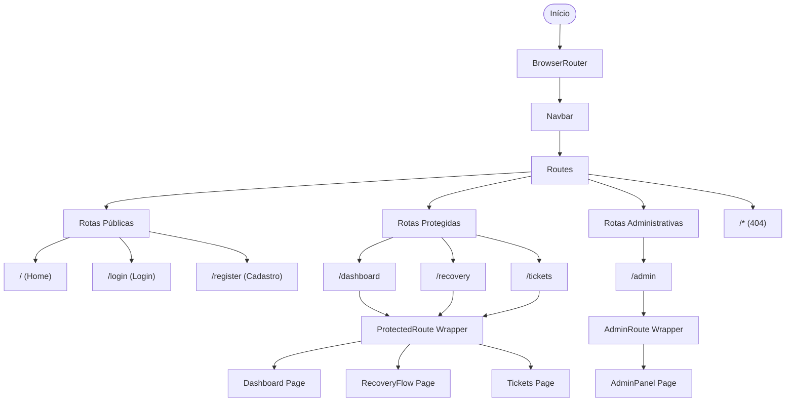
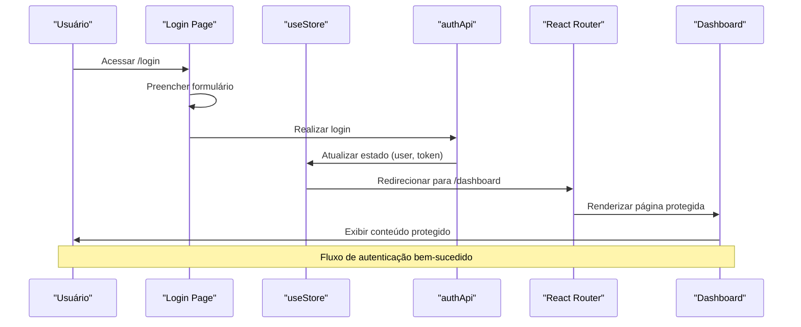
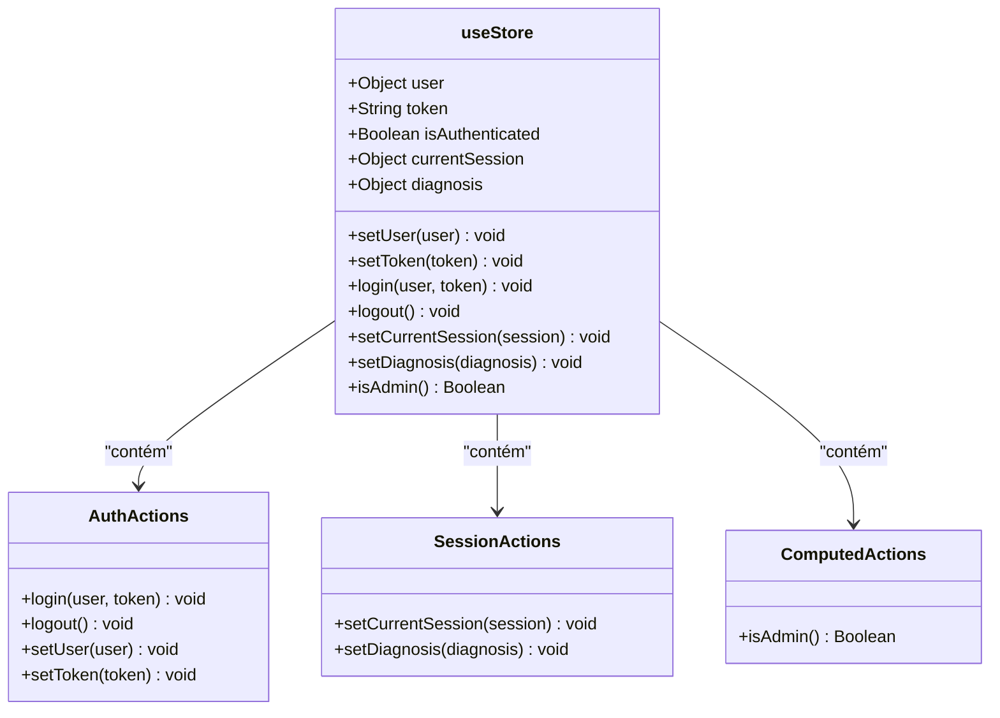
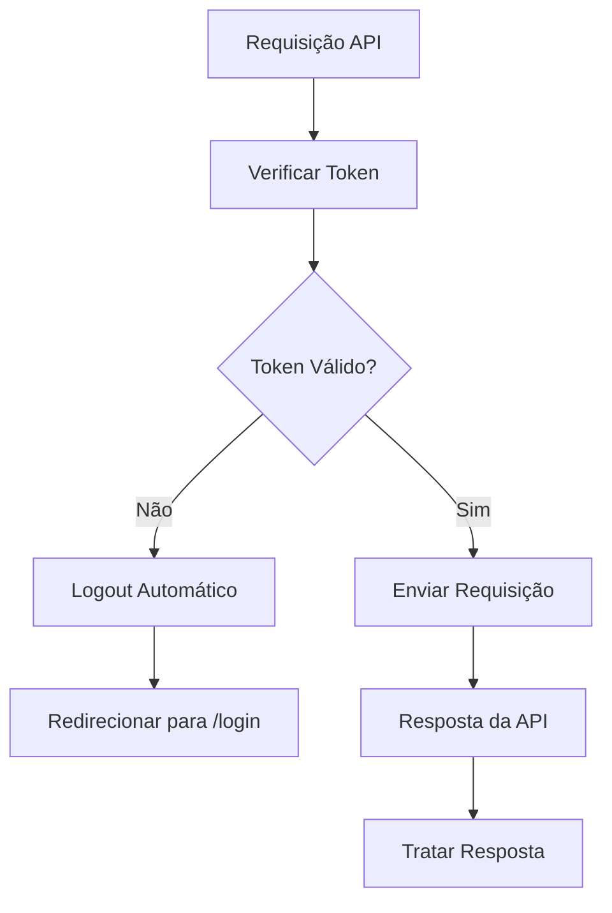

# Arquitetura de Componentes React

<cite>
**Arquivo Referenciados Neste Documento**
- [Navbar.js](file://frontend/src/components/Navbar.js)
- [ProtectedRoute.js](file://frontend/src/components/ProtectedRoute.js)
- [AdminRoute.js](file://frontend/src/components/AdminRoute.js)
- [App.js](file://frontend/src/App.js)
- [useStore.js](file://frontend/src/store/useStore.js)
- [api.js](file://frontend/src/services/api.js)
- [Dashboard.js](file://frontend/src/pages/Dashboard.js)
- [AdminPanel.js](file://frontend/src/pages/AdminPanel.js)
- [Login.js](file://frontend/src/pages/Login.js)
- [Home.js](file://frontend/src/pages/Home.js)
</cite>

## Sumário
- Introdução
- Estrutura do Projeto
- Componentes Principais
  - Navbar
  - ProtectedRoute
  - AdminRoute
- Arquitetura de Roteamento
- Armazenamento de Estado
- Componentes Reutilizáveis
- Exemplos de Uso e Extensão
- Considerações de Desempenho
- Guia de Solução de Problemas
- Conclusão

## Introdução
Este documento apresenta a arquitetura de componentes React do projeto, com foco especial nos componentes Navbar, ProtectedRoute e AdminRoute. Esses componentes constituem o cerne da experiência do usuário e do sistema de segurança da aplicação. O objetivo é fornecer uma compreensão abrangente de sua estrutura, propriedades, comportamento e integração com o sistema de roteamento e armazenamento de estado.

## Estrutura do Projeto
A aplicação segue uma estrutura organizada com separação clara entre componentes, páginas, serviços e armazenamento de estado. Os componentes principais estão localizados em `frontend/src/components`, enquanto as páginas específicas estão em `frontend/src/pages`. O estado global é gerenciado pelo Zustand através do arquivo `useStore.js`.



**Fonte do Diagrama**
- [App.js:34-93](file://frontend/src/App.js#L34-L93)
- [Navbar.js:6-174](file://frontend/src/components/Navbar.js#L6-L174)
- [ProtectedRoute.js:5-16](file://frontend/src/components/ProtectedRoute.js#L5-L16)
- [AdminRoute.js:5-20](file://frontend/src/components/AdminRoute.js#L5-L20)

**Seção Fonte**
- [App.js:1-93](file://frontend/src/App.js#L1-L93)

## Componentes Principais

### Navbar
O componente Navbar é um elemento de interface reutilizável que fornece navegação e funcionalidades de autenticação. Ele se adapta automaticamente para dispositivos móveis e desktop, exibindo diferentes menus conforme o estado de autenticação do usuário.

#### Propriedades e Estados
- **Propriedades**: Nenhuma propriedade obrigatória
- **Estados Internos**: 
  - `mobileMenuOpen`: Controla a visibilidade do menu mobile
- **Dependências**: 
  - `useStore`: Para acesso ao estado de autenticação e informações do usuário
  - `useNavigate`: Para navegação programática

#### Funcionalidades
- **Navegação Desktop**: Exibe links para recuperação, dashboard, tickets e admin (apenas para administradores)
- **Navegação Mobile**: Menu responsivo com opções condicionais
- **Autenticação**: Mostra botões de login/cadastro para convidados e informações do usuário para autenticados
- **Logout**: Função de encerramento de sessão com redirecionamento automático

#### Design e Estilo
- Layout responsivo com Tailwind CSS
- Ícones SVG para representar funcionalidades
- Tema escuro com gradientes e bordas personalizadas
- Feedback visual para estados interativos

**Seção Fonte**
- [Navbar.js:1-174](file://frontend/src/components/Navbar.js#L1-L174)

### ProtectedRoute
O componente ProtectedRoute é um guardião de rotas que garante acesso restrito às páginas protegidas. Ele implementa a lógica de autenticação baseada no estado global da aplicação.

#### Propriedades
- `{children}`: Elemento React que será renderizado se o usuário estiver autenticado

#### Lógica de Autenticação
- Verifica o estado `isAuthenticated` do store
- Redireciona para `/login` se o usuário não estiver autenticado
- Renderiza as children se a autenticação for válida

#### Integração com Roteamento
- Utilizado como wrapper nas rotas que requerem autenticação
- Permite acesso condicional baseado no estado de autenticação

**Seção Fonte**
- [ProtectedRoute.js:1-16](file://frontend/src/components/ProtectedRoute.js#L1-L16)

### AdminRoute
O componente AdminRoute é uma extensão do ProtectedRoute que adiciona controle de nível de acesso. Ele restringe o acesso a conteúdo exclusivo para administradores do sistema.

#### Propriedades
- `{children}`: Elemento React que será renderizado se o usuário for administrador

#### Lógica de Controle
- Primeiro verifica autenticação (sem autenticação -> redireciona para `/login`)
- Verifica se o usuário possui papel de administrador (`user.role === 'admin'`)
- Redireciona para `/dashboard` se o usuário não for administrador
- Renderiza as children se o usuário for administrador

#### Integração com Roteamento
- Utilizado exclusivamente para rotas administrativas
- Fornece segurança adicional além da autenticação básica

**Seção Fonte**
- [AdminRoute.js:1-20](file://frontend/src/components/AdminRoute.js#L1-L20)

## Arquitetura de Roteamento

### Configuração de Rotas
O sistema de roteamento é configurado no componente principal App.js, utilizando o React Router DOM. As rotas são organizadas em categorias lógicas:



**Fonte do Diagrama**
- [App.js:41-73](file://frontend/src/App.js#L41-L73)

### Fluxo de Autenticação
O fluxo de autenticação envolve múltiplas etapas que garantem segurança e experiência do usuário:



**Fonte do Diagrama**
- [Login.js:19-35](file://frontend/src/pages/Login.js#L19-L35)
- [useStore.js:20-32](file://frontend/src/store/useStore.js#L20-L32)

**Seção Fonte**
- [App.js:34-93](file://frontend/src/App.js#L34-L93)

## Armazenamento de Estado

### Zustand Store
O sistema utiliza Zustand para gerenciamento de estado global, proporcionando uma solução leve e eficiente comparada a alternativas mais complexas.

#### Estados Gerenciados
- **Auth State**: Informações de usuário e token de autenticação
- **Session State**: Dados de sessão atual e diagnóstico em andamento
- **Computed State**: Funções computadas para verificação de permissões

#### Estrutura do Store


**Fonte do Diagrama**
- [useStore.js:4-52](file://frontend/src/store/useStore.js#L4-L52)

#### Persistência de Dados
O store utiliza middleware de persistência para manter dados críticos mesmo após recarregamento da página, incluindo:
- Informações do usuário
- Token de autenticação
- Status de autenticação

**Seção Fonte**
- [useStore.js:43-52](file://frontend/src/store/useStore.js#L43-L52)

## Componentes Reutilizáveis

### Características dos Componentes Reutilizáveis
Os componentes criados seguem princípios de reutilização eficazes:

#### Navbar
- **Responsividade**: Adapta-se automaticamente a diferentes tamanhos de tela
- **Personalização**: Ícones e textos podem ser facilmente modificados
- **Integração**: Funciona com qualquer sistema de navegação

#### ProtectedRoute e AdminRoute
- **Flexibilidade**: Podem ser aplicados a qualquer componente
- **Configurabilidade**: Apenas exigem o wrapper necessário
- **Segurança**: Implementam lógica de acesso centralizada

### Benefícios da Reutilização
- **Manutenção Simplificada**: Alterações em um lugar afetam todos os usos
- **Consistência**: Experiência uniforme em toda a aplicação
- **Desenvolvimento Rápido**: Componentes prontos para uso em novas funcionalidades
- **Testabilidade**: Facilidade de testar lógica de autenticação em isolamento

## Exemplos de Uso e Extensão

### Exemplo de Uso do ProtectedRoute
Para proteger uma nova página, basta envolver o componente com o ProtectedRoute:

```javascript
<Route path="/minha-pagina-protegida" element={
  <ProtectedRoute>
    <MinhaPaginaProtegida />
  </ProtectedRoute>
} />
```

### Exemplo de Uso do AdminRoute
Para criar uma nova rota administrativa:

```javascript
<Route path="/admin/minha-funcionalidade" element={
  <AdminRoute>
    <MinhaFuncionalidadeAdmin />
  </AdminRoute>
} />
```

### Extensão de Componentes

#### Adicionando Novos Itens ao Navbar
Para adicionar um novo item de navegação:

1. **Definir o link**: Adicionar novo `Link` no componente Navbar
2. **Adicionar permissão**: Se necessário, incluir verificação condicional
3. **Atualizar estilo**: Ajustar classes CSS conforme necessário

#### Criando Novos Guards
Para criar um guard de acesso intermediário:

```javascript
const RoleBasedRoute = ({ children, requiredRole }) => {
  const { isAuthenticated, user } = useStore();
  
  if (!isAuthenticated) {
    return <Navigate to="/login" replace />;
  }
  
  if (user?.role !== requiredRole) {
    return <Navigate to="/dashboard" replace />;
  }
  
  return children;
};
```

#### Personalizando o Store
Para adicionar novos estados:

```javascript
const useStore = create(
  persist(
    (set, get) => ({
      // ... estados existentes
      novaFeature: null,
      setNovaFeature: (feature) => set({ novaFeature: feature }),
    }),
    // ... persist config
  )
);
```

## Considerações de Desempenho

### Otimizações Implementadas
- **Lazy Loading**: Componentes são carregados apenas quando necessários
- **Memoização**: Estados são otimizados para evitar renders desnecessários
- **Persistência Local**: Dados críticos são mantidos em cache
- **Interceptores de API**: Tratamento eficiente de requisições e respostas

### Melhorias Potenciais
- **Code Splitting**: Implementar divisão de código para rotas menos utilizadas
- **Suspense**: Utilizar React Suspense para melhor experiência de carregamento
- **Virtualização**: Para listagens grandes, considerar virtualização de dados
- **Cache de Consultas**: Implementar cache mais elaborado para dados de API

## Guia de Solução de Problemas

### Problemas Comuns de Autenticação

#### Erro 401 - Token Inválido
O interceptor de API lida automaticamente com tokens expirados:



**Fonte do Diagrama**
- [api.js:30-40](file://frontend/src/services/api.js#L30-L40)

#### Problemas de Navegação
Para resolver problemas de navegação condicional:

1. **Verificar estado de autenticação**: Confirmar se `isAuthenticated` está correto
2. **Checar permissões**: Verificar se o usuário possui o papel necessário
3. **Validar rotas**: Garantir que as rotas estejam corretamente configuradas

**Seção Fonte**
- [api.js:15-40](file://frontend/src/services/api.js#L15-L40)

### Depuração de Componentes

#### Debugging do Navbar
- **Verificar dependências**: Confirmar que `useStore` está funcionando corretamente
- **Testar estados**: Validar exibição condicional para usuários autenticados
- **Checar eventos**: Garantir que funções de logout e navegação estão funcionando

#### Debugging de Guards
- **Monitorar estados**: Verificar valores de `isAuthenticated` e `user.role`
- **Testar redirecionamentos**: Confirmar que redirecionamentos ocorrem conforme esperado
- **Validar children**: Garantir que componentes filhos são renderizados corretamente

## Conclusão

A arquitetura de componentes React demonstrada neste projeto exemplifica boas práticas de desenvolvimento moderno, com ênfase em:

- **Segurança Centralizada**: Componentes de proteção de acesso garantem integridade do sistema
- **Reutilização Eficiente**: Componentes bem projetados permitem fácil expansão funcional
- **Experiência do Usuário**: Interface responsiva e intuitiva que se adapta a diferentes contextos
- **Manutenção Simplificada**: Estrutura clara e modular facilita atualizações e correções

Os componentes Navbar, ProtectedRoute e AdminRoute formam a base sólida para um sistema seguro e escalável, podendo servir como ponto de partida para desenvolvimento de funcionalidades adicionais com padrões consistentes de segurança e usabilidade.