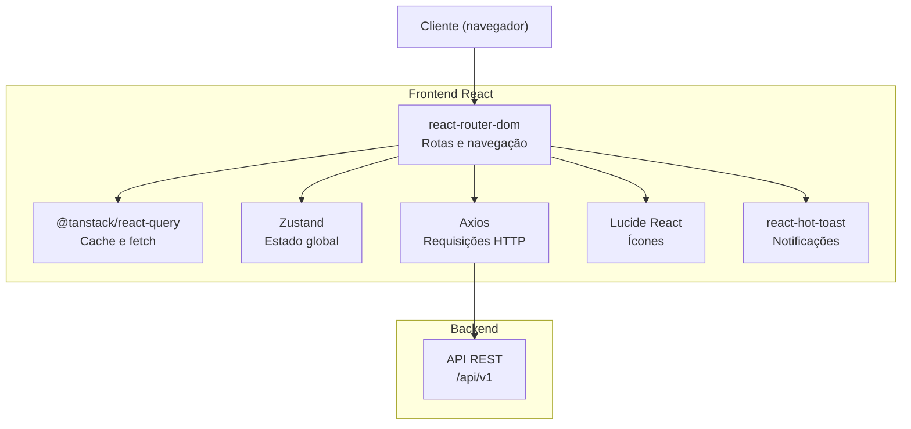
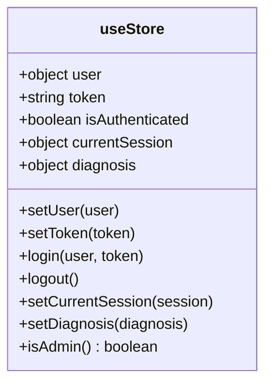
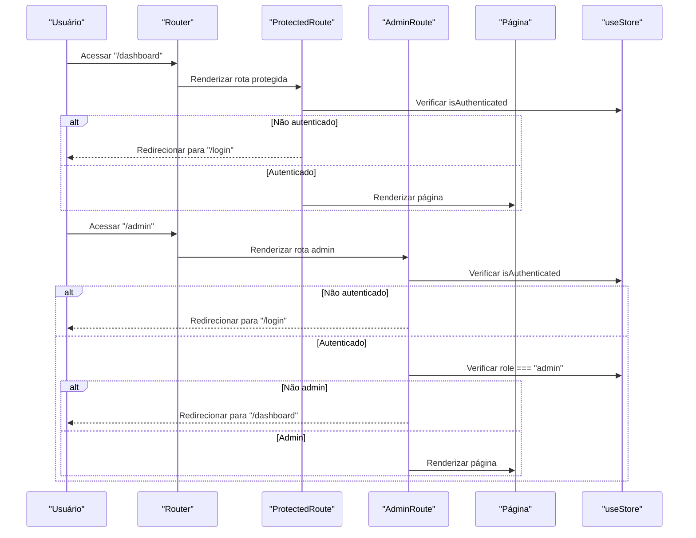
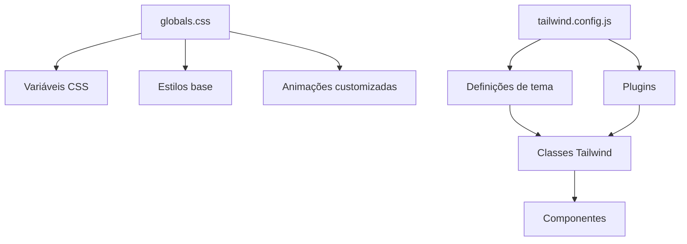
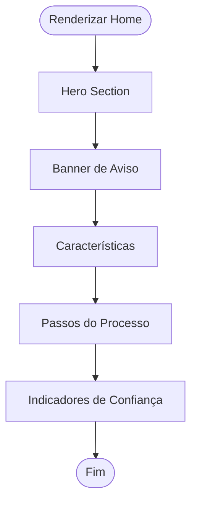
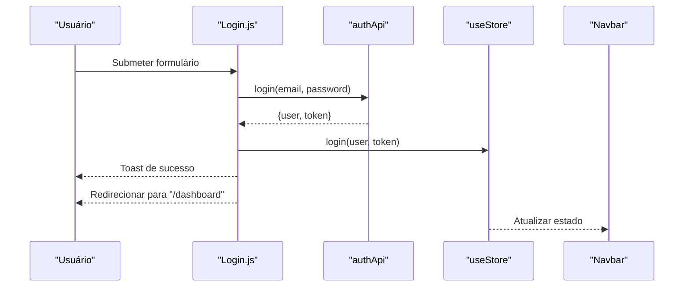
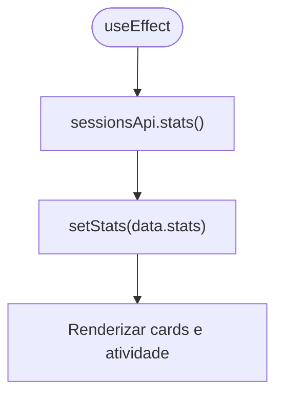
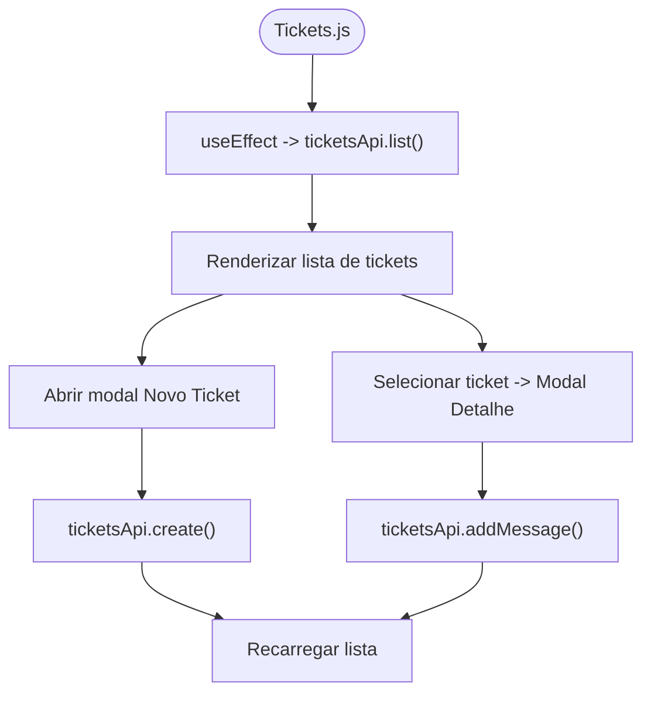
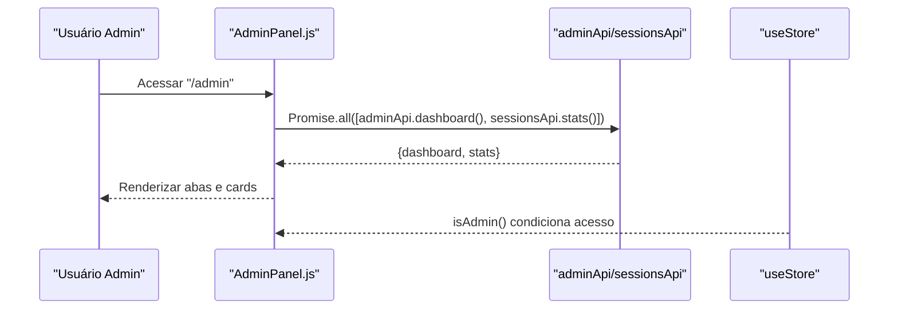
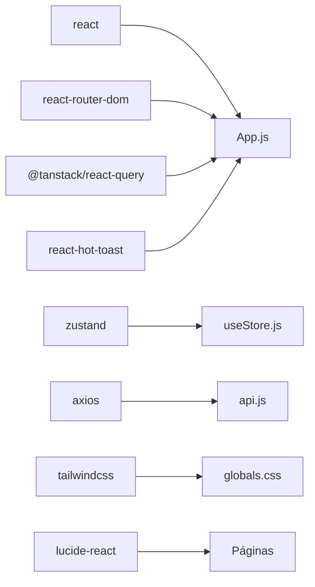

# Frontend React

<cite>
**Arquivo referenciados nesta documentação**
- [App.js](file://frontend/src/App.js)
- [index.js](file://frontend/src/index.js)
- [package.json](file://frontend/package.json)
- [tailwind.config.js](file://frontend/tailwind.config.js)
- [globals.css](file://frontend/src/styles/globals.css)
- [Navbar.js](file://frontend/src/components/Navbar.js)
- [ProtectedRoute.js](file://frontend/src/components/ProtectedRoute.js)
- [AdminRoute.js](file://frontend/src/components/AdminRoute.js)
- [useStore.js](file://frontend/src/store/useStore.js)
- [api.js](file://frontend/src/services/api.js)
- [Home.js](file://frontend/src/pages/Home.js)
- [Login.js](file://frontend/src/pages/Login.js)
- [Dashboard.js](file://frontend/src/pages/Dashboard.js)
- [Tickets.js](file://frontend/src/pages/Tickets.js)
- [AdminPanel.js](file://frontend/src/pages/AdminPanel.js)
</cite>

## Sumário
1. [Introdução](#introdução)
2. [Estrutura do Projeto](#estrutura-do-projeto)
3. [Componentes Principais](#componentes-principais)
4. [Arquitetura Geral](#arquitetura-geral)
5. [Análise Detalhada dos Componentes](#análise-detalhada-dos-componentes)
6. [Análise de Dependências](#análise-de-dependências)
7. [Considerações de Desempenho](#considerações-de-desempenho)
8. [Guia de Solução de Problemas](#guia-de-solução-de-problemas)
9. [Conclusão](#conclusão)
10. [Apêndices](#apêndices)

## Introdução
Esta documentação apresenta a interface web React do projeto, abordando arquitetura de componentes, gerenciamento de estado com Zustand, navegação e rotas, integração com a API REST, e design system com TailwindCSS. Para cada página, são explicadas funcionalidades, estados e interações. Também são documentados componentes reutilizáveis, hooks personalizados, padrões de desenvolvimento, práticas de performance, acessibilidade e orientações para extensão e customização.

## Estrutura do Projeto
A interface frontend está organizada em camadas lógicas:
- Entrada e roteamento: App.js e index.js
- Navegação e proteção de rotas: Navbar.js, ProtectedRoute.js, AdminRoute.js
- Gerenciamento de estado: useStore.js (Zustand)
- Integração com API: api.js
- Design system: tailwind.config.js e globals.css
- Páginas: Home, Login, Dashboard, Tickets, AdminPanel e outras páginas

```mermaid
graph TB
subgraph "Entrada"
IDX["index.js"]
APP["App.js"]
end
subgraph "Navegação"
NAV["Navbar.js"]
PROT["ProtectedRoute.js"]
ADMR["AdminRoute.js"]
end
subgraph "Estado"
STORE["useStore.js"]
end
subgraph "Design System"
TWCFG["tailwind.config.js"]
CSS["globals.css"]
end
subgraph "API"
API["api.js"]
end
subgraph "Páginas"
HOME["Home.js"]
LOGIN["Login.js"]
DASH["Dashboard.js"]
TICK["Tickets.js"]
ADMIN["AdminPanel.js"]
end
IDX --> APP
APP --> NAV
APP --> HOME
APP --> LOGIN
APP --> DASH
APP --> TICK
APP --> ADMIN
APP --> PROT
APP --> ADMR
NAV --> STORE
DASH --> API
TICK --> API
ADMIN --> API
API --> STORE
APP --> CSS
APP --> TWCFG
```

**Diagrama fonte**
- [index.js:1-12](file://frontend/src/index.js#L1-L12)
- [App.js:1-93](file://frontend/src/App.js#L1-L93)
- [Navbar.js:1-174](file://frontend/src/components/Navbar.js#L1-L174)
- [ProtectedRoute.js:1-16](file://frontend/src/components/ProtectedRoute.js#L1-L16)
- [AdminRoute.js:1-20](file://frontend/src/components/AdminRoute.js#L1-L20)
- [useStore.js:1-53](file://frontend/src/store/useStore.js#L1-L53)
- [api.js:1-90](file://frontend/src/services/api.js#L1-L90)
- [Home.js:1-137](file://frontend/src/pages/Home.js#L1-L137)
- [Login.js:1-122](file://frontend/src/pages/Login.js#L1-L122)
- [Dashboard.js:1-212](file://frontend/src/pages/Dashboard.js#L1-L212)
- [Tickets.js:1-359](file://frontend/src/pages/Tickets.js#L1-L359)
- [AdminPanel.js:1-324](file://frontend/src/pages/AdminPanel.js#L1-L324)
- [tailwind.config.js:1-72](file://frontend/tailwind.config.js#L1-L72)
- [globals.css:1-114](file://frontend/src/styles/globals.css#L1-L114)

**Seção fonte**
- [App.js:1-93](file://frontend/src/App.js#L1-L93)
- [index.js:1-12](file://frontend/src/index.js#L1-L12)

## Componentes Principais
- App.js: Configura roteamento, provider do React Query, notificações, e montagem das páginas.
- Navbar.js: Barra de navegação responsiva com links condicionais, logout e menu mobile.
- ProtectedRoute.js e AdminRoute.js: Protegem rotas com base no estado de autenticação e papel do usuário.
- useStore.js: Armazena usuário, token, sessão atual e diagnóstico, com persistência local.
- api.js: Instância Axios com interceptadores para token e tratamento de erros 401.
- Design system: TailwindCSS configurado com variáveis CSS, plugins e animações customizadas.

**Seção fonte**
- [App.js:1-93](file://frontend/src/App.js#L1-L93)
- [Navbar.js:1-174](file://frontend/src/components/Navbar.js#L1-L174)
- [ProtectedRoute.js:1-16](file://frontend/src/components/ProtectedRoute.js#L1-L16)
- [AdminRoute.js:1-20](file://frontend/src/components/AdminRoute.js#L1-L20)
- [useStore.js:1-53](file://frontend/src/store/useStore.js#L1-L53)
- [api.js:1-90](file://frontend/src/services/api.js#L1-L90)
- [tailwind.config.js:1-72](file://frontend/tailwind.config.js#L1-L72)
- [globals.css:1-114](file://frontend/src/styles/globals.css#L1-L114)

## Arquitetura Geral
A aplicação segue um padrão de componentes funcionais com gerenciamento centralizado de estado e integração com API REST via Axios. O React Query é usado para cache e invalidação automática de dados. O design system é baseado em TailwindCSS com variáveis CSS e plugins.



**Diagrama fonte**
- [App.js:1-93](file://frontend/src/App.js#L1-L93)
- [useStore.js:1-53](file://frontend/src/store/useStore.js#L1-L53)
- [api.js:1-90](file://frontend/src/services/api.js#L1-L90)
- [package.json:1-59](file://frontend/package.json#L1-L59)

## Análise Detalhada dos Componentes

### Estado Global com Zustand
O estado global é gerenciado com persistência local, incluindo usuário, token, sessão atual e diagnóstico. Funções auxiliares permitem login, logout e cálculo de isAdmin.



**Diagrama fonte**
- [useStore.js:1-53](file://frontend/src/store/useStore.js#L1-L53)

**Seção fonte**
- [useStore.js:1-53](file://frontend/src/store/useStore.js#L1-L53)

### Navegação e Rotas
- Roteamento com React Router DOM.
- Rotas públicas: Home, Login, Register.
- Rotas protegidas: Dashboard, RecoveryFlow, Tickets.
- Rota administrativa: AdminPanel.
- Interceptadores de erro 401 deslogam automaticamente.



**Diagrama fonte**
- [App.js:48-72](file://frontend/src/App.js#L48-L72)
- [ProtectedRoute.js:1-16](file://frontend/src/components/ProtectedRoute.js#L1-L16)
- [AdminRoute.js:1-20](file://frontend/src/components/AdminRoute.js#L1-L20)
- [useStore.js:37-41](file://frontend/src/store/useStore.js#L37-L41)

**Seção fonte**
- [App.js:1-93](file://frontend/src/App.js#L1-L93)
- [ProtectedRoute.js:1-16](file://frontend/src/components/ProtectedRoute.js#L1-L16)
- [AdminRoute.js:1-20](file://frontend/src/components/AdminRoute.js#L1-L20)
- [useStore.js:1-53](file://frontend/src/store/useStore.js#L1-L53)

### Design System com TailwindCSS
- Variáveis CSS para cores, bordas, radius e animações.
- Plugins: @tailwindcss/forms.
- Estilos globais: scrollbars, animações, efeitos glass.



**Diagrama fonte**
- [globals.css:1-114](file://frontend/src/styles/globals.css#L1-L114)
- [tailwind.config.js:1-72](file://frontend/tailwind.config.js#L1-L72)

**Seção fonte**
- [globals.css:1-114](file://frontend/src/styles/globals.css#L1-L114)
- [tailwind.config.js:1-72](file://frontend/tailwind.config.js#L1-L72)

### Páginas

#### Home
- Seção hero com call-to-action.
- Aviso importante com ícone de alerta.
- Características e passos explicativos.
- Componentes reutilizáveis: FeatureCard e Step.



**Diagrama fonte**
- [Home.js:1-137](file://frontend/src/pages/Home.js#L1-L137)

**Seção fonte**
- [Home.js:1-137](file://frontend/src/pages/Home.js#L1-L137)

#### Login
- Formulário com campos de e-mail e senha, visibilidade da senha.
- Validação e submissão via authApi.
- Notificações com react-hot-toast.
- Redirecionamento após login bem-sucedido.



**Diagrama fonte**
- [Login.js:1-122](file://frontend/src/pages/Login.js#L1-L122)
- [api.js:43-49](file://frontend/src/services/api.js#L43-L49)
- [useStore.js:20-32](file://frontend/src/store/useStore.js#L20-L32)
- [Navbar.js:1-174](file://frontend/src/components/Navbar.js#L1-L174)

**Seção fonte**
- [Login.js:1-122](file://frontend/src/pages/Login.js#L1-L122)
- [api.js:1-90](file://frontend/src/services/api.js#L1-L90)
- [useStore.js:1-53](file://frontend/src/store/useStore.js#L1-L53)

#### Dashboard
- Carrega estatísticas de sessões.
- Ações rápidas e cards de status.
- Atividade recente com ícones e cores condicionais.
- Componente reutilizável: StatCard.



**Diagrama fonte**
- [Dashboard.js:1-212](file://frontend/src/pages/Dashboard.js#L1-L212)
- [api.js:58](file://frontend/src/services/api.js#L58)
- [useStore.js:17-32](file://frontend/src/store/useStore.js#L17-L32)

**Seção fonte**
- [Dashboard.js:1-212](file://frontend/src/pages/Dashboard.js#L1-L212)
- [api.js:1-90](file://frontend/src/services/api.js#L1-L90)

#### Tickets
- Lista de tickets com status e prioridade coloridos.
- Modal para criação de novo ticket.
- Modal para visualizar e adicionar mensagens a um ticket.
- Estados locais para loading, form e seleção.



**Diagrama fonte**
- [Tickets.js:1-359](file://frontend/src/pages/Tickets.js#L1-L359)
- [api.js:68-75](file://frontend/src/services/api.js#L68-L75)

**Seção fonte**
- [Tickets.js:1-359](file://frontend/src/pages/Tickets.js#L1-L359)
- [api.js:1-90](file://frontend/src/services/api.js#L1-L90)

#### AdminPanel
- Abas: Visão Geral, Usuários, Sessões, Configurações.
- Carrega estatísticas combinadas de admin e sessões.
- Cards de status e distribuição de problemas.
- Mock de dados para usuários.



**Diagrama fonte**
- [AdminPanel.js:1-324](file://frontend/src/pages/AdminPanel.js#L1-L324)
- [api.js:77-87](file://frontend/src/services/api.js#L77-L87)
- [useStore.js:37-41](file://frontend/src/store/useStore.js#L37-L41)

**Seção fonte**
- [AdminPanel.js:1-324](file://frontend/src/pages/AdminPanel.js#L1-L324)
- [api.js:1-90](file://frontend/src/services/api.js#L1-L90)

## Análise de Dependências
- React e React DOM: renderização e elementos.
- React Router DOM: navegação e rotas.
- Zustand: gerenciamento de estado com persistência.
- Axios: requisições HTTP com interceptadores.
- React Query: cache e gerenciamento de consultas.
- TailwindCSS e plugins: design system.
- Lucide React: ícones SVG.
- React Hot Toast: notificações.



**Diagrama fonte**
- [package.json:1-59](file://frontend/package.json#L1-L59)
- [App.js:1-93](file://frontend/src/App.js#L1-L93)
- [api.js:1-90](file://frontend/src/services/api.js#L1-L90)
- [useStore.js:1-53](file://frontend/src/store/useStore.js#L1-L53)

**Seção fonte**
- [package.json:1-59](file://frontend/package.json#L1-L59)

## Considerações de Desempenho
- React Query: staleTime configurado para 5 minutos e retry=1 evitam sobrecarga de requisições.
- Persistência Zustand: apenas campos essenciais são salvos localmente.
- Lazy loading de componentes: pode ser adicionado para rotas menos acessadas.
- Memoização: useMemo/useCallback para listas grandes e callbacks.
- Ícones: Lucide React carrega somente os usados.
- CSS: Tailwind gera classes utilitárias; remover plugins desnecessários se necessário.

[Sem fonte pois esta seção fornece orientações gerais]

## Guia de Solução de Problemas
- Erros 401: O interceptor do Axios chama logout e redireciona para /login.
- Falhas de rede: Verifique proxy e URLs da API.
- Estado inconsistente: Confirme persistência do Zustand e sincronismo com backend.
- Estilos não aplicados: Verifique tailwind.config.js e build do Tailwind.

**Seção fonte**
- [api.js:29-40](file://frontend/src/services/api.js#L29-L40)

## Conclusão
A interface React adota uma arquitetura modular com Zustand para estado, React Router para navegação, React Query para cache e TailwindCSS para design. As páginas seguem padrões de componentização e reutilização, com fluxos de autenticação e administração bem definidos. A integração com a API REST é robusta com interceptadores e tratamento de erros.

[Sem fonte pois esta seção resume sem análise específica de arquivos]

## Apêndices

### Boas Práticas de Acessibilidade
- Labels descritivas para inputs e botões.
- Alt text para ícones quando não são puramente decorativos.
- Contraste de cores adequado nos temas escuros.
- Teclado: focos visíveis e navegação via teclado nas modais.
- Legendas e descrições de campos obrigatórios.

[Sem fonte pois esta seção fornece orientações gerais]

### Extensão e Customização
- Adicione novas rotas em App.js e proteja conforme necessário.
- Crie novos slices no Zustand para estados específicos.
- Estenda api.js com novos endpoints e módulos de serviço.
- Utilize tailwind.config.js para novas cores, tipografias e animações.
- Mantenha os componentes reutilizáveis e siga o design system.

[Sem fonte pois esta seção fornece orientações gerais]