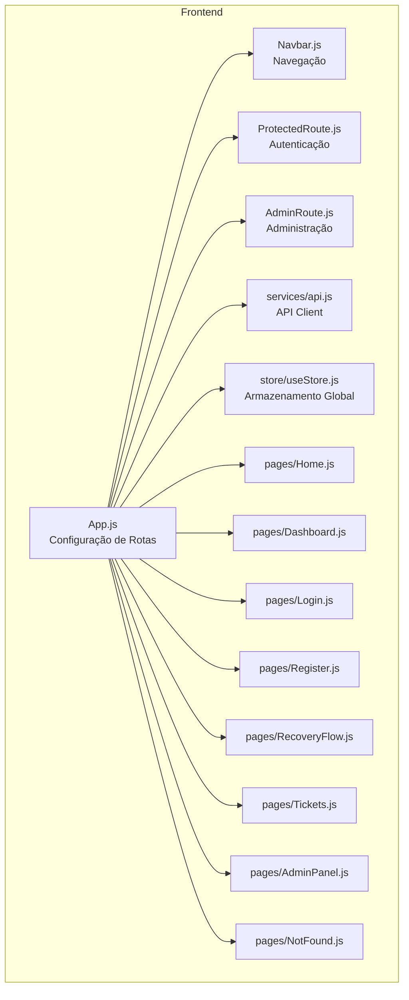
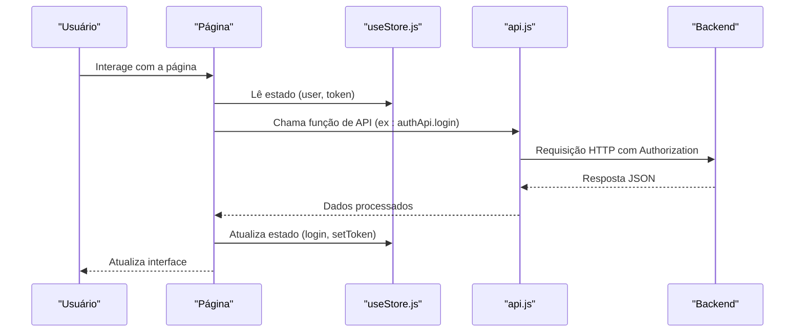
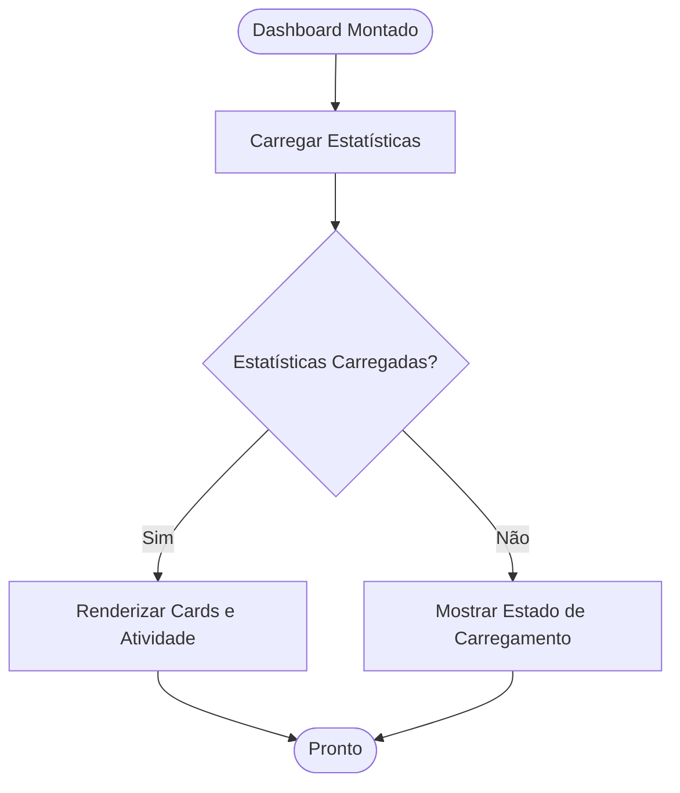
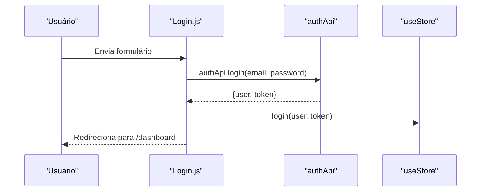
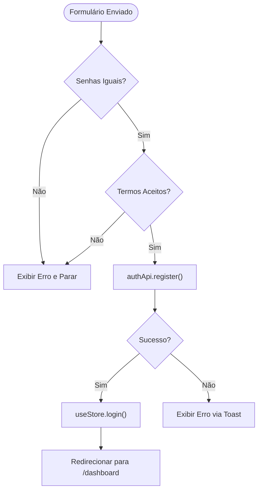
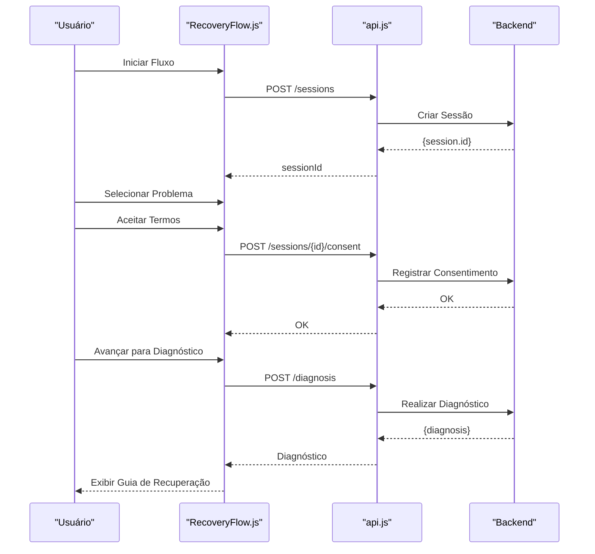
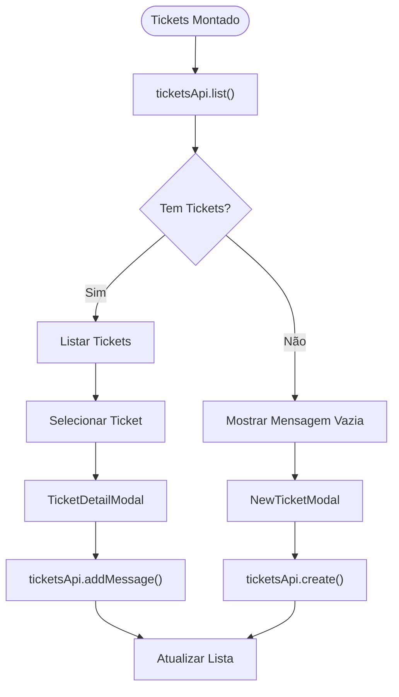
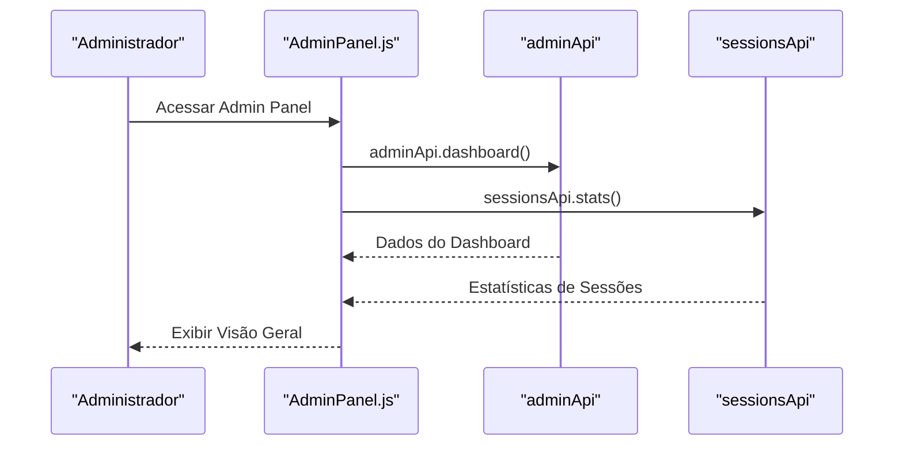
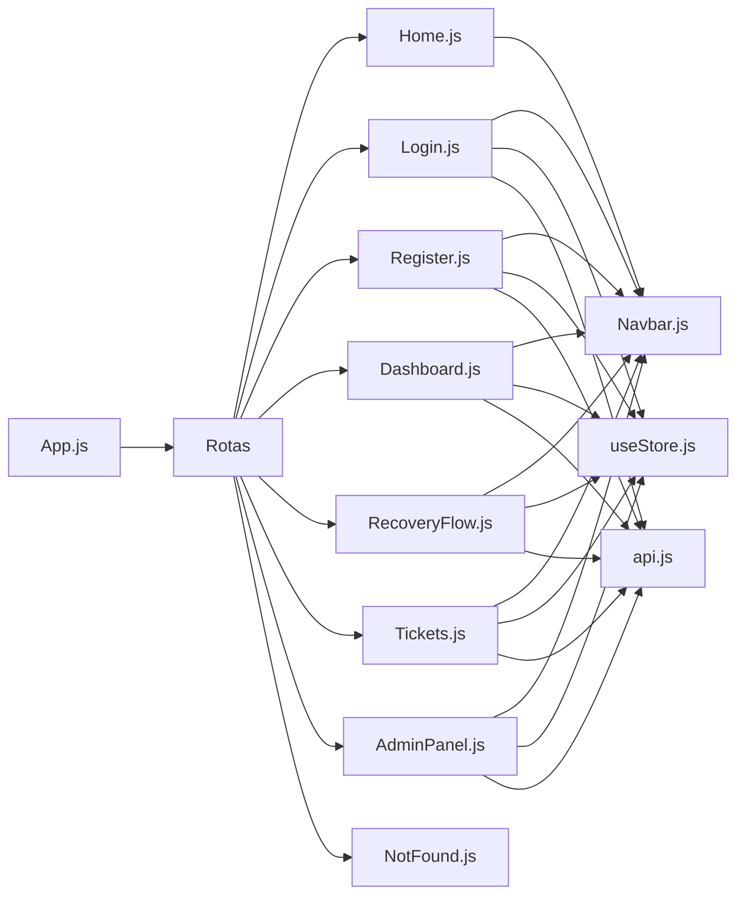

# Componentes de Página

<cite>
**Arquivos Referenciados Neste Documento**
- [Home.js](file://frontend/src/pages/Home.js)
- [Dashboard.js](file://frontend/src/pages/Dashboard.js)
- [Login.js](file://frontend/src/pages/Login.js)
- [Register.js](file://frontend/src/pages/Register.js)
- [RecoveryFlow.js](file://frontend/src/pages/RecoveryFlow.js)
- [Tickets.js](file://frontend/src/pages/Tickets.js)
- [AdminPanel.js](file://frontend/src/pages/AdminPanel.js)
- [NotFound.js](file://frontend/src/pages/NotFound.js)
- [api.js](file://frontend/src/services/api.js)
- [useStore.js](file://frontend/src/store/useStore.js)
- [App.js](file://frontend/src/App.js)
- [Navbar.js](file://frontend/src/components/Navbar.js)
- [ProtectedRoute.js](file://frontend/src/components/ProtectedRoute.js)
- [AdminRoute.js](file://frontend/src/components/AdminRoute.js)
- [README.md](file://README.md)
</cite>

## Sumário
- Apresentação geral do sistema e propósito
- Estrutura de pastas e componentes de página
- Visão geral da arquitetura de página e integração com backend
- Análise detalhada de cada página (Home, Dashboard, Login, Register, RecoveryFlow, Tickets, AdminPanel, NotFound)
- Considerações de usabilidade e acessibilidade
- Considerações de desempenho e otimizações
- Guia de solução de problemas

## Introdução
O sistema é um assistente guiado para recuperação e suporte de contas Apple ID, seguindo rigorosamente os processos oficiais da Apple. Ele oferece fluxos de recuperação de senha, suporte para verificação em duas etapas, orientações para bloqueio de ativação e acompanhamento completo de solicitações. O frontend é construído com React, TailwindCSS e Zustand, integrando-se ao backend Node.js através de uma API REST padronizada.

**Secção fontes**
- [README.md:1-108](file://README.md#L1-L108)

## Estrutura do Projeto
O frontend organiza os componentes de página dentro de `frontend/src/pages`, com serviços de API em `frontend/src/services`, armazenamento global em `frontend/src/store`, e componentes reutilizáveis em `frontend/src/components`. A navegação e rotas são configuradas em `frontend/src/App.js`.

**Diagrama fontes**
- [App.js:1-93](file://frontend/src/App.js#L1-L93)
- [Navbar.js:1-174](file://frontend/src/components/Navbar.js#L1-L174)
- [ProtectedRoute.js:1-16](file://frontend/src/components/ProtectedRoute.js#L1-L16)
- [AdminRoute.js:1-20](file://frontend/src/components/AdminRoute.js#L1-L20)
- [api.js:1-90](file://frontend/src/services/api.js#L1-L90)
- [useStore.js:1-53](file://frontend/src/store/useStore.js#L1-L53)
- [Home.js:1-137](file://frontend/src/pages/Home.js#L1-L137)
- [Dashboard.js:1-212](file://frontend/src/pages/Dashboard.js#L1-L212)
- [Login.js:1-122](file://frontend/src/pages/Login.js#L1-L122)
- [Register.js:1-213](file://frontend/src/pages/Register.js#L1-L213)
- [RecoveryFlow.js:1-517](file://frontend/src/pages/RecoveryFlow.js#L1-L517)
- [Tickets.js:1-359](file://frontend/src/pages/Tickets.js#L1-L359)
- [AdminPanel.js:1-324](file://frontend/src/pages/AdminPanel.js#L1-L324)
- [NotFound.js:1-32](file://frontend/src/pages/NotFound.js#L1-L32)

**Secção fontes**
- [App.js:1-93](file://frontend/src/App.js#L1-L93)

## Arquitetura de Páginas e Integração com Backend
- Autenticação e roteamento:
  - Rotas públicas: Home, Login, Register
  - Rotas protegidas: Dashboard, RecoveryFlow, Tickets
  - Rota administrativa: AdminPanel
  - Componentes de proteção: ProtectedRoute e AdminRoute
- Armazenamento global:
  - Zustand persistente para usuário, token, sessão e diagnóstico
  - Interceptor de requisições adiciona Authorization header
  - Interceptor de respostas trata 401 (logout automático)
- Serviços de API:
  - Client Axios com base URL variável
  - Módulos específicos: authApi, sessionsApi, diagnosisApi, ticketsApi, adminApi
  - Integração com Toast para feedback visual

**Diagrama fontes**
- [api.js:15-40](file://frontend/src/services/api.js#L15-L40)
- [useStore.js:16-32](file://frontend/src/store/useStore.js#L16-L32)
- [Login.js:19-35](file://frontend/src/pages/Login.js#L19-L35)
- [Register.js:22-53](file://frontend/src/pages/Register.js#L22-L53)

**Secção fontes**
- [api.js:1-90](file://frontend/src/services/api.js#L1-L90)
- [useStore.js:1-53](file://frontend/src/store/useStore.js#L1-L53)
- [ProtectedRoute.js:1-16](file://frontend/src/components/ProtectedRoute.js#L1-L16)
- [AdminRoute.js:1-20](file://frontend/src/components/AdminRoute.js#L1-L20)

## Componentes de Página

### Home
- Funcionalidade principal:
  - Apresenta o valor do produto e informações de aviso importante
  - Exibe recursos do sistema e passos do fluxo
  - Fornece links para início de recuperação e acesso ao painel
- Estados internos:
  - Nenhum estado local (apenas componentes auxiliares)
- Interações com o usuário:
  - Links para `/recovery` e `/login`
  - Destaque para aviso legal e recomendações de segurança
- Integração com backend:
  - Nenhuma chamada direta de API
- Considerações de usabilidade:
  - Layout responsivo com gradientes e ícones
  - Feedback visual com cores de alerta

**Secção fontes**
- [Home.js:1-137](file://frontend/src/pages/Home.js#L1-L137)

### Dashboard
- Funcionalidade principal:
  - Painel de controle com ações rápidas, estatísticas e atividade recente
  - Links para iniciar recuperação, visualizar tickets e abrir suporte
- Estados internos:
  - `stats`: dados de estatísticas carregados via API
  - `loading`: estado de carregamento
  - `recentActivity`: dados mockados para demonstração
- Interações com o usuário:
  - Cards com ações de navegação
  - Estatísticas de sessões, diagnósticos, sessões ativas e consentimentos
- Integração com backend:
  - Chamada assíncrona para `sessionsApi.stats()`
  - Utiliza `useStore` para obter dados do usuário logado
- Considerações de usabilidade:
  - Layout em grade responsivo
  - Feedback visual com ícones e cores por status

**Diagrama fontes**
- [Dashboard.js:16-34](file://frontend/src/pages/Dashboard.js#L16-L34)

**Secção fontes**
- [Dashboard.js:1-212](file://frontend/src/pages/Dashboard.js#L1-L212)

### Login
- Funcionalidade principal:
  - Formulário de autenticação com campos de e-mail e senha
  - Opção de mostrar/esconder senha e lembrar usuário
- Estados internos:
  - `formData`: email e senha
  - `showPassword`: visibilidade da senha
  - `loading`: estado de carregamento durante requisição
- Interações com o usuário:
  - Validação de campos obrigatórios
  - Feedback de erro via toast
  - Redirecionamento para `/dashboard` após sucesso
- Integração com backend:
  - `authApi.login()` para autenticação
  - Atualiza `useStore` com usuário e token
- Considerações de usabilidade:
  - Feedback visual com ícones e cores
  - Validação de tamanho mínimo de senha

**Diagrama fontes**
- [Login.js:8-35](file://frontend/src/pages/Login.js#L8-L35)
- [api.js:42-49](file://frontend/src/services/api.js#L42-L49)
- [useStore.js:20-24](file://frontend/src/store/useStore.js#L20-L24)

**Secção fontes**
- [Login.js:1-122](file://frontend/src/pages/Login.js#L1-L122)

### Register
- Funcionalidade principal:
  - Formulário de cadastro com nome, e-mail, senha e confirmação
  - Termos de uso e política de privacidade
- Estados internos:
  - `formData`: nome, email, senha, confirmação
  - `showPassword`: visibilidade da senha
  - `loading`: estado de carregamento
  - `agreedToTerms`: aceitação de termos
- Interações com o usuário:
  - Validação de senhas iguais
  - Indicador de força da senha
  - Feedback de erro via toast
  - Redirecionamento para `/dashboard` após sucesso
- Integração com backend:
  - `authApi.register()` para criação de conta
  - Atualiza `useStore` com usuário e token
- Considerações de usabilidade:
  - Indicador visual de força da senha
  - Validação de requisitos mínimos de senha

**Diagrama fontes**
- [Register.js:8-53](file://frontend/src/pages/Register.js#L8-L53)
- [api.js:42-49](file://frontend/src/services/api.js#L42-L49)
- [useStore.js:20-24](file://frontend/src/store/useStore.js#L20-L24)

**Secção fontes**
- [Register.js:1-213](file://frontend/src/pages/Register.js#L1-L213)

### RecoveryFlow
- Funcionalidade principal:
  - Fluxo guiado de recuperação com 4 etapas: problema, consentimento, diagnóstico e guia de recuperação
  - Diagnóstico automático e recomendações específicas
- Estados internos:
  - `currentStep`: etapa atual (1-4)
  - `formData`: dados do problema, e-mail e consentimentos
  - `diagnosis`: resultado do diagnóstico
  - `loading`: estado durante diagnóstico
  - `sessionId`: identificador da sessão de recuperação
- Interações com o usuário:
  - Navegação entre etapas com botões de avançar/voltar
  - Validação de seleção de problema e aceitação de termos
  - Visualização de diagnóstico com severidade e recomendações
- Integração com backend:
  - Criação de sessão (`/sessions`)
  - Registro de consentimento (`/sessions/{id}/consent`)
  - Diagnóstico (`/diagnosis`)
  - Utiliza `api` com interceptor de token
- Considerações de usabilidade:
  - Progresso visual com etapas completadas
  - Guias específicos para diferentes tipos de problema

**Diagrama fontes**
- [RecoveryFlow.js:18-106](file://frontend/src/pages/RecoveryFlow.js#L18-L106)
- [api.js:51-66](file://frontend/src/services/api.js#L51-L66)

**Secção fontes**
- [RecoveryFlow.js:1-517](file://frontend/src/pages/RecoveryFlow.js#L1-L517)

### Tickets
- Funcionalidade principal:
  - Listagem de tickets de suporte com status e prioridade
  - Criação de novos tickets e visualização de detalhes
  - Envio de mensagens em tickets existentes
- Estados internos:
  - `tickets`: lista de tickets
  - `loading`: estado de carregamento
  - `showNewTicket`: modal de novo ticket
  - `selectedTicket`: ticket selecionado para detalhes
- Interações com o usuário:
  - Clique para abrir detalhes de ticket
  - Formulário para criação de novo ticket
  - Envio de mensagens em tickets
- Integração com backend:
  - `ticketsApi.list()`, `ticketsApi.create()`, `ticketsApi.addMessage()`
  - Atualização em tempo real após operações
- Considerações de usabilidade:
  - Modal para novos tickets e detalhes
  - Ícones e cores para status e prioridade

**Diagrama fontes**
- [Tickets.js:6-25](file://frontend/src/pages/Tickets.js#L6-L25)
- [api.js:68-75](file://frontend/src/services/api.js#L68-L75)

**Secção fontes**
- [Tickets.js:1-359](file://frontend/src/pages/Tickets.js#L1-L359)

### AdminPanel
- Funcionalidade principal:
  - Painel administrativo com abas: Visão Geral, Usuários, Sessões, Configurações
  - Estatísticas do sistema e distribuição de problemas
- Estados internos:
  - `stats`: dados combinados de admin e sessões
  - `loading`: estado de carregamento
  - `activeTab`: aba ativa
- Interações com o usuário:
  - Abas de navegação
  - Cards de status e estatísticas
  - Tabelas e formulários de configuração
- Integração com backend:
  - `adminApi.dashboard()` e `sessionsApi.stats()` em paralelo
  - Mock de dados para usuários (substituir por chamadas reais)
- Considerações de usabilidade:
  - Layout em abas para organização
  - Feedback visual com cores de status

**Diagrama fontes**
- [AdminPanel.js:15-40](file://frontend/src/pages/AdminPanel.js#L15-L40)
- [api.js:77-87](file://frontend/src/services/api.js#L77-L87)

**Secção fontes**
- [AdminPanel.js:1-324](file://frontend/src/pages/AdminPanel.js#L1-L324)

### NotFound
- Funcionalidade principal:
  - Página 404 com mensagem de erro e link para Home
- Estados internos:
  - Nenhum estado local
- Interações com o usuário:
  - Botão para voltar à Home
- Integração com backend:
  - Nenhuma chamada de API

**Secção fontes**
- [NotFound.js:1-32](file://frontend/src/pages/NotFound.js#L1-L32)

## Análise de Dependências

**Diagrama fontes**
- [App.js:34-73](file://frontend/src/App.js#L34-L73)
- [Navbar.js:6-14](file://frontend/src/components/Navbar.js#L6-L14)
- [useStore.js:4-52](file://frontend/src/store/useStore.js#L4-L52)
- [api.js:1-90](file://frontend/src/services/api.js#L1-L90)

**Secção fontes**
- [App.js:1-93](file://frontend/src/App.js#L1-L93)

## Considerações de Usabilidade e Acessibilidade
- Cores e contrastes:
  - Paleta de fundos escuros com destaque azul para ações
  - Ícones com cores distintas para diferentes estados
- Feedback visual:
  - Toast para erros e sucesso
  - Estados de carregamento com spinner
  - Validações em tempo real nos formulários
- Acessibilidade:
  - Labels descritivos para campos de formulário
  - Feedback de estados (disabled) para botões
  - Hierarquia de títulos e subtítulos

## Considerações de Desempenho e Otimizações
- Requisições paralelas:
  - AdminPanel carrega dados do dashboard e estatísticas em paralelo
- Cache e staleTime:
  - Configuração de QueryClient com staleTime e retry
- Persistência de estado:
  - Zustand persistente evita perda de dados entre sessões
- Interceptors:
  - Adiciona automaticamente token e trata erros 401

**Secção fontes**
- [AdminPanel.js:24-40](file://frontend/src/pages/AdminPanel.js#L24-L40)
- [App.js:25-32](file://frontend/src/App.js#L25-L32)
- [useStore.js:43-52](file://frontend/src/store/useStore.js#L43-L52)
- [api.js:15-40](file://frontend/src/services/api.js#L15-L40)

## Guia de Solução de Problemas
- Erros de autenticação:
  - Verificar interceptor de resposta (401 logout automático)
  - Confirmar token no Zustand
- Falhas de rede:
  - Verificar baseURL da API e timeout
  - Validar conexão com backend
- Estados inconsistentes:
  - Limpar estado persistente se necessário
  - Reiniciar aplicação após atualizações críticas

**Secção fontes**
- [api.js:29-40](file://frontend/src/services/api.js#L29-L40)
- [useStore.js:26-32](file://frontend/src/store/useStore.js#L26-L32)

## Conclusão
Os componentes de página implementam um fluxo completo de recuperação e suporte de contas Apple ID, com proteção de rotas, armazenamento global e integração robusta com o backend. A arquitetura modular facilita manutenção e expansão, enquanto práticas de usabilidade e acessibilidade garantem uma experiência consistente para os usuários.