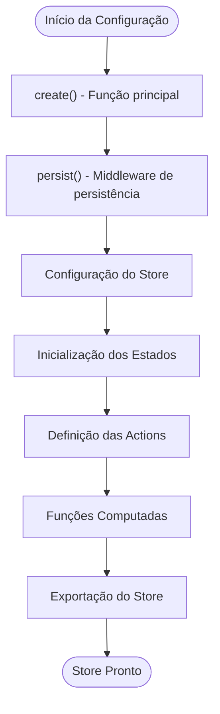
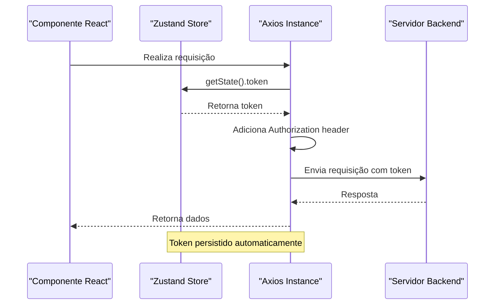
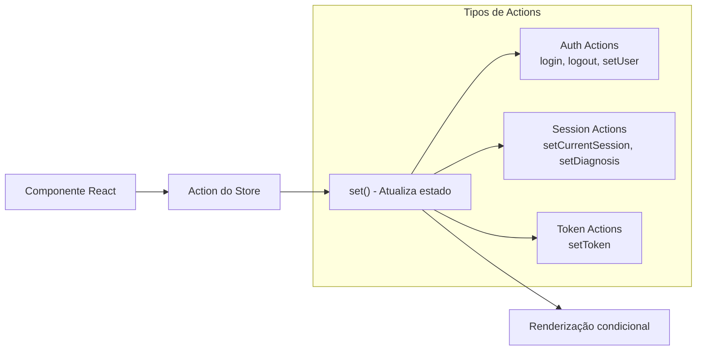
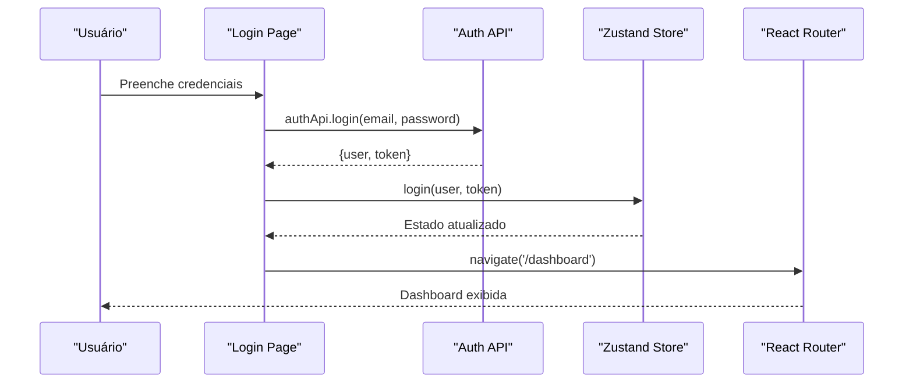
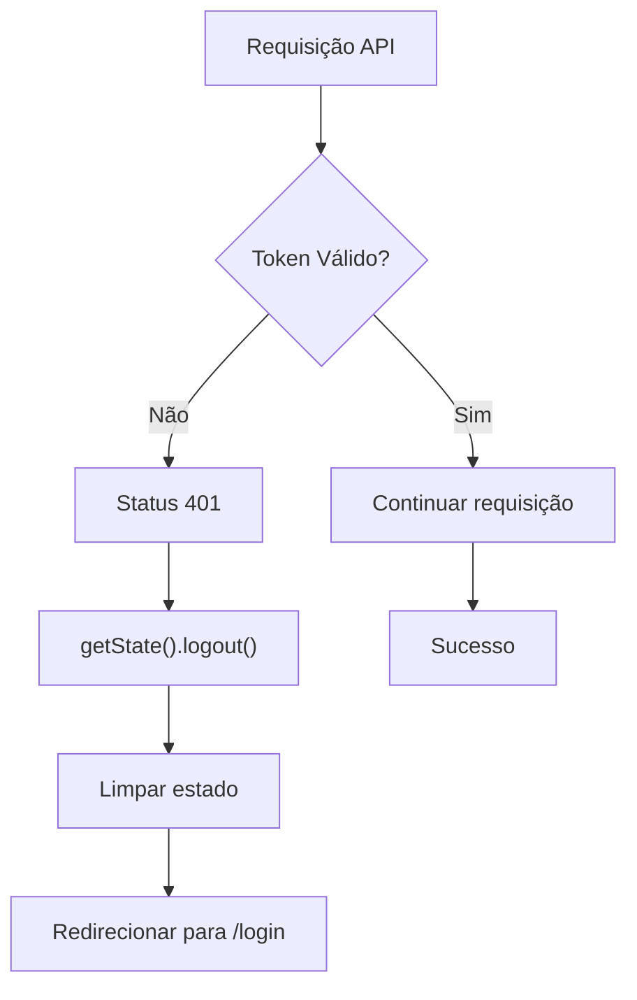
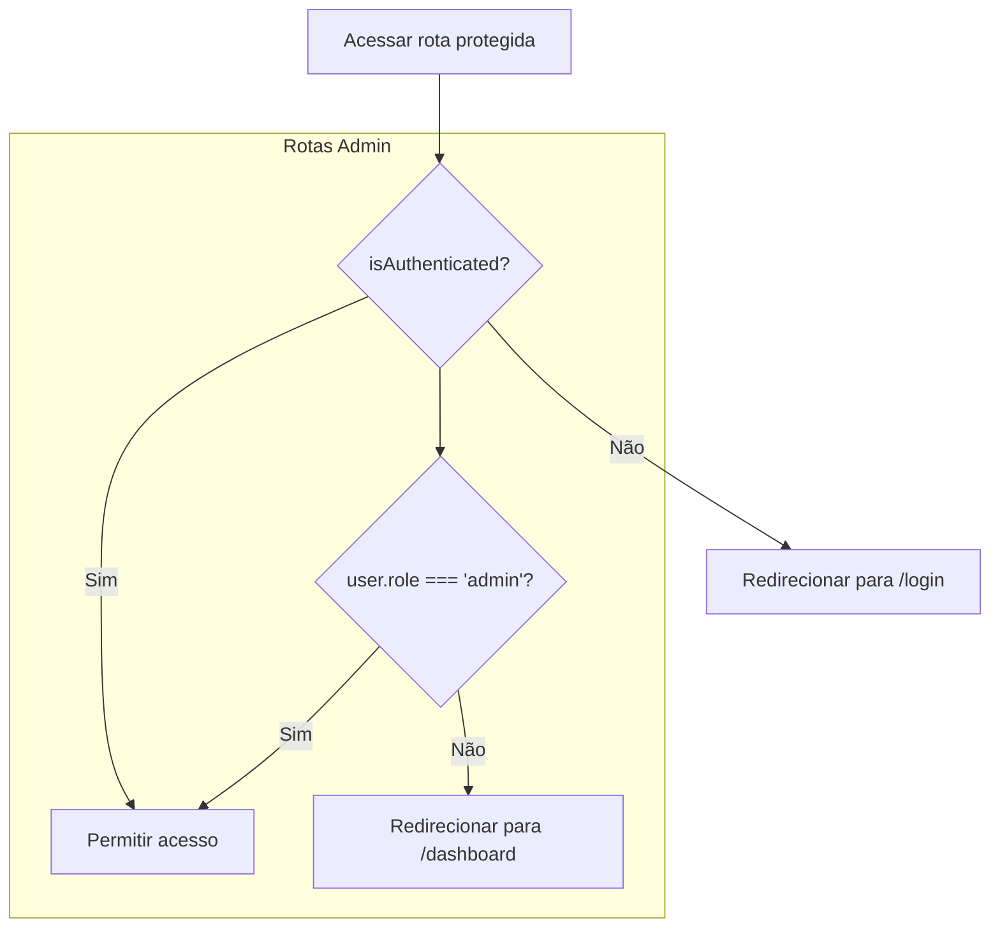

# Gerenciamento de Estado

<cite>
**Arquivos Referenciados Neste Documento**
- [useStore.js](file://frontend/src/store/useStore.js)
- [api.js](file://frontend/src/services/api.js)
- [App.js](file://frontend/src/App.js)
- [Login.js](file://frontend/src/pages/Login.js)
- [Dashboard.js](file://frontend/src/pages/Dashboard.js)
- [Navbar.js](file://frontend/src/components/Navbar.js)
- [ProtectedRoute.js](file://frontend/src/components/ProtectedRoute.js)
- [AdminRoute.js](file://frontend/src/components/AdminRoute.js)
- [AdminPanel.js](file://frontend/src/pages/AdminPanel.js)
- [Tickets.js](file://frontend/src/pages/Tickets.js)
- [package.json](file://frontend/package.json)
</cite>

## Sumário
- Introdução ao Zustand Store
- Configuração e Persistência
- Estados Gerenciados
- Integração com API
- Padrões de Atualização de Estado
- Exemplos Práticos de Uso
- Melhores Práticas
- Extensão do Store

## Introdução

O aplicativo utiliza o Zustand como biblioteca principal para gerenciamento de estado global. O Zustand é uma solução leve e eficiente para gerenciamento de estado em aplicações React, oferecendo uma API simples e intuitiva baseada em funções puras.

O store foi configurado com persistência local para manter os dados de autenticação mesmo após recarregamento da página, proporcionando uma experiência de usuário contínua e confiável.

## Configuração e Persistência

### Setup Básico do Zustand

O store é criado utilizando a função `create` do Zustand com middleware de persistência:



**Diagrama Fontes**
- [useStore.js:4-52](file://frontend/src/store/useStore.js#L4-L52)

### Configuração de Persistência

O middleware de persistência é configurado com:

- **Nome do armazenamento**: `'apple-id-assistant-storage'`
- **Estados persistidos**: `user`, `token`, `isAuthenticated`
- **Armazenamento local**: Web Storage (localStorage)

**Seção Fontes**
- [useStore.js:43-51](file://frontend/src/store/useStore.js#L43-L51)

## Estados Gerenciados

### Estados de Autenticação

O store gerencia três estados principais relacionados à autenticação:

| Estado | Tipo | Descrição |
|--------|------|-----------|
| `user` | Objeto | Informações do usuário logado (id, nome, email, role) |
| `token` | String | Token JWT para autenticação nas requisições |
| `isAuthenticated` | Boolean | Indica se o usuário está autenticado |

### Estados de Sessão e Diagnóstico

Para suportar o fluxo de recuperação de contas Apple ID:

| Estado | Tipo | Descrição |
|--------|------|-----------|
| `currentSession` | Objeto | Dados da sessão de recuperação atual |
| `diagnosis` | Objeto | Informações do diagnóstico médico |

### Estados Computados

Funções que derivam informações a partir dos estados atuais:

- `isAdmin()`: Verifica se o usuário possui papel de administrador

**Seção Fontes**
- [useStore.js:7-41](file://frontend/src/store/useStore.js#L7-L41)

## Integração com API

### Configuração do Axios

O interceptor de requisições adiciona automaticamente o token de autenticação:



**Diagrama Fontes**
- [api.js:16-27](file://frontend/src/services/api.js#L16-L27)
- [useStore.js:18](file://frontend/src/store/useStore.js#L18)

### Tratamento de Erros

O interceptor de respostas lida automaticamente com tokens expirados:

- **Status 401**: Logout automático e redirecionamento para login
- **Erros de rede**: Rejeição da promessa para tratamento nos componentes

**Seção Fontes**
- [api.js:29-40](file://frontend/src/services/api.js#L29-L40)

## Padrões de Atualização de Estado

### Padrão de Actions

As actions seguem o padrão funcional:



**Diagrama Fontes**
- [useStore.js:16-35](file://frontend/src/store/useStore.js#L16-L35)

### Padrão de Leitura de Estados

Os componentes acessam o store através de destructuring:

```javascript
const { isAuthenticated, user, logout } = useStore();
```

**Seção Fontes**
- [Login.js:10](file://frontend/src/pages/Login.js#L10)
- [Navbar.js:8](file://frontend/src/components/Navbar.js#L8)

## Exemplos Práticos de Uso

### Login de Usuário



**Diagrama Fontes**
- [Login.js:19-35](file://frontend/src/pages/Login.js#L19-L35)
- [api.js:43-49](file://frontend/src/services/api.js#L43-L49)
- [useStore.js:20-24](file://frontend/src/store/useStore.js#L20-L24)

### Logout Automático



**Diagrama Fontes**
- [api.js:33-37](file://frontend/src/services/api.js#L33-L37)
- [useStore.js:26-32](file://frontend/src/store/useStore.js#L26-L32)

### Acesso a Rotas Protegidas



**Diagrama Fontes**
- [ProtectedRoute.js:5-12](file://frontend/src/components/ProtectedRoute.js#L5-L12)
- [AdminRoute.js:5-16](file://frontend/src/components/AdminRoute.js#L5-L16)

**Seção Fontes**
- [Login.js:19-35](file://frontend/src/pages/Login.js#L19-L35)
- [Navbar.js:11-14](file://frontend/src/components/Navbar.js#L11-L14)

## Melhores Práticas

### Organização de Estados

1. **Divisão Lógica**: Estados separados por domínio (autenticação, sessões, diagnósticos)
2. **Estados Computados**: Funções que derivam informações sem duplicação de dados
3. **Persistência Seletiva**: Somente estados essenciais são persistidos

### Performance

1. **Atualizações Minimizadas**: Actions atualizam apenas os estados necessários
2. **Memorização**: Funções computadas usam `get()` para acesso eficiente
3. **Middleware de Persistência**: Evita sobrecarga de serialização de grandes objetos

### Segurança

1. **Token Automático**: Interceptor adiciona automaticamente o token nas requisições
2. **Logout Automático**: Tratamento automático de tokens expirados
3. **Acesso Controlado**: Rotas protegidas verificam autenticação e permissões

### Manutenibilidade

1. **Nomes Descritivos**: Actions e estados com nomes claros
2. **Tipagem Implícita**: Estados tipados através de objetos JavaScript
3. **Extensibilidade**: Estrutura fácil para adicionar novos estados e actions

## Extensão do Store

### Adicionando Novos Estados

Para adicionar um novo estado de sessão:

```javascript
// Em useStore.js
const [set, get] = create(set => ({
  // Estados existentes...
  
  // Novo estado
  sessions: [],
  
  // Actions para manipular
  addSession: (session) => set(state => ({
    sessions: [...state.sessions, session]
  })),
  removeSession: (sessionId) => set(state => ({
    sessions: state.sessions.filter(s => s.id !== sessionId)
  }))
}))
```

### Adicionando Estados de Diagnóstico

```javascript
// Para gerenciar múltiplos diagnósticos
const [set, get] = create(set => ({
  // Estados existentes...
  
  // Diagnósticos atuais
  currentDiagnosis: null,
  diagnosisHistory: [],
  
  // Actions
  setCurrentDiagnosis: (diagnosis) => set({ currentDiagnosis: diagnosis }),
  addToHistory: (diagnosis) => set(state => ({
    diagnosisHistory: [...state.diagnosisHistory, diagnosis]
  })),
  clearCurrent: () => set({ currentDiagnosis: null })
}))
```

### Adicionando Estados de Notificações

```javascript
// Para gerenciar notificações do sistema
const [set, get] = create(set => ({
  // Estados existentes...
  
  notifications: [],
  unreadCount: 0,
  
  // Actions
  addNotification: (notification) => set(state => ({
    notifications: [notification, ...state.notifications],
    unreadCount: state.unreadCount + 1
  })),
  markAsRead: (id) => set(state => ({
    notifications: state.notifications.map(n => 
      n.id === id ? {...n, read: true} : n
    ),
    unreadCount: Math.max(0, state.unreadCount - 1)
  })),
  clearAll: () => set({ notifications: [], unreadCount: 0 })
}))
```

### Middleware de Logging

Para depuração e análise:

```javascript
import { devtools } from 'zustand/middleware';

const useStore = create(
  devtools(
    persist(/* configuração existente */),
    { name: 'app-store' }
  )
)
```

## Conclusão

O Zustand Store foi implementado de forma eficiente e escalável, fornecendo:

- **Persistência automática** de dados críticos de autenticação
- **Integração transparente** com o sistema de requisições HTTP
- **Segurança robusta** com tratamento automático de tokens expirados
- **Experiência de usuário** contínua mesmo após recarregamentos
- **Arquitetura extensível** para futuras funcionalidades

A implementação segue boas práticas de gerenciamento de estado moderno, proporcionando uma base sólida para o crescimento e evolução do aplicativo.