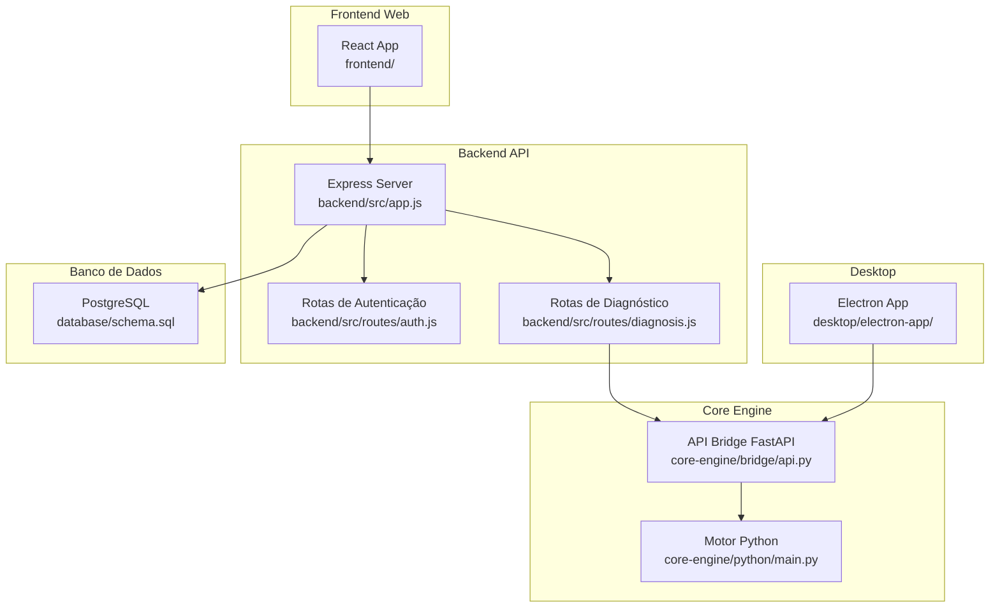
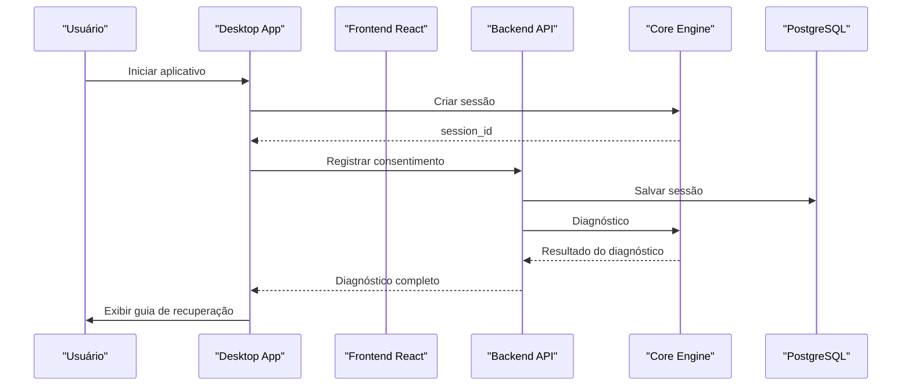

# Início Rápido

<cite>
**Arquivos referenciados neste documento**
- [README.md](file://README.md)
- [backend/package.json](file://backend/package.json)
- [backend/src/app.js](file://backend/src/app.js)
- [backend/src/routes/auth.js](file://backend/src/routes/auth.js)
- [backend/src/routes/diagnosis.js](file://backend/src/routes/diagnosis.js)
- [core-engine/python/requirements.txt](file://core-engine/python/requirements.txt)
- [core-engine/python/main.py](file://core-engine/python/main.py)
- [core-engine/bridge/api.py](file://core-engine/bridge/api.py)
- [database/schema.sql](file://database/schema.sql)
- [frontend/package.json](file://frontend/package.json)
- [desktop/electron-app/package.json](file://desktop/electron-app/package.json)
- [desktop/electron-app/renderer/app.js](file://desktop/electron-app/renderer/app.js)
</cite>

## Sumário
1. [Introdução](#introdução)
2. [Estrutura do Projeto](#estrutura-do-projeto)
3. [Pré-requisitos Obrigatórios](#pré-requisitos-obrigatórios)
4. [Instalação Passo a Passo](#instalação-passo-a-passo)
5. [Configuração Inicial de Variáveis de Ambiente](#configuração-inicial-de-variáveis-de-ambiente)
6. [Primeiro Deploy](#primeiro-deploy)
7. [Exemplos Práticos de Uso Inicial](#exemplos-práticos-de-uso-inicial)
8. [Dicas para Resolver Problemas Comuns](#dicas-para-resolver-problemas-comuns)
9. [Arquitetura Geral](#arquitetura-geral)
10. [Conclusão](#conclusão)

## Introdução
O Bay-RSET Tool é um assistente guiado para recuperação de contas Apple ID, com fluxos oficiais e suporte para diagnóstico automático, acompanhamento de solicitações e sistema de tickets. Ele oferece uma arquitetura modular com backend Node.js, motor Python (Core Engine), frontend React e aplicativo desktop Electron.

## Estrutura do Projeto
O projeto segue uma estrutura de módulos separados:
- backend: API REST Node.js com rotas de autenticação, sessões, diagnóstico, tickets e administração
- core-engine: motor de diagnóstico em Python com API FastAPI e WebSocket
- frontend: interface web React com navegação e fluxos de recuperação
- desktop: aplicativo Electron para uso offline e acompanhamento
- database: schema PostgreSQL com tabelas de usuários, sessões, tickets e logs



**Diagrama fonte**
- [backend/src/app.js:15-194](file://backend/src/app.js#L15-L194)
- [backend/src/routes/auth.js:1-183](file://backend/src/routes/auth.js#L1-L183)
- [backend/src/routes/diagnosis.js:1-173](file://backend/src/routes/diagnosis.js#L1-L173)
- [core-engine/bridge/api.py:120-438](file://core-engine/bridge/api.py#L120-L438)
- [core-engine/python/main.py:1-499](file://core-engine/python/main.py#L1-L499)
- [database/schema.sql:1-194](file://database/schema.sql#L1-L194)

**Seção fonte**
- [README.md:19-29](file://README.md#L19-L29)

## Pré-requisitos Obrigatórios
Antes de instalar, certifique-se de ter as seguintes versões instaladas:
- Node.js 18+
- Python 3.8+
- PostgreSQL 14+
- Redis (opcional, mas recomendado para cache e sessões)

**Seção fonte**
- [README.md:33-39](file://README.md#L33-L39)
- [backend/package.json:54-57](file://backend/package.json#L54-L57)
- [core-engine/python/requirements.txt:1-27](file://core-engine/python/requirements.txt#L1-L27)

## Instalação Passo a Passo

### Backend (API Node.js)
1. Acesse o diretório backend
2. Instale as dependências
3. Copie o arquivo de exemplo .env para .env
4. Inicie o servidor de desenvolvimento

```bash
cd backend
npm install
cp .env.example .env
npm run dev
```

**Seção fonte**
- [README.md:40-47](file://README.md#L40-L47)
- [backend/package.json:6-12](file://backend/package.json#L6-L12)

### Core Engine (Python)
1. Acesse o diretório core-engine/python
2. Instale as dependências do Python
3. Execute o motor principal

```bash
cd core-engine/python
pip install -r requirements.txt
python main.py
```

**Seção fonte**
- [README.md:49-55](file://README.md#L49-L55)
- [core-engine/python/requirements.txt:1-27](file://core-engine/python/requirements.txt#L1-L27)

### Frontend (React)
1. Acesse o diretório frontend
2. Instale as dependências
3. Inicie o servidor de desenvolvimento

```bash
cd frontend
npm install
npm start
```

**Seção fonte**
- [README.md:57-63](file://README.md#L57-L63)
- [frontend/package.json:26-32](file://frontend/package.json#L26-L32)

### Desktop App (Electron)
1. Acesse o diretório desktop/electron-app
2. Instale as dependências
3. Inicie o aplicativo

```bash
cd desktop/electron-app
npm install
npm start
```

**Seção fonte**
- [README.md:65-71](file://README.md#L65-L71)
- [desktop/electron-app/package.json:6-11](file://desktop/electron-app/package.json#L6-L11)

## Configuração Inicial de Variáveis de Ambiente

### Backend - Arquivo .env
Configure as seguintes variáveis no arquivo `.env` do backend:

- PORT: Porta do servidor (padrão: 3000)
- NODE_ENV: Ambiente (development/production)
- JWT_SECRET: Chave secreta para tokens JWT
- CORE_ENGINE_URL: URL do Core Engine (padrão: http://localhost:8000)
- DATABASE_URL: String de conexão PostgreSQL
- ALLOWED_ORIGINS: Origens permitidas para CORS (ex: http://localhost:3000,http://localhost:3001)

**Seção fonte**
- [backend/src/app.js:24-32](file://backend/src/app.js#L24-L32)

### Core Engine - Configurações
O Core Engine usa a porta padrão 8000 e expõe:
- Endpoints REST: /api/sessions, /api/diagnosis, /api/consent, /api/guides, /api/stats
- WebSocket: /ws/{client_id}
- Documentação: /docs
- Health check: /health

**Seção fonte**
- [core-engine/bridge/api.py:139-165](file://core-engine/bridge/api.py#L139-L165)
- [core-engine/bridge/api.py:419-438](file://core-engine/bridge/api.py#L419-L438)

## Primeiro Deploy

### Passos para Deploy em Produção

1. **Preparar o Banco de Dados**
   - Crie o banco de dados PostgreSQL
   - Execute o schema e migrações
   - Configure as credenciais no .env

2. **Build das Aplicações**
   ```bash
   # Backend
   cd backend
   npm install --production
   
   # Frontend
   cd ../frontend
   npm install --production
   npm run build
   
   # Desktop
   cd ../desktop/electron-app
   npm install --production
   npm run build
   ```

3. **Configurar Variáveis de Ambiente de Produção**
   - Defina NODE_ENV=production
   - Configure URLs e chaves secretas
   - Ative CORS somente para domínios válidos

4. **Iniciar os Serviços**
   ```bash
   # Iniciar Core Engine
   cd ../core-engine/python
   python main.py
   
   # Iniciar Backend
   cd ../../backend
   npm start
   ```

**Seção fonte**
- [database/schema.sql:1-194](file://database/schema.sql#L1-L194)
- [README.md:31-71](file://README.md#L31-L71)

## Exemplos Práticos de Uso Inicial

### Fluxo Básico de Diagnóstico

1. **Criar Sessão**
   - O frontend/desktop cria uma sessão única
   - Armazena o session_id para rastreamento

2. **Realizar Diagnóstico**
   - Envia o tipo de problema (forgot-password, two-factor, etc.)
   - O backend chama o Core Engine
   - Recebe o diagnóstico com recomendações

3. **Registrar Consentimento**
   - O usuário confirma propriedade
   - Registra IP e informações de consentimento

4. **Acompanhar Progresso**
   - Visualiza status da sessão
   - Acessa guias de recuperação

**Seção fonte**
- [desktop/electron-app/renderer/app.js:245-280](file://desktop/electron-app/renderer/app.js#L245-L280)
- [backend/src/routes/diagnosis.js:14-69](file://backend/src/routes/diagnosis.js#L14-L69)

### Verificação de Funcionamento

1. **Backend Health Check**
   ```
   GET http://localhost:3000/health
   ```

2. **Core Engine Health Check**
   ```
   GET http://localhost:8000/health
   ```

3. **Frontend Acesso**
   ```
   http://localhost:3000
   ```

4. **Desktop App**
   ```
   npm start (desktop/electron-app)
   ```

**Seção fonte**
- [backend/src/app.js:100-108](file://backend/src/app.js#L100-L108)
- [core-engine/bridge/api.py:158-165](file://core-engine/bridge/api.py#L158-L165)

## Dicas para Resolver Problemas Comuns

### Problemas de Conexão
- **Core Engine não responde**: Verifique se o backend está configurado com CORE_ENGINE_URL=http://localhost:8000
- **Portas em uso**: Altere as portas padrão nas variáveis de ambiente
- **CORS bloqueado**: Configure ALLOWED_ORIGINS corretamente

### Problemas de Banco de Dados
- **Conexão falha**: Verifique DATABASE_URL com usuário, senha e nome do banco
- **Tabelas ausentes**: Execute o schema.sql para criar as tabelas
- **Permissões**: Certifique-se de que o usuário tem permissão para CREATE EXTENSION

### Problemas de Dependências
- **Node modules faltando**: Execute npm install em todas as pastas
- **Python packages**: Verifique se todas as dependências do requirements.txt estão instaladas
- **Versões incompatíveis**: Confirme que as versões mínimas estão atendidas

### Problemas de Build
- **Frontend build falha**: Verifique se o backend está rodando para o proxy funcionar
- **Electron build**: Certifique-se de ter as dependências de build instaladas

**Seção fonte**
- [backend/src/app.js:72-76](file://backend/src/app.js#L72-L76)
- [backend/src/routes/diagnosis.js:42-68](file://backend/src/routes/diagnosis.js#L42-L68)
- [database/schema.sql:5-6](file://database/schema.sql#L5-L6)

## Arquitetura Geral



**Diagrama fonte**
- [core-engine/bridge/api.py:168-183](file://core-engine/bridge/api.py#L168-L183)
- [backend/src/routes/diagnosis.js:42-69](file://backend/src/routes/diagnosis.js#L42-L69)
- [database/schema.sql:22-51](file://database/schema.sql#L22-L51)

### Componentes Principais

#### Backend API
- Segurança com Helmet.js e rate limiting
- Rotas para autenticação, sessões, diagnóstico e tickets
- Logs com Winston
- CORS configurável

#### Core Engine
- Diagnóstico automático de problemas
- Gestão de sessões de usuário
- API REST e WebSocket
- Documentação automática

#### Frontend
- Navegação em passos para recuperação
- Integração com backend via proxy
- Design responsivo com TailwindCSS

#### Desktop
- Aplicativo Electron para uso offline
- Fluxos completos de diagnóstico
- Histórico de ações e logs

**Seção fonte**
- [backend/src/app.js:59-96](file://backend/src/app.js#L59-L96)
- [core-engine/bridge/api.py:120-134](file://core-engine/bridge/api.py#L120-L134)
- [frontend/package.json:5-25](file://frontend/package.json#L5-L25)
- [desktop/electron-app/package.json:27-33](file://desktop/electron-app/package.json#L27-L33)

## Conclusão
O Bay-RSET Tool oferece uma solução completa para recuperação de contas Apple ID seguindo processos oficiais. Com sua arquitetura modular e fluxos guiados, permite que atendentes forneçam suporte eficiente e legal às vítimas de problemas com Apple ID. Siga os passos acima para instalar, configurar e implantar o sistema em produção.