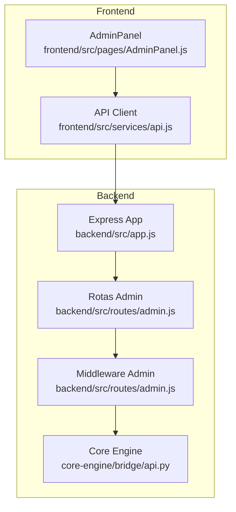
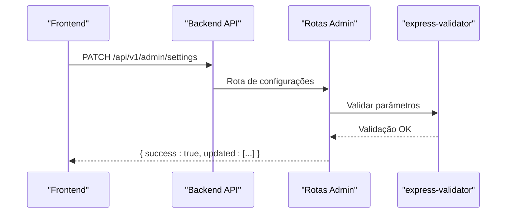
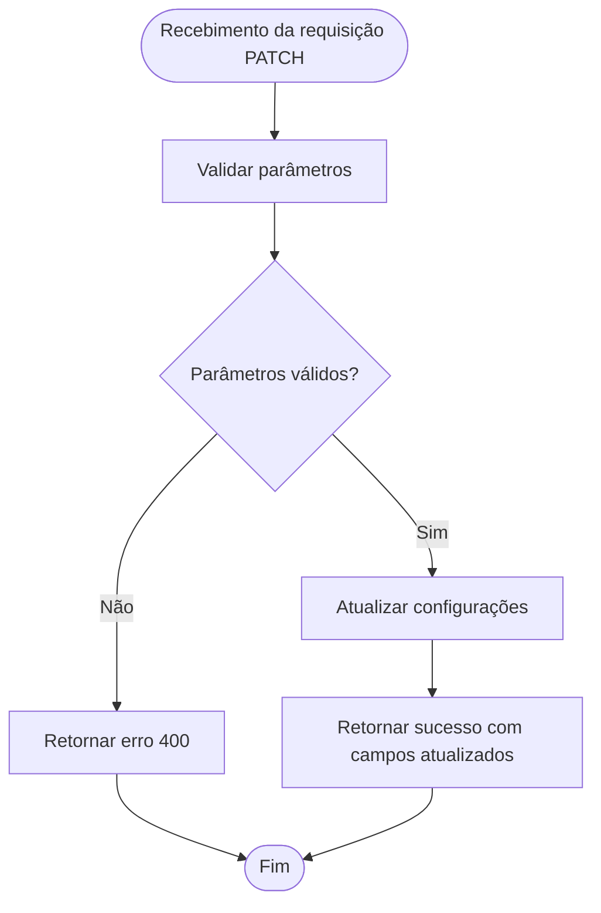
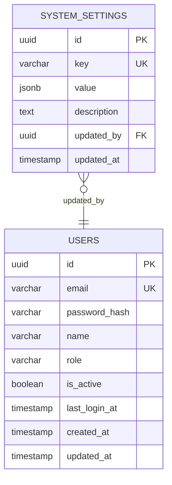
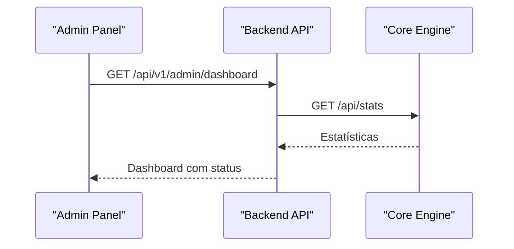

# Configurações do Sistema

<cite>
**Arquivos Referenciados neste Documento**
- [backend/src/routes/admin.js](file://backend/src/routes/admin.js)
- [backend/src/app.js](file://backend/src/app.js)
- [database/schema.sql](file://database/schema.sql)
- [frontend/src/pages/AdminPanel.js](file://frontend/src/pages/AdminPanel.js)
- [frontend/src/services/api.js](file://frontend/src/services/api.js)
- [core-engine/bridge/api.py](file://core-engine/bridge/api.py)
- [core-engine/python/main.py](file://core-engine/python/main.py)
</cite>

## Sumário
- **Objetivo**: Documentar todas as configurações do sistema disponíveis no painel administrativo, incluindo modo de manutenção, abertura de registros, limite de sessões por usuário, URL do Core Engine e versão do sistema. Explicar como atualizar configurações, validação de parâmetros e impacto de cada configuração no funcionamento do sistema. Incluir exemplos práticos de requisições PATCH e respostas do servidor.
- **Público-alvo**: Administradores do sistema, desenvolvedores e técnicos de suporte.

## Introdução
O painel administrativo permite gerenciar configurações críticas do sistema, incluindo modo de manutenção, abertura de registros, limite de sessões por usuário, URL do Core Engine e versão do sistema. Essas configurações afetam diretamente o comportamento do backend, integração com o Core Engine e experiência do usuário final.

## Visão Geral das Configurações
O sistema oferece as seguintes configurações:

- **Modo Manutenção**: Quando ativado, bloqueia acesso dos usuários ao sistema, permitindo apenas acesso administrativo.
- **Registros Abertos**: Controla se novos usuários podem se registrar no sistema.
- **Limite de Sessões por Usuário**: Define o número máximo de sessões ativas simultâneas por usuário.
- **URL do Core Engine**: Endereço do serviço de diagnóstico e processamento central.
- **Versão do Sistema**: Versão atual da API e do sistema.

## Estrutura do Backend e Rotas de Administração
O backend expõe rotas administrativas protegidas por token JWT. O middleware de autenticação garante que apenas usuários com papel de administrador possam acessar as configurações.



**Diagrama fonte**
- [backend/src/app.js:110-122](file://backend/src/app.js#L110-L122)
- [backend/src/routes/admin.js:14-37](file://backend/src/routes/admin.js#L14-L37)
- [core-engine/bridge/api.py:164-179](file://core-engine/bridge/api.py#L164-L179)

**Seção fonte**
- [backend/src/app.js:110-122](file://backend/src/app.js#L110-L122)
- [backend/src/routes/admin.js:14-37](file://backend/src/routes/admin.js#L14-L37)

## Configurações Disponíveis

### 1. Modo Manutenção
- **Descrição**: Bloqueia acesso dos usuários ao sistema, permitindo apenas acesso administrativo.
- **Valor atual**: Booleano (exibido no painel administrativo).
- **Impacto**: 
  - Impede novos fluxos de recuperação.
  - Redireciona usuários para página de manutenção.
  - Mantém acesso administrativo para manutenção.
- **Validação**: Aceita apenas valores booleanos.
- **Exemplo de requisição PATCH**:
  - Endpoint: `PATCH /api/v1/admin/settings`
  - Corpo: `{ "maintenance": true }`
  - Resposta: `{ "success": true, "message": "Configurações atualizadas", "updated": ["maintenance"] }`

**Seção fonte**
- [backend/src/routes/admin.js:144-173](file://backend/src/routes/admin.js#L144-L173)

### 2. Registros Abertos
- **Descrição**: Controla se novos usuários podem se registrar no sistema.
- **Valor atual**: Booleano (exibido no painel administrativo).
- **Impacto**:
  - Quando desativado, impede novos cadastros.
  - Mantém acesso a fluxos existentes.
- **Validação**: Aceita apenas valores booleanos.
- **Exemplo de requisição PATCH**:
  - Endpoint: `PATCH /api/v1/admin/settings`
  - Corpo: `{ "registrationOpen": false }`
  - Resposta: `{ "success": true, "message": "Configurações atualizadas", "updated": ["registrationOpen"] }`

**Seção fonte**
- [backend/src/routes/admin.js:144-173](file://backend/src/routes/admin.js#L144-L173)

### 3. Limite de Sessões por Usuário
- **Descrição**: Número máximo de sessões ativas simultâneas por usuário.
- **Valor atual**: Número inteiro (exibido no painel administrativo).
- **Impacto**:
  - Controla uso de recursos do sistema.
  - Impede uso excessivo de sessões por um único usuário.
- **Validação**: Aceita apenas valores numéricos inteiros.
- **Observação**: A implementação atual no backend retorna um valor fixo. Para tornar essa configuração persistente, seria necessário integrar com o banco de dados.

**Seção fonte**
- [backend/src/routes/admin.js:144-173](file://backend/src/routes/admin.js#L144-L173)
- [database/schema.sql:121-129](file://database/schema.sql#L121-L129)

### 4. URL do Core Engine
- **Descrição**: Endereço do serviço de diagnóstico e processamento central.
- **Valor atual**: String (exibido no painel administrativo).
- **Impacto**:
  - Afeta a integração com o Core Engine.
  - Pode ser alterado para ambientes diferentes (desenvolvimento, produção).
- **Validação**: Aceita apenas URLs válidos.
- **Exemplo de requisição PATCH**:
  - Endpoint: `PATCH /api/v1/admin/settings`
  - Corpo: `{ "coreEngineUrl": "https://core-engine.example.com" }`
  - Resposta: `{ "success": true, "message": "Configurações atualizadas", "updated": ["coreEngineUrl"] }`

**Seção fonte**
- [backend/src/routes/admin.js:12](file://backend/src/routes/admin.js#L12)
- [backend/src/routes/admin.js:144-173](file://backend/src/routes/admin.js#L144-L173)

### 5. Versão do Sistema
- **Descrição**: Versão atual da API e do sistema.
- **Valor atual**: String (exibido no painel administrativo).
- **Impacto**:
  - Facilita rastreamento de atualizações.
  - Útil para compatibilidade e suporte.
- **Validação**: Aceita apenas strings.
- **Exemplo de requisição PATCH**:
  - Endpoint: `PATCH /api/v1/admin/settings`
  - Corpo: `{ "version": "1.1.0" }`
  - Resposta: `{ "success": true, "message": "Configurações atualizadas", "updated": ["version"] }`

**Seção fonte**
- [backend/src/routes/admin.js:144-173](file://backend/src/routes/admin.js#L144-L173)

## Como Atualizar Configurações

### Fluxo de Atualização
1. O frontend envia uma requisição PATCH para `/api/v1/admin/settings`.
2. O backend valida os parâmetros usando express-validator.
3. O backend responde com confirmação de atualização e lista de campos atualizados.



**Diagrama fonte**
- [backend/src/routes/admin.js:158-173](file://backend/src/routes/admin.js#L158-L173)

### Exemplos Práticos de Requisições PATCH

#### Ativar Modo Manutenção
- **Endpoint**: `PATCH /api/v1/admin/settings`
- **Cabeçalhos**: `Authorization: Bearer <token>`
- **Corpo**: `{ "maintenance": true }`
- **Resposta esperada**: `{ "success": true, "message": "Configurações atualizadas", "updated": ["maintenance"] }`

#### Desativar Registros Abertos
- **Endpoint**: `PATCH /api/v1/admin/settings`
- **Cabeçalhos**: `Authorization: Bearer <token>`
- **Corpo**: `{ "registrationOpen": false }`
- **Resposta esperada**: `{ "success": true, "message": "Configurações atualizadas", "updated": ["registrationOpen"] }`

#### Alterar URL do Core Engine
- **Endpoint**: `PATCH /api/v1/admin/settings`
- **Cabeçalhos**: `Authorization: Bearer <token>`
- **Corpo**: `{ "coreEngineUrl": "https://core-engine.prod.example.com" }`
- **Resposta esperada**: `{ "success": true, "message": "Configurações atualizadas", "updated": ["coreEngineUrl"] }`

#### Atualizar Versão do Sistema
- **Endpoint**: `PATCH /api/v1/admin/settings`
- **Cabeçalhos**: `Authorization: Bearer <token>`
- **Corpo**: `{ "version": "1.2.0" }`
- **Resposta esperada**: `{ "success": true, "message": "Configurações atualizadas", "updated": ["version"] }`

## Validação de Parâmetros

O backend utiliza express-validator para validar os parâmetros nas requisições PATCH de configurações:

- **Modo Manutenção**: `body('maintenance').optional().isBoolean()`
- **Registros Abertos**: `body('registrationOpen').optional().isBoolean()`



**Diagrama fonte**
- [backend/src/routes/admin.js:159-166](file://backend/src/routes/admin.js#L159-L166)

**Seção fonte**
- [backend/src/routes/admin.js:159-166](file://backend/src/routes/admin.js#L159-L166)

## Impacto de Cada Configuração no Funcionamento do Sistema

### Modo Manutenção
- **Funcionalidade**: Bloqueia acesso ao sistema para usuários normais.
- **Impacto**: 
  - Impede novos fluxos de recuperação.
  - Mantém acesso administrativo.
  - Melhora experiência de manutenção.

### Registros Abertos
- **Funcionalidade**: Controla novos cadastros.
- **Impacto**:
  - Evita sobrecarga durante eventos especiais.
  - Permite controle de acesso em campanhas promocionais.

### Limite de Sessões por Usuário
- **Funcionalidade**: Controla uso de recursos.
- **Impacto**:
  - Previnir uso excessivo de sessões.
  - Garantir performance do sistema.

### URL do Core Engine
- **Funcionalidade**: Define integração com o motor de diagnóstico.
- **Impacto**:
  - Afeta todas as operações de diagnóstico.
  - Necessário para integração correta.

### Versão do Sistema
- **Funcionalidade**: Rastreamento de versões.
- **Impacto**:
  - Facilita suporte técnico.
  - Ajuda em atualizações planejadas.

## Persistência de Configurações

### Banco de Dados
O sistema possui um esquema de configurações no banco de dados com a tabela `system_settings`. As configurações atuais incluem:

- `maintenance_mode`: Booleano
- `registration_enabled`: Booleano
- `max_sessions_per_user`: Número inteiro
- `core_engine_url`: URL
- `api_version`: Versão
- `session_timeout_hours`: Número inteiro



**Diagrama fonte**
- [database/schema.sql:121-129](file://database/schema.sql#L121-L129)
- [database/schema.sql:179-186](file://database/schema.sql#L179-L186)

**Seção fonte**
- [database/schema.sql:121-129](file://database/schema.sql#L121-L129)
- [database/schema.sql:179-186](file://database/schema.sql#L179-L186)

### Implementação Atual
O backend atualmente retorna valores fixos para as configurações no endpoint GET `/api/v1/admin/settings`. Para tornar as configurações persistentes, seria necessário:

1. Integrar o endpoint GET com o banco de dados.
2. Implementar o endpoint PATCH para atualizar registros no banco.
3. Adicionar validações específicas para cada campo.

**Seção fonte**
- [backend/src/routes/admin.js:144-173](file://backend/src/routes/admin.js#L144-L173)
- [database/schema.sql:121-129](file://database/schema.sql#L121-L129)

## Integração com Core Engine

### Health Check e Métricas
O backend consulta o Core Engine para informações de saúde e métricas:

- **Health Check**: `GET /health` no Core Engine
- **Métricas**: `GET /api/stats` no Core Engine
- **Dashboard**: `GET /api/v1/admin/dashboard` no backend



**Diagrama fonte**
- [backend/src/routes/admin.js:40-64](file://backend/src/routes/admin.js#L40-L64)
- [core-engine/bridge/api.py:341-348](file://core-engine/bridge/api.py#L341-L348)

**Seção fonte**
- [backend/src/routes/admin.js:40-64](file://backend/src/routes/admin.js#L40-L64)
- [core-engine/bridge/api.py:341-348](file://core-engine/bridge/api.py#L341-L348)

## Exemplos de Respostas do Servidor

### Resposta bem-sucedida
```json
{
  "success": true,
  "message": "Configurações atualizadas",
  "updated": ["maintenance"]
}
```

### Resposta de erro de validação
```json
{
  "success": false,
  "error": "Erro de validação",
  "details": "Os dados fornecidos não estão no formato esperado"
}
```

### Resposta de erro de autenticação
```json
{
  "error": "Token inválido ou expirado"
}
```

## Melhorias e Recomendações

### Persistência de Configurações
Para tornar as configurações persistentes, recomenda-se:

1. **Adicionar CRUD de Configurações**:
   - GET `/api/v1/admin/settings` - Buscar todas as configurações
   - PATCH `/api/v1/admin/settings` - Atualizar configurações
   - POST `/api/v1/admin/settings` - Criar configurações iniciais

2. **Validações Específicas**:
   - Validação de URL para `core_engine_url`
   - Validação de intervalos para `max_sessions_per_user`
   - Validação de formato para `version`

3. **Auditoria**:
   - Registrar quem atualizou as configurações
   - Manter histórico de mudanças

### Segurança
- **Rate Limiting**: Aplicar limites para requisições de configurações
- **Logging**: Registrar tentativas de acesso não autorizadas
- **Autenticação**: Garantir que apenas administradores possam alterar configurações

## Conclusão
As configurações do sistema no painel administrativo permitem controle eficiente do funcionamento do backend e sua integração com o Core Engine. Embora a implementação atual seja simplificada, a estrutura está pronta para suportar persistência completa de configurações com validações adequadas e auditoria de mudanças.