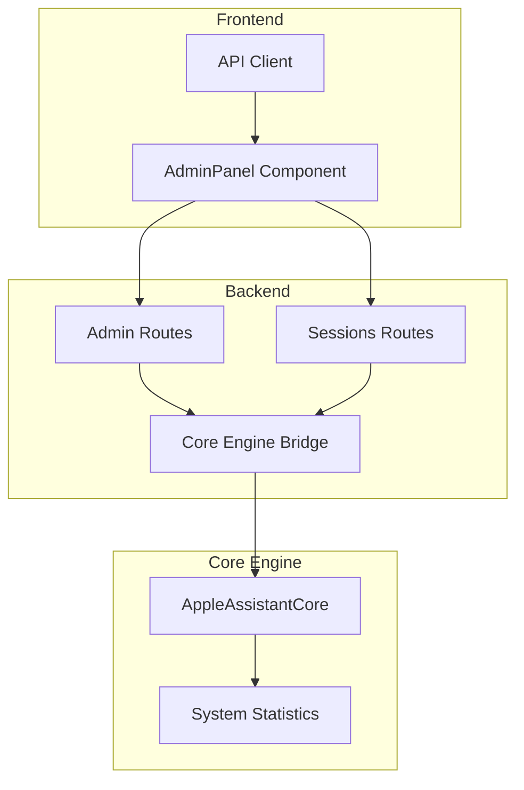
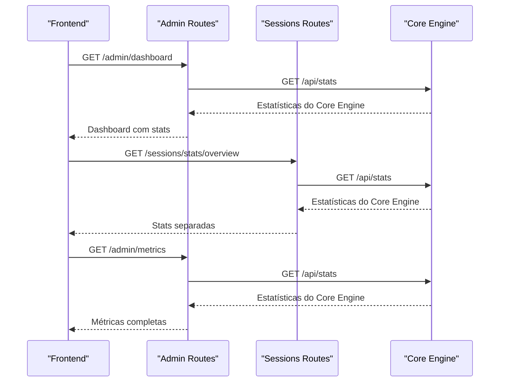
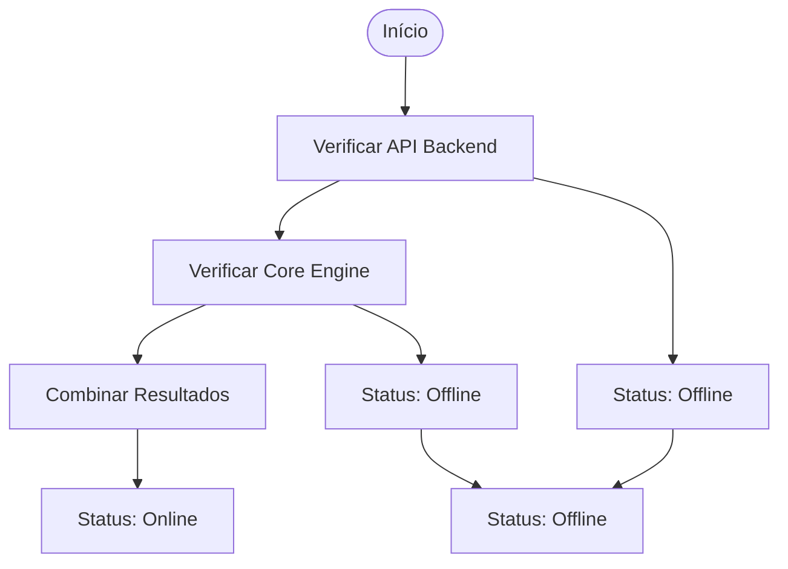
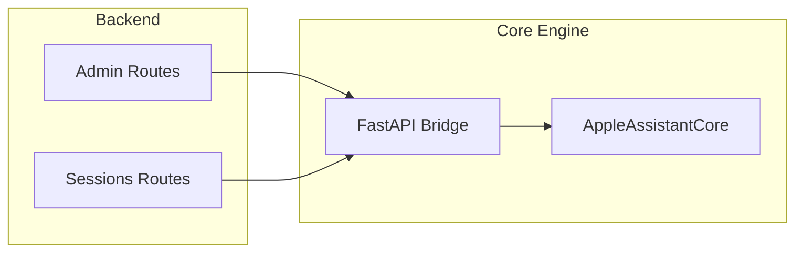

# Dashboard de Analytics

<cite>
**Arquivos Referenciados neste Documento**
- [app.js](file://backend/src/app.js)
- [admin.js](file://backend/src/routes/admin.js)
- [diagnosis.js](file://backend/src/routes/diagnosis.js)
- [api.py](file://core-engine/bridge/api.py)
- [main.py](file://core-engine/python/main.py)
- [AdminPanel.js](file://frontend/src/pages/AdminPanel.js)
- [api.js](file://frontend/src/services/api.js)
- [sessions.js](file://backend/src/routes/sessions.js)
</cite>

## Sumário
- O dashboard de analytics do painel administrativo fornece visão abrangente do sistema, integrando métricas do Core Engine com informações do backend
- Coleta estatísticas de diagnóstico, status do sistema e métricas de desempenho
- Fornece insights sobre uso do sistema, distribuição de problemas e condições operacionais

## Visão Geral do Sistema

O dashboard de analytics é composto por três componentes principais:



**Diagrama Fonte**
- [AdminPanel.js:24-40](file://frontend/src/pages/AdminPanel.js#L24-L40)
- [admin.js:40-64](file://backend/src/routes/admin.js#L40-L64)
- [sessions.js:231-246](file://backend/src/routes/sessions.js#L231-L246)

## Componentes Principais

### 1. Backend API - Admin Routes

O backend expõe rotas específicas para o dashboard administrativo:

#### Rota: `/api/v1/admin/dashboard`
- **Método:** GET
- **Autenticação:** JWT obrigatória (role=admin)
- **Propósito:** Carregar estatísticas principais do sistema
- **Resposta:** Contém estatísticas do Core Engine e status do sistema

#### Rota: `/api/v1/admin/metrics`
- **Método:** GET
- **Autenticação:** JWT obrigatória (role=admin)
- **Propósito:** Coletar métricas do sistema
- **Resposta:** Estatísticas do Core Engine + métricas do backend (uptime, memória, Node.js)

**Seção Fonte**
- [admin.js:39-205](file://backend/src/routes/admin.js#L39-L205)

### 2. Core Engine - Estatísticas

O Core Engine fornece métricas completas sobre o funcionamento do sistema:

#### Métricas Coletadas:
- **Total de Sessões:** Quantidade total de sessões criadas
- **Sessões Ativas:** Sessões em andamento (não concluídas)
- **Consentimentos:** Sessões com consentimento registrado
- **Diagnósticos Concluídos:** Sessões com diagnóstico realizado
- **Distribuição de Problemas:** Contagem por tipo de problema

#### Tipos de Problemas Suportados:
- Senha Esquecida (`forgot-password`)
- Verificação em 2 Etapas (`two-factor`)
- Bloqueio de Ativação (`activation-lock`)
- Conta Inacessível (`account-locked`)
- Dispositivo Usado (`device-used`)
- Reset com Senha (`reset-with-password`)

**Seção Fonte**
- [main.py:448-458](file://core-engine/python/main.py#L448-L458)
- [main.py:35-42](file://core-engine/python/main.py#L35-L42)

### 3. Frontend - Admin Panel

O frontend apresenta as métricas em um dashboard interativo:

#### Componentes:
- **Status Cards:** Indicadores de sistema (API, Core Engine, Database)
- **Stat Cards:** Métricas principais (Total Sessões, Diagnósticos, Sessões Ativas, Consentimentos)
- **Distribuição de Problemas:** Gráfico de barras mostrando contagem por tipo de problema
- **Tabs:** Navegação entre visão geral, usuários, sessões e configurações

**Seção Fonte**
- [AdminPanel.js:82-146](file://frontend/src/pages/AdminPanel.js#L82-L146)

## Fluxo de Coleta de Dados



**Diagrama Fonte**
- [AdminPanel.js:24-40](file://frontend/src/pages/AdminPanel.js#L24-L40)
- [admin.js:40-64](file://backend/src/routes/admin.js#L40-L64)
- [sessions.js:231-246](file://backend/src/routes/sessions.js#L231-L246)

## Formato das Respostas

### Dashboard Response
```json
{
  "success": true,
  "dashboard": {
    "coreStats": {
      "total_sessions": 150,
      "active_sessions": 25,
      "consent_given": 145,
      "diagnoses_completed": 120,
      "problem_type_distribution": {
        "forgot-password": 60,
        "two-factor": 35,
        "activation-lock": 20,
        "account-locked": 5,
        "device-used": 10
      }
    },
    "systemStatus": {
      "api": "online",
      "coreEngine": "online",
      "timestamp": "2024-01-15T10:30:00Z"
    }
  }
}
```

### Metrics Response
```json
{
  "success": true,
  "metrics": {
    "coreEngine": {
      "total_sessions": 150,
      "active_sessions": 25,
      "consent_given": 145,
      "diagnoses_completed": 120,
      "problem_type_distribution": {
        "forgot-password": 60,
        "two-factor": 35,
        "activation-lock": 20,
        "account-locked": 5,
        "device-used": 10
      }
    },
    "api": {
      "uptime": 1200.5,
      "memory": {
        "rss": 123456789,
        "heapTotal": 98765432,
        "heapUsed": 45678912,
        "external": 1234567
      },
      "nodeVersion": "v18.17.0",
      "platform": "linux"
    },
    "timestamp": "2024-01-15T10:30:00Z"
  }
}
```

**Seção Fonte**
- [admin.js:45-64](file://backend/src/routes/admin.js#L45-L64)
- [admin.js:180-192](file://backend/src/routes/admin.js#L180-L192)

## Métricas do Sistema

### Backend Metrics
- **Uptime:** Tempo desde o início do processo (segundos)
- **Memory Usage:** Detalhamento completo do uso de memória (RSS, heap total, heap usado, external)
- **Node.js Version:** Versão atual do runtime
- **Platform:** Sistema operacional em execução

### Core Engine Metrics
- **Total Sessions:** Contagem total de sessões criadas
- **Active Sessions:** Sessões em progresso (status != completed)
- **Consents Given:** Sessões com consentimento registrado
- **Diagnoses Completed:** Sessões com diagnóstico finalizado
- **Problem Distribution:** Contagem por tipo de problema

**Seção Fonte**
- [admin.js:184-189](file://backend/src/routes/admin.js#L184-L189)
- [main.py:448-458](file://core-engine/python/main.py#L448-L458)

## Status do Sistema

### Verificação de Saúde
O sistema verifica o status de diferentes componentes:



**Diagrama Fonte**
- [admin.js:49-53](file://backend/src/routes/admin.js#L49-L53)

### Status Cards
- **API Backend:** Sempre exibido como online no frontend
- **Core Engine:** Baseado na resposta do endpoint `/api/stats`
- **Database:** Sempre exibido como online no frontend

**Seção Fonte**
- [AdminPanel.js:85-101](file://frontend/src/pages/AdminPanel.js#L85-L101)

## Integração com Serviços Externos

### Core Engine Bridge
O backend se integra com o Core Engine através de chamadas HTTP:



**Diagrama Fonte**
- [admin.js:42-43](file://backend/src/routes/admin.js#L42-L43)
- [sessions.js:233](file://backend/src/routes/sessions.js#L233)

### Configuração de URL
- **CORE_ENGINE_URL:** Configurável via variável de ambiente
- **Padrão:** `http://localhost:8000`
- **Uso:** Ambas as rotas (/admin e /sessions) utilizam esta URL

**Seção Fonte**
- [admin.js:12](file://backend/src/routes/admin.js#L12)
- [sessions.js:233](file://backend/src/routes/sessions.js#L233)

## Exemplos de Requisições

### Dashboard
```bash
curl -X GET "http://localhost:3000/api/v1/admin/dashboard" \
  -H "Authorization: Bearer SEU_TOKEN_AQUI"
```

### Métricas
```bash
curl -X GET "http://localhost:3000/api/v1/admin/metrics" \
  -H "Authorization: Bearer SEU_TOKEN_AQUI"
```

### Estatísticas do Core Engine
```bash
curl -X GET "http://localhost:3000/api/v1/sessions/stats/overview"
```

### Diagnóstico (para contexto)
```bash
curl -X POST "http://localhost:3000/api/v1/diagnosis" \
  -H "Content-Type: application/json" \
  -d '{
    "sessionId": "SESSAO_ID_AQUI",
    "problemType": "forgot-password",
    "hasProofOfPurchase": false,
    "hasDeviceAccess": false
  }'
```

## Interpretação dos Dados

### Métricas-Chave
- **Taxa de Conversão:** `(diagnoses_completed / total_sessions) * 100`
- **Taxa de Consentimento:** `(consent_given / total_sessions) * 100`
- **Tempo Médio de Sessão:** Calculado com base no histórico de sessões

### Distribuição de Problemas
- **Problemas Frequentes:** Tipos com maior contagem
- **Problemas Raros:** Tipos com menor contagem
- **Tendências:** Comparação com períodos anteriores

### Status do Sistema
- **Online:** Ambos os serviços respondem corretamente
- **Offline:** Falha na comunicação com o Core Engine
- **Parcialmente Offline:** API online mas Core Engine offline

## Melhorias e Considerações

### Performance
- **Caching:** Implementar cache para estatísticas frequentemente acessadas
- **Rate Limiting:** Proteção contra sobrecarga de requisições
- **Monitoramento:** Logs detalhados para diagnóstico de problemas

### Segurança
- **Autenticação:** JWT obrigatório para todas as rotas administrativas
- **Autorização:** Verificação de role=admin
- **Validação:** Parâmetros validados em todas as rotas

### Escalabilidade
- **Banco de Dados:** Armazenamento persistente de estatísticas
- **Cache:** Redis para métricas em tempo real
- **Monitoramento:** Integração com sistemas de observabilidade

## Conclusão

O dashboard de analytics fornece uma visão completa e em tempo real do funcionamento do sistema, permitindo:
- Monitoramento de uso e desempenho
- Análise de tendências de problemas
- Tomada de decisões baseada em dados
- Detecção precoce de problemas sistêmicos

A integração entre frontend, backend e Core Engine cria um sistema robusto de coleta e apresentação de métricas, essencial para o gerenciamento eficiente do painel administrativo.