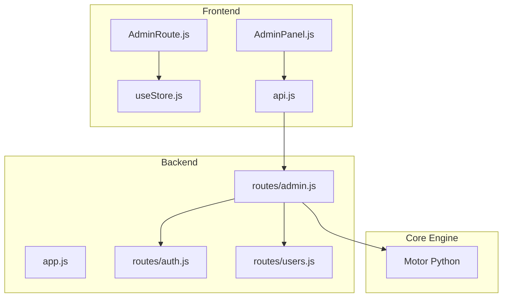
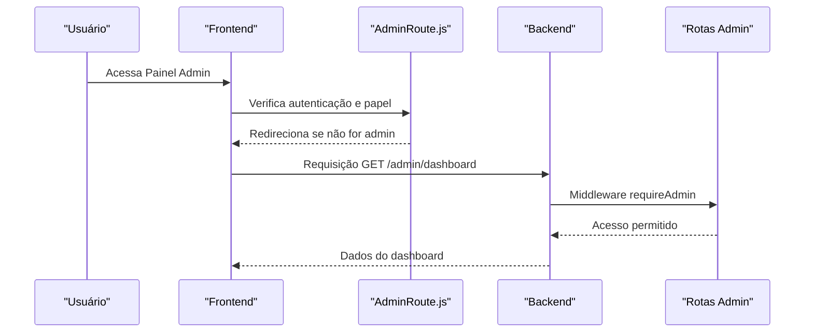
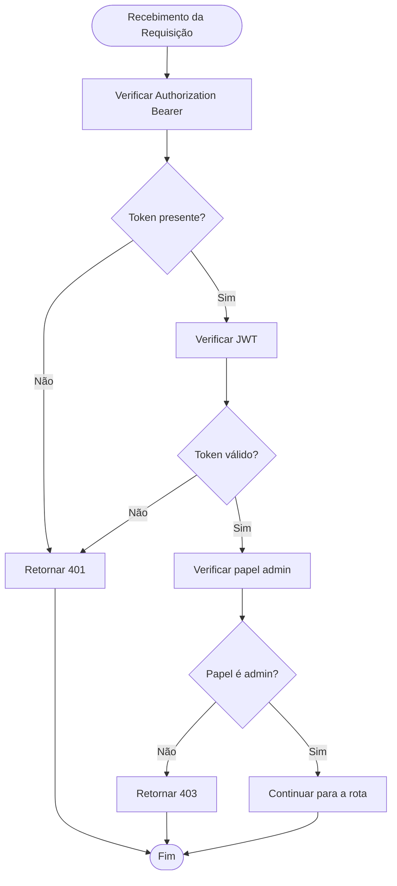
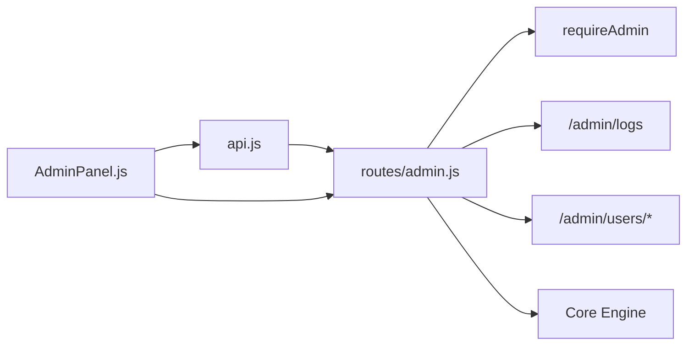

# Gerenciamento de Usuários

<cite>
**Arquivos Referenciados Neste Documento**
- [backend/src/app.js](file://backend/src/app.js)
- [backend/src/routes/admin.js](file://backend/src/routes/admin.js)
- [backend/src/routes/auth.js](file://backend/src/routes/auth.js)
- [backend/src/routes/users.js](file://backend/src/routes/users.js)
- [frontend/src/services/api.js](file://frontend/src/services/api.js)
- [frontend/src/components/AdminRoute.js](file://frontend/src/components/AdminRoute.js)
- [frontend/src/store/useStore.js](file://frontend/src/store/useStore.js)
- [frontend/src/pages/AdminPanel.js](file://frontend/src/pages/AdminPanel.js)
</cite>

## Sumário
- Introdução
- Estrutura do Projeto
- Componentes Principais
- Visão Geral da Arquitetura
- Análise Detalhada dos Componentes
- Análise de Dependências
- Considerações de Desempenho
- Guia de Resolução de Problemas
- Conclusão

## Introdução
Este documento apresenta uma documentação abrangente do gerenciamento de usuários no painel administrativo do sistema. Ele descreve todas as operações CRUD de usuários disponíveis, incluindo listagem com paginação, alteração de papéis (user, support, admin), desativação/reativação de contas, e filtros de busca. Além disso, explica a validação de dados, o middleware de autenticação admin, e a integração com o backend. O documento também inclui exemplos de requisições HTTP, respostas esperadas, tratamento de erros, permissões de acesso e segurança associada a cada operação.

## Estrutura do Projeto
O sistema é composto por três camadas principais:
- Backend (Node.js/Express): fornece as rotas de administração, autenticação e gestão de usuários.
- Frontend (React): implementa o painel administrativo com navegação e chamadas à API.
- Core Engine (Python): fornece estatísticas e métricas integradas ao painel.

**Diagrama Fontes**
- [backend/src/app.js:111-116](file://backend/src/app.js#L111-L116)
- [backend/src/routes/admin.js:14-37](file://backend/src/routes/admin.js#L14-L37)
- [backend/src/routes/auth.js:25-42](file://backend/src/routes/auth.js#L25-L42)
- [backend/src/routes/users.js:12-30](file://backend/src/routes/users.js#L12-L30)
- [frontend/src/services/api.js:77-87](file://frontend/src/services/api.js#L77-L87)
- [frontend/src/components/AdminRoute.js:5-17](file://frontend/src/components/AdminRoute.js#L5-L17)
- [frontend/src/store/useStore.js:38-41](file://frontend/src/store/useStore.js#L38-L41)

**Seção Fontes**
- [backend/src/app.js:111-116](file://backend/src/app.js#L111-L116)
- [frontend/src/services/api.js:77-87](file://frontend/src/services/api.js#L77-L87)

## Componentes Principais
- Middleware de autenticação admin: garante que apenas usuários com papel admin possam acessar rotas administrativas.
- Rota de listagem de usuários: permite paginação e limites configuráveis.
- Rota de alteração de papel: atualiza o papel de um usuário específico.
- Rota de desativação/reativação: altera o status ativo/inativo de um usuário.
- Rota de logs do sistema: filtra logs por nível, datas e limites.
- Frontend do painel administrativo: exibe informações e fornece acesso às funcionalidades.

**Seção Fontes**
- [backend/src/routes/admin.js:67-118](file://backend/src/routes/admin.js#L67-L118)
- [backend/src/routes/admin.js:121-142](file://backend/src/routes/admin.js#L121-L142)
- [frontend/src/pages/AdminPanel.js:192-267](file://frontend/src/pages/AdminPanel.js#L192-L267)

## Visão Geral da Arquitetura
O fluxo de acesso ao painel administrativo segue os seguintes passos:
1. O usuário faz login e recebe um token JWT.
2. O frontend armazena o token e o envia em todas as requisições.
3. O middleware de autenticação admin verifica o token e o papel do usuário.
4. As rotas administrativas validam os parâmetros e retornam respostas padronizadas.

**Diagrama Fontes**
- [frontend/src/components/AdminRoute.js:5-17](file://frontend/src/components/AdminRoute.js#L5-L17)
- [backend/src/routes/admin.js:14-37](file://backend/src/routes/admin.js#L14-L37)
- [backend/src/routes/admin.js:40-64](file://backend/src/routes/admin.js#L40-L64)

## Análise Detalhada dos Componentes

### Middleware de Autenticação Admin
O middleware requireAdmin realiza:
- Validação do cabeçalho Authorization (Bearer token).
- Verificação do token JWT com a chave secreta.
- Checagem do papel do usuário (apenas admin pode acessar).

**Diagrama Fontes**
- [backend/src/routes/admin.js:14-37](file://backend/src/routes/admin.js#L14-L37)

**Seção Fontes**
- [backend/src/routes/admin.js:14-37](file://backend/src/routes/admin.js#L14-L37)

### Rota de Listagem de Usuários (com Paginação)
- Endpoint: GET /api/v1/admin/users
- Parâmetros de consulta:
  - page: inteiro >= 1 (opcional)
  - limit: inteiro entre 1 e 100 (opcional)
- Validação:
  - Validação com express-validator para os parâmetros.
- Resposta:
  - Array de usuários (mockado).
  - Objeto de paginação com page, limit e total.

Exemplo de requisição:
- GET /api/v1/admin/users?page=1&limit=20

Exemplo de resposta bem-sucedida:
- 200 OK com payload contendo success, users e pagination.

Exemplo de resposta de erro:
- 400 Bad Request com array de erros se os parâmetros forem inválidos.

**Seção Fontes**
- [backend/src/routes/admin.js:67-86](file://backend/src/routes/admin.js#L67-L86)

### Rota de Alteração de Papel de Usuário
- Endpoint: PATCH /api/v1/admin/users/:userId/role
- Parâmetros de caminho:
  - userId: string (obrigatório)
- Corpo da requisição:
  - role: string com valores válidos ['user', 'support', 'admin']
- Validação:
  - Validação de userId e role.
- Resposta:
  - success: true e mensagem de confirmação.

Exemplo de requisição:
- PATCH /api/v1/admin/users/123/role
- Body: { "role": "support" }

Exemplo de resposta bem-sucedida:
- 200 OK com success e message.

Exemplo de resposta de erro:
- 400 Bad Request com array de erros se role for inválido.

**Seção Fontes**
- [backend/src/routes/admin.js:89-102](file://backend/src/routes/admin.js#L89-L102)

### Rota de Desativação/Reativação de Usuário
- Endpoint: PATCH /api/v1/admin/users/:userId/status
- Parâmetros de caminho:
  - userId: string (obrigatório)
- Corpo da requisição:
  - active: boolean (obrigatório)
- Validação:
  - Validação de userId e active.
- Resposta:
  - success: true e mensagem indicando se foi reativado ou desativado.

Exemplo de requisição:
- PATCH /api/v1/admin/users/123/status
- Body: { "active": false }

Exemplo de resposta bem-sucedida:
- 200 OK com success e message.

Exemplo de resposta de erro:
- 400 Bad Request com array de erros se active for inválido.

**Seção Fontes**
- [backend/src/routes/admin.js:105-118](file://backend/src/routes/admin.js#L105-L118)

### Rota de Logs do Sistema (com Filtros)
- Endpoint: GET /api/v1/admin/logs
- Parâmetros de consulta:
  - level: string com valores ['info', 'warn', 'error', 'debug'] (opcional)
  - startDate: data ISO8601 (opcional)
  - endDate: data ISO8601 (opcional)
  - limit: inteiro entre 1 e 1000 (opcional)
- Validação:
  - Validação de todos os parâmetros.
- Resposta:
  - success: true, logs e objeto filters com os parâmetros aplicados.

Exemplo de requisição:
- GET /api/v1/admin/logs?level=error&startDate=2024-01-01&endDate=2024-12-31&limit=100

Exemplo de resposta bem-sucedida:
- 200 OK com success, logs e filters.

Exemplo de resposta de erro:
- 400 Bad Request com array de erros se algum parâmetro for inválido.

**Seção Fontes**
- [backend/src/routes/admin.js:121-142](file://backend/src/routes/admin.js#L121-L142)

### Frontend: Painel Administrativo
O painel exibe:
- Estatísticas do sistema e do Core Engine.
- Aba de usuários com uma tabela de exemplo (mock).
- Abas de sessões e configurações.

O componente AdminRoute garante:
- Que somente usuários autenticados e com papel admin possam acessar o painel.
- Redirecionamento para login ou dashboard conforme necessário.

**Seção Fontes**
- [frontend/src/pages/AdminPanel.js:192-267](file://frontend/src/pages/AdminPanel.js#L192-L267)
- [frontend/src/components/AdminRoute.js:5-17](file://frontend/src/components/AdminRoute.js#L5-L17)

### Integração com o Backend (Frontend)
O frontend utiliza o módulo api.js para:
- Configurar a base da API e adicionar o token Bearer nas requisições.
- Fazer chamadas específicas para admin: dashboard, users, updateUserRole, updateUserStatus, logs, settings, metrics.
- Tratar erros de autenticação (401) redirecionando para login.

**Seção Fontes**
- [frontend/src/services/api.js:77-87](file://frontend/src/services/api.js#L77-L87)
- [frontend/src/services/api.js:15-40](file://frontend/src/services/api.js#L15-L40)

## Análise de Dependências
- O backend registra as rotas de administração sob /api/v1/admin.
- O middleware requireAdmin é usado em todas as rotas administrativas.
- O frontend chama as rotas de administração através do módulo api.js.
- O AdminRoute.js depende do estado global (useStore) para verificar autenticação e papel.

**Diagrama Fontes**
- [backend/src/app.js:111-116](file://backend/src/app.js#L111-L116)
- [backend/src/routes/admin.js:14-37](file://backend/src/routes/admin.js#L14-L37)
- [frontend/src/services/api.js:77-87](file://frontend/src/services/api.js#L77-L87)

**Seção Fontes**
- [backend/src/app.js:111-116](file://backend/src/app.js#L111-L116)
- [frontend/src/services/api.js:77-87](file://frontend/src/services/api.js#L77-L87)

## Considerações de Desempenho
- Validação de dados com express-validator evita processamento desnecessário.
- Middleware requireAdmin impede acesso indevido, reduzindo sobrecarga.
- Paginação limitada (máximo 100 por página) evita grandes respostas.
- O uso de rate limiting no backend protege contra excesso de requisições.

[Sem fontes, pois esta seção fornece orientações gerais]

## Guia de Resolução de Problemas

### Erros Comuns e Soluções
- 401 Unauthorized:
  - Causa: Token ausente, inválido ou expirado.
  - Solução: Realizar login novamente e renovar token.
- 403 Forbidden:
  - Causa: Usuário não possui papel admin.
  - Solução: Acessar com um usuário admin.
- 400 Bad Request:
  - Causa: Parâmetros inválidos (ex: role fora do conjunto permitido).
  - Solução: Corrigir os parâmetros conforme as validações.

### Exemplos de Respostas
- Resposta bem-sucedida (200 OK):
  - { "success": true, "message": "..." }
  - { "success": true, "users": [...], "pagination": { "page": 1, "limit": 20, "total": 0 } }
- Resposta de erro (400/401/403):
  - { "errors": [...] } ou { "error": "mensagem" }

**Seção Fontes**
- [backend/src/routes/admin.js:67-118](file://backend/src/routes/admin.js#L67-L118)
- [backend/src/routes/admin.js:121-142](file://backend/src/routes/admin.js#L121-L142)
- [frontend/src/services/api.js:29-40](file://frontend/src/services/api.js#L29-L40)

## Conclusão
O gerenciamento de usuários no painel administrativo foi projetado com foco em segurança e usabilidade. O middleware requireAdmin garante acesso exclusivo a administradores, enquanto as validações de dados e paginação asseguram robustez e desempenho. O frontend fornece uma interface intuitiva para operações como listagem, alteração de papéis e desativação/reativação, integrando-se ao backend por meio de chamadas HTTP padronizadas. Para manutenção e expansão futuras, recomenda-se substituir os mocks por integrações reais com banco de dados e serviços de log, além de implementar mecanismos de blacklist de tokens e auditoria mais detalhada.