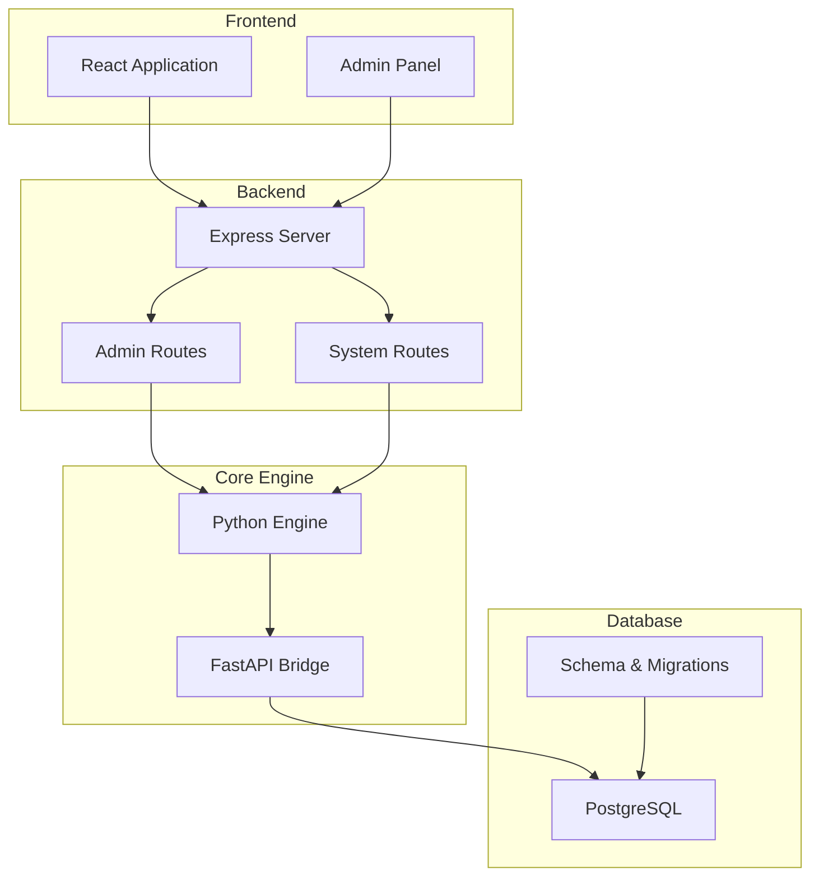
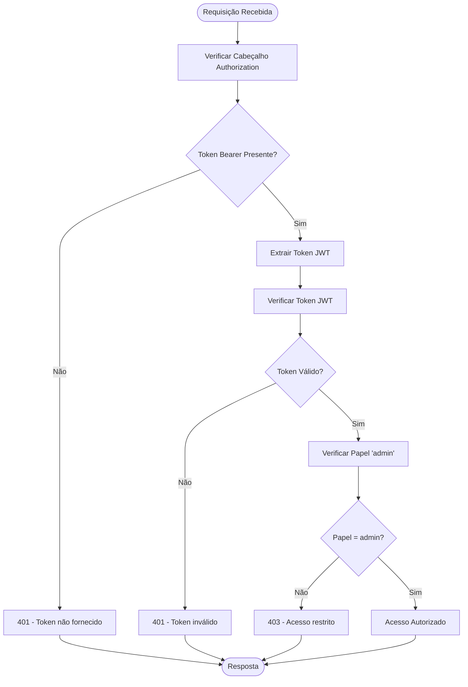
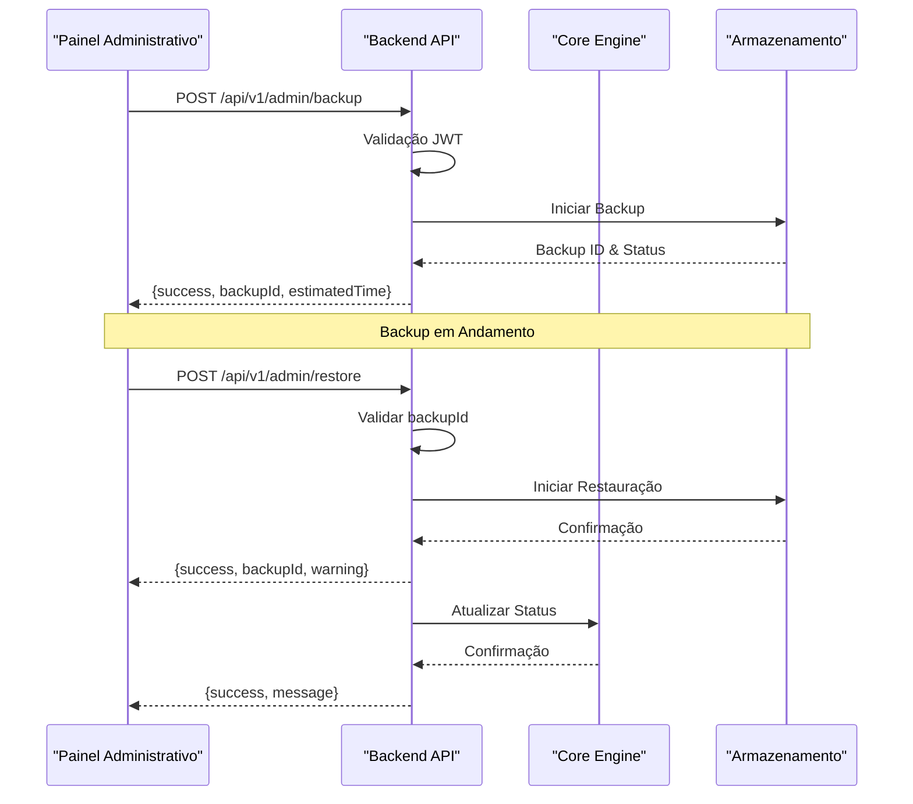
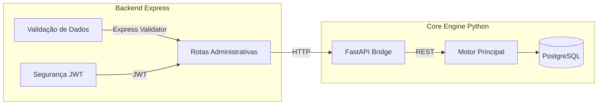
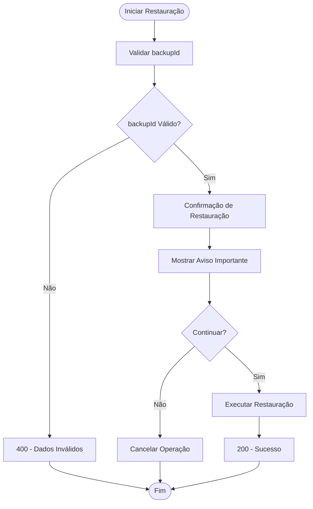
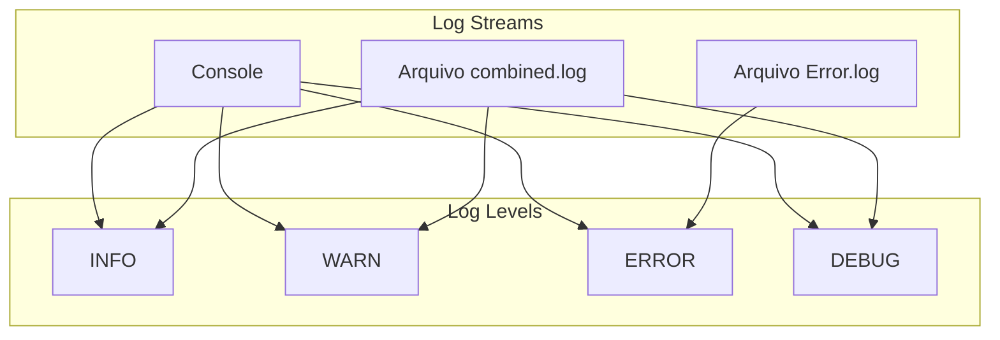
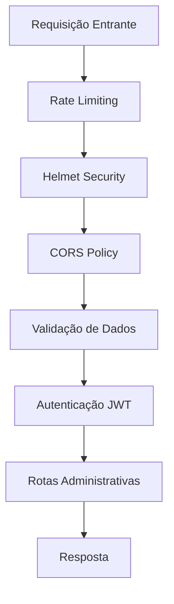
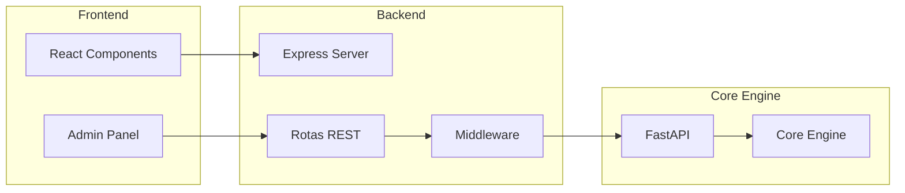

# Operações do Sistema

<cite>
**Arquivos Referenciados neste Documento**
- [admin.js](file://backend/src/routes/admin.js)
- [app.js](file://backend/src/app.js)
- [schema.sql](file://database/schema.sql)
- [main.py](file://core-engine/python/main.py)
- [api.py](file://core-engine/bridge/api.py)
- [AdminPanel.js](file://frontend/src/pages/AdminPanel.js)
- [package.json](file://backend/package.json)
- [requirements.txt](file://core-engine/python/requirements.txt)
</cite>

## Sumário
- [Introdução](#introdução)
- [Estrutura do Projeto](#estrutura-do-projeto)
- [Componentes Principais](#componentes-principais)
- [Visão Geral da Arquitetura](#visão-geral-da-arquitetura)
- [Análise Detalhada dos Componentes](#análise-detalhada-dos-componentes)
- [Análise de Dependências](#análise-de-dependências)
- [Considerações de Desempenho](#considerações-de-desempenho)
- [Guia de Solução de Problemas](#guia-de-solução-de-problemas)
- [Conclusão](#conclusão)

## Introdução
O sistema de operações do painel administrativo oferece funcionalidades críticas para gestão e monitoramento do sistema de assistência Apple ID. Este documento detalha as operações de backup de dados, restauração de backups, e consulta de logs do sistema, incluindo processos, validação de dados, avisos importantes e procedimentos de segurança associados a essas operações críticas.

## Estrutura do Projeto
O sistema segue uma arquitetura de microserviços com três camadas principais:

**Fontes do Diagrama**
- [app.js:110-121](file://backend/src/app.js#L110-L121)
- [admin.js:12-12](file://backend/src/routes/admin.js#L12-L12)
- [api.py:164-170](file://core-engine/bridge/api.py#L164-L170)

**Fontes da Seção**
- [app.js:1-204](file://backend/src/app.js#L1-L204)
- [package.json:1-59](file://backend/package.json#L1-L59)

## Componentes Principais

### Middleware de Autenticação Administrativa
O sistema implementa um middleware de autenticação JWT exclusivo para acesso administrativo:

**Fontes do Diagrama**
- [admin.js:15-37](file://backend/src/routes/admin.js#L15-L37)

### Rotas de Backup e Restauração
As operações críticas de backup e restauração são implementadas como endpoints REST:

**Fontes do Diagrama**
- [admin.js:208-232](file://backend/src/routes/admin.js#L208-L232)
- [api.py:213-231](file://core-engine/bridge/api.py#L213-L231)

**Fontes da Seção**
- [admin.js:207-232](file://backend/src/routes/admin.js#L207-L232)

## Visão Geral da Arquitetura

### Integração com Core Engine
O backend se integra com o Core Engine Python através de requisições HTTP:

**Fontes do Diagrama**
- [admin.js:12-12](file://backend/src/routes/admin.js#L12-L12)
- [api.py:164-170](file://core-engine/bridge/api.py#L164-L170)

**Fontes da Seção**
- [admin.js:1-235](file://backend/src/routes/admin.js#L1-L235)
- [api.py:1-563](file://core-engine/bridge/api.py#L1-L563)

## Análise Detalhada dos Componentes

### Backup de Dados

#### Processo de Backup
O sistema implementa um processo de backup simplificado com as seguintes características:

**Características do Backup:**
- Início imediato após requisição
- Geração automática de ID único
- Estimativa de tempo de processamento
- Validação de dados de entrada

**Fontes do Código**
- [admin.js:208-215](file://backend/src/routes/admin.js#L208-L215)

#### Restauração de Backups

##### Processo de Restauração
A restauração segue um fluxo de validação e confirmação:

**Fontes do Diagrama**
- [admin.js:218-232](file://backend/src/routes/admin.js#L218-L232)

**Fontes do Código**
- [admin.js:218-232](file://backend/src/routes/admin.js#L218-L232)

### Logs do Sistema

#### Consulta de Logs
O sistema permite consulta de logs com filtros avançados:

**Filtros Disponíveis:**
- Nível de log (info, warn, error, debug)
- Período (startDate, endDate)
- Limite de resultados (1-1000)

**Fontes do Código**
- [admin.js:121-142](file://backend/src/routes/admin.js#L121-L142)

#### Armazenamento de Logs
O sistema mantém logs em múltiplos formatos:

**Fontes do Diagrama**
- [app.js:34-54](file://backend/src/app.js#L34-L54)

**Fontes do Código**
- [app.js:34-54](file://backend/src/app.js#L34-L54)

### Segurança e Validação

#### Validação de Dados
O sistema implementa validação robusta usando express-validator:

**Validações Implementadas:**
- Filtros de query string
- Validação de parâmetros
- Validação de corpo de requisição
- Tratamento de erros

**Fontes do Código**
- [admin.js:8-9](file://backend/src/routes/admin.js#L8-L9)
- [admin.js:67-142](file://backend/src/routes/admin.js#L67-L142)

#### Middleware de Segurança
Camadas de segurança implementadas:

**Fontes do Diagrama**
- [app.js:59-96](file://backend/src/app.js#L59-L96)
- [admin.js:15-37](file://backend/src/routes/admin.js#L15-L37)

**Fontes do Código**
- [app.js:59-96](file://backend/src/app.js#L59-L96)

## Análise de Dependências

### Bibliotecas e Frameworks

#### Backend (Node.js)
- **Express**: Framework principal
- **Express-validator**: Validação de dados
- **Helmet**: Segurança HTTP
- **Winston**: Logging estruturado
- **Axios**: Requisições HTTP

**Fontes do Código**
- [package.json:23-46](file://backend/package.json#L23-L46)

#### Core Engine (Python)
- **FastAPI**: API REST
- **Pydantic**: Validação de dados
- **Uvicorn**: Servidor ASGI
- **Asyncio**: Processamento assíncrono

**Fontes do Código**
- [requirements.txt:1-27](file://core-engine/python/requirements.txt#L1-L27)

### Integração entre Camadas

**Fontes do Diagrama**
- [AdminPanel.js:1-324](file://frontend/src/pages/AdminPanel.js#L1-L324)
- [app.js:110-121](file://backend/src/app.js#L110-L121)
- [api.py:164-170](file://core-engine/bridge/api.py#L164-L170)

**Fontes da Seção**
- [package.json:1-59](file://backend/package.json#L1-L59)
- [requirements.txt:1-27](file://core-engine/python/requirements.txt#L1-L27)

## Considerações de Desempenho

### Otimizações Implementadas
- **Compression**: Compressão gzip para reduzir tamanho de resposta
- **Rate Limiting**: Proteção contra excesso de requisições
- **CORS**: Configuração otimizada para segurança
- **Logging**: Streams separados para diferentes níveis

### Melhorias Recomendadas
- Implementar cache para consultas de logs
- Adicionar paginamento para grandes volumes de dados
- Implementar índices específicos no banco de dados
- Adicionar monitoramento de performance

## Guia de Solução de Problemas

### Erros Comuns e Soluções

#### Erros de Autenticação
- **401 Token não fornecido**: Verificar cabeçalho Authorization
- **401 Token inválido**: Revalidar token JWT
- **403 Acesso restrito**: Verificar papel do usuário

#### Erros de Validação
- **400 Dados inválidos**: Corrigir campos conforme validações
- **backupId inválido**: Garantir formato string válido

#### Erros de Conexão
- **500 Erro interno**: Verificar logs do servidor
- **503 Core Engine não inicializado**: Reiniciar serviço

**Fontes do Código**
- [admin.js:15-37](file://backend/src/routes/admin.js#L15-L37)
- [app.js:158-172](file://backend/src/app.js#L158-L172)

### Procedimentos de Segurança

#### Backup de Dados
1. **Pré-requisitos**: Verificar espaço em disco
2. **Início do backup**: Confirmar permissões administrativas
3. **Monitoramento**: Verificar progresso do backup
4. **Validação**: Testar integridade do backup

#### Restauração de Backups
1. **Avisos importantes**: Ler advertências antes de continuar
2. **Backup de segurança**: Criar backup antes da restauração
3. **Planejamento**: Agendar fora do horário de pico
4. **Testes**: Validar restauração em ambiente de teste

#### Logs do Sistema
1. **Filtros**: Utilizar filtros para localizar problemas
2. **Níveis**: Priorizar logs de erro e warning
3. **Monitoramento**: Configurar alertas para eventos críticos
4. **Rotacionamento**: Implementar rotação de logs

**Fontes do Código**
- [admin.js:226-231](file://backend/src/routes/admin.js#L226-L231)

## Conclusão

O sistema de operações do painel administrativo oferece uma implementação robusta e segura para gerenciamento de operações críticas. As operações de backup, restauração e consulta de logs são implementadas com validações adequadas e medidas de segurança. A arquitetura modular permite fácil manutenção e expansão das funcionalidades.

Para ambientes de produção, recomenda-se:
- Implementar armazenamento seguro de backups
- Configurar monitoramento e alertas
- Adicionar logs detalhados para auditoria
- Realizar testes regulares de restauração
- Manter atualizados os certificados SSL e tokens de acesso