# Painel Administrativo

<cite>
**Arquivos Referenciados Neste Documento**
- [backend/src/routes/admin.js](file://backend/src/routes/admin.js)
- [frontend/src/pages/AdminPanel.js](file://frontend/src/pages/AdminPanel.js)
- [frontend/src/components/AdminRoute.js](file://frontend/src/components/AdminRoute.js)
- [backend/src/app.js](file://backend/src/app.js)
- [backend/src/routes/sessions.js](file://backend/src/routes/sessions.js)
- [backend/src/routes/diagnosis.js](file://backend/src/routes/diagnosis.js)
- [frontend/src/services/api.js](file://frontend/src/services/api.js)
- [frontend/src/store/useStore.js](file://frontend/src/store/useStore.js)
- [backend/package.json](file://backend/package.json)
- [frontend/package.json](file://frontend/package.json)
- [core-engine/python/main.py](file://core-engine/python/main.py)
- [core-engine/bridge/api.py](file://core-engine/bridge/api.py)
- [database/schema.sql](file://database/schema.sql)
</cite>

## Sumário
1. [Introdução](#introdução)
2. [Estrutura do Projeto](#estrutura-do-projeto)
3. [Componentes Principais](#componentes-principais)
4. [Visão Geral da Arquitetura](#visão-geral-da-arquitetura)
5. [Análise Detalhada dos Componentes](#análise-detalhada-dos-componentes)
6. [Análise de Dependências](#análise-de-dependências)
7. [Considerações de Desempenho](#considerações-de-desempenho)
8. [Guia de Solução de Problemas](#guia-de-solução-de-problemas)
9. [Conclusão](#conclusão)

## Introdução
Este documento apresenta uma documentação abrangente do painel administrativo do sistema. Ele cobre funcionalidades de gerenciamento de usuários, configurações do sistema, métricas e estatísticas, backup e restauração, além de recursos avançados como painel de controle de sessões, monitoramento de atividades e ferramentas de manutenção. O documento também explica permissões de acesso, integração com o backend e fornece exemplos práticos de uso.

## Estrutura do Projeto
O projeto segue uma arquitetura de backend/frontend com um motor de lógica central (Core Engine) escrito em Python e exposto via API REST e WebSocket. O backend Express fornece rotas de administração, autenticação e integração com o Core Engine. O frontend React implementa o painel administrativo com navegação protegida e consumo de APIs.

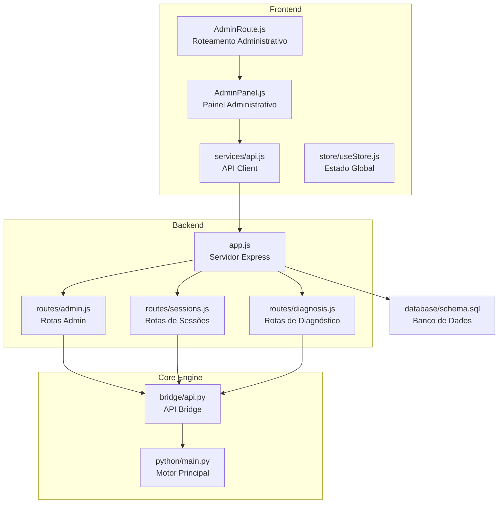

**Fontes do Diagrama**
- [backend/src/app.js:110-116](file://backend/src/app.js#L110-L116)
- [backend/src/routes/admin.js:12](file://backend/src/routes/admin.js#L12)
- [backend/src/routes/sessions.js:14](file://backend/src/routes/sessions.js#L14)
- [backend/src/routes/diagnosis.js:12](file://backend/src/routes/diagnosis.js#L12)
- [core-engine/bridge/api.py:120-125](file://core-engine/bridge/api.py#L120-L125)
- [core-engine/python/main.py:246](file://core-engine/python/main.py#L246)

**Fontes da Seção**
- [backend/src/app.js:110-116](file://backend/src/app.js#L110-L116)
- [frontend/src/pages/AdminPanel.js:50-158](file://frontend/src/pages/AdminPanel.js#L50-L158)
- [frontend/src/components/AdminRoute.js:5-17](file://frontend/src/components/AdminRoute.js#L5-L17)

## Componentes Principais
O painel administrativo é composto pelos seguintes componentes principais:

- **Painel Administrativo**: Interface principal com abas para Visão Geral, Usuários, Sessões e Configurações
- **Roteamento Administrativo**: Proteção de rotas para usuários administradores
- **API Client**: Integração com backend via Axios
- **Armazenamento de Estado**: Gerenciamento de autenticação e dados do usuário
- **Integração com Core Engine**: Consumo de estatísticas e métricas do motor principal

**Fontes da Seção**
- [frontend/src/pages/AdminPanel.js:15-158](file://frontend/src/pages/AdminPanel.js#L15-L158)
- [frontend/src/components/AdminRoute.js:5-17](file://frontend/src/components/AdminRoute.js#L5-L17)
- [frontend/src/services/api.js:77-87](file://frontend/src/services/api.js#L77-L87)
- [frontend/src/store/useStore.js:4-42](file://frontend/src/store/useStore.js#L4-L42)

## Visão Geral da Arquitetura
A arquitetura do painel administrativo segue um modelo de microsserviços onde o backend Express atua como gateway para o Core Engine Python. O Core Engine expõe endpoints REST e WebSocket para operações de diagnóstico, sessões e estatísticas.

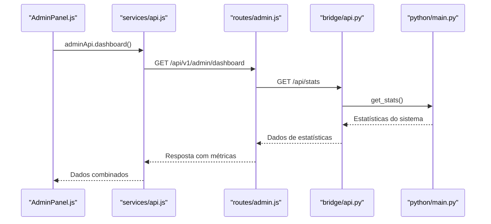

**Fontes do Diagrama**
- [frontend/src/pages/AdminPanel.js:24-40](file://frontend/src/pages/AdminPanel.js#L24-L40)
- [frontend/src/services/api.js:79](file://frontend/src/services/api.js#L79)
- [backend/src/routes/admin.js:40-64](file://backend/src/routes/admin.js#L40-L64)
- [core-engine/bridge/api.py:296-304](file://core-engine/bridge/api.py#L296-L304)
- [core-engine/python/main.py:431-449](file://core-engine/python/main.py#L431-L449)

**Fontes da Seção**
- [backend/src/routes/admin.js:39-64](file://backend/src/routes/admin.js#L39-L64)
- [core-engine/bridge/api.py:139-155](file://core-engine/bridge/api.py#L139-L155)
- [core-engine/python/main.py:431-449](file://core-engine/python/main.py#L431-L449)

## Análise Detalhada dos Componentes

### Painel Administrativo - Visão Geral
O painel de visão geral apresenta um dashboard com status do sistema, estatísticas de sessões e distribuição de problemas.

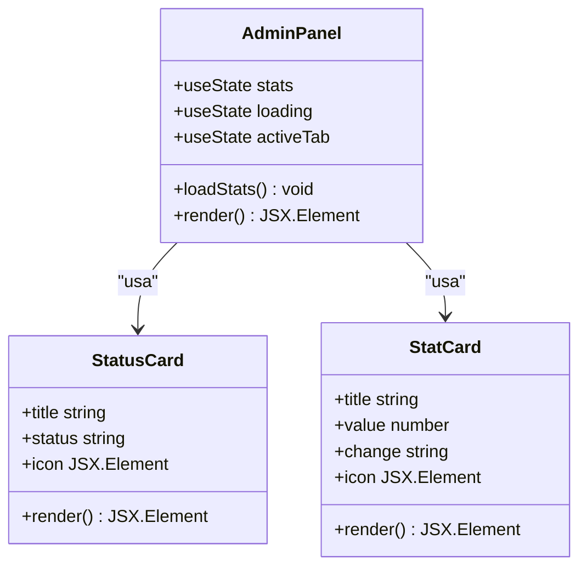

**Fontes do Diagrama**
- [frontend/src/pages/AdminPanel.js:15-190](file://frontend/src/pages/AdminPanel.js#L15-L190)

**Fontes da Seção**
- [frontend/src/pages/AdminPanel.js:82-146](file://frontend/src/pages/AdminPanel.js#L82-L146)

### Roteamento Administrativo
O componente AdminRoute garante que apenas usuários com papel de administrador possam acessar o painel administrativo.

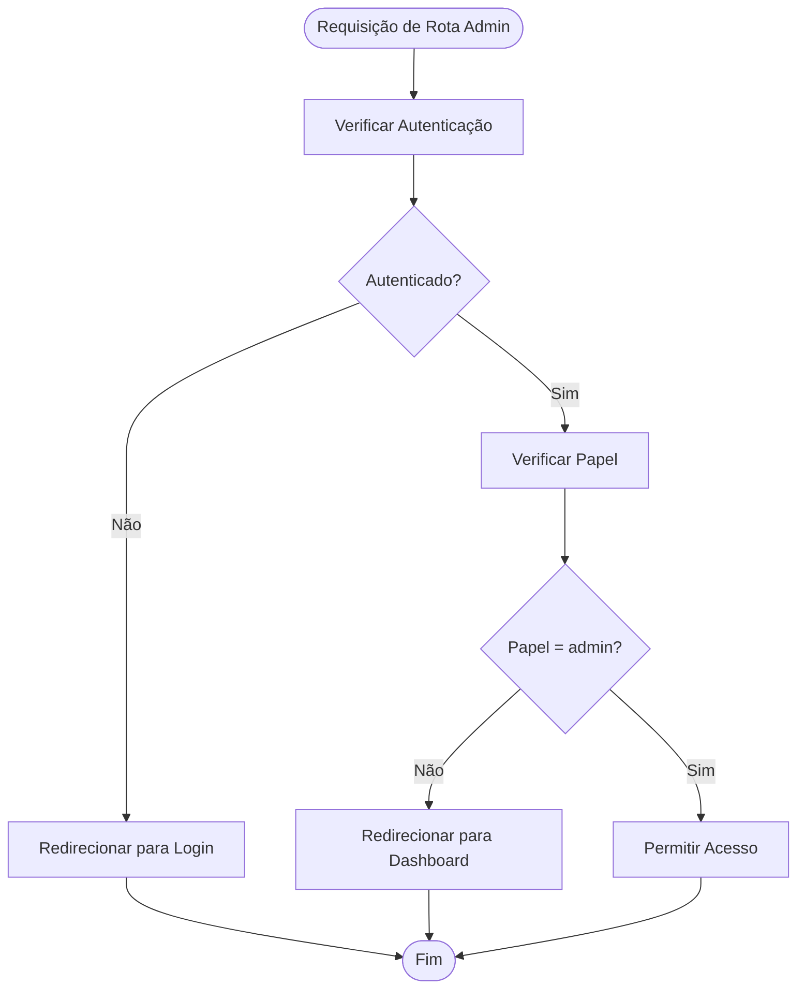

**Fontes do Diagrama**
- [frontend/src/components/AdminRoute.js:5-17](file://frontend/src/components/AdminRoute.js#L5-L17)

**Fontes da Seção**
- [frontend/src/components/AdminRoute.js:5-17](file://frontend/src/components/AdminRoute.js#L5-L17)

### Gerenciamento de Usuários
O backend fornece rotas para gerenciamento de usuários com validações e middleware de autenticação.

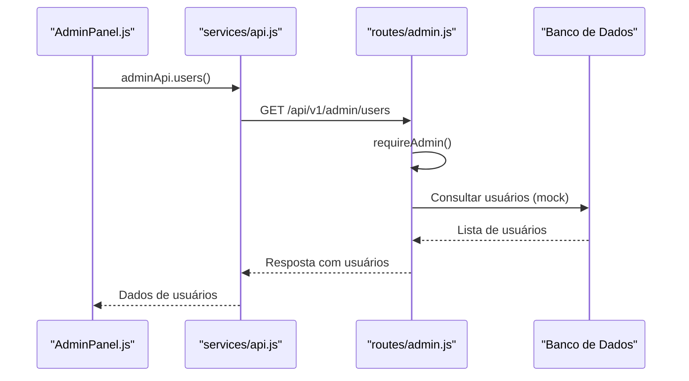

**Fontes do Diagrama**
- [backend/src/routes/admin.js:67-86](file://backend/src/routes/admin.js#L67-L86)
- [frontend/src/services/api.js:80](file://frontend/src/services/api.js#L80)

**Fontes da Seção**
- [backend/src/routes/admin.js:67-118](file://backend/src/routes/admin.js#L67-L118)

### Configurações do Sistema
O painel permite gerenciar configurações do sistema como modo manutenção e registros abertos.

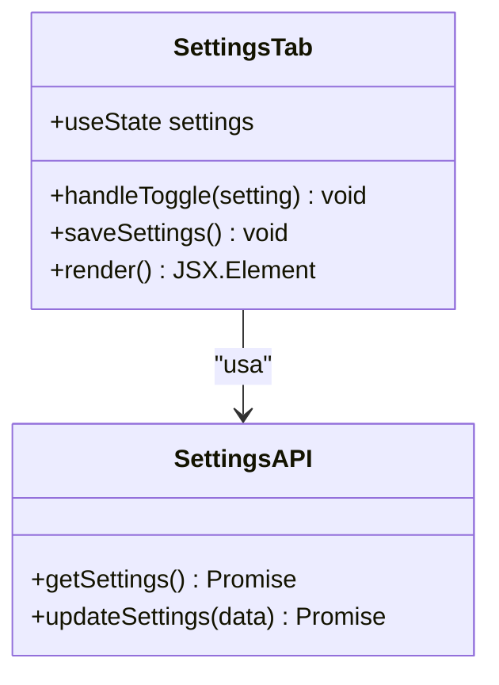

**Fontes do Diagrama**
- [frontend/src/pages/AdminPanel.js:279-321](file://frontend/src/pages/AdminPanel.js#L279-L321)
- [frontend/src/services/api.js:84-87](file://frontend/src/services/api.js#L84-L87)

**Fontes da Seção**
- [frontend/src/pages/AdminPanel.js:279-321](file://frontend/src/pages/AdminPanel.js#L279-L321)
- [backend/src/routes/admin.js:145-173](file://backend/src/routes/admin.js#L145-L173)

### Métricas e Estatísticas
O painel exibe métricas do sistema e estatísticas do Core Engine.

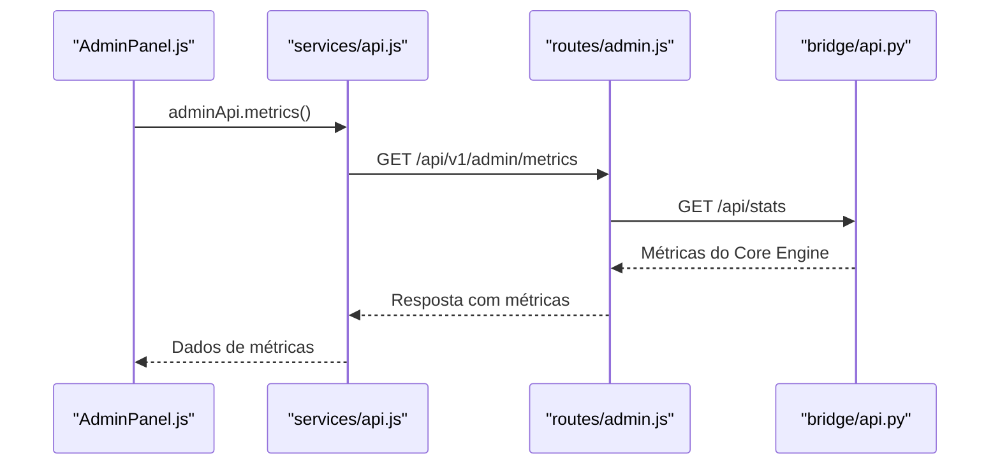

**Fontes do Diagrama**
- [backend/src/routes/admin.js:176-205](file://backend/src/routes/admin.js#L176-L205)
- [core-engine/bridge/api.py:296-304](file://core-engine/bridge/api.py#L296-L304)

**Fontes da Seção**
- [backend/src/routes/admin.js:176-205](file://backend/src/routes/admin.js#L176-L205)

### Backup e Restauração
O backend fornece endpoints para backup e restauração de dados.

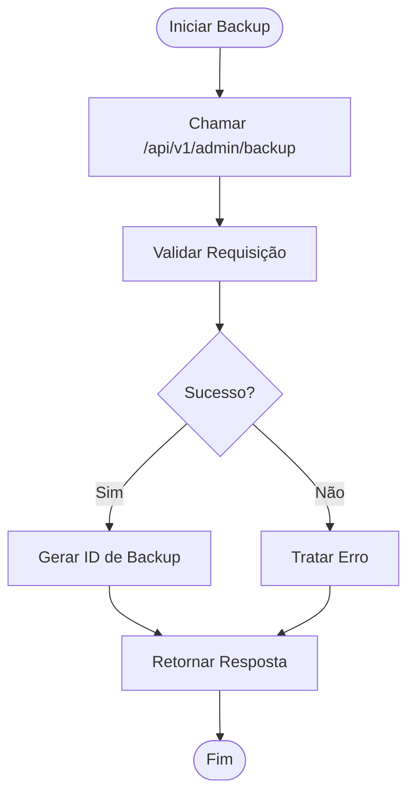

**Fontes do Diagrama**
- [backend/src/routes/admin.js:208-232](file://backend/src/routes/admin.js#L208-L232)

**Fontes da Seção**
- [backend/src/routes/admin.js:208-232](file://backend/src/routes/admin.js#L208-L232)

### Painel de Controle de Sessões
O painel de sessões permite monitorar e gerenciar sessões ativas.

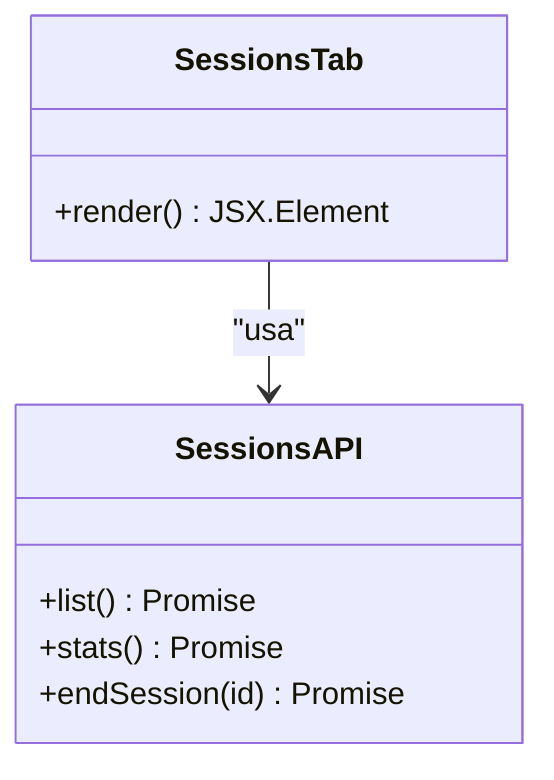

**Fontes do Diagrama**
- [frontend/src/pages/AdminPanel.js:269-277](file://frontend/src/pages/AdminPanel.js#L269-L277)
- [frontend/src/services/api.js:57-59](file://frontend/src/services/api.js#L57-L59)

**Fontes da Seção**
- [frontend/src/pages/AdminPanel.js:269-277](file://frontend/src/pages/AdminPanel.js#L269-L277)
- [backend/src/routes/sessions.js:210-228](file://backend/src/routes/sessions.js#L210-L228)

### Monitoramento de Atividades
O backend fornece rotas para consulta de logs do sistema com filtros.

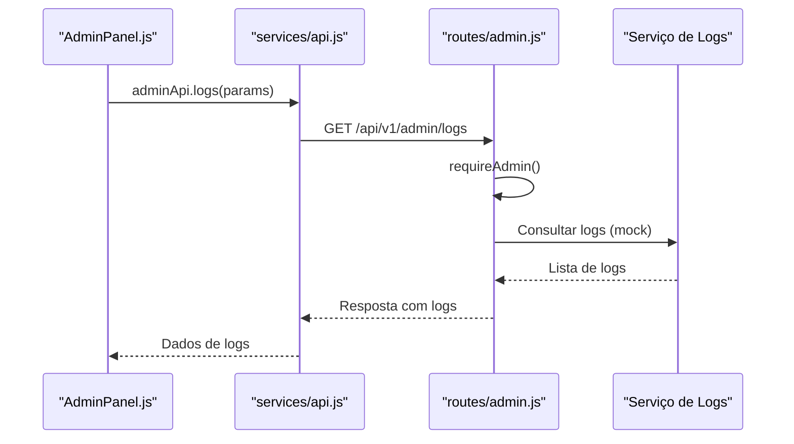

**Fontes do Diagrama**
- [backend/src/routes/admin.js:121-142](file://backend/src/routes/admin.js#L121-L142)

**Fontes da Seção**
- [backend/src/routes/admin.js:121-142](file://backend/src/routes/admin.js#L121-L142)

### Ferramentas de Manutenção
O painel oferece ferramentas de manutenção como modo manutenção e configurações de registro.

**Fontes da Seção**
- [frontend/src/pages/AdminPanel.js:279-321](file://frontend/src/pages/AdminPanel.js#L279-L321)

## Análise de Dependências
O sistema possui dependências específicas tanto no backend quanto no frontend, além de integrações com o Core Engine.

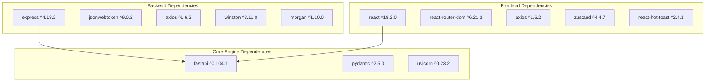

**Fontes do Diagrama**
- [backend/package.json:23-46](file://backend/package.json#L23-L46)
- [frontend/package.json:5-24](file://frontend/package.json#L5-L24)
- [core-engine/bridge/api.py:17-25](file://core-engine/bridge/api.py#L17-L25)

**Fontes da Seção**
- [backend/package.json:23-46](file://backend/package.json#L23-L46)
- [frontend/package.json:5-24](file://frontend/package.json#L5-L24)

## Considerações de Desempenho
O backend implementa várias otimizações de desempenho incluindo:

- **Rate Limiting**: Proteção contra excesso de requisições
- **Compression**: Redução do tamanho das respostas
- **CORS**: Configuração otimizada para segurança
- **Helmet**: Middleware de segurança
- **Logging**: Sistema de logs estruturados com Winston

**Fontes da Seção**
- [backend/src/app.js:78-96](file://backend/src/app.js#L78-L96)
- [backend/src/app.js:34-54](file://backend/src/app.js#L34-L54)

## Guia de Solução de Problemas
Para resolver problemas comuns no painel administrativo:

### Erros de Autenticação
- Verifique se o token JWT está sendo enviado corretamente
- Confirme que o usuário possui papel de administrador
- Valide o formato do token Bearer

### Erros de Conexão com Core Engine
- Verifique se o serviço Core Engine está online
- Confirme a URL de conexão configurada
- Verifique firewall e permissões de rede

### Problemas de Carregamento de Dados
- Verifique se as rotas estão corretamente mapeadas
- Confirme se os endpoints estão retornando dados válidos
- Valide as permissões de acesso

**Fontes da Seção**
- [backend/src/routes/admin.js:15-37](file://backend/src/routes/admin.js#L15-L37)
- [backend/src/app.js:148-162](file://backend/src/app.js#L148-L162)

## Conclusão
O painel administrativo oferece uma solução completa para gerenciamento do sistema, com integração robusta ao Core Engine e recursos avançados de monitoramento e manutenção. A arquitetura modular permite fácil expansão e manutenção, enquanto as validações e proteções garantem segurança e confiabilidade.