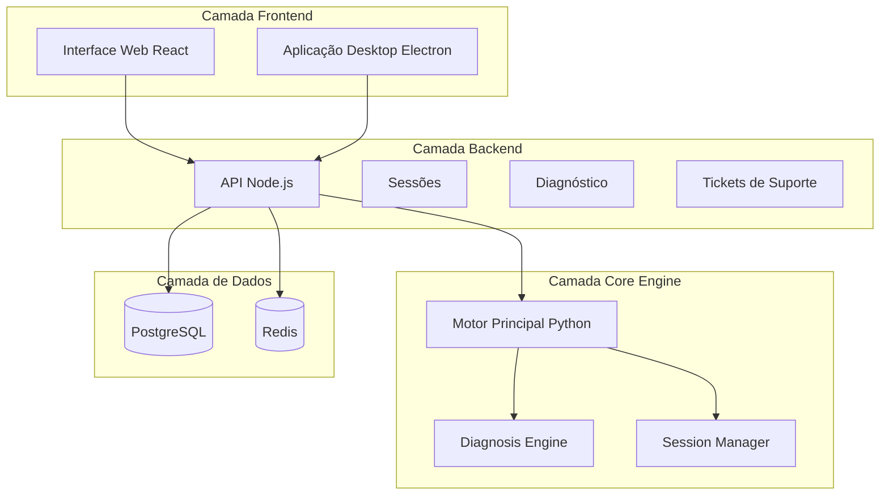
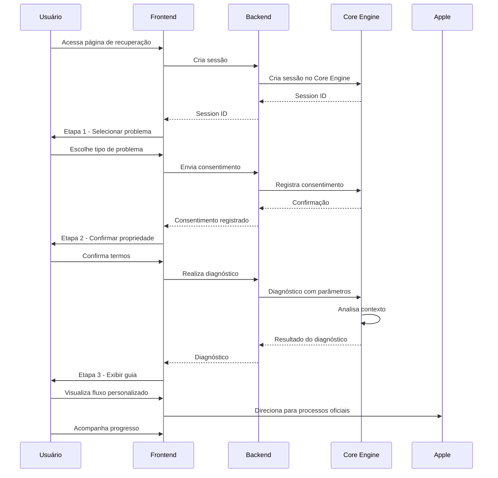
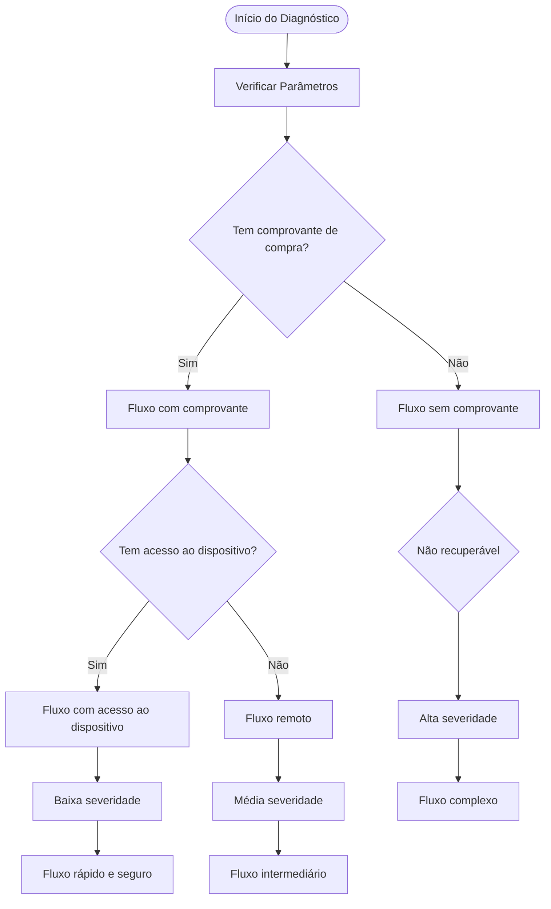
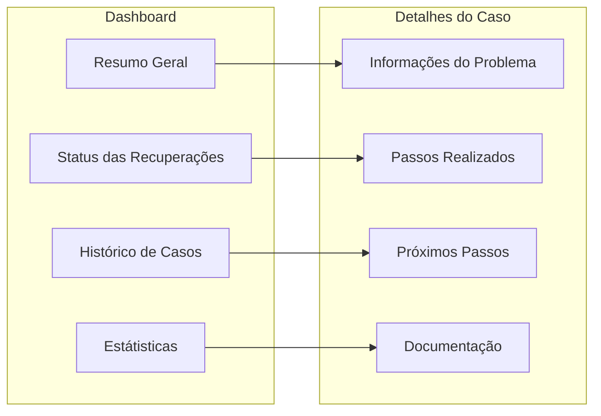
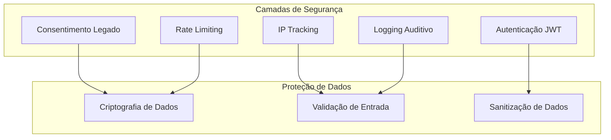

# Fluxos de Recuperação Guiada

<cite>
**Arquivos Referenciados neste Documento**
- [RecoveryFlow.js](file://frontend/src/pages/RecoveryFlow.js)
- [diagnosis.js](file://backend/src/routes/diagnosis.js)
- [sessions.js](file://backend/src/routes/sessions.js)
- [api.py](file://core-engine/bridge/api.py)
- [main.py](file://core-engine/python/main.py)
- [api.js](file://frontend/src/services/api.js)
- [app.js](file://backend/src/app.js)
- [README.md](file://README.md)
</cite>

## Sumário
- [Introdução](#introdução)
- [Arquitetura Geral](#arquitetura-geral)
- [Fluxos de Recuperação Personalizados](#fluxos-de-recuperação-personalizados)
- [Exemplos de Casos Clínicos](#exemplos-de-casos-clínicos)
- [Adaptação Baseada em Parâmetros](#adaptação-baseada-em-parâmetros)
- [Fluxos de Recuperação Específicos](#fluxos-de-recuperação-específicos)
- [Sistema de Acompanhamento](#sistema-de-acompanhamento)
- [Considerações de Segurança](#considerações-de-segurança)
- [Conclusão](#conclusão)

## Introdução

O sistema de **Fluxos de Recuperação Guiada** é um assistente inteligente de suporte Apple ID que oferece um fluxo completo de recuperação de acesso a contas Apple, seguindo rigorosamente os processos oficiais da Apple. O sistema é projetado para fornecer orientações personalizadas com base nas respostas do usuário e no contexto fornecido.

O sistema opera como um assistente de suporte guiado, não realizando bypass ou desbloqueio ilegal de iCloud. Todas as recuperações seguem os processos oficiais da Apple, garantindo conformidade legal e segurança.

## Arquitetura Geral

O sistema segue uma arquitetura de três camadas:



**Fontes**
- [app.js:15-32](file://backend/src/app.js#L15-L32)
- [api.py:164-170](file://core-engine/bridge/api.py#L164-L170)

## Fluxos de Recuperação Personalizados

### Etapas do Fluxo Completo

O sistema implementa um fluxo guiado de quatro etapas:



**Fontes**
- [RecoveryFlow.js:39-106](file://frontend/src/pages/RecoveryFlow.js#L39-L106)
- [diagnosis.js:15-69](file://backend/src/routes/diagnosis.js#L15-L69)
- [api.py:251-282](file://core-engine/bridge/api.py#L251-L282)

### Geração de Fluxos Personalizados

O sistema gera fluxos personalizados com base em:

1. **Tipo de Problema**: Determina o conteúdo e complexidade do fluxo
2. **Parâmetros Contextuais**: Comprovante de compra e acesso ao dispositivo
3. **Nível de Severidade**: Define o tempo estimado e complexidade
4. **Requerimento de Suporte**: Indica quando é necessário contato com Apple

**Fontes**
- [main.py:169-212](file://core-engine/python/main.py#L169-L212)
- [diagnosis.js:140-170](file://backend/src/routes/diagnosis.js#L140-L170)

## Exemplos de Casos Clínicos

### Caso 1: Senha Esquecida (Baixa Severidade)

**Cenário**: Usuário esqueceu a senha do Apple ID e tem acesso ao e-mail cadastrado.

**Fluxo Personalizado**:
1. Acessar site oficial da Apple
2. Verificar identidade via e-mail ou telefone
3. Redefinir senha com nova senha segura
4. Atualizar senha em todos os dispositivos

**Tempo Estimado**: 15-30 minutos

**Fontes**
- [RecoveryFlow.js:389-439](file://frontend/src/pages/RecoveryFlow.js#L389-L439)
- [main.py:81-94](file://core-engine/python/main.py#L81-L94)

### Caso 2: Bloqueio de Ativação (Alta Severidade)

**Cenário**: Dispositivo com Activation Lock ativo, sem comprovante de compra.

**Fluxo Personalizado**:
1. Verificar se possui comprovante de compra original
2. Preparar documentação (nota fiscal, IMEI)
3. Contatar suporte Apple oficial
4. Aguardar análise e decisão

**Tempo Estimado**: 3-7 dias úteis (com comprovante) / Não recuperável (sem comprovante)

**Fontes**
- [RecoveryFlow.js:442-504](file://frontend/src/pages/RecoveryFlow.js#L442-L504)
- [main.py:109-122](file://core-engine/python/main.py#L109-L122)

### Caso 3: Verificação em 2 Etapas (Média Severidade)

**Cenário**: Usuário precisa recuperar acesso após perder dispositivo de autenticação.

**Fluxo Personalizado**:
1. Verificar dispositivos confiáveis cadastrados
2. Tentar recuperação via número de telefone
3. Contatar suporte Apple se necessário
4. Aguardar verificação de identidade

**Tempo Estimado**: 1-3 dias

**Fontes**
- [main.py:95-108](file://core-engine/python/main.py#L95-L108)
- [diagnosis.js:140-170](file://backend/src/routes/diagnosis.js#L140-L170)

## Adaptação Baseada em Parâmetros

### Parâmetros de Contexto

O sistema considera parâmetros críticos para personalizar os fluxos:



**Fontes**
- [main.py:169-212](file://core-engine/python/main.py#L169-L212)
- [diagnosis.js:35-49](file://backend/src/routes/diagnosis.js#L35-L49)

### Impacto dos Parâmetros

| Parâmetro | Comprovante de Compra | Acesso ao Dispositivo |
|-----------|----------------------|----------------------|
| **Baixa Severidade** | Sim | Sim/Não | Senha esquecida, fácil acesso |
| **Média Severidade** | Não | Sim | Verificação 2FA, acesso remoto |
| **Alta Severidade** | Não | Não | Activation Lock, dispositivo usado |

**Fontes**
- [main.py:193-200](file://core-engine/python/main.py#L193-L200)
- [sessions.js:175-207](file://backend/src/routes/sessions.js#L175-L207)

## Fluxos de Recuperação Específicos

### Fluxo de Senha Esquecida

```mermaid
flowchart TD
A[Usuário seleciona "Esqueci a Senha"] --> B[Verifica e-mail cadastrado]
B --> C[Acessa iforgot.apple.com]
C --> D[Escolhe método de verificação]
D --> E[Recebe código via e-mail/SMS]
E --> F[Redefine nova senha]
F --> G[Atualiza senhas nos dispositivos]
G --> H[Finaliza fluxo]
```

**Fontes**
- [RecoveryFlow.js:389-439](file://frontend/src/pages/RecoveryFlow.js#L389-L439)
- [main.py:81-94](file://core-engine/python/main.py#L81-L94)

### Fluxo de Bloqueio de Ativação

```mermaid
flowchart TD
A[Usuário seleciona "Bloqueio de Ativação"] --> B{Tem comprovante de compra?}
B --> |Sim| C[Prepara documentação]
B --> |Não| D[Alerta sobre impossibilidade]
C --> E[Contata suporte Apple]
E --> F[Agurda análise]
F --> G[Liberação do dispositivo]
D --> H[Recomenda ações legais]
H --> I[Finaliza fluxo]
```

**Fontes**
- [RecoveryFlow.js:442-504](file://frontend/src/pages/RecoveryFlow.js#L442-L504)
- [main.py:109-122](file://core-engine/python/main.py#L109-L122)

### Fluxo de Verificação em 2 Etapas

```mermaid
flowchart TD
A[Usuário seleciona "Verificação em 2 Etapas"] --> B{Tem dispositivo confiável?}
B --> |Sim| C[Usa dispositivo confiável]
B --> |Não| D{Tem número de telefone cadastrado?}
C --> E[Verificação automática]
D --> |Sim| F[Verificação via SMS]
D --> |Não| G[Contata suporte Apple]
E --> H[Recupera acesso]
F --> H
G --> I[Aguarda verificação]
I --> H
```

**Fontes**
- [main.py:95-108](file://core-engine/python/main.py#L95-L108)
- [diagnosis.js:140-170](file://backend/src/routes/diagnosis.js#L140-L170)

## Sistema de Acompanhamento

### Painel de Acompanhamento

O sistema oferece um painel completo para monitorar o progresso das recuperações:



**Fontes**
- [RecoveryFlow.js:337-356](file://frontend/src/pages/RecoveryFlow.js#L337-L356)
- [api.py:341-348](file://core-engine/bridge/api.py#L341-L348)

### Recursos de Acompanhamento

- **Status em Tempo Real**: Monitoramento do progresso do fluxo
- **Documentação**: Links para processos oficiais da Apple
- **Notificações**: Alertas sobre prazos e próximos passos
- **Histórico**: Registro completo de todas as interações

**Fontes**
- [api.js:51-87](file://frontend/src/services/api.js#L51-L87)
- [sessions.js:209-246](file://backend/src/routes/sessions.js#L209-L246)

## Considerações de Segurança

### Medidas de Proteção

O sistema implementa várias camadas de segurança:

1. **Consentimento Legado**: Registro obrigatório de propriedade
2. **IP Tracking**: Monitoramento de endereços de origem
3. **Autenticação JWT**: Controles de acesso robustos
4. **Rate Limiting**: Proteção contra abuse
5. **Logging**: Auditoria completa de todas as ações



**Fontes**
- [sessions.js:175-207](file://backend/src/routes/sessions.js#L175-L207)
- [app.js:60-88](file://backend/src/app.js#L60-L88)
- [api.py:285-318](file://core-engine/bridge/api.py#L285-L318)

### Conformidade Legal

- **Processos Oficiais**: Todos os fluxos seguem procedimentos da Apple
- **Documentação**: Links para sites oficiais e políticas
- **Transparência**: Registro completo de todas as ações
- **Proibição de Bypass**: Clareza sobre métodos ilegais

**Fontes**
- [README.md:7-10](file://README.md#L7-L10)
- [main.py:357-430](file://core-engine/python/main.py#L357-L430)

## Conclusão

O sistema de Fluxos de Recuperação Guiada oferece uma solução completa e segura para assistência de recuperação de contas Apple ID. Combinando uma interface intuitiva, processos personalizados e conformidade legal rigorosa, o sistema garante:

- **Eficiência**: Fluxos otimizados para cada tipo de problema
- **Segurança**: Medidas de proteção avançadas
- **Conformidade**: Processos que seguem rigorosamente os procedimentos oficiais da Apple
- **Acompanhamento**: Painel completo para monitorar o progresso
- **Personalização**: Fluxos adaptados com base no contexto fornecido

A implementação modular e escalável permite fácil manutenção e expansão para novos tipos de problemas, mantendo sempre o foco na segurança e conformidade legal.