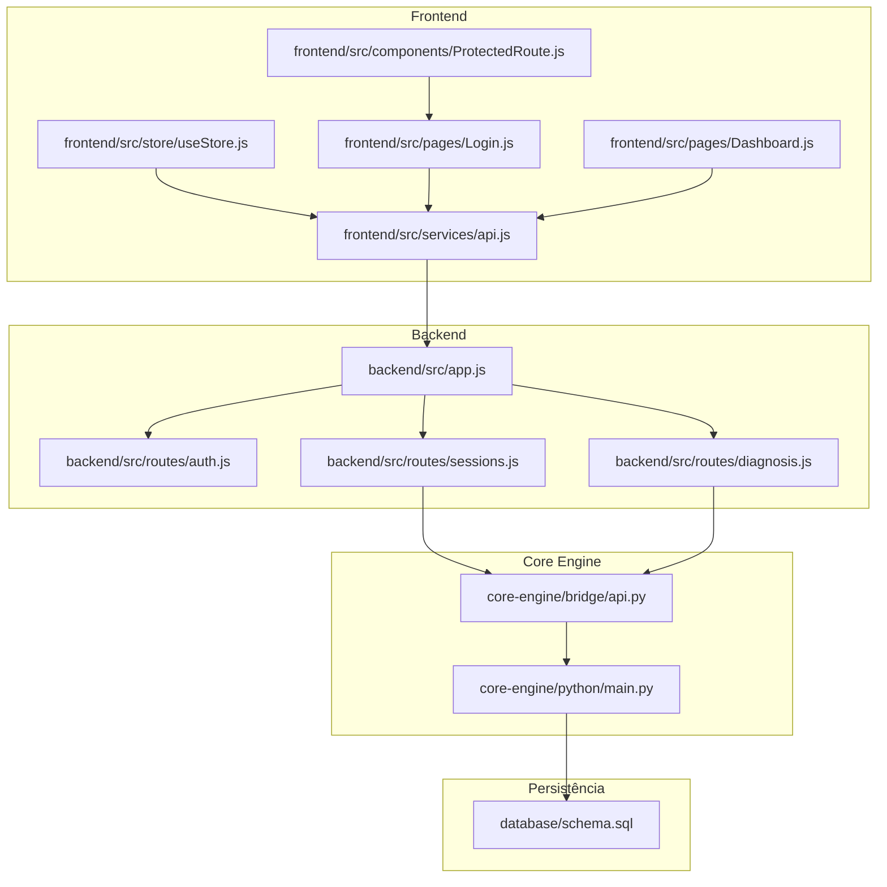
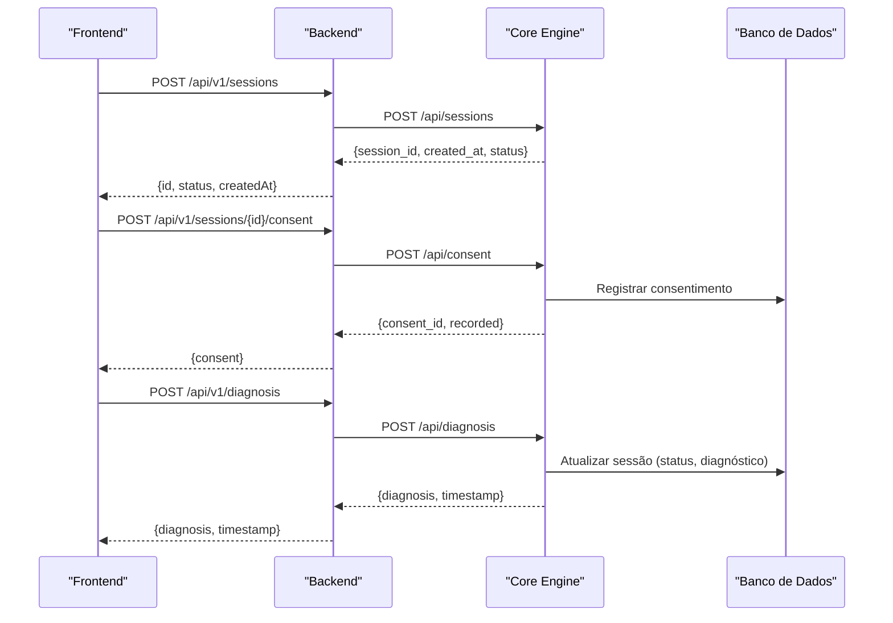
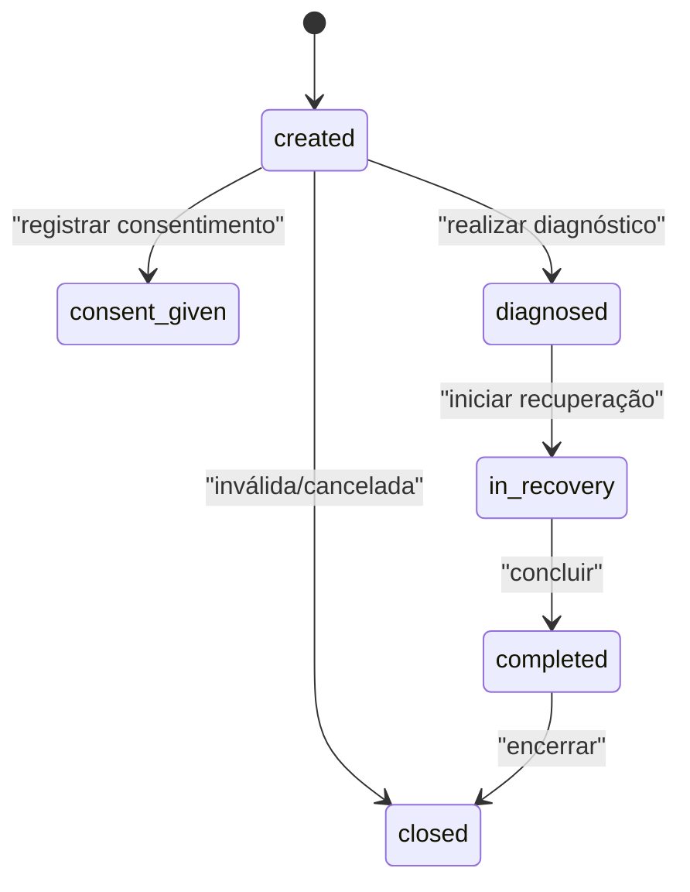
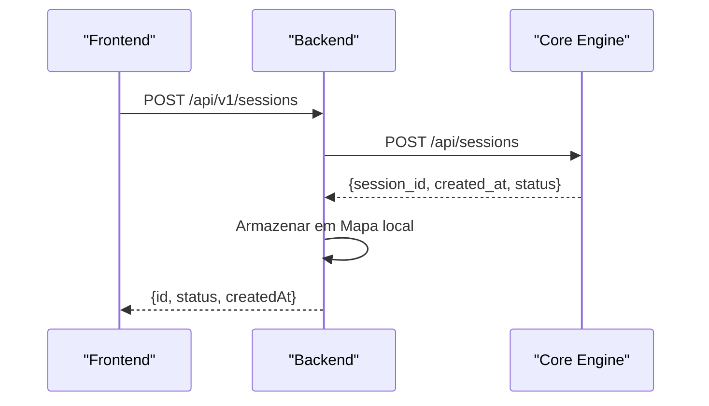
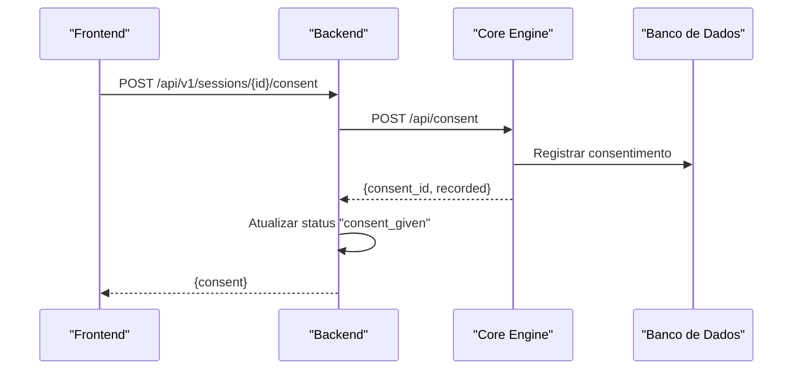
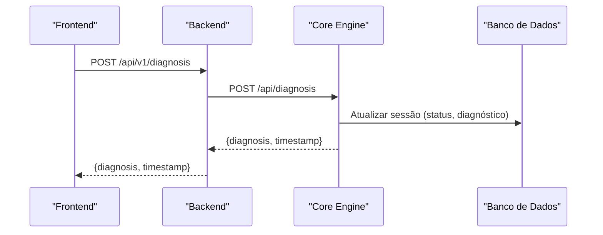
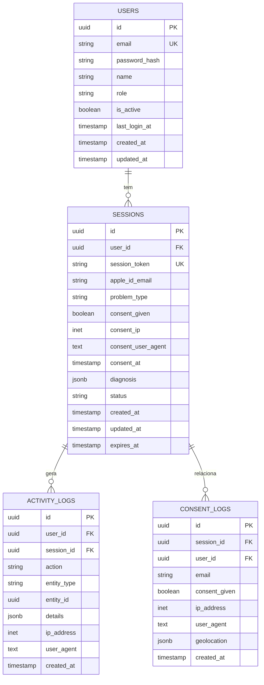
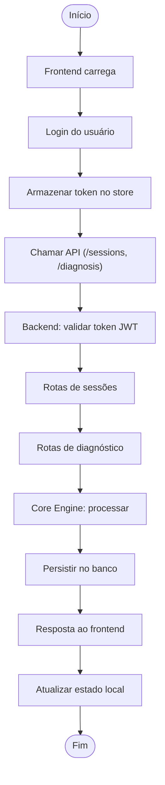
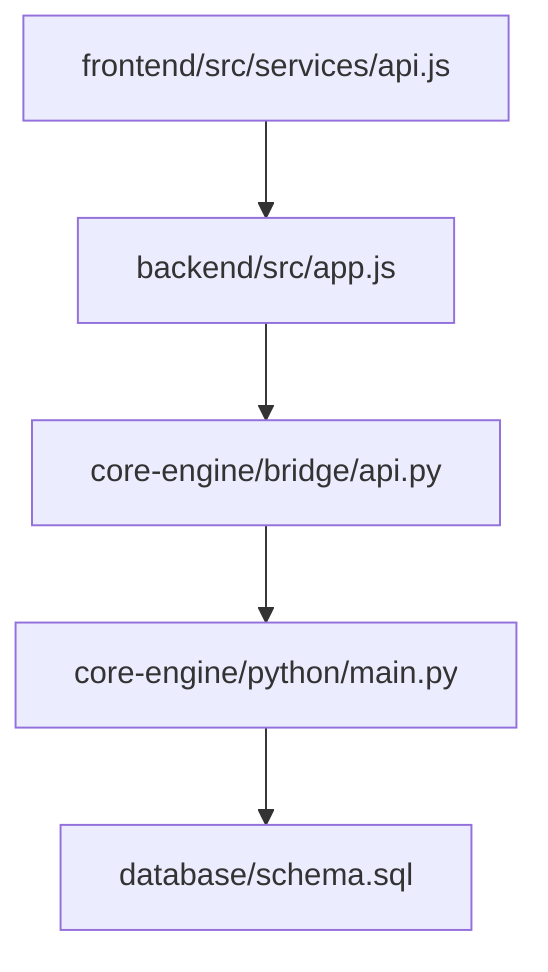

# Gerenciamento de Sessões

<cite>
**Arquivos referenciados neste documento**
- [backend/src/app.js](file://backend/src/app.js)
- [backend/src/routes/auth.js](file://backend/src/routes/auth.js)
- [backend/src/routes/sessions.js](file://backend/src/routes/sessions.js)
- [backend/src/routes/diagnosis.js](file://backend/src/routes/diagnosis.js)
- [core-engine/bridge/api.py](file://core-engine/bridge/api.py)
- [core-engine/python/main.py](file://core-engine/python/main.py)
- [database/schema.sql](file://database/schema.sql)
- [frontend/src/services/api.js](file://frontend/src/services/api.js)
- [frontend/src/store/useStore.js](file://frontend/src/store/useStore.js)
- [frontend/src/pages/Login.js](file://frontend/src/pages/Login.js)
- [frontend/src/pages/Dashboard.js](file://frontend/src/pages/Dashboard.js)
- [frontend/src/components/ProtectedRoute.js](file://frontend/src/components/ProtectedRoute.js)
</cite>

## Sumário
1. [Introdução](#introdução)
2. [Estrutura do Projeto](#estrutura-do-projeto)
3. [Componentes-Chave](#componentes-chave)
4. [Visão Geral da Arquitetura](#visão-geral-da-arquitetura)
5. [Análise Detalhada dos Componentes](#análise-detalhada-dos-componentes)
6. [Análise de Dependências](#análise-de-dependências)
7. [Considerações de Desempenho](#considerações-de-desempenho)
8. [Guia de Solução de Problemas](#guia-de-solução-de-problemas)
9. [Conclusão](#conclusão)

## Introdução
Este documento apresenta o sistema completo de gerenciamento de sessões de usuário, abrangendo criação, manutenção e encerramento de sessões, estados e transições, armazenamento de dados, persistência, rastreamento de progresso no fluxo de diagnóstico, registro de consentimento, auditoria de atividades e tratamento de sessões incompletas ou inválidas. Também explica o papel das sessões na integração com o backend e frontend.

## Estrutura do Projeto
O projeto é dividido em três camadas principais:
- Backend (Node.js): roteamento de autenticação, sessões, diagnóstico e integração com o Core Engine.
- Core Engine (Python/FastAPI): motor de diagnóstico, gerenciador de sessões e APIs REST/WS.
- Frontend (React): autenticação, navegação protegida, chamadas à API e gerenciamento de estado local.

**Diagrama fonte**
- [backend/src/app.js:110-122](file://backend/src/app.js#L110-L122)
- [backend/src/routes/sessions.js:13](file://backend/src/routes/sessions.js#L13)
- [backend/src/routes/diagnosis.js:12](file://backend/src/routes/diagnosis.js#L12)
- [core-engine/bridge/api.py:164-231](file://core-engine/bridge/api.py#L164-L231)
- [core-engine/python/main.py:263-279](file://core-engine/python/main.py#L263-L279)
- [database/schema.sql:22-51](file://database/schema.sql#L22-L51)

**Seção fonte**
- [backend/src/app.js:110-122](file://backend/src/app.js#L110-L122)
- [backend/src/routes/sessions.js:13-14](file://backend/src/routes/sessions.js#L13-L14)
- [backend/src/routes/diagnosis.js:12-12](file://backend/src/routes/diagnosis.js#L12-L12)
- [core-engine/bridge/api.py:164-231](file://core-engine/bridge/api.py#L164-L231)
- [core-engine/python/main.py:263-279](file://core-engine/python/main.py#L263-L279)
- [database/schema.sql:22-51](file://database/schema.sql#L22-L51)

## Componentes-Chave
- Roteamento de Sessões: criação, consulta, atualização e consentimento.
- Motor de Diagnóstico: análise de problemas e geração de guias.
- Autenticação JWT: geração, validação e proteção de rotas.
- Armazenamento de Dados: estrutura de sessões, consentimentos e auditoria.
- Frontend: chamadas à API, interceptores de token e estado persistente.

**Seção fonte**
- [backend/src/routes/sessions.js:39-88](file://backend/src/routes/sessions.js#L39-L88)
- [backend/src/routes/diagnosis.js:14-69](file://backend/src/routes/diagnosis.js#L14-L69)
- [backend/src/routes/auth.js:25-42](file://backend/src/routes/auth.js#L25-L42)
- [database/schema.sql:22-106](file://database/schema.sql#L22-L106)
- [frontend/src/services/api.js:15-40](file://frontend/src/services/api.js#L15-L40)

## Visão Geral da Arquitetura
O fluxo de uma sessão começa com o frontend criando uma sessão no backend, que repassa ao Core Engine. O Core Engine retorna o ID da sessão e o status inicial. Durante o fluxo, o usuário pode registrar consentimento e realizar diagnósticos, sendo que o Core Engine atualiza o status da sessão conforme o progresso. O backend e o Core Engine persistem dados relevantes, enquanto o frontend mantém o estado local e envia tokens JWT nas requisições.

**Diagrama fonte**
- [backend/src/routes/sessions.js:39-88](file://backend/src/routes/sessions.js#L39-L88)
- [backend/src/routes/sessions.js:161-207](file://backend/src/routes/sessions.js#L161-L207)
- [backend/src/routes/diagnosis.js:14-69](file://backend/src/routes/diagnosis.js#L14-L69)
- [core-engine/bridge/api.py:213-249](file://core-engine/bridge/api.py#L213-L249)
- [core-engine/bridge/api.py:285-318](file://core-engine/bridge/api.py#L285-L318)
- [core-engine/bridge/api.py:251-283](file://core-engine/bridge/api.py#L251-L283)
- [core-engine/python/main.py:272-327](file://core-engine/python/main.py#L272-L327)
- [core-engine/python/main.py:328-354](file://core-engine/python/main.py#L328-L354)

## Análise Detalhada dos Componentes

### Estados e Transições de Sessão
Os estados possíveis de uma sessão são:
- created: sessão criada no Core Engine.
- consent_given: consentimento registrado.
- diagnosed: diagnóstico realizado.
- in_recovery: em processo de recuperação.
- completed: sessão concluída.
- closed: sessão encerrada.

Transições:
- created → consent_given após registro de consentimento.
- created → diagnosed após diagnóstico.
- diagnosed → in_recovery quando o técnico inicia o processo.
- in_recovery → completed ao finalizar.
- created → closed para sessões inválidas ou canceladas.

**Diagrama fonte**
- [core-engine/python/main.py:65-74](file://core-engine/python/main.py#L65-L74)
- [core-engine/python/main.py:316-318](file://core-engine/python/main.py#L316-L318)
- [database/schema.sql:40-47](file://database/schema.sql#L40-L47)

**Seção fonte**
- [core-engine/python/main.py:65-74](file://core-engine/python/main.py#L65-L74)
- [database/schema.sql:40-47](file://database/schema.sql#L40-L47)

### Criação de Sessão
- Backend: recebe dados do frontend, chama o Core Engine e armazena localmente os dados da sessão com status created.
- Core Engine: gera um ID único e define status inicial created.

**Diagrama fonte**
- [backend/src/routes/sessions.js:39-88](file://backend/src/routes/sessions.js#L39-L88)
- [core-engine/bridge/api.py:213-228](file://core-engine/bridge/api.py#L213-L228)
- [core-engine/python/main.py:272-279](file://core-engine/python/main.py#L272-L279)

**Seção fonte**
- [backend/src/routes/sessions.js:39-88](file://backend/src/routes/sessions.js#L39-L88)
- [core-engine/bridge/api.py:213-228](file://core-engine/bridge/api.py#L213-L228)
- [core-engine/python/main.py:272-279](file://core-engine/python/main.py#L272-L279)

### Registro de Consentimento
- Backend: valida parâmetros, chama o Core Engine e atualiza o status da sessão local.
- Core Engine: registra o consentimento, IP e timestamp, e atualiza o status da sessão.

**Diagrama fonte**
- [backend/src/routes/sessions.js:161-207](file://backend/src/routes/sessions.js#L161-L207)
- [core-engine/bridge/api.py:285-318](file://core-engine/bridge/api.py#L285-L318)
- [core-engine/python/main.py:328-354](file://core-engine/python/main.py#L328-L354)

**Seção fonte**
- [backend/src/routes/sessions.js:161-207](file://backend/src/routes/sessions.js#L161-L207)
- [core-engine/bridge/api.py:285-318](file://core-engine/bridge/api.py#L285-L318)
- [core-engine/python/main.py:328-354](file://core-engine/python/main.py#L328-L354)

### Diagnóstico e Progresso
- Backend: valida dados e encaminha ao Core Engine.
- Core Engine: realiza diagnóstico com base no tipo de problema, atualiza status e diagnóstico.

**Diagrama fonte**
- [backend/src/routes/diagnosis.js:14-69](file://backend/src/routes/diagnosis.js#L14-L69)
- [core-engine/bridge/api.py:251-283](file://core-engine/bridge/api.py#L251-L283)
- [core-engine/python/main.py:281-327](file://core-engine/python/main.py#L281-L327)

**Seção fonte**
- [backend/src/routes/diagnosis.js:14-69](file://backend/src/routes/diagnosis.js#L14-L69)
- [core-engine/bridge/api.py:251-283](file://core-engine/bridge/api.py#L251-L283)
- [core-engine/python/main.py:281-327](file://core-engine/python/main.py#L281-L327)

### Persistência de Dados
- Tabela sessions: armazena ID da sessão, e-mail do Apple ID, tipo de problema, consentimento, diagnóstico, status e timestamps.
- Tabela activity_logs: auditoria de ações do usuário.
- Tabela consent_logs: rastreamento legal de consentimentos com IP e UA.

**Diagrama fonte**
- [database/schema.sql:8-20](file://database/schema.sql#L8-L20)
- [database/schema.sql:22-51](file://database/schema.sql#L22-L51)
- [database/schema.sql:94-106](file://database/schema.sql#L94-L106)
- [database/schema.sql:108-119](file://database/schema.sql#L108-L119)

**Seção fonte**
- [database/schema.sql:22-51](file://database/schema.sql#L22-L51)
- [database/schema.sql:94-106](file://database/schema.sql#L94-L106)
- [database/schema.sql:108-119](file://database/schema.sql#L108-L119)

### Auditoria de Atividades
- O Core Engine registra ações no banco de dados, incluindo IP e user agent.
- O frontend dispara chamadas de diagnóstico e sessão, e o backend atualiza logs.

**Seção fonte**
- [core-engine/bridge/api.py:285-318](file://core-engine/bridge/api.py#L285-L318)
- [database/schema.sql:94-106](file://database/schema.sql#L94-L106)

### Tratamento de Sessões Incompletas ou Inválidas
- Validação de UUID e campos obrigatórios nos endpoints.
- Respostas de erro 404 para sessões não encontradas.
- Backend atualiza status da sessão local conforme o progresso.

**Seção fonte**
- [backend/src/routes/sessions.js:90-120](file://backend/src/routes/sessions.js#L90-L120)
- [backend/src/routes/sessions.js:122-159](file://backend/src/routes/sessions.js#L122-L159)

### Integração com Backend e Frontend
- Frontend:
  - Interceptadores de requisição e resposta adicionam/removem token JWT.
  - Store ZUSTAND persiste usuário e token.
  - Rotas protegidas impedem acesso não autenticado.
- Backend:
  - Middleware de autenticação JWT.
  - Rotas de sessões e diagnóstico com validações.

**Diagrama fonte**
- [frontend/src/services/api.js:15-40](file://frontend/src/services/api.js#L15-L40)
- [frontend/src/store/useStore.js:4-52](file://frontend/src/store/useStore.js#L4-L52)
- [frontend/src/components/ProtectedRoute.js:5-13](file://frontend/src/components/ProtectedRoute.js#L5-L13)
- [backend/src/routes/auth.js:25-42](file://backend/src/routes/auth.js#L25-L42)
- [backend/src/routes/sessions.js:39-88](file://backend/src/routes/sessions.js#L39-L88)
- [backend/src/routes/diagnosis.js:14-69](file://backend/src/routes/diagnosis.js#L14-L69)

**Seção fonte**
- [frontend/src/services/api.js:15-40](file://frontend/src/services/api.js#L15-L40)
- [frontend/src/store/useStore.js:4-52](file://frontend/src/store/useStore.js#L4-L52)
- [frontend/src/components/ProtectedRoute.js:5-13](file://frontend/src/components/ProtectedRoute.js#L5-L13)
- [backend/src/routes/auth.js:25-42](file://backend/src/routes/auth.js#L25-L42)
- [backend/src/routes/sessions.js:39-88](file://backend/src/routes/sessions.js#L39-L88)
- [backend/src/routes/diagnosis.js:14-69](file://backend/src/routes/diagnosis.js#L14-L69)

## Análise de Dependências
- Backend depende do Core Engine via HTTP.
- Core Engine depende do banco de dados para persistência.
- Frontend depende do backend para todas as operações de sessão e diagnóstico.

**Diagrama fonte**
- [backend/src/app.js:110-122](file://backend/src/app.js#L110-L122)
- [core-engine/bridge/api.py:164-231](file://core-engine/bridge/api.py#L164-L231)
- [core-engine/python/main.py:263-279](file://core-engine/python/main.py#L263-L279)
- [database/schema.sql:22-51](file://database/schema.sql#L22-L51)

**Seção fonte**
- [backend/src/app.js:110-122](file://backend/src/app.js#L110-L122)
- [core-engine/bridge/api.py:164-231](file://core-engine/bridge/api.py#L164-L231)
- [core-engine/python/main.py:263-279](file://core-engine/python/main.py#L263-L279)
- [database/schema.sql:22-51](file://database/schema.sql#L22-L51)

## Considerações de Desempenho
- O backend atual usa um Mapa para armazenar sessões locais; em produção, substituir por Redis/PostgreSQL para escalabilidade.
- O Core Engine atualmente mantém dados em memória; integrar com persistência duradoura.
- O frontend utiliza interceptores de token e store persistente, o que melhora a experiência do usuário e reduz requisições desnecessárias.

## Guia de Solução de Problemas
- Erros de autenticação: verifique o token JWT e middleware de autenticação.
- Sessões não encontradas: confirme o UUID e que o Core Engine tenha a sessão.
- Diagnóstico falho: valide o tipo de problema e parâmetros adicionais.
- Consentimento inválido: verifique se o Core Engine registrou o consentimento corretamente.

**Seção fonte**
- [backend/src/routes/auth.js:25-42](file://backend/src/routes/auth.js#L25-L42)
- [backend/src/routes/sessions.js:90-120](file://backend/src/routes/sessions.js#L90-L120)
- [backend/src/routes/diagnosis.js:14-69](file://backend/src/routes/diagnosis.js#L14-L69)
- [core-engine/bridge/api.py:285-318](file://core-engine/bridge/api.py#L285-L318)

## Conclusão
O sistema de gerenciamento de sessões combina backend, Core Engine e frontend para oferecer um fluxo completo de recuperação Apple ID. As sessões são rastreadas com estados bem definidos, persistidas em banco de dados e auditadas com consentimentos e logs. A integração entre as camadas garante um acompanhamento eficiente do progresso do usuário, com tratamento adequado de sessões incompletas e validações rigorosas.