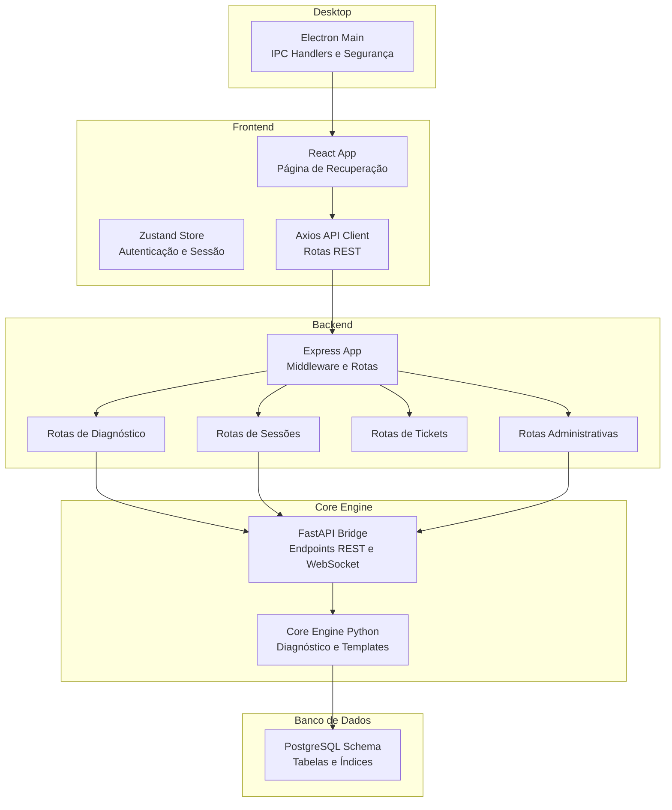
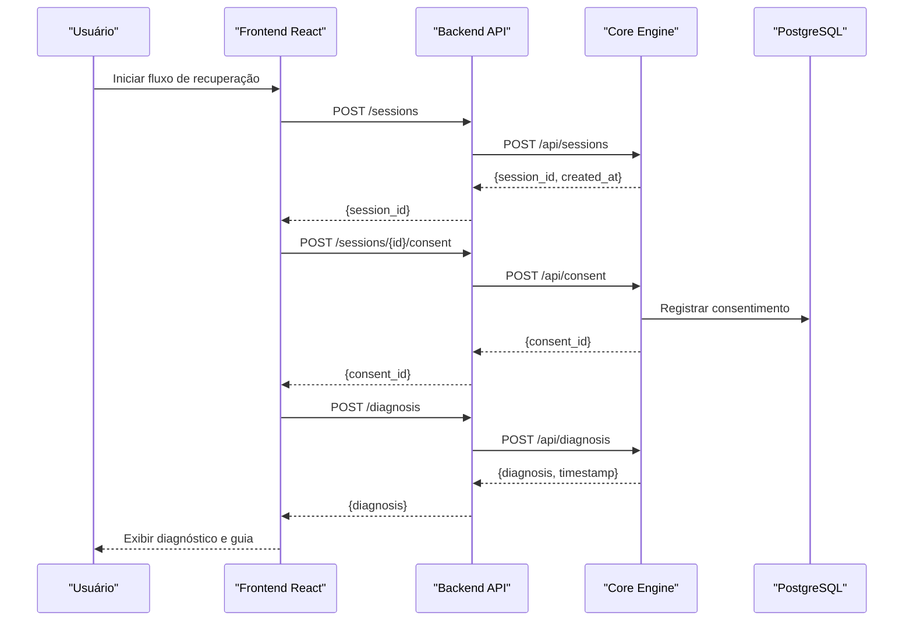
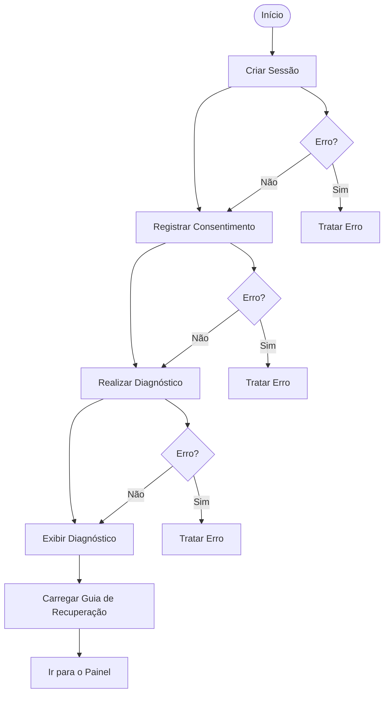
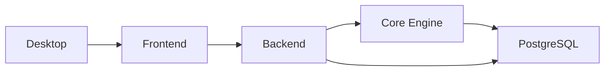

# Sistema de Diagnóstico Inteligente

<cite>
**Arquivos referenciados neste documento**
- [README.md](file://README.md)
- [app.js](file://backend/src/app.js)
- [diagnosis.js](file://backend/src/routes/diagnosis.js)
- [sessions.js](file://backend/src/routes/sessions.js)
- [admin.js](file://backend/src/routes/admin.js)
- [tickets.js](file://backend/src/routes/tickets.js)
- [api.js](file://frontend/src/services/api.js)
- [RecoveryFlow.js](file://frontend/src/pages/RecoveryFlow.js)
- [useStore.js](file://frontend/src/store/useStore.js)
- [AdminRoute.js](file://frontend/src/components/AdminRoute.js)
- [main.js](file://desktop/electron-app/main.js)
- [main.py](file://core-engine/python/main.py)
- [api.py](file://core-engine/bridge/api.py)
- [requirements.txt](file://core-engine/python/requirements.txt)
- [schema.sql](file://database/schema.sql)
</cite>

## Sumário
1. [Introdução](#introdução)
2. [Estrutura do Projeto](#estrutura-do-projeto)
3. [Componentes-Chave](#componentes-chave)
4. [Visão Geral da Arquitetura](#visão-geral-da-arquitetura)
5. [Análise Detalhada dos Componentes](#análise-detalhada-dos-componentes)
6. [Análise de Dependências](#análise-de-dependências)
7. [Considerações de Desempenho](#considerações-de-desempenho)
8. [Guia de Solução de Problemas](#guia-de-solução-de-problemas)
9. [Conclusão](#conclusão)
10. [Apêndices](#apêndices)

## Introdução
O Sistema de Diagnóstico Inteligente é um assistente guiado para recuperação de contas Apple ID, seguindo rigorosamente os processos oficiais da Apple. Ele oferece fluxos de recuperação personalizados com base em diagnósticos automatizados, templates de ação, e integração entre backend, frontend e desktop. O sistema também inclui um motor de diagnóstico em Python com regras de negócio claras, templates de fluxo de recuperação, e métricas de desempenho.

## Estrutura do Projeto
O projeto segue uma arquitetura modular com três camadas principais:
- Backend (Node.js): API REST com rotas de autenticação, sessões, diagnóstico, tickets e administração.
- Core Engine (Python): Motor de diagnóstico com templates de problemas, algoritmos de decisão e geração de fluxos personalizados.
- Frontend (React) e Desktop (Electron): Interfaces para o usuário final e integração nativa com o sistema operacional.

**Diagrama fonte**
- [app.js:100-116](file://backend/src/app.js#L100-L116)
- [diagnosis.js:14-69](file://backend/src/routes/diagnosis.js#L14-L69)
- [sessions.js:39-88](file://backend/src/routes/sessions.js#L39-L88)
- [api.py:137-294](file://core-engine/bridge/api.py#L137-L294)
- [main.py:246-337](file://core-engine/python/main.py#L246-L337)
- [schema.sql:8-156](file://database/schema.sql#L8-L156)
- [main.js:104-160](file://desktop/electron-app/main.js#L104-L160)

**Seção fonte**
- [README.md:19-29](file://README.md#L19-L29)
- [app.js:15-32](file://backend/src/app.js#L15-L32)

## Componentes-Chave
- Tipos de problemas suportados:
  - Esqueci a Senha
  - Verificação em 2 Etapas
  - Bloqueio de Ativação
  - Conta Inacessível
  - Dispositivo Usado
- Níveis de severidade: Baixa, Média, Alta
- Fluxos de recuperação guiada com base em templates e algoritmos de decisão
- Templates de diagnóstico e guias de recuperação
- Regras de negócio: recuperação condicional (ex: comprovante de compra para Bloqueio de Ativação)
- Extensibilidade: novos tipos de problemas podem ser adicionados ao Core Engine e às rotas

**Seção fonte**
- [diagnosis.js:17-22](file://backend/src/routes/diagnosis.js#L17-L22)
- [main.py:35-41](file://core-engine/python/main.py#L35-L41)
- [main.py:44-49](file://core-engine/python/main.py#L44-L49)

## Visão Geral da Arquitetura
O fluxo principal envolve:
1. O usuário inicia uma sessão e seleciona o tipo de problema.
2. O frontend chama o backend para criar a sessão.
3. O usuário confirma consentimento legal.
4. O backend chama o Core Engine para diagnóstico.
5. O Core Engine aplica regras de negócio e retorna um diagnóstico com passos recomendados.
6. O frontend apresenta o diagnóstico e o guia de recuperação personalizado.
7. O usuário pode abrir tickets para suporte quando necessário.

**Diagrama fonte**
- [RecoveryFlow.js:39-106](file://frontend/src/pages/RecoveryFlow.js#L39-L106)
- [api.js:52-59](file://frontend/src/services/api.js#L52-L59)
- [sessions.js:56-87](file://backend/src/routes/sessions.js#L56-L87)
- [diagnosis.js:44-69](file://backend/src/routes/diagnosis.js#L44-L69)
- [api.py:168-238](file://core-engine/bridge/api.py#L168-L238)

**Seção fonte**
- [README.md:73-80](file://README.md#L73-L80)
- [app.js:111-116](file://backend/src/app.js#L111-L116)

## Análise Detalhada dos Componentes

### Backend (Node.js)
- Segurança: Helmet, CORS, rate limiting, compressão, logging.
- Rotas:
  - /api/v1/auth: autenticação de usuários
  - /api/v1/sessions: criação, consulta e atualização de sessões
  - /api/v1/diagnosis: diagnóstico e guias
  - /api/v1/tickets: sistema de tickets
  - /api/v1/admin: dashboards e métricas
- Validação de entrada com express-validator
- Integração com Core Engine via HTTP

**Seção fonte**
- [app.js:59-96](file://backend/src/app.js#L59-L96)
- [app.js:111-116](file://backend/src/app.js#L111-L116)
- [sessions.js:19-37](file://backend/src/routes/sessions.js#L19-L37)
- [diagnosis.js:15-69](file://backend/src/routes/diagnosis.js#L15-L69)
- [admin.js:14-37](file://backend/src/routes/admin.js#L14-L37)
- [tickets.js:15-33](file://backend/src/routes/tickets.js#L15-L33)

### Core Engine (Python)
- Tipos de problemas e níveis de severidade definidos como enums
- Motor de diagnóstico com templates de fluxo
- Algoritmos de decisão condicionais (ex: comprovante de compra altera recuperação)
- Geração de guias de recuperação personalizados
- Estatísticas do sistema e persistência de sessões

```mermaid
classDiagram
class ProblemType {
+FORGOT_PASSWORD
+TWO_FACTOR
+ACTIVATION_LOCK
+ACCOUNT_LOCKED
+DEVICE_USED
}
class SeverityLevel {
+LOW
+MEDIUM
+HIGH
}
class DiagnosisResult {
+type
+severity
+recoverable
+requires_apple_support
+estimated_time
+steps
+notes
}
class DiagnosisEngine {
+diagnosis_templates
+diagnose(problem_type, has_proof_of_purchase, has_device_access) DiagnosisResult
}
class AppleAssistantCore {
+create_session(email) Dict
+diagnose_problem(session_id, problem_type, has_proof_of_purchase, has_device_access) Dict
+record_consent(session_id, email, consent_given, ip_address) Dict
+get_recovery_guide(problem_type) Dict
+get_session_status(session_id) Dict
+get_stats() Dict
}
AppleAssistantCore --> DiagnosisEngine : "usa"
DiagnosisEngine --> ProblemType : "usa"
DiagnosisEngine --> SeverityLevel : "usa"
DiagnosisEngine --> DiagnosisResult : "retorna"
```

**Diagrama fonte**
- [main.py:35-61](file://core-engine/python/main.py#L35-L61)
- [main.py:75-196](file://core-engine/python/main.py#L75-L196)
- [main.py:246-337](file://core-engine/python/main.py#L246-L337)

**Seção fonte**
- [main.py:152-195](file://core-engine/python/main.py#L152-L195)
- [main.py:338-414](file://core-engine/python/main.py#L338-L414)

### Frontend (React)
- Página de fluxo de recuperação com etapas: problema → consentimento → diagnóstico → guia
- Integração com API via axios
- Armazenamento de estado com Zustand
- Componentes protegidos e roteamento administrativo

**Diagrama fonte**
- [RecoveryFlow.js:39-106](file://frontend/src/pages/RecoveryFlow.js#L39-L106)
- [api.js:52-66](file://frontend/src/services/api.js#L52-L66)
- [useStore.js:4-52](file://frontend/src/store/useStore.js#L4-L52)

**Seção fonte**
- [RecoveryFlow.js:18-381](file://frontend/src/pages/RecoveryFlow.js#L18-L381)
- [api.js:42-89](file://frontend/src/services/api.js#L42-L89)
- [useStore.js:4-52](file://frontend/src/store/useStore.js#L4-L52)

### Desktop (Electron)
- IPC handlers para geração de ID de sessão, diagnóstico local, abertura de links externos, logs do cliente e consentimento
- Segurança: navegação controlada, permissões restritas, headers de segurança
- Atualizações automáticas e logs centralizados

**Seção fonte**
- [main.js:104-160](file://desktop/electron-app/main.js#L104-L160)
- [main.js:298-324](file://desktop/electron-app/main.js#L298-L324)

### Banco de Dados
- Tabelas: users, sessions, tickets, ticket_messages, activity_logs, consent_logs, system_settings, api_keys
- Índices para performance e triggers para atualização automática de campos
- Validações de dados com CHECK constraints

**Seção fonte**
- [schema.sql:8-156](file://database/schema.sql#L8-L156)

## Análise de Dependências
- Backend depende do Core Engine via HTTP
- Frontend depende do Backend via API REST
- Core Engine depende de FastAPI, Pydantic e outras bibliotecas
- Todos os componentes utilizam JWT para autenticação

**Diagrama fonte**
- [app.js:111-116](file://backend/src/app.js#L111-L116)
- [api.py:137-155](file://core-engine/bridge/api.py#L137-L155)
- [requirements.txt:8-26](file://core-engine/python/requirements.txt#L8-L26)

**Seção fonte**
- [requirements.txt:8-26](file://core-engine/python/requirements.txt#L8-L26)

## Considerações de Desempenho
- O Core Engine é uma API REST e WebSocket com FastAPI, ideal para alta taxa de requisições
- O backend utiliza compressão e rate limiting para controle de tráfego
- Recomenda-se:
  - Persistência de sessões em Redis/PostgreSQL
  - Cache para guias de recuperação
  - Monitoramento de métricas do Core Engine e Backend
  - Escalonamento horizontal para atender picos

[Esta seção fornece orientações gerais sem análise específica de arquivos]

## Guia de Solução de Problemas
- Erros de autenticação: verificar token JWT e permissões
- Diagnóstico falho: validar tipo de problema e parâmetros de entrada
- Consentimento não registrado: confirmar IP e user agent capturados
- Tickets: verificar permissões de acesso e status

**Seção fonte**
- [sessions.js:19-37](file://backend/src/routes/sessions.js#L19-L37)
- [diagnosis.js:27-33](file://backend/src/routes/diagnosis.js#L27-L33)
- [admin.js:14-37](file://backend/src/routes/admin.js#L14-L37)
- [tickets.js:126-150](file://backend/src/routes/tickets.js#L126-L150)

## Conclusão
O Sistema de Diagnóstico Inteligente oferece uma solução completa e segura para recuperação de contas Apple ID, com fluxos guiados, templates de diagnóstico e integração robusta entre frontend, backend e desktop. O Core Engine permite fácil extensão com novos tipos de problemas e algoritmos de decisão, mantendo conformidade com processos oficiais da Apple.

[Esta seção resume sem análise específica de arquivos]

## Apêndices

### Exemplos de Casos Clínicos
- Esqueci a Senha: fluxo rápido com verificação de identidade e redefinição de senha
- Verificação em 2 Etapas: processo mais longo com suporte Apple
- Bloqueio de Ativação: recuperação condicional com comprovante de compra
- Conta Inacessível: bloqueio temporário com instruções de recuperação
- Dispositivo Usado: recomendações legais e alternativas

**Seção fonte**
- [main.py:80-149](file://core-engine/python/main.py#L80-L149)
- [diagnosis.js:140-170](file://backend/src/routes/diagnosis.js#L140-L170)

### Templates de Fluxo Personalizados
- Cada tipo de problema possui um template com:
  - Título
  - Passos recomendados
  - Avisos e dicas
  - Links para sites oficiais

**Seção fonte**
- [main.py:338-414](file://core-engine/python/main.py#L338-L414)

### Extensibilidade para Novos Tipos de Problemas
- Adicionar novo tipo em ProblemType e DiagnosisEngine
- Atualizar validações nas rotas
- Criar template de guia correspondente

**Seção fonte**
- [main.py:35-41](file://core-engine/python/main.py#L35-L41)
- [diagnosis.js:17-22](file://backend/src/routes/diagnosis.js#L17-L22)

### Métricas de Desempenho do Sistema
- Estatísticas do Core Engine: total de sessões, ativas, diagnósticos concluídos
- Métricas do Backend: uptime, memória, versão do Node
- Dashboards administrativos com acesso restrito

**Seção fonte**
- [main.py:431-449](file://core-engine/python/main.py#L431-L449)
- [admin.js:175-205](file://backend/src/routes/admin.js#L175-L205)