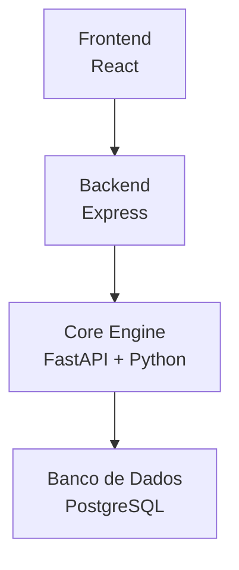
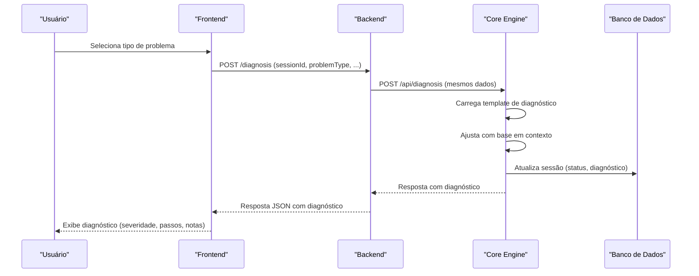
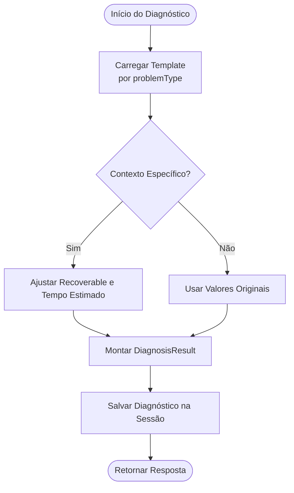
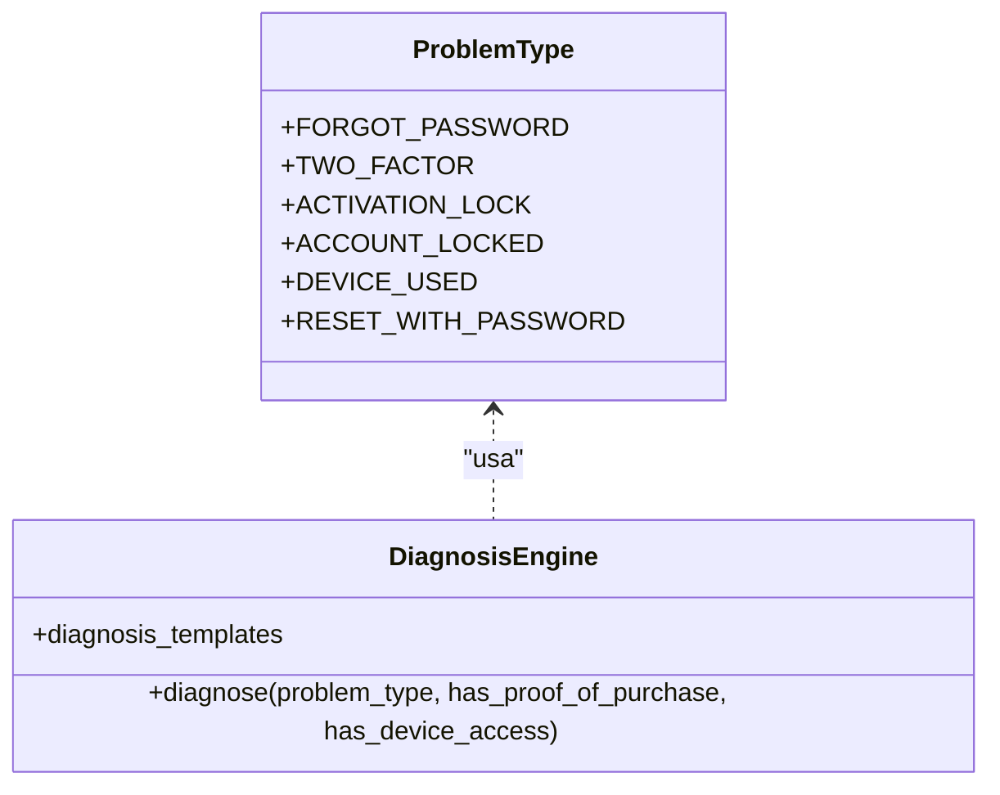
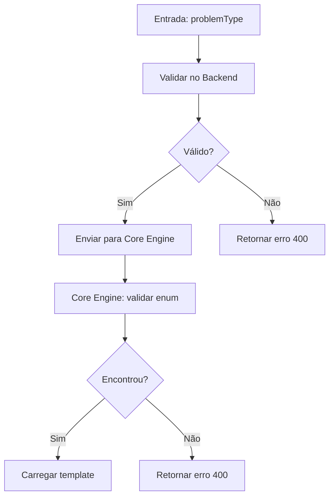

# Templates de Diagnóstico

<cite>
**Arquivos referenciados neste documento**
- [README.md](file://README.md)
- [backend/src/routes/diagnosis.js](file://backend/src/routes/diagnosis.js)
- [core-engine/bridge/api.py](file://core-engine/bridge/api.py)
- [core-engine/python/main.py](file://core-engine/python/main.py)
- [frontend/src/pages/RecoveryFlow.js](file://frontend/src/pages/RecoveryFlow.js)
- [database/schema.sql](file://database/schema.sql)
- [database/migrations/001_initial_schema.sql](file://database/migrations/001_initial_schema.sql)
- [backend/package.json](file://backend/package.json)
</cite>

## Sumário
1. [Introdução](#introdução)
2. [Estrutura do Projeto](#estrutura-do-projeto)
3. [Componentes-Chave](#componentes-chave)
4. [Visão Geral da Arquitetura](#visão-geral-da-arquitetura)
5. [Análise Detalhada dos Componentes](#análise-detalhada-dos-componentes)
6. [Análise de Dependências](#análise-de-dependências)
7. [Considerações de Desempenho](#considerações-de-desempenho)
8. [Guia de Solução de Problemas](#guia-de-solução-de-problemas)
9. [Conclusão](#conclusão)
10. [Apêndice](#apêndice)

## Introdução
Este documento apresenta uma documentação detalhada sobre o sistema de templates de diagnóstico do projeto. Ele explica como os templates são estruturados, quais campos são obrigatórios e opcionais, como são carregados e processados, e como o sistema permite personalização e extensibilidade para novos tipos de problemas. Além disso, mostra como os templates influenciam a geração dos resultados finais exibidos ao usuário.

## Estrutura do Projeto
O sistema de diagnóstico é composto por três camadas principais:
- Frontend (React): Interface de usuário que coleta dados e exibe o diagnóstico.
- Backend (Node.js): Roteamento e proxy para o Core Engine.
- Core Engine (Python): Lógica central de diagnóstico baseada em templates.

**Diagrama fonte**
- [frontend/src/pages/RecoveryFlow.js:88-106](file://frontend/src/pages/RecoveryFlow.js#L88-L106)
- [backend/src/routes/diagnosis.js:14-69](file://backend/src/routes/diagnosis.js#L14-L69)
- [core-engine/bridge/api.py:251-282](file://core-engine/bridge/api.py#L251-L282)
- [database/schema.sql:22-51](file://database/schema.sql#L22-L51)

**Seção fonte**
- [README.md:19-29](file://README.md#L19-L29)

## Componentes-Chave
- Templates de diagnóstico: Definições fixas de estrutura de diagnóstico para cada tipo de problema.
- Motor de diagnóstico: Processa os templates e aplica regras contextuais.
- Roteamento de diagnóstico: Valida entradas e encaminha para o Core Engine.
- Interface de usuário: Exibe o diagnóstico processado com severidade, passos e observações.

**Seção fonte**
- [core-engine/python/main.py:76-212](file://core-engine/python/main.py#L76-L212)
- [backend/src/routes/diagnosis.js:14-69](file://backend/src/routes/diagnosis.js#L14-L69)
- [frontend/src/pages/RecoveryFlow.js:274-334](file://frontend/src/pages/RecoveryFlow.js#L274-L334)

## Visão Geral da Arquitetura
O fluxo de diagnóstico segue estas etapas:
1. O frontend coleta o tipo de problema e parâmetros.
2. O backend valida os dados e chama o Core Engine.
3. O Core Engine aplica o template correspondente e ajusta com base em contexto.
4. O resultado é retornado e exibido ao usuário com severidade, passos e notas.

**Diagrama fonte**
- [frontend/src/pages/RecoveryFlow.js:88-106](file://frontend/src/pages/RecoveryFlow.js#L88-L106)
- [backend/src/routes/diagnosis.js:14-69](file://backend/src/routes/diagnosis.js#L14-L69)
- [core-engine/bridge/api.py:251-282](file://core-engine/bridge/api.py#L251-L282)
- [core-engine/python/main.py:296-326](file://core-engine/python/main.py#L296-L326)
- [database/schema.sql:22-51](file://database/schema.sql#L22-L51)

## Análise Detalhada dos Componentes

### Estrutura de Templates de Diagnóstico
Os templates são definidos como dicionários dentro do motor de diagnóstico. Cada template contém:
- type: Nome legível do tipo de problema.
- severity: Nível de severidade (baixo, médio, alto).
- recoverable: Indica se o problema pode ser resolvido.
- requires_apple_support: Se a resolução precisa de suporte oficial.
- estimated_time: Estimativa de tempo para resolução.
- steps: Lista de passos recomendados.
- notes: Observações adicionais (opcional).

Exemplos de templates incluem:
- Senha Esquecida
- Verificação em 2 Etapas
- Bloqueio de Ativação (iCloud)
- Conta Inacessível
- Dispositivo Usado Comprado
- Reset Profissional com Senha iCloud

Esses templates são carregados diretamente no motor de diagnóstico e podem ser alterados ou expandidos para novos tipos de problemas.

**Seção fonte**
- [core-engine/python/main.py:80-167](file://core-engine/python/main.py#L80-L167)

### Campos Obrigatórios e Opcionais
- Opcional: has_proof_of_purchase (boolean), has_device_access (boolean)
- Obrigatórios: sessionId (UUID), problemType (string, válido)

A validação ocorre no backend e no Core Engine, garantindo que apenas tipos válidos sejam aceitos.

**Seção fonte**
- [backend/src/routes/diagnosis.js:15-26](file://backend/src/routes/diagnosis.js#L15-L26)
- [core-engine/python/main.py:296-303](file://core-engine/python/main.py#L296-L303)

### Padrões de Formatação
- problemType: valores aceitos são fixos e validados.
- Severity: enumeração com valores baixo, médio, alto.
- DiagnosisResult: estrutura padronizada com campos acima mencionados.
- Respostas: JSON com diagnosis contendo os campos formatados.

**Seção fonte**
- [backend/src/routes/diagnosis.js:72-79](file://backend/src/routes/diagnosis.js#L72-L79)
- [core-engine/python/main.py:52-62](file://core-engine/python/main.py#L52-L62)
- [core-engine/bridge/api.py:67-71](file://core-engine/bridge/api.py#L67-L71)

### Como os Templates São Carregados e Processados
- Carregamento: Os templates são armazenados em um dicionário no motor de diagnóstico.
- Processamento: O motor seleciona o template com base no problemType, aplica ajustes contextuais (ex: Bloqueio de Ativação com ou sem comprovante) e retorna um objeto DiagnosisResult.
- Persistência: O diagnóstico é salvo na sessão no banco de dados.

**Diagrama fonte**
- [core-engine/python/main.py:185-212](file://core-engine/python/main.py#L185-L212)
- [core-engine/python/main.py:310-326](file://core-engine/python/main.py#L310-L326)

**Seção fonte**
- [core-engine/python/main.py:76-212](file://core-engine/python/main.py#L76-L212)
- [core-engine/python/main.py:296-326](file://core-engine/python/main.py#L296-L326)

### Personalização de Templates e Adição de Novos Tipos
- Para adicionar um novo tipo de problema:
  1. Acrescentar um novo valor ao enum ProblemType.
  2. Adicionar um novo template no dicionário diagnosis_templates.
  3. Garantir que o frontend e backend aceitem o novo problemType.
- Ajustes contextuais podem ser feitos no método diagnose para refletir condições específicas.

**Diagrama fonte**
- [core-engine/python/main.py:35-42](file://core-engine/python/main.py#L35-L42)
- [core-engine/python/main.py:80-167](file://core-engine/python/main.py#L80-L167)
- [core-engine/python/main.py:169-212](file://core-engine/python/main.py#L169-L212)

**Seção fonte**
- [core-engine/python/main.py:35-42](file://core-engine/python/main.py#L35-L42)
- [core-engine/python/main.py:80-167](file://core-engine/python/main.py#L80-L167)

### Exemplos de Templates Completos
- Senha Esquecida: Baixa severidade, totalmente recuperável, sem necessidade de suporte Apple, com passos para redefinição e observação sobre acesso ao e-mail.
- Bloqueio de Ativação: Alta severidade; se houver comprovante de compra, se torna recuperável com tempo estimado maior; sem comprovante, não recuperável.
- Reset Profissional com Senha iCloud: Baixa severidade, passos detalhados para sair da conta e redefinir o dispositivo.

**Seção fonte**
- [core-engine/python/main.py:80-167](file://core-engine/python/main.py#L80-L167)

### Estruturas de Dados Esperadas
- Entrada de diagnóstico: sessionId, problemType, has_proof_of_purchase, has_device_access.
- Saída de diagnóstico: diagnosis com type, severity, recoverable, requires_apple_support, estimated_time, steps, notes.
- Status da sessão: armazena o diagnóstico em formato JSONB.

**Seção fonte**
- [core-engine/bridge/api.py:46-51](file://core-engine/bridge/api.py#L46-L51)
- [core-engine/bridge/api.py:67-71](file://core-engine/bridge/api.py#L67-L71)
- [database/schema.sql:22-51](file://database/schema.sql#L22-L51)

### Influência dos Templates nos Resultados Finais
- Os templates determinam a severidade, tempo estimado, passos e observações exibidos.
- A lógica contextual (ex: Bloqueio de Ativação) altera dinamicamente os campos recoverable e estimated_time com base em has_proof_of_purchase.

**Seção fonte**
- [core-engine/python/main.py:193-200](file://core-engine/python/main.py#L193-L200)
- [frontend/src/pages/RecoveryFlow.js:284-331](file://frontend/src/pages/RecoveryFlow.js#L284-L331)

## Análise de Dependências
- Backend depende do Core Engine via requisição HTTP.
- Core Engine depende do banco de dados para persistência de sessões e diagnósticos.
- Frontend depende do backend para obter diagnósticos e exibi-los.

**Diagrama fonte**
- [backend/src/routes/diagnosis.js:42-49](file://backend/src/routes/diagnosis.js#L42-L49)
- [core-engine/bridge/api.py:251-282](file://core-engine/bridge/api.py#L251-L282)
- [database/schema.sql:22-51](file://database/schema.sql#L22-L51)

**Seção fonte**
- [backend/src/routes/diagnosis.js:12-12](file://backend/src/routes/diagnosis.js#L12-L12)
- [backend/package.json:23-46](file://backend/package.json#L23-L46)

## Considerações de Desempenho
- O Core Engine carrega templates em memória, o que garante baixa latência nas consultas.
- A persistência do diagnóstico no banco de dados é feita após o processamento, minimizando impacto no tempo de resposta.
- Recomenda-se manter os templates otimizados e evitando grandes estruturas desnecessárias.

## Guia de Solução de Problemas
- Erro de tipo inválido: O backend e o Core Engine validam o problemType. Verifique se o valor está entre os permitidos.
- Erro de sessão não encontrada: Certifique-se de que a sessionId é válida e foi criada previamente.
- Falha ao registrar consentimento: Confira se o Core Engine está inicializado e se o endpoint está acessível.

**Seção fonte**
- [backend/src/routes/diagnosis.js:27-33](file://backend/src/routes/diagnosis.js#L27-L33)
- [core-engine/bridge/api.py:261-262](file://core-engine/bridge/api.py#L261-L262)
- [core-engine/python/main.py:306-308](file://core-engine/python/main.py#L306-L308)

## Conclusão
O sistema de templates de diagnóstico é uma parte central e altamente extensível do projeto. Ele permite uma resposta padronizada e informativa ao usuário, com capacidade de personalização e expansão para novos tipos de problemas. A separação entre frontend, backend e Core Engine proporciona clareza, manutenibilidade e escalabilidade.

## Apêndice

### Fluxo de Validação de Tipo de Problema

**Diagrama fonte**
- [backend/src/routes/diagnosis.js:109-137](file://backend/src/routes/diagnosis.js#L109-L137)
- [core-engine/python/main.py:296-303](file://core-engine/python/main.py#L296-L303)

### Exemplo de Persistência de Diagnóstico
- O campo diagnosis na tabela sessions armazena o diagnóstico em formato JSONB, facilitando consultas e exibições futuras.

**Seção fonte**
- [database/schema.sql:39-39](file://database/schema.sql#L39-L39)